# Amines & Amino Acids — High-Yield Notes

---

# Q1. Amines

## (i) 1°, 2°, 3° Amines — Definitions

| Class | Definition | General Formula |
|---|---|---|
| **1° (Primary)** | One H of NH₃ replaced by alkyl/aryl group | R–NH₂ |
| **2° (Secondary)** | Two H's of NH₃ replaced | R₂NH |
| **3° (Tertiary)** | All three H's of NH₃ replaced | R₃N |

**Structural examples (condensed formula + SMILES):**

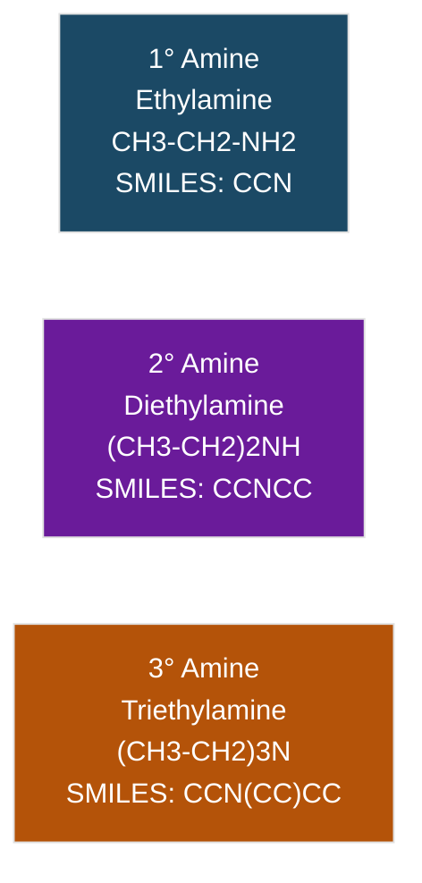

- N in 1°/2° amines bears 1–2 H atoms → can H-bond (N–H); 3° amines cannot donate H-bonds.
- Basicity order (gas phase / aqueous, aliphatic): generally 2° > 1° > 3° > NH₃ in water (steric + solvation effects).

---

## (ii) Separation of 1°, 2°, 3° Amines — Hinsberg Method

**Principle:** Benzenesulfonyl chloride (C₆H₅SO₂Cl) reacts differently with each class.

| Amine | Product with C₆H₅SO₂Cl | Solubility in KOH(aq) |
|---|---|---|
| 1° | R–NH–SO₂C₆H₅ (has acidic N–H) | **Soluble** (forms salt) |
| 2° | R₂N–SO₂C₆H₅ (no N–H) | **Insoluble** |
| 3° | No reaction (just forms soluble salt with excess acid, unreacted amine) | Separates as free amine (immiscible layer / insoluble in base but extractable by dil. HCl) |

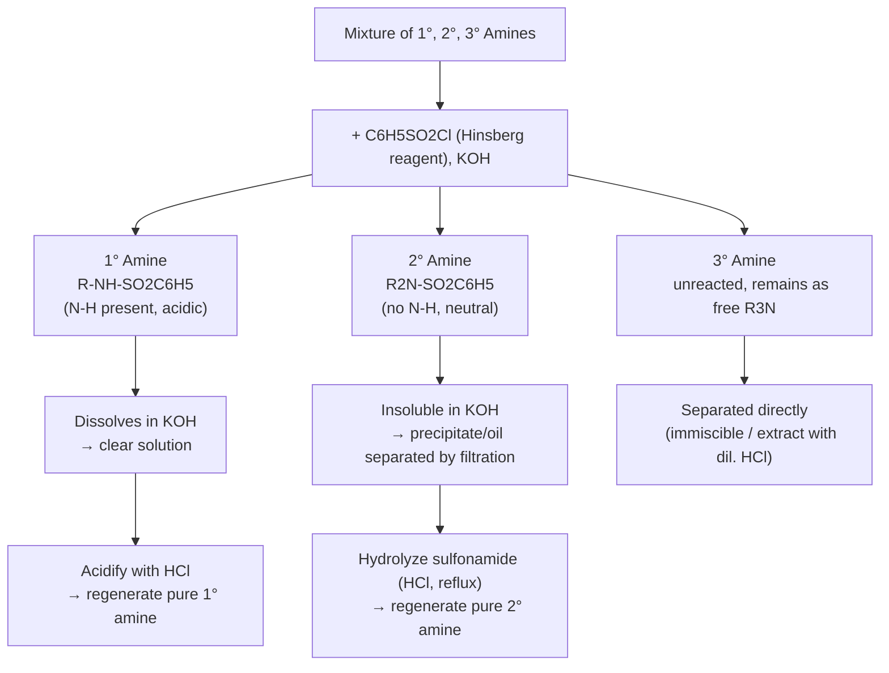

**Reagents/conditions:** C₆H₅SO₂Cl / KOH(aq), shake; separate by filtration (2° ppt); acidify filtrate (1° salt) with HCl to regenerate amine; hydrolyze 2° sulfonamide with conc. HCl on reflux.

---

## (iii) Named Reactions

### Sandmeyer Reaction
Aryl diazonium salt → aryl halide, using **Cu(I) catalyst**.

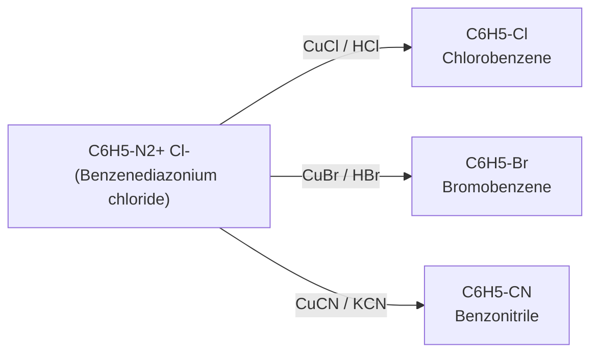

### Gattermann Reaction
Same transformation but uses **Cu powder + HX** directly (no separate cuprous salt needed).

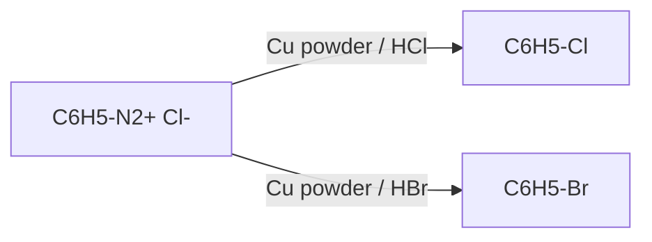
*(Sandmeyer = Cu salt; Gattermann = Cu dust — mechanistically both proceed via aryl free radical.)*

### Coupling Reaction (Azo dye formation)
Diazonium salt + activated arene (phenol/aniline) → **azo compound**.

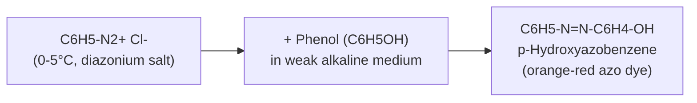

### Sulfa Drug (Sulfanilamide) Synthesis
From aniline via acetylation → sulfonation → hydrolysis (protect –NH₂ first, since it would also react with ClSO₃H otherwise).

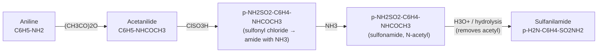

### Hofmann Bromamide Degradation
1° amide → 1° amine with **loss of one carbon** (Br₂/NaOH).

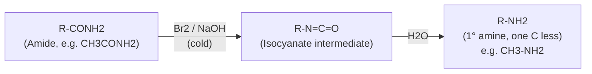
Mechanism: amide → N-bromoamide → nitrene/isocyanate (via Curtius-type rearrangement) → carbamic acid → amine + CO₂.

### Curtius Degradation
Acyl azide → isocyanate → amine (thermal, via nitrene), one carbon lost.

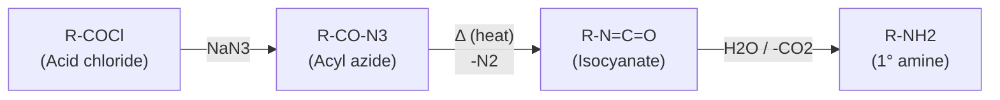

---

# Q2. Amino Acids and Proteins

## (i) Definitions

| Term | Definition | Example |
|---|---|---|
| **Protein** | Polymer of amino acids linked by peptide bonds, folded into 3D structure | Insulin, Hemoglobin |
| **Amino acid** | Organic acid with –NH₂ and –COOH groups | Glycine (H₂N–CH₂–COOH) |
| **Essential AA** | Cannot be synthesized by body; must come from diet | Leucine, Lysine, Valine |
| **Non-essential AA** | Body can synthesize | Glycine, Alanine, Glutamic acid |
| **Zwitterion** | Dipolar ion — amino acid exists with –NH₃⁺ and –COO⁻ simultaneously | Glycine zwitterion |
| **Isoelectric point (pI)** | pH at which amino acid has net zero charge (exists fully as zwitterion) | Glycine pI ≈ 5.97 |
| **Peptide linkage** | Amide bond (–CO–NH–) formed between –COOH of one AA and –NH₂ of another | Gly–Ala bond |

**Zwitterion structure (Glycine):**

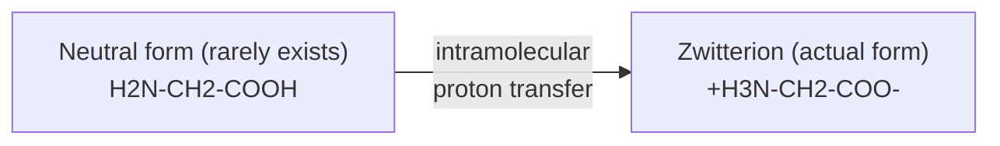
SMILES: `[NH3+]CC(=O)[O-]`

**Peptide linkage structure:**

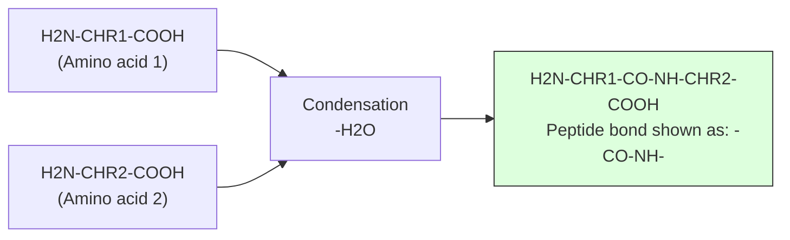

---

## (ii) Synthesis of α-Amino Acids — Strecker Synthesis

Aldehyde + NH₃ + HCN → α-amino nitrile → hydrolysis → α-amino acid.

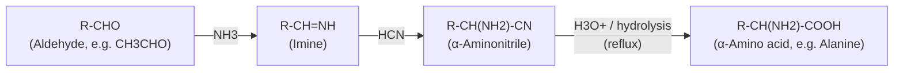

*(Gabriel–phthalimide route is used mainly for simple 1° amines, not typically for amino acids directly — Strecker is the standard α-amino acid route.)*

---

## (iii) End Group Analysis of Peptides

### Sanger's Method (N-terminal identification)
Uses **1-fluoro-2,4-dinitrobenzene (FDNB/Sanger's reagent)**.

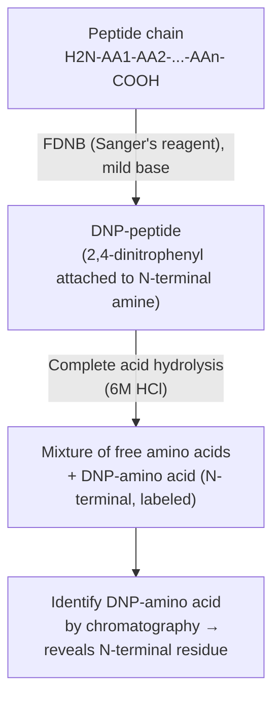

### Edman Degradation (sequential N-terminal removal — preferred, repeatable)
Uses **phenyl isothiocyanate (PITC)**.

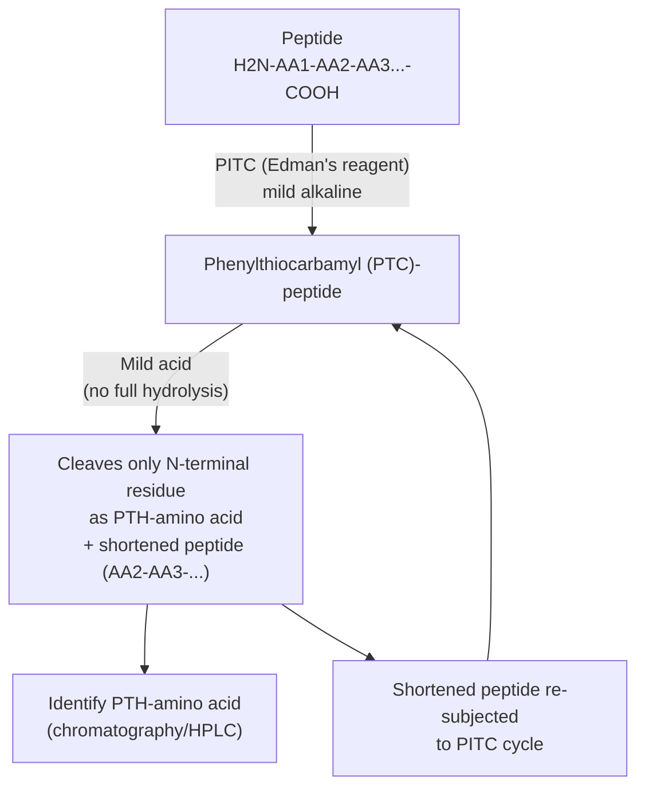
**Key advantage:** peptide is shortened by only 1 residue per cycle → allows full sequential sequencing (unlike Sanger's, which needs full hydrolysis and only gives N-terminal residue).

---

## (iv) Synthesis of Gly-Ala Dipeptide

**Structure of Gly-Ala:**
```
H2N-CH2-CO-NH-CH(CH3)-COOH
   (Gly residue)   (Ala residue)
```
SMILES: `NCC(=O)NC(C)C(=O)O`

**Synthesis scheme (protect/activate/couple/deprotect strategy):**

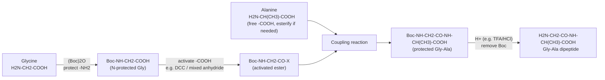

**Why protect first:** free –NH₂ of glycine would otherwise self-condense; protecting group (Boc) blocks it during coupling, then is removed after peptide bond forms.

---

## (v) Essential vs Non-Essential Amino Acids

| Feature | Essential | Non-Essential |
|---|---|---|
| Synthesis by body | Cannot be synthesized | Can be synthesized (from metabolic intermediates) |
| Source | Must be obtained from diet | Diet not strictly required |
| Examples | Leucine, Isoleucine, Valine, Lysine, Threonine, Methionine, Phenylalanine, Tryptophan, Histidine* | Glycine, Alanine, Serine, Glutamic acid, Aspartic acid, Proline |
| Deficiency effect | Growth retardation, health disorders if missing from diet | Rarely causes deficiency disease |
| Number (humans) | 9 | 11 |

*Histidine essential in infants/growing children.
