# CT-2 — CHEM 103: Amines, Carbohydrates, Amino Acids & Dyes

Worked solutions for both question sets of Class Test 2. Each question is
followed by a full explanatory answer, with structures/mechanisms shown as
diagrams (not condensed text formulas) and logical/procedural steps shown as
Mermaid flowcharts. Click **Show answer** to reveal each solution and self-test.

---

## SET-A · Q1 — 1°/2°/3° amines: definition, separation, and named reactions [5]

<strong>Show answer</strong>

### (a) What is a 1°, 2°, and 3° amine?

Amines are classified **by the number of carbon (alkyl/aryl) groups bonded
directly to the nitrogen atom** — not by how many carbons are in the whole
molecule.

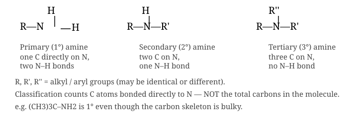

- **Primary (1°) amine** — one C–N bond, two N–H bonds: R–NH₂
- **Secondary (2°) amine** — two C–N bonds, one N–H bond: R₂NH
- **Tertiary (3°) amine** — three C–N bonds, no N–H bond: R₃N

A common trap: a bulky primary amine like *tert*-butylamine, (CH₃)₃C–NH₂, is
still **1°** because only one carbon sits directly on nitrogen — the
"tert-butyl" label describes that carbon's own substitution, not the amine's.

### (b) Separating a mixture of 1°, 2°, 3° amines — the Hinsberg method

The Hinsberg test exploits a simple fact: when each amine reacts with
benzenesulfonyl chloride (C₆H₅SO₂Cl), only the products from 1° and 2°
amines retain an N–H bond, and only a sulfonamide **with** an N–H is acidic
enough to dissolve as its potassium salt in aqueous KOH. 3° amines cannot
react at all (no N–H to substitute), so they simply remain as a separate,
water-insoluble oily amine.

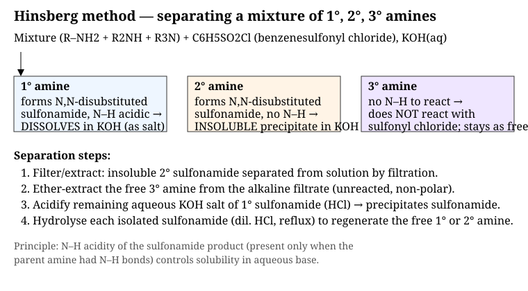

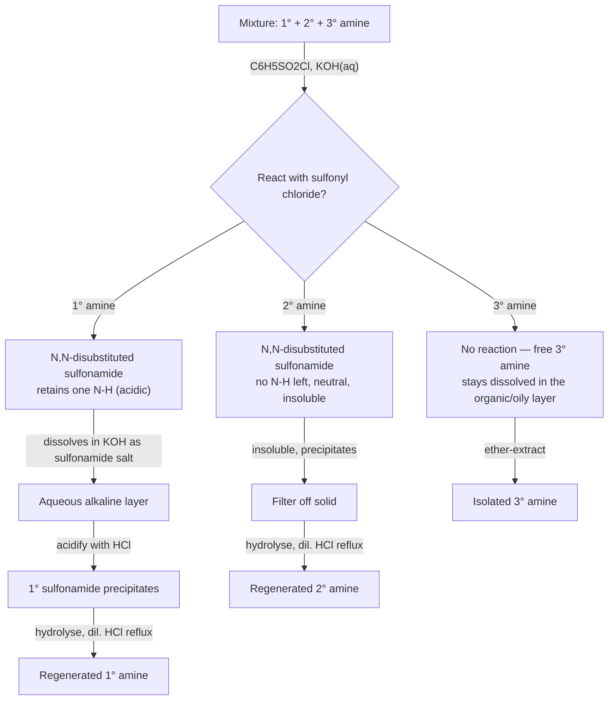

**Steps in words:**
1. Treat the mixture with C₆H₅SO₂Cl in the presence of KOH.
2. **Filter** — the insoluble 2° sulfonamide is removed as a solid.
3. **Ether-extract** the filtrate — the unreacted 3° amine partitions into
   the ether layer (it was never derivatised).
4. **Acidify** the remaining aqueous KOH layer with HCl — the 1°
   sulfonamide (present as its soluble potassium salt) precipitates back out.
5. **Hydrolyse** each isolated sulfonamide separately (reflux with dilute
   HCl or aqueous NaOH) to cleave the S–N bond and regenerate the free 1° or
   2° amine.

### (c) Named reactions

**(i) Sandmeyer and Gattermann reactions**

Both convert an aryl diazonium salt, formed from a primary aromatic amine
(Ar–NH₂ → Ar–N₂⁺Cl⁻ via NaNO₂/HCl at 0–5 °C), into an aryl halide or
nitrile.

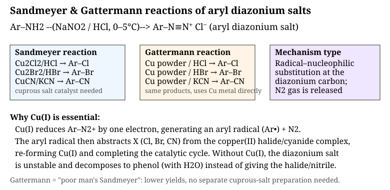

- **Sandmeyer reaction**: the diazonium salt is treated with a **cuprous
  salt** (Cu₂Cl₂/HCl, Cu₂Br₂/HBr, or CuCN/KCN). Cu(I) reduces Ar–N₂⁺ by one
  electron to give an aryl radical + N₂; the radical then abstracts the
  halide/cyanide from a Cu(II) complex, regenerating Cu(I) — a radical
  chain, catalytic in copper.
- **Gattermann reaction**: the same transformations, but using **copper
  powder** directly instead of a pre-formed cuprous salt. Mechanistically
  similar (Cu⁰ is oxidised in situ to Cu(I)), simpler to set up, but
  generally lower-yielding.

Without the copper catalyst, the diazonium salt is far more likely to
decompose in water to give phenol instead.

**(ii) Coupling reaction and a sulfa drug**

In **coupling**, the diazonium ion — a weak electrophile — attacks the
strongly activated *para* position of an electron-rich arene (phenol or an
N,N-dialkylaniline) in an electrophilic aromatic substitution, forming a
brightly coloured **azo compound**, Ar–N=N–Ar′. This –N=N– azo linkage is
the chromophore behind essentially all azo dyes.

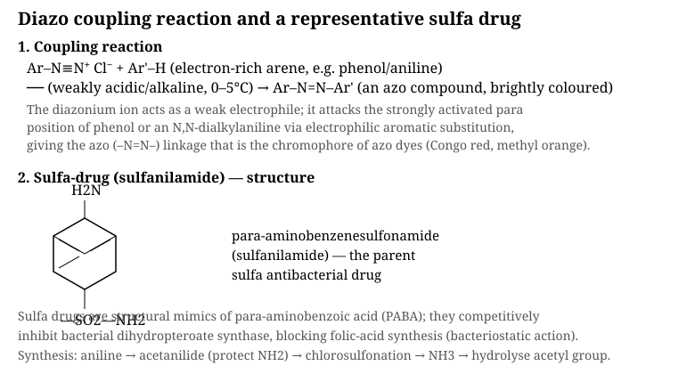

**Sulfa drugs** are unrelated to the azo dye chemistry directly but are
made from the same diazonium/amine chemistry family of anilines.
**Sulfanilamide** (*p*-aminobenzenesulfonamide) is the parent compound: made
from aniline via acetylation (protecting the amine), chlorosulfonation,
reaction with ammonia, then deacetylation. It is a structural mimic of
*p*-aminobenzoic acid (PABA) and competitively inhibits bacterial folate
synthesis (dihydropteroate synthase) — a bacteriostatic mechanism that
exploits a pathway absent in humans.

**(iii) Hofmann and Curtius degradations**

Both reactions convert an acyl derivative into an amine with **one fewer
carbon**, passing through an isocyanate intermediate — but they start from
different acyl derivatives and use different driving forces.

**Hofmann bromamide degradation**: a 1° amide, R–CONH₂, is treated with
Br₂/NaOH. N-bromination gives R–CO–NHBr; base removes the remaining N–H,
and in a **concerted** step the R group migrates from carbon to the
electron-deficient nitrogen as Br⁻ departs, giving the isocyanate R–N=C=O.
Hydrolysis of the isocyanate gives an unstable carbamic acid, which loses
CO₂ to give R–NH₂.

**Curtius degradation**: an acyl azide, R–CO–N₃ (from R–COCl + NaN₃, or
from the hydrazide + HNO₂), is simply **heated**. Loss of the very stable N₂
gas drives a concerted 1,2-shift of R from carbon to nitrogen — directly
analogous to the Hofmann rearrangement's key step — again giving R–N=C=O,
which is hydrolysed to R–NH₂ + CO₂ (or trapped with an alcohol to isolate a
stable carbamate, useful for N-protection in peptide synthesis).

In both cases the migrating group R retains its configuration, because it
never exists as a free carbocation, radical, or nitrene — the migration and
the leaving-group departure are concerted.

---

## SET-A · Q2 — Asymmetric carbon, mutarotation, sugar structures, chain length [5]

<strong>Show answer</strong>

### (i) Asymmetric carbon atom and mutarotation

An **asymmetric (chiral) carbon** is one bonded to four different groups —
it has no internal symmetry, so its mirror image is non-superimposable,
making the molecule optically active. In an open-chain aldohexose like
glucose, C2, C3, C4, and C5 are all asymmetric.

**Mutarotation** is the spontaneous change in specific optical rotation
observed when a pure crystalline anomer of a sugar (α or β) is dissolved in
water, as it equilibrates (via the open-chain form) to a fixed mixture of
both anomers. Freshly dissolved α-D-glucose ([α]D = +112°) drifts to an
equilibrium value of +52.7°, matching what β-D-glucose ([α]D = +18.7°)
also drifts to from the other direction — because both interconvert through
the same open-chain intermediate.

### (ii) Cyclic structures of D-glucose, sucrose, cellulose and starch

**D-glucose** — open chain (Fischer) and cyclic (Haworth) forms:

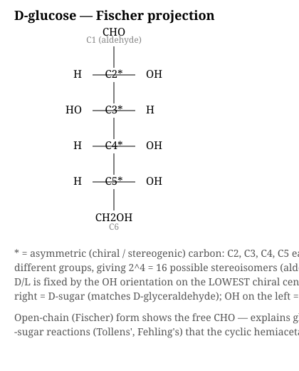

The ring forms when the C5 hydroxyl oxygen attacks the C1 aldehyde
intramolecularly, forming a six-membered (pyranose) hemiacetal ring and
creating a **new** stereocentre at C1 — the anomeric carbon. OH below the
ring plane in the standard Haworth orientation = **α**-anomer; OH above =
**β**-anomer.

**Sucrose** — a non-reducing disaccharide, α-D-glucopyranosyl-(1→2)-β-D-
fructofuranoside:

Unusually, the glycosidic bond joins the **anomeric carbons of both**
sugars (glucose C1 and fructose C2), so neither ring can re-open to a free
carbonyl — sucrose gives a negative Fehling's/Tollens' test and shows no
mutarotation, unlike most other disaccharides (e.g. maltose, lactose).

**Cellulose** — repeat unit is cellobiose, joined by **β-1,4** glycosidic
bonds:

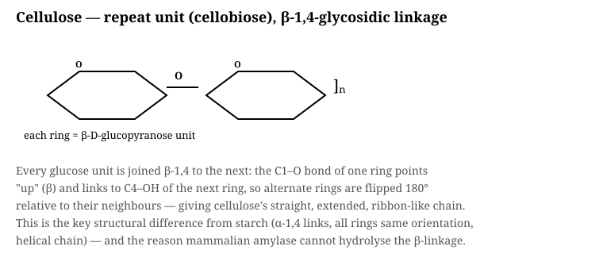

The β-linkage forces alternate glucose rings to flip 180° relative to their
neighbours, producing cellulose's straight, extended, hydrogen-bonded
ribbon structure — and is why mammalian digestive amylases (which are
α-1,4-specific) cannot hydrolyse it.

**Starch** — amylose (linear, α-1,4) and amylopectin (branched, α-1,4 +
α-1,6):

All-α linkages keep every ring in the same orientation, so the amylose
chain coils into a left-handed helix; this helical channel binds I₂
molecules, giving starch's characteristic deep blue-black colour with
iodine (a test that distinguishes it from cellulose, which gives no such
colour).

### (iii) Converting an aldose to the next higher/lower aldose

**Chain extension — Kiliani–Fischer synthesis** (Cₙ → Cₙ₊₁):

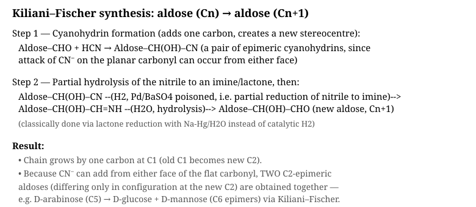

HCN adds across the C1 aldehyde to give a cyanohydrin (a new stereocentre
at what becomes C2, formed as a pair of epimers since CN⁻ can attack either
face of the planar carbonyl). Partial reduction of the nitrile to an imine,
followed by hydrolysis, unmasks a new terminal aldehyde — one carbon longer
than the starting sugar, and obtained as a pair of C2-epimeric products
(e.g. D-arabinose → D-glucose + D-mannose).

**Chain shortening — Ruff degradation** (Cₙ → Cₙ₋₁):

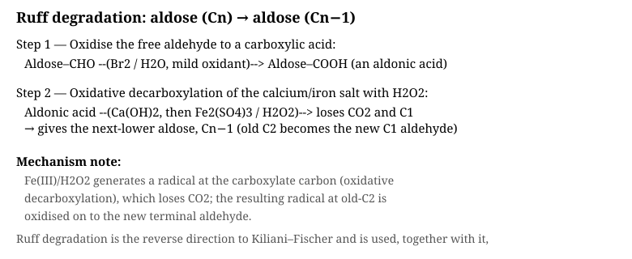

The aldehyde is first oxidised (Br₂/H₂O) to an aldonic acid. Oxidative
decarboxylation of its calcium salt with H₂O₂/Fe₂(SO₄)₃ then removes CO₂
and the old C1, exposing the old C2 as the new terminal aldehyde — one
carbon shorter.

### (iv) Determining the ring size of D-glucose

The pyranose (6-membered) ring size of glucose was established classically
by **exhaustive methylation followed by hydrolysis**:

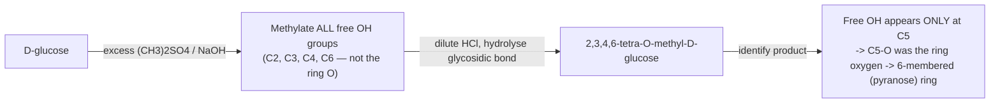

Because methylation occurs on every free hydroxyl **before** the ring is
opened, the one position that is *not* methylated in the hydrolysis product
must have been tied up in the ring (as the hemiacetal linkage to C1).
Finding free –OH specifically at C5 (not C4) in the hydrolysis product
proved a six-membered pyranose ring rather than a five-membered furanose
ring. (This method — Haworth methylation — was later corroborated by
periodate oxidation studies and, in modern practice, by NMR/X-ray data.)

---

## SET-B · Q1 — Amino acids, peptides, end-group analysis [5]

<strong>Show answer</strong>

### (i) Key terms

- **Protein**: a large biopolymer built from α-amino acids linked by
  peptide bonds, folded into a specific secondary/tertiary structure that
  gives it biological function.
- **Amino acid**: a molecule bearing both an amino group (–NH₂) and a
  carboxyl group (–COOH), typically on the same (α) carbon in the
  biologically relevant series.
- **Essential amino acid**: cannot be synthesised by the human body at a
  rate sufficient for its needs and must be obtained from the diet (e.g.
  leucine, lysine, valine).
- **Non-essential amino acid**: can be synthesised endogenously from other
  metabolites (e.g. alanine, glutamate, glycine).
- **Zwitterion**: the dipolar form of an amino acid, –NH₃⁺ and –COO⁻
  co-existing on the same molecule, net charge zero — the dominant form in
  the solid state and near-neutral solution.
- **Isoelectric point (pI)**: the pH at which an amino acid's net charge is
  zero (it exists predominantly as the zwitterion and does not migrate in
  an electric field).
- **Peptide linkage**: the amide bond (–CO–NH–) formed between the
  α-carboxyl of one amino acid and the α-amino of the next.

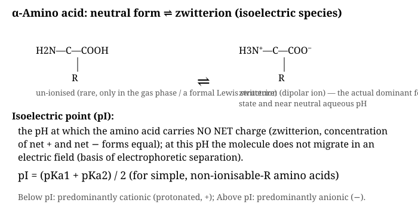

### (ii) Synthesis of an α-amino acid — Strecker synthesis

The classic laboratory route is the **Strecker synthesis**:

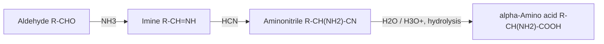

The aldehyde condenses with ammonia to form an imine; HCN then adds across
the C=N bond (analogous to cyanohydrin formation) to give an
α-aminonitrile; acidic hydrolysis of the nitrile converts –CN to –COOH,
giving the racemic α-amino acid.

### (iii) End-group analysis of peptides

Two complementary chemical methods identify the two ends of a peptide
chain — the N-terminal and C-terminal residues:

**N-terminal — Edman degradation** (repeatable, sequencing method):

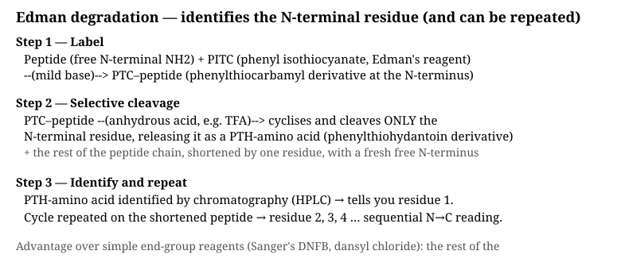

Phenyl isothiocyanate (PITC) labels the free N-terminal amino group under
mild base; anhydrous acid then selectively cleaves *only* that N-terminal
residue, releasing it as an identifiable PTH-amino acid while leaving the
rest of the peptide intact with a fresh N-terminus — so the cycle can be
repeated to read off residues one at a time, N→C. (Sanger's reagent,
2,4-dinitrofluorobenzene, and dansyl chloride are older, non-repeatable
N-terminal tagging alternatives — useful for a single identification but
not for sequencing.)

**C-terminal — hydrazinolysis (Akabori method)**:

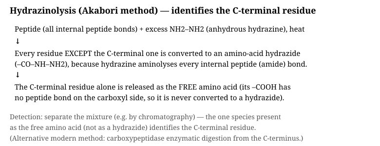

Excess anhydrous hydrazine aminolyses every internal peptide bond,
converting every residue except the C-terminal one into an amino-acid
hydrazide. Only the C-terminal residue — which has no peptide bond on its
carboxyl side — is released as the **free amino acid**, identifying it by
elimination/separation from the hydrazide mixture.

### (iv) Synthesis of the Gly-Ala peptide

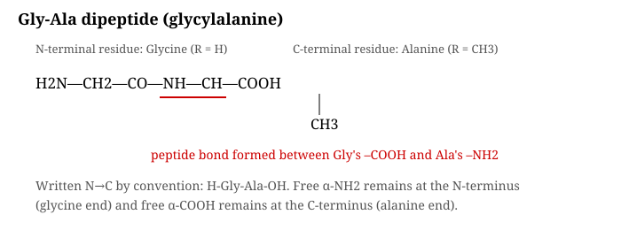

To couple two different amino acids selectively (avoiding self-condensation
or wrong-end coupling), the amino group of glycine is first **protected**
(e.g. as its carbobenzoxy, Cbz, or *tert*-butoxycarbonyl, Boc, derivative),
its carboxyl group is **activated** (e.g. as an acid chloride or mixed
anhydride), and it is then condensed with the free amino group of alanine
methyl (or benzyl) ester. Final deprotection (mild hydrolysis or
hydrogenolysis) removes the protecting groups from both ends, giving free
Gly-Ala with an intact peptide bond between glycine's carboxyl and
alanine's amino group.

### (v) Essential vs non-essential amino acids — key difference

| | Essential | Non-essential |
|---|---|---|
| Body synthesis | Cannot be made (or not fast enough) | Can be synthesised endogenously |
| Source | Must come from diet | Diet or internal metabolism |
| Examples | Leucine, Lysine, Valine, Threonine | Alanine, Glycine, Glutamate, Serine |
| Deficiency risk | Yes, if diet lacking | Rare |

---

## SET-B · Q2 — Colour, dyes, pigments, and dye classification [5]

<strong>Show answer</strong>

### (i) Key terms

- **Colour**: the perceptual response to visible light (≈380–750 nm)
  selectively absorbed and reflected/transmitted by a substance; arises
  from electronic transitions (usually π→π* or n→π*) in conjugated
  systems.
- **Dye**: a coloured, usually organic, compound that can be applied to
  and retained by a substrate (fibre, fabric) — typically water-soluble or
  solubilised during application, forming chemical or physical bonds with
  the substrate.
- **Pigment**: a coloured compound (organic or inorganic) that is
  insoluble in the application medium and imparts colour by remaining
  dispersed as fine particles (e.g. paints, printing inks, plastics), as
  opposed to dissolving and bonding like a dye.
- **Chromophore group**: an unsaturated, conjugated functional group
  (e.g. –N=N– azo, >C=O carbonyl, >C=C<) that is primarily responsible for
  a molecule's light absorption in the visible region.
- **Auxochrome group**: an electron-donating or -withdrawing substituent
  (e.g. –NH₂, –OH, –NMe₂, –SO₃H) that, attached to a chromophore-bearing
  system, shifts and intensifies the absorbed colour and often confers
  water-solubility or fibre affinity, without itself being coloured.

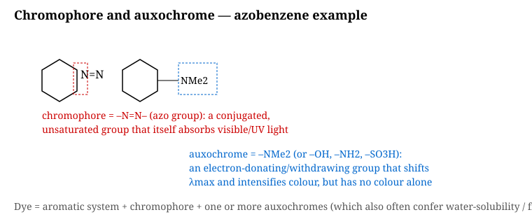

- **Dye intermediate**: a simpler organic compound (typically derived from
  benzene, naphthalene, or anthracene) used as a building block to
  synthesise a finished dye — e.g. aniline, naphthionic acid, benzidine.
- **Raw materials for dye manufacture**: primarily coal-tar/petrochemical
  aromatics (benzene, toluene, naphthalene, anthracene) converted through
  nitration, reduction, sulfonation, and diazotisation/coupling sequences
  into intermediates and then finished dyes.

### (ii) Three named dyes, structure, and class

**Congo red** — a direct (substantive), disazo (bis-azo) dye:

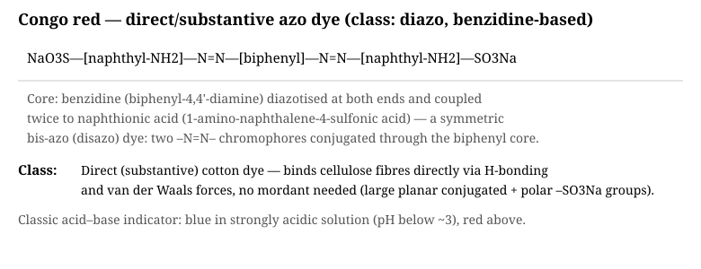

Benzidine, diazotised at both ends, is coupled twice to naphthionic acid,
giving a large, symmetric, planar conjugated system with two –N=N–
chromophores and two solubilising –SO₃Na auxochromes. Binds cotton
directly (no mordant) via hydrogen bonding and van der Waals stacking with
cellulose; also a classical acid–base indicator (blue below pH ≈3, red
above).

**Methyl orange** — a mono-azo indicator dye:

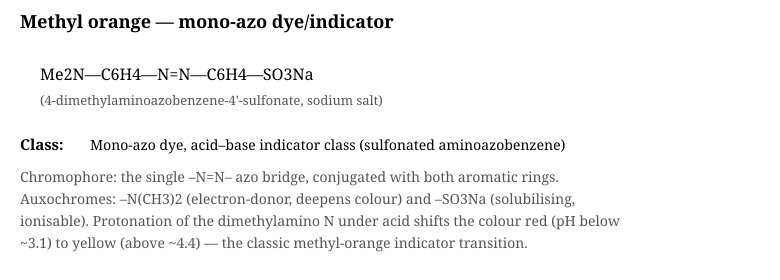

A single azo bridge links a dimethylaminobenzene ring to a
sulfonatobenzene ring. The –N(CH₃)₂ auxochrome donates electron density
into the conjugated system (deepening colour); the –SO₃Na group provides
water solubility. Its familiar red (acid) ↔ yellow (base) colour change
comes from protonation/deprotonation of the dimethylamino nitrogen.

**Malachite green** — a triarylmethane (basic) dye:

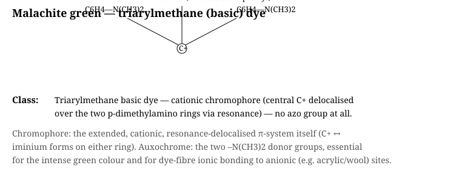

Unlike the two azo dyes above, malachite green has **no azo group at all**:
its chromophore is the delocalised, cationic central-carbon system,
resonance-stabilised across two p-dimethylaminophenyl rings and one plain
phenyl ring. The two –N(CH₃)₂ auxochromes are essential both for the
intense green colour and for ionic bonding to anionic sites on fibres like
wool, silk, and acrylic (hence "basic" dye — the dye cation pairs with an
acid-fibre anion).

### (iii) Classification of dyes

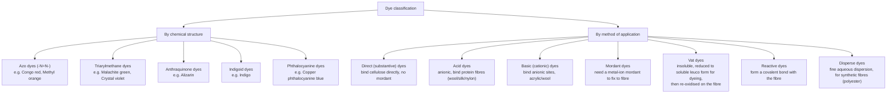

Chemical-structure classification groups dyes by the chromophore they
carry (azo, anthraquinone, etc.); application classification instead
groups them by *how* they are fixed to a particular fibre type — the two
systems are complementary, since a dye's chemical class strongly
influences which application class(es) it can belong to (e.g. most azo
dyes bearing sulfonate groups are direct or acid dyes).

### (iv) Non-textile uses of dyes

- **Biological staining** — histology and microbiology (e.g. methylene
  blue, malachite green for endospore staining, Gram stain components).
- **Analytical chemistry** — acid–base indicators (methyl orange, Congo
  red, phenolphthalein).
- **Food, cosmetics, and pharmaceuticals** — approved colourants in foods,
  lipsticks, and tablet coatings.
- **Paper, leather, and ink industries** — colouring of paper pulp,
  leather tanning finishes, writing/printing inks.
- **Solar cells and photography** — dye-sensitised solar cells and
  photographic/sensitising dyes exploit specific light-absorption
  (chromophore) properties.
- **Biomedical research** — fluorescent dyes for cell imaging, DNA gel
  staining (e.g. ethidium bromide-type dyes).

---

## Quick self-test checklist

- [ ] Can you classify an amine as 1°/2°/3° from a structure, and explain
      *why* the Hinsberg test separates them (N–H acidity)?
- [ ] Can you draw the Sandmeyer/Gattermann product for a given diazonium
      salt and halide/nitrile source?
- [ ] Can you show, step by step, how Hofmann and Curtius degradations both
      lose one carbon via an isocyanate intermediate?
- [ ] Can you convert glucose's Fischer projection to its Haworth
      projection and correctly mark C1 as anomeric?
- [ ] Can you explain in one sentence *why* sucrose is non-reducing but
      maltose is reducing?
- [ ] Can you state which glycosidic linkage (α/β, 1,4/1,6) distinguishes
      cellulose, amylose, and amylopectin?
- [ ] Can you carry a Kiliani–Fischer extension and a Ruff degradation
      through in the correct direction (which one adds vs removes a carbon)?
- [ ] Can you explain why Edman degradation is repeatable but Sanger's
      reagent and hydrazinolysis are not?
- [ ] Can you point to the chromophore and auxochrome in Congo red, methyl
      orange, and malachite green, and say which of the three has no azo
      group?
