# CT Solutions

## Part 1 — CHEM 103: Amines, Carbohydrates, Proteins & Dyes

**Course:** CHEM 103 (Chemistry-II) — Gopalganj Textile Engineering College
**Exam:** 2nd Class Test, L-1/T-2, 2025

> Both sets answered in full for study purposes.

## SET-A, Q1 — Amines: classification, separation, key reactions (5 marks)

<b>Show answer</b>

### (a) 1°, 2°, 3° amines

Amines are classified by how many hydrogen atoms of ammonia (NH₃) are
replaced by alkyl/aryl groups:

| Class | General formula | Example |
|---|---|---|
| Primary (1°) | R–NH₂ | CH₃CH₂NH₂ (ethylamine) |
| Secondary (2°) | R₂NH | (CH₃)₂NH (dimethylamine) |
| Tertiary (3°) | R₃N | (CH₃)₃N (trimethylamine) |

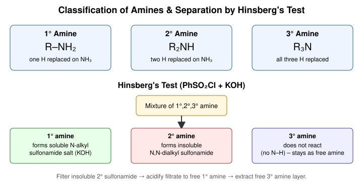

### (b) Separation of a 1°/2°/3° amine mixture — Hinsberg's method

Treat the mixture with **benzenesulfonyl chloride (PhSO₂Cl) and KOH**:

- **1° amine** → forms an *N*-alkylbenzenesulfonamide that still has an
  acidic N–H, so it dissolves in excess KOH as a soluble salt.
- **2° amine** → forms an *N,N*-dialkylbenzenesulfonamide with **no** N–H
  left to ionise — it stays **insoluble** and is filtered off.
- **3° amine** → has no N–H to react at all; it does not form a
  sulfonamide and is recovered unchanged from the ether/organic layer.

Workup: filter the insoluble 2° sulfonamide → acidify the filtrate (HCl)
to hydrolyse and liberate the free 1° amine → the 3° amine is separated
directly by extraction, since it never reacted. (See diagram above.)

### (c) Key reactions

**(i) Sandmeyer & Gattermann reactions** — both start from a diazonium
salt, Ar–N≡N⁺Cl⁻ (from Ar–NH₂ + NaNO₂/HCl, 0–5 °C):

- *Sandmeyer*: diazonium salt + **cuprous salt** (CuCl, CuBr, CuCN) →
  Ar–Cl, Ar–Br or Ar–CN, with loss of N₂.
- *Gattermann*: same transformation but uses **freshly reduced copper
  powder** with HCl/HBr instead of a cuprous salt — cheaper, slightly
  lower yielding.

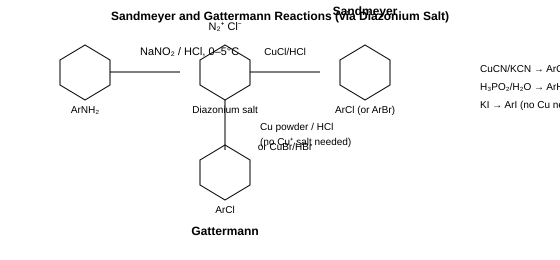

**(ii) Coupling reaction & sulfa drug** — a diazonium salt undergoes
**electrophilic aromatic substitution** at the *para* position of an
activated arene (aniline or phenol derivative) to give a brightly
coloured **azo compound**, Ar–N=N–Ar′. This azo (–N=N–) linkage is the
chromophore behind most synthetic dyes. **Sulfanilamide**
(*p*-aminobenzenesulfonamide) is the parent sulfa drug: it structurally
mimics *p*-aminobenzoic acid (PABA) and competitively blocks bacterial
folic-acid synthesis, giving it antibacterial activity.

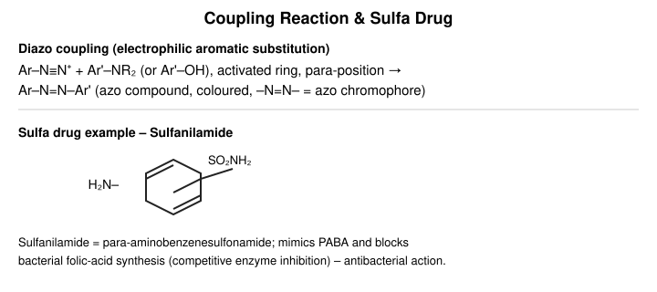

**(iii) Hofmann and Curtius degradation** — both convert a carboxylic
acid derivative into an amine with **loss of one carbon** (as CO₂), via
a common **isocyanate (R–N=C=O)** intermediate formed by a 1,2-shift of
R from carbon to nitrogen:

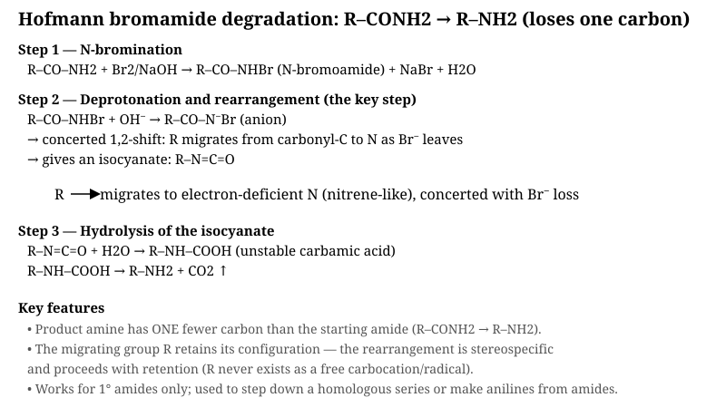

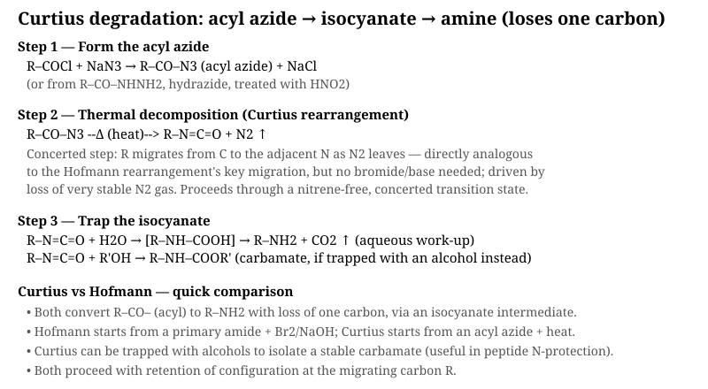

- *Hofmann*: amide (R–CONH₂) + Br₂/NaOH → *N*-bromoamide → rearranges to
  isocyanate → hydrolysis → R–NH₂.
- *Curtius*: acid chloride (R–COCl) + NaN₃ → acyl azide → heat drives off
  N₂ and rearranges to the same isocyanate → hydrolysis → R–NH₂.

---

## SET-A, Q2 — Carbohydrates: stereochemistry & polysaccharides (5 marks)

<b>Show answer</b>

### (i) Asymmetric carbon & mutarotation

An **asymmetric (chiral) carbon** is a carbon bonded to four different
groups; it is a stereocentre. D-glucose has four such carbons (C2–C5).

**Mutarotation** is the spontaneous change in optical rotation observed
when a freshly dissolved pure anomer (α or β) of a sugar equilibrates,
via the open-chain form, to a constant equilibrium rotation — because
the cyclic hemiacetal reopens and recloses, randomising the new
(anomeric) stereocentre at C1.

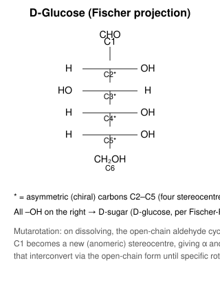

### (ii) Cyclic structures

D-glucose cyclises through intramolecular hemiacetal formation between
the C5–OH and the C1 aldehyde, giving a six-membered (pyranose) ring:

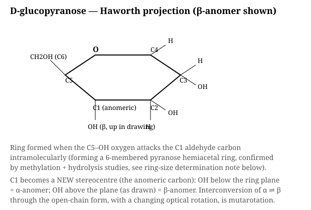

**Sucrose** is a non-reducing disaccharide: the anomeric carbons of
α-D-glucopyranose (C1) and β-D-fructofuranose (C2) are joined directly,
leaving no free anomeric OH.

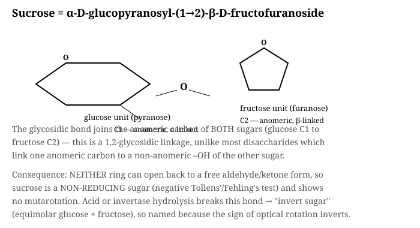

**Cellulose** is a linear polymer of β-D-glucopyranose units joined by
β(1→4) glycosidic bonds; the equatorial β-linkage lets chains pack into
rigid, H-bonded microfibrils.

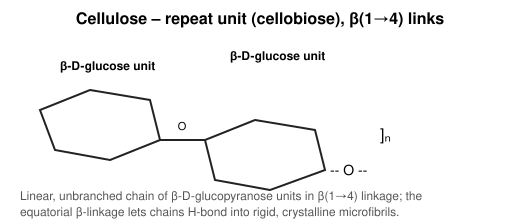

**Starch** is a mixture of **amylose** (linear, α(1→4) links, coils into
a helix) and **amylopectin** (α(1→4) main chains with α(1→6) branch
points roughly every 24–30 units).

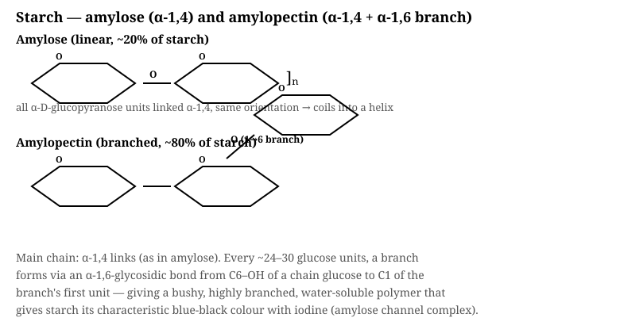

### (iii) Chain extension / shortening of an aldose

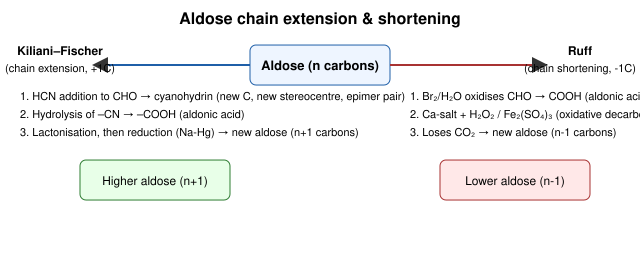

- **Chain extension — Kiliani–Fischer synthesis**: HCN adds to the
  aldehyde to give a cyanohydrin (creating a new stereocentre, so a pair
  of epimeric nitriles forms); hydrolysis gives the aldonic acid, which
  lactonises and is reduced (Na–Hg) to the next-higher aldose (n+1
  carbons).
- **Chain shortening — Ruff degradation**: Br₂/H₂O oxidises the aldose
  to its aldonic acid; the calcium salt undergoes oxidative
  decarboxylation with H₂O₂/Fe₂(SO₄)₃, losing CO₂ to give the
  next-lower aldose (n−1 carbons).

### (iv) Determining ring size of D-glucose

Ring size (5- vs 6-membered) is established chiefly by **Haworth's
methylation method**: exhaustively methylate all free –OH groups of
methyl-D-glucoside, then hydrolyse. The **ring oxygen position is
revealed by which carbon is left un-methylated** (freed as a new –OH
upon hydrolysis of the acetal) — this carbon was tied up in the ring.
For D-glucose this identifies the oxygen bridging C1 and C5, confirming
a six-membered (pyranose) ring; further confirmation comes from
periodate oxidation studies, which distinguish pyranose from furanose
forms by the number of moles of HIO₄ consumed and HCOOH released.

---

## SET-B, Q1 — Proteins & amino acids (5 marks)

<b>Show answer</b>

### (i) Key terms

- **Protein**: a large biomolecule built from amino acids linked by
  peptide bonds, folded into a specific 3-D structure (e.g. haemoglobin).
- **Amino acid**: a molecule containing both an amino (–NH₂) and a
  carboxyl (–COOH) group on the same carbon (e.g. glycine, H₂N–CH₂–COOH).
- **Essential amino acid**: cannot be synthesised by the human body and
  must come from the diet (e.g. leucine, lysine, valine).
- **Non-essential amino acid**: can be synthesised by the body itself
  (e.g. glycine, alanine, glutamic acid).
- **Zwitterion**: the dipolar form of an amino acid, H₃N⁺–CHR–COO⁻, in
  which the amino group is protonated and the carboxyl group is
  deprotonated, giving an overall neutral but internally charged species.
- **Isoelectric point (pI)**: the pH at which an amino acid exists
  entirely as the zwitterion, carrying zero net charge (does not migrate
  in an electric field).
- **Peptide linkage**: the amide bond, –CO–NH–, formed between the
  carboxyl group of one amino acid and the amino group of the next.

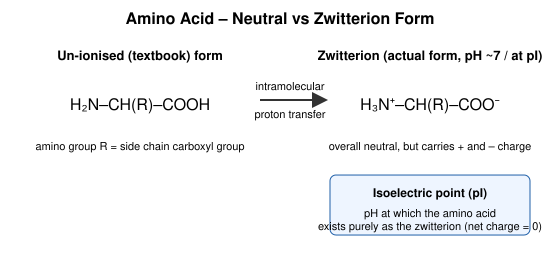

### (ii) Synthesis of an α-amino acid

**Gabriel–Malonic ester / Strecker synthesis** (Strecker shown):

$$\text{R-CHO} + \text{NH}_3 + \text{HCN} \rightarrow \text{R-CH(NH}_2\text{)-CN} \xrightarrow{\text{H}_3\text{O}^+} \text{R-CH(NH}_2\text{)-COOH}$$

An aldehyde condenses with ammonia to give an imine, which adds HCN to
form an α-aminonitrile; acid hydrolysis of the nitrile then gives the
α-amino acid.

### (iii) End-group analysis of peptides

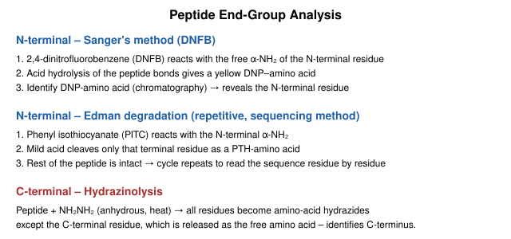

- **N-terminal**: Sanger's reagent (2,4-dinitrofluorobenzene) tags the
  free α-NH₂; total hydrolysis releases a yellow DNP-amino acid,
  identified chromatographically. **Edman degradation** does the same
  tagging with phenyl isothiocyanate but cleaves only the terminal
  residue under mild acid, so it can be repeated cycle after cycle to
  read the whole N-terminal sequence.
- **C-terminal**: **hydrazinolysis** — anhydrous hydrazine converts every
  internal residue into an amino-acid hydrazide, but the C-terminal
  residue is released as the free amino acid, revealing the C-terminus.

### (iv) Synthesis of Gly-Ala peptide

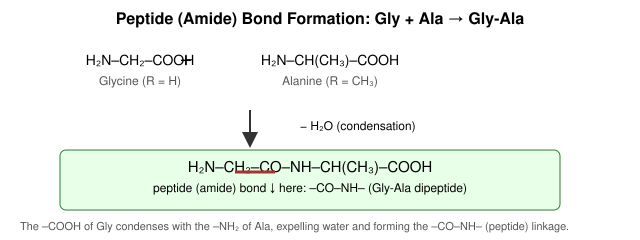

To avoid uncontrolled polymerisation, the amino group of glycine is
first protected (e.g. as a carbobenzyloxy, Cbz, derivative), its
carboxyl group is activated, then coupled with the amino group of
alanine methyl ester; deprotection and ester hydrolysis afterwards give
the free **Gly-Ala** dipeptide, H₂N–CH₂–CO–NH–CH(CH₃)–COOH.

### (v) Essential vs non-essential amino acids

| Essential | Non-essential |
|---|---|
| Not synthesised by the body; must be obtained from food | Synthesised by the body from metabolic intermediates |
| e.g. valine, leucine, isoleucine, lysine, threonine | e.g. glycine, alanine, serine, aspartic acid |
| Deficiency causes growth/health problems | Dietary intake not strictly required |

---

## SET-B, Q2 — Colour, dyes, pigments, chromophores (5 marks)

<b>Show answer</b>

### (i) Key terms

- **Colour**: the visual sensation produced when a compound absorbs
  visible light of a specific wavelength and transmits/reflects the rest.
- **Dye**: a coloured, usually aromatic organic compound that has
  affinity for a substrate (fibre) and binds to it, imparting colour
  fastness (e.g. Congo red on cotton).
- **Pigment**: a coloured compound that is insoluble in the application
  medium and imparts colour by being dispersed/mechanically held on the
  surface rather than chemically bonding (e.g. titanium dioxide, carbon
  black).
- **Chromophore**: an unsaturated functional group responsible for
  light absorption and hence colour (e.g. –N=N– azo, >C=O, –N=O).
- **Auxochrome**: an electron-donating/withdrawing group (e.g. –NH₂,
  –OH, –NR₂, –SO₃H) that intensifies or shifts the colour produced by a
  chromophore and often also helps the dye bind to the fibre.
- **Dye intermediate**: a chemical (typically derived from benzene,
  naphthalene or anthracene) used as a building block in dye synthesis,
  e.g. aniline, β-naphthol.
- **Raw materials for dye manufacture**: coal-tar/petroleum aromatics
  (benzene, toluene, naphthalene, anthracene) and inorganics (H₂SO₄,
  HNO₃, NaOH, Cl₂) used to make intermediates and finished dyes.

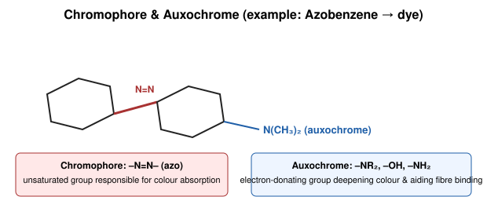

### (ii) Three dyes — name & structure

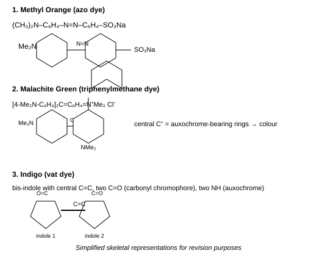

1. **Methyl orange** — an azo dye/acid-base indicator.
2. **Congo red** — a benzidine-based diazo (bis-azo) direct dye.
3. **Malachite green** — a triarylmethane basic dye.

### (iii) Classification of dyes

**By chemical structure:**
Azo dyes (–N=N–), Anthraquinone dyes, Triarylmethane dyes, Phthalocyanine
dyes, Indigoid dyes, Nitro/nitroso dyes.

**By method of application:**
Direct dyes, Acid dyes, Basic dyes, Mordant dyes, Vat dyes, Reactive
dyes, Disperse dyes, Sulfur dyes.

### (iv) Non-textile uses of dyes

- Biological/histological staining (e.g. methylene blue, eosin) for
  microscopy and cell/tissue identification.
- pH indicators in analytical chemistry (e.g. methyl orange, phenolphthalein).
- Food, drug and cosmetic colouring (FD&C-approved dyes).
- Colouring of leather, paper, ink, and plastics.
- Photographic and laser dyes; biomedical diagnostic markers (fluorescent
  dyes in assays).

---

## Part 2 — Polymer Chemistry (Set-A)

## Q1 — Molecular weight averages & polydispersity (5 marks)

<b>Show answer</b>

### (i) Number average ($M_n$) vs Weight average ($M_w$) molecular weight

Since a polymer sample is a mixture of chains of different lengths, its
molecular weight must be expressed as a statistical average.

$$M_n = \frac{\sum N_i M_i}{\sum N_i} \qquad\qquad M_w = \frac{\sum N_i M_i^2}{\sum N_i M_i}$$

- $M_n$ weights every chain **equally by number** — it is what a
  colligative-property method (e.g. osmometry) measures.
- $M_w$ weights each chain **by its mass contribution**, so longer
  chains count more — it is what light-scattering measures.

*Example*: in a mixture of 6 chains of $M=10$ and 4 chains of $M=20$,
$M_n$ treats each chain identically, while $M_w$ is pulled upward
because the heavier chains contribute more mass to the sum.

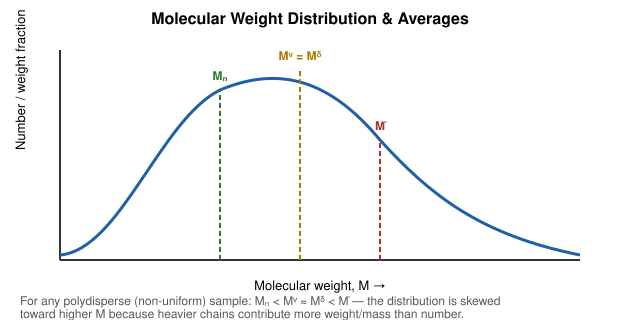

### (ii) Polydispersity & Degree of polydispersity

- **Polydispersity** is the *qualitative* property of a polymer sample
  containing chains of varying chain length/molecular weight (as opposed
  to a monodisperse sample where all chains are identical).
- **Degree of polydispersity (PDI)** is the *quantitative* measure of
  this spread:

$$\text{PDI} = \frac{M_w}{M_n}$$

PDI = 1 for a perfectly monodisperse polymer; PDI > 1 for any real,
polydisperse polymer (the higher the PDI, the broader the distribution).

### (iii) Worked numerical example

Given three populations: $M_i = 10, 20, 30$ with $N_i = 6, 4, 2$
respectively.

| $M_i$ | $N_i$ | $N_iM_i$ | $N_iM_i^2$ | $N_iM_i^3$ |
|---|---|---|---|---|
| 10 | 6 | 60 | 600 | 6,000 |
| 20 | 4 | 80 | 1,600 | 32,000 |
| 30 | 2 | 60 | 1,800 | 54,000 |
| **Σ** | **12** | **200** | **4,000** | **92,000** |

$$M_n = \frac{\sum N_iM_i}{\sum N_i} = \frac{200}{12} = 16.67$$

$$M_w = \frac{\sum N_iM_i^2}{\sum N_iM_i} = \frac{4000}{200} = 20.0$$

$$M_z = \frac{\sum N_iM_i^3}{\sum N_iM_i^2} = \frac{92000}{4000} = 23.0$$

For $M_v$ (viscosity average), $M_v = \left(\dfrac{\sum N_iM_i^{1+a}}{\sum N_iM_i}\right)^{1/a}$;
taking the Mark–Houwink exponent $a = 1$ for simplicity, this reduces to
the same expression as $M_w$, giving **$M_v = 20.0$**.

$$\text{PDI} = \frac{M_w}{M_n} = \frac{20.0}{16.67} = 1.20$$

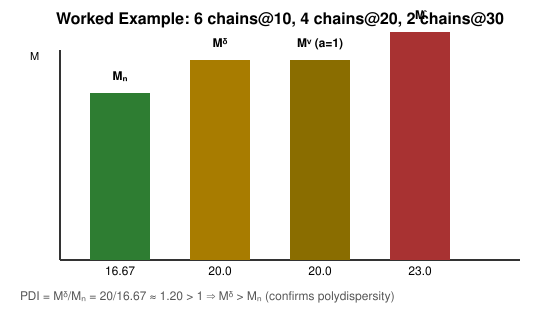

**Proof that $M_w \geq M_n$ (always):**

$$M_w - M_n = \frac{\sum N_iM_i^2}{\sum N_iM_i} - \frac{\sum N_iM_i}{\sum N_i}
= \frac{\left(\sum N_i\right)\left(\sum N_iM_i^2\right) - \left(\sum N_iM_i\right)^2}{\left(\sum N_i\right)\left(\sum N_iM_i\right)}$$

By the **Cauchy–Schwarz inequality**, for any real numbers,

$$\left(\sum N_i\right)\left(\sum N_iM_i^2\right) \geq \left(\sum N_iM_i\right)^2$$

with equality **only** when every $M_i$ is identical (monodisperse
sample). Hence the numerator above is always $\geq 0$, and since the
denominator is positive, $M_w - M_n \geq 0$, i.e. $M_w \geq M_n$ always,
confirmed numerically above (20.0 > 16.67).

---

## Q2 — Thermal transitions, morphology & degradation (5 marks)

<b>Show answer</b>

### (i) $T_g$ and $T_m$

- **Glass transition temperature ($T_g$)**: the temperature at which
  the **amorphous regions** of a polymer change from a hard, glassy
  state to a soft, rubbery state. It is a **second-order** transition —
  properties like specific volume change slope gradually, with no
  latent heat.
- **Melting temperature ($T_m$)**: the temperature at which the
  **crystalline regions** of a polymer melt into a disordered (liquid)
  state. It is a **first-order** transition — a sharp, discontinuous
  jump in specific volume, with an associated latent heat of fusion.

Purely amorphous polymers (e.g. atactic polystyrene) show only a $T_g$;
semi-crystalline polymers (e.g. HDPE, nylon) show both a $T_g$ (from
their amorphous fraction) and a $T_m$ (from their crystalline fraction).

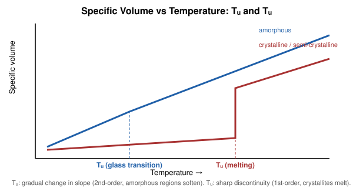

### (ii) Amorphous vs Crystalline polymer

| Amorphous | Crystalline |
|---|---|
| Chains randomly coiled, no long-range order | Chains folded into ordered lamellae/spherulites |
| Transparent (no light-scattering domains) | Often translucent/opaque (scattering at crystallite boundaries) |
| Only a $T_g$; softens gradually | Has a sharp $T_m$; also usually has a $T_g$ (mixed morphology) |
| e.g. atactic polystyrene, PMMA | e.g. HDPE, isotactic polypropylene, nylon |

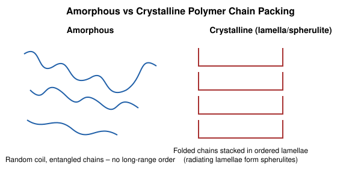

### (iii) Degree of crystallinity vs Crystallisability

- **Degree of crystallinity**: the actual **fraction (%) of a given
  polymer sample** that exists in ordered, crystalline regions —
  measured, e.g., by X-ray diffraction or density measurements. It
  depends on both the polymer's structure *and* processing conditions
  (cooling rate, annealing).
- **Crystallisability**: the **inherent structural tendency/ability** of
  a polymer chain to crystallise at all, governed by chain regularity,
  tacticity and symmetry (e.g. isotactic polypropylene is highly
  crystallisable; atactic polypropylene, with random stereochemistry,
  is essentially non-crystallisable regardless of processing).

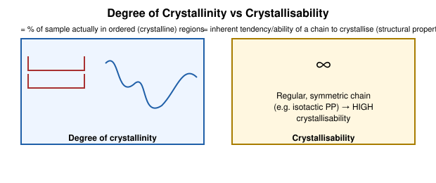

### (iv) Photo-degradation vs Oxidative degradation

- **Photo-degradation**: UV light is absorbed by a chromophore or
  impurity in the polymer, promoting it to an excited state that
  undergoes **homolytic bond cleavage** (Norrish Type I/II reactions),
  directly causing chain scission.
- **Oxidative degradation (auto-oxidation)**: a **radical chain
  reaction** with atmospheric O₂ — initiation forms a carbon radical,
  which reacts with O₂ to form a peroxy radical, which abstracts H from
  another chain to form a hydroperoxide and propagate the chain;
  hydroperoxide decomposition branches the reaction, and termination
  gives stable products (with net chain scission and/or crosslinking).
  UV light and heat both **accelerate** oxidative degradation — the two
  processes often act together (photo-oxidative degradation).

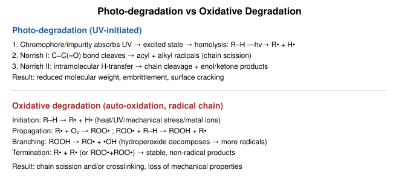

### (v) Function & mechanism of photo-stabilizers and anti-oxidants

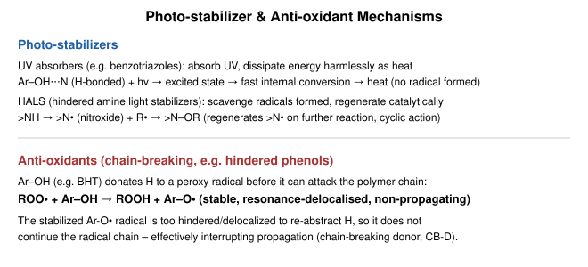

- **Photo-stabilizers**: protect against UV-induced damage.
  - *UV absorbers* (e.g. benzotriazoles) absorb harmful UV photons and
    dissipate the energy harmlessly as heat via fast internal
    conversion, before it can be absorbed by the polymer's own
    chromophores.
  - *HALS* (hindered amine light stabilizers) scavenge the radicals
    that do form, converting to a nitroxide radical that reacts with
    alkyl radicals and is catalytically regenerated, so a small amount
    protects over a long service life.
- **Anti-oxidants** (chain-breaking donors, e.g. hindered phenols like
  BHT): donate a hydrogen atom to a peroxy radical (ROO• + Ar–OH →
  ROOH + Ar–O•) before it can abstract H from the polymer backbone. The
  resulting Ar–O• radical is resonance-stabilised and too hindered to
  continue the chain, effectively **interrupting propagation** of the
  oxidative degradation cycle.

