# Chemistry Exam: Model Answers

**Topics:** molecular formulae, identification of organic acids, estimation of sodium carbonate in washing soda
**Sets:** Odd ID (Question 1) and Even ID (Question 2)

> All figures are SVG files stored in `../../assets/`. Keep the folder layout (`docs/chemistry/` next to `assets/`) so the images load.

---

# PART A: STUDENTS WITH ODD ID NUMBERS

## Question 1(a): Write the molecular formulae

### Answer

| No. | Compound | Condensed formula | Molecular formula |
|:---:|:---------|:------------------|:------------------|
| 1 | Oxalic acid | `HOOC–COOH` (crystallises as `(COOH)₂·2H₂O`) | **H₂C₂O₄** |
| 2 | Sodium benzoate | `C₆H₅COONa` | **C₇H₅NaO₂** |
| 3 | Formic acid | `HCOOH` | **CH₂O₂** |
| 4 | Sodium acetate | `CH₃COONa` | **C₂H₃NaO₂** |
| 5 | Formaldehyde | `HCHO` | **CH₂O** |
| 6 | Silver acetate | `CH₃COOAg` | **C₂H₃AgO₂** |
| 7 | Methyl acetate | `CH₃COOCH₃` | **C₃H₆O₂** |
| 8 | Ethyl alcohol | `CH₃CH₂OH` | **C₂H₆O** |
| 9 | Caustic soda | sodium hydroxide | **NaOH** |
| 10 | Soda ash | anhydrous sodium carbonate | **Na₂CO₃** |
| 11 | Washing soda | sodium carbonate decahydrate | **Na₂CO₃·10H₂O** |

### Fig. 1: Structures of the organic compounds

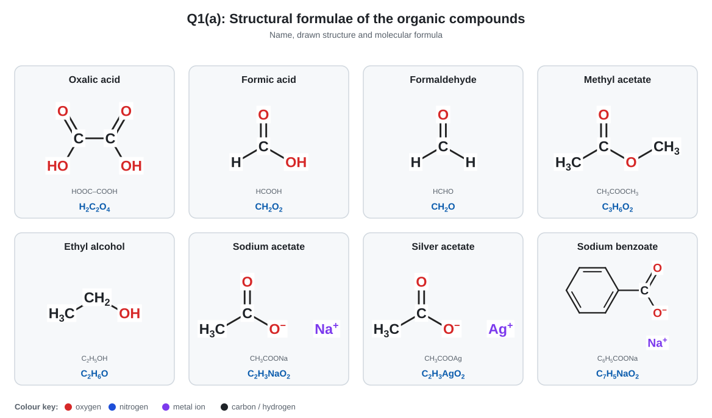

### Fig. 2: The inorganic compounds (caustic soda, soda ash, washing soda)

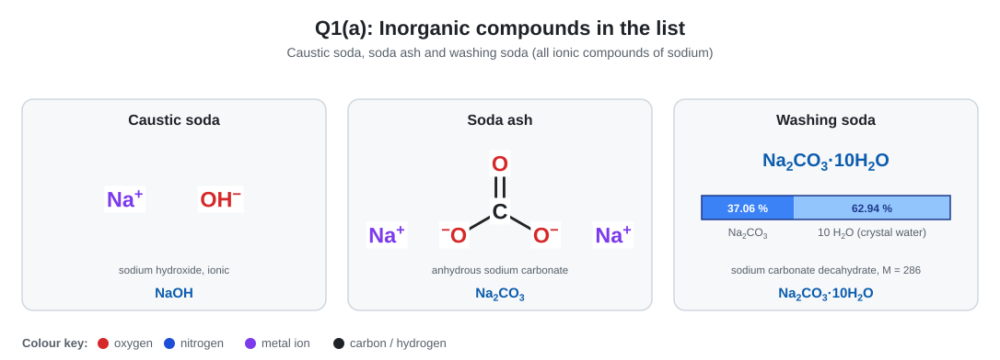

**Note:** Soda ash and washing soda are the same compound at different hydration. Washing soda loses its water of crystallisation on heating:
`Na₂CO₃·10H₂O → Na₂CO₃ + 10H₂O`
Mass percentage of Na₂CO₃ in washing soda = 106 / 286 × 100 = **37.06 %**.

---

## Question 1(b): How will you identify the following organic compounds?

### Fig. 3: Identification flowchart

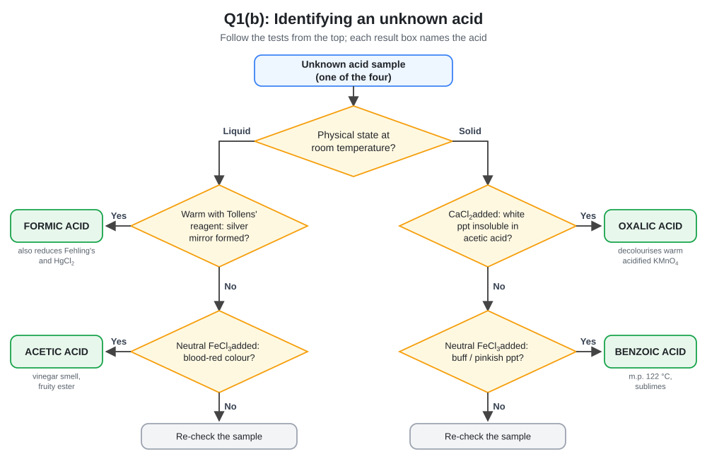

### Fig. 4: Test comparison matrix

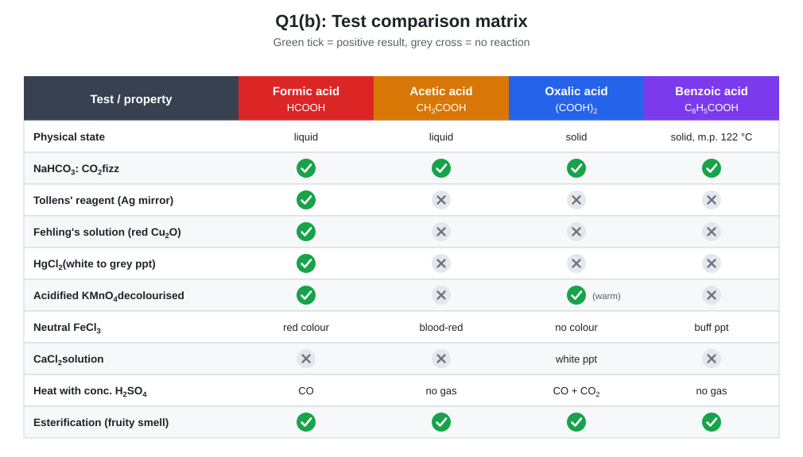

### Fig. 5: Expected observations

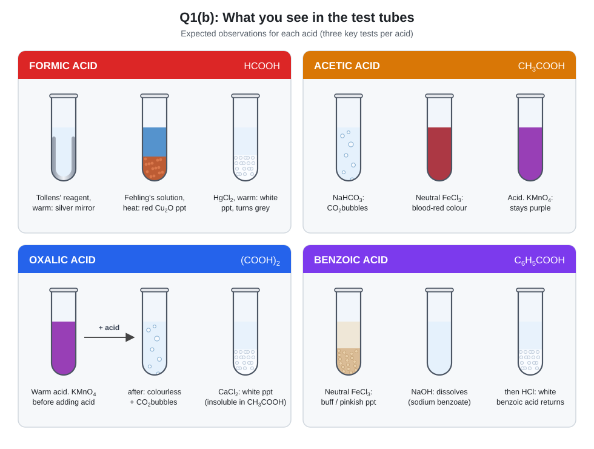

### (i) Formic acid, HCOOH

Formic acid contains an **aldehyde group** (`H–CO–OH`), so it is a *reducing* acid. This separates it from the other three.

| Test | Procedure | Observation | Equation |
|:-----|:----------|:------------|:---------|
| Tollens' test | Warm the sample with ammoniacal AgNO₃ | **Silver mirror** | `HCOOH + 2[Ag(NH₃)₂]⁺ + 2OH⁻ → CO₂ + 2Ag↓ + 4NH₃ + 2H₂O` |
| Fehling's test | Heat with Fehling's solution | **Red ppt of Cu₂O** | `HCOOH + 2Cu(OH)₂ → Cu₂O↓ + CO₂ + 3H₂O` |
| HgCl₂ test | Warm with HgCl₂ solution | **White ppt of Hg₂Cl₂**, turning grey | `2HgCl₂ + HCOOH → Hg₂Cl₂↓ + 2HCl + CO₂` |
| KMnO₄ test | Acidified KMnO₄ | Purple colour **discharged** | Oxidised to CO₂ + H₂O |
| Dehydration | Warm with conc. H₂SO₄ | Gas burns with a **blue flame** | `HCOOH → CO↑ + H₂O` |

**Confirmatory test:** Tollens' test. Acetic acid does not give it.

### (ii) Acetic acid, CH₃COOH

| Test | Procedure | Observation | Equation |
|:-----|:----------|:------------|:---------|
| Smell | Smell cautiously | **Vinegar-like** odour | Characteristic |
| Litmus | Blue litmus paper | Turns **red** | Acidic |
| NaHCO₃ test | Add solid NaHCO₃ | **Effervescence** of CO₂ | `CH₃COOH + NaHCO₃ → CH₃COONa + H₂O + CO₂↑` |
| Neutral FeCl₃ | Neutralise, add neutral FeCl₃ | **Blood-red colour**, brown ppt on boiling | `3CH₃COO⁻ + Fe³⁺ → Fe(CH₃COO)₃` |
| Esterification | Warm with ethanol + conc. H₂SO₄ | **Fruity smell** of ethyl acetate | `CH₃COOH + C₂H₅OH ⇌ CH₃COOC₂H₅ + H₂O` |
| Negative tests | Tollens', Fehling's, KMnO₄ | **No reaction** | No aldehyde group |

### (iii) Oxalic acid, (COOH)₂

| Test | Procedure | Observation | Equation |
|:-----|:----------|:------------|:---------|
| Physical | Examine | White crystalline solid, soluble in water, poisonous | `(COOH)₂·2H₂O` |
| KMnO₄ test | Warm (about 60 °C) with dil. H₂SO₄ + KMnO₄ | Pink colour **discharged**, CO₂ evolved | `2KMnO₄ + 5(COOH)₂ + 3H₂SO₄ → K₂SO₄ + 2MnSO₄ + 10CO₂ + 8H₂O` |
| CaCl₂ test | Neutralise, add CaCl₂ | **White ppt of calcium oxalate**, insoluble in acetic acid, soluble in dil. HCl | `(COO)₂²⁻ + Ca²⁺ → (COO)₂Ca↓` |
| Conc. H₂SO₄ | Heat | **CO + CO₂** (CO burns with a blue flame) | `(COOH)₂ → CO + CO₂ + H₂O` |
| AgNO₃ | Add to the neutral solution | White ppt of silver oxalate | `(COO)₂²⁻ + 2Ag⁺ → (COOAg)₂↓` |

**Confirmatory test:** CaCl₂ (white ppt insoluble in acetic acid) plus decolourisation of warm acidified KMnO₄.

### (iv) Benzoic acid, C₆H₅COOH

| Test | Procedure | Observation | Equation |
|:-----|:----------|:------------|:---------|
| Physical | Examine and heat | White crystals, **m.p. 122 °C**, sparingly soluble in cold water, sublimes | Aromatic acid |
| NaHCO₃ test | Add NaHCO₃ | **Effervescence** of CO₂ | `C₆H₅COOH + NaHCO₃ → C₆H₅COONa + H₂O + CO₂↑` |
| Alkali then acid | Dissolve in NaOH, then add HCl | Dissolves, then **white benzoic acid reappears** | `C₆H₅COONa + HCl → C₆H₅COOH↓ + NaCl` |
| Neutral FeCl₃ | Neutralise, add neutral FeCl₃ | **Buff / pinkish-buff ppt** of ferric benzoate | `3C₆H₅COO⁻ + Fe³⁺ → Fe(C₆H₅COO)₃↓` |
| Esterification | Warm with methanol + conc. H₂SO₄ | Pleasant smell of **methyl benzoate** | `C₆H₅COOH + CH₃OH ⇌ C₆H₅COOCH₃ + H₂O` |
| Soda-lime test | Heat with soda lime | Vapours of **benzene** | `C₆H₅COONa + NaOH →(CaO, heat)→ C₆H₆ + Na₂CO₃` |
| Negative tests | Tollens', Fehling's | No reaction | No reducing group |

---

# PART B: STUDENTS WITH EVEN ID NUMBERS

## Question 2(a): Write the molecular formulae

### Answer

| No. | Compound | Condensed formula | Molecular formula |
|:---:|:---------|:------------------|:------------------|
| 1 | Silver nitrate | AgNO₃ | **AgNO₃** |
| 2 | Sodium acetate | `CH₃COONa` | **C₂H₃NaO₂** |
| 3 | Sodium formate | `HCOONa` | **CHNaO₂** |
| 4 | Benzaldehyde | `C₆H₅CHO` | **C₇H₆O** |
| 5 | Benzoic acid | `C₆H₅COOH` | **C₇H₆O₂** |
| 6 | Cuprous oxide | Cu₂O | **Cu₂O** |
| 7 | Ammonium hydroxide | NH₃ in water | **NH₄OH** |
| 8 | Sodium formate *(repeated in the question)* | `HCOONa` | **CHNaO₂** |
| 9 | Salicylic acid | `C₆H₄(OH)COOH` | **C₇H₆O₃** |
| 10 | Methyl salicylate | `C₆H₄(OH)COOCH₃` | **C₈H₈O₃** |
| 11 | Ethyl salicylate | `C₆H₄(OH)COOC₂H₅` | **C₉H₁₀O₃** |

### Fig. 6: Structures of the organic compounds

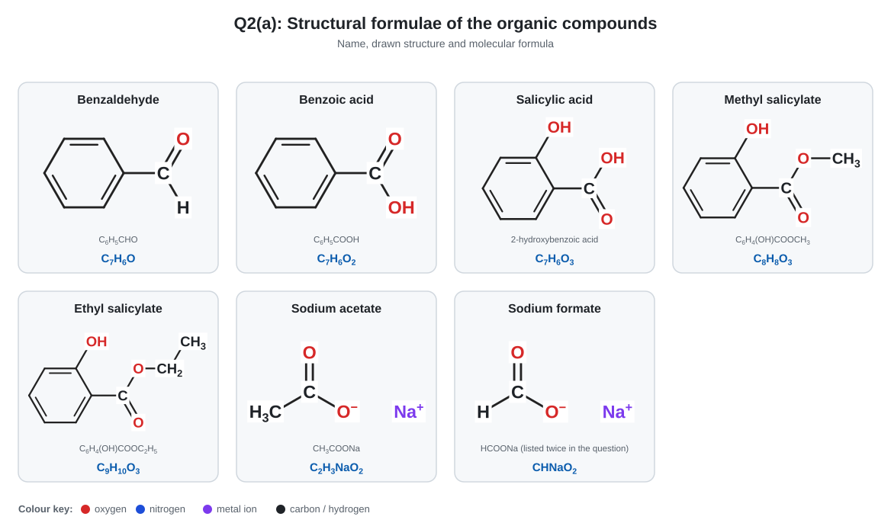

### Fig. 7: The inorganic compounds

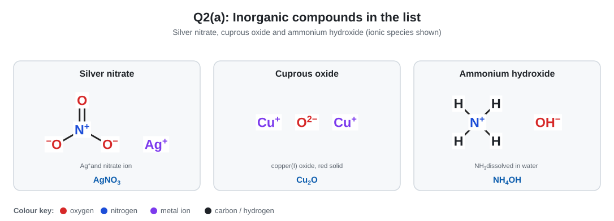

### Fig. 8: Salicylic acid and its esters

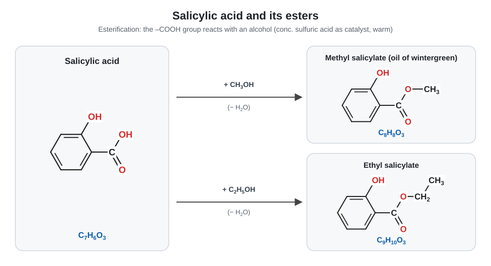

---

## Question 2(b): How will you determine the sodium carbonate content of washing soda?

### 1. Principle

Washing soda (Na₂CO₃·10H₂O) is the salt of a strong base and a weak acid. Its Na₂CO₃ content is found by an **acid–base titration** against standard HCl with **methyl orange** as the indicator.

```
Na₂CO₃ + 2HCl → 2NaCl + H₂O + CO₂↑
```

| Quantity | Value |
|:---------|:------|
| Molar mass of Na₂CO₃ | 106 g/mol |
| **Equivalent weight of Na₂CO₃** | 106 / 2 = **53** |
| Molar mass of Na₂CO₃·10H₂O | 286 g/mol |
| Equivalent weight of Na₂CO₃·10H₂O | 286 / 2 = **143** |

### Fig. 9: Titration curve (why methyl orange)

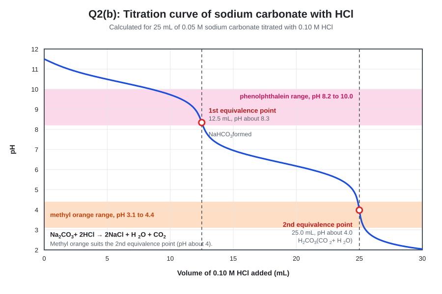

The curve has two steps. The first (pH about 8.3) is the formation of NaHCO₃. The second (pH about 4) is complete neutralisation to H₂CO₃. Methyl orange (pH 3.1 to 4.4) marks the **second** point, which is the one needed for the full reaction above. Phenolphthalein would show only the first.

### 2. Requirements

| Apparatus | Chemicals |
|:----------|:----------|
| Burette (50 mL), pipette (25 mL) | Standard HCl (0.1 N) |
| Volumetric flask (250 mL) | Washing soda sample |
| Conical flask, funnel, white tile | Methyl orange indicator |
| Analytical balance, burette stand | Distilled water |

### Fig. 10: Apparatus

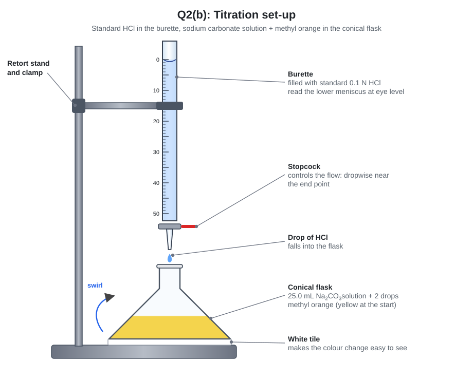

### 3. Procedure

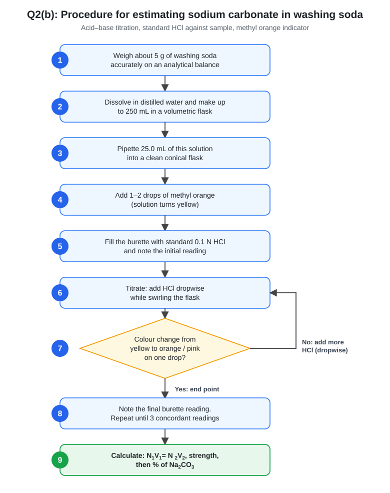

### Fig. 11: End-point colour change

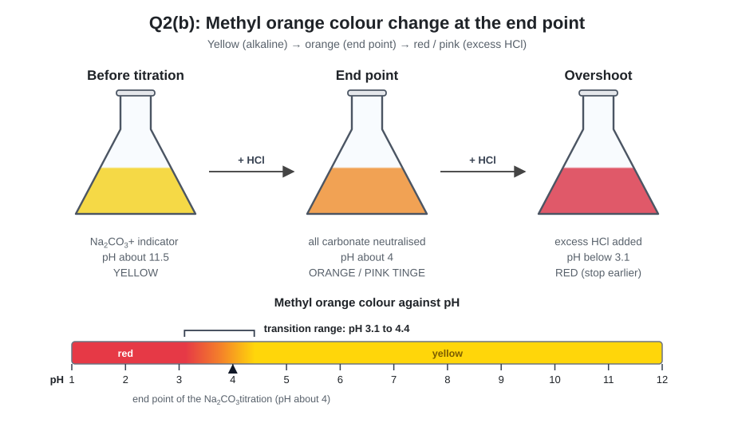

### 4. Observation table

| Obs. | Volume of sample solution (mL) | Initial reading (mL) | Final reading (mL) | Volume of HCl used (mL) |
|:----:|:----:|:----:|:----:|:----:|
| 1 | 25 | 0.0 | 34.1 | 34.1 |
| 2 | 25 | 0.0 | 33.9 | 33.9 |
| 3 | 25 | 0.0 | 34.0 | 34.0 |

*These readings are illustrative. Use your own laboratory data in the exam.*

**Mean volume of HCl = 34.0 mL**

### 5. Calculations

**Data:** 5.000 g of washing soda made up to 250 mL. N₁ = 0.1 N, V₁ = 34.0 mL (HCl). V₂ = 25 mL (sample solution), N₂ = ?

**Step 1: Normality of the sample solution**

```
N₁V₁ = N₂V₂
N₂ = (0.1 × 34.0) / 25 = 0.136 N
```

**Step 2: Strength as anhydrous Na₂CO₃**

```
Strength = Normality × Equivalent weight = 0.136 × 53 = 7.208 g/L
```

**Step 3: Mass of Na₂CO₃ in 250 mL**

```
7.208 × (250 / 1000) = 1.802 g
```

**Step 4: Percentage of Na₂CO₃ in the sample**

```
% Na₂CO₃ = (1.802 / 5.000) × 100 = 36.04 %
```

**Step 5 (optional): Purity as Na₂CO₃·10H₂O**

```
Strength = 0.136 × 143 = 19.45 g/L
Mass in 250 mL = 4.862 g
Purity = (4.862 / 5.000) × 100 = 97.2 %
```

**Check:** pure Na₂CO₃·10H₂O contains 106 / 286 × 100 = 37.06 % Na₂CO₃, so 36.04 % indicates a fairly pure sample.

### 6. Result

> The washing soda sample contains **36.04 % Na₂CO₃** (about 97 % pure Na₂CO₃·10H₂O).

### 7. Precautions

1. Rinse the burette with HCl and the pipette with the sample solution before use.
2. Remove air bubbles from the burette tip.
3. Use only 1–2 drops of indicator.
4. Swirl continuously and add HCl dropwise near the end point.
5. Read the burette at eye level at the lower meniscus.
6. Do not use phenolphthalein for this estimation.
7. Use fresh crystals, because washing soda effloresces (loses water) on standing.

---

## Quick revision

| Question | Key answer |
|:--------:|:-----------|
| 1(a) | `H₂C₂O₄`, `C₇H₅NaO₂`, `CH₂O₂`, `C₂H₃NaO₂`, `CH₂O`, `C₂H₃AgO₂`, `C₃H₆O₂`, `C₂H₆O`, `NaOH`, `Na₂CO₃`, `Na₂CO₃·10H₂O` |
| 1(b) | Formic: Tollens' / Fehling's / HgCl₂. Acetic: FeCl₃ blood-red + vinegar smell. Oxalic: CaCl₂ white ppt + KMnO₄ decolourised. Benzoic: FeCl₃ buff ppt + m.p. 122 °C |
| 2(a) | `AgNO₃`, `C₂H₃NaO₂`, `CHNaO₂`, `C₇H₆O`, `C₇H₆O₂`, `Cu₂O`, `NH₄OH`, `C₇H₆O₃`, `C₈H₈O₃`, `C₉H₁₀O₃` |
| 2(b) | Titrate with standard HCl, methyl orange. `Na₂CO₃ + 2HCl → 2NaCl + H₂O + CO₂`. Equivalent weight = 53 |
