# Chemistry-II Lab Final

**Date:** 06/10/2026 | **Odd ID/Roll → Question 1** | **Even ID/Roll → Question 2**

Notes on the question paper:

- Q2(a) lists **sodium formate twice** (items 3 and 8). It is the same compound, answered once and marked as a repeat.
- "Ammonium hydroxide" is aqueous ammonia: NH₃ + H₂O ⇌ NH₄⁺ + OH⁻.
- **Sodium acetate** appears in both Q1 and Q2.
- All structure images are linked from `../../assets/`.

---

# Question 1 — Odd ID/Roll

## 1(a) Molecular Formulae and Structures

| # | Common name | Molecular formula | Condensed formula | Class / IUPAC name |
|---|---|---|---|---|
| 1 | Oxalic acid | C₂H₂O₄ (crystals: H₂C₂O₄·2H₂O) | HOOC–COOH | Dicarboxylic acid, ethanedioic acid |
| 2 | Sodium benzoate | C₇H₅NaO₂ | C₆H₅COO⁻ Na⁺ | Sodium salt of benzoic acid |
| 3 | Formic acid | CH₂O₂ | HCOOH | Methanoic acid |
| 4 | Sodium acetate | C₂H₃NaO₂ | CH₃COO⁻ Na⁺ | Sodium ethanoate |
| 5 | Formaldehyde | CH₂O | HCHO | Aldehyde, methanal |
| 6 | Silver acetate | C₂H₃AgO₂ | CH₃COO⁻ Ag⁺ | Silver ethanoate |
| 7 | Methyl acetate | C₃H₆O₂ | CH₃COOCH₃ | Ester, methyl ethanoate |
| 8 | Ethyl alcohol | C₂H₆O | CH₃CH₂OH | Alcohol, ethanol |
| 9 | Caustic soda | NaOH | Na⁺ OH⁻ | Sodium hydroxide (strong base) |
| 10 | Soda ash | Na₂CO₃ | 2Na⁺ CO₃²⁻ | Anhydrous sodium carbonate |
| 11 | Washing soda | **Na₂CO₃·10H₂O** | 2Na⁺ CO₃²⁻ · 10H₂O | Sodium carbonate decahydrate |

### Structural formulae

**Oxalic acid**

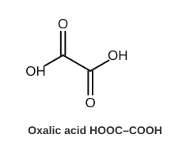

**Formic acid**

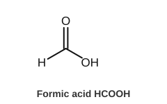

**Acetic acid**

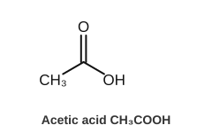

**Benzoic acid**

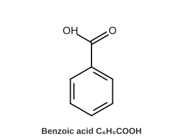

**Sodium benzoate**

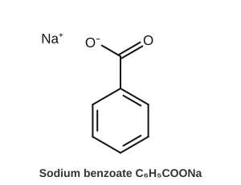

**Formaldehyde**

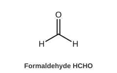

**Methyl acetate**

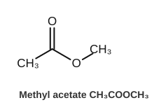

**Ethanol**

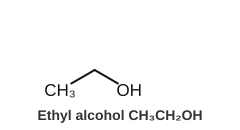

**Sodium acetate**

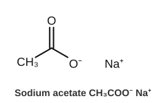

**Silver acetate**

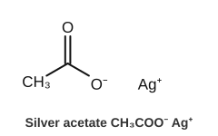

Inorganic compounds (no skeletal drawing needed):

```text
Caustic soda   NaOH            Na⁺ + OH⁻                  (Na +1)
Soda ash       Na₂CO₃          2Na⁺ + CO₃²⁻               (C +4 in carbonate)
Washing soda   Na₂CO₃·10H₂O    2Na⁺ + CO₃²⁻ + 10H₂O       (crystals, M = 286)
```

### Commonly confused pairs

| Pair | Difference |
|---|---|
| **Soda ash vs washing soda** | Soda ash = **anhydrous** Na₂CO₃ (white powder, M = 106). Washing soda = **Na₂CO₃·10H₂O** (transparent crystals, effloresce in air, M = 286). Washing soda is ≈ 37.06% Na₂CO₃ by mass. |
| **Formic vs acetic acid** | HCOOH has an aldehydic H on the carboxyl carbon, so it is a **reducing agent** (Tollens' and Fehling's positive). CH₃COOH has a methyl group and does not reduce. |
| **Methyl acetate vs ethyl alcohol** | Methyl acetate is an **ester** (C₃H₆O₂, fruity smell, hydrolyses to acetic acid + methanol). Ethyl alcohol is an **alcohol** (C₂H₆O, –OH group). |
| **Sodium vs silver acetate** | Sodium acetate is very soluble and colourless. Silver acetate is a white, sparingly soluble, light-sensitive solid: CH₃COONa + AgNO₃ → CH₃COOAg↓ + NaNO₃ |

---

## 1(b) Identification of Formic, Acetic, Oxalic and Benzoic Acids

### Preliminary observations

| Acid | State / solubility in cold water |
|---|---|
| Formic | Colourless liquid, miscible, pungent smell |
| Acetic | Colourless liquid, miscible, vinegar smell |
| Oxalic | White crystalline solid, soluble |
| Benzoic | White crystalline solid, **sparingly soluble in cold water**; dissolves in hot water and in NaOH |

**Common test (–COOH group):** all four give brisk effervescence of CO₂ with NaHCO₃ (lime water turns milky).

```text
RCOOH + NaHCO₃ → RCOONa + H₂O + CO₂↑
```

### Test 1 — Formic acid: Tollens' (silver mirror) test

| | |
|---|---|
| **Principle** | Formic acid has an aldehydic H–C(=O)– unit, so it is oxidised to CO₂ and reduces Ag⁺ to metallic silver. Acetic, oxalic and benzoic acids do not. |
| **Reagents** | AgNO₃ solution, dilute NH₄OH, clean test tube |
| **Procedure** | 1. Take 2 mL AgNO₃ in a clean tube. 2. Add NH₄OH drop by drop until the brown precipitate just dissolves (Tollens' reagent). 3. Add a few drops of the unknown acid. 4. Warm in a water bath without shaking. |
| **Observation** | **Bright silver mirror** on the wall of the tube (or grey/black precipitate). |
| **Reaction** | HCOOH + Ag₂O → CO₂ + H₂O + 2Ag↓ |
| **Conclusion** | Silver mirror confirms **formic acid**. |

Supporting tests for formic acid:

```text
Fehling's (warm):   HCOOH + 2CuO → Cu₂O↓ (red) + CO₂ + H₂O
Mercuric chloride:  HCOOH + 2HgCl₂ → Hg₂Cl₂↓ (white) + CO₂ + 2HCl
```

### Test 2 — Oxalic acid: CaCl₂ test (confirm with KMnO₄)

| | |
|---|---|
| **Principle** | Oxalate gives **insoluble calcium oxalate**, insoluble in acetic acid but soluble in dilute HCl. Oxalic acid also decolourises hot acidified KMnO₄. |
| **Reagents** | NH₄OH, CaCl₂ solution, dilute CH₃COOH, dilute H₂SO₄, KMnO₄ |
| **Procedure (A)** | 1. Neutralise the acid solution with dilute NH₄OH. 2. Add CaCl₂ solution. 3. Add dilute acetic acid to the precipitate. |
| **Observation (A)** | **White precipitate**, insoluble in acetic acid. |
| **Reaction (A)** | (COONH₄)₂ + CaCl₂ → (COO)₂Ca↓ + 2NH₄Cl |
| **Procedure (B)** | Acidify with dilute H₂SO₄, warm to about 60–70 °C, add KMnO₄ drop by drop. |
| **Observation (B)** | Pink colour is **decolourised**; CO₂ evolved. |
| **Reaction (B)** | 5(COOH)₂ + 2KMnO₄ + 3H₂SO₄ → K₂SO₄ + 2MnSO₄ + 10CO₂ + 8H₂O |
| **Conclusion** | White ppt insoluble in acetic acid, plus KMnO₄ decolourisation, confirms **oxalic acid**. |

> Formic acid also decolourises KMnO₄, so KMnO₄ cannot separate formic from oxalic. Use Tollens' and CaCl₂ for that.

### Test 3 — Acetic acid: neutral FeCl₃ test (confirm with ester test)

| | |
|---|---|
| **Principle** | Acetate gives red **ferric acetate**; on boiling it hydrolyses to a brown basic ferric acetate precipitate. |
| **Reagents** | NH₄OH (to neutralise), neutral FeCl₃ solution |
| **Procedure** | 1. Neutralise the acid with NH₄OH and boil off excess NH₃. 2. Add 1–2 drops of neutral FeCl₃. 3. Boil. |
| **Observation** | **Deep red colour**; on boiling, **reddish-brown precipitate** and a colourless solution. |
| **Reactions** | 3CH₃COONH₄ + FeCl₃ → (CH₃COO)₃Fe + 3NH₄Cl (red) <br> (CH₃COO)₃Fe + 2H₂O → Fe(OH)₂(CH₃COO)↓ + 2CH₃COOH |
| **Conclusion** | **Acetic acid**, once Tollens' (negative) and CaCl₂ (negative) have been done. Formates also give a red colour, so FeCl₃ confirms acetic acid only after formic acid is excluded. |

Ester test (supporting): heat the acid with ethanol and a few drops of conc. H₂SO₄, then pour into water.

```text
CH₃COOH + C₂H₅OH ⇌ CH₃COOC₂H₅ + H₂O      (fruity smell)
```

### Test 4 — Benzoic acid: solubility, NaOH and neutral FeCl₃

| | |
|---|---|
| **Principle** | Aromatic acid, sparingly soluble in cold water. Its neutral salt gives an insoluble **buff-coloured ferric benzoate**. Acidifying the sodium salt regenerates the insoluble acid. |
| **Reagents** | NaOH or NH₄OH, neutral FeCl₃, dilute HCl |
| **Procedure** | 1. Shake a little acid with cold water (does not dissolve). 2. Dissolve in dilute NaOH or NH₄OH (dissolves). 3. Boil off excess NH₃, add neutral FeCl₃. 4. In another tube add dilute HCl to the clear salt solution. |
| **Observation** | **Buff/pinkish-buff precipitate** with FeCl₃. HCl gives a **white precipitate** of benzoic acid. |
| **Reactions** | 3C₆H₅COONa + FeCl₃ → (C₆H₅COO)₃Fe↓ + 3NaCl <br> C₆H₅COONa + HCl → C₆H₅COOH↓ + NaCl |
| **Conclusion** | Buff precipitate and white precipitate on acidification confirm **benzoic acid**. |

### Summary table

| Test | Formic | Acetic | Oxalic | Benzoic |
|---|---|---|---|---|
| Cold-water solubility | Miscible | Miscible | Soluble | **Sparingly soluble** |
| NaHCO₃ effervescence | + | + | + | + |
| **Tollens' reagent** | **Silver mirror** | – | – | – |
| **CaCl₂ (neutralised)** | – | – | **White ppt** | – |
| Neutral FeCl₃ | Red | **Red; brown ppt on boiling** | – | **Buff ppt** |
| KMnO₄ (warm, acidic) | Decolourised | – | Decolourised | – |

### Identification flowchart

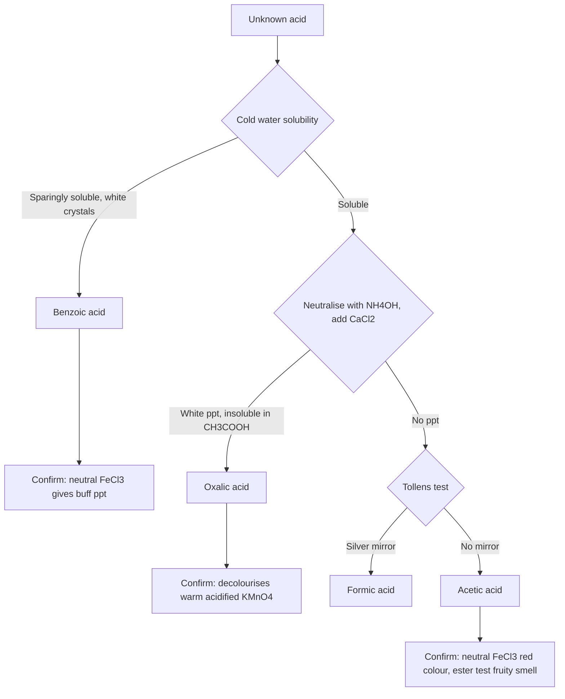

Text version (easy to redraw in the answer script):

```text
Unknown acid
   │
   ├── Sparingly soluble in cold water ──► BENZOIC ACID (FeCl₃: buff ppt)
   │
   └── Soluble
         │
         ├── CaCl₂ (neutralised): white ppt ──► OXALIC ACID
         │
         └── No ppt
               │
               ├── Tollens': silver mirror ──► FORMIC ACID
               └── Tollens': no mirror ─────► ACETIC ACID (FeCl₃: red)
```

---

# Question 2 — Even ID/Roll

## 2(a) Molecular Formulae and Structures

| # | Name | Molecular formula | Condensed formula | Functional group(s) / notes |
|---|---|---|---|---|
| 1 | Silver nitrate | AgNO₃ | Ag⁺ NO₃⁻ | Ionic salt; Ag +1, N +5 |
| 2 | Sodium acetate | C₂H₃NaO₂ | CH₃COO⁻ Na⁺ | Carboxylate |
| 3 | Sodium formate | CHNaO₂ | HCOO⁻ Na⁺ | Carboxylate |
| 4 | Benzaldehyde | C₇H₆O | C₆H₅–CHO | Aldehyde (–CHO) |
| 5 | Benzoic acid | C₇H₆O₂ | C₆H₅–COOH | Carboxylic acid |
| 6 | Cuprous oxide | Cu₂O | 2Cu⁺ O²⁻ | Red solid; Cu +1 |
| 7 | Ammonium hydroxide | NH₄OH (NH₃ + H₂O) | NH₄⁺ OH⁻ | Weak base; N −3 |
| 8 | Sodium formate | *Repeat of item 3* | HCOONa | Carboxylate |
| 9 | Salicylic acid | C₇H₆O₃ | 2-HO–C₆H₄–COOH | Phenolic –OH and –COOH |
| 10 | Methyl salicylate | C₈H₈O₃ | 2-HO–C₆H₄–COOCH₃ | Phenolic –OH and ester (oil of wintergreen) |
| 11 | Ethyl salicylate | C₉H₁₀O₃ | 2-HO–C₆H₄–COOC₂H₅ | Phenolic –OH and ester |

### Structural formulae

**Benzaldehyde**

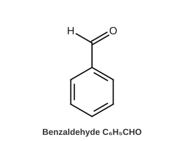

**Benzoic acid**


**Salicylic acid**

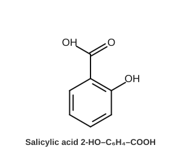

**Methyl salicylate**

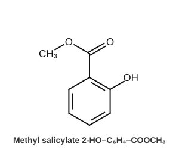

**Ethyl salicylate**

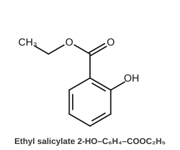

**Sodium acetate**


**Sodium formate**

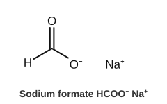

Inorganic compounds:

```text
Silver nitrate       AgNO₃     Ag⁺ + NO₃⁻
Cuprous oxide        Cu₂O      2Cu⁺ + O²⁻       (red; Cu +1)
Ammonium hydroxide   NH₄OH     NH₃ + H₂O ⇌ NH₄⁺ + OH⁻
```

Formation of the salicylate esters:

```text
Salicylic acid + CH₃OH    ⇌ (conc. H₂SO₄, heat)   Methyl salicylate + H₂O
Salicylic acid + C₂H₅OH   ⇌ (conc. H₂SO₄, heat)   Ethyl salicylate + H₂O
```

---

## 2(b) Determination of Sodium Carbonate Content of Washing Soda

### 1. Principle

Washing soda (Na₂CO₃·10H₂O) is titrated against **standard HCl** using **methyl orange**. Methyl orange changes colour at about pH 4, which marks complete neutralisation of both stages of carbonate.

```text
Na₂CO₃ + 2HCl → 2NaCl + H₂O + CO₂↑

Stage 1:  CO₃²⁻ + H⁺ → HCO₃⁻      (phenolphthalein end point, pH ≈ 8.3)
Stage 2:  HCO₃⁻ + H⁺ → H₂CO₃      (methyl orange end point, pH ≈ 4)
```

Stoichiometry: **1 mol Na₂CO₃ ≡ 2 mol HCl**. Phenolphthalein alone is not used because it signals only the first stage.

### 2. Apparatus

Burette (50 mL) with stand, pipette (25 mL) with filler, conical flasks (250 mL), volumetric flask (250 mL), analytical balance, beaker, glass rod, funnel, wash bottle, white tile.

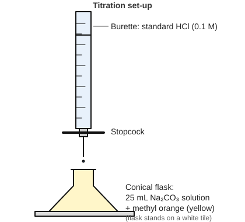

### 3. Reagents

- Standard HCl, **0.1 M** (assumed standardised)
- Washing soda sample
- Methyl orange indicator
- Distilled water

### 4. Preparation of Sample Solution

**Assumed values:** sample mass ≈ **2.860 g** in **250 mL**.
Reason: if the sample were pure Na₂CO₃·10H₂O (M = 286), 2.860 g is 0.0100 mol, giving 0.0400 M Na₂CO₃ in 250 mL. A 25 mL aliquot holds 1.00 mmol and needs about 20 mL of 0.1 M HCl, a convenient titre.

1. Weigh accurately about 2.860 g of washing soda crystals.
2. Dissolve in a little distilled water in a beaker, stirring with a glass rod.
3. Transfer quantitatively into the 250 mL volumetric flask through a funnel, rinsing beaker and funnel into the flask.
4. Dilute to the mark with distilled water, stopper, and mix by inversion.

### 5. Titration Procedure

1. Rinse the burette with HCl, fill it, remove air bubbles, and note the initial reading.
2. Pipette **25 mL** of sample solution into a conical flask.
3. Add **1–2 drops of methyl orange** (solution turns **yellow**).
4. Titrate with HCl, swirling constantly, with the flask on a white tile.
5. **End point:** yellow → **orange / faint pink** (first permanent change).
6. Do one rough titration, then repeat until **at least 3 concordant readings** (agreeing within ±0.1 mL).

### 6. Chemical Equation

```text
Na₂CO₃ + 2HCl → 2NaCl + H₂O + CO₂
```

### 7. Observation Table

Blank template for the exam:

| Trial | Initial burette reading (mL) | Final burette reading (mL) | Titre value (mL) |
|---|---:|---:|---:|
| Rough | | | |
| 1 | | | |
| 2 | | | |
| 3 | | | |

**Mean concordant titre** = average of the readings that agree within 0.1 mL (the rough value is excluded).

*Sample values for demonstration only (not real data):*

| Trial | Initial | Final | Titre |
|---|---:|---:|---:|
| Rough | 0.0 | 20.1 | 20.1 |
| 1 | 0.0 | 19.6 | 19.6 |
| 2 | 19.6 | 39.2 | 19.6 |
| 3 | 0.0 | 19.6 | 19.6 |

Mean concordant titre = **19.60 mL**

### 8. Calculation

Formulae:

```text
Moles HCl                 = M(HCl) × V(HCl) / 1000
Moles Na₂CO₃ in 25 mL     = ½ × moles HCl
Moles Na₂CO₃ in 250 mL    = 10 × moles in 25 mL
Mass of Na₂CO₃            = moles × 106
% Na₂CO₃ = (mass of Na₂CO₃ present / mass of washing soda sample) × 100
```

Substitution (**assumed data:** 0.1000 M HCl, titre 19.60 mL, sample 2.860 g):

```text
Moles HCl              = 0.1000 × 19.60 / 1000   = 1.960 × 10⁻³ mol
Moles Na₂CO₃ (25 mL)   = 1.960 × 10⁻³ / 2        = 0.980 × 10⁻³ mol
Moles Na₂CO₃ (250 mL)  = 0.980 × 10⁻³ × 10       = 9.80 × 10⁻³ mol
Mass of Na₂CO₃         = 9.80 × 10⁻³ × 106       = 1.039 g
% Na₂CO₃               = (1.039 / 2.860) × 100   = 36.3 %
```

Cross-check: pure Na₂CO₃·10H₂O contains 106/286 × 100 = **37.06%** Na₂CO₃, so this sample is about 98% pure.

Normality version: equivalent weight of Na₂CO₃ = 106/2 = 53. Use N₁V₁ (HCl) = N₂V₂ (Na₂CO₃), then strength (g/L) = N₂ × 53.

### 9. Final Result

> The percentage of sodium carbonate (Na₂CO₃) in the given washing soda sample = **____ %**
> (write your own calculated value; the 36.3% above is only a sample calculation).

### Determination flowchart

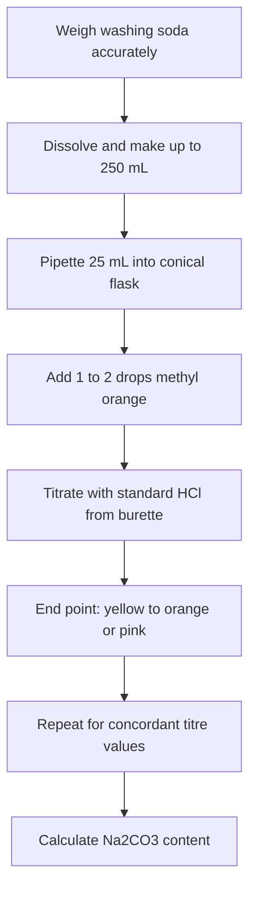

---

# Last-Minute Memorization Sheet

### Formulae

```text
Oxalic acid          (COOH)₂ / H₂C₂O₄·2H₂O     Sodium benzoate    C₆H₅COONa
Formic acid          HCOOH                      Sodium acetate     CH₃COONa
Formaldehyde         HCHO                       Silver acetate     CH₃COOAg
Methyl acetate       CH₃COOCH₃                  Ethyl alcohol      C₂H₅OH
Caustic soda         NaOH                       Soda ash           Na₂CO₃
Washing soda         Na₂CO₃·10H₂O               Silver nitrate     AgNO₃
Sodium formate       HCOONa                     Benzaldehyde       C₆H₅CHO
Benzoic acid         C₆H₅COOH                   Cuprous oxide      Cu₂O
Ammonium hydroxide   NH₄OH                      Salicylic acid     C₇H₆O₃
Methyl salicylate    C₈H₈O₃                     Ethyl salicylate   C₉H₁₀O₃
```

### Acid identification

| Acid | Key test | Positive observation |
|---|---|---|
| Formic | Tollens' | Silver mirror |
| Oxalic | CaCl₂ (neutralised) | White ppt, insoluble in CH₃COOH |
| Acetic | Neutral FeCl₃ (after formic excluded) | Red colour, brown ppt on boiling |
| Benzoic | Cold water, then FeCl₃ | Sparingly soluble; buff ppt |

### Main equations

```text
HCOOH + Ag₂O → CO₂ + H₂O + 2Ag
(COONH₄)₂ + CaCl₂ → CaC₂O₄↓ + 2NH₄Cl
5(COOH)₂ + 2KMnO₄ + 3H₂SO₄ → K₂SO₄ + 2MnSO₄ + 10CO₂ + 8H₂O
3CH₃COONH₄ + FeCl₃ → (CH₃COO)₃Fe + 3NH₄Cl
3C₆H₅COONa + FeCl₃ → (C₆H₅COO)₃Fe↓ + 3NaCl
Na₂CO₃ + 2HCl → 2NaCl + H₂O + CO₂
```

### Titration formulae

```text
Moles Na₂CO₃ (250 mL) = (M × V / 1000) × ½ × 10
Mass                  = moles × 106
% Na₂CO₃              = (mass Na₂CO₃ / mass sample) × 100
Pure Na₂CO₃·10H₂O     = 37.06 % Na₂CO₃
Indicator             : methyl orange, yellow → orange/pink
```

### Likely viva questions

1. **Why methyl orange, not phenolphthalein?** Methyl orange (pH ≈ 4) shows complete neutralisation to H₂CO₃; phenolphthalein only reaches the bicarbonate stage.
2. **Soda ash vs washing soda?** Anhydrous vs decahydrate (M = 106 vs 286).
3. **Why neutralise before the CaCl₂ or FeCl₃ tests?** Free acid interferes (the precipitates dissolve in acid); the tests need the salt form.
4. **Which acid gives a silver mirror?** Formic acid only.
5. **Why is oxalic acid titrated with KMnO₄ when warm?** To speed up the slow reaction (about 60–70 °C).
6. **Why is formic acid both an acid and a reducing agent?** It has an aldehydic hydrogen.
7. **Equivalent weight of Na₂CO₃?** 53 (106/2).
8. **Why is the rough titration excluded?** It only gives the approximate end point.
9. **Why use a white tile?** To see the colour change clearly.
10. **Ratio Na₂CO₃ : HCl?** 1 : 2.
