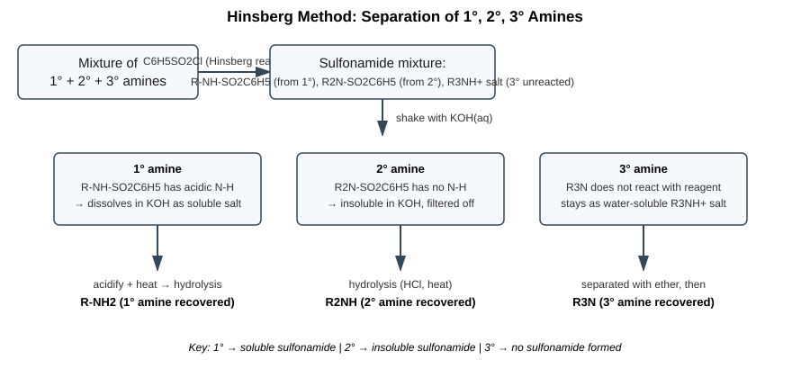
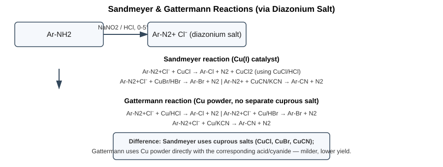
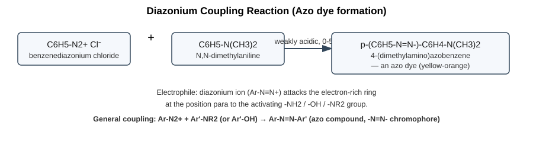
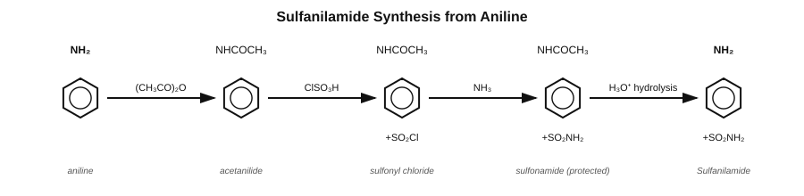
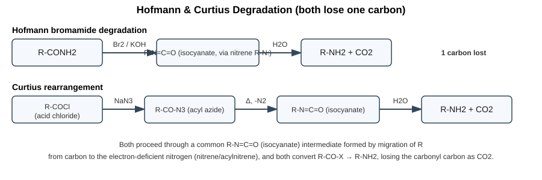
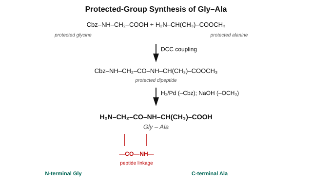
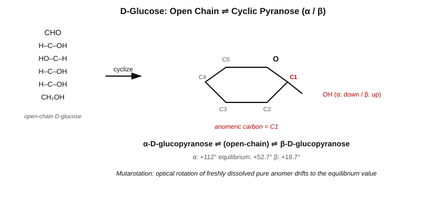
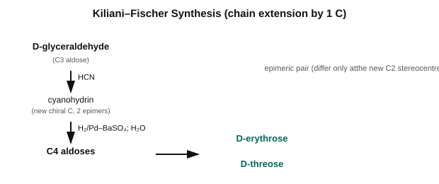
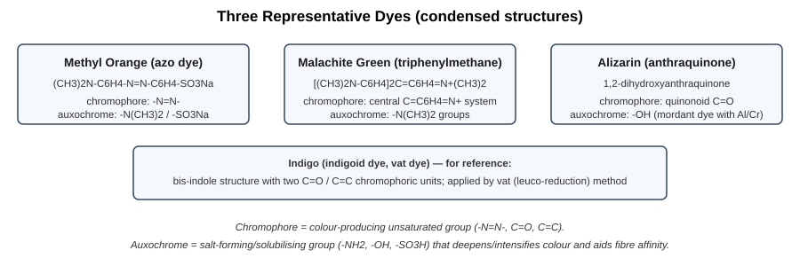

# CHEM-103 Exam Answers — Amines, Amino Acids, Carbohydrates & Dyes

## Image Set A — Amines and Amino Acids

### Q1. 1°, 2°, 3° Amines — Definitions, Separation, and Named Reactions

**Definitions (general formulas)**

| Class | General formula | Example |
|---|---|---|
| Primary (1°) | R–NH2 | CH3NH2 (methylamine) |
| Secondary (2°) | R2NH (R groups may differ) | (CH3)2NH (dimethylamine) |
| Tertiary (3°) | R3N | (CH3)3N (trimethylamine) |

They differ in the number of H atoms on N replaced by alkyl/aryl groups.

**Separation — Hinsberg method**

Treat the amine mixture with benzenesulfonyl chloride (C6H5SO2Cl) + KOH:

- **1° amine** → R–NH–SO2C6H5 (has acidic N–H) → **dissolves** in KOH as a soluble salt
- **2° amine** → R2N–SO2C6H5 (no N–H) → **insoluble** in KOH, filtered off
- **3° amine** → does not react with the reagent; forms a water-soluble salt with dilute acid, recovered from the ethereal layer

Each fraction is then isolated and the parent amine regenerated by acid/heat hydrolysis.



**(i) Sandmeyer and Gattermann reactions**

Both replace the diazonium group (–N2+) of an aromatic diazonium salt with –Cl, –Br, or –CN.

```
Ar-NH2 --NaNO2/HCl, 0-5°C--> Ar-N2+Cl⁻   (diazotization)

Sandmeyer:  Ar-N2+Cl⁻ + CuCl/HCl  → Ar-Cl + N2
            Ar-N2+Cl⁻ + CuBr/HBr  → Ar-Br + N2
            Ar-N2+Cl⁻ + CuCN/KCN  → Ar-CN + N2

Gattermann: Ar-N2+Cl⁻ + Cu powder/HCl → Ar-Cl + N2
            Ar-N2+Cl⁻ + Cu powder/KCN → Ar-CN + N2
```

**Difference:** Sandmeyer uses a preformed cuprous salt (CuCl/CuBr/CuCN) as catalyst; Gattermann uses copper powder directly with the corresponding acid, avoiding the need to prepare the cuprous salt separately (slightly lower yield).



**(ii) Coupling reaction and Sulfa-drug (sulfanilamide) synthesis**

*Diazonium coupling:* the diazonium ion is a weak electrophile that attacks electron-rich aromatic rings (anilines, phenols) at the *para* position, forming brightly coloured **azo compounds** (–N=N– chromophore) — the basis of azo dyes.

```
C6H5-N2+Cl⁻ + C6H5-N(CH3)2  --weakly acidic, 0-5°C-->
        p-(C6H5-N=N-)-C6H4-N(CH3)2   (an azo dye)
```



*Sulfa-drug (sulfanilamide) synthesis* — from aniline:

```
C6H5-NH2 --(CH3CO)2O--> C6H5-NHCOCH3 --ClSO3H--> p-CH3CONH-C6H4-SO2Cl
        --NH3--> p-CH3CONH-C6H4-SO2NH2 --hydrolysis (H3O+)--> p-H2N-C6H4-SO2NH2 (Sulfanilamide)
```

Acetylation first protects –NH2 from being sulfonated; the final hydrolysis removes the acetyl protecting group.



**(iii) Hofmann and Curtius degradation**

Both convert an acid derivative to a primary amine with **loss of one carbon atom** (the carbonyl carbon leaves as CO2), via a common isocyanate (R–N=C=O) intermediate.

```
Hofmann:  R-CONH2 --Br2/KOH--> [R-N: nitrene] --rearr.--> R-N=C=O --H2O--> R-NH2 + CO2

Curtius:  R-COCl --NaN3--> R-CO-N3 --Δ, -N2--> R-N=C=O --H2O--> R-NH2 + CO2
```



---

### Q2. Amino Acids and Peptides

**(i) Key terms**

| Term | Meaning | Example |
|---|---|---|
| Protein | Polypeptide of many (>50) amino acid residues, biologically functional | Haemoglobin |
| Amino acid | Contains both –NH2 and –COOH on the same carbon skeleton | Glycine, H2N-CH2-COOH |
| Essential amino acid | Cannot be synthesised by the body; must come from diet | Leucine, Lysine, Valine |
| Non-essential amino acid | Body can synthesise it | Glycine, Alanine |
| Zwitter ion | Amino acid exists as an internal salt: –NH3+ and –COO⁻ on the same molecule | H3N+-CH2-COO⁻ |
| Isoelectric point (pI) | pH at which the amino acid carries zero net charge (exists purely as zwitterion) | pI of glycine ≈ 5.97 |
| Peptide linkage | –CO–NH– amide bond joining two amino acid residues (loss of H2O) | Gly-Ala bond |

**(ii) Synthesis of α-amino acid — Strecker synthesis**

```
R-CHO + NH3 → R-CH(NH2)-OH --(-H2O)--> R-CH=NH
R-CH=NH + HCN → R-CH(NH2)-CN  (α-aminonitrile)
R-CH(NH2)-CN --H3O+/hydrolysis--> R-CH(NH2)-COOH (α-amino acid)
```

**(iii) End-group analysis of peptides**

- **N-terminal residue:**
  - *Sanger's method:* peptide + 1-fluoro-2,4-dinitrobenzene (FDNB) → DNP-peptide → acid hydrolysis → DNP-amino acid (yellow) identifies the N-terminal residue.
  - *Edman degradation:* peptide + phenyl isothiocyanate (PITC) → PTH-amino acid is cleaved off selectively without destroying the rest of the chain (allows repeated cycles — sequencing).
- **C-terminal residue:**
  - *Hydrazinolysis (Akabori method):* peptide + NH2NH2 (heat) → all residues except the C-terminal one form acid hydrazides; free C-terminal amino acid is isolated.
  - *Carboxypeptidase method:* enzyme cleaves residues one at a time from the C-terminus.

**(iv) Synthesis of Gly-Ala peptide (protected-group route)**

```
Cbz-NH-CH2-COOH  (N-protected glycine)
      --DCC-->  activated ester
      + H2N-CH(CH3)-COOCH3  (C-protected alanine)  -->
Cbz-NH-CH2-CO-NH-CH(CH3)-COOCH3   (protected dipeptide)
      --H2/Pd (removes Cbz), then NaOH (removes -OCH3)-->
H2N-CH2-CO-NH-CH(CH3)-COOH   (Gly-Ala, free dipeptide)
```

Sequence direction: N-terminal Gly — peptide bond — C-terminal Ala.



**(v) Essential vs. non-essential amino acids**

| Essential | Non-essential |
|---|---|
| Cannot be synthesised by the body | Can be synthesised in the body |
| Must be obtained from diet/food | Not diet-dependent |
| e.g. Leucine, Lysine, Valine, Threonine | e.g. Glycine, Alanine, Serine |

---

## Image Set B — Carbohydrates and Dyes

### Q1. Carbohydrates

**(i) Asymmetric carbon atom and Mutarotation**

- **Asymmetric (chiral) carbon:** a carbon atom bonded to four different atoms/groups; source of optical isomerism (glucose has 4 such carbons: C2, C3, C4, C5).
- **Mutarotation:** the spontaneous change in specific optical rotation of a freshly dissolved pure anomer (α or β) toward a constant equilibrium value, as the ring opens/recloses via the open-chain aldehyde form. For D-glucose: α-form (+112°) and β-form (+18.7°) both drift to the equilibrium value **+52.7°**.

**(ii) Cyclic structures**

- **D-glucose:** exists as α-D-glucopyranose (–OH on C1 down) ⇌ β-D-glucopyranose (–OH on C1 up), a six-membered pyranose (hemiacetal) ring, interconverting through the open-chain form.
- **Sucrose:** α-D-glucopyranosyl-(1→2)-β-D-fructofuranoside — a **non-reducing** disaccharide because both anomeric carbons (C1 of glucose and C2 of fructose) are joined in the glycosidic bond.
- **Cellulose:** [β-D-glucopyranose-(1→4)]n — long unbranched chains, β(1→4) linkages give straight, H-bonded fibrils.
- **Starch:** mixture of **amylose** [α-D-Glcp-(1→4)]n, unbranched, and **amylopectin**, branched via α(1→4) main chain with α(1→6) branch points roughly every 24–30 units.



**(iii) Aldose homologation and degradation**

*To the next higher aldose — Kiliani–Fischer synthesis:*

```
R-CHO --HCN--> R-CH(OH)-CN --H2/Pd-BaSO4--> R-CH(OH)-CH=NH --H2O--> R-CH(OH)-CHO
```
(adds one carbon; gives a pair of epimeric higher aldoses since a new chiral centre is formed)

*To the next lower aldose — Wohl or Ruff degradation:*

```
Ruff:  R-CH(OH)-CHO --Br2/H2O--> R-CH(OH)-COOH --H2O2, Fe2(SO4)3--> R-CHO  (one C fewer)
Wohl:  aldose → aldoxime (NH2OH) → nitrile (Ac2O, -H2O) → HCN loss (NaOMe) → lower aldose
```



**(iv) Ring size of D-glucose**

Evidence establishing the **six-membered pyranose ring**:

1. Glucose is methylated exhaustively (Me2SO4/NaOH) to give pentamethyl glucose, then hydrolysed → **2,3,4,6-tetramethyl-D-glucose**.
2. On oxidation (HNO3), the tetramethyl glucose gives a dibasic acid, indicating C5 (not C4) carries the ring oxygen, i.e. the ring spans C1–C5 through O — a **six-membered (pyranose)** ring, not five-membered (furanose).
3. This is confirmed independently by comparison with glucose methylated as its methyl glycoside and by the small (but real) difference in properties between the isolated α/β anomers, consistent with a pyranose hemiacetal rather than an open chain.

---

### Q2. Dyes

**(i) Key terms**

| Term | Meaning |
|---|---|
| Colour | Perception arising from selective absorption of visible light by a compound |
| Dye | A coloured, generally soluble substance with affinity for a substrate (fibre), used to impart colour |
| Pigment | Insoluble, finely divided coloured particulate matter, applied as a suspension (not absorbed into fibre) |
| Chromophore | Unsaturated group responsible for colour, e.g. –N=N–, C=O, C=C, –NO2 |
| Auxochrome | Salt-forming group (–NH2, –OH, –SO3H) that deepens/intensifies colour and often confers fibre affinity/solubility |
| Dye intermediate | Compound prepared from raw materials and further converted into the final dye, e.g. aniline, naphthalene sulfonic acids |
| Raw materials | Basic feedstocks for dye manufacture — benzene, naphthalene, anthracene and their derivatives (from coal tar/petrochemicals) |

**(ii) Three dyes — name and structure**

| Dye | Structure (condensed) | Class |
|---|---|---|
| Methyl Orange | (CH3)2N-C6H4-N=N-C6H4-SO3Na | Azo |
| Malachite Green | [(CH3)2N-C6H4]2C=C6H4=N+(CH3)2 | Triphenylmethane |
| Alizarin | 1,2-dihydroxyanthraquinone | Anthraquinone (mordant) |



**(iii) Classification of dyes**

*By chemical structure:*

- Azo dyes (–N=N–) — e.g. Methyl Orange, Congo Red
- Nitro / Nitroso dyes — e.g. Naphthol Yellow
- Triphenylmethane dyes — e.g. Malachite Green, Crystal Violet
- Anthraquinone dyes — e.g. Alizarin
- Indigoid dyes — e.g. Indigo
- Xanthene dyes — e.g. Fluorescein, Eosin
- Phthalocyanine dyes — e.g. Copper phthalocyanine
- Sulfur dyes
- Cyanine dyes

*By method of application:*

| Class | Application principle |
|---|---|
| Acid dyes | Applied to wool/silk/nylon from acidic bath, ionic bond with protein –NH3+ |
| Basic dyes | Cationic dyes on acrylic/tannin-mordanted cotton |
| Direct dyes | Applied directly to cotton from aqueous bath, no mordant needed |
| Reactive dyes | Form covalent bond with –OH of cellulose |
| Vat dyes | Applied via water-insoluble leuco form, reduced then oxidised in situ (e.g. Indigo) |
| Disperse dyes | Fine aqueous dispersion, for synthetic fibres (polyester) |
| Mordant dyes | Require a metal-salt mordant (Al, Cr) to fix to fibre (e.g. Alizarin) |
| Sulfur dyes | Contain sulfur, applied by vat-type reduction, cheap, for cotton |
| Solvent dyes | Soluble in organic solvents/waxes/plastics, non-ionic |
| Azoic dyes (ice colours) | Formed in situ on the fibre by coupling a diazonium salt with a naphthol |

**(iv) Non-textile uses of dyes**

- Printing inks and writing inks
- Paints, coatings and lacquers
- Colouring of plastics and rubber
- Leather colouring
- Biological/histological stains and microscopy (e.g. Eosin, Methylene Blue)
- Acid-base indicators (e.g. Methyl Orange, Phenolphthalein)
- Food colourants and pharmaceutical colouring (permitted classes only)
- Paper and cosmetics colouring
