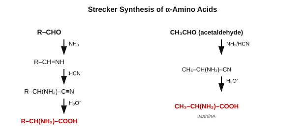

# CHEM-103 Exam Answers

## Questions

**Set A — Amines and Amino Acids**

**Q1.**
- Define primary (1°), secondary (2°) and tertiary (3°) amines with general formulas and examples. How can a mixture of the three be separated (Hinsberg method)?
- (i) What are the Sandmeyer and Gattermann reactions? What is the difference between them?
- (ii) Explain the diazonium coupling reaction. Give the synthesis of the sulfa drug sulfanilamide starting from aniline.
- (iii) What are the Hofmann and Curtius degradation reactions?

**Q2.**
- (i) Define: protein, amino acid, essential amino acid, non-essential amino acid, zwitterion, isoelectric point, peptide linkage.
- (ii) How is an α-amino acid synthesised by the Strecker method?
- (iii) How are the N-terminal and C-terminal residues of a peptide identified (end-group analysis)?
- (iv) Give the synthesis of the dipeptide Gly-Ala by the protected-group route.
- (v) Differentiate between essential and non-essential amino acids.

**Set B — Carbohydrates and Dyes**

**Q1.**
- (i) What is an asymmetric (chiral) carbon atom? What is mutarotation?
- (ii) Describe the cyclic structures of D-glucose, sucrose, cellulose and starch.
- (iii) How is an aldose converted to the next higher homologue (Kiliani–Fischer synthesis) and to the next lower homologue (Wohl/Ruff degradation)?
- (iv) What is the evidence for the six-membered (pyranose) ring size of D-glucose?

**Q2.**
- (i) Define: colour, dye, pigment, chromophore, auxochrome, dye intermediate, raw materials.
- (ii) Give the name, structure and class of three dyes.
- (iii) Classify dyes by chemical structure and by method of application.
- (iv) What are the non-textile uses of dyes?

---
## Set A — Amines and Amino Acids

### Q1

#### Definition of Primary, Secondary and Tertiary Amines

| Class | General formula | Structure | N–H present? |
|---|---|---|---|
| **Primary (1°)** | R–NH₂ | `H₃C—NH—H` (methylamine) | Yes (2×) |
| **Secondary (2°)** | R₂NH | `H₃C—NH—CH₃` (dimethylamine) | Yes (1×) |
| **Tertiary (3°)** | R₃N | `(H₃C)₃N` (trimethylamine) | No |

Classification is by the **number of alkyl/aryl groups on N**, not by the carbon to which N is attached.

#### Hinsberg Method

Reagent: **benzenesulfonyl chloride (PhSO₂Cl) + KOH**

```
1° amine
      H
      |
  R — N — H
        +  Ph—SO₂—Cl
        ↓ KOH
  Ph—SO₂—N(R)⁻K⁺   → SOLUBLE (acidic N–H ionizes in alkali)

2° amine
      R'
      |
  R — N — H
        +  Ph—SO₂—Cl
        ↓ KOH
  Ph—SO₂—N(R)(R')   → INSOLUBLE (N–H present but not acidic enough)

3° amine
  R₃N  +  Ph—SO₂—Cl   →  NO REACTION (no N–H to displace)
  R₃N  +  HCl (dil.)  →  [R₃NH]⁺Cl⁻  (water-soluble ammonium salt)
```

Each layer is separated (filtration / acidification of the aqueous layer), then the parent amine is regenerated by acid hydrolysis (1°, 2°) or basification (3°).


#### Worked Example

Mixture: **ethylamine (1°) + N-methylethylamine (2°) + triethylamine (3°)**

```
C₂H₅NH₂ + PhSO₂Cl --KOH--> C₂H₅–N(SO₂Ph)⁻K⁺        (soluble; regenerate by acid hydrolysis + heat)
(C₂H₅)(CH₃)NH + PhSO₂Cl --KOH--> (C₂H₅)(CH₃)N–SO₂Ph  (insoluble solid; regenerate by acid hydrolysis)
(C₂H₅)₃N + PhSO₂Cl → no reaction
(C₂H₅)₃N + HCl(dil.) → (C₂H₅)₃NH⁺Cl⁻                  (water-soluble; recovered from ethereal layer)
```

---

#### (i) Sandmeyer and Gattermann Reactions

Both replace the **diazonium group (–N₂⁺)** with –Cl, –Br or –CN.

```
### Diazotization (common first step)

      NH₂
       |
      ⌬
       ↓ NaNO₂ / HCl, 0–5 °C

     N₂⁺Cl⁻
       |
       ⌬
```

```
### Sandmeyer                              ### Gattermann
 uses preformed cuprous salt                uses Cu powder directly

 Ar–N₂⁺Cl⁻ + CuCl/HCl → Ar–Cl + N₂          Ar–N₂⁺Cl⁻ + Cu/HCl → Ar–Cl + N₂
 Ar–N₂⁺Cl⁻ + CuBr/HBr → Ar–Br + N₂
 Ar–N₂⁺Cl⁻ + CuCN/KCN → Ar–CN + N₂          Ar–N₂⁺Cl⁻ + Cu/KCN → Ar–CN + N₂
```

| Feature | **Sandmeyer** | **Gattermann** |
|---|---|---|
| Catalyst | Preformed cuprous salt (CuCl, CuBr, CuCN) | Fresh copper powder |
| Yield | Generally higher | Slightly lower |
| Convenience | Needs the cuprous salt prepared separately | Simpler — no separate salt preparation |

**Worked example:** aniline → chlorobenzene and → benzonitrile

```
      NH₂                    N₂⁺Cl⁻                   Cl
       |         NaNO₂/HCl     |        CuCl/HCl        |
      ⌬     ───────────────►  ⌬     ───────────────►   ⌬
                0–5 °C
                (aniline)      (benzenediazonium            (chlorobenzene,
                                  chloride)                   Sandmeyer product)

      N₂⁺Cl⁻      CuCN/KCN        CN
        |     ───────────────►     |
        ⌬                          ⌬
                                (benzonitrile)
```


---

#### (ii) Diazonium Coupling

The diazonium ion is a weak **electrophile** that attacks electron-rich aromatic rings (anilines, phenols) at the *para* position, forming coloured **azo compounds** — the **–N=N– chromophore**.

```
       N₂⁺Cl⁻                         N=N
          |             +  ⌬—OH  →     |         (para-coupling)
          ⌬                          ⌬       ⌬
                    NaOH, 0–5 °C              |
                                              OH
```

**Example (p-hydroxyazobenzene):**

```
C₆H₅–N₂⁺Cl⁻ + C₆H₅–OH --NaOH, 0-5°C--> p-(C₆H₅–N=N–)–C₆H₄–OH
```

Key group formed: **—N=N—** (the **azo chromophore**, basis of azo dyes such as Methyl Orange).


#### Sulfanilamide Synthesis (from aniline)

```
       NH₂                                    NHCOCH₃
        |          (CH₃CO)₂O                     |
       ⌬       ─────────────────►                ⌬
     aniline      (protects –NH₂)              acetanilide

       NHCOCH₃                                 NHCOCH₃
          |            ClSO₃H                     |
          ⌬       ─────────────────►               ⌬
                                                    |
                                                  SO₂Cl

       NHCOCH₃                                   NH₂
          |               NH₃                     |
          ⌬       ─────────────────►               ⌬
          |                                        |
        SO₂NH₂         H₃O⁺ (hydrolysis,        SO₂NH₂
                       removes acetyl group)
                       ─────────────────►
                                              Sulfanilamide
```

**Why protect –NH₂?** Free aniline's –NH₂ would itself be attacked/oxidized by ClSO₃H; acetylation converts it into a much less reactive amide, so sulfonation occurs cleanly at the ring. Final hydrolysis removes the acetyl group to restore free –NH₂. Sulfanilamide is the parent of the sulfa-drug class (e.g. sulfadiazine, sulfamethoxazole).


---

#### (iii) Hofmann and Curtius Degradation

Both convert an acid derivative → **1° amine with loss of one carbon** (as CO₂), via a common **isocyanate** intermediate.

```
Hofmann:   R–CO–NH₂  --Br₂/KOH-->  R–N=C=O  --H₂O-->  R–NH₂ + CO₂
Curtius:   R–COCl  --NaN₃-->  R–CO–N₃  --Δ,-N₂-->  R–N=C=O  --H₂O-->  R–NH₂ + CO₂
```

**Worked example — Hofmann:** propanamide → ethylamine

```
CH₃CH₂—CONH₂  --Br₂/KOH-->  CH₃CH₂—N=C=O  --H₂O-->  CH₃CH₂—NH₂ + CO₂
 (propanamide)                                        (ethylamine, one C lost)
```

**Worked example — Curtius:** propanoyl chloride → ethylamine

```
CH₃CH₂—COCl --NaN₃--> CH₃CH₂—CO—N₃ --Δ,-N₂--> CH₃CH₂—N=C=O --H₂O--> CH₃CH₂—NH₂ + CO₂
 (propanoyl chloride)                                                (ethylamine)
```

Key point: **one carbon atom is always lost** (the original carbonyl carbon leaves as CO₂).


---

### Q2

#### (i) Definitions

| Term | Definition | Example |
|---|---|---|
| **Protein** | Polypeptide of many (>50) amino-acid residues, biologically functional | Haemoglobin |
| **Amino acid** | Contains both –NH₂ and –COOH on the same carbon skeleton | `H₂N—CH₂—COOH` (glycine) |
| **Essential amino acid** | Body cannot synthesize it; must come from diet | Leucine, Lysine, Valine |
| **Non-essential amino acid** | Body can synthesize it | Glycine, Alanine |
| **Zwitterion** | Internal salt: –NH₃⁺ and –COO⁻ on the same molecule, net charge zero | `H₃N⁺—CH₂—COO⁻` |
| **Isoelectric point (pI)** | pH at which the amino acid carries zero net charge | pI(glycine) ≈ 5.97 |
| **Peptide linkage** | `—CO—NH—` amide bond joining two residues (H₂O lost) | Gly–Ala bond |

```
Glycine                Alanine                 Zwitterion (glycine)
H₂N—CH₂—COOH                 CH₃                        H
                               |                          |
                       H₂N—CH—COOH               H₃N⁺—CH₂—COO⁻
```

#### (ii) Strecker Synthesis

```
      O
      ||
  R — C — H
   (aldehyde)
        ↓ NH₃
    R—CH=NH
        ↓ HCN
       NH₂
        |
    R—CH—C≡N        (α-aminonitrile)
        ↓ H₃O⁺
       NH₂
        |
    R—CH—COOH        (α-amino acid)
```

**Worked example — alanine from acetaldehyde:**

```
      O
      ||
 CH₃—C—H
 (acetaldehyde)
        ↓ NH₃
   CH₃—CH=NH
        ↓ HCN
       NH₂
        |
  CH₃—CH—C≡N     (α-aminopropionitrile)
        ↓ H₃O⁺
       NH₂
        |
  CH₃—CH—COOH    alanine
```



#### (iii) N-terminal and C-terminal Analysis (End-group Analysis)

```
H₂N—CH(R)—CO—NH—CH(R')—COOH
 ↑                        ↑
N-terminal          C-terminal
```

**N-terminal identification**

- **Sanger's method:** peptide + **1-fluoro-2,4-dinitrobenzene (FDNB)** → DNP-peptide → acid hydrolysis → yellow **DNP-amino acid** identifies the N-terminal residue.
- **Edman degradation:** peptide + **phenyl isothiocyanate (PITC)** → cleaves and identifies one N-terminal residue per cycle as a **PTH-amino acid**, without destroying the rest of the chain (allows repeated sequencing cycles).

```
peptide + PhN=C=S (PITC)  →  PTH–amino acid  +  shortened peptide (next cycle)
```

**C-terminal identification**

- **Hydrazinolysis (Akabori method):** peptide + NH₂NH₂ (heat) → all residues except the C-terminal one form acid hydrazides; the free C-terminal amino acid is isolated.
- **Carboxypeptidase method:** enzyme cleaves residues **one at a time from the C-terminus**.

**Worked example — Gly–Ala–Val:**

```
      H₂N—CH₂—CO—NH—CH(CH₃)—CO—NH—CH(CH(CH₃)₂)—COOH
        ↑ Gly                                    ↑ Val
     N-terminal                             C-terminal

Sanger:  FDNB → hydrolysis → DNP-glycine        (confirms Gly = N-terminal)
Edman:   cycle 1 → PTH-glycine, leaves Ala-Val   (confirms Gly = N-terminal)
Hydrazinolysis: Gly-NHNH₂ + Ala-NHNH₂ + free Val  (confirms Val = C-terminal)
Carboxypeptidase: releases Val, then Ala          (confirms Val = C-terminal)
```

#### (iv) Gly-Ala Synthesis (protected-group route)

```
Cbz—NH—CH₂—COOH                    CH₃
 (protected glycine)                 |
                          +   H₂N—CH—COOCH₃
                              (protected alanine)
        ↓ DCC coupling

Cbz—NH—CH₂—CO—NH—CH(CH₃)—COOCH₃
        (protected dipeptide)

        ↓ H₂/Pd (removes Cbz), then NaOH (removes –OCH₃)

H₂N—CH₂—CO—NH—CH(CH₃)—COOH
              ↑
        —CO—NH— = peptide linkage

   N-terminal Gly  →  C-terminal Ala      (Gly–Ala, free dipeptide)
```


#### (v) Essential vs Non-essential Amino Acids

| **Essential** | **Non-essential** |
|---|---|
| Cannot be synthesized by the body | Can be synthesized by the body |
| Must be obtained from diet | Not diet-dependent |
| e.g. **Leucine**, Lysine, Valine, Threonine | e.g. **Alanine**, Glycine, Serine |

---

## Image Set B — Carbohydrates and Dyes

### Q1

#### (i) Chiral Carbon and Mutarotation

**Asymmetric (chiral) carbon:** a carbon bonded to **four different** groups; source of optical isomerism.

```
D-glucose C2:  bonded to –H, –OH, –CHO(chain), –CH(OH)CH(OH)CH(OH)CH₂OH  → 4 different groups → chiral
```
Glucose has 4 such chiral carbons (C2, C3, C4, C5).

**Mutarotation:** the spontaneous drift in specific rotation of a freshly dissolved pure anomer (α or β) toward a fixed equilibrium value, as the ring opens/recloses through the open-chain form.

```
α-D-glucose (+112°)  ⇌  open-chain glucose  ⇌  β-D-glucose (+18.7°)
                    equilibrium value: +52.7°
```

#### (ii) Cyclic Structures

**D-glucose** — open chain cyclizes into the **six-membered pyranose (hemiacetal) ring**; C1 becomes the new **anomeric carbon**, giving α (–OH down) and β (–OH up) forms.

```
   CHO                                      O
    |                                    ⌬────⌬      ← pyranose ring
H—C—OH                                  /        \
    |                cyclize      C5            C1—OH(α)/OH(β)  ← anomeric C
HO—C—H          ───────────►      |              |
    |                              C4 ─── C3 ─── C2
H—C—OH
    |
H—C—OH
    |
  CH₂OH
```


**Sucrose** — **non-reducing** disaccharide; both anomeric carbons are tied up in the glycosidic bond:

```
α-D-glucopyranose — O — β-D-fructofuranoside
        C1                    C2
       (glycosidic linkage: 1→2; both anomeric carbons engaged → non-reducing)
```

**Cellulose** — linear, unbranched **β(1→4)** polymer:

```
β-D-Glc —(1→4)— β-D-Glc —(1→4)— β-D-Glc —(1→4)— ...
```
Straight chains, H-bonded fibrils. *Example:* cotton, plant cell walls.

**Starch** — mixture of unbranched **amylose** and branched **amylopectin**:

```
Amylose:      Glc —α(1→4)— Glc —α(1→4)— Glc —α(1→4)— ...

Amylopectin:                    Glc
                                  |
                                α(1→6)  ← branch point
                                  |
              Glc—α(1→4)—Glc—α(1→4)—Glc
```
*Example:* potato/rice starch ≈ 20–25% amylose, 75–80% amylopectin.

#### (iii) Kiliani–Fischer / Wohl–Ruff

**Kiliani–Fischer (chain extension by one carbon):**

```
R–CHO (n C)  --HCN-->  R–CH(OH)–CN  --H₂/Pd-BaSO₄-->  R–CH(OH)–CH=NH  --H₂O-->  R–CH(OH)–CHO (n+1 C)
```
New chiral centre → gives a pair of **epimeric** higher aldoses.

**Worked example:** D-glyceraldehyde (C3) → D-erythrose + D-threose (C4, epimeric pair)

```
D-glyceraldehyde --HCN--> cyanohydrin(2 epimers) --H₂/Pd-BaSO₄--> imine --H₂O--> D-erythrose + D-threose
```


**Ruff degradation (chain shortening by one carbon):**

```
R–CH(OH)–CHO  --Br₂/H₂O-->  R–CH(OH)–COOH  --H₂O₂, Fe₂(SO₄)₃-->  R–CHO (one C fewer)
```

**Wohl degradation:**

```
aldose --NH₂OH--> aldoxime --Ac₂O, -H₂O--> nitrile --NaOMe (-HCN)--> lower aldose
```

**Worked example (Ruff):** D-glucose (C6) → D-arabinose (C5)

```
D-glucose --Br₂/H₂O--> D-gluconic acid --H₂O₂, Fe₂(SO₄)₃--> D-arabinose
```

#### (iv) Evidence for Pyranose Ring Size

```
D-glucose
    ↓ Me₂SO₄ / NaOH
pentamethyl glucose
    ↓ hydrolysis
2,3,4,6-tetramethyl-D-glucose
    ↓ HNO₃ oxidation
dibasic acid  →  shows C5 (not C4) carries the ring oxygen
                → ring spans C1–C5 through O
                → SIX-MEMBERED (pyranose) ring
```

1. Exhaustive methylation (Me₂SO₄/NaOH) → hydrolysis gives **2,3,4,6-tetramethyl-D-glucose**.
2. Oxidation (HNO₃) of this tetramethyl glucose gives a **dibasic acid**, showing the ring oxygen bridges **C1–C5** → **pyranose**, not furanose.
3. Confirmed by comparison with the methyl glycoside and by the small but real difference between isolated α/β anomers (consistent with a cyclic hemiacetal).

*Contrast:* fructose gives 1,3,4,6-tetramethyl fructose on the same procedure → ring oxygen bridges **C2–C5** → fructose is a five-membered **furanose**.

---

### Q2

#### (i) Definitions

| Term | Meaning | Example |
|---|---|---|
| **Colour** | Perception from selective absorption of visible light | — |
| **Dye** | Soluble coloured substance with affinity for a fibre | Methyl Orange |
| **Pigment** | Insoluble, finely divided coloured matter, applied as suspension | TiO₂ (white pigment) |
| **Chromophore** | Unsaturated group responsible for colour | `—N=N—`, C=O, C=C, –NO₂ |
| **Auxochrome** | Salt-forming group that deepens colour / gives fibre affinity | –NH₂, –OH, –SO₃H |
| **Dye intermediate** | Compound made from raw materials, converted into the dye | Aniline, naphthalenesulfonic acids |
| **Raw materials** | Basic feedstocks for dye manufacture | Benzene, naphthalene, anthracene (coal tar/petrochemicals) |

**Worked example:** in Methyl Orange, `(CH₃)₂N–C₆H₄–N=N–C₆H₄–SO₃Na`, the **chromophore** is the –N=N– azo linkage and the **auxochromes** are –N(CH₃)₂ and –SO₃Na (deepen colour, confer water solubility). TiO₂, by contrast, is an insoluble **pigment**, applied as a suspension.

#### (ii) Three Dyes

| Dye | Structure (condensed) | Class | Chromophore | Use |
|---|---|---|---|---|
| **Methyl Orange** | `(CH₃)₂N–C₆H₄–N=N–C₆H₄–SO₃Na` | Azo | –N=N– | Acid-base indicator |
| **Malachite Green** | `[(CH₃)₂N–C₆H₄]₂C=C₆H₄=N⁺(CH₃)₂` | Triphenylmethane | C⁺ (central carbonium) | Basic dye for acrylic fibres |
| **Alizarin** | 1,2-dihydroxyanthraquinone | Anthraquinone (mordant) | C=O (quinonoid) | Mordant dye (with Al/Cr) |


#### (iii) Classification of Dyes

**By chemical structure**

| Class | Characteristic group | Example |
|---|---|---|
| Azo | –N=N– | Methyl Orange, Congo Red |
| Nitro/Nitroso | –NO₂ / –NO | Naphthol Yellow |
| Triphenylmethane | triphenylmethane skeleton | Malachite Green, Crystal Violet |
| Anthraquinone | anthraquinone skeleton | Alizarin |
| Indigoid | indigo skeleton | Indigo |
| Xanthene | xanthene skeleton | Fluorescein, Eosin |
| Phthalocyanine | phthalocyanine macrocycle | Cu-phthalocyanine |
| Sulfur | S-containing system | Sulfur Black |
| Cyanine | polymethine chain | Cyanine dyes |

**By method of application**

| Class | Application principle | Example |
|---|---|---|
| Acid | Acidic bath, ionic bond with –NH₃⁺ of protein fibre | Orange II |
| Basic | Cationic dye on acrylic/mordanted cotton | Malachite Green |
| Direct | Applied directly to cotton, no mordant | Congo Red |
| Reactive | Covalent bond with cellulose –OH | Procion dyes |
| Vat | Reduced to soluble leuco form, then oxidized in situ | Indigo |
| Disperse | Fine aqueous dispersion, for synthetic fibres | Disperse Blue 1 |
| Mordant | Requires metal-salt mordant (Al, Cr) | Alizarin |
| Sulfur | S-containing, vat-type reduction, cheap, cotton | Sulfur Black 1 |
| Solvent | Soluble in organic media, non-ionic | Sudan I |
| Azoic (ice colours) | Formed in situ by coupling on the fibre | Naphthol AS + Fast Red base |

#### (iv) Non-textile Uses of Dyes

| Use | Example |
|---|---|
| Biological staining | Methylene Blue, Eosin |
| Acid–base indicators | Methyl Orange, Phenolphthalein |
| Printing inks | Dye-based inks |
| Cosmetics | Hair dyes |
| Food colouring | Permitted food dyes |
| Pharmaceutical colouring | Tablet/capsule colourants |
| Paper | Paper dyes |
| Plastics | Polymer colouring |
| Microscopy | Fluorescent dyes |
| Laser technology | Laser dyes |
