# Chemistry-II (CHEM 103) — BUTEX
# Complete Solved Question Bank — 2017–2023 (with visual assets embedded)

*This is the original solved question bank (2017–2023) with diagrams from `chem103-visual-assets.zip` embedded at the point where each answer is fully given. Image paths are relative to this file sitting alongside the `assets/` folder (i.e. `assets/mechanisms/...`, etc.) — adjust the path prefix if you place this file elsewhere in your repo. Cross-references ("see 2023-Qx") from the original are preserved; images are only embedded once, at the fullest treatment of each topic, matching the original document's own de-duplication style.*

> **Correction note:** 2022 Q1(d) is transcribed below exactly as scanned ("Show that E₂ reaction is first order but E₁ 2nd order reaction"), but this is chemically reversed. E1 is actually first-order and E2 is second-order — see the note at that question, and the diagrams `assets/mechanisms/e1-mechanism.svg` / `e2-mechanism.svg`, which show the correct assignment.

---

## 2023 (Full Marks 72, Time 3.0 Hrs)

### Part A

#### Question 1 [3+3+3+3=12]

##### (a) What is meant by mesomeric effect and hyper-conjugative effect? [3]
**Mesomeric (resonance) effect:** The displacement of π-electrons or lone-pair electrons from a multiple bond or an atom bearing a lone pair to another part of a conjugated system, through overlapping p-orbitals, resulting in delocalisation of charge. It is denoted +M (electron-donating, e.g. –NH₂, –OH, –OR, halogens) or –M (electron-withdrawing, e.g. –NO₂, –CHO, –COOH, –CN), and is transmitted through the π-system, e.g.
CH₂=CH–OCH₃ ↔ ⁻CH₂–CH=O⁺HCH₃ (an example of +M).

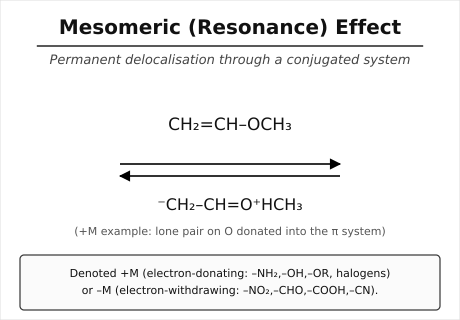

**Hyperconjugation (Baker–Nathan effect):** Delocalisation of σ-electrons of a C–H (or C–C) bond adjacent to a positively charged carbon, a carbanion, or an unsaturated system, into the empty/partially empty p-orbital or π-system, through no-bond resonance. E.g. for the ethyl cation:
CH₃–CH₂⁺ ↔ CH₂=CH₂···H⁺ (no-bond resonance structures).
More α-hydrogens ⇒ more hyperconjugation ⇒ greater stabilisation of the cation/alkene.

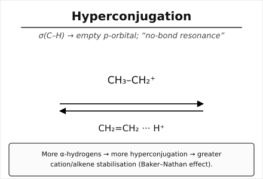

##### (b) Show that SN1 is a 1st order reaction but SN2 2nd order reaction. [3]
**SN1 (unimolecular nucleophilic substitution):** proceeds in two steps.
Step 1 (slow, rate-determining): R–X → R⁺ + X⁻ (ionisation to carbocation)
Step 2 (fast): R⁺ + Nu⁻ → R–Nu
Since only the substrate concentration appears in the rate-determining step,
Rate = k[RX]  → **first order** overall (order 1 in substrate, order 0 in nucleophile).

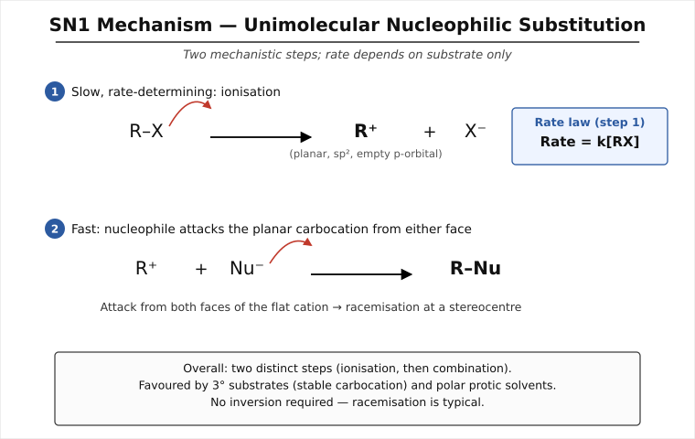

**SN2 (bimolecular nucleophilic substitution):** proceeds in a single concerted step — the nucleophile attacks the carbon from the side opposite the leaving group while the C–X bond breaks simultaneously (back-side attack, Walden inversion), through a single transition state:
Nu⁻ + R–X → [Nu···C···X]‡ → Nu–R + X⁻
Since both reactants are involved in the single rate-determining step,
Rate = k[RX][Nu⁻] → **second order** overall (first order in each reactant).

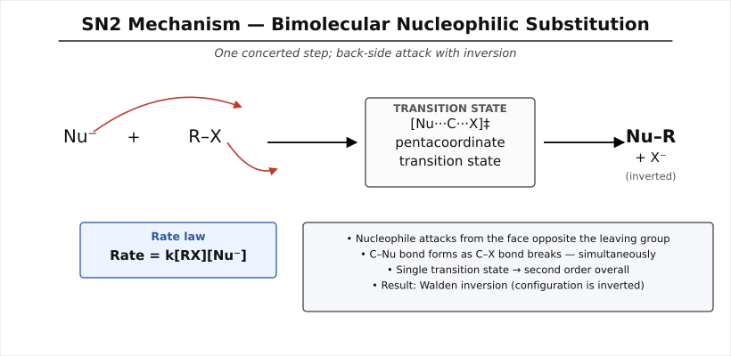
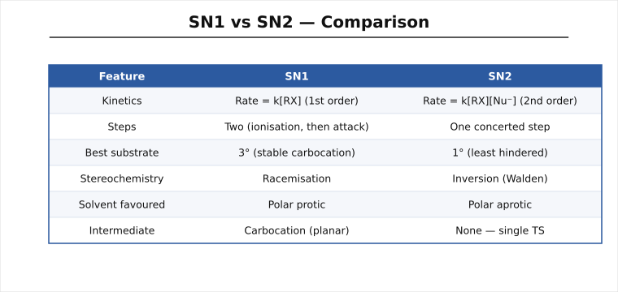

##### (c) Write the electrophilic and nucleophile addition reaction. [3]
**Electrophilic addition** (typical of alkenes, electron-rich π-bond attacked by an electrophile E⁺):
CH₂=CH₂ + HBr → CH₃–CH₂Br
Mechanism: π-electrons attack H⁺ of HBr forming a carbocation (CH₃–CH₂⁺), which is then attacked by Br⁻.

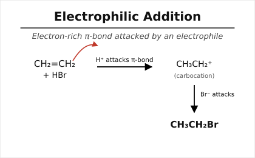

**Nucleophilic addition** (typical of carbonyl compounds, electron-poor carbon attacked by a nucleophile Nu⁻):
CH₃CHO + HCN → CH₃CH(OH)CN (cyanohydrin)
Mechanism: CN⁻ attacks the electrophilic carbonyl carbon to give an alkoxide, which is then protonated by H⁺ (from HCN or the medium).

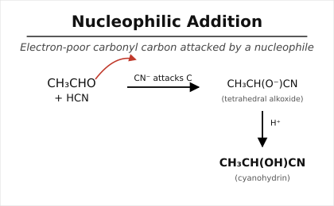

##### (d) Write the difference between electromeric effect and inductive effect. [3]
| Feature | Electromeric Effect | Inductive Effect |
|---|---|---|
| Nature | Temporary; operates only in the presence of an attacking reagent | Permanent; operates continuously |
| Mechanism | Complete transfer of a π-electron pair to one atom of the multiple bond | Partial displacement of σ-electrons along a chain |
| Occurs in | Multiple bonds (C=C, C=O, C≡N) | Any σ-bonded chain |
| Distance effect | Instantaneous, not distance-dependent within the multiple bond | Decreases rapidly with distance (weak beyond 2–3 bonds) |
| Symbol | +E / –E | +I / –I |
| Example | C=C + E⁺ → instantaneous shift of π pair | Cl–CH₂–COOH, Cl withdraws electrons through σ bonds |

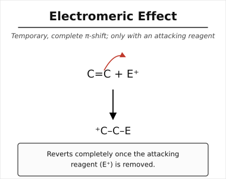
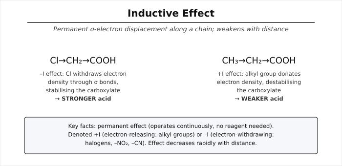
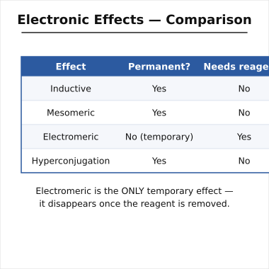

---

#### Question 2 [3+3+3+3=12]

##### (a) What is meant by Grignard reagent with example? [3]
A **Grignard reagent** is an organomagnesium halide of general formula **R–MgX** (R = alkyl/aryl, X = Cl, Br, I), formed by reacting an alkyl/aryl halide with magnesium metal in dry ether. It is a powerful carbanion-equivalent nucleophile.
Example: CH₃–MgI (methylmagnesium iodide), C₂H₅MgBr (ethylmagnesium bromide).

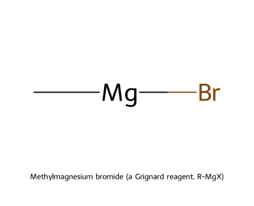

##### (b) Write the method of preparation of Grignard reagent. [3]
$$R{-}X + Mg \xrightarrow[\text{dry ether}]{} R{-}MgX$$
E.g. CH₃Br + Mg →(dry ether) CH₃MgBr
Strictly anhydrous, oxygen-free conditions and dry ether are required, since the reagent is highly reactive towards moisture and CO₂.

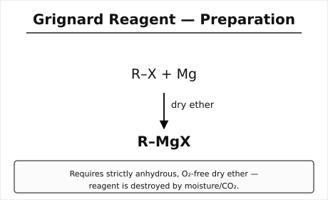

##### (c) Explain the preparation of 1°, 2° and 3° alcohol from Grignard reagent. [3]
- **1° alcohol** — from formaldehyde:
 RMgX + HCHO → R–CH₂–OMgX →(H₃O⁺) R–CH₂OH
- **2° alcohol** — from any other aldehyde:
 RMgX + R′CHO → R–CH(OMgX)–R′ →(H₃O⁺) R–CH(OH)–R′
- **3° alcohol** — from a ketone:
 RMgX + R′COR″ → R–C(OMgX)(R′)(R″) →(H₃O⁺) R–C(OH)(R′)(R″)
In each case the Grignard carbanion attacks the electrophilic carbonyl carbon; acidic aqueous work-up (dilute H₂SO₄/H₃O⁺) hydrolyses the magnesium alkoxide to the alcohol.

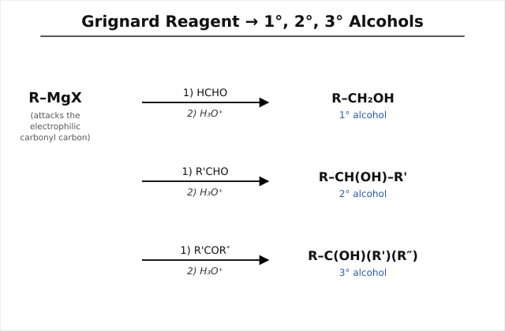

##### (d) How will you distinguish between 1°, 2° and 3° alcohols? [3]
**Lucas test** (ZnCl₂/conc. HCl): 
- 3° alcohol → turbidity immediately (fastest, via SN1, stable 3° carbocation) 
- 2° alcohol → turbidity in 5–10 min 
- 1° alcohol → no turbidity in cold; needs heating

**Victor Meyer's test / oxidation test** (alternative): oxidation with acidified K₂Cr₂O₇ — 1° → aldehyde → carboxylic acid; 2° → ketone; 3° → resists oxidation (no α-H).

| Test | 1° | 2° | 3° |
|---|---|---|---|
| Lucas reagent | No turbidity (cold) | Turbid in 5–10 min | Immediate turbidity |
| Oxidation | Acid | Ketone | No reaction |

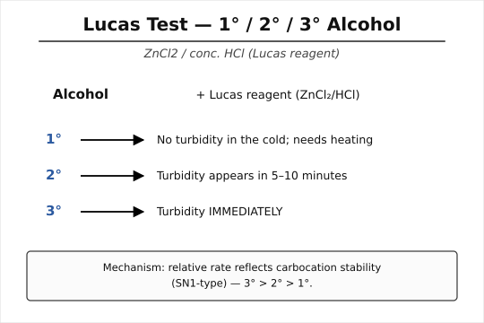
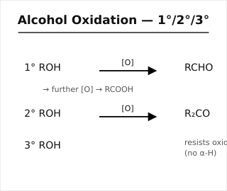

---

#### Question 3 [2+3+4+3=12]

##### (a) Explain, why aldehydes are more reactive than ketones? [2]
Aldehydes have at least one H on the carbonyl carbon while ketones have two alkyl/aryl groups. Alkyl groups are electron-donating (+I) and sterically bulky, so in ketones (i) the carbonyl carbon is less electrophilic (less δ+) due to +I effect of two alkyl groups, and (ii) nucleophilic attack is more sterically hindered. Aldehydes, with only one (smaller) alkyl/H group, present a more electrophilic and less hindered carbonyl carbon, hence react faster with nucleophiles.

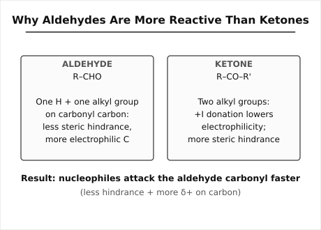

##### (b) Describe the methods of preparation of aliphatic aldehydes and ketones. [3]
**Aldehydes:**
1. Oxidation of 1° alcohol: RCH₂OH →(PCC or mild oxidant) RCHO
2. Rosenmund reduction: RCOCl + H₂ →(Pd/BaSO₄, poisoned) RCHO + HCl
3. Ozonolysis of alkenes: R–CH=CH–R′ →(O₃, then Zn/H₂O) RCHO + R′CHO

**Ketones:**
1. Oxidation of 2° alcohol: R₂CHOH →(K₂Cr₂O₇/H⁺) R₂CO
2. From acid chlorides + dialkyl cadmium: 2RCOCl + R′₂Cd → 2RCOR′ + CdCl₂
3. From nitriles + Grignard (or acid + RMgX excess then hydrolysis)

##### (c) Write short note on: (i) Rosenmund reduction and (ii) Cannizzaro reaction. [4]
**(i) Rosenmund reduction:** Selective catalytic hydrogenation of an acid chloride to an aldehyde using H₂ over Pd/BaSO₄ "poisoned" with sulfur/quinoline, which prevents over-reduction to the alcohol.
$$RCOCl + H_2 \xrightarrow[\text{Pd/BaSO}_4 (\text{poisoned})]{} RCHO + HCl$$

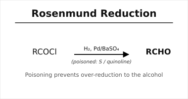

**(ii) Cannizzaro reaction:** Aldehydes lacking an α-hydrogen (e.g. HCHO, C₆H₅CHO), when treated with concentrated alkali, undergo self-oxidation–reduction (disproportionation): one molecule is oxidised to the carboxylate salt while another is reduced to the alcohol.
$$2HCHO + NaOH \rightarrow CH_3OH + HCOONa$$
Mechanism: OH⁻ adds to one carbonyl carbon forming a tetrahedral alkoxide intermediate, which transfers a hydride ion to the carbonyl carbon of a second aldehyde molecule.

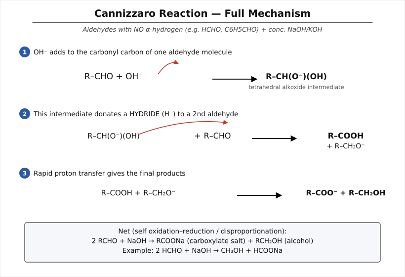

##### (d) Distinguish between Acetaldehyde and Acetone. [3]
| Test | Acetaldehyde (CH₃CHO) | Acetone (CH₃COCH₃) |
|---|---|---|
| Tollens' test | Silver mirror formed | No reaction |
| Fehling's test | Red ppt. of Cu₂O | No reaction |
| Iodoform test | Positive (yellow ppt.) | Positive (both give iodoform — not distinguishing alone) |
| Schiff's reagent | Pink colour | No colour |
| With NaHSO₃ | Crystalline addition product | Also positive, but combined w/ Tollens' negative confirms ketone |

(Best single distinguishing test: **Tollens'/Fehling's — positive for acetaldehyde, negative for acetone**, since acetone has no aldehydic H.)

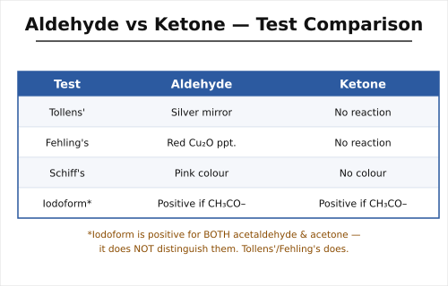
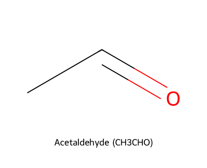
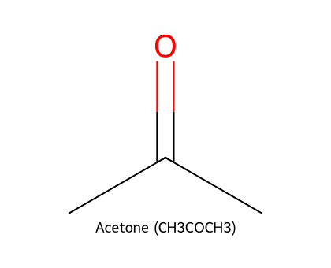

---

#### Question 4 [2+5+2+3=12]

##### (a) Write short note on TEL. [2]
**Tetraethyl lead, Pb(C₂H₅)₄ (TEL)** is an organolead compound formerly added to petrol as an anti-knock agent. It decomposes thermally in the engine cylinder to give lead and ethyl radicals which interrupt the radical chain reactions responsible for pre-ignition ("knocking"), smoothing combustion and raising the octane number. It has been phased out worldwide because of lead toxicity and catalytic-converter poisoning.

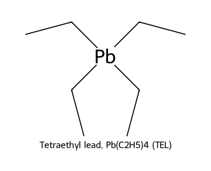

##### (b) What are carboxylic acid derivatives? How are acetyl chloride, amides and acetic anhydride prepared from Acetic acid? [5]
**Carboxylic acid derivatives** are compounds in which the –OH of –COOH is replaced by another group: acid halides (–COX), anhydrides (–CO–O–OC–), esters (–COOR), and amides (–CONH₂).

Preparation from acetic acid:
1. **Acetyl chloride:** CH₃COOH + PCl₅ → CH₃COCl + POCl₃ + HCl (or with SOCl₂ or PCl₃)
2. **Acetamide:** CH₃COOH + NH₃ → CH₃COONH₄ →(Δ, –H₂O) CH₃CONH₂
3. **Acetic anhydride:** 2CH₃COOH →(P₂O₅, Δ) (CH₃CO)₂O + H₂O (industrially via ketene: CH₃COOH → CH₂=C=O, then + CH₃COOH → (CH₃CO)₂O)

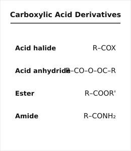
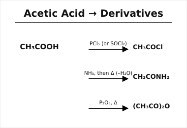
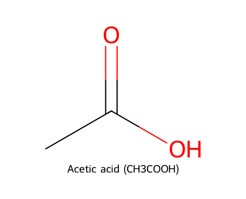

##### (c) Explain that acetic acid is stronger than propionic acid but weaker than mono-chloroacetic acid. [2]
Acid strength depends on how well the conjugate base (carboxylate) is stabilised, governed by the **inductive effect** of substituents on the α-carbon.
- CH₃COOH vs. C₂H₅COOH: the extra –CH₃ (electron-donating +I) in propionic acid destabilises the carboxylate slightly more than acetic acid's single methyl → **acetic acid is the stronger acid**.
- CH₃COOH vs. ClCH₂COOH: Cl is strongly electron-withdrawing (–I), which stabilises the carboxylate anion by dispersing negative charge → **chloroacetic acid is the stronger acid**.
Order: ClCH₂COOH > CH₃COOH > C₂H₅COOH (pKa: ~2.86 < 4.76 < 4.87).

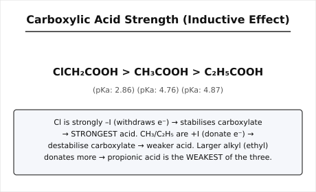

##### (d) Explain about Hofmann degradation and Curtius degradation. [3]
**Hofmann bromamide degradation:** An amide is converted to a primary amine with **one carbon less**, using Br₂/NaOH.
$$RCONH_2 + Br_2 + 4NaOH \rightarrow RNH_2 + 2NaBr + Na_2CO_3 + 2H_2O$$
Mechanism: N-bromoamide → deprotonation → migration of R from carbon to nitrogen with loss of Br⁻ (concerted, forms an isocyanate R–N=C=O intermediate) → hydrolysis of isocyanate to carbamic acid → spontaneous decarboxylation to the amine.

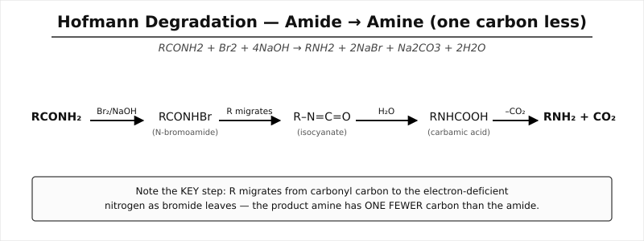

**Curtius degradation:** An acyl azide (RCON₃), on heating, loses N₂ and undergoes the same type of migration to an isocyanate (R–N=C=O), which is hydrolysed to give the primary amine (again one carbon less than the acid).
$$RCOCl \xrightarrow{NaN_3} RCON_3 \xrightarrow{\Delta,-N_2} R{-}N{=}C{=}O \xrightarrow{H_2O} RNH_2 + CO_2$$
Both reactions proceed through a common nitrene/isocyanate-type intermediate and are used to step down the carbon chain by one while introducing an –NH₂ group.

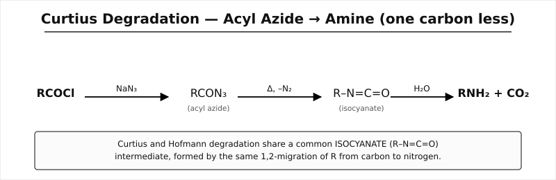

---

### Part B

#### Question 5 [3+3+3+3=12]

##### (a) Explain why aniline is less basic than methyl amine. [3]
In aniline (C₆H₅NH₂), the lone pair on nitrogen is delocalised into the benzene ring by resonance (conjugation with the π system), making it less available for protonation; the resulting anilinium ion is also destabilised because positive charge cannot be delocalised into the ring. In methylamine (CH₃NH₂), there is no such delocalisation — instead, the +I effect of the methyl group increases electron density on N, making the lone pair fully available. Hence aniline (pKb ≈ 9.4) is far weaker a base than methylamine (pKb ≈ 3.4).

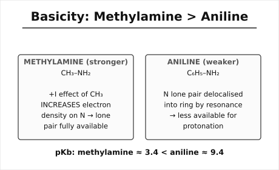
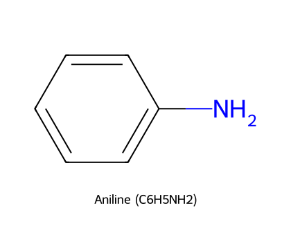

##### (b) Explain the methods of preparation of 1°, 2° and 3° aliphatic amines. [3]
1. **Ammonolysis of alkyl halides:** RX + NH₃(excess) → RNH₂ (1°); further alkylation gives R₂NH (2°) and R₃N (3°) — a mixture is obtained.
2. **Reduction of nitriles:** RCN + 4[H] →(LiAlH₄ or H₂/Ni) RCH₂NH₂ (1°)
3. **Gabriel phthalimide synthesis** (gives pure 1° amine): phthalimide → K salt → + RX → N-alkylphthalimide →(hydrolysis) RNH₂
4. **Reductive amination:** RCHO + NH₃/H₂(Ni) → RCH₂NH₂ (1°); with 1° amine gives 2°, with 2° amine gives 3°.

##### (c) Explain the conversion of an aldose into the next higher aldose. [3]
**Kiliani–Fischer synthesis**: an aldose is converted to the next-higher aldose (one carbon more) by:
1. Addition of HCN to the aldehyde group → cyanohydrin (creates a new chiral centre, gives a pair of diastereomers)
2. Hydrolysis of –CN to –COOH (as the lactone) using dilute acid, or partial reduction
3. Reduction of the resulting aldonolactone/acid with Na–Hg (or H₂/Pd) to the aldehyde
E.g. D-glyceraldehyde → (HCN, then hydrolysis, then reduction) → D-arabinose + D-ribose (epimeric pair).

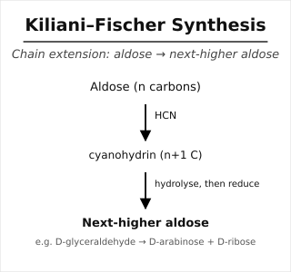

##### (d) Distinguish between primary, secondary and tertiary amines. [3]
**Hinsberg's test** (benzenesulfonyl chloride, C₆H₅SO₂Cl):
| Amine | Product with Hinsberg's reagent | Behaviour with KOH |
|---|---|---|
| 1° | RNHSO₂C₆H₅ (has acidic N–H) | Dissolves (soluble salt forms) |
| 2° | R₂NSO₂C₆H₅ (no acidic H) | Insoluble, remains as precipitate |
| 3° | Does not react (no N–H to substitute) | Unreacted amine remains, separates as oily layer |

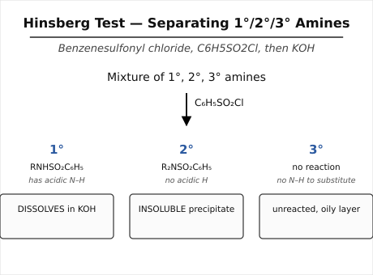

---

#### Question 6 [2+2+3+3+2=12]

##### (a) What is meant by α-amino acids and non-essential amino acids? [2]
**α-Amino acid:** an organic acid in which an –NH₂ group and a –COOH group are both attached to the **same (α-) carbon atom**; general formula R–CH(NH₂)–COOH.
**Non-essential amino acids** are amino acids that the human body can synthesise itself from other metabolites, hence are not strictly required in the diet (e.g. glycine, alanine, serine, glutamic acid).

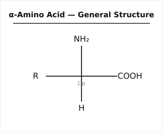
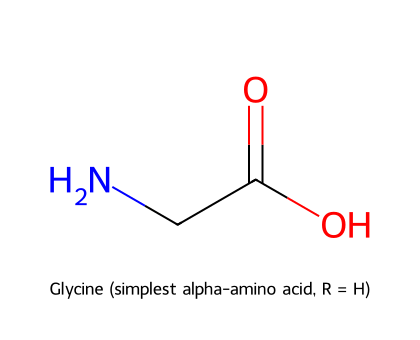

##### (b) Differentiate between essential amino acids and non-essential amino acids. [2]
| Feature | Essential | Non-essential |
|---|---|---|
| Synthesis | Cannot be synthesised by the body | Can be synthesised by the body |
| Source | Must come from diet | Diet not compulsory |
| Examples | Valine, Leucine, Lysine, Threonine, Phenylalanine | Glycine, Alanine, Glutamic acid, Serine |

##### (c) Describe the identification of N and C-terminal amino acid residues. [3]
**N-terminal (Sanger's method / DNFB method):** the peptide is treated with 1-fluoro-2,4-dinitrobenzene (DNFB), which reacts with the free α-amino group of the N-terminal residue to give a yellow **DNP-peptide**; total acid hydrolysis then liberates the DNP-amino acid, identified chromatographically.

**C-terminal (hydrazinolysis method / Akabori method):** the peptide is heated with excess hydrazine (NH₂NH₂), which converts all residues except the C-terminal one into acid hydrazides (–CONHNH₂); the C-terminal amino acid is released as the free amino acid (its –COOH cannot form a hydrazide) and is identified separately.
(Edman degradation with phenyl isothiocyanate is the modern alternative for sequential N-terminal identification.)

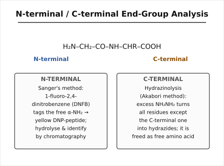

##### (d) Write the two methods for the preparation of α-amino acid. [3]
1. **Gabriel–phthalimide–malonic ester synthesis:** phthalimidomalonic ester is alkylated with RX, then hydrolysed and decarboxylated to give RCH(NH₂)COOH.
2. **Strecker synthesis:** aldehyde + NH₃ + HCN → α-aminonitrile → acid hydrolysis → α-amino acid.
$$RCHO + NH_3 \rightarrow RCH(NH_2)OH \xrightarrow{HCN} RCH(NH_2)CN \xrightarrow{H_3O^+} RCH(NH_2)COOH$$

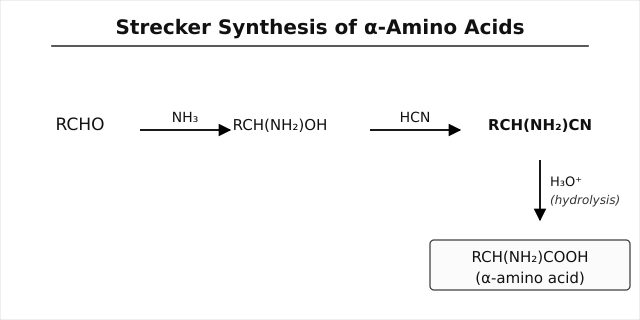

##### (e) What is the iso-electronic pH of amino acid? [2]
[Likely intended: **"iso-electric pH"**.] The **isoelectric point (pI)** is the pH at which an amino acid exists predominantly as the neutral zwitterion (net charge = zero) and therefore does not migrate in an electric field.
For a simple neutral amino acid: $pI = \dfrac{pK_{a1}+pK_{a2}}{2}$ (average of the two ionisable –COOH and –NH₃⁺ pKa values).

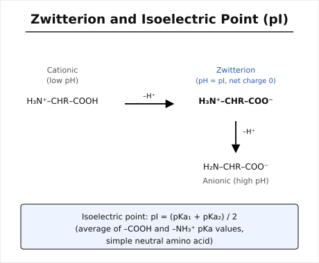

---

#### Question 7 [3+3+3+3=12]

##### (a) What is meant by Zwitter ion and iso-electric point? [3]
A **zwitterion** (dipolar ion) is a molecule bearing both a positive and a negative charge on different atoms while being overall electrically neutral — in amino acids, the –COOH loses H⁺ to become –COO⁻ while –NH₂ gains H⁺ to become –NH₃⁺: H₃N⁺–CHR–COO⁻.
The **isoelectric point (pI)** is the pH at which the amino acid exists exclusively as this neutral zwitterion, showing zero net migration in an electric field.

##### (b) Explain the synthesis of gly-ala peptides with reactions. [3]
Peptide bond formation requires protection of unwanted reactive groups, activation of the carboxyl group, coupling, then deprotection.
1. Protect the amino group of glycine: Gly–NH₂ + (Boc)₂O → Boc–Gly–OH (amine protected)
2. Activate the carboxyl of Boc-glycine (e.g. via DCC or as an acid chloride): Boc–Gly–OH + DCC → activated ester
3. Couple with alanine (free amino group attacks the activated carbonyl): Boc–Gly–OH(activated) + H₂N–CH(CH₃)–COOH → Boc–Gly–NH–CH(CH₃)–COOH
4. Deprotect (remove Boc with dilute acid) to give the free dipeptide:
$$H_2N{-}CH_2{-}CO{-}NH{-}CH(CH_3){-}COOH \quad (\text{Gly-Ala})$$
The linkage –CO–NH– formed between the carboxyl of glycine and the amino group of alanine is the **peptide (amide) bond**.

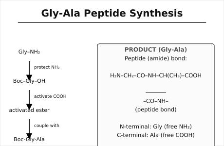
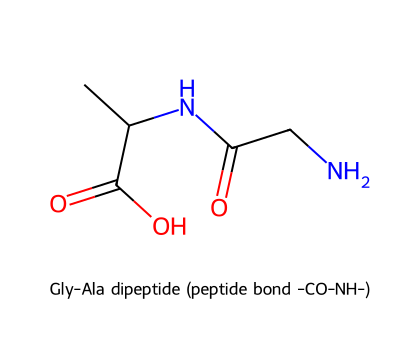

##### (c) How will you end group analysis of peptides? [3]
End-group analysis identifies the terminal residues of a peptide chain:
- **N-terminal:** Sanger's reagent (DNFB) or Edman's reagent (phenyl isothiocyanate) tags the free α-amino end; acid hydrolysis and chromatography identify the residue.
- **C-terminal:** hydrazinolysis (Akabori method) — hydrazine converts internal and N-terminal residues to hydrazides, leaving the free C-terminal amino acid, which is isolated and identified. (Carboxypeptidase enzymatic cleavage is an alternative.)

##### (d) Describe the preparation and uses of indigo dye. [3]
**Preparation (Heumann synthesis, industrial):** N-phenylglycine is fused with sodamide (NaNH₂) in molten NaOH/KOH at high temperature to form indoxyl (via cyclisation), which is then air-oxidised to indigo.
$$\text{N-phenylglycine} \xrightarrow[\Delta]{NaNH_2/KOH} \text{indoxyl} \xrightarrow{\text{air oxidation}} \text{Indigo (indigotin)}$$
Indigo itself is water-insoluble (a vat dye); for dyeing, it is reduced (with Na₂S₂O₄, sodium hydrosulfite) to the water-soluble colourless "leuco" form (leuco-indigo), which is absorbed into the fibre and then re-oxidised by air back to the insoluble blue indigo within the fabric.
**Uses:** traditional dyeing of cotton/denim (blue jeans), textile printing, and historically as a natural dye from *Indigofera* plants.

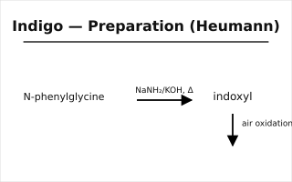
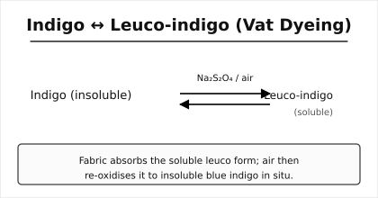
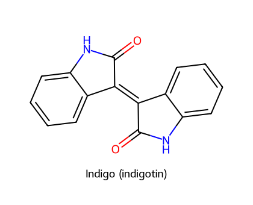

---

#### Question 8 [3+3+3+3=12]

##### (a) What is meant by chromophore and auxochrome? [3]
**Chromophore:** an unsaturated group (e.g. –N=N–, >C=O, –NO₂, –CH=CH–) present in a molecule that is responsible for absorbing visible light and hence imparting colour.
**Auxochrome:** a saturated group with a lone pair (e.g. –NH₂, –OH, –NR₂, –SO₃H) which, when attached to a chromophore-bearing molecule, deepens/intensifies the colour and (in dyes) also confers solubility/fibre-affinity, though it does not itself produce colour.

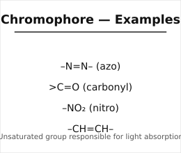
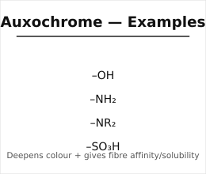

##### (b) Explain the modern theory of colour. [3]
The modern (electronic/quantum) theory holds that colour arises from **electronic transitions of π and non-bonding (n) electrons** within conjugated systems. Extended conjugation (alternating single–double bonds, chromophores) lowers the energy gap between the HOMO and LUMO so that the molecule absorbs light in the visible region (400–700 nm) rather than the UV region; the colour observed is complementary to the wavelength absorbed. Auxochromes further extend conjugation via resonance donation of their lone pairs, red-shifting (bathochromic shift) and intensifying (hyperchromic effect) the absorption.

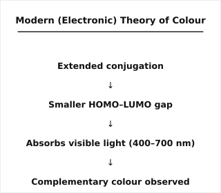

##### (c) Write the classification of dyes with examples. [3]
| Class | Basis | Example |
|---|---|---|
| Acid dyes | Anionic, dye wool/silk/nylon via ionic bond | Orange II |
| Basic (cationic) dyes | Cationic, dye acrylic fibres | Malachite green |
| Direct dyes | Applied directly from aqueous bath, affinity for cellulose | Congo red |
| Vat dyes | Insoluble; applied as soluble leuco form, re-oxidised | Indigo |
| Azo dyes | Contain –N=N– chromophore | Methyl orange |
| Mordant dyes | Require a metal-salt mordant to fix | Alizarin |
| Disperse dyes | Water-insoluble, fine dispersion, for synthetic fibres (polyester) | Disperse Blue |
| Reactive dyes | Form covalent bond with fibre | Procion dyes |

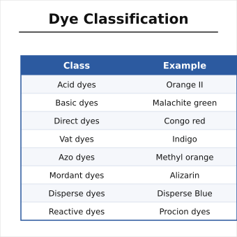
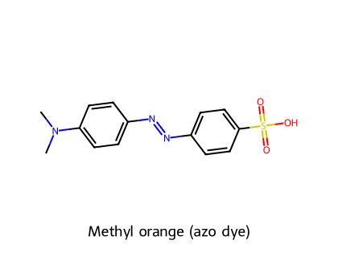
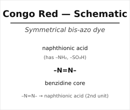

##### (d) Write the non-textile use of dyes. [3]
Dyes are also used as: biological/histological stains (e.g. methylene blue, eosin) in microscopy and medicine; indicators in acid–base titrations (e.g. phenolphthalein, methyl orange); colouring agents in food, cosmetics, and pharmaceuticals; paper, leather, and ink/printing industries; and as photographic/photosensitising and laser dyes.

---

## 2022 (Full Marks 72, Time 3.0 Hrs)

*Note: several question numbers/letters were struck through or overwritten by hand in the scan (e.g. Q1(b),(c) letters crossed out, Q3(a) marked "(4)"); the printed text is followed here. Q5 mark total is printed as [3+3+3+3=2], evidently a typo for **=12**, consistent with all other questions.*

### Part A

#### Question 1 [3+3+3+3=12]

##### (a) What do you mean by induction effect and electrometric effect? [3]
**Inductive effect:** the permanent polarisation of the σ-bond electron density along a carbon chain caused by the electronegativity difference between bonded atoms, transmitted (with diminishing strength) through successive bonds; denoted –I (electron-withdrawing, e.g. halogens, –NO₂) or +I (electron-releasing, e.g. alkyl groups).
**Electromeric effect:** the temporary, complete transfer of a π-electron pair from a multiple bond to one of the atoms, triggered only in the presence of an attacking reagent, and reverting once the reagent is removed; denoted +E or –E (see 2023-Q1(a)/(d) above for full contrast).

##### (b) Show that SN² is one step reaction but SN¹ two step reaction. [3]
*(See 2023-Q1(b) for the full mechanistic derivation and diagrams.)* SN2: a single concerted transition state, Nu⁻ attacking as X⁻ leaves — Rate = k[RX][Nu⁻], one kinetic/mechanistic step. SN1: ionisation (RX → R⁺ + X⁻, slow) followed by a separate, fast combination step (R⁺ + Nu⁻ → RNu) — two distinct mechanistic steps, with the rate-determining first step giving Rate = k[RX].

##### (c) Discuss about electrophilic and nucleophilic addition reaction. [3]
*(See 2023-Q1(c) and diagrams above.)* Electrophilic addition occurs at electron-rich π-bonds (alkenes/alkynes) attacked by an electrophile, e.g. CH₂=CH₂ + Br₂ → CH₂Br–CH₂Br via a bromonium-ion intermediate. Nucleophilic addition occurs at the electron-poor carbonyl carbon attacked by a nucleophile, e.g. CH₃CHO + NaHSO₃ → CH₃CH(OH)SO₃Na (bisulfite addition compound).

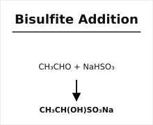

##### (d) Show that E₂ reaction is first order but E₁ 2nd order reaction. [3]
> **⚠️ Correction:** As scanned, this question states E2 is first-order and E1 is second-order. This is chemically **reversed** — the original wording is kept here exactly as printed, but the answer below (and the diagrams) give the scientifically correct assignment: **E1 is first-order, E2 is second-order**.

**E1 (elimination, unimolecular):** two steps — slow ionisation (RX → R⁺ + X⁻) then fast loss of a β-H to base — Rate = k[RX], **first order**.
**E2 (elimination, bimolecular):** one concerted step in which base removes a β-H as the leaving group departs and the π-bond forms simultaneously — Rate = k[RX][Base], **second order**.

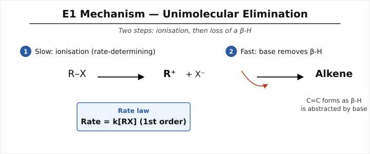

---

#### Question 2 [3+3+3+3=12]

##### (a) What do you mean by aliphatic and aromatic aldehyde and ketone? [3]
**Aliphatic aldehydes/ketones** have the carbonyl group attached to an alkyl chain (open chain), e.g. CH₃CHO (acetaldehyde), CH₃COCH₃ (acetone).
**Aromatic aldehydes/ketones** have the carbonyl group directly attached to (or conjugated with) an aromatic ring, e.g. C₆H₅CHO (benzaldehyde), C₆H₅COCH₃ (acetophenone).

##### (b) Explain the method of preparation of aliphatic aldehyde and ketone. [3]
*(See 2023-Q3(b).)* Aldehydes: oxidation of 1° alcohols, Rosenmund reduction of acid chlorides. Ketones: oxidation of 2° alcohols, from nitriles + RMgX (hydrolysis), or Friedel–Crafts acylation type routes for aryl ketones.

##### (c) Discuss about (i) Cannizzaro reaction (ii) Aldol condensation (iii) Haloform reaction. [3]
**(i) Cannizzaro reaction:** self-disproportionation of an aldehyde with no α-H under conc. alkali into one molecule of alcohol and one of carboxylate salt (see 2023-Q3(c) and diagram above).
**(ii) Aldol condensation:** an aldehyde/ketone possessing an α-H undergoes base(or acid)-catalysed self-addition — the enolate (nucleophile) attacks the carbonyl carbon of a second molecule to give a β-hydroxy aldehyde/ketone ("aldol"), which readily dehydrates (on heating) to give an α,β-unsaturated carbonyl compound:
$$2CH_3CHO \xrightarrow{dil.\,NaOH} CH_3CH(OH)CH_2CHO \xrightarrow{-H_2O} CH_3CH{=}CHCHO$$
**(iii) Haloform reaction:** methyl ketones (CH₃CO–R) or acetaldehyde, on treatment with X₂/NaOH (or NaOX), undergo exhaustive halogenation at the methyl group followed by cleavage to give a haloform (CHX₃) and a carboxylate salt:
$$CH_3COCH_3 + 3I_2 + 4NaOH \rightarrow CHI_3\downarrow + CH_3COONa + 3NaI + 3H_2O$$
(used as the iodoform test, diagnostic for CH₃CO– or CH₃CH(OH)– groups).

##### (d) Distinguish between aldehyde and ketones. [3]
*(See 2023-Q3(d) table and diagram above.)* Key test: Tollens'/Fehling's/Schiff's — positive for aldehydes (they are easily oxidised, having an aldehydic H), negative for ketones.

---

#### Question 3 [3+3+3+3=12]

##### (a) What are Grignard Reagents (GR)? [3]
*(See 2023-Q2(a).)* Organomagnesium halides, R–MgX, prepared from alkyl/aryl halides and Mg in dry ether; act as strong carbon nucleophiles/bases.

##### (b) How are organometallic compounds obtained from GR? [3]
Grignard reagents themselves are organometallic compounds; other organometallics can be obtained by transmetalation, e.g. reaction of RMgX with a metal halide (2RMgX + CdCl₂ → R₂Cd + 2MgXCl, giving dialkylcadmium, itself used to make ketones from acid chlorides), or RMgX + HgCl₂ → RHgCl + MgXCl (organomercury compounds). In general: n RMgX + MXₙ → RₙM + n MgX₂ (M = another metal).

##### (c) Explain the reactivity of organometallic compounds. [3]
Organometallic compounds contain a polarised C–M bond (carbon δ⁻, metal δ⁺) because carbon is generally more electronegative than the metal, making the carbon strongly nucleophilic/basic — able to attack electrophilic centres (carbonyl carbons, protons of water/alcohols/acids, CO₂, etc.). Reactivity increases with the ionic character of the C–M bond (greater for more electropositive metals, e.g. organosodium > organomagnesium > organozinc); Grignard reagents react violently with water/protic solvents and are highly reactive towards carbonyl compounds, epoxides, CO₂, and O₂.

##### (d) What do you know about "Reformatsky reaction"? [3]
The **Reformatsky reaction** couples an α-haloester (e.g. BrCH₂COOC₂H₅) with an aldehyde or ketone in the presence of zinc metal, forming a zinc enolate ("Reformatsky reagent") in situ that adds to the carbonyl compound to give a β-hydroxy ester after aqueous work-up.
$$RCHO + BrCH_2COOC_2H_5 \xrightarrow{Zn} RCH(OH)CH_2COOC_2H_5$$
It is essentially an organozinc analogue of the aldol reaction, milder than Grignard addition and tolerant of ester groups.

---

#### Question 4 [3+3+3+3=12]

##### (a) Write the reactions for the production of Ethyl alcohol from starch. [3]
1. Hydrolysis (saccharification) of starch by dilute acid or the enzyme diastase: (C₆H₁₀O₅)ₙ + nH₂O →(diastase) nC₁₂H₂₂O₁₁ → (maltase) nC₆H₁₂O₆ (glucose)
2. Fermentation of glucose by zymase (yeast enzyme):
$$C_6H_{12}O_6 \xrightarrow{zymase} 2C_2H_5OH + 2CO_2$$
3. The dilute "wash" is concentrated by fractional distillation to yield ~95% ethanol (rectified spirit).

##### (b) Distinguish between phenol and ethyl alcohol. [3]
| Test | Phenol | Ethyl alcohol |
|---|---|---|
| FeCl₃ | Violet/purple colouration | No colouration |
| Litmus / acidity | Weakly acidic, turns blue litmus faint pink; reacts with NaOH | Neutral; does not react with NaOH |
| Br₂ water | White precipitate (2,4,6-tribromophenol) | No precipitate |
| Sodium metal | Reacts to give sodium phenoxide + H₂ (slower, less vigorous) | Reacts more readily giving sodium ethoxide + H₂ |

##### (c) What happens when glycerine is treated with HNO₃? [3]
Glycerine (glycerol, propane-1,2,3-triol) undergoes nitration (esterification of all three –OH groups) with conc. HNO₃ (in presence of conc. H₂SO₄ as catalyst/dehydrating agent) to give **glyceryl trinitrate (nitroglycerine, NG)**, a powerful explosive:
$$C_3H_5(OH)_3 + 3HNO_3 \xrightarrow{conc.\,H_2SO_4} C_3H_5(ONO_2)_3 + 3H_2O$$

##### (d) How is alcohol identified? [3]
- **Sodium metal test:** liberates H₂ gas with brisk effervescence (2ROH + 2Na → 2RONa + H₂↑) — distinguishes –OH bearing compounds generally.
- **Ester test:** heating with a carboxylic acid + conc. H₂SO₄ gives a fruity-smelling ester, confirming the –OH group.
- **Ceric ammonium nitrate test:** alcohol + (NH₄)₂Ce(NO₃)₆ → red colouration (positive for –OH).
- **Lucas test / oxidation** further classify as 1°/2°/3° (see 2023-Q2(d) and diagrams above).

---

### Part B

#### Question 5 [3+3+3+3=12]

##### (a) What do you mean by aliphatic and aromatic amines? [3]
**Aliphatic amines** have the –NH₂ (or substituted amine) group bonded to an alkyl carbon, e.g. CH₃NH₂ (methylamine).
**Aromatic amines** have the amine group directly bonded to an aromatic ring carbon, e.g. C₆H₅NH₂ (aniline).

##### (b) Explain the method of preparation of 1°, 2° and 3° aromatic amines. [3]
1. **Reduction of nitro compounds:** C₆H₅NO₂ →(Sn/HCl or H₂/Ni) C₆H₅NH₂ (1° aromatic amine, e.g. aniline).
2. **N-alkylation of aniline:** C₆H₅NH₂ + RX → C₆H₅NHR (2°) → further alkylation → C₆H₅NR₂ (3°) — mixtures typically result and require separation.
3. **Reductive amination / Hofmann degradation of aromatic amides** can also yield 1° aromatic amines with loss of one carbon.

##### (c) How will you separate 1°, 2° and 3° amine from the mixture of amines? [3]
**Hinsberg's method** (see 2023-Q5(d) and diagram above): treat the mixture with benzenesulfonyl chloride and KOH.
- 1° amine → forms a soluble sulfonamide salt (extract into aqueous layer with KOH, then regenerate amine by acidification).
- 2° amine → forms an insoluble sulfonamide precipitate (filter off, then hydrolyse with acid to regenerate the amine).
- 3° amine → does not react; remains as a free amine, separable from the reaction mixture by extraction (it dissolves in dilute HCl as its salt, while unreacted sulfonyl chloride does not).

##### (d) How will you calculate the basicity constant of amines? [3]
Basicity of an amine in water is expressed by its equilibrium (base dissociation) constant:
$$RNH_2 + H_2O \rightleftharpoons RNH_3^+ + OH^- \qquad K_b = \frac{[RNH_3^+][OH^-]}{[RNH_2]}$$
$$pK_b = -\log K_b$$
Kb (or pKb) is determined experimentally from conductometric/potentiometric titration data or from the pH of a solution of known amine concentration; a smaller pKb (larger Kb) indicates a stronger base. Relative basicities are rationalised using inductive (+I from alkyl groups increases basicity) and resonance (delocalisation of the lone pair, as in aniline, decreases basicity) effects.

---

#### Question 6 [3+3+3+3=12]

##### (a) What do you mean by chromophore and auxochrome? [3]
*(See 2023-Q8(a) and diagrams above.)*

##### (b) Explain about the modern theory of colour. [3]
*(See 2023-Q8(b) and diagram above.)*

##### (c) Discuss about the classification of dyes with examples. [3]
*(See 2023-Q8(c) and diagram above.)*

##### (d) Write the non-textile use of dyes. [3]
*(See 2023-Q8(d).)*

---

#### Question 7 [4+5+3=12]

##### (a) How are carbohydrates classified? [4]
Carbohydrates are classified by their hydrolysis behaviour and the number of sugar units:
- **Monosaccharides** — simplest sugars, cannot be hydrolysed further; classified by carbon number (triose, tetrose, pentose, hexose) and functional group (aldose vs. ketose), e.g. glucose (aldohexose), fructose (ketohexose).
- **Oligosaccharides / Disaccharides** — yield 2–10 monosaccharide units on hydrolysis, e.g. sucrose, maltose, lactose (disaccharides).
- **Polysaccharides** — yield many (hundreds to thousands) monosaccharide units on hydrolysis, e.g. starch, cellulose, glycogen.
They are also classified as reducing or non-reducing sugars based on the presence of a free/potential aldehyde or ketone group able to reduce Fehling's/Tollens' reagent.

##### (b) Give the evidence of cyclic-structure of D-Glucose. [5]
Evidence that glucose exists predominantly as a cyclic hemiacetal (pyranose form) rather than a simple open chain:
1. **Failure of some aldehyde reactions:** glucose does not give the Schiff's test (magenta colour) characteristic of free aldehydes, nor the expected strong bisulfite addition in the amount predicted, suggesting the carbonyl is "masked."
2. **Mutarotation:** freshly prepared solutions of α- or β-D-glucose (from different crystallisation conditions) show a change in optical rotation over time to a constant equilibrium value (+52.5°) — explained only if the two anomers interconvert through the open-chain form via a cyclic hemiacetal, since a simple open-chain aldehyde could not show two distinct crystalline forms with different fixed rotations.
3. **Existence of two crystalline anomeric forms** (α-D-glucose, m.p. 146°C, [α]D +113°; β-D-glucose, m.p. 150°C, [α]D +19°) — only explicable if C-1 is a new (anomeric) stereocentre formed on ring closure.
4. **Pentaacetate formation:** glucose forms a stable pentaacetate (not tetraacetate), showing five –OH groups (one being the ring hemiacetal –OH at C-1) rather than four hydroxyls plus a free aldehyde.
5. **No reaction with NaHSO₃ in the amount expected** for a free aldehyde, and glucose forms a stable methyl glycoside with methanol/HCl that is no longer reducing — consistent with C-1 being a hemiacetal carbon (glycosidic centre) rather than a free aldehyde.
Together these observations led to the acceptance of the **cyclic (pyranose, six-membered) Haworth structure** of glucose, formed by intramolecular hemiacetal formation between the C-1 aldehyde and the C-5 hydroxyl.

##### (c) Distinguish between glucose and fructose. [3]
| Property | Glucose | Fructose |
|---|---|---|
| Type | Aldohexose | Ketohexose |
| Carbonyl position | C-1 (aldehyde) | C-2 (ketone) |
| Ring size | Pyranose (6-membered) | Furanose (5-membered) |
| Tollens'/Fehling's | Positive (reducing) | Positive (reducing, via enediol tautomerisation) |
| Seliwanoff's test | Slow, pale pink (aldose) | Fast, deep red/cherry colour (ketose) — this is the key distinguishing test |
| Osazone | Needle-shaped crystals, forms in ~5 min | Same osazone as glucose (shared at C3–C6), also ~5 min — osazone alone does not distinguish them, timing/Seliwanoff does |

---

#### Question 8 [4+5+3=12]

##### (a) Give the structure and uses of cellulose. [4]
**Structure:** Cellulose is a linear, unbranched polysaccharide of D-glucose units joined exclusively by **β-1,4-glycosidic linkages**:
$$[\text{C}_6\text{H}_{10}\text{O}_5]_n \quad (\text{repeating unit: }\beta\text{-D-glucopyranose})$$
The β-linkage allows the chains to lie fully extended and hydrogen-bond extensively (both intra- and inter-chain), giving long, strong, insoluble microfibrils — unlike the helical, branched structure of starch (α-linkages).
**Uses:** the principal structural material of plant cell walls and the raw material of natural textile fibres (cotton, ramie, jute — of direct relevance to textile engineering), as well as paper manufacture, rayon/viscose and other regenerated cellulosic fibres, and as a source of cellulose derivatives (nitrocellulose, cellulose acetate).

##### (b) What are glycosides and glycosidic linkage? [5]
A **glycoside** is the mixed acetal formed when the anomeric (hemiacetal) –OH of a cyclic sugar condenses with the –OH (or other nucleophilic group) of another molecule (an alcohol, another sugar, etc.), with loss of water; the sugar-derived portion is called the "glycone" and the non-sugar portion the "aglycone."
$$\text{Glucose (cyclic)} + CH_3OH \xrightarrow{HCl,\,dry} \text{Methyl-}\alpha\text{-D-glucoside} + H_2O$$
A **glycosidic linkage** is the C–O–C bond formed at the anomeric carbon connecting two sugar units (or a sugar to an aglycone); it is named by the anomeric configuration and the carbons joined, e.g. the α-1,4-glycosidic linkage in maltose/starch, or the β-1,4-glycosidic linkage in cellobiose/cellulose. Because the anomeric carbon is now an acetal (not a hemiacetal), a glycoside is **non-reducing** and stable to base (though hydrolysable by acid or specific glycosidase enzymes).

##### (c) Write the structural features of reducing sugars and non-reducing sugars. [3]
**Reducing sugars:** possess a free (or potential, i.e. hemiacetal) anomeric carbon that can open to expose a free –CHO (or reactive α-hydroxy ketone), enabling reduction of Cu²⁺ (Fehling's) or Ag⁺ (Tollens') — e.g. glucose, fructose, maltose, lactose.
**Non-reducing sugars:** have both anomeric carbons involved in the glycosidic bond (a full acetal on both sides), leaving no free hemiacetal to open to a reactive carbonyl form — e.g. sucrose (glycosidic bond between C-1 of glucose and C-2 of fructose, both anomeric carbons engaged), trehalose.

---

## 2021 (Full Marks 72, Time 3.0 Hrs)

### Part A

#### Question 1 [3+3+3+3=12]

##### (a) What do you mean by electromeric effect and mesomeric effect? [3]
*(See 2023-Q1(a) for mesomeric effect and diagram.)* **Electromeric effect:** the temporary, complete shift of a π-electron pair to one atom of a multiple bond, occurring only in the presence of an attacking reagent and disappearing once it is removed (contrast with the permanent mesomeric effect, which operates continuously via delocalisation through a conjugated system even without an external reagent).

##### (b) Write the mechanism of SN¹ and SN² reaction. [3]
**SN1:** Step 1 (slow): R–X ⇌ R⁺ + X⁻ (rate-determining ionisation, favoured by stable carbocations — 3° > 2° > 1°, and polar protic solvents). Step 2 (fast): R⁺ + Nu⁻ → R–Nu (the nucleophile attacks the planar carbocation from either face, giving racemisation if the carbon was a stereocentre).
**SN2:** single concerted step — Nu⁻ attacks the carbon from the side opposite the leaving group; a pentacoordinate transition state forms as the C–X bond breaks and C–Nu bond forms simultaneously, giving inversion of configuration (Walden inversion):
$$Nu^- + R{-}X \rightarrow [Nu{\cdots}C{\cdots}X]^{\ddagger} \rightarrow Nu{-}R + X^-$$
*(See diagrams under 2023-Q1(b) above.)*

##### (c) Explain about electrophilic and nucleophilic addition reaction. [3]
*(See 2022-Q1(c)/2023-Q1(c) and diagrams above.)*

##### (d) Show that E₁-reaction is two step reaction but E₂-reaction is one step reaction. [3]
*(See 2022-Q1(d) — correctly stated here, unlike the 2022 paper.)* **E1:** two steps — (i) slow ionisation RX → R⁺ + X⁻, (ii) fast removal of a β-H by base to form the alkene, Rate = k[RX] (first order). **E2:** one concerted step — base abstracts a β-H as the C–X bond breaks and the π bond forms simultaneously (anti-periplanar geometry preferred), Rate = k[RX][Base] (second order).

---

#### Question 2 [3+3+3+3=12]

##### (a) What do you mean by aliphatic & aromatic aldehyde and ketone? [3]
*(See 2022-Q2(a).)*

##### (b) Explain the method of preparation of aliphatic aldehyde and ketone. [3]
*(See 2023-Q3(b).)*

##### (c) What happens when benzaldehyde reacts with (i) PCl₅ (ii) HCN (iii) H₂NOH? [3]
(i) **PCl₅:** the carbonyl oxygen is replaced by two chlorines (gem-dichloride):
$$C_6H_5CHO + PCl_5 \rightarrow C_6H_5CHCl_2 + POCl_3$$
(ii) **HCN:** nucleophilic addition gives the cyanohydrin (mandelonitrile):
$$C_6H_5CHO + HCN \rightarrow C_6H_5CH(OH)CN$$
(iii) **H₂NOH (hydroxylamine):** condensation (addition–elimination) gives the oxime:
$$C_6H_5CHO + H_2NOH \rightarrow C_6H_5CH{=}NOH + H_2O \quad (\text{benzaldoxime})$$

##### (d) Distinguish between aldehyde and ketone. [3]
*(See 2023-Q3(d) and diagram above.)*

---

#### Question 3 [3+3+4+2=12]

##### (a) What is meant by alcohol and phenol? [3]
**Alcohol:** an organic compound containing a hydroxyl (–OH) group attached to an sp³-hybridised (saturated) carbon atom of an aliphatic (or non-aromatic-ring) chain, e.g. C₂H₅OH.
**Phenol:** an organic compound in which the –OH group is attached directly to a carbon atom of an aromatic ring, e.g. C₆H₅OH.

##### (b) Distinguish 1°, 2° & 3° alcohol by Lucas reagent. [3]
*(See 2023-Q2(d) and diagram above.)* 3° alcohol → turbid immediately; 2° alcohol → turbid in 5–10 min; 1° alcohol → no turbidity in the cold (needs heating), because the test relies on relative carbocation stability during the SN1-type reaction of the alcohol with ZnCl₂/HCl.

##### (c) Explain about (i) Coupling reaction and (ii) Kolbe's reaction. [4]
**(i) Coupling reaction:** an aromatic diazonium salt reacts with a phenol (or aromatic amine) at low temperature (0–5°C) in mildly alkaline (for phenols) or slightly acidic (for amines) medium to form an intensely coloured azo compound:
$$ArN_2^+Cl^- + C_6H_5OH \xrightarrow{NaOH,\,0-5^\circ C} Ar{-}N{=}N{-}C_6H_4{-}OH + NaCl + H_2O$$
This electrophilic aromatic substitution occurs para (or ortho) to the activating –OH/–NH₂ group and is the basis of azo dye manufacture.

**(ii) Kolbe's reaction (Kolbe–Schmitt reaction):** sodium phenoxide reacts with CO₂ under pressure and heat, followed by acidification, to give salicylic acid (ortho-hydroxybenzoic acid):
$$C_6H_5ONa + CO_2 \xrightarrow[4-7\,atm]{125^\circ C} C_6H_4(OH)COONa \xrightarrow{H^+} C_6H_4(OH)COOH \,(\text{salicylic acid})$$

##### (d) What happens when KHSO₄/P₂O₅ react with glycerin with heat? [2]
Heating glycerol with a dehydrating agent such as KHSO₄ or P₂O₅ causes double dehydration to give **acrolein** (prop-2-enal, CH₂=CH–CHO), identified by its characteristic pungent, acrid smell:
$$C_3H_5(OH)_3 \xrightarrow[\Delta]{KHSO_4\ or\ P_2O_5,\,-2H_2O} CH_2{=}CH{-}CHO$$

---

#### Question 4 [5+1.5+2.5+3=12]

##### (a) What is acyl group? Discuss the mechanism of esterification reaction. [5]
**Acyl group:** the group R–CO– derived (formally) from a carboxylic acid by removal of the –OH; e.g. CH₃CO– (acetyl group).
**Esterification mechanism (Fischer esterification, acid-catalysed):**
Step 1: Protonation of the carbonyl oxygen of the acid by H⁺ (from H₂SO₄) activates the carbonyl carbon.
Step 2: Nucleophilic attack of the alcohol oxygen on the protonated carbonyl carbon, forming a tetrahedral intermediate.
Step 3: Proton transfer, then loss of water from the tetrahedral intermediate (elimination), regenerating a protonated carbonyl.
Step 4: Deprotonation gives the neutral ester.
$$RCOOH + R'OH \xrightarrow[\Delta]{conc.\,H_2SO_4} RCOOR' + H_2O$$
The reaction is reversible (an equilibrium), driven forward by using excess alcohol or removing water.

##### (b) Write the general formula of dicarboxylic acid. [1.5]
$$HOOC{-}(CH_2)_n{-}COOH \quad \text{or, generally,} \quad C_nH_{2n-2}O_4$$
(e.g. oxalic acid HOOC–COOH, n=0; succinic acid HOOC–CH₂–CH₂–COOH, n=2).

##### (c) Write short notes on Hoffman Degradation. [2.5]
*(See 2023-Q4(d) and diagram above.)* Converts an amide (RCONH₂) to a primary amine (RNH₂) with loss of one carbon, using Br₂/NaOH, via an isocyanate intermediate formed by migration of R from carbonyl carbon to nitrogen.

##### (d) What happens when CH₃COOH reacts with (i) Phosphorus Pentachloride (ii) Thionylchloride? [3]
(i) **PCl₅:** converts the acid to the acid chloride:
$$CH_3COOH + PCl_5 \rightarrow CH_3COCl + POCl_3 + HCl$$
(ii) **SOCl₂ (thionyl chloride):** also gives the acid chloride, with the advantage that both by-products are gaseous (easy purification):
$$CH_3COOH + SOCl_2 \rightarrow CH_3COCl + SO_2\uparrow + HCl\uparrow$$

---

### Part B

#### Question 5 [3+3+3+3=12]

##### (a) What do you mean by aliphatic and aromatic amines? [3]
*(See 2022-Q5(a).)*

##### (b) Explain the method of preparation of Primary, Secondary and Tertiary aliphatic amines. [3]
*(See 2023-Q5(b).)*

##### (c) How will you separate 1°, 2° and 3° amine from the mixture of amines? [3]
*(See 2022-Q5(c), Hinsberg's method and diagram above.)*

##### (d) Write the short note about (i) Diazonium salt and (ii) Azo-compounds. [3]
**(i) Diazonium salt:** formed by diazotisation of a primary aromatic amine with NaNO₂/HCl at 0–5°C:
$$ArNH_2 + NaNO_2 + 2HCl \xrightarrow{0-5^\circ C} ArN_2^+Cl^- + NaCl + 2H_2O$$
Low temperature is essential because the diazonium salt is thermally unstable and decomposes above ~5°C (releasing N₂ and forming phenol or other products); diazonium salts are versatile intermediates for introducing –OH, –X, –CN, –H, and azo groups onto the ring (Sandmeyer, coupling reactions etc.).
**(ii) Azo compounds:** compounds containing the –N=N– chromophore linking two (usually aromatic) groups, formed by coupling reactions of diazonium salts with phenols or amines (see 2023-Q7(d)); they are typically intensely coloured and form the basis of the azo dye class (e.g. methyl orange).

---

#### Question 6 [3+3+3+3=12]

##### (a) What do you mean by colour, dyes and pigment? [3]
**Colour:** the visual sensation produced when a substance selectively absorbs certain wavelengths of visible light and reflects/transmits the rest.
**Dye:** a coloured, usually organic, substance that has an affinity for and can be fixed onto a substrate (textile fibre, etc.), imparting a fast colour, generally applied from solution.
**Pigment:** a coloured, insoluble solid substance dispersed (not chemically bonded or dissolved) in a medium (paint, plastic, ink) to impart colour; unlike dyes, pigments do not have substantivity for a fibre.

##### (b) Explain about Witt's theory of colour. [3]
Witt's theory (1876), an early theory of colour, proposed that colour in an organic compound arises from the presence of a **chromophore** (a group with unsaturation, e.g. –N=N–, >C=O, –NO₂, –CH=CH–) attached to the molecule, which alone confers colour or "chromogenic" character, but a coloured compound only becomes a useful **dye** when an **auxochrome** (a salt-forming, polar group such as –OH, –NH₂, –COOH, –SO₃H) is also present — the auxochrome deepens the colour and provides the solubility and fibre-affinity necessary for practical dyeing. (Modern electronic theory has since explained this in terms of extended conjugation and HOMO–LUMO gaps — see 2022-Q6(b) — but Witt's chromophore–auxochrome concept remains the basis of dye nomenclature.)

##### (c) Write the name and structure of three dyes. [3]
1. **Methyl orange** (an azo dye, acid–base indicator): (CH₃)₂N–C₆H₄–N=N–C₆H₄–SO₃Na
2. **Congo red** (a direct azo dye): a symmetrical disazo compound based on benzidine coupled with two naphthionic acid units, containing two –N=N– and two –SO₃Na groups.
3. **Indigo** (a vat dye): the bis-lactam/enol structure of indigotin, two indoxyl units joined through a central C=C double bond bearing two carbonyl (C=O) groups (see structure in 2023-Q7(d) discussion).

##### (d) State about dye intermediates. [3]
**Dye intermediates** are the organic compounds (typically derived from benzene, naphthalene, or anthracene via nitration, sulfonation, halogenation, amination etc.) that serve as the starting/building-block materials from which dyes are synthesised — e.g. aniline, naphthylamine, phenol, benzidine, naphthol, and their sulfonic-acid derivatives. They are produced industrially on a large scale from coal-tar or petrochemical feedstocks and then converted (via diazotisation, coupling, condensation, etc.) into the final dye molecules.

---

#### Question 7 [2+3+5+2=12]

##### (a) What are carbohydrates? [2]
Carbohydrates are polyhydroxy aldehydes or ketones (or compounds that yield them on hydrolysis), with the general formula Cₓ(H₂O)ᵧ, that serve as a major energy source and structural material in living organisms, e.g. glucose, sucrose, starch, cellulose.

##### (b) How will you convert glucose into fructose? [3]
Via the **Lobry de Bruyn–van Ekenstein rearrangement**: treating glucose with dilute alkali (e.g. Ba(OH)₂ or dilute NaOH) causes enolisation at C1–C2 to a common cis-enediol intermediate, which can re-ketonise to give a mixture of glucose, fructose, and mannose:
$$\text{D-glucose} \xrightarrow[\text{dilute alkali}]{\text{via 1,2-enediol}} \text{D-fructose} \; (+\text{D-mannose})$$

##### (c) Establish the structure of sucrose. [5]
Evidence used to establish sucrose's structure:
1. **Molecular formula** C₁₂H₂₂O₁₁, hydrolysing (acid or invertase) to equal moles of D-glucose and D-fructose (**invert sugar**), confirming it is a disaccharide of these two units.
2. **Non-reducing behaviour** — sucrose does not reduce Fehling's/Tollens' reagent, does not form an osazone, and does not show mutarotation — indicating that **both anomeric carbons (C-1 of glucose and C-2 of fructose) are involved in the glycosidic bond**, leaving no free/potential carbonyl group.
3. **Methylation studies**: exhaustive methylation of sucrose followed by hydrolysis gives 2,3,4,6-tetra-O-methyl glucose and 1,3,4,6-tetra-O-methyl fructose — showing that C-1 of glucose and C-2 of fructose (the only unmethylated, i.e. glycosidically linked, positions) are joined to each other.
4. Based on this evidence, sucrose is established as **α-D-glucopyranosyl-(1→2)-β-D-fructofuranoside** — an unusual glycoside-to-glycoside (head-to-head) linkage between the anomeric carbons of both sugar units, which is why it is non-reducing.

##### (d) What happens when glucose reacts with bromine and water? [2]
Bromine water is a mild oxidising agent that selectively oxidises the **aldehyde group (–CHO) at C-1 to a carboxylic acid (–COOH)**, without affecting the other hydroxyl groups, converting D-glucose to **D-gluconic acid**:
$$\text{D-Glucose} \xrightarrow{Br_2/H_2O} \text{D-Gluconic acid}$$
(This mild, selective oxidation — unlike dilute HNO₃, which oxidises both ends to give glucaric/saccharic acid — is used to distinguish aldoses from ketoses, since ketoses like fructose are not oxidised by bromine water.)

---

#### Question 8 [2+4+4+2=12]

##### (a) What are meant by α-amino acid and proteins? [2]
**α-Amino acid:** *(see 2023-Q6(a)).* **Proteins:** high molecular weight biopolymers (macromolecules) composed of long chains of α-amino acids joined by peptide (amide) bonds, folded into specific three-dimensional structures that carry out structural, enzymatic, transport, and regulatory functions in living organisms.

##### (b) Write two methods for the preparation of α-amino acid. [4]
*(See 2023-Q6(d): Strecker synthesis and phthalimidomalonic ester synthesis, and diagram above.)*

##### (c) Explain end group analysis of peptide. [4]
*(See 2023-Q7(c) and diagram above: Sanger's/Edman's method for N-terminal; hydrazinolysis/Akabori method for C-terminal.)*

##### (d) Why α-amino acids (except glycine) are optically active? [2]
Except for glycine (R = H), every α-amino acid has **four different groups** attached to the α-carbon (–H, –NH₂, –COOH, and the side chain R), making the α-carbon a **chiral (asymmetric) centre**. A molecule with a chiral centre lacks an internal plane of symmetry and exists as non-superimposable mirror-image enantiomers, which rotate plane-polarised light — hence these amino acids are optically active. Glycine's side chain is simply another –H, so its α-carbon has two identical substituents (–H, –H) and is not a stereocentre, making glycine optically inactive.

---

## 2020 (Full Marks 72, Time 3.0 Hrs)

*Note: several sub-question letters in this scan are marked with hand annotations/strike-throughs (e.g. Q1, Q2, Q7, Q8) — the printed question text is answered below regardless of the annotations.*

### Part A

#### Question 1 [2+4.5+3.5+2=12]

##### (a) What are organo-metallic compounds? [2]
Compounds containing at least one direct **carbon–metal (C–M) bond**, e.g. Grignard reagents (RMgX), organolithiums (RLi), organozincs (R₂Zn), tetraethyl lead (Pb(C₂H₅)₄). The C–M bond is polarised (C δ⁻, M δ⁺), making the carbon strongly nucleophilic.

##### (b) Write the preparation of 1°, 2° and 3° alcohol from RMgX. [4.5]
*(See 2023-Q2(c) and diagram above.)* RMgX + HCHO → 1° alcohol; RMgX + R′CHO → 2° alcohol; RMgX + R′COR″ → 3° alcohol (all followed by aqueous acidic work-up).

##### (c) Explain the reactivity of organometallic compounds. [3.5]
*(See 2022-Q3(c).)* The polarised, highly ionic C–M bond makes the carbon a powerful nucleophile/base; reacts readily with electrophiles such as carbonyl compounds, CO₂, water, alcohols, and acids, and is destroyed by protic solvents and atmospheric moisture/O₂ — hence requiring strictly anhydrous, inert conditions for use.

##### (d) Write notes on TEL. [2]
*(See 2023-Q4(a) and diagram above.)* Tetraethyl lead, Pb(C₂H₅)₄, an anti-knock additive formerly used in petrol; decomposes to lead and ethyl radicals in the cylinder, suppressing pre-ignition knocking; discontinued due to toxicity.

---

#### Question 2 [2+4+4+2=12]

##### (a) Why phenol is acidic in nature? [2]
The phenoxide ion (formed on loss of the phenolic proton) is stabilised by **resonance delocalisation of the negative charge into the aromatic ring** (through the conjugated π system), which is not possible in a simple alcohol's alkoxide ion. This resonance stabilisation of the conjugate base makes phenol markedly more acidic (pKa ≈ 10) than an aliphatic alcohol (pKa ≈ 16–18), though far weaker than a carboxylic acid.

##### (b) How can be prepared salicylic acid and picric acid from phenol? [4]
**Salicylic acid** — via the Kolbe–Schmitt reaction (see 2021-Q3(c)ii and diagram above): sodium phenoxide + CO₂ (4–7 atm, 125 °C) → sodium salicylate → (H⁺) → salicylic acid.
**Picric acid** (2,4,6-trinitrophenol) — direct nitration of phenol is difficult to control (oxidative side reactions), so phenol is first sulfonated, then nitrated:
$$C_6H_5OH \xrightarrow{conc.\,H_2SO_4} C_6H_4(OH)SO_3H \xrightarrow{conc.\,HNO_3} 2,4,6\text{-trinitrophenol (picric acid)} + H_2SO_4$$
(The initial sulfonation moderates the ring's reactivity, allowing controlled, stepwise nitration to the trinitro product.)

##### (c) Explain the methods of preparation of 1°, 2° and 3° alcohols with reactions. [4]
1. **From alkyl halides (SN2)**: RX + NaOH(aq) → ROH + NaX
2. **From aldehydes/ketones**: reduction with NaBH₄/LiAlH₄ or H₂/Ni — aldehydes → 1° alcohols, ketones → 2° alcohols
3. **From alkenes**: acid-catalysed hydration (Markovnikov) or hydroboration–oxidation (anti-Markovnikov) gives 1°/2°/3° alcohols depending on alkene substitution
4. **From Grignard reagents**: (see 2023-Q2(c)) HCHO → 1°; RCHO → 2°; R₂CO → 3°

##### (d) What happens when KHSO₄ reacts with glycerine with heat? [2]
*(See 2021-Q3(d) and diagram above.)* Double dehydration gives acrolein (CH₂=CH–CHO), recognised by its sharp, acrid odour.

---

#### Question 3 [3+4.5+2.5+2=12]

##### (a) Define derivatives of mono carboxylic acid with example. [3]
The functional derivatives of a monocarboxylic acid (RCOOH) are formed by replacing the –OH with another group:
- **Acid halide** (RCOX) — e.g. CH₃COCl (acetyl chloride)
- **Acid anhydride** (RCO–O–OCR) — e.g. (CH₃CO)₂O (acetic anhydride)
- **Ester** (RCOOR′) — e.g. CH₃COOC₂H₅ (ethyl acetate)
- **Amide** (RCONH₂) — e.g. CH₃CONH₂ (acetamide)

##### (b) Describe the preparation of acid chloride, acid anhydride and ester. [4.5]
*(See 2023-Q4(b) for acid chloride and anhydride; ester: Fischer esterification, see 2021-Q4(a) and diagram above):*
$$RCOOH + R'OH \xrightarrow[\Delta]{conc.\,H_2SO_4} RCOOR' + H_2O$$

##### (c) Show that E₁ reaction is always two step reaction. [2.5]
*(See 2021-Q1(d) and diagram above.)* Step 1 (rate-determining, slow): ionisation of the substrate to a carbocation; Step 2 (fast): loss of a β-hydrogen (by base or solvent) to form the alkene. Since two mechanistically and kinetically distinct events occur (ionisation, then elimination), it is a two-step mechanism, with the rate law depending only on the substrate: Rate = k[RX].

##### (d) What happens when carboxylic acid reacts with bromine in presence of red phosphorus? [2]
This is the **Hell–Volhard–Zelinsky (HVZ) reaction**: a carboxylic acid having an α-hydrogen reacts with Br₂ in the presence of red phosphorus (which generates PBr₃ in situ) to give the **α-bromo carboxylic acid**:
$$RCH_2COOH \xrightarrow[\text{red P}]{Br_2} RCHBrCOOH + HBr$$
Mechanism (brief): red P converts some Br₂ to PBr₃, which converts the acid to the acid bromide; the acid bromide enolises readily (α-H is more acidic) and the enol reacts with Br₂ at the α-carbon; the resulting α-bromo acid bromide exchanges with more acid to regenerate the acid bromide catalytically, giving the α-bromo acid as final product.

---

#### Question 4 [3+3+4+2=12]

##### (a) How would you distinguish between aldehydes and Ketones? [3]
*(See 2023-Q3(d) and diagram above.)* Tollens'/Fehling's/Schiff's reagent — positive (silver mirror/red ppt./pink colour) for aldehydes, negative for ketones, since ketones lack the readily oxidisable aldehydic hydrogen.

##### (b) Explain, why aldehydes are more reactive than ketones? [3]
*(See 2023-Q3(a) and diagram above.)*

##### (c) What is glacial acetic acid? Explain why CH₃COOH is stronger than C₂H₅COOH but weaker than Cl-CH₂COOH. [4]
**Glacial acetic acid** is pure, water-free (anhydrous) acetic acid, so called because it freezes into ice-like crystals just below room temperature (m.p. 16.6 °C).
For the acidity comparison: *(see 2023-Q4(c) and diagram above)* — the +I (electron-donating) ethyl group in propionic acid destabilises the carboxylate more than the methyl of acetic acid, making acetic acid the stronger acid of the two; the strongly –I (electron-withdrawing) chlorine of chloroacetic acid stabilises its carboxylate by charge dispersal, making it a stronger acid than acetic acid. Order: ClCH₂COOH > CH₃COOH > C₂H₅COOH.

##### (d) Write notes on: (i) Rosenmund reduction (ii) Reimer–Tiemann reaction. [2]
**(i) Rosenmund reduction:** *(see 2023-Q3(c)i and diagram above)* selective H₂/Pd-BaSO₄ (poisoned) reduction of an acid chloride to an aldehyde.
**(ii) Reimer–Tiemann reaction:** phenol is treated with chloroform and concentrated NaOH; the base generates dichlorocarbene (:CCl₂) from CHCl₃, which attacks the phenoxide ring (ortho position preferred) to introduce a –CHO group after hydrolysis, giving salicylaldehyde:
$$C_6H_5OH \xrightarrow[\Delta]{CHCl_3,\ NaOH} \text{(via }:CCl_2\text{ and dichloromethyl intermediate)} \xrightarrow{H_3O^+} o\text{-hydroxybenzaldehyde (salicylaldehyde)}$$

---

### Part B

#### Question 5 [3+4+3+2=12]

##### (a) How are carbohydrates classified? [3]
*(See 2022-Q7(a) and diagram above.)*

##### (b) Give the evidence of the cyclic-structure of D-Glucose. [4]
*(See 2022-Q7(b) and diagrams above.)*

##### (c) What are glycosides and glycosidic linkage? [3]
*(See 2022-Q8(b).)*

##### (d) Distinguish between glucose and sucrose with reaction. [2]
| Property | Glucose | Sucrose |
|---|---|---|
| Nature | Monosaccharide (aldohexose) | Disaccharide (glucose + fructose) |
| Reducing behaviour | Reducing (positive Tollens'/Fehling's) | Non-reducing (both anomeric carbons engaged in the glycosidic bond) |
| Hydrolysis | Cannot be hydrolysed further | Hydrolyses (acid/invertase) to glucose + fructose: C₁₂H₂₂O₁₁ + H₂O → C₆H₁₂O₆ (glucose) + C₆H₁₂O₆ (fructose) |
| Osazone | Forms glucosazone | Does not form an osazone directly (no free carbonyl) |

---

#### Question 6 [3+5+1.5+2.5=12]

##### (a) Define essential and non-essential amino acid with example. [3]
*(See 2023-Q6(a)/(b).)* Essential: cannot be synthesised by the body, must be obtained from diet, e.g. leucine, lysine, valine. Non-essential: can be synthesised endogenously, e.g. glycine, alanine, glutamic acid.

##### (b) Write the synthesis of three amino acid. [5]
Using the **Strecker synthesis** (see 2023-Q6(d) and diagram above) with three different aldehydes:
1. Glycine, from formaldehyde: HCHO + NH₃ + HCN → H₂NCH₂CN →(hydrolysis) H₂NCH₂COOH
2. Alanine, from acetaldehyde: CH₃CHO + NH₃ + HCN → CH₃CH(NH₂)CN →(hydrolysis) CH₃CH(NH₂)COOH
3. Valine, from isobutyraldehyde: (CH₃)₂CHCHO + NH₃ + HCN → (CH₃)₂CHCH(NH₂)CN →(hydrolysis) (CH₃)₂CHCH(NH₂)COOH

##### (c) Show the peptide linkage, C-Terminal and N-terminal residue. [1.5]
The **peptide (amide) linkage** –CO–NH– forms between the –COOH of one amino acid and the –NH₂ of the next, with loss of water, e.g. in Gly-Ala:
$$H_2N{-}CH_2{-}\underbrace{CO{-}NH}_{\text{peptide bond}}{-}CH(CH_3){-}COOH$$
The residue at the **free –NH₂ end** is the N-terminal residue (glycine above); the residue at the **free –COOH end** is the C-terminal residue (alanine above).

##### (d) Write the test of α-amino acid. [2.5]
**Ninhydrin test:** α-amino acids, when heated with ninhydrin, give a characteristic deep blue-purple (Ruhemann's purple) colouration (proline/hydroxyproline give yellow instead), used as a general qualitative/quantitative test for α-amino acids and peptides.

---

#### Question 7 [3+4+3+2=12]

##### (a) Define colour, dye and pigment. [3]
*(See 2021-Q6(a).)*

##### (b) Explain chromophore and Auxochrome. [4]
*(See 2023-Q8(a) and diagrams above.)*

##### (c) Describe the preparation and uses of indigo. [3]
*(See 2023-Q7(d) and diagrams above.)*

##### (d) Write the non-textile uses of dyes. [2]
*(See 2023-Q8(d).)*

---

#### Question 8 [3+3+3+3=12]

##### (a) What are α-amino acids and proteins? [3]
*(See 2021-Q8(a).)*

##### (b) Explain about "Dipeptide" of amino acids. [3]
A **dipeptide** is formed when two amino acids are joined by a single peptide (amide) bond, formed between the –COOH of one and the –NH₂ of the other with the loss of one water molecule, e.g. Gly-Ala (see Q6(c) above): H₂N–CH₂–CO–NH–CH(CH₃)–COOH. It retains one free –NH₂ (N-terminal) and one free –COOH (C-terminal) group.

##### (c) Differentiate between essential and non-essential amino acid. [3]
*(See 2023-Q6(b).)*

##### (d) State the dipolar nature of Amino-acids. [3]
*(See 2023-Q7(a): zwitterion, and diagram above.)* In aqueous solution (and in the solid state), an amino acid exists predominantly not as the neutral, un-ionised form H₂N–CHR–COOH, but as the internal salt (zwitterion) H₃N⁺–CHR–COO⁻ — the acidic –COOH proton is transferred intramolecularly to the basic –NH₂ group. This dipolar (zwitterionic) character explains amino acids' relatively high melting points, water solubility, and amphoteric behaviour (they can act as both acid and base, migrating towards either electrode depending on pH relative to their isoelectric point).

---

## 2019 (Set-A, Full Marks 36, Time 1.0 Hr — shorter paper, all questions compulsory)

### Part A (Answer all the questions)

#### Question 1

##### (a) Define the organometallic compounds with example. [3]
*(See 2020-Q1(a).)* Compounds with a direct carbon–metal bond, e.g. Grignard reagent (CH₃MgBr), tetraethyl lead (Pb(C₂H₅)₄).

##### (b) Write short note on: "Reformatsky reaction". [3]
*(See 2022-Q3(d) and diagram above.)* Zn-mediated coupling of an α-haloester with an aldehyde/ketone to give a β-hydroxy ester, via an in-situ organozinc enolate: RCHO + BrCH₂COOC₂H₅ →(Zn) RCH(OH)CH₂COOC₂H₅.

#### Question 2

##### (a) Why is phenol acidic in nature? [3]
*(See 2020-Q2(a) and diagram above.)* Resonance delocalisation of the negative charge of phenoxide into the aromatic ring stabilises the conjugate base, enhancing acidity relative to alcohols.

##### (b) Write down with reaction how to differentiate between phenol and ethanol. [3]
*(See 2022-Q4(b) and diagrams above.)* **FeCl₃ test:** phenol gives a violet/purple colouration with neutral FeCl₃ (forms a coloured iron–phenolate complex); ethanol gives no colouration.
$$6C_6H_5OH + FeCl_3 \rightarrow [Fe(OC_6H_5)_6]^{3-} + 3HCl + 3H^+ \;(\text{violet complex, schematic})$$
Also, phenol gives a white precipitate with bromine water (2,4,6-tribromophenol), while ethanol does not.

#### Question 3

##### (a) Are all hydroxyl compounds alcohol? Explain it. [3]
No. A compound containing –OH is classified as an **alcohol** only if the –OH is attached to an sp³ (saturated, non-aromatic) carbon. If the –OH is attached directly to an aromatic ring carbon, the compound is a **phenol**, not an alcohol — phenols differ markedly from alcohols in acidity, reactivity (e.g. do not readily undergo SN1/SN2 substitution of –OH, do give electrophilic aromatic substitution, azo coupling, Kolbe/Reimer-Tiemann reactions), because of resonance interaction between the –OH lone pair and the aromatic ring. Enols (–OH on an sp² alkene carbon) are likewise not classified simply as alcohols. Thus "hydroxyl compound" is the broader term; "alcohol" is a specific sub-class.

##### (b) Distinguish between acetaldehyde and acetone. [3]
*(See 2023-Q3(d) and diagram above.)* Tollens'/Fehling's test positive for acetaldehyde (has an oxidisable aldehydic H), negative for acetone.

### Part B (Answer all the questions)

#### Question 4

##### (a) What is N and C terminal of amino acid residue? [4]
*(See 2022-Q5(c) header context / 2020-Q6(c), and diagram above.)* The **N-terminal residue** is the amino acid at the end of a peptide/protein chain bearing a free (unreacted) α-amino group (–NH₂); the **C-terminal residue** is the amino acid at the end bearing a free (unreacted) carboxyl group (–COOH). By convention, peptide sequences are written from the N-terminus to the C-terminus.

##### (b) How are α-amino acid prepared? [2]
*(See 2023-Q6(d): Strecker synthesis, phthalimidomalonic ester synthesis, and diagram above.)*

#### Question 5

##### (a) How will you detect the presence of –CHO group in Glucose? [3]
Although glucose exists predominantly in its cyclic hemiacetal form, a small equilibrium amount of the open-chain form (bearing a free –CHO at C-1) is always present, and can be detected by standard aldehyde tests:
- **Tollens' reagent** — silver mirror forms (Ag⁺ reduced to Ag).
- **Fehling's solution** — brick-red precipitate of Cu₂O forms.
- **Schiff's reagent** — restores pink/magenta colour.
These positive results confirm the presence of a (masked/potential) aldehyde group in glucose.

##### (b) Distinguish between Starch and cellulose. [3]
| Property | Starch | Cellulose |
|---|---|---|
| Glycosidic linkage | α-1,4 (and α-1,6 branching in amylopectin) | β-1,4 (unbranched) |
| Structure | Helical, coiled chains (amylose) + branched (amylopectin) | Linear, extended, highly H-bonded fibrils |
| Digestibility (humans) | Digestible (α-amylase present) | Indigestible by humans (no cellulase enzyme) |
| Iodine test | Blue-black colour with I₂ | No colouration with I₂ |
| Function | Storage polysaccharide (plants) | Structural polysaccharide (plant cell walls, textile fibres) |

#### Question 6

##### (a) What are proteins? Give its structure. [3]
*(See 2021-Q8(a).)* Proteins are biopolymers of α-amino acids linked by peptide bonds (–CO–NH–), folded into characteristic primary (sequence), secondary (α-helix/β-sheet, via H-bonding), tertiary (overall 3-D fold), and (for multi-subunit proteins) quaternary structures.

##### (b) How are proteins classified? [3]
Proteins are classified in several ways:
- **By shape:** fibrous proteins (elongated, structural, e.g. collagen, keratin — relevant to natural textile fibres like wool/silk) and globular proteins (compact, folded, e.g. enzymes, haemoglobin).
- **By composition:** simple proteins (yield only amino acids on hydrolysis, e.g. albumins) and conjugated proteins (contain a non-protein "prosthetic group," e.g. glycoproteins, lipoproteins, haemoglobin).
- **By function:** structural, enzymatic (catalytic), transport, hormonal, defensive (antibodies), storage proteins.

---

## 2018 (Full Marks 72, Time 3.0 Hrs)

### Part A

#### Question 1 [3+3+3+3=12]

##### (a) What is meant by electromeric effect and mesomeric effect? [3]
*(See 2021-Q1(a) and diagrams above.)*

##### (b) Write the mechanism of SN¹-reaction and SN²-reaction. [3]
*(See 2021-Q1(b) and diagrams above.)*

##### (c) Explain about electrophilic addition reaction. [3]
*(See 2023-Q1(c) and diagram above.)* Electron-rich π-bond (e.g. of an alkene) is attacked by an electrophile E⁺, forming a carbocation intermediate (or bridged ion, e.g. bromonium ion with Br₂), which is then captured by a nucleophile, e.g. CH₂=CH₂ + HBr → CH₃CH₂Br (via a 2° or more-stable carbocation, per Markovnikov's rule for unsymmetrical alkenes).

##### (d) Discuss about the classification of electrophilic and nucleophilic reagents. [3]
**Electrophiles ("electron-lovers"):** electron-deficient species (cations or neutral species with an incomplete octet or a highly polarised δ+ centre) that seek electron-rich sites. Classified as:
- Cationic electrophiles: H⁺, NO₂⁺, Br⁺, R⁺ (carbocations)
- Neutral electrophiles: BF₃, AlCl₃, carbonyl carbons (δ+)

**Nucleophiles ("nucleus-lovers"):** electron-rich species (anions or neutral species with a lone pair) that attack electron-deficient centres. Classified as:
- Anionic nucleophiles: OH⁻, CN⁻, RO⁻, X⁻
- Neutral nucleophiles: H₂O, NH₃, ROH, R₃N (via their lone pair)

---

#### Question 2 [2+4+2+4=12]

##### (a) How phenol can be obtained from coal tar? [2]
Coal tar (from coke-oven/coal carbonisation) is fractionally distilled; the "middle oil" fraction is treated with dilute NaOH, which selectively extracts phenolic compounds (as water-soluble sodium phenoxide) from the neutral hydrocarbons; the aqueous phenoxide layer is separated, then acidified (with CO₂ or dilute H₂SO₄) to liberate crude phenol, which is purified by fractional distillation.

##### (b) Distinguish between 1°, 2° and 3° alcohols by dehydrogenation method. [4]
Passing alcohol vapour over heated copper catalyst (~300 °C) causes catalytic dehydrogenation, and the product identifies the class of alcohol:
- **1° alcohol** → aldehyde (RCH₂OH → RCHO + H₂), which gives a positive Tollens'/Fehling's test.
- **2° alcohol** → ketone (R₂CHOH → R₂CO + H₂), negative Tollens'/Fehling's test but may give a positive iodoform test if a methyl ketone.
- **3° alcohol** → no dehydrogenation (no α-H on the carbinol carbon); instead undergoes dehydration to an alkene under these conditions, or is simply recovered largely unreacted with respect to this specific test.

##### (c) Explain why Acetic acid is stronger than propionic acid but weaker than mono-chloro acetic acid. [2]
*(See 2023-Q4(c) and diagram above.)*

##### (d) Write short notes on: (i) Picric acid (ii) TNG (tri-nitro Glycerine). [4]
**(i) Picric acid (2,4,6-trinitrophenol):** prepared by sulfonation of phenol followed by nitration (see 2020-Q2(b) and diagram above); a yellow, strongly acidic (comparable to a mineral acid, due to three –NO₂ groups strongly stabilising the phenoxide anion by resonance/induction) crystalline solid; used historically as a yellow dye, an antiseptic, and (being shock-sensitive) as a military explosive.
**(ii) TNG (trinitroglycerine / nitroglycerine):** prepared by nitrating glycerol with a mixture of concentrated HNO₃ and H₂SO₄ (see 2022-Q4(c) and diagram above):
$$C_3H_5(OH)_3 + 3HNO_3 \xrightarrow{conc.\,H_2SO_4} C_3H_5(ONO_2)_3 + 3H_2O$$
An extremely powerful, shock-sensitive explosive (absorbed onto an inert support to form dynamite); also used medically in small doses as a vasodilator for angina.

---

#### Question 3 [3+3+3+3=12]

##### (a) What is meant by aliphatic and aromatic aldehyde and ketone? [3]
*(See 2022-Q2(a).)*

##### (b) Explain the method of preparation of aliphatic aldehyde and ketone. [3]
*(See 2023-Q3(b).)*

##### (c) What happens when benzaldehyde reacts with (i) H₂NOH (ii) HCN and (iii) H₂NHNC₆H₅? [3]
(i) **H₂NOH:** condensation gives the oxime, C₆H₅CH=NOH (see 2021-Q2(c)iii).
(ii) **HCN:** nucleophilic addition gives the cyanohydrin (mandelonitrile), C₆H₅CH(OH)CN.
(iii) **H₂N–NH–C₆H₅ (phenylhydrazine):** condensation gives the phenylhydrazone:
$$C_6H_5CHO + H_2NNHC_6H_5 \rightarrow C_6H_5CH{=}N{-}NHC_6H_5 + H_2O$$

##### (d) Distinguish among aldehyde and ketone. [3]
*(See 2023-Q3(d) and diagram above.)*

---

#### Question 4 [3+3+4+2=12]

##### (a) Write down the principle for the preparation of anhydrous formic acid in laboratory. [3]
Formic acid cannot be dehydrated by conventional means (P₂O₅ decomposes it), so anhydrous (100%) formic acid is prepared by heating glycerol with oxalic acid at a controlled low temperature (~100–110 °C): glycerol catalyses the decarboxylation of oxalic acid to formic acid, releasing formic acid as vapour (which is distilled off) while the glycerol is regenerated and remains behind (acting catalytically):
$$(COOH)_2 \xrightarrow[100-110^\circ C]{\text{glycerol (catalyst)}} HCOOH + CO_2\uparrow$$
The principle exploited is that glycerol forms an unstable glyceryl mono-oxalate ester intermediate that decarboxylates preferentially to release formic acid at this moderate temperature, rather than the harsher, non-selective methods used for other acids.

##### (b) Identify the acetic acid and formic acid with reactions. [3]
Formic acid (HCOOH) is unique among carboxylic acids in retaining an aldehydic –CHO-like hydrogen (it may be viewed as HO–CHO), so it gives **positive Tollens' and Fehling's tests** (reducing) — silver mirror / red Cu₂O precipitate — whereas acetic acid (CH₃COOH), having no such hydrogen, gives **negative** results with both reagents:
$$HCOOH + 2[Ag(NH_3)_2]^+ + 2OH^- \rightarrow 2Ag\downarrow + CO_2 + 2NH_3 + 2H_2O + NH_4^+$$
(as annotated on the scan: HCOOH bears the "H–C(=O)–OH" aldehydic-type hydrogen, while CH₃COOH does not.)

##### (c) How can the 1°, 2° and 3° amines be separated from their mixture? [4]
*(See 2022-Q5(c): Hinsberg's method, and diagram above.)*

##### (d) Explain why aniline is less basic than methylamine. [2]
*(See 2023-Q5(a) and diagram above.)*

---

### Part B

#### Question 5 [4+3+3+2=12]

##### (a) What is meant by α-amino acid and proteins? [4]
*(See 2021-Q8(a).)*

##### (b) Explain the synthesis of "Gly-Ala" dipeptides. [3]
*(See 2023-Q7(b) and diagram above.)*

##### (c) Write the name and structure of three essential amino acids. [3]
1. **Leucine:** (CH₃)₂CH–CH₂–CH(NH₂)–COOH
2. **Lysine:** H₂N–(CH₂)₄–CH(NH₂)–COOH
3. **Valine:** (CH₃)₂CH–CH(NH₂)–COOH
(All are essential — not synthesised by the human body and must be supplied in the diet.)

##### (d) Explain the "dipolar nature" of Amino acids. [2]
*(See 2020-Q8(d): zwitterion, H₃N⁺–CHR–COO⁻, and diagram above.)*

---

#### Question 6 [4+3+3+2=12]

##### (a) How can identify glucose and fructose from their mixture? [4]
**Seliwanoff's test** is the key distinguishing test: heating with resorcinol/conc. HCl gives a fast, deep cherry-red colour for the ketose fructose (rapidly dehydrated to furfural derivatives that condense with resorcinol), while the aldose glucose reacts much more slowly, giving only a faint pink colour after prolonged heating. (Both are individually reducing sugars, positive to Tollens'/Fehling's, so those tests alone cannot distinguish the mixture's components — Seliwanoff's test is needed.)

##### (b) Discuss about the following reactions: (i) Coupling reaction and (ii) Gattermann reaction. [3]
**(i) Coupling reaction:** *(see 2021-Q3(c)i and diagram above)* diazonium salt + phenol/amine at 0–5°C gives an azo compound.
**(ii) Gattermann reaction:** an aromatic diazonium salt is treated with a freshly prepared **copper powder and the corresponding halogen acid (HX)** (rather than a cuprous salt as in the Sandmeyer reaction) to replace –N₂⁺ with –X (Cl or Br) on the ring:
$$ArN_2^+Cl^- \xrightarrow[HX]{Cu \text{ powder}} ArX + N_2\uparrow$$
This is a milder, cheaper variant of the Sandmeyer reaction, giving similar aryl halide products.

##### (c) What happens when amino acid reacts with (i) Formaldehyde and (ii) Benzoyl chloride? [3]
(i) **Formaldehyde (Sørensen's formol titration reaction):** HCHO condenses with the free –NH₂ group of the amino acid to form an N-methylol / N,N-dimethylol derivative, effectively "masking" the basic amino group so that the carboxyl group's acidity can be titrated with standard NaOH (used analytically to estimate amino acids/proteins):
$$RCH(NH_2)COOH + HCHO \rightarrow RCH(N{=}CH_2 \text{ or } N(CH_2OH))COOH$$
(ii) **Benzoyl chloride (Schotten–Baumann reaction):** C₆H₅COCl reacts with the free –NH₂ group in mildly alkaline aqueous solution to give the N-benzoyl amino acid (an amide), with HCl removed as it forms:
$$RCH(NH_2)COOH + C_6H_5COCl \xrightarrow{NaOH(aq)} RCH(NHCOC_6H_5)COOH + HCl$$

##### (d) Write down the differences between essential amino acid and non-essential amino acid. [2]
*(See 2023-Q6(b).)*

---

#### Question 7 [2+4+2+4=12]

##### (a) How Benzene diazonium chloride prepared in the laboratory? [2]
*(See 2021-Q5(d)i and diagram above.)* By diazotisation: aniline + NaNO₂ + 2HCl at 0–5°C → C₆H₅N₂⁺Cl⁻ + NaCl + 2H₂O.

##### (b) Give the structural feature of reducing sugar and non-reducing sugar. [4]
*(See 2022-Q8(c) and diagram above.)*

##### (c) Write some uses of starch. [2]
Starch is used as a food/energy source, as a textile-sizing and finishing agent (stiffening warp yarns before weaving — directly relevant to textile engineering), as an adhesive/thickener in the paper and food industries, and as a raw material for producing glucose, dextrin, and ethanol (via fermentation).

##### (d) Write notes on: (i) Sandmeyer reaction (ii) Hofmann degradation of amides. [4]
**(i) Sandmeyer reaction:** an aromatic diazonium salt is treated with a **cuprous halide (CuCl, CuBr) or cuprous cyanide (CuCN)** in the presence of the corresponding acid, replacing the diazonium group with –Cl, –Br, or –CN on the ring:
$$ArN_2^+Cl^- \xrightarrow{CuCl/HCl} ArCl + N_2\uparrow$$
This provides a route to aryl halides/nitriles that are otherwise difficult to introduce by direct electrophilic substitution.

**(ii) Hofmann degradation of amides:** *(see 2023-Q4(d) and diagram above)* RCONH₂ + Br₂ + 4NaOH → RNH₂ + 2NaBr + Na₂CO₃ + 2H₂O, converting an amide to a primary amine with one fewer carbon, via an isocyanate intermediate formed by 1,2-migration of R from carbon to the electron-deficient nitrogen.

---

#### Question 8 [3+3+3+3=12]

##### (a) What is meant by colour, dyes and pigment? [3]
*(See 2021-Q6(a).)*

##### (b) Explain about Witt's theory of colour. [3]
*(See 2021-Q6(b) and diagram above.)*

##### (c) Write the name and structure of three dyes. [3]
*(See 2021-Q6(c).)*

##### (d) State about dye intermediates. [3]
*(See 2021-Q6(d).)*

---

## 2017 (Full Marks 72, Time 3.0 Hrs)

### Part A

#### Question 1 [3+3+3+3=12]

##### (a) What is meant by carbonium ions and carbanions? [3]
**Carbonium ion (carbocation):** a carbon species bearing only six electrons in its valence shell and a **positive charge**, formed by heterolytic loss of a leaving group; it is sp²-hybridised and planar, with an empty p-orbital. Stability order: 3° > 2° > 1° > methyl (due to increasing +I/hyperconjugative stabilisation from more alkyl groups).
**Carbanion:** a carbon species bearing a lone pair of electrons and a **negative charge**, formally generated by heterolytic cleavage leaving the electron pair on carbon; it is typically sp³-hybridised (pyramidal) with the lone pair in an orbital. Stability order is the reverse of carbocations: methyl > 1° > 2° > 3° (alkyl groups' +I effect destabilises the negative charge), and is enhanced by adjacent electron-withdrawing groups (–I, resonance) e.g. in a stabilised enolate.

##### (b) Explain about SN¹ reaction. [3]
*(See 2023-Q1(b), first part, and diagram above.)* A two-step, unimolecular nucleophilic substitution: rate-determining ionisation of the substrate to a carbocation (favoured by 3° substrates and polar protic solvents), followed by fast capture of the planar carbocation by the nucleophile from either face — leading to racemisation (or partial racemisation) at a stereocentre. Rate = k[substrate].

##### (c) Show that E1 reaction is always two steps reaction. [3]
*(See 2020-Q3(c) and diagram above.)*

##### (d) Compare between electrometric effect and inductive effect. [3]
*(See 2023-Q1(d) and diagrams above.)*

---

#### Question 2 [3+3+3+3=12]

##### (a) What is meant by alcohol and phenol? [3]
*(See 2021-Q3(a) and diagram above.)*

##### (b) Explain the methods of preparation of 1°, 2° and 3° alcohol. [3]
*(See 2020-Q2(c).)*

##### (c) Explain about (i) Coupling reaction and (ii) Reimer-Tiemann reaction. [3]
**(i) Coupling reaction:** *(see 2021-Q3(c)i and diagram above.)*
**(ii) Reimer–Tiemann reaction:** *(see 2020-Q4(d)ii and diagram above)* phenol + CHCl₃/conc. NaOH, via a dichlorocarbene intermediate, gives (after hydrolysis) salicylaldehyde (o-hydroxybenzaldehyde) as the major product.

##### (d) Distinguish among, 1°, 2° and 3° alcohol? [3]
*(See 2023-Q2(d): Lucas test and oxidation test, and diagrams above.)*

---

#### Question 3 [3+3+4+2=12]

##### (a) Why phenol is acidic? [3]
*(See 2020-Q2(a) and diagram above.)*

##### (b) How salicylic acid and picric acid can be prepared from phenol? [3]
*(See 2020-Q2(b) and diagrams above.)*

##### (c) What are organometallic compounds? [4]
*(See 2020-Q1(a).)*

##### (d) Write short note on TEL. [2]
*(See 2023-Q4(a) and diagram above.)*

---

#### Question 4 [4+4+4=12]

##### (a) Write the mechanism of Cannizzaro reaction. [4]
Applicable only to aldehydes with **no α-hydrogen** (e.g. HCHO, C₆H₅CHO), in the presence of concentrated alkali:
Step 1: OH⁻ adds to the carbonyl carbon of one aldehyde molecule, forming a tetrahedral alkoxide intermediate: RCHO + OH⁻ → RCH(O⁻)(OH)
Step 2: This alkoxide intermediate acts as a hydride donor, transferring a hydride ion (H⁻) to the carbonyl carbon of a second aldehyde molecule, forming the carboxylic acid (as RCOOH, immediately deprotonated to RCOO⁻ under the basic conditions) and the alkoxide of the alcohol product: RCH(O⁻)(OH) + R′CHO → RCOOH + R′CH₂O⁻
Step 3: Rapid proton transfer between RCOOH and R′CH₂O⁻ gives the final products, the carboxylate salt and the alcohol: RCOO⁻ + R′CH₂OH
Net (for a single aldehyde, R = R′):
$$2RCHO + NaOH \rightarrow RCOONa + RCH_2OH$$

*(Full step-by-step diagram: see 2023-Q3(c) above.)*

##### (b) Compare the reactivity of HCHO, CH₃CHO and CH₃COCH₃. [4]
Reactivity towards nucleophilic addition decreases in the order **HCHO > CH₃CHO > CH₃COCH₃**, because:
- HCHO has two small hydrogens on the carbonyl carbon — least steric hindrance and the carbonyl carbon is most electrophilic (no alkyl +I donation at all).
- CH₃CHO has one methyl and one hydrogen — some +I donation reduces electrophilicity slightly, and there is modest steric bulk.
- CH₃COCH₃ has two methyl groups — greatest +I donation (least electrophilic carbonyl carbon) and greatest steric hindrance to nucleophilic attack.
This order is reflected in relative rates of reactions such as HCN addition, bisulfite addition, and reaction with Grignard reagents.

##### (c) What happens, when Ethanol reacts with (i) dil. NaOH (ii) D.N.P? [4]
(i) **dil. NaOH:** ethanol, being only very weakly acidic and lacking activating groups, essentially **does not react** with dilute NaOH under ordinary conditions (unlike phenol, which forms sodium phenoxide) — no appreciable reaction occurs. [If the paper intends a substitution/elimination context instead of simple acid–base, note that ethanol is not an electrophile toward NaOH either; the expected exam answer is "no reaction," contrasting with phenol's acid–base reaction with NaOH.]
(ii) **D.N.P. (2,4-dinitrophenylhydrazine):** ethanol itself, having no carbonyl group, **does not react** with 2,4-DNP reagent (that reagent is specific for aldehydes/ketones, forming an orange/yellow hydrazone precipitate — a negative result with ethanol confirms the absence of a carbonyl group, distinguishing it from an aldehyde or ketone).

---

### Part B

#### Question 5 [2+4+3+3=12]

##### (a) What are carbohydrates? [2]
*(See 2021-Q7(a).)*

##### (b) Establish the linear structure of d-glucose. [4]
Evidence for the **open-chain (linear) structure** of D-glucose:
1. **Molecular formula** C₆H₁₂O₆, determined by elemental analysis and molecular weight.
2. **Reaction with HCN** — glucose adds one molecule of HCN to give a cyanohydrin, confirming the presence of a carbonyl (>C=O) group.
3. **Reaction with hydroxylamine** — forms a monoxime, confirming one carbonyl group.
4. **Oxidation with mild oxidants (Br₂/H₂O)** gives a monocarboxylic acid (gluconic acid), showing the carbonyl group is at the end of the chain (an aldehyde, –CHO), not internal (a ketone would give a different oxidation pattern on cleavage).
5. **Acetylation** — glucose forms a pentaacetate, showing five –OH groups.
6. **Oxidation with conc. HNO₃** gives a dicarboxylic acid (glucaric/saccharic acid), showing that in addition to the terminal –CHO, there is a terminal –CH₂OH at the other end which is oxidised to –COOH — establishing a six-carbon straight chain with a terminal aldehyde and terminal primary alcohol.
7. **Reduction (HI, red P)** gives n-hexane, confirming an unbranched, straight six-carbon chain.
Combining this evidence: glucose is established as a straight-chain hexose with –CHO at C-1, four secondary –OH groups at C2–C5, and a terminal –CH₂OH at C-6: OHC–(CHOH)₄–CH₂OH.

##### (c) Explain muta-rotation of glucose. [3]
*(See 2022-Q7(b), mutarotation point, and diagram above.)* When either pure α-D-glucose or pure β-D-glucose is dissolved in water, its optical rotation gradually changes (α: +113° falling, β: +19° rising) until both solutions reach the same equilibrium value (+52.5°). This occurs because in solution the cyclic hemiacetal ring can open to the free aldehyde form and re-close, interconverting the α- and β-anomers until an equilibrium mixture (~36% α, ~64% β, plus a trace of open chain) is established — this spontaneous change in rotation to a constant value is called **mutarotation**, and is characteristic evidence for the cyclic hemiacetal structure of glucose.

##### (d) How will you prepare fructose from glucose? [3]
*(See 2021-Q7(b): Lobry de Bruyn–van Ekenstein rearrangement via dilute alkali treatment, through a common cis-enediol intermediate, and diagram above.)*

---

#### Question 6 [4+5+3=12]

##### (a) Write two methods for the preparation of α-amino acid. [4]
*(See 2023-Q6(d): Strecker synthesis; Gabriel-phthalimidomalonic ester synthesis; diagram above.)*

##### (b) Describe identification of N and C-terminal amino acid residues. [5]
*(See 2023-Q6(c): Sanger's DNFB method for N-terminal; hydrazinolysis/Akabori method for C-terminal; diagram above.)*

##### (c) What is iso-electric pH of amino acid? [3]
*(See 2023-Q6(e): pI, the pH at which the amino acid exists as the neutral zwitterion with zero net charge; for a simple neutral amino acid, pI = (pKa1 + pKa2)/2; diagram above.)*

---

#### Question 7 [3+3+3+3=12]

##### (a) What is meant by aliphatic and aromatic amines? [3]
*(See 2022-Q5(a).)*

##### (b) Explain the methods of preparation of 1°, 2° and 3° aliphatic amines. [3]
*(See 2023-Q5(b).)*

##### (c) How will you separate 1°, 2° and 3° amine from the mixture of amines? [3]
*(See 2022-Q5(c): Hinsberg's method, diagram above.)*

##### (d) Discuss about the synthesis of (i) Benzene-diazonium chloride and (ii) Azo compound. [3]
**(i) Benzene diazonium chloride:** by diazotisation of aniline — *(see 2021-Q5(d)i and diagram above)*: C₆H₅NH₂ + NaNO₂ + 2HCl →(0–5°C) C₆H₅N₂⁺Cl⁻ + NaCl + 2H₂O.
**(ii) Azo compound:** by coupling the diazonium salt with an activated aromatic ring (phenol or amine) at low temperature — *(see 2021-Q3(c)i and diagram above)*: C₆H₅N₂⁺Cl⁻ + C₆H₅NH₂ → C₆H₅–N=N–C₆H₄–NH₂ (p-aminoazobenzene) + HCl.

---

#### Question 8 [3+3+3+3=12]

##### (a) What is meant by chromophore and auxochrome? [3]
*(See 2023-Q8(a) and diagrams above.)*

##### (b) Explain the modern theory of colour. [3]
*(See 2023-Q8(b) and diagram above.)*

##### (c) Discuss about the raw materials for the manufacture of Dyes. [3]
Dyes are manufactured primarily from **coal-tar** and, increasingly, **petrochemical** aromatic hydrocarbon feedstocks — chiefly **benzene, toluene, naphthalene, and anthracene** — obtained from the fractional distillation of coal tar (a by-product of coke manufacture) or from petroleum reforming. These aromatic hydrocarbons are converted through nitration, reduction, sulfonation, halogenation, and amination into key **dye intermediates** (aniline, naphthylamine, phenols, naphthols, benzidine and their sulfonated derivatives — see 2021-Q6(d)), which are subsequently diazotised, coupled, condensed, or oxidatively cyclised to build the final chromophore-bearing dye molecules.

##### (d) Write the non-textile uses of Dyes. [3]
*(See 2023-Q8(d).)*

---

# Reference Sheets

*(The "High-Frequency / Repeated Topics" table, "Must-Know Reactions" table, "Mechanisms to Practice First" list, "Chemistry Structure Sheet", "Chemistry-II Formula & Reaction Sheet", "Definitions to Memorize", and "Last-Minute Exam Preparation" sections from the original compiled question bank are unchanged by this visual pass — see the original `chem103-question-bank.md` for that reference material in full. The image list below supplements it.*

## All embedded assets used in this document, by folder

- **structures/**: grignard-reagent, acetaldehyde, acetone, phenol, aniline, benzene-diazonium-chloride, salicylic-acid, picric-acid, acetic-acid, acetyl-chloride, acetamide, acetic-anhydride, glycine, alanine, gly-ala-dipeptide, indigo-structure, methyl-orange-structure, nitroglycerine-structure, tetraethyl-lead
- **mechanisms/**: sn1-mechanism, sn2-mechanism, sn1-vs-sn2-comparison, e1-mechanism, e2-mechanism, cannizzaro-mechanism, aldol-condensation-mechanism, fischer-esterification-mechanism, hofmann-degradation-mechanism, curtius-degradation-mechanism, strecker-synthesis
- **reactions/**: electrophilic-addition, nucleophilic-addition, bisulfite-addition, glycerol-nitration, benzaldehyde-reactions-overview, carbonyl-reactivity-map
- **electronic-effects/**: inductive-effect, electromeric-effect, mesomeric-effect, hyperconjugation, effects-comparison
- **organometallics/**: grignard-preparation, grignard-to-1-2-3-alcohols, reformatsky-reaction
- **alcohols-phenols/**: lucas-test, oxidation-comparison-1-2-3-alcohols, phenoxide-resonance, kolbe-schmitt-reaction, reimer-tiemann-reaction, glycerol-to-acrolein
- **aldehydes-ketones/**: aldehyde-vs-ketone-reactivity, rosenmund-reduction, haloform-reaction, aldehyde-ketone-test-comparison
- **carboxylic-acids/**: acid-derivatives-overview, acetic-acid-conversions, acidity-comparison-inductive, hvz-reaction
- **amines/**: basicity-methylamine-vs-aniline, hinsberg-test, diazotisation, sandmeyer-reaction, gattermann-reaction, azo-coupling-reaction
- **amino-acids-proteins/**: amino-acid-general-structure, zwitterion-and-isoelectric-point, gly-ala-peptide-synthesis, n-terminal-c-terminal-analysis
- **carbohydrates/**: glucose-fischer-open-chain, glucose-alpha-haworth, glucose-beta-haworth, glucose-mutarotation, glucose-cyclic-structure-evidence, fructose-furanose, glucose-to-fructose-lobry-de-bruyn, kiliani-fischer-synthesis, sucrose-structure, reducing-vs-nonreducing-sugars, cellulose-repeating-unit, starch-vs-cellulose-comparison
- **dyes/**: chromophore-examples, auxochrome-examples, witt-colour-theory, modern-colour-theory, dye-classification, congo-red-schematic, indigo-preparation, indigo-leuco-vat-dyeing
- **tests/**: tollens-test, fehlings-test, schiff-test, iodoform-test, fecl3-phenol-test, bromine-water-phenol-test, seliwanoff-test
- **summary/**: mechanisms-overview, reactions-index (referenced separately; not inlined into a specific question above — open directly for a full-topic quick-reference)

*End of visually-annotated question bank.*
