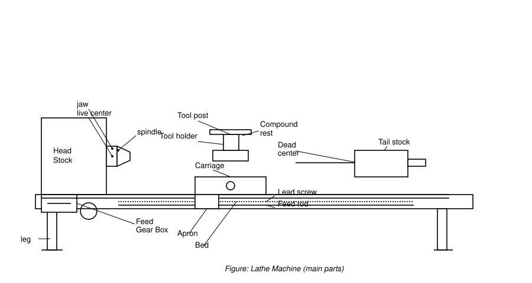
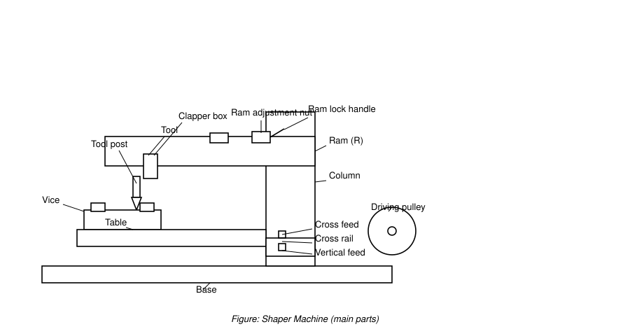
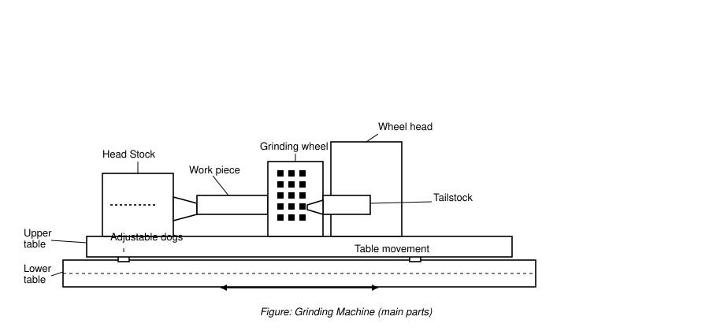

# IPE-102 Practical Report

---

## Experiment 1 — Study of Lathe Machine and Its Operations

### Aim
To study the main parts, working principle, specifications, and operations of a lathe machine. Also, to perform the operations practically.

### Apparatus
Centre lathe, 4-jaw chuck with key, HSS single-point tools (turning, facing, parting, threading), knurling tool, drill bit with drill chuck, vernier caliper, mild steel round bar (25 mm diameter, 100 mm long), coolant.

### Introduction
The lathe is known as the "mother of all machines." It is the oldest machine tool used in production. It started as a simple wood lathe turned by rope. Today it is a general-purpose machine. It is used for both production and repair work. It can perform many different operations.

### Main Parts

| Part | Function |
|---|---|
| Bed | Base of the machine. All other parts are mounted on it. Made of cast iron or nickel-cast-iron alloy. It has precisely machined slides (ways). |
| Headstock | Sends power to the lathe parts. Holds and aligns the main spindle. Contains the speed-change mechanism. |
| Tailstock | A movable casting on the bed ways, opposite the headstock. Holds the dead center, drill chuck, or tools. Can be moved and clamped along the bed. |
| Carriage | Sits between the headstock and tailstock. Supports, guides, and feeds the tool against the job. |
| Saddle | An H-shaped casting on top of the ways. Supports the cross-slide, compound rest, and tool post. |
| Cross Slide | Moves the tool at right angles to the spindle axis. It has a dovetail fit on the saddle. Its top has T-slots for the tool post. |
| Compound Rest | Mounted on the cross-slide. Can be swiveled to any angle. Used for turning angles and short tapers. |
| Tool Post | Mounted on the compound rest. Holds the cutting tool. The height of the cutting edge can be adjusted. |
| Apron | Fastened to the saddle. Hangs over the front of the bed. Contains the gears and clutches that move the carriage. Also contains the half nut, which engages the lead screw for thread cutting. |
| Chuck | Holds short, large-diameter, or irregular workpieces. These cannot be held easily between centers. |
| Feed Rod | A shaft that gives smooth linear feed to the carriage. Used for turning and facing. |
| Lead Screw | Used for thread cutting. The job rotates while the tool moves at a fixed ratio. |
| Spindle | A hollow shaft. Its bore decides the largest bar that can pass through it. |

**Diagram:** [SVG](../../assets/lathe-machine.svg) · [PNG](../../assets/lathe-machine.png)

### Working Principle
The workpiece rotates between centers, in a chuck, or on a faceplate. A fixed cutting tool removes the extra material as chips. For straight turning, the tool moves parallel to the work axis. For facing, it moves at right angles to the axis. For tapers, it moves at an angle to the axis.

### Specifications

| Item | Value |
|---|---|
| Length between centers | 1000 mm |
| Swing over bed | 300 mm |
| Spindle speed range | 45–3000 rpm |
| Motor power | 1.5 kW (2 HP) |
| Machine weight | 1200 kg |
| Chuck | 4-jaw, 100 mm diameter, 54 mm body thickness |

### Procedure
1. Identify the main parts of the lathe.
2. Mount the workpiece in the chuck and tighten it.
3. Remove the chuck key.
4. Fix the tool in the tool post at center height.
5. Set the correct speed and feed.
6. Start the machine and perform each operation.
7. Stop the machine before every measurement.

### Operations

| Operation | Purpose |
|---|---|
| Turning | Reduces the diameter by removing material from the outer surface. The most common operation. |
| Tapered turning | Turns a cylinder into a cone shape. |
| Shoulder turning | Turns two or more diameters on one job. This makes a step. |
| Facing | Machines the end of the job. The tool moves at right angles to the axis. |
| Thread cutting | Cuts internal or external threads. |
| Parting | Cuts a deep groove to separate a piece from the bar. |
| Chamfering | Bevels the end of the job. Usually done after knurling or threading. |
| Knurling | Presses a diamond-shaped rough pattern on the surface. |
| Drilling | Makes a hole using a drill bit held in the tailstock. |

### Observations

| Operation | Tool used | Initial size (mm) | Final size (mm) | Time (min) |
|---|---|---|---|---|
| Turning | HSS turning tool | 25.0 dia | 22.0 dia | 6 |
| Facing | HSS facing tool | 100 long | 98 long | 3 |
| Chamfering | HSS chamfering tool | Sharp edge | 1 × 45° chamfer | 1 |
| Knurling | Diamond knurling tool | 22.0 dia (smooth) | 22.0 dia (knurled) | 4 |

### Merits and Demerits
**Merits:**
- Many operations can be done on one machine.
- Gives good accuracy and surface finish.
- Good for repair work and small batches.
- Costs less than a CNC machine.

**Demerits:**
- Slow for mass production.
- Needs a skilled operator.
- Has little automation.
- Can only make round (symmetric) parts.

### Applications
Metal turning, metal spinning, and thermal spraying. Used in the automobile industry to turn crankshafts, cut screw threads, and reclaim worn parts. Also used for general wood and metal turning.

### Precautions
- Do not use the machine until you understand the controls.
- Never run it with the safety guards removed.
- Always remove the chuck key before starting the machine.
- Stop the lathe before measuring, cleaning, oiling, or adjusting.
- Clear chips with a brush, not by hand.
- Wear safety goggles. Tie back loose clothes and long hair.

### Result and Conclusion
We studied the parts, working principle, and operations of the lathe. We performed turning, facing, chamfering, and knurling on a mild steel bar. The diameter was reduced from 25 mm to 22 mm. The length was faced from 100 mm to 98 mm. Conventional lathes are still important for repair work and small batches.

---

## Experiment 2 — Study of Shaper Machine and Its Operation

### Aim
To study the main parts, working principle, specifications, and operations of a shaper machine. Also, to perform the operations practically.

### Apparatus
Shaper machine, machine vice, single-point HSS tool, mild steel block (100 × 60 × 40 mm), vernier caliper, steel rule, scriber.

### Introduction
A shaper is a machine tool with a single-point cutting tool. The workpiece stays fixed. The tool is carried on the ram and moves back and forth. It cuts on the forward stroke. It does not cut on the return stroke. It is used to make flat, angled, and slotted surfaces.

### Main Parts

| Part | Function |
|---|---|
| Base | A heavy casting. Supports the whole machine and carries its loads. |
| Column | Supports the ram. Contains the drive mechanism. |
| Table | A box-like casting with T-slots for clamping work. Moves cross-wise (cross-feed screw) and up and down (elevation screw). |
| Cross Rail | Mounted on the column. Carries the saddle and table. Moves up and down. |
| Ram | Moves back and forth. Carries the tool head and cutting tool. |
| Tool Head | Mounted on the front of the ram. Holds the tool firmly. Gives vertical and angular feed. |
| Clapper Box | Fitted in the tool head. Holds the tool post. Lifts the tool slightly on the return stroke so the work is not damaged. |
| Tool Post | Mounted on the clapper box. Clamps the cutting tool. |
| Vice | Holds the workpiece firmly using two jaws. |

**Diagram:** [SVG](../../assets/shaper-machine.svg) · [PNG](../../assets/shaper-machine.png)

### Working Principle
The shaper works on the quick-return principle. It commonly uses a crank and slotted-link mechanism. The tool is held by the ram. The workpiece is fixed on the table. The ram moves back and forth. The tool cuts on the slower forward stroke. It returns faster without cutting. At the end of each return stroke, the table moves a small amount sideways. This is the feed.

### Specifications

| Item | Value |
|---|---|
| Stroke length | 750 mm (maximum) |
| Packing dimension | 1800 × 1000 × 1250 mm (L × W × H) |
| Weight | 1250 kg |
| Power | 2.2 kW (3 HP) |
| Speed | Up to 140 strokes per minute |
| Vice jaw width | 200 mm |

### Procedure
1. Identify the main parts of the shaper.
2. Clamp the workpiece firmly in the vice.
3. Fix the tool in the tool post.
4. Set the stroke length and position.
5. Set the stroke rate and feed.
6. Start the machine and perform each cut.
7. Stop the machine before measuring.

### Operations

| Operation | Description |
|---|---|
| Horizontal cutting | The standard flat cut. The table is fed sideways after each return stroke. |
| Vertical cutting | The tool is fed downward using the tool head. Used for end faces, shoulders, keyways, slots, and grooves. |
| Inclined cutting | The tool head is swiveled, or the work is tilted. The tool then cuts a sloping surface. |
| Angular cutting | Makes angled shapes like V-grooves and dovetails. Uses a swiveled tool head and special tools. |

### Observations

| Operation | Material | Initial size (mm) | Final size (mm) | Details |
|---|---|---|---|---|
| Horizontal cutting | Mild steel | 40 thick | 38 thick | 2 mm depth, 12 min |
| Vertical cutting | Mild steel | Flat face | 5 mm step | 4 passes, 8 min |
| Inclined cutting | Mild steel | Flat face | 30° sloped face | 15 min |

### Merits and Demerits
**Merits:**
- Tool cost is low. The single-point tool is easy to grind.
- The workpiece is easy to hold.
- Makes flat and angled surfaces.
- Simple to set up.

**Demerits:**
- Cutting speed is low. The return stroke does no work.
- Only one tool can cut at a time.
- Not suitable for mass production.

### Applications
Machining internal splines. Making flat or angled surfaces. Cutting gear teeth and keyways. Making smooth or rough surfaces and dovetail slides.

### Precautions
- Do not remove chips or reach over the table while the ram is moving.
- Do not adjust the machine while it is running.
- Do not use bolts or nuts with damaged threads to hold clamps.
- Never leave a running shaper unattended.
- Do not use bare hands or compressed air to remove chips. Use a brush.
- Keep clear of the ram's path.

### Result and Conclusion
We studied the construction, working principle, and operations of the shaper. We performed horizontal, vertical, and inclined cuts on a mild steel block. The thickness was reduced from 40 mm to 38 mm. A 5 mm step and a 30° sloped face were also made.

---

## Experiment 3 — Study of Grinding Machine and Its Operations

### Aim
To study the main parts, working principle, specifications, and operations of a grinding machine. Also, to perform the operations practically.

### Apparatus
Cylindrical and surface grinding machine, grinding wheel (350 × 32 × 127 mm), mild steel rod (22 mm diameter), mild steel plate (100 × 50 × 10 mm), coolant, micrometer, safety goggles.

### Introduction
A grinding machine removes material using bonded abrasive grains. The grains act as many tiny cutting edges. They have no fixed shape. The wheel and the workpiece move against each other along a set path.

### Main Parts

| Part | Function |
|---|---|
| Bed | The bottom, horizontal part. Supports all other parts. |
| Column | A vertical pillar that carries the wheel head. |
| Headstock | Holds the live center. Grips and rotates the job. |
| Tailstock | Holds the dead center. Supports the other end of the job. |
| Work Table | Guides and holds the workpiece. On surface grinders, it replaces the headstock and tailstock. |
| Grinding Wheel | The main tool. Removes extra material to give the required size and finish. Comes in different abrasive materials. |
| Drive Motor | Gives power to the wheel through a belt and pulley. |
| Work Holder | Holds the workpiece. Can be centers, a chuck, or a magnetic chuck. |
| Wheel Guard | A cover over the wheel. Protects the operator if the wheel breaks. |
| Cross Feed | Moves the wheel head or table in and out. |
| Handwheels | Three types: traverse, cross-feed, and vertical feed. |
| Coolant Nozzle | Supplies coolant to reduce heat. |

**Diagram:** [SVG](../../assets/grinding-machine.svg) · [PNG](../../assets/grinding-machine.png)

### Working Principle
A motor spins the grinding wheel at high speed. The bed guides and holds the workpiece. Either the wheel head moves over a fixed workpiece, or the workpiece moves under a fixed wheel. A vernier handwheel or CNC control gives fine positioning. Grinding makes a lot of heat. So coolant is supplied to cool the workpiece.

### Specifications

| Item | Value |
|---|---|
| Wheel size (D × W × d) | 350 × 32 × 127 mm (diameter × width × bore) |
| Wheel speed | 1800 rpm (about 33 m/s surface speed) |
| Maximum grinding length | 1000 mm |
| Weight | 800 kg |
| Power | 2.2 kW (3 HP) |

### Procedure
1. Identify the main parts of the machine.
2. Check the wheel for cracks. Do the ring test.
3. Mount the workpiece between centers. For flat work, use the magnetic chuck.
4. Switch on the coolant.
5. Start the wheel. Stand to the side.
6. Feed the wheel in small steps and perform each operation.
7. Stop the machine before measuring.

### Operations

| Operation | Description |
|---|---|
| Cylindrical grinding | The work is rotated between centers. The wheel grinds the outer surface. |
| Surface grinding | The work moves under the wheel on the table. This makes a flat surface. |
| Taper grinding | For long work, swivel the upper table. For short work, set the wheel head to the taper angle. |
| Gear grinding | Done by the generating process or with a form wheel. |
| Thread grinding | Done by the generating process or with a form wheel with one or more threads. |

### Observations

| Operation | Material | Initial size (mm) | Final size (mm) | Finish observed |
|---|---|---|---|---|
| Cylindrical grinding | Mild steel rod | 22.00 dia | 21.95 dia | Smooth, shiny |
| Surface grinding | Mild steel plate | 10.00 thick | 9.95 thick | Smooth, flat |

### Merits and Demerits
**Merits:**
- Gives a very good surface finish and accuracy.
- Can cut very hard materials, like hardened steel.
- Needs only light pressure on the work.

**Demerits:**
- Wheels and machines are costly.
- Material is removed very slowly.
- It makes heat. It must be done carefully to avoid damage.

### Applications
Used in industry to finish round and flat surfaces. Also used to sharpen tools and to grind many materials, including hardened steel.

### Precautions
- Only one person should run the machine.
- Wear safety goggles. Use a mask for heavy grinding.
- Do the ring test and check the wheel for cracks.
- Do not stand in front of the wheel at startup.
- Keep hands away from the wheel.
- Stop all motors before making adjustments.
- Keep the wheel guard fixed in place.

### Result and Conclusion
We studied the construction, working principle, and operations of the grinding machine. We performed cylindrical and surface grinding on mild steel. About 0.05 mm of material was removed from each job. The surface finish was smooth and shiny. Grinding is best when high accuracy and a fine finish are needed.

---

## References
1. S. K. Hajra Choudhury, *Elements of Workshop Technology, Vol. II: Machine Tools*, Media Promoters and Publishers.
2. P. N. Rao, *Manufacturing Technology: Metal Cutting and Machine Tools*, McGraw-Hill.
3. IPE-102 Laboratory Manual.
