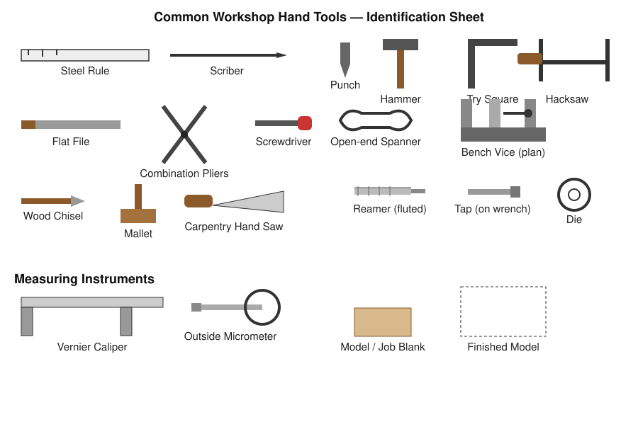
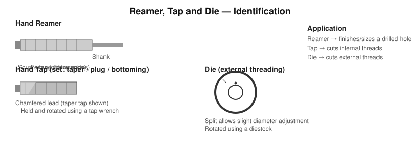
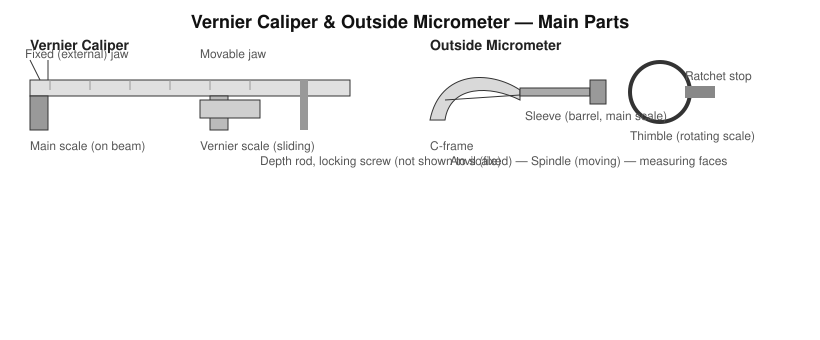

# Practical 01 — Hand Tools, Measuring Instruments, Reamers, Taps & Dies, Bench Vice, Carpentry Tools, Model Making

## Objective

To identify common bench and carpentry hand tools and measuring instruments used in a machine shop, to understand the purpose and correct use of each, and to practise basic model/job making using these tools.

## Tools / Machines / Equipment

**Hand tools:** steel rule, scriber, divider, centre punch, ball-peen hammer, try square, hacksaw, files (flat/round/half-round), pliers, screwdrivers, spanners (open-end/ring/adjustable), cold chisel.

**Measuring instruments:** steel rule, Vernier caliper, outside micrometer (screw gauge), try square (for squareness).

**Threading/finishing tools:** hand reamer, hand tap set (taper/second/plug/bottoming) with tap wrench, die with diestock.

**Work-holding:** bench vice.

**Carpentry tools:** wood chisel, mallet, carpentry hand saw, try square, marking gauge.

**Consumables:** mild-steel/wood job blanks, cutting fluid/oil (where applicable), emery/abrasive cloth.

**PPE:** safety goggles, apron/overall, closed footwear; gloves only where cutting edges make handling unsafe (not required for micrometer/caliper use).

> Common examples are listed above; the exact tool inventory available depends on the institution's workshop.

## Identification

| Tool | Main Purpose | Important Feature |
|---|---|---|
| Steel rule | Direct linear measurement | Graduated in mm/inch |
| Scriber | Marking lines on metal | Hardened, sharp point |
| Divider | Marking circles/arcs, transferring distances | Two hardened, adjustable legs |
| Centre punch | Marking hole centres before drilling | Conical hardened point, ~90° |
| Try square | Checking/marking 90° angles | Stock + hardened steel blade |
| Ball-peen hammer | General striking, punch/chisel work | Flat face + rounded (peen) face |
| Hacksaw | Cutting metal bar/sheet by hand | Removable, tensioned blade |
| Files | Removing small amounts of material, finishing | Cut pattern (single/double cut), shape |
| Pliers | Gripping, bending, cutting wire | Pivoted jaws |
| Screwdriver | Driving slotted/cross-head screws | Tip type (flat/Phillips) matches screw |
| Spanner | Tightening/loosening nuts and bolts | Jaw size matches bolt across-flats |
| Bench vice | Holding workpiece during hand operations | Fixed + movable jaw, lead screw |
| Cold chisel | Cutting/chipping unheated metal | Wedge-shaped hardened edge |
| Wood chisel & mallet | Removing wood in carpentry work | Bevelled cutting edge |
| Carpentry hand saw | Cutting wood to size | Coarser, larger teeth than a hacksaw |

### Reamer, Tap and Die

| Tool | Main Purpose | Important Feature |
|---|---|---|
| Hand reamer | Finishing/sizing a previously drilled hole to accurate diameter and good surface finish | Straight/spiral flutes, square tang for a wrench, small chamfered lead |
| Hand tap (set of 3) | Cutting internal (female) threads | Taper tap (starts thread) → plug → bottoming (finishes thread near a blind hole) |
| Die | Cutting external (male) threads on a rod | Split body for slight size adjustment, used with a diestock |

A hole is normally **drilled slightly undersize**, then reamed, if an accurate finished diameter is required — reaming removes only a small allowance (a few tenths of a millimetre), not bulk stock.

### Vernier Caliper and Outside Micrometer

| Instrument | Main Purpose | Important Feature |
|---|---|---|
| Vernier caliper | Outside, inside, and depth measurement | Main scale + sliding vernier scale; typical least count 0.02 mm or 0.05 mm |
| Outside micrometer | Precise outside diameter/thickness measurement | Sleeve (main scale) + thimble (rotating scale); typical least count 0.01 mm; ratchet stop for consistent pressure |

## Principle / Working Principle

- **Vernier scale principle:** the vernier (sliding) scale is divided so that a fixed number of its divisions span one fewer division of the main scale, allowing the coincidence of a vernier line with a main-scale line to indicate a fractional reading beyond the last full main-scale division.
- **Micrometer screw principle:** rotating the thimble advances the spindle along a precision screw thread of known pitch; one full thimble revolution advances the spindle by exactly one thread pitch, and the thimble's circumferential graduations subdivide that pitch into fine readable increments.
- **Reaming principle:** a reamer removes a very small, uniform allowance using multiple cutting edges operating at low speed, producing a round, straight, accurately sized hole with good surface finish — it is a finishing, not a stock-removal, operation.
- **Thread cutting with tap/die:** each cutting tooth removes a thin chip following a helical path of the specified pitch, generating an internal (tap) or external (die) thread form matching the tap/die's designation.

## Construction / Main Parts

- **Vernier caliper:** beam with main scale, fixed jaw, sliding jaw carrying the vernier scale, locking screw, depth rod.
- **Micrometer:** frame (C-frame), anvil (fixed), spindle (moving), sleeve/barrel (main scale), thimble (rotating scale), ratchet stop, lock nut.
- **Bench vice:** fixed jaw (bolted to bench), movable jaw, vice screw/spindle, guideways, jaw plates (often serrated, sometimes with soft covers for finished work).

## Operation / Working

- **Reading a Vernier caliper:** note the main-scale division just before the vernier zero; find the vernier line that most closely coincides with a main-scale line; add (that vernier division number × least count) to the main-scale reading.
- **Reading a micrometer:** note the sleeve (main scale) reading up to the thimble edge; add the thimble scale reading at the datum line; sum the two.
- **Using a bench vice:** open the jaws to slightly more than the workpiece size, position the work centrally and as low as practical (for rigidity), tighten by hand pressure on the handle only (never with a hammer or extension bar), and use soft jaw covers for finished/soft surfaces.
- **Reaming a hole:** drill the hole to the correct reamer allowance, mount the reamer in a tap wrench or drill chuck, feed it straight into the hole with light axial pressure while rotating in the cutting direction only, and withdraw by continuing to rotate forward (never reverse a reamer while it is in the hole).
- **Tapping a hole:** drill the correct tap-drill size hole, start the taper tap square to the surface, turn forward with light pressure and back off a fraction of a turn every few turns to break the chip, then follow with second/plug/bottoming taps as needed.
- **Using a die:** chamfer the rod end slightly, start the die square to the axis, and use the same forward-and-back-off technique as tapping.

## Procedure

1. Inspect and clean all tools and the job blank before use.
2. Mark out the required dimensions on the workpiece using a steel rule, scriber, and try square; centre-punch hole locations.
3. Hold the workpiece securely in the bench vice.
4. Cut/file the workpiece to the marked dimensions using a hacksaw and files as needed, checking squareness with a try square periodically.
5. Where a hole is required: drill to the tap-drill/reamer-allowance size (drilling machine, Practical 02), then ream or tap as specified.
6. Measure the finished dimensions using the Vernier caliper and/or micrometer; record readings.
7. Deburr all edges with a file.
8. Clean the job and the tools; return tools to their storage location.

## Measurements / Observation

| Trial | Feature Measured | Instrument Used | Reading |
|---|---|---|---|
| 1 | | | |
| 2 | | | |
| 3 | | | |

`Vernier caliper least count = ____ mm`
`Micrometer least count = ____ mm`
`Measured dimension = ____ mm`

## Calculations

**Vernier caliper least count** = (Value of one main scale division) ÷ (Number of vernier divisions)

**Micrometer reading** = Sleeve (main scale) reading + (Thimble division × least count)

**Tap drill size (approximate, metric)** = Major diameter − Pitch (for standard ISO metric threads; consult a tap-drill chart for the exact recommended size for a given thread designation).

## Result

State the tools/instruments correctly identified, the operations performed (marking, cutting, filing, drilling, reaming/tapping as applicable), and the final measured dimensions of the job produced.

## Common Defects / Problems

| Defect | Likely Cause |
|---|---|
| Inaccurate caliper/micrometer reading | Parallax error, dirty/worn faces, excessive clamping force, misread vernier/thimble coincidence |
| Oversized reamed hole | Reamer run out, insufficient drilled allowance forcing side pressure, reamer fed off-axis |
| Torn/crossed threads | Tap/die started out of square, no back-off to clear chips, wrong tap-drill size |
| Vice-marked workpiece | No soft jaw covers used on a finished surface, over-tightening |
| Rough sawn/filed edge | Wrong file cut for the material, incorrect saw blade pitch, excessive pressure |

## Safety / Precautions

- Do not use files without a handle — the tang can puncture the palm.
- Keep fingers clear of the hacksaw blade path and cutting-tool edges at all times.
- Never test a chisel or punch edge with a bare finger; never strike a mushroomed (burred) hammer or chisel head.
- Tighten the bench vice by hand force only; never extend the handle with a pipe or strike it with a hammer.
- When reaming or tapping, keep hands clear of the rotating tool if power-assisted; for hand operation, maintain a firm, controlled grip and stop immediately if the tool binds.
- Wear safety goggles when filing, sawing, chiselling, or drilling to protect against flying chips/burrs.
- Store sharp tools (scriber, punches, chisels) point-down or in a rack, never loose in a pocket.
- Handle precision instruments (Vernier caliper, micrometer) by their frame only; never drop them or use them as a hammer/lever.
