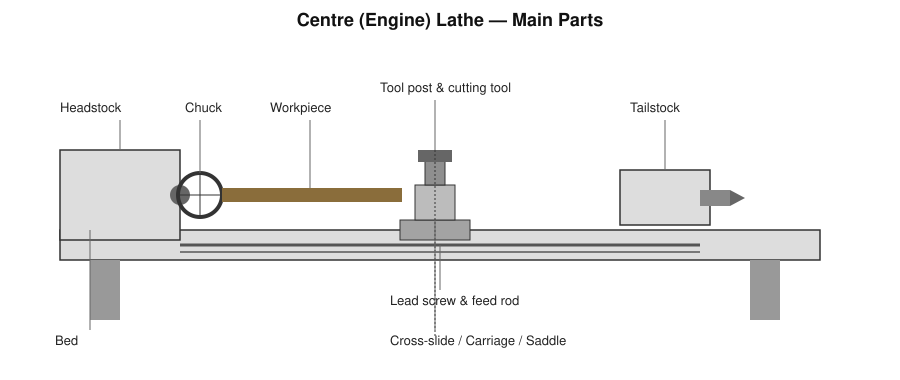
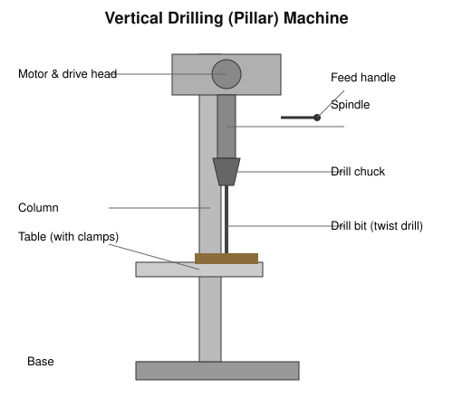
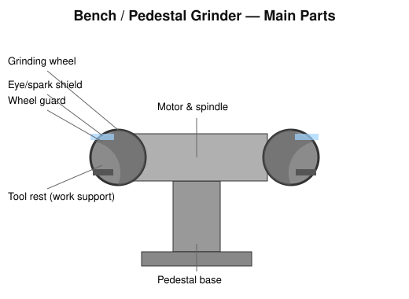
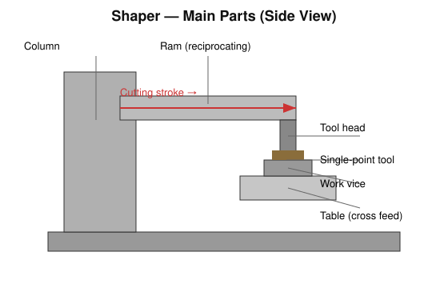
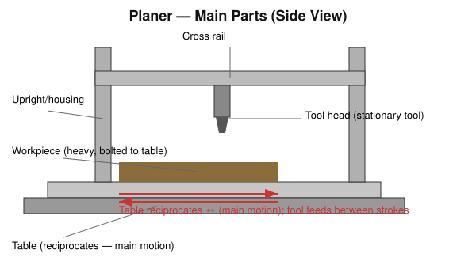
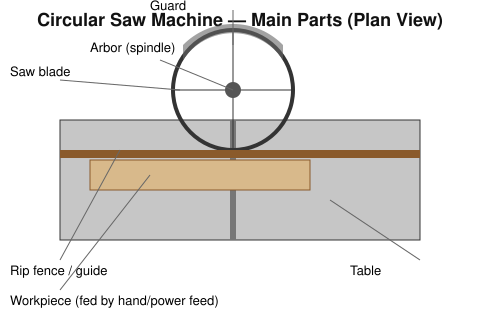
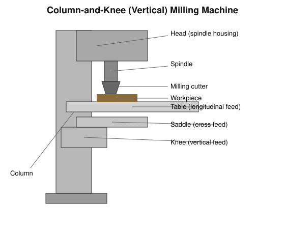

# Practical 02 — Lathe, Drilling, Grinding, Shaper, Planer, Circular Saw and Milling Machine

## Objective

To identify the main parts, principal motions, and typical operations of the lathe, drilling machine, grinding machine, shaper, planer, circular saw, and milling machine, and to understand safe operating practice for each.

## Tools / Machines / Equipment

**Machines:** centre (engine) lathe, pillar/bench drilling machine, bench/pedestal grinder, shaper, planer, power circular saw, column-and-knee milling machine.

**Cutting tools:** single-point turning/facing/threading tools, twist drills, grinding wheels, single-point shaper/planer tools, circular saw blades, milling cutters (slab, end mill, form cutters).

**Work-holding:** three/four-jaw chuck and centres (lathe), machine vice/clamps (drilling, milling), work vice (shaper), fixture/bolts (planer), rip fence (circular saw).

**Measuring/marking:** steel rule, Vernier caliper, centre gauge (threading), dial test indicator (where used).

**PPE:** safety goggles/face shield, close-fitting overalls (no loose clothing/sleeves/ties/jewellery), safety shoes; ear protection where required.

## Identification

| Machine | Main Purpose | Important Feature |
|---|---|---|
| Centre lathe | Producing cylindrical/conical surfaces by rotating the work against a tool | Headstock spindle + chuck; workpiece rotates |
| Drilling machine | Producing round holes | Vertical spindle with drill chuck; drill rotates and feeds axially |
| Grinding machine | Fine finishing/sharpening using abrasive action | High-speed abrasive wheel |
| Shaper | Producing flat/contoured surfaces on small-to-medium work | Reciprocating ram carries the tool |
| Planer | Producing flat surfaces on large/heavy work | Reciprocating table carries the work; tool is stationary |
| Circular saw | Cutting bar/sheet stock to length | Rotating toothed circular blade |
| Milling machine | Producing flat, slotted, and contoured surfaces using a rotating multi-tooth cutter | Work is fed into a rotating cutter |

## Principle / Working Principle

Machining removes material by generating **relative motion** between a cutting tool and the workpiece so that the tool's edge shears away material as chips. Every machine tool combines:

- a **cutting motion** (the primary motion that enables chip removal — rotation of the work in a lathe, rotation of the cutter in drilling/grinding/milling, or the reciprocating stroke in a shaper/planer), and
- a **feed motion** (the motion that brings fresh material into contact with the cutting edge — longitudinal/cross feed of the tool in turning, downward feed of the drill, table feed in milling/shaping/planing).

The **lathe** rotates the workpiece while a single-point tool is fed along or across the axis, generating cylindrical, tapered, or faced surfaces. The **drilling machine** rotates and axially feeds a multi-edge twist drill into stationary work. The **grinder** uses the abrasive grains on a rotating wheel, each acting as a microscopic cutting edge, to remove very small amounts of material for fine finishing or sharpening. The **shaper** and **planer** both use a single-point tool moving in a straight-line reciprocating cutting stroke — in a shaper the *tool* (on the ram) reciprocates over stationary work; in a planer the *work* (on the table) reciprocates under a stationary tool, which suits large/heavy workpieces better. The **circular saw** parts material using the rotating action of a toothed blade fed through the stock. The **milling machine** rotates a multi-tooth cutter while the work, held on a table, is fed into it, allowing flat, slotted, and contoured surfaces to be generated.

## Construction / Main Parts

### Lathe

Headstock (houses the spindle and drive), spindle and chuck (holds and rotates the work), tailstock (supports the far end of long work, or holds drills), bed (guides carriage/tailstock and supports the whole machine), carriage (saddle + cross-slide + tool post — carries and positions the tool), lead screw (drives automatic feed for thread cutting), feed rod (drives automatic feed for general turning).

**Typical operations:** facing, straight (plain) turning, taper turning, drilling (using the tailstock), knurling, thread cutting.

### Drilling Machine

Base (supports the machine), column (vertical support carrying the head and table), table (adjustable, holds/clamps the work), spindle (rotates and axially feeds the drill), chuck (grips the drill bit), feed handle (advances the spindle downward).

**Basic drilling procedure:** mark and centre-punch the hole location, clamp the work securely, select drill and speed appropriate to material/diameter, start the machine, feed the drill steadily into the work using cutting fluid where appropriate, and withdraw periodically to clear chips on deep holes.

### Grinding Machine

Grinding wheel (abrasive cutting element), spindle (drives the wheel), work support/tool rest (supports the workpiece close to the wheel), wheel guard (contains fragments in case of wheel failure), eye/spark shield.

**Safe operation:** inspect the wheel for cracks (ring test) before mounting, keep the tool rest adjusted close to the wheel (small gap only), dress the wheel periodically to keep the face true and free-cutting, and never grind on the side of a wheel not designed for side grinding.

### Shaper

Column (main support and housing for the ram drive), ram (reciprocates, carries the tool head), tool head (holds the single-point tool, can swivel for angular cuts), quick-return mechanism (drives the ram — return stroke is faster than the cutting stroke, typically via a slotted-link or crank mechanism, to save idle time), table (holds the work, provides cross/vertical feed), stroke length (adjustable to suit job length).

### Planer

Bed and reciprocating table (carries and reciprocates the heavy workpiece), uprights/housings (support the cross-rail), cross-rail (carries one or more stationary tool heads), tool head(s) (hold single-point tools, feed is usually intermittent, applied between strokes). The main cutting motion is the table's reciprocation; feed is normally at the tool, applied at the end of each stroke.

### Circular Saw

Saw blade (toothed cutting disc), arbor/spindle (drives the blade), table (supports the stock), rip fence/guide (positions the cut), guard (covers the blade above the table).

### Milling Machine

Column (main vertical support housing the drive), spindle (rotates the cutter), arbor/tool holder (mounts the cutter on the spindle), knee (supports the saddle and table, provides vertical feed), saddle (provides cross feed), table (provides longitudinal feed, clamps the work), milling cutter (multi-tooth rotating cutting tool).

**Basic milling operations:** slab (plain) milling, face milling, slot milling, and form/profile milling using shaped cutters.

## Operation / Working

For each machine the operator must correctly select and secure: **workholding** (chuck/centres, vice, clamps, or fixture), **toolholding** (tool post, chuck, arbor), and the appropriate **cutting speed and feed** for the workpiece material and tool. Relative motion between tool and work — rotation (lathe, drill, grinder, mill) or reciprocation (shaper, planer) — combined with a controlled feed and depth of cut removes material progressively until the required size and finish are obtained.

## Procedure

> The steps below are general. Follow the specific machine's start-up/shutdown checklist and the instructor's instructions before operating any machine.

1. Inspect the machine, guards, and cutting tool before switching on.
2. Select and securely mount the workpiece using the correct work-holding device.
3. Select and correctly mount the cutting tool; check alignment/tool height.
4. Select an appropriate speed and feed for the material and operation.
5. Take a trial cut; check the resulting dimension/finish.
6. Proceed with the full operation, monitoring chip formation, sound, and vibration.
7. Stop the machine and retract the tool before making measurements.
8. Remove burrs/chips and clean the machine and work area after use.
9. Switch off and isolate the machine at the end of the session.

## Measurements / Observation

| Trial | Operation | Parameter (speed/feed/depth) | Result / Dimension |
|---|---|---|---|
| 1 | | | |
| 2 | | | |
| 3 | | | |

## Calculations

**Cutting speed (V)** relates the peripheral speed of the tool or work to the spindle speed:

V = (π × D × N) / 1000  (V in m/min, D = diameter in mm, N = spindle speed in rpm)

**Spindle speed from a target cutting speed:**

N = (1000 × V) / (π × D)

> D, V, and feed values depend on the workpiece material, tool material, and machine — use the values specified for the given exercise/example rather than a fixed universal number.

## Result

State which machines were identified, which operations were observed or performed, and the dimensions/finish achieved (where a job was produced).

## Common Defects / Problems

| Defect | Likely Cause |
|---|---|
| Oversize/undersize turned or drilled diameter | Incorrect tool setting, tool wear, worn machine slides, drill wander |
| Poor surface finish | Excessive feed, wrong speed for the material, dull tool, vibration/chatter |
| Chatter marks | Insufficient work/tool rigidity, excessive overhang, wrong speed |
| Taper on a job meant to be parallel (lathe) | Tailstock misalignment, worn bed/centres |
| Burnt/glazed grinding wheel surface | Wheel not dressed, wrong wheel grade for material, excessive pressure |
| Rough shaped/planed surface | Tool not sharp, excessive feed, machine not rigidly set |

## Safety / Precautions

- Never wear loose clothing, neckties, rings, or dangling sleeves near rotating spindles, chucks, or reciprocating parts — entanglement risk.
- Never attempt to clear chips by hand while the machine is running; use a brush or hook after stopping.
- Stand clear of the chip stream and never touch a fresh chip — it is sharp and may be hot.
- Do not leave a chuck key in the lathe chuck.
- On the shaper/planer, keep clear of the ram/table stroke path — reciprocating motion can crush or strike.
- On the grinder, always use the guard and tool rest, wear eye protection, and never grind on an unrated wheel face.
- On the circular saw, keep hands clear of the blade path and never remove the guard; use a push stick for short offcuts.
- On the milling machine, ensure the cutter is fully stopped before making adjustments near it.
- Ensure all guards are in place and machines are properly earthed/isolated before starting.
- Report any unusual noise, vibration, or damaged tooling immediately and stop the machine.
