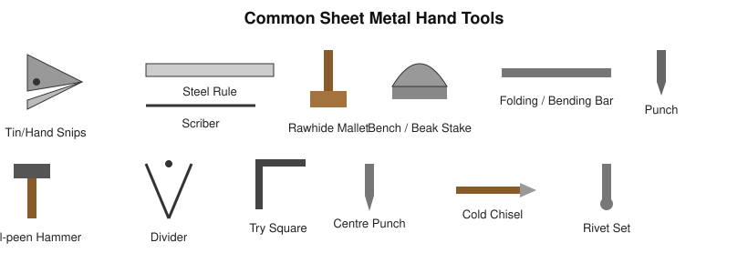
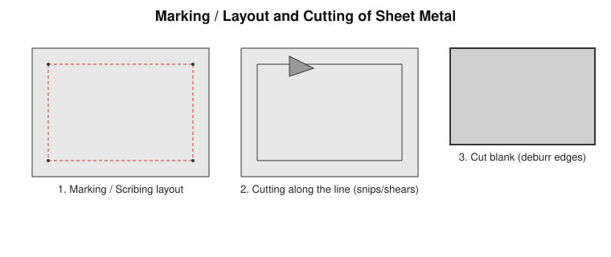
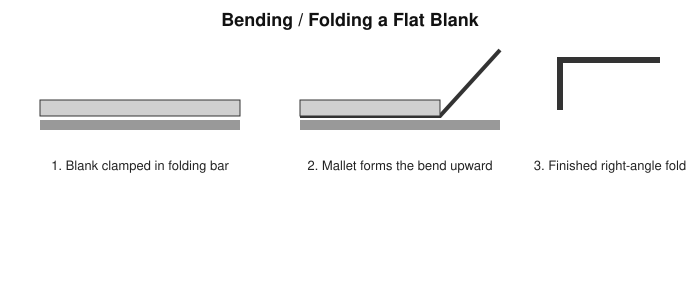
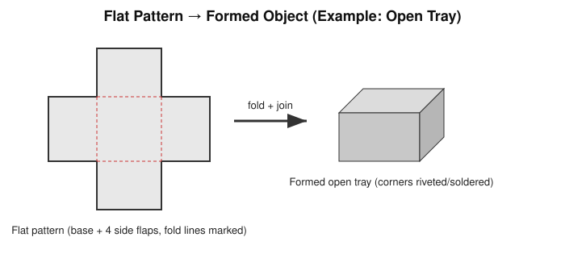

# Practical 03 — Sheet Metal Work

## Objective

To learn marking, cutting, bending, and finishing operations on sheet metal, and to fabricate a simple useful object (e.g., a tray, funnel, or scoop) from a flat sheet blank.

## Tools / Machines / Equipment

**Hand tools:** steel rule, scriber, divider, try square, tin/hand snips (straight and curved), hacksaw, rawhide/wooden mallet, bench/beak stake or small anvil, folding/bending bar, centre punch, ball-peen hammer, rivet set, cold chisel.

**Machines (where available):** guillotine/bench shear, sheet-metal folding machine, power press, spot welder.

**Measuring/marking:** steel rule, divider, scriber, try square.

**Consumables:** mild-steel or GI sheet, rivets/solder as required for joining, abrasive/emery cloth for deburring.

**PPE:** safety goggles, gloves suitable for handling sheet edges (thin sheet edges are sharp), closed footwear.

## Identification

| Tool | Main Purpose | Important Feature |
|---|---|---|
| Tin/hand snips | Cutting sheet along straight or curved lines | Scissor-action, hardened jaws |
| Scriber / divider | Marking lines and circles on sheet | Hardened points |
| Rawhide mallet | Forming/bending sheet without marking the surface | Soft, non-marring face |
| Bench/beak stake | Support for forming curved or folded work | Shaped, rigid working surface |
| Folding/bending bar | Producing straight, uniform bends | Clamps sheet along the bend line |
| Rivet set (dolly) | Forming the closing head of a rivet | Shaped cavity matching the rivet head |

## Principle / Working Principle

Sheet metal work shapes thin, flat stock into a useful three-dimensional form through a sequence of **cutting** (separating the blank from stock along marked lines) and **forming** (bending the flat blank along straight fold lines, or working it over a stake for curved shapes) operations, followed by **joining** (riveting, soldering, or seaming) where the finished shape requires separate pieces or a closed seam. Because the material is thin, forces are applied mainly by hand tools and light hammering rather than heavy machine cuts, and the flat pattern must be laid out to the correct **developed (unfolded) size**, including any allowance for the seam or fold, before cutting.

## Construction / Main Parts

Not applicable in the machine-tool sense — this practical centres on hand tools and simple fixtures (stakes, folding bar) described above.

## Operation / Working

1. **Material selection** — choose sheet of suitable gauge (thickness) and material for the object being made.
2. **Measurement and marking/layout** — lay out the flat (developed) pattern on the sheet using a rule, scriber, and divider, including bend lines and any joining allowance.

   

3. **Cutting** — cut along the marked lines using snips (curved snips for curves, straight snips for straight lines) or a bench shear for long straight cuts.
4. **Bending/forming** — clamp the sheet along the fold line in a folding bar (or over a stake for curved work) and form the bend using a mallet, working progressively rather than in one strike.

   

5. **Joining** (where required) — join edges/seams by riveting, soldering, or a folded/lock seam, as specified for the object.
6. **Finishing** — deburr and smooth all cut edges; check for sharp corners.
7. **Inspection** — check the finished object against the required dimensions and for square, uniform bends.

## Procedure

1. Study the drawing/shape of the object to be made and lay out its flat (developed) pattern on paper first if needed.
2. Transfer the pattern onto the sheet metal using a scriber, rule, and try square; mark all fold lines clearly.
3. Cut the blank to the marked outline using snips (or a bench shear).
4. Deburr the cut edges with a file or emery cloth.
5. Clamp the blank along the first fold line in the folding bar; form the bend with a mallet.
6. Repeat for each remaining fold line, checking squareness with a try square as you go.
7. Join any seams/edges as specified (riveting, soldering, or seaming).
8. Deburr and clean the finished object.
9. Inspect and measure the final dimensions against the specification.

## Measurements / Observation

| Feature | Specified Dimension | Measured Dimension |
|---|---|---|
| Length | | |
| Width | | |
| Height/depth | | |
| Bend angle | | |

## Calculations

**Developed (flat pattern) length for a simple bend** = sum of the flat leg lengths, adjusted by a bend allowance to account for the neutral axis of the material at the fold (bend allowance depends on sheet thickness, bend angle, and inside bend radius — calculate per the specific job, do not assume a fixed value).

## Result

State the object produced, the operations performed (marking, cutting, bending, joining, finishing), and the final measured dimensions compared with the specification.

## Common Defects / Problems

| Defect | Likely Cause |
|---|---|
| Uneven or misaligned bend | Sheet not clamped square in the folding bar, uneven mallet blows |
| Jagged/burred cut edge | Blunt snips, sheet not supported during cutting |
| Cracked bend | Bend radius too sharp for the material/thickness, bending across the wrong grain direction |
| Loose/leaking rivet joint | Wrong rivet diameter/length for sheet thickness, hole misaligned, insufficient head forming |
| Distorted panel | Excessive or uneven hammering during forming |

## Safety / Precautions

- Sheet metal edges (especially freshly cut) are very sharp — handle sheet stock with gloves and always deburr edges before further handling.
- Keep fingers clear of the snip jaws while cutting.
- Support the sheet properly when cutting to avoid sudden slips.
- Wear safety goggles when cutting, filing, or riveting to protect against flying burrs/chips.
- When using a bench shear or folding machine, keep hands well clear of the blade/clamping line and never bypass guards.
- When riveting, keep fingers clear of the rivet set and hammer strike path.
