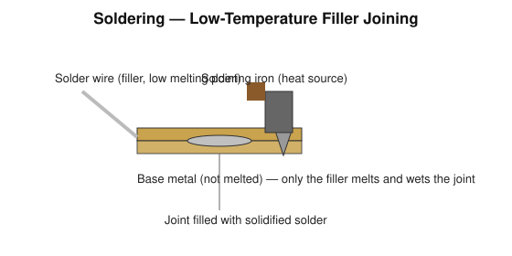
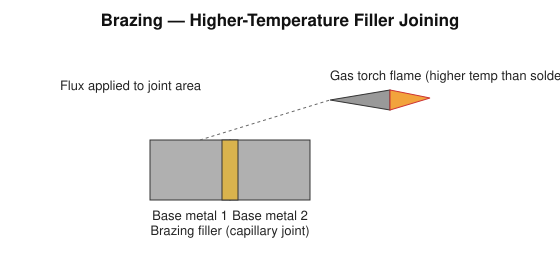
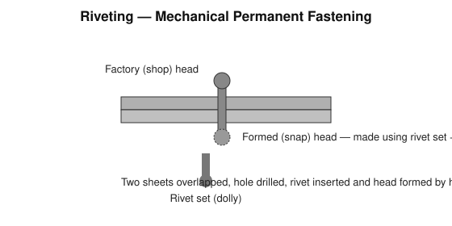
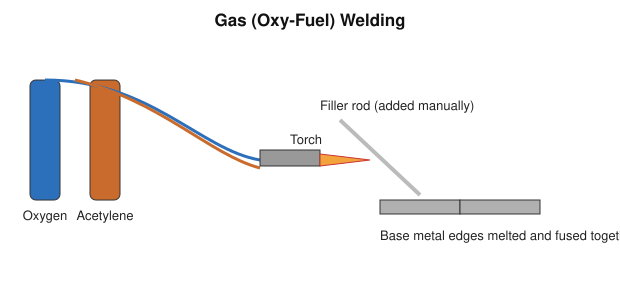
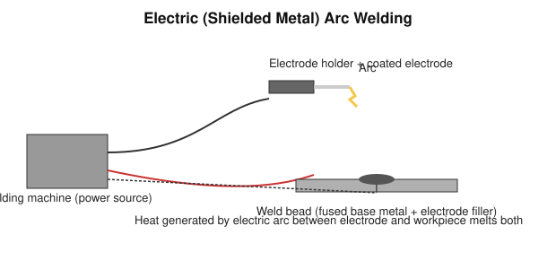

# Practical 04 — Metal Joining: Soldering, Brazing, Riveting, Gas Welding, Electric Arc Welding

## Objective

To understand and practise the principal metal-joining processes — soldering, brazing, riveting, gas welding, and electric arc welding — including the equipment, procedure, and safety requirements for each.

## Tools / Machines / Equipment

**Soldering:** soldering iron, solder wire (low-melting-point filler alloy), flux, cleaning abrasive.

**Brazing:** gas torch (oxy-acetylene or oxy-LPG), brazing filler rod, flux, workpiece clamps.

**Riveting:** rivets (of correct diameter/length/material), hand/pneumatic hammer, rivet set (dolly), drill for rivet holes, snap/holder-on.

**Gas welding:** oxygen and acetylene (or LPG) cylinders with regulators, hoses, welding torch, filler rod, spark lighter, flashback arrestors.

**Electric arc welding:** arc welding machine (transformer/rectifier/inverter power source), electrode holder, coated (flux-covered) electrodes, work (earth) clamp, welding cables.

**PPE (general):** safety goggles/welding helmet with correct filter shade, welding gloves, protective apron/clothing (natural fibre, no synthetic materials that can melt), closed leather footwear.

**PPE (specific):** heat-resistant gloves and tongs for soldering/brazing hot work; welding helmet with auto-darkening or fixed filter lens, leather gauntlets, and fire-resistant clothing for gas and arc welding.

## Identification

| Process | Heat Source | Filler | Base Metal Melted? |
|---|---|---|---|
| Soldering | Soldering iron (low temperature) | Solder (low-melting alloy) | No |
| Brazing | Gas flame (higher temperature than soldering) | Brazing filler rod (higher-melting than solder) | No (in normal practice) |
| Riveting | — (mechanical, no heat) | Rivet (mechanical fastener) | No |
| Gas welding | Oxy-fuel flame | Filler rod (optional, same/similar to base metal) | Yes |
| Electric arc welding | Electric arc | Coated electrode (acts as filler) | Yes |

## Principle / Working Principle

### Soldering

Soldering joins parts using a **low-melting-point filler metal** (solder) that is heated with a soldering iron until it melts and wets the joint by capillary action; the base metals themselves are **not melted**. Suitable mainly for light, low-strength, or electrical joints.

### Brazing

Brazing also joins parts using a filler metal without melting the base metal, but the filler used melts at a **higher temperature** than soldering filler (a gas torch is typically used). Flux is applied to prevent oxidation and help the filler flow into the joint by capillary action, producing a stronger joint than soldering.

### Riveting

Riveting is a **mechanical, permanent fastening** method (no melting involved): a rivet is inserted through matching holes in the parts to be joined, and its protruding end (tail) is formed into a second head, clamping the parts together.

### Gas Welding

Gas (oxy-fuel) welding uses the heat of a **combustion flame**, most commonly oxygen burned with acetylene, to melt the edges of the base metal (and, where used, a filler rod) so that they fuse together on cooling into a single continuous joint.

### Electric Arc Welding

Shielded metal arc welding uses the heat of an **electric arc**, struck between a coated electrode and the workpiece, to melt both the electrode (which supplies filler metal) and the base metal edges; the melted metal fuses and solidifies into a weld bead. The electrode coating decomposes to form a gas shield and a protective slag layer over the weld.

## Construction / Main Parts

- **Soldering iron:** heating element/bit, handle, power lead (electric) or heated body (non-electric).
- **Brazing/gas welding torch:** mixing chamber, tip/nozzle, gas control valves, connected via hoses to separate regulated fuel and oxygen cylinders.
- **Arc welding set:** power source (transformer/rectifier/inverter), electrode holder, work (earth) clamp, welding cables.
- **Rivet:** head (factory/shop head), shank (body), tail (formed into the second head during riveting).

## Operation / Working

- **Soldering:** clean and flux the joint area, heat with the iron, apply solder at the joint (not directly to the iron tip) until it flows and wets both surfaces, then allow to cool undisturbed.
- **Brazing:** clean and flux the joint, heat both parts evenly with the torch to brazing temperature, apply filler rod so it is drawn into the joint by capillary action, then allow to cool.
- **Riveting:** drill matching holes in the overlapped parts, insert the rivet, support the factory head with a holder-on/dolly, and form the second (shop) head by hammering (or pressing) the protruding tail.
- **Gas welding:** set correct regulator pressures, light and adjust the flame (usually neutral flame for general steel welding), hold the torch at the correct angle and travel speed, feed filler rod into the leading edge of the molten pool as needed.
- **Electric arc welding:** set correct welding current for the electrode size/material, strike the arc, maintain a consistent arc length and travel speed, and clean slag from the completed weld bead.

## Procedure

> Only attempt welding/brazing under direct supervision, with the correct PPE, in a ventilated area, and with all gas/electrical equipment checked beforehand.

1. Prepare the joint: clean surfaces, remove rust/paint/oil, and fit the parts as required for the joint type.
2. Select the process-appropriate equipment and consumables (solder/flux, brazing rod/flux, rivets, filler rod, or electrode).
3. Set up and check the equipment (regulator pressures for gas; current setting for arc welding; correct rivet size for riveting).
4. Perform the joining operation following the process-specific technique described above.
5. Allow the joint to cool naturally; do not quench a fresh braze/weld unless specifically instructed.
6. Clean the finished joint (remove flux residue/slag as applicable).
7. Inspect the joint for completeness, soundness, and appearance.
8. Shut down and isolate equipment: close cylinder valves and bleed hoses (gas welding/brazing), switch off and disconnect the welding set (arc welding), switch off and safely rest the iron (soldering).

## Measurements / Observation

| Trial | Process | Joint Type | Observation (appearance/soundness) |
|---|---|---|---|
| 1 | | | |
| 2 | | | |
| 3 | | | |

## Calculations

Calculations are not usually central to this practical. Where relevant for riveted joints, the rivet diameter is generally selected in proportion to the sheet thickness being joined (consult the applicable standard/design table for the exact ratio rather than assuming a fixed value); pitch and edge distance are similarly specified by the applicable design standard.

## Result

State which joining processes were observed/performed, the type of joint made, and the quality of the resulting joint (soundness, appearance, any defects noted).

## Common Defects / Problems

| Process | Common Defect | Likely Cause |
|---|---|---|
| Soldering | Dry/dull joint, poor adhesion | Insufficient heat, joint moved before solder solidified, no/inadequate flux |
| Brazing | Filler failed to flow into joint | Poor cleaning, insufficient/uneven heating, wrong flux |
| Riveting | Loose joint, cracked head | Wrong rivet size, misaligned holes, insufficient/excessive head forming |
| Gas welding | Poor penetration, burn-through | Wrong flame setting, incorrect travel speed, wrong tip size |
| Arc welding | Porosity | Damp/rusty electrode or base metal, arc length too long, contamination |
| Arc welding | Poor penetration | Current too low, travel speed too fast |
| Arc/gas welding | Excessive distortion | Uneven heat input, no clamping/jigging, welding sequence not planned |

## Safety / Precautions

- **General:** never join or weld a container that has held flammable substances without proper certified cleaning; keep the work area clear of flammable material; keep a suitable fire extinguisher nearby.
- **Soldering/brazing:** use tongs or heat-resistant gloves to handle hot workpieces and the iron/torch; be aware that soldered/brazed joints and nearby metal remain hot well after the visible glow fades; work in a ventilated area — flux fumes are irritant.
- **Riveting:** wear eye protection — hammering can throw metal fragments; keep fingers clear of the rivet set and the hammer's strike path.
- **Gas welding/brazing:** inspect hoses and connections for leaks before lighting; always open the acetylene valve before oxygen when lighting, and close acetylene before oxygen when shutting down; never use oil or grease near oxygen fittings; secure cylinders upright and chained; use flashback arrestors; work in a well-ventilated area.
- **Electric arc welding:** never look at the arc without a correctly rated welding helmet — arc radiation causes "arc eye" (flash burn) and skin burns; wear dry leather gloves and flame-resistant clothing with no exposed skin; ensure the work clamp has a good connection and cables are not damaged; do not weld in damp conditions or with wet gloves — electric shock risk; ensure adequate ventilation to clear welding fumes.
- Dispose of hot slag/spatter safely; do not touch a freshly welded/brazed joint or slag with bare hands.
