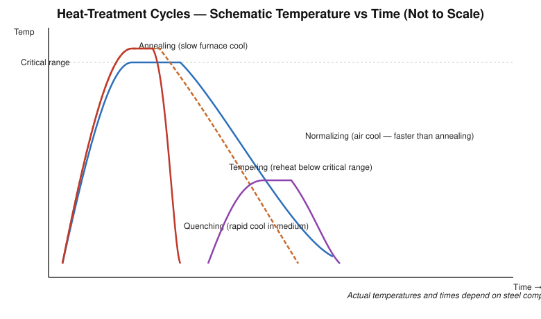

# Practical 05 — Heat Treatment of Steel (Annealing, Normalizing, Quenching, Tempering, Surface Hardening)

## Objective

To understand the purpose, procedure, and effect of the principal heat-treatment processes applied to steel — annealing, normalizing, quenching, tempering, and surface hardening — and to observe/perform a basic heat-treatment exercise.

## Tools / Machines / Equipment

**Equipment:** furnace/muffle furnace (electric or oil/gas fired), quenching tanks (water, oil, or brine as specified), tongs, thermocouple/pyrometer or temperature-indicating equipment, wire brush.

**Consumables:** steel test specimens (of specified grade), quenching medium (water/oil/brine as specified for the exercise).

**Measuring:** hardness tester (where available, e.g., Rockwell/Brinell) for before/after comparison, steel rule for dimensional checks.

**PPE:** heat-resistant gloves, face shield/goggles, apron, closed footwear; tongs of adequate length to keep hands away from the furnace/quench.

## Identification

| Process | Purpose | Cooling Method |
|---|---|---|
| Annealing | Soften steel, relieve internal stress, improve machinability/ductility | Very slow — usually cooled inside the furnace |
| Normalizing | Refine grain structure, relieve stress, more uniform properties than as-rolled/forged | Moderate — cooled in still air |
| Quenching (hardening) | Increase hardness and strength | Rapid — quenched in water, oil, or brine as specified |
| Tempering | Reduce brittleness of quenched steel while retaining useful hardness | Air or furnace cooled, after reheating below the critical range |
| Surface hardening | Hard, wear-resistant surface with a tougher core | Varies by method (e.g., quenching after localized heating) |

## Principle / Working Principle

Heat treatment changes the mechanical properties of steel by controlling the **temperature the steel is heated to**, the **time held at that temperature**, and the **rate at which it is subsequently cooled**, all of which govern the internal microstructure formed as the steel transforms and cools. In general:

- Heating into (or above) the critical transformation range allows the steel's internal structure to reorganize.
- **Slow cooling** (as in annealing) allows the structure to form in a soft, stable, coarse-grained condition.
- **Moderate cooling** (as in normalizing, typically still air) produces a finer, more uniform structure than slow furnace cooling.
- **Rapid cooling** (quenching) traps the structure in a hard but often brittle condition.
- **Tempering** a quenched part — reheating to a temperature below the critical range and holding, then cooling — relieves some of the hardening stresses and reduces brittleness, trading a controlled amount of hardness for improved toughness.
- **Surface hardening** methods harden only the outer layer of a component (by locally heating and quenching the surface, or by altering surface chemistry before hardening), leaving the core relatively tough and shock-resistant while the surface resists wear.

> The exact temperature, holding time, and cooling medium for any of these processes depend on the **steel's carbon content/alloy grade** — always consult the specification or handbook data for the grade in question rather than assuming a single universal temperature.

## Construction / Main Parts

- **Furnace:** heating chamber, temperature control/thermocouple, door, refractory lining.
- **Quenching tank:** container holding the quenching medium (water/oil/brine), sized to allow rapid, even cooling of the specimen.

## Operation / Working

1. The specimen is heated in the furnace to the temperature range specified for the process and the steel grade, and held (soaked) long enough for the temperature to become uniform through the section.
2. It is then cooled according to the process: left in the furnace to cool slowly (annealing), removed and air-cooled (normalizing), or plunged into a quenching medium (quenching/hardening).
3. For tempering, a previously quenched (hardened) specimen is reheated to a lower temperature (below the critical range), held, and then cooled — usually in air.
4. For surface hardening, only the surface layer is heated (and/or its chemistry modified) before hardening, so the core remains unaffected.

## Procedure

> Heat-treatment work involves furnaces, high temperatures, and quenching media — perform only under direct instructor supervision.

1. Identify the specimen material/grade and the heat-treatment process to be carried out.
2. Record the specimen's condition (dimensions, appearance, and hardness if measured) before treatment.
3. Heat the furnace to the specified temperature for the process and steel grade.
4. Place the specimen in the furnace using tongs; hold at temperature for the specified soaking time.
5. Cool the specimen according to the process (furnace cool, air cool, or quench in the specified medium) using tongs — never bare hands.
6. For tempering, reheat the already-quenched specimen to the specified (lower) tempering temperature, hold, then cool.
7. Clean the specimen (wire brush) after treatment.
8. Record the specimen's condition and hardness (if measured) after treatment.
9. Switch off and allow the furnace to cool before any further handling; dispose of/store quenching medium safely.

## Measurements / Observation

| Specimen | Process | Temperature (°C) | Soaking Time | Cooling Medium | Hardness Before | Hardness After |
|---|---|---|---|---|---|---|
| 1 | | | | | | |
| 2 | | | | | | |
| 3 | | | | | | |

`Note: use the temperature, soaking time, and medium specified for the given steel grade — do not substitute assumed values.`

## Calculations

Calculations are not typically central to this practical; where a hardness test is performed, compute hardness per the test method used (e.g., Rockwell/Brinell scale reading per the tester's standard procedure) and compare before/after values.

## Result

State which heat-treatment process(es) were performed, the specimen material, and the observed change in properties (e.g., hardness, appearance, machinability) before and after treatment.

## Common Defects / Problems

| Defect | Likely Cause |
|---|---|
| Cracking during/after quenching | Cooling too severe for the section/grade, sharp corners acting as stress raisers, uneven quenching |
| Excessive distortion/warping | Uneven heating, non-uniform quenching, poor specimen support |
| Insufficient hardness after quenching | Furnace temperature too low, insufficient soaking time, quenching medium/rate not severe enough for the grade, decarburized surface |
| Soft spots | Uneven contact with quenching medium (e.g., trapped vapour pockets), scale on the surface |
| Excessive brittleness | Tempering omitted or tempering temperature too low for the required toughness |

## Safety / Precautions

- Always use tongs of adequate length; never place hands or bare skin near the furnace opening or a hot specimen.
- Wear a face shield/goggles and heat-resistant gloves; keep exposed skin covered when working near the furnace or quench tank.
- Stand back and turn your face away when plunging a hot specimen into a quenching medium — quenching (especially in oil or water) can cause spattering, steam, or, with oil, a brief flare-up.
- Keep the quenching area clear of flammable material, especially when oil quenching; keep a suitable fire extinguisher nearby.
- Allow specimens and tongs to cool before handling with bare hands; a cooled specimen may still be hot enough to burn.
- Ensure the furnace and its controls are only operated by, or under the direct supervision of, a trained instructor.
- Ensure adequate ventilation — some quenching media and scale can produce fumes/smoke.
