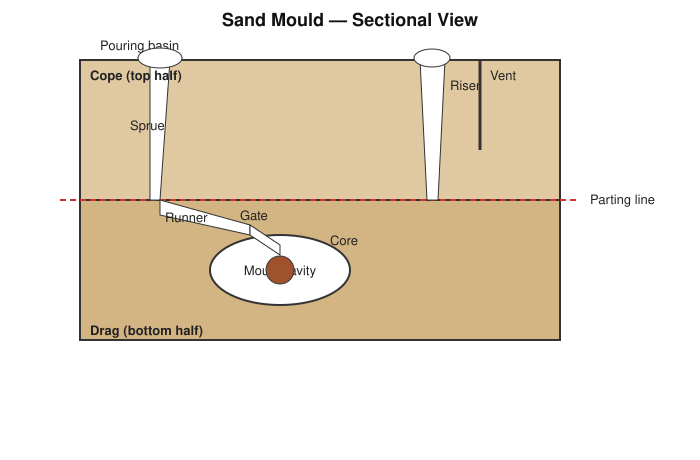

# Practical 06 — Sand Moulds, Core Making, Pattern for Casting, Sand Casting

## Objective

To understand pattern making, sand mould preparation (including cores), and the sand-casting process, and to prepare and (where equipment permits) pour a simple sand-mould casting.

## Tools / Machines / Equipment

**Pattern-making tools:** pattern (wood/metal/plastic replica of the desired casting, allowing for shrinkage, draft, and machining), pattern-maker's rule (shrinkage rule).

**Moulding tools:** moulding flask (cope and drag boxes), moulding sand (green sand — silica sand + clay binder + moisture), riddle (sieve), rammer, trowel, sprue pin, strike-off bar, draw spike, gate cutter, bellows/hand blower, venting wire, core box, core sand.

**Casting equipment:** melting furnace (e.g., crucible/cupola, as available), ladle, pouring basin.

**PPE:** heat-resistant gloves, face shield, apron/protective clothing, safety footwear (molten-metal work only, under supervision).

## Identification

| Term | Meaning |
|---|---|
| Pattern | Replica of the part to be cast, used to form the mould cavity; oversized to allow for shrinkage and, where needed, machining allowance |
| Flask | Rigid frame (cope + drag) that holds the moulding sand |
| Cope | Top half of the flask/mould |
| Drag | Bottom half of the flask/mould |
| Parting line | Plane where the cope and drag separate |
| Mould cavity | Space left after the pattern is withdrawn, into which molten metal is poured |
| Core | Sand shape placed in the mould to form an internal hole/cavity in the casting |
| Sprue | Vertical channel through which molten metal enters the mould |
| Runner | Horizontal channel distributing metal from the sprue to the gate(s) |
| Gate | Opening through which metal enters the mould cavity from the runner |
| Riser | Reservoir of molten metal that feeds the casting as it shrinks during solidification, and allows gases to escape |
| Vent | Small passage allowing gases/steam generated in the mould to escape during pouring |
| Pouring basin | Small reservoir at the top of the sprue that helps control the pour |

## Principle / Working Principle

Sand casting produces a metal component by pouring molten metal into a cavity shaped like the desired part, formed in a mass of bonded sand, and allowing it to solidify. The cavity is created by packing sand around a **pattern** (a shrinkage- and draft-allowance replica of the finished part) and then withdrawing the pattern, leaving the cavity behind. Where the casting requires an internal hole or cavity that the pattern cannot form directly, a separately made sand **core** is placed into the mould before closing it. Metal is introduced through a **gating system** (pouring basin → sprue → runner → gate) designed to fill the cavity smoothly and minimise turbulence, while a **riser** supplies extra molten metal to compensate for shrinkage as the casting cools, and **vents** allow trapped gases to escape.

## Construction / Main Parts

- **Pattern:** made oversize relative to the finished part to allow for (a) metal shrinkage on cooling, and (b) any machining allowance on surfaces that will be machined afterward; also incorporates **draft** (a slight taper) on vertical faces so it can be withdrawn from the sand without damaging the mould.
- **Flask:** two-part rigid frame — cope (top) and drag (bottom) — that contains and supports the rammed sand.
- **Core:** made separately in a core box from core sand (often with a stronger binder than the main moulding sand, since it is more exposed to metal on multiple sides), then placed in the drag before the cope is closed.

## Operation / Working

The basic sand-casting sequence is:

**Pattern preparation → mould making → pattern removal → core placement (if required) → closing the mould → pouring → solidification → shakeout → fettling → inspection**

1. **Pattern preparation:** select/prepare the correct pattern for the part.
2. **Mould making:** ram sand firmly and evenly around the pattern in the drag (and then the cope), forming a compact mould half on each side.
3. **Pattern removal:** carefully withdraw the pattern (using a draw spike, with light rapping to free it) leaving a clean cavity.
4. **Core placement:** if the casting has an internal cavity, position the prepared core in its seat within the drag.
5. **Closing the mould:** assemble the gating system (sprue, runner, gate, riser, vents) and close the cope onto the drag, aligned and clamped/weighted to resist the pressure of the molten metal.
6. **Pouring:** pour molten metal steadily through the pouring basin and sprue until the riser shows metal has filled the cavity.
7. **Solidification:** allow the casting to cool and solidify fully before disturbing the mould.
8. **Shakeout:** break away the sand mould to remove the solidified casting.
9. **Fettling:** remove the sprue, runners, gates, risers, and any fins/flash from the casting.
10. **Inspection:** check the casting for dimensional accuracy and surface/internal defects.

## Procedure

> Pouring molten metal is hazardous — this step must only be performed by, or under the direct close supervision of, a trained instructor using proper furnace/ladle equipment and PPE.

1. Select the pattern and check it for damage, correct shrinkage allowance, and draft.
2. Place the drag half of the flask over the pattern (drag side) on the moulding board and pack riddled (sieved) facing sand around the pattern, then fill and ram the backing sand firmly and evenly; strike off excess sand level with the flask edge.
3. Turn the drag over, dust the parting surface with parting sand, and position the cope half of the pattern (if a split pattern) along with sprue and riser pins.
4. Ram the cope in the same way; cut a pouring basin at the top of the sprue.
5. Carefully separate the cope and drag; withdraw the pattern from each half using a draw spike, with light rapping to loosen it.
6. Cut runners and gates connecting the sprue to the cavity; cut vents as needed.
7. Place the core (if required) into its seat in the drag.
8. Reassemble and clamp/weight the cope onto the drag, correctly aligned.
9. Pour molten metal steadily and continuously until it rises visibly in the riser.
10. Allow the casting to cool and solidify fully.
11. Shake out the casting from the sand, then fettle (remove sprue/runner/riser/flash) and inspect.

## Measurements / Observation

| Item | Specified Dimension | Measured Dimension (on casting) |
|---|---|---|
| Length | | |
| Width | | |
| Height/diameter | | |

`Pouring temperature = ____ °C`
`Time from pouring to shakeout = ____`

## Calculations

**Pattern allowance (dimensional)** — the pattern is made larger than the finished part by the applicable **shrinkage allowance** for the metal being cast (shrinkage rate depends on the metal/alloy — consult the appropriate shrinkage-rule/handbook value for the material in question) plus any specified **machining allowance** on surfaces to be machined.

## Result

State the casting produced, the pattern and moulding materials used, and the outcome of inspection (dimensional accuracy, surface condition, any defects observed).

## Common Defects / Problems

| Defect | Likely Cause |
|---|---|
| Blow holes / porosity | Excess moisture in sand, inadequate venting, gases trapped during pouring |
| Sand inclusion / dirty casting | Loose or friable mould/core sand, insufficient ramming, mould damaged during closing |
| Shrinkage cavity | Riser too small or incorrectly placed, inadequate feeding of the casting during solidification |
| Mismatch / misalignment | Cope and drag not correctly aligned when closed |
| Incomplete casting (misrun/cold shut) | Metal poured too cold, pouring too slow, gating system too restrictive |
| Rough surface / sand burn-on | Sand too coarse, insufficient facing sand, pouring temperature too high |
| Improper/oversized mould cavity | Excessive or uneven ramming pressure, pattern damage, rough pattern withdrawal |

## Safety / Precautions

- Molten metal causes severe burns — pouring is performed only by a trained/supervising person wearing a face shield, heat-resistant gloves, apron, and safety footwear.
- Ensure moulding and core sand are properly dried/of correct moisture content — excess moisture in contact with molten metal can cause violent steam expansion and spattering.
- Keep the pouring and cooling area clear of unnecessary personnel and of any moisture (spilled water, wet floor).
- Never touch a recently poured mould or casting — significant heat remains long after the metal appears solid.
- Handle ladles and crucibles with the correct tongs/handling equipment, never improvised tools.
- Ensure adequate ventilation in the casting area — melting and pouring can generate fumes.
- Keep flammable materials away from the melting/pouring area.
