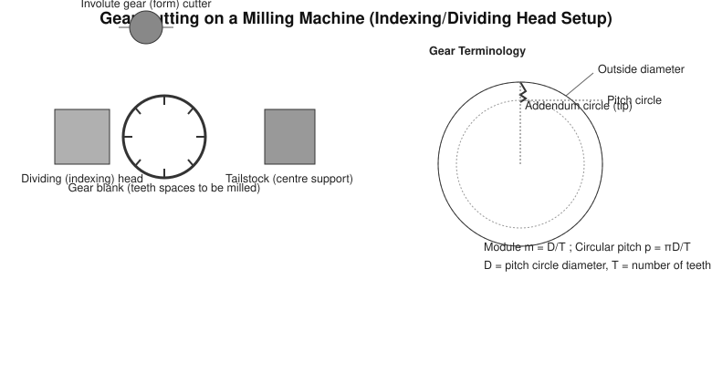
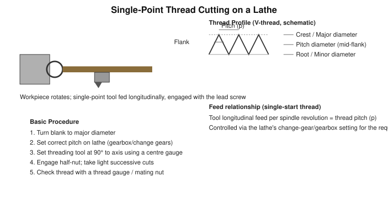

# Practical 07 — Gear Cutting and Thread Cutting

## Objective

To understand the basic workshop setup and procedure for gear cutting on a milling machine (using an indexing/dividing head) and for single-point thread cutting on a lathe.

## Tools / Machines / Equipment

**Gear cutting:** milling machine, dividing (indexing) head with tailstock/footstock, involute gear (form) cutter of the correct module/pitch, gear blank, arbor.

**Thread cutting:** centre lathe with change-gear/gearbox for feed selection, single-point threading tool, centre gauge (for setting tool angle and checking thread form), thread pitch gauge, thread ring/plug gauge or a mating nut/bolt for checking.

**Measuring:** Vernier caliper, centre gauge, thread pitch gauge.

**PPE:** safety goggles, close-fitting clothing (no loose sleeves near the rotating spindle/blank), safety footwear.

## Identification

| Item | Main Purpose |
|---|---|
| Dividing/indexing head | Rotates the gear blank through precise equal angular divisions between cuts, so that equally spaced teeth are cut around the blank |
| Involute gear cutter | Multi-tooth form cutter that mills the tooth space of the specified module/pitch and number of teeth |
| Threading tool | Single-point tool ground to the required thread angle (e.g., 60° for ISO metric), used to cut the helical thread groove |
| Centre gauge | Used to set the threading tool square to the work axis and to check the tool's included angle |

## Principle / Working Principle

### Gear Cutting

A gear tooth space is milled using a shaped (involute-form) rotating cutter matched to the gear's **module** (or diametral pitch) and, for form cutters, approximately matched to the number of teeth. The gear blank is mounted between the dividing head and a tailstock/footstock centre. After each tooth space is milled, the dividing head rotates the blank through an equal angular division — determined by the required number of teeth — before the next space is cut, so that all teeth end up equally spaced around the blank.

Key terms:

- **Module (m)** = pitch circle diameter (D) ÷ number of teeth (T)
- **Circular pitch (p)** = π × D ÷ T (arc distance from one tooth to the corresponding point on the next tooth, measured on the pitch circle)
- **Pitch circle** — the theoretical circle on which module/pitch calculations are based, and on which two mating gears effectively roll against each other
- **Number of teeth (T)** — total tooth count around the gear

### Thread Cutting

Single-point thread cutting generates a helical groove of a specified profile on a rotating workpiece by feeding a single-point tool longitudinally, synchronised with the workpiece rotation through the lathe's lead screw so that the tool advances by exactly **one thread pitch per revolution** of the work (for a single-start thread). The required pitch is set on the lathe via its change-gear train or feed gearbox; the tool is ground and set to the correct thread angle (checked with a centre gauge) and set exactly at 90° to the work axis to produce a correctly formed thread.

Key thread-profile terms: **pitch** (axial distance from one thread crest to the corresponding point on the next), **major diameter** (diameter at the crest, for an external thread), **minor diameter** (diameter at the root), **pitch diameter** (diameter at the mid-point of the flank, where thread thickness equals the space between threads), **flank**, **crest**, **root**, and, for some thread forms, **helix angle**.

## Construction / Main Parts

- **Dividing head:** worm-and-worm-wheel mechanism driven by an index crank and index plate, allowing precise fractional rotation of the workpiece spindle; used with a tailstock/footstock to support the far end of the blank.
- **Lathe threading setup:** headstock spindle (drives the work) connected through the change-gear train/gearbox to the lead screw, which drives the carriage at the exact rate required for the selected pitch; half-nut engages/disengages the carriage from the lead screw.

## Operation / Working

**Gear cutting:** the gear blank rotates only between cuts (it is stationary during each milling pass); the cutter rotates continuously and removes one tooth space per pass as the table feeds it across the blank width; the dividing head indexes the blank by 1/T of a full revolution before the next pass.

**Thread cutting:** the workpiece rotates continuously; the carriage (with the threading tool) is fed longitudinally at a rate locked to the spindle rotation via the lead screw, so successive passes retrace the same helical path, each pass cutting slightly deeper until the full thread depth is reached.

## Procedure

### Gear Cutting

1. Mount the gear blank between the dividing head and tailstock centre; check it runs true.
2. Select and mount the gear cutter of the correct module and (where a form-cutter set is used) the correct cutter number for the tooth count.
3. Calculate the required indexing movement for the given number of teeth on the dividing head.
4. Set the cutting depth for a full tooth depth (may be taken in more than one pass).
5. Mill the first tooth space; withdraw the table, return to start position.
6. Index the blank through the calculated division using the dividing head.
7. Repeat milling and indexing until all tooth spaces are cut.
8. Check tooth spacing and profile; deburr the gear.

### Thread Cutting

1. Turn the blank to the correct major diameter for the thread required.
2. Set the lathe's change-gear/gearbox to the required thread pitch.
3. Grind/select and mount a threading tool of the correct profile; set it exactly at 90° to the work axis using a centre gauge, at centre height.
4. Mark a safe run-out groove (undercut) at the thread's end if specified.
5. Set the compound slide angle (commonly half the thread angle) if angular infeed is used.
6. Take a light trial cut; check the pitch with a pitch gauge before continuing.
7. Engage the half-nut at the correct point each pass (using the thread-chasing dial where fitted) and take successive light cuts, increasing depth each pass, until full thread depth is reached.
8. Check the finished thread with a thread gauge or a mating nut/bolt.

## Measurements / Observation

**Gear cutting:**

| Parameter | Value |
|---|---|
| Number of teeth (T) | |
| Module (m) or diametral pitch | |
| Pitch circle diameter (D) | |
| Indexing movement used | |

**Thread cutting:**

| Trial | Pitch Set | Major Diameter (measured) | Thread Check (gauge/nut fit) |
|---|---|---|---|
| 1 | | | |
| 2 | | | |

## Calculations

**Gear cutting:**

- Module: m = D / T
- Circular pitch: p = π D / T
- Indexing (simple indexing on a 40:1 dividing head, as a common example): Index crank turns = 40 / T

**Thread cutting:**

- Longitudinal feed per revolution of work = thread pitch (for a single-start thread)
- Lead (single-start thread) = pitch; Lead (multi-start thread) = pitch × number of starts

> Dividing-head worm ratio, cutter selection tables, and lathe change-gear values vary by machine — use the values applicable to the specific dividing head/lathe and gear/thread specification being cut.

## Result

State the gear (number of teeth, module) or thread (pitch, diameter, class) produced, and the outcome of checking (tooth spacing/profile, or thread fit).

## Common Defects / Problems

| Operation | Defect | Likely Cause |
|---|---|---|
| Gear cutting | Unequal tooth spacing | Indexing error, backlash in the dividing head, blank not properly seated |
| Gear cutting | Incorrect tooth profile/depth | Wrong cutter number for the tooth count, incorrect cutting depth |
| Thread cutting | Torn or rough thread | Tool not sharp, wrong tool angle, excessive depth per pass |
| Thread cutting | Incorrect pitch | Wrong gearbox/change-gear setting |
| Thread cutting | Tapered or oversize thread | Tool not set at exact centre height or 90° to axis, tailstock misalignment |
| Thread cutting | Crossed threads on re-engagement | Half-nut/thread-chasing dial not used correctly between passes |

## Safety / Precautions

- Keep hands well clear of the rotating gear blank and cutter, and of the rotating lathe chuck/workpiece during threading — entanglement and cutting hazards.
- Never attempt to check thread fit or measure the work while the machine is running; stop the machine first.
- Ensure the gear blank and lathe workpiece are securely and correctly mounted before starting — an insecurely held blank can be thrown from the machine.
- Take light trial cuts before committing to full-depth cuts, and check calculations (indexing movement, pitch setting) before cutting.
- Wear safety goggles — milling and thread-chasing produce sharp chips.
- Keep loose clothing and sleeves away from the dividing head crank and lathe change gears.
