# Engineering Materials — Exam Solutions (2015–2024)

BUTEX-style exam-hall answers to every question in the attached papers, organised
year-wise (newest first), with the same figures reused for repeated questions.

> [!NOTE]
> Many questions recur almost verbatim across years. Each is answered in **full** the
> first time it appears; later occurrences link back and add only what differs. See the
> [Repeated Questions Index](#repeated-questions-index).

## Table of Contents

- [Quick Reference](#quick-reference)
- [Repeated Questions Index](#repeated-questions-index)
- [2024 Examination](#2024-examination)
- [2023 Examination](#2023-examination)
- [2022 Examination](#2022-examination)
- [2021 Examination](#2021-examination)
- [2020 Examination](#2020-examination)
- [2019 Examination](#2019-examination)
- [2018 Examination](#2018-examination)
- [2017 Examination](#2017-examination)
- [2016 Examination](#2016-examination)
- [2015 Examination](#2015-examination)
- [Notes on the Question Paper](#notes-on-the-question-paper)
- [Self-Check Summary](#self-check-summary)
- [Assets](#assets)

---

## Quick Reference

### Formula sheet

| Quantity | Formula |
|---|---|
| Atomic Packing Factor | $APF = \dfrac{\text{volume of atoms in cell}}{\text{volume of unit cell}}$ |
| SC | $a=2R$, 1 atom/cell, $APF=\pi/6\approx0.52$ |
| BCC | $a=4R/\sqrt3$, 2 atoms/cell, $APF=\sqrt3\pi/8\approx0.68$ |
| FCC | $a=4R/\sqrt2$, 4 atoms/cell, $APF=\pi/(3\sqrt2)\approx0.74$ |
| Theoretical density | $\rho = \dfrac{nA}{V_c N_A}$, $N_A=6.022\times10^{23}\,\text{mol}^{-1}$ |
| Engineering stress | $\sigma = P/A_0$ |
| Engineering strain | $\varepsilon=\delta/L_0$ |
| Hooke's law | $\sigma = E\varepsilon$ |
| Elongation | $\delta = PL/(AE)$ |
| Shear punching force | $F=\tau\cdot \pi d\cdot t$ |
| Hollow-shaft area | $A=\dfrac{\pi}{4}(D_o^2-D_i^2)$ |
| Brinell hardness | $BHN=\dfrac{2P}{\pi D(D-\sqrt{D^2-d^2})}$ |

### Fe–Fe₃C key data

| Reaction / point | Temperature | Composition (wt % C) |
|---|---|---|
| δ→γ+L peritectic | 1493 °C | δ 0.09, γ 0.17, L 0.53 |
| Melting point of pure Fe | 1538 °C | 0 |
| α↔γ (A3, pure Fe) | 912 °C | 0 |
| γ↔δ (A4, pure Fe) | 1394 °C | 0 |
| Curie point | 768 °C | 0 |
| Eutectic (γ+Fe₃C, ledeburite) | 1147 °C | 4.30 |
| Eutectoid (α+Fe₃C, pearlite) | 727 °C | 0.76 |
| Max C solubility in austenite | 1147 °C | 2.14 |
| Cementite (Fe₃C) | — | 6.67 (used here) |

*Fig. QR-1 — Fe–Fe₃C diagram: note the peritectic (1493 °C), eutectic (1147 °C, 4.3 %C)
and eutectoid (727 °C, 0.76 %C) reactions.*

### Hardness-test comparison

| Test | Indenter | Load | Result | Best for |
|---|---|---|---|---|
| Brinell | 10 mm steel/carbide ball | 500–3000 kgf | BHN = 2P/[πD(D−√(D²−d²))] | Soft/medium metals, castings |
| Rockwell | Diamond cone (C) or steel ball (B) | Minor 10 kgf + major (60/100/150 kgf) | Direct dial reading, HRB/HRC | Quick production testing |
| Vickers | Diamond pyramid (136°) | 1–120 kgf | VHN = 1.854P/d² | Thin sections, all hardness ranges |

*Fig. QR-2 — Indentation hardness testing principle.*

---

## Repeated Questions Index

Canonical topic → first full answer. Later occurrences say "Same as `<link>`" and list
only the delta.

| Topic | First full answer |
|---|---|
| Ductility / fatigue / resilience / toughness / brittleness definitions | [2024 Q2(a)](#q2a-2024-define-ductility-fatigue-and-resilience) |
| S-N curves | [2024 Q2(b)](#q2b-2024-s-n-curves-in-fatigue-test) |
| Creep & creep curve | [2024 Q2(c)](#q2c-2024-creep-and-the-creep-curve) |
| Oxidation vs corrosion | [2024 Q3(a)](#q3a-2024-oxidation-vs-corrosion) |
| Plain carbon steel & mechanical properties | [2024 Q3(b)](#q3b-2024-plain-carbon-steel-and-mechanical-properties) |
| Corrosion classification & prevention | [2024 Q3(c)](#q3c-2024-classification-of-corrosion-and-prevention) |
| Mild steel | [2024 Q4(a)](#q4a-2024-mild-steel) |
| Brinell hardness test | [2024 Q4(b)](#q4b-2024-brinell-hardness-test-procedure) |
| Alloying-element effects (Ni, Si, Ti, Cr, ...) | [2024 Q4(c)](#q4c-2024-effects-of-alloying-elements) |
| Heat treatment: definition & purposes | [2024 Q5(a)](#q5a-2024-heat-treatment-definition-and-purposes) |
| Quenching & quenching media | [2024 Q5(b)](#q5b-2024-quenching-and-quenching-media) |
| Cast-iron manufacture | [2024 Q5(c)](#q5c-2024-manufacture-of-cast-iron) |
| Ceramic drying & firing | [2024 Q6(a)](#q6a-2024-drying-and-firing-of-ceramics) |
| Frenkel & Schottky defects | [2024 Q6(b)](#q6b-2024-frenkel-and-schottky-defects) |
| Lubricants | [2024 Q6(c)](#q6c-2024-functions-and-properties-of-lubricants) |
| Glass transition & glass composition/structure | [2024 Q7(a)](#q7a-2024-glass-transition-temperature-composition-and-structure-of-glass) |
| Industrial glass properties | [2024 Q7(b)](#q7b-2024-thermal-and-mechanical-properties-of-industrial-glass) |
| Glass forming methods | [2024 Q7(c)](#q7c-2024-glass-forming-methods) |
| Composite material & hybrid composites | [2024 Q8(a)](#q8a-2024-composite-material-and-hybrid-composites) |
| Pultrusion | [2024 Q8(b)](#q8b-2024-pultrusion-process) |
| Crystalline vs amorphous solids | [2023 Q1(a)](#q1a-2023-crystalline-vs-amorphous-solids) |
| APF of FCC (incl. Cu) | [2023 Q1(b)](#q1b-2023-apf-of-cu-fcc) |
| Theoretical density numericals | [2023 Q1(c)](#q1c-2023-theoretical-density-of-cr) |
| {111} family of planes | [2023 Q1(d)](#q1d-2023-family-of-111-planes) |
| Purpose of alloying steel | [2023 Q2(a)](#q2a-2023-purpose-of-alloying-steel) |
| BCC structure & atoms/cell | [2023 Q2(b)](#q2b-2023-bcc-structure-and-atoms-per-cell) |
| Effect of impurities on cast iron | [2023 Q3(a)](#q3a-2023-effect-of-impurities-on-cast-iron) |
| Fe–Fe₃C diagram | [2023 Q3(b)](#q3b-2023-fe-fe3c-equilibrium-diagram) |
| Fracture: ductile vs brittle | [2023 Q4(a)](#q4a-2023-fracture-ductile-vs-brittle) |
| Composite material & advantages | [2023 Q5(a)](#q5a-2023-composite-material-and-advantages) |
| Structural composite types | [2023 Q5(b)](#q5b-2023-types-of-structural-composites) |
| Sheet composite manufacture | [2023 Q5(c)](#q5c-2023-manufacture-of-sheet-composite-material) |
| Thermoset vs thermoplastic strength | [2023 Q6(a)](#q6a-2023-why-thermosets-are-stronger-than-thermoplastics) |
| Dry vs wet corrosion | [2023 Q6(b)](#q6b-2023-dry-vs-wet-corrosion) |
| Plastics & 4 thermoplastics | [2023 Q6(c)](#q6c-2023-plastic-and-four-thermoplastic-compounds) |
| Annealing | [2023 Q7(a)](#q7a-2023-annealing-and-its-purposes) |
| Wrought iron | [2023 Q7(b)](#q7b-2023-wrought-iron-and-its-manufacture) |
| Microstructure evolution of 0.20 %C steel | [2023 Q7(c)](#q7c-2023-microstructure-changes-on-slow-cooling-of-020-c-steel) |
| Ceramic properties & classification | [2023 Q8(a)](#q8a-2023-properties-and-classification-of-ceramics) |
| Purpose of testing materials | [2023 Q8(b)](#q8b-2023-purposes-of-testing-materials) |
| Three hardness tests | [2023 Q8(c)](#q8c-2023-three-hardness-tests) |
| Stress-strain curve of mild steel | [2022 Q1(a)](#q1a-2022-stress-strain-curve-of-mild-steel) |
| Crystal structure & crystal defects (general) | [2022 Q2(a)](#q2a-2022-crystal-structure-and-crystal-defects) |
| Galvanizing vs tinning | [2022 Q4(b)](#q4b-2022-galvanizing-vs-tinning) |
| Rockwell hardness test | [2022 Q5(b)](#q5b-2022-rockwell-hardness-test) |
| Alloy steel types (Cr-Ni, Mn steel) | [2022 Q5(c)](#q5c-2022-chromium-nickel-steel-and-manganese-steel) |
| Types of glass | [2022 Q6(a)](#q6a-2022-glass-transition-and-types-of-glass) |
| Hardening | [2022 Q8(c)](#q8c-2022-hardening-definition-and-process) |
| Classification of engineering materials | [2021 Q1(b)](#q1b-2021-classification-of-engineering-materials) |
| Smart materials essay | [2021 Q1(c)](#q1c-2021-smart-materials-are-the-future-of-mankind) |
| Season cracking | [2021 Q2(b)](#q2b-2021-season-cracking) |
| Alloying definition & steel classification by carbon | [2021 Q2(c)](#q2c-2021-alloying-and-classification-of-steel-by-carbon-content) |
| DBTT & Titanic | [2021 Q3(b)](#q3b-2021-dbtt-and-the-titanic) |
| Tool steel | [2021 Q3(c)](#q3c-2021-wrought-iron-and-tool-steel) |
| Thermoplastic vs thermosetting (short note) | [2021 Q6(c)](#q6c-2021-thermoplastic-vs-thermosetting-polymer) |
| Injection molding | [2021 Q8(a)](#q8a-2021-polymer-and-injection-molding) |
| Laminar composites | [2021 Q8(c)](#q8c-2021-laminar-composites) |
| BCC vs FCC stability | [2020 Q1(c)](#q1c-2020-bcc-vs-fcc-stability) |
| Mechanical properties (list) | [2020 Q2(a)](#q2a-2020-mechanical-properties-of-materials) |
| ASTM / AISI / SAE | [2020 Q2(d)](#q2d-2020-astm-aisi-sae) |
| High-carbon steel | [2020 Q4(c)](#q4c-2020-plain-carbon-and-high-carbon-steel) |
| Polymerization | [2020 Q6(b)](#q6b-2020-polymerization-thermoplastic-vs-thermosetting) |
| Extrusion molding | [2020 Q6(c)](#q6c-2020-extrusion-molding) |
| Classify engineering materials (short) | [2019 Q1](#q1-2019-classification-of-engineering-materials) |
| Normalizing | [2019 Q4](#q4-2019-purposes-of-annealing-and-normalizing) |
| APF of SC — proof | [2019 Q6](#q6-2019-unit-cell-and-apf-of-sc--052) |
| Blast furnace reactions | [2018 Q2(b)](#q2b-2018-blast-furnace-reactions) |
| Force-extension ductile/brittle curve | [2018 Q8(b)](#q8b-2018-force-extension-curve-ductile-vs-brittle) |
| Stiffness & strength | [2017 Q2(a)](#q2a-2017-stiffness-and-strength) |
| Carbides | [2017 Q4(b)](#q4b-2017-useful-carbides) |
| Aluminium manufacture (Bayer + Hall-Héroult) | [2017 Q4(c)](#q4c-2017-manufacture-of-aluminium-from-bauxite) |
| High-speed steel | [2017 Q5(a)](#q5a-2017-mild-steel-and-high-speed-steel) |
| Cast-iron types | [2017 Q5(b)](#q5b-2017-types-of-cast-iron) |
| Phase diagram: definition & importance | [2017 Q5(c)](#q5c-2017-phase-diagram-definition-and-importance) |
| Polymers & copolymers | [2017 Q6(a)](#q6a-2017-properties-of-polymers-and-copolymers) |
| Composite fabrication advantages/disadvantages | [2017 Q6(c)](#q6c-2017-advantages-and-disadvantages-of-composite-fabrication) |
| Brass vs bronze | [2017 Q7(b)](#q7b-2017-brass-vs-bronze) |
| Factors affecting cast-iron structure | [2017 Q8(b)](#q8b-2017-factors-affecting-the-structure-of-cast-iron) |
| Nickel & magnesium applications | [2017 Q8(c)](#q8c-2017-applications-of-nickel-and-magnesium) |
| Hooke's law | [2016 Q2(a)](#q2a-2016-hookes-law) |
| Stainless steel vs high-speed steel | [2016 Q2(c)](#q2c-2016-stainless-steel-vs-high-speed-steel) |
| Aluminium characteristics & applications | [2016 Q2(d)](#q2d-2016-characteristics-and-applications-of-aluminium) |
| Galvanic corrosion | [2016 Q3(c)](#q3c-2016-galvanic-corrosion) |
| Elastomer | [2016 Q6(a)](#q6a-2016-elastomer) |
| Natural-rubber manufacture | [2016 Q6(b)](#q6b-2016-manufacture-of-natural-rubber) |
| Galvanizing vs vulcanizing | [2016 Q6(c)](#q6c-2016-galvanizing-vs-vulcanizing) |
| 7 crystal systems | [2015 Q1(b)](#q1b-2015-seven-crystal-systems) |
| Ferrous / non-ferrous / pure metal | [2015 Q2(a)](#q2a-2015-ferrous-non-ferrous-and-pure-metals) |
| Corrosion vs erosion | [2015 Q3(a)](#q3a-2015-corrosion-vs-erosion) |
| Stainless-steel composition & application | [2015 Q4(c)](#q4c-2015-stainless-steel-composition-and-application) |

---

## 2024 Examination

### Part A

#### Q1(a) [2024] Cast iron; nodular & malleable cast iron

**Cast iron** is a Fe–C alloy with 2–4.3 % C (above the max solubility of C in
austenite), plus 1–3 % Si, cast into its final shape rather than worked.

| Type | Structure | Key properties |
|---|---|---|
| Nodular (ductile) CI | Graphite as spheroids (Mg/Ce treated) | Good ductility (10–20 % elongation), high strength, shock resistant |
| Malleable CI | Graphite as irregular rosettes (from annealed white CI) | Ductile, machinable, good impact strength, used for pipe fittings, brackets |

#### Q1(b) [2024] APF of BCC

**Atomic packing factor (APF)** = fraction of unit-cell volume occupied by atoms
$= \dfrac{n\cdot\frac43\pi R^3}{a^3}$.

For BCC: $n=2$, and atoms touch along the body diagonal, so $4R=\sqrt3\,a \Rightarrow a=\dfrac{4R}{\sqrt3}$.

$$APF=\frac{2\cdot\frac43\pi R^3}{\left(\frac{4R}{\sqrt3}\right)^3}=\frac{\frac83\pi R^3}{\frac{64R^3}{3\sqrt3}}=\frac{\sqrt3\,\pi}{8}\approx 0.68$$

*Fig. 2024-1b — BCC has a body-centre atom in addition to 8 corner atoms.*

#### Q1(c) [2024] Punching-force numerical

**Given:** hole dia. $d=20$ mm, plate thickness $t=25$ mm, shear strength $\tau=350$ MN/m².
**Formula:** $F=\tau\cdot(\pi d)\cdot t$ (shear area = sheared cylindrical surface)
**Substitution:** $F = 350\times10^6 \times \pi(0.020)(0.025)$
$$F = 350\times10^6 \times 1.5708\times10^{-3} = 5.497\times10^5\ \text{N}$$
**Answer:** $F \approx 5.50\times10^5\ \text{N} \approx 550\ \text{kN}$

#### Q2(a) [2024] Define ductility, fatigue and resilience

- **Ductility** — ability of a material to undergo large plastic (permanent)
  deformation, typically in tension, before fracture; measured by % elongation or %
  reduction in area.
- **Fatigue** — progressive, localised structural damage under repeated/cyclic
  stresses, well below the material's static UTS, leading to eventual fracture.
- **Resilience** — capacity of a material to absorb energy elastically and release it
  on unloading; modulus of resilience $U_r=\sigma_y^2/2E$.
- *(related terms used elsewhere in these papers)* **Toughness** — energy absorbed up
  to fracture (area under the stress-strain curve). **Brittleness** — tendency to
  fracture with little/no plastic deformation.

#### Q2(b) [2024] S-N curves in fatigue test

An S-N curve plots cyclic stress amplitude $S$ against number of cycles to failure $N$
(log scale). Two families are obtained:

*Fig. 2024-2b — Ferrous alloys show a flat endurance-limit plateau below which fatigue
life is (in theory) infinite; non-ferrous alloys (Al, Cu, Mg) keep sloping down, so a
fatigue strength at a fixed life (e.g. 10⁸ cycles) is quoted instead.*

#### Q2(c) [2024] Creep and the creep curve

**Creep** is the slow, time-dependent plastic deformation of a material under
constant stress (usually at $T>0.4T_m$).

*Fig. 2024-2c — Three stages:*
1. **Primary (I):** decreasing creep rate — strain hardening dominates.
2. **Secondary/steady-state (II):** constant, minimum creep rate — hardening balances
   recovery; used for design life estimates.
3. **Tertiary (III):** accelerating rate — necking/void growth — ends in rupture.

#### Q3(a) [2024] Oxidation vs corrosion

| Aspect | Oxidation | Corrosion |
|---|---|---|
| Definition | Reaction of a metal with oxygen forming an oxide layer | Broader electrochemical/chemical degradation of a metal in its environment |
| Medium | Usually dry, high-temperature gas | Usually wet/aqueous or electrolytic |
| Mechanism | Direct chemical combination | Electrochemical (anode/cathode cells) or chemical attack |
| Example | Scaling of steel at high T | Rusting of iron in moist air, galvanic attack |

*(Oxidation is one specific mechanism; corrosion is the general degradation process,
which may include oxidation.)*

#### Q3(b) [2024] Plain carbon steel and mechanical properties

**Plain carbon steel** = Fe–C alloy with C up to ~2.0 % and only residual Mn, Si, S, P
(no deliberate alloying elements).

Typical mechanical properties of engineering materials to report/compare:
Ultimate tensile strength (UTS), yield strength, % elongation, % reduction of area,
hardness, impact (toughness) energy, fatigue/endurance limit, modulus of elasticity
(stiffness), ductility, malleability, resilience, creep resistance.

#### Q3(c) [2024] Classification of corrosion and prevention

**Classification:**
- By mechanism: chemical (dry) corrosion, electrochemical (wet) corrosion.
- By form: uniform, pitting, galvanic, crevice, intergranular, stress-corrosion
  cracking, erosion corrosion, selective leaching.

**Prevention methods** (several can be applied):
1. Protective coatings (paint, galvanizing, electroplating).
2. Cathodic protection (sacrificial anode or impressed current).
3. Use of corrosion-resistant alloys (stainless steel).
4. Inhibitors added to the environment.
5. Proper design (avoid crevices, drainage, dissimilar-metal contact).
6. Controlling the environment (dehumidifying, deaerating).

#### Q4(a) [2024] Mild steel

**Mild steel** is low-carbon steel with **0.05–0.25 % C** (structural grades often
0.15–0.25 %). *Typical* mechanical property ranges:

| Property | Typical range |
|---|---|
| Yield strength | 220–300 MPa |
| UTS | 400–550 MPa |
| % Elongation | 20–30 % |
| Hardness | 110–150 BHN |

Good weldability and ductility, moderate strength; used for structural sections,
plates, general fabrication.

#### Q4(b) [2024] Brinell hardness test procedure

*Fig. 2024-4b*

1. Press a hardened steel/tungsten-carbide ball (dia. $D$, commonly 10 mm) into the
   flat, polished specimen surface under a fixed load $P$ (500–3000 kgf) for a
   standard dwell time (10–15 s).
2. Remove the load; measure the indentation diameter $d$ with a microscope
   (average of two perpendicular readings).
3. Compute $BHN = \dfrac{2P}{\pi D(D-\sqrt{D^2-d^2})}$.
4. Select $P$ so that $d/D$ lies between 0.24–0.6 for a valid reading.

#### Q4(c) [2024] Effects of alloying elements

| Element | Principal effects |
|---|---|
| Nickel (Ni) | Raises toughness & impact strength at low T, increases hardenability, stabilises austenite |
| Silicon (Si) | Deoxidiser, raises strength & elastic limit, improves magnetic permeability (electrical steels) |
| Titanium (Ti) | Strong carbide/nitride former, grain refiner, stabilises against intergranular corrosion (stainless steels) |
| Chromium (Cr) | Increases hardness, wear & corrosion resistance, forms hard carbides, key element of stainless steel |

### Part B

#### Q5(a) [2024] Heat treatment: definition and purposes

**Heat treatment** = controlled heating and cooling of a metal/alloy in the solid
state to alter its microstructure and hence its mechanical/physical properties,
without changing shape.

**Purposes:** relieve internal stresses, refine grain size, increase/decrease
hardness, improve ductility & machinability, increase strength & toughness, improve
wear resistance, restore properties after cold work.

#### Q5(b) [2024] Quenching and quenching media

**Quenching** = rapid cooling from the austenitising temperature to obtain a hard
(often martensitic) structure by suppressing diffusion-controlled transformations.

*Fig. 2024-5b — cooling passes through a vapour-blanket, boiling and convection stage
(see [Q7(c) 2021](#q7c-2021-quenching-mechanism)).*

**Quenching media** (increasing severity): air → oil → water → brine (salt water) →
polymer solutions (intermediate rates).

#### Q5(c) [2024] Manufacture of cast iron

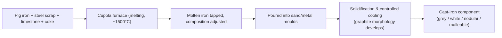
Key steps: (1) charge pig iron, scrap, coke, limestone into the cupola; (2) melt and
refine (adjust C, Si); (3) tap and, for nodular iron, treat with Mg/Ce; (4) pour into
moulds; (5) control cooling rate (fast → white CI, slow → grey CI); (6) for malleable
CI, anneal white-iron castings afterward.

#### Q6(a) [2024] Drying and firing of ceramics

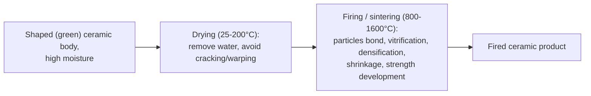
- **Drying** removes physically-held water slowly (to avoid cracking from
  non-uniform shrinkage); dried body is still weak ("green" or "bone-dry").
- **Firing** heats to high temperature so particles bond by solid-state diffusion or
  partial melting (vitrification), giving final strength, hardness and reduced
  porosity.

#### Q6(b) [2024] Frenkel and Schottky defects

*Fig. 2024-6b*

- **Schottky defect** — a *pair* of vacancies (one cation + one anion) leave the
  lattice to maintain charge neutrality; lowers density; common in ionic ceramics
  with similarly-sized ions (e.g. NaCl, MgO).
- **Frenkel defect** — a small cation leaves its normal site and lodges in an
  interstitial site, leaving a vacancy behind; density essentially unchanged; common
  where cation ≪ anion in size (e.g. AgBr, ZnS).

#### Q6(c) [2024] Functions and properties of lubricants

**Functions:** reduce friction between moving surfaces, reduce wear, dissipate heat,
prevent corrosion/rusting, seal against contaminants, flush away debris.

**Desirable properties:** proper viscosity (and viscosity index — stable with
temperature), good oxidation & thermal stability, low pour point, high flash point,
good film strength/lubricity, chemical inertness (non-corrosive), low volatility.

#### Q7(a) [2024] Glass transition temperature, composition and structure of glass

**Glass transition temperature ($T_g$)** — the temperature range over which an
amorphous solid changes from a hard, brittle "glassy" state to a viscous,
rubbery/liquid state on heating (a gradual change in slope of specific volume vs. T,
not a sharp melting point).

*Fig. 2024-7a — glass (blue) has no discontinuity at $T_g$, unlike the sharp volume
drop of a crystalline solid (green) at $T_m$.*

**Composition:** mainly SiO₂ (network former, ~70–74 % in soda-lime glass) + Na₂O
(network modifier, lowers melting point) + CaO (stabiliser) [+ B₂O₃, Al₂O₃, PbO in
special glasses].

**Structure:** a random, continuous 3-D network of SiO₄ tetrahedra (short-range order
only, no long-range periodicity) — an amorphous/non-crystalline solid.

#### Q7(b) [2024] Thermal and mechanical properties of industrial glass

- **Thermal:** low thermal conductivity, low coefficient of thermal expansion (esp.
  borosilicate — good thermal-shock resistance), softens gradually over a range
  rather than a sharp melting point, transparent to visible light, poor thermal-shock
  resistance in ordinary soda-lime glass.
- **Mechanical:** high compressive strength, very low tensile strength, brittle (no
  plastic deformation), high hardness, notch/flaw sensitive (strength controlled by
  surface defects, per Griffith theory), essentially perfectly elastic until
  fracture.

#### Q7(c) [2024] Glass forming methods

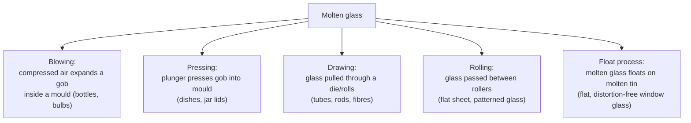
Each route is chosen by product shape: hollow ware → blowing; solid shapes →
pressing; continuous sections → drawing/rolling; flat sheet → float process.

#### Q8(a) [2024] Composite material and hybrid composites

**Composite material** — a macroscopic combination of two or more distinct
materials (matrix + reinforcement) with an identifiable interface, engineered to
give a combination of properties neither constituent has alone.

**Hybrid composite** = contains **two or more types of reinforcement** (e.g. glass +
carbon fibre) in one matrix.

**Characteristics of hybrid composites:**
- Properties can be "tuned" between those of the constituent fibres (e.g. glass
  cost + carbon stiffness).
- Improved balance of strength, stiffness, impact resistance and cost vs. a
  single-fibre composite.
- More complex design/manufacture; possible galvanic issues (carbon + metal).

#### Q8(b) [2024] Pultrusion process

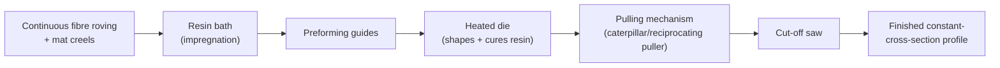
Continuous fibres are pulled (not pushed) through a resin bath, then through a
heated, shaped die where curing occurs; a puller provides constant tension/speed; the
cured profile is cut to length. Produces constant-cross-section structural shapes
(rods, channels, ladder rails) economically and continuously.

#### Q8(c) [2024] Hollow cylinder stress and deformation — numerical

**Given:** $L=2$ m, $D_o=60$ mm, $D_i=40$ mm, load $P=35$ kN, $E=250$ GPa.

**Area:** $A=\dfrac{\pi}{4}(D_o^2-D_i^2)=\dfrac{\pi}{4}(0.060^2-0.040^2)=\dfrac{\pi}{4}(0.0036-0.0016)=\dfrac{\pi}{4}(0.0020)$
$$A = 1.5708\times10^{-3}\ \text{m}^2$$

**Stress:** $\sigma = P/A = \dfrac{35\times10^3}{1.5708\times10^{-3}} = 2.228\times10^7\ \text{Pa}$
$$\sigma \approx 22.3\ \text{MPa}$$

**Deformation:** $\delta = \dfrac{PL}{AE} = \dfrac{35\times10^3\times2}{1.5708\times10^{-3}\times250\times10^9}$
$$\delta = \frac{70000}{3.927\times10^{8}} = 1.78\times10^{-4}\ \text{m} \approx 0.178\ \text{mm}$$

**Answer:** $\sigma\approx22.3$ MPa, $\delta\approx0.178$ mm (elongation).

---

## 2023 Examination

### Part A

#### Q1(a) [2023] Crystalline vs amorphous solids

| Aspect | Crystalline solid | Amorphous solid |
|---|---|---|
| Atomic order | Long-range, periodic (3-D repeating lattice) | Only short-range order |
| Melting | Sharp melting point | Softens over a range ($T_g$) |
| Anisotropy | Often anisotropic | Usually isotropic |
| Examples | Metals, salts, diamond | Glass, many polymers |

#### Q1(b) [2023] APF of Cu (FCC)

Cu has an **FCC** structure: $n=4$ atoms/cell; atoms touch along the face diagonal,
$4R=\sqrt2\,a \Rightarrow a=\dfrac{4R}{\sqrt2}$.

$$APF=\frac{4\cdot\frac43\pi R^3}{\left(\frac{4R}{\sqrt2}\right)^3}=\frac{\pi}{3\sqrt2}\approx0.74$$

This value (0.74) is the same for any FCC metal, including Cu. See
[Fig. 2024-1b](#q1b-2024-apf-of-bcc) for the unit-cell picture.

#### Q1(c) [2023] Theoretical density of Cr — numerical

**Given:** Cr is BCC, atomic radius $R=0.125$ nm, atomic weight $A=52.00$ g/mol
(value stated as used).

**Lattice parameter:** $a=\dfrac{4R}{\sqrt3}=\dfrac{4(0.125)}{1.732}=0.2887\ \text{nm}=2.887\times10^{-8}\ \text{cm}$

**Volume:** $V_c=a^3=(2.887\times10^{-8})^3=2.406\times10^{-23}\ \text{cm}^3$

**Density:** $\rho=\dfrac{nA}{V_cN_A}=\dfrac{2\times52.00}{2.406\times10^{-23}\times6.022\times10^{23}}$
$$\rho=\frac{104.0}{14.49}=7.18\ \text{g/cm}^3$$

**Answer:** $\rho\approx7.18$ g/cm³ *(this numerical repeats identically as
[2018 Q1(c)](#q1c-2018-theoretical-density-of-cr-numerical))*.

#### Q1(d) [2023] Family of {111} planes

*Fig. 2023-1d — the (111) plane intercepts all three axes at 1 lattice parameter.*

The **{111} family** includes all planes crystallographically equivalent to (111) by
symmetry of the cubic cell: (111), (1̄11), (11̄1), (111̄), (1̄1̄1), (1̄11̄), (11̄1̄),
(1̄1̄1̄) — 8 planes (4 unique orientations, each with 2 parallel faces).

#### Q2(a) [2023] Purpose of alloying steel

**Alloying** = deliberately adding elements (Ni, Cr, Mo, V, Mn, Si, ...) to plain
carbon steel to modify properties.

**Purposes:** increase strength & hardness, improve hardenability (deeper hardening),
improve corrosion/oxidation resistance, improve high-temperature strength (creep),
refine grain size, improve wear resistance, improve toughness at low temperature.

#### Q2(b) [2023] BCC structure and atoms per cell

*Fig. 2023-2b*

Atom positions: 8 corner atoms (each shared by 8 cells → 8×1/8 = 1) + 1 body-centre
atom (wholly inside → 1). **Total atoms/cell = 1 + 1 = 2.** Coordination number = 8.

#### Q2(c) [2023] APF of FCC — define and find

Same definition and derivation as [Q1(b) 2023](#q1b-2023-apf-of-cu-fcc):
$APF_{FCC}=\pi/(3\sqrt2)\approx0.74$.

#### Q3(a) [2023] Effect of impurities on cast iron

| Element | Effect |
|---|---|
| Silicon | Promotes graphitisation (softer, grey iron); too little → hard white iron |
| Sulphur | Promotes carbide formation (hardness, brittleness); opposes graphitisation |
| Manganese | Counteracts sulphur (forms MnS), mild stabiliser of carbides |
| Phosphorus | Increases fluidity (good for thin castings) but increases brittleness |

#### Q3(b) [2023] Fe-Fe₃C equilibrium diagram

*Fig. 2023-3b — labelled per the [Quick Reference table](#quick-reference).* Key
phases: **L** liquid, **δ**-ferrite (BCC), **γ**-austenite (FCC, max 2.14 %C at
1147 °C), **α**-ferrite (BCC, max 0.022 %C), **Fe₃C** cementite (6.67 %C, hard &
brittle). Reactions: peritectic 1493 °C, eutectic 1147 °C (→ ledeburite, γ+Fe₃C),
eutectoid 727 °C (→ pearlite, α+Fe₃C).

#### Q3(c) [2023] Mild steel

Same as [2024 Q4(a)](#q4a-2024-mild-steel).

#### Q4(a) [2023] Fracture: ductile vs brittle

**Fracture** = separation of a material into two or more pieces under stress.

| Aspect | Ductile fracture | Brittle fracture |
|---|---|---|
| Plastic deformation | Large, with necking | Little/none |
| Energy absorbed | High | Low |
| Crack propagation | Slow, stable | Fast, unstable |
| Fracture surface | Dull, fibrous, cup-cone | Bright, granular/crystalline |
| Example | Mild steel at room T | Cast iron, glass, steel at low T |

#### Q4(b) [2023] Creep and stages

Same as [2024 Q2(c)](#q2c-2024-creep-and-the-creep-curve).

#### Q4(c) [2023] Fe-Fe₃C diagram

Same as [Q3(b) 2023](#q3b-2023-fe-fe3c-equilibrium-diagram).

### Part B

#### Q5(a) [2023] Composite material and advantages

Definition: same as [2024 Q8(a)](#q8a-2024-composite-material-and-hybrid-composites).

**Advantages:** high specific strength/stiffness (strength-to-weight), tailorable
properties (directional strength), corrosion resistance, fatigue resistance, design
flexibility (near-net shape), weight saving vs. metals.

#### Q5(b) [2023] Types of structural composites

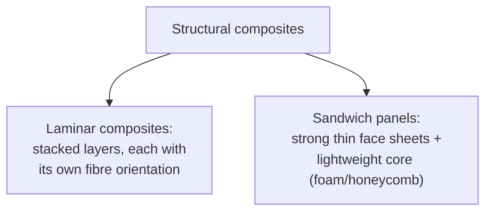
- **Laminates** — 2-D sheets/plates of a composite bonded in layers, orientation
  varied per layer for tailored, often quasi-isotropic, in-plane properties (e.g.
  plywood, fibreglass laminate).
- **Sandwich panels** — thin, stiff, strong face sheets bonded to a thick,
  low-density core; core resists shear/carries transverse load, faces carry
  bending; high stiffness-to-weight (aircraft panels, doors).

#### Q5(c) [2023] Manufacture of sheet composite material

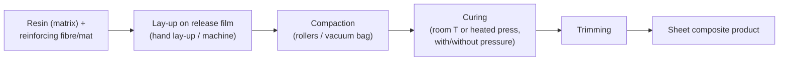
Common route: sheet-moulding compound (SMC) — chopped fibre + resin + filler is
compounded into a sheet, sandwiched between carrier films, then compression-moulded
and cured under heat and pressure into the final part.

#### Q6(a) [2023] Why thermosets are stronger than thermoplastics

Thermosetting polymers form **covalent cross-links** between chains during curing,
producing a rigid, 3-D network that cannot re-soften; this gives higher stiffness,
dimensional stability and heat/solvent resistance. Thermoplastics have only weaker
secondary (van der Waals/entangled) bonds between linear/branched chains, so they
soften, creep and deform more easily on heating or loading. *(Note: "thermostats" in
the paper is a typo for "thermosets" — see [Notes](#notes-on-the-question-paper)).*

#### Q6(b) [2023] Dry vs wet corrosion

| Aspect | Dry corrosion | Wet corrosion |
|---|---|---|
| Mechanism | Direct chemical reaction with gas (O₂, SO₂) | Electrochemical, needs an electrolyte (moisture) |
| Conditions | High temperature, no liquid | Ambient temperature, presence of water/moisture |
| Example | Oxidation scaling in furnaces | Rusting of steel outdoors |

#### Q6(c) [2023] Plastic and four thermoplastic compounds

**Plastic** — a polymeric material that can be moulded/shaped, usually with the aid
of heat and pressure.

| Thermoplastic | Typical properties | Application |
|---|---|---|
| Polyethylene (PE) | Tough, flexible, chemically inert | Packaging, pipes |
| Polyvinyl chloride (PVC) | Rigid or flexible, good chemical resistance | Pipes, cable insulation |
| Polystyrene (PS) | Rigid, transparent, brittle | Disposable containers, foam insulation |
| Nylon (Polyamide) | High strength, wear & abrasion resistant | Gears, bearings, textile fibres |

#### Q7(a) [2023] Annealing and its purposes

**Annealing** = heating to above the critical temperature, holding, then **slow
cooling** (furnace cool) to produce a soft, ductile, stress-free, fine/refined-grain
structure.

**Purposes:** relieve internal stresses, soften for machining/cold working, refine
grain structure, improve ductility, remove effects of prior cold work (recrystallise).

#### Q7(b) [2023] Wrought iron and its manufacture

**Wrought iron** — very low-carbon iron (<0.1 % C) containing 1–3 % slag fibres
distributed as long filaments, giving good corrosion resistance, weldability and
fibrous, fatigue-resistant structure.

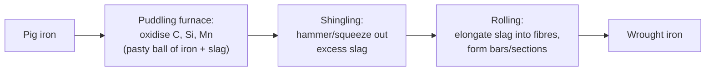

#### Q7(c) [2023] Microstructure changes on slow cooling of 0.20 %C steel

For a **hypoeutectoid** steel (0.20 %C < 0.76 %C eutectoid), on slow cooling from the
liquid:
1. **L → L + δ → δ** (above ~1493 °C).
2. **δ → δ + γ → γ (austenite)**, single phase, FCC.
3. On crossing the A₃ line (~840 °C for 0.20 %C): **proeutectoid ferrite (α)**
   nucleates at austenite grain boundaries, austenite composition drifts toward
   0.76 %C.
4. At **727 °C (eutectoid)**: remaining austenite (now 0.76 %C) transforms to
   **pearlite** (alternating lamellae of α + Fe₃C).
5. **Final room-T microstructure:** proeutectoid ferrite (majority, since %C is low)
   + pearlite (minority).

See the [Fe-Fe₃C diagram](#q3b-2023-fe-fe3c-equilibrium-diagram) for the path.

#### Q8(a) [2023] Properties and classification of ceramics

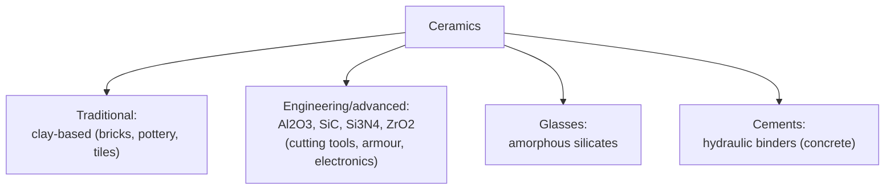
**Properties:** high hardness, high compressive strength but low tensile strength &
toughness (brittle), high melting point, good chemical/thermal stability, generally
electrical & thermal insulators (with exceptions).

#### Q8(b) [2023] Purposes of testing materials

To determine mechanical properties for design (strength, stiffness, ductility), to
verify quality/compliance with specifications, to compare/select materials, to
detect defects, to predict service performance and failure modes, to support
research & development of new materials.

#### Q8(c) [2023] Three hardness tests

Brinell, Rockwell, Vickers (see [Quick Reference](#quick-reference) table). Explained
in full: **Brinell test** — see [2024 Q4(b)](#q4b-2024-brinell-hardness-test-procedure).

---

## 2022 Examination

### Part A

#### Q1(a) [2022] Stress-strain curve of mild steel

*Fig. 2022-1a* — Labelled points: **P** proportional limit (Hooke's law valid up to
here), **E** elastic limit, **Y (upper/lower)** yield point (plastic flow begins),
**UTS** ultimate tensile strength (max. engineering stress), **F** fracture point
(after necking).

#### Q1(b) [2022] Effect of impurities on cast iron

Same as [2023 Q3(a)](#q3a-2023-effect-of-impurities-on-cast-iron).

#### Q1(c) [2022] Fe-Fe₃C diagram with common names

Same diagram as [2023 Q3(b)](#q3b-2023-fe-fe3c-equilibrium-diagram). Common
microstructure names by region: **ferrite** (α), **austenite** (γ), **cementite**
(Fe₃C), **pearlite** (α+Fe₃C eutectoid mixture), **ledeburite** (γ+Fe₃C eutectic
mixture).

#### Q2(a) [2022] Crystal structure and crystal defects

**Crystal structure** — the ordered, repeating 3-D arrangement of atoms/ions in a
solid, described by a unit cell (SC, BCC, FCC, HCP, etc.).

**Crystal defects (imperfections):**

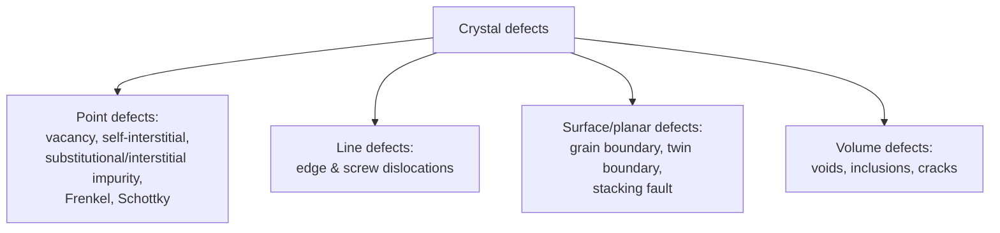

#### Q2(b) [2022] Crystalline vs amorphous solid

Same as [2023 Q1(a)](#q1a-2023-crystalline-vs-amorphous-solids).

#### Q2(c) [2022] APF of Cu (FCC)

Same as [2023 Q1(b)](#q1b-2023-apf-of-cu-fcc).

#### Q3(a) [2022] Ductility, brittleness and resilience

Ductility and resilience: same as [2024 Q2(a)](#q2a-2024-define-ductility-fatigue-and-resilience).
**Brittleness** — the tendency of a material to fracture with little or no plastic
deformation when stressed (opposite of ductility); e.g. glass, cast iron, ceramics.

#### Q3(b) [2022] S-N curves

Same as [2024 Q2(b)](#q2b-2024-s-n-curves-in-fatigue-test).

#### Q3(c) [2022] Creep

Same as [2024 Q2(c)](#q2c-2024-creep-and-the-creep-curve).

#### Q4(a) [2022] Fatigue, creep, endurance strength, bending stress

Fatigue & creep: as [2024 Q2(a)/(c)](#q2a-2024-define-ductility-fatigue-and-resilience).
- **Endurance strength (limit)** — the maximum cyclic stress a material can withstand
  for a (theoretically) infinite number of cycles without failure (flat portion of
  the ferrous S-N curve, [Fig. 2024-2b](#q2b-2024-s-n-curves-in-fatigue-test)).
- **Bending stress** — the normal stress induced in a beam/shaft by a bending
  moment: $\sigma_b = My/I$ (M = moment, y = distance from neutral axis, I = second
  moment of area).

#### Q4(b) [2022] Galvanizing vs tinning

| Aspect | Galvanizing | Tinning |
|---|---|---|
| Coating metal | Zinc (Zn) | Tin (Sn) |
| Protection mechanism | Sacrificial (anodic) — protects steel even if scratched | Barrier (cathodic to steel) — protects only while coating is intact |
| Typical use | Structural steel, sheets, wire, roofing | Food/beverage cans, solder-friendly surfaces |

#### Q4(c) [2022] Corrosion: definition, causes and control

**Corrosion** — gradual destruction/degradation of a metal by chemical or
electrochemical reaction with its environment.

**Causes:** presence of moisture/electrolyte, dissimilar metal contact (galvanic
cells), oxygen/acidic or salty environment, stress (SCC), high temperature.

**Control techniques:** same list as [2024 Q3(c)](#q3c-2024-classification-of-corrosion-and-prevention).

### Part B

#### Q5(a) [2022] Fe-Fe₃C diagram with isothermal reactions

Diagram as before ([2023 Q3(b)](#q3b-2023-fe-fe3c-equilibrium-diagram)). The three
**invariant (isothermal) reactions**:

| Reaction | Type | Temp | Equation |
|---|---|---|---|
| Peritectic | L + δ ⇌ γ | 1493 °C | δ(0.09%C) + L(0.53%C) → γ(0.17%C) |
| Eutectic | L ⇌ γ + Fe₃C | 1147 °C | L(4.3%C) → γ(2.14%C) + Fe₃C(6.67%C) |
| Eutectoid | γ ⇌ α + Fe₃C | 727 °C | γ(0.76%C) → α(0.022%C) + Fe₃C(6.67%C) |

#### Q5(b) [2022] Rockwell hardness test

*Fig. 2022-5b (right)*

1. Apply a small **minor load** (10 kgf) to seat the indenter (diamond cone for HRC,
   steel ball for HRB) and set a datum (zero) depth.
2. Apply the **major load** (60/100/150 kgf depending on scale) and let it act,
   then remove it (minor load remains).
3. The additional penetration depth $h$ (due to the major load, elastic recovery
   subtracted) is converted directly to a **hardness number** on a dial/digital
   readout: $HR = E - h/0.002$ mm (E = 100 for ball scales, 130 for diamond scales).
4. No optical measurement needed — fast, direct reading, good for production QC.

#### Q5(c) [2022] Chromium-nickel steel and manganese steel

| Steel | Typical composition | Properties | Use |
|---|---|---|---|
| Chromium-nickel (stainless, e.g. 18-8) | ~18 % Cr, 8 % Ni | Excellent corrosion resistance, tough, non-magnetic (austenitic) | Kitchenware, chemical plant, cutlery |
| Manganese steel (Hadfield steel) | ~11–14 % Mn, ~1.2 % C | Very high work-hardening rate, excellent abrasion/impact resistance | Rail points/crossings, crusher jaws, excavator teeth |

#### Q6(a) [2022] Glass transition and types of glass

Glass transition: same as [2024 Q7(a)](#q7a-2024-glass-transition-temperature-composition-and-structure-of-glass).

**Types of glass:** soda-lime glass (windows, bottles — cheap, ~70 % SiO₂), lead
glass/crystal (high refractive index, optics, decorative), borosilicate glass
(Pyrex — low thermal expansion, lab/cookware), fused silica (high-purity, high-T
optical use), safety/tempered & laminated glass.

#### Q6(b) [2022] Classification of ceramic materials

Same as [2023 Q8(a)](#q8a-2023-properties-and-classification-of-ceramics).

#### Q6(c) [2022] Glass forming methods

Same as [2024 Q7(c)](#q7c-2024-glass-forming-methods).

#### Q7(a) [2022] Drying and firing stages of ceramic manufacture

Same as [2024 Q6(a)](#q6a-2024-drying-and-firing-of-ceramics).

#### Q7(b) [2022] Advantages and applications of composite material

Advantages: same as [2023 Q5(a)](#q5a-2023-composite-material-and-advantages).
**Applications:** aircraft/aerospace structures, wind-turbine blades, automotive
body panels, sporting goods (rackets, rods), boat hulls, prosthetics, reinforced
concrete (civil engineering).

#### Q7(c) [2022] Lubricants — definition and properties

**Lubricant** — a substance introduced between two moving/contacting surfaces to
reduce friction and wear. Properties: same list as
[2024 Q6(c)](#q6c-2024-functions-and-properties-of-lubricants).

#### Q8(a) [2022] Important characteristics of ceramic materials

High hardness & wear resistance, high compressive strength, brittleness (low
fracture toughness), high melting point/thermal stability, chemical inertness &
corrosion resistance, generally electrically insulating, low thermal conductivity
(except a few like SiC), low density compared with metals of similar strength.

#### Q8(b) [2022] Pultrusion process

Same as [2024 Q8(b)](#q8b-2024-pultrusion-process).

#### Q8(c) [2022] Hardening: definition and process

**Hardening** — a heat-treatment process to increase hardness (and strength) of
steel by producing martensite.

**Process:** (1) heat steel above the upper critical (austenitising) temperature so
it becomes fully austenitic; (2) hold to homogenise; (3) **quench rapidly** (water,
oil or brine — see [Fig. 2024-5b](#q5b-2024-quenching-and-quenching-media)) so that
diffusion is suppressed and austenite transforms to hard, brittle **martensite**
(body-centred tetragonal); (4) usually followed by tempering to relieve brittleness.

---

## 2021 Examination

### Part A

#### Q1(a) [2021] Fatigue, creep, ductility and brittleness

Fatigue, creep, ductility: [2024 Q2(a)/(c)](#q2a-2024-define-ductility-fatigue-and-resilience).
Brittleness: [2022 Q3(a)](#q3a-2022-ductility-brittleness-and-resilience).

#### Q1(b) [2021] Classification of engineering materials

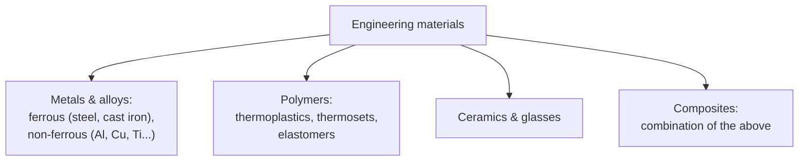
Mechanical properties matter because they determine whether a material can safely
carry the intended service loads (strength, stiffness), survive processing/fabrication,
resist wear/fatigue/corrosion in service, and meet weight/cost targets — i.e. they
directly drive material selection for design.

#### Q1(c) [2021] "Smart materials are the future of mankind"

**Short balanced argument:**
Smart materials (shape-memory alloys like Nitinol, piezoelectrics, magnetostrictive
and electro-/magneto-rheological materials, self-healing polymers) can sense and
respond to their environment (stress, temperature, field), enabling adaptive
structures, actuators/sensors, medical devices (stents, implants) and self-repairing
components — genuine, transformative advantages.

However, they remain **limited** by high cost, complex/energy-intensive processing,
fatigue/durability concerns, and difficulty of large-scale manufacture, so they
currently supplement rather than replace conventional materials.

**Conclusion:** smart materials are an important and growing part of future
engineering, but calling them unconditionally "the future of mankind" overstates
their present readiness — a balanced view sees them as one valuable tool among many.

#### Q2(a) [2021] Oxidation vs corrosion

Same as [2024 Q3(a)](#q3a-2024-oxidation-vs-corrosion).

#### Q2(b) [2021] Season cracking

**Season cracking** = a form of **stress-corrosion cracking (SCC)** of cold-worked
(residually stressed) **brass** exposed to ammonia-containing atmospheres (originally
noticed in brass cartridge cases stored in stables — ammonia from manure — during
monsoon "season" in India).

**Mechanism:** combined effect of (i) residual tensile stress from cold working and
(ii) a specific corrosive agent (ammonia/ammonium compounds) causes intergranular
crack initiation and propagation, with little visible general corrosion, leading to
sudden brittle-like failure.

**Prevention:** stress-relief anneal after cold working (low-temperature, to relieve
stress without full recrystallisation), avoid/control exposure to ammoniacal
atmospheres, select a less susceptible alloy (lower Zn brass), apply protective
coatings.

#### Q2(c) [2021] Alloying and classification of steel by carbon content

**Alloying** — see [2023 Q2(a)](#q2a-2023-purpose-of-alloying-steel).

| Class | Carbon content | Properties/uses |
|---|---|---|
| Low-carbon (mild) steel | 0.05–0.25 % | Ductile, weldable — structural, sheet |
| Medium-carbon steel | 0.25–0.60 % | Higher strength/hardness — shafts, gears |
| High-carbon steel | 0.60–1.5 % | Hard, wear-resistant, less ductile — tools, springs, cutting edges |

#### Q3(a) [2021] Effect of Ni, Cr and Mn as alloying elements

Nickel, Chromium: see [2024 Q4(c)](#q4c-2024-effects-of-alloying-elements).
**Manganese (Mn):** deoxidiser/desulphuriser (forms MnS), increases hardenability &
strength, in high content (Hadfield steel) gives extreme work-hardening & abrasion
resistance (see [2022 Q5(c)](#q5c-2022-chromium-nickel-steel-and-manganese-steel)).

#### Q3(b) [2021] DBTT and the Titanic

**Ductile-to-brittle transition temperature (DBTT)** — the temperature below which a
material's fracture behaviour changes from ductile (high energy absorption) to
brittle (low energy absorption), seen as a sharp drop in Charpy impact energy.

*Fig. 2021-3b*

**Significance for RMS Titanic:** the hull steel is commonly reported to have had
relatively high sulphur/phosphorus content and coarse grain/inclusions (manganese
sulphide stringers), raising its DBTT close to the near-freezing North Atlantic water
temperature on the night of sinking (commonly cited studies place the water around
−2 °C). This is understood as one contributing metallurgical factor (along with
brittle wrought-iron rivets) that made the hull plates and rivets fracture in a
brittle, rather than ductile, manner on impact — though the sinking had multiple
causes and this remains a widely-cited but debated historical/metallurgical
explanation, not an absolute, singular cause.

#### Q3(c) [2021] Wrought iron and tool steel — short notes

**Wrought iron:** see [2023 Q7(b)](#q7b-2023-wrought-iron-and-its-manufacture).

**Tool steel:** high-carbon (or alloy) steel (typically 0.7–1.5 %C, often with W, Cr,
V, Mo) heat-treated to high hardness and wear resistance, used for cutting tools,
dies, punches; grades include water-hardening, cold-work, hot-work and high-speed
tool steels.

#### Q4(a) [2021] Fatigue and creep

See [2024 Q2(a)/(c)](#q2a-2024-define-ductility-fatigue-and-resilience).

#### Q4(b) [2021] S-N curve and endurance limit

See [Fig. 2024-2b](#q2b-2024-s-n-curves-in-fatigue-test). **Endurance limit** —
defined in [2022 Q4(a)](#q4a-2022-fatigue-creep-endurance-strength-bending-stress) —
is the flat-plateau stress level on the ferrous S-N curve.

#### Q4(c) [2021] Manufacture of cast iron

Same as [2024 Q5(c)](#q5c-2024-manufacture-of-cast-iron).

### Part B

#### Q5(a) [2021] Heat treatment: definition and property change

Same as [2024 Q5(a)](#q5a-2024-heat-treatment-definition-and-purposes). Properties
are changed because controlled heating/cooling alters the phases present (e.g.
ferrite ↔ austenite ↔ martensite), grain size, and internal stress state, which
directly govern hardness, strength, ductility and toughness.

#### Q5(b) [2021] Hardness and Brinell hardness test

Definition of hardness: resistance of a material to localised plastic deformation
(indentation, scratching or abrasion). Procedure: see
[2024 Q4(b)](#q4b-2024-brinell-hardness-test-procedure).

#### Q5(c) [2021] Components and properties of lubricants

**Components:** base oil (mineral, synthetic or vegetable) + additives (anti-wear,
anti-oxidant, viscosity-index improver, detergent/dispersant, corrosion inhibitor,
pour-point depressant).

**Properties of a good lubricant:** same list as
[2024 Q6(c)](#q6c-2024-functions-and-properties-of-lubricants).

#### Q6(a) [2021] Glass: definition, composition and structure

Same as [2024 Q7(a)](#q7a-2024-glass-transition-temperature-composition-and-structure-of-glass).

#### Q6(b) [2021] General properties of industrial glass

Same as [2024 Q7(b)](#q7b-2024-thermal-and-mechanical-properties-of-industrial-glass).

#### Q6(c) [2021] Thermoplastic vs thermosetting polymer

| Aspect | Thermoplastic | Thermosetting |
|---|---|---|
| Bonding | Linear/branched chains, secondary bonds only | Covalently cross-linked 3-D network |
| Behaviour on heating | Softens, can be re-melted/re-shaped | Chars/decomposes, cannot re-melt |
| Recyclability | Recyclable | Not (easily) recyclable |
| Examples | PE, PVC, PS, nylon | Epoxy, phenolic (Bakelite), melamine |

#### Q7(a) [2021] Hardening: definition and process

Same as [2022 Q8(c)](#q8c-2022-hardening-definition-and-process).

#### Q7(b) [2021] Annealing: full vs process

**Full annealing:** heat above the upper critical temperature ($A_3$/$A_{cm}$),
homogenise, then **furnace (slow) cool** — fully refines/softens the structure,
relieves stress, maximum ductility; used before major machining or forming.

**Process annealing (stress-relief/sub-critical annealing):** heat to a temperature
**below** the lower critical temperature ($A_1$), hold, then air/furnace cool —
relieves internal stresses from cold work and restores some ductility *without*
full recrystallisation/phase change; cheaper, faster, commonly used between cold-
working stages (e.g. wire drawing).

#### Q7(c) [2021] Quenching mechanism

**Quenching** definition: see [2024 Q5(b)](#q5b-2024-quenching-and-quenching-media).

*Fig. 2021-7c*

**Mechanism (3 stages of cooling):**
1. **Vapour-blanket (film boiling) stage** — a continuous vapour film insulates the
   part; slow cooling (lowest heat-transfer rate).
2. **Boiling (nucleate/vapour-transport) stage** — vapour film collapses, violent
   boiling occurs at the surface; **fastest** cooling rate; this stage determines
   hardenability/martensite formation.
3. **Convection stage** — below the boiling point of the quenchant, cooling is by
   liquid convection/conduction; slow again.

#### Q8(a) [2021] Polymer and injection molding

**Polymer** — a large molecule (macromolecule) built from many repeating
structural units (monomers) joined by covalent bonds.

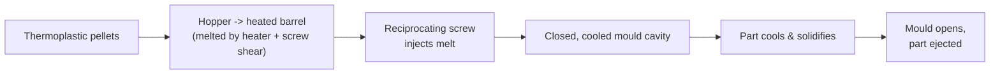
Steps: (1) feed pellets from hopper; (2) melt via barrel heaters + screw rotation;
(3) inject melt into a closed mould under pressure; (4) hold pressure while part
cools/solidifies; (5) open mould and eject the finished part. Used for mass
production of thermoplastic parts (housings, containers, gears).

#### Q8(b) [2021] Composite material and advantages

Same as [2023 Q5(a)](#q5a-2023-composite-material-and-advantages).

#### Q8(c) [2021] Laminar composites

**Laminar composites** — see [2023 Q5(b)](#q5b-2023-types-of-structural-composites)
(laminates). Made by stacking and bonding 2-D sheets/plies (e.g. fibre-reinforced
prepreg layers, plywood veneers, clad metal sheets); ply orientation and stacking
sequence are chosen to give the required strength/stiffness in the loading
directions of the part, or to combine dissimilar properties (e.g. corrosion-
resistant cladding on a structural core).

---

## 2020 Examination

### Part A

#### Q1(a) [2020] Crystalline vs amorphous solid

Same as [2023 Q1(a)](#q1a-2023-crystalline-vs-amorphous-solids).

#### Q1(b) [2020] APF of FCC

Same as [2023 Q1(b)](#q1b-2023-apf-of-cu-fcc).

#### Q1(c) [2020] BCC vs FCC stability

**FCC** is more closely packed ($APF=0.74$, coordination number 12) than **BCC**
($APF=0.68$, CN 8), so on close-packing grounds alone FCC would seem "more stable."
In practice, stability is **element- and temperature-dependent**, governed by the
lowest-free-energy structure at that condition. Example — pure iron: **BCC (α-Fe)**
below 912 °C, **FCC (γ-Fe)** from 912–1394 °C, **BCC (δ-Fe)** from 1394–1538 °C. So
neither structure is "more stable" in an absolute sense; each is the equilibrium
structure over its own temperature range for a given element.

#### Q1(d) [2020] Density of Cu — numerical

**Given:** Cu is FCC, $R=1.28$ Å, $A=63.5$ g/mol (as given).

$a=\dfrac{4R}{\sqrt2}=\dfrac{4(1.28)}{1.414}=3.620\ \text{Å}=3.620\times10^{-8}\ \text{cm}$

$V_c=a^3=(3.620\times10^{-8})^3=4.746\times10^{-23}\ \text{cm}^3$

$\rho=\dfrac{nA}{V_cN_A}=\dfrac{4\times63.5}{4.746\times10^{-23}\times6.022\times10^{23}}=\dfrac{254}{28.58}$

**Answer:** $\rho\approx8.89\ \text{g/cm}^3$.

#### Q2(a) [2020] Mechanical properties of materials

Strength (yield, UTS), stiffness (modulus of elasticity), hardness, ductility,
malleability, toughness, resilience, brittleness, fatigue/endurance strength, creep
resistance, impact strength — see also the property list in
[2024 Q3(b)](#q3b-2024-plain-carbon-steel-and-mechanical-properties).

#### Q2(b) [2020] Effect of impurities on cast iron

Same as [2023 Q3(a)](#q3a-2023-effect-of-impurities-on-cast-iron).

#### Q2(c) [2020] Stress-strain curve of mild steel

Same as [2022 Q1(a)](#q1a-2022-stress-strain-curve-of-mild-steel).

#### Q2(d) [2020] ASTM, AISI, SAE

- **ASTM** — American Society for Testing and Materials: publishes standard test
  methods and material specifications.
- **AISI** — American Iron and Steel Institute: publishes standard steel
  designations/grades (e.g. AISI 1020).
- **SAE** — Society of Automotive Engineers: publishes engineering standards,
  including steel/alloy numbering (shared 4-digit system with AISI, e.g. SAE 4340).

#### Q3(a) [2020] Creep

Same as [2024 Q2(c)](#q2c-2024-creep-and-the-creep-curve).

#### Q3(b) [2020] S-N curves

Same as [2024 Q2(b)](#q2b-2024-s-n-curves-in-fatigue-test).

#### Q3(c) [2020] Fracture: definition and classification

**Fracture** — see [2023 Q4(a)](#q4a-2023-fracture-ductile-vs-brittle).
**Classification:** by ductility — **ductile** and **brittle**; by crack path —
**transgranular** (through grains) and **intergranular** (along grain boundaries);
by mode — cleavage, shear, fatigue fracture.

#### Q4(a) [2020] Corrosion prevention

Same as [2024 Q3(c)](#q3c-2024-classification-of-corrosion-and-prevention).

#### Q4(b) [2020] Wrought iron: characteristics and uses

Definition/manufacture: [2023 Q7(b)](#q7b-2023-wrought-iron-and-its-manufacture).
**Characteristics:** very low carbon, fibrous slag inclusions, excellent corrosion
resistance, ductile, easily welded/forge-worked, low strength compared with steel.
**Uses:** decorative ironwork, chains, pipes, roofing sheets, horseshoes
(historically), ornamental gates/railings.

#### Q4(c) [2020] Plain carbon and high-carbon steel

Plain carbon steel: [2024 Q3(b)](#q3b-2024-plain-carbon-steel-and-mechanical-properties).
**High-carbon steel:** 0.60–1.5 % C, high hardness & strength but lower ductility &
weldability, used for cutting tools, springs, dies (see also
[2021 Q2(c)](#q2c-2021-alloying-and-classification-of-steel-by-carbon-content)).

### Part B

#### Q5(a) [2020] Heat treatment: definition and purposes

Same as [2024 Q5(a)](#q5a-2024-heat-treatment-definition-and-purposes).

#### Q5(b) [2020] Types of annealing

- **Full annealing** & **process annealing** — see
  [2021 Q7(b)](#q7b-2021-annealing-full-vs-process).
- **Normalizing** — heat above $A_3/A_{cm}$, then **air cool** (faster than furnace
  cool) — gives finer grain and higher strength than full annealing, relieves
  stress, refines grain after casting/forging/welding.
- **Spheroidising** — prolonged heating near/just below $A_1$ to convert cementite
  into spheroids — maximises machinability/softness in high-carbon steel.
- **Stress-relief annealing** — as in process annealing, purely to remove residual
  stress.

#### Q5(c) [2020] Quenching media

Same as [2024 Q5(b)](#q5b-2024-quenching-and-quenching-media).

#### Q6(a) [2020] Important characteristics of ceramic materials

Same as [2022 Q8(a)](#q8a-2022-important-characteristics-of-ceramic-materials).

#### Q6(b) [2020] Polymerization; thermoplastic vs thermosetting

**Polymerization** — the chemical process of joining many small monomer molecules
into long-chain macromolecules (polymers), via **addition polymerization**
(chain-growth, e.g. polyethylene from ethylene) or **condensation polymerization**
(step-growth, with a by-product such as water, e.g. nylon, polyester).

Thermoplastic vs thermosetting: see table in
[2021 Q6(c)](#q6c-2021-thermoplastic-vs-thermosetting-polymer).

#### Q6(c) [2020] Extrusion molding

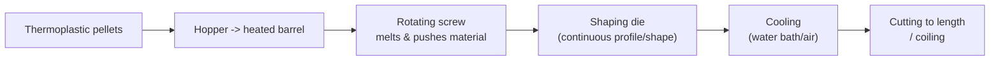
Molten polymer is continuously forced through a shaped die by a rotating screw,
producing a constant cross-section (pipe, sheet, rod, wire coating), then cooled and
cut/coiled.

#### Q7(a) [2020] Glass transition; types of glass

Same as [2022 Q6(a)](#q6a-2022-glass-transition-and-types-of-glass).

#### Q7(b) [2020] Ceramic material: classification

Same as [2023 Q8(a)](#q8a-2023-properties-and-classification-of-ceramics).

#### Q7(c) [2020] Glass forming methods

Same as [2024 Q7(c)](#q7c-2024-glass-forming-methods).

#### Q8(a) [2020] APF definition; FCC unit cell

Definition: see [2024 Q1(b)](#q1b-2024-apf-of-bcc). FCC unit cell figure:
[Fig. 2023-2b/unit cells](../../assets/materials-science/unit-cells-sc-bcc-fcc.svg) —
8 corner atoms (1/8 each) + 6 face-centre atoms (1/2 each) = 4 atoms/cell.

#### Q8(b) [2020] Applications of composite materials

Same as [2022 Q7(b)](#q7b-2022-advantages-and-applications-of-composite-material).

#### Q8(c) [2020] Structural composites with figure

Same as [2023 Q5(b)](#q5b-2023-types-of-structural-composites).

---

## 2019 Examination

### Part A

#### Q1 [2019] Classification of engineering materials

Same classification tree as [2021 Q1(b)](#q1b-2021-classification-of-engineering-materials).
**Necessity of learning it:** enables correct material selection for a given
application (balancing strength, cost, weight, corrosion resistance, availability),
underpins safe and economical engineering design, and is prerequisite knowledge for
manufacturing-process selection and failure analysis.

#### Q2 [2019] APF of BCC

Same as [2024 Q1(b)](#q1b-2024-apf-of-bcc).

#### Q3 [2019] Role of major alloying elements

Same as [2024 Q4(c)](#q4c-2024-effects-of-alloying-elements) (Ni, Si, Ti, Cr), plus
Mn (see [2021 Q3(a)](#q3a-2021-effect-of-ni-cr-and-mn-as-alloying-elements)).

### Part B

#### Q4 [2019] Purposes of annealing and normalizing

Annealing purposes: [2023 Q7(a)](#q7a-2023-annealing-and-its-purposes).
**Normalizing purpose:** refine and homogenise grain structure after
casting/forging/welding, relieve internal stress, and give higher strength/hardness
than full annealing while remaining more machinable than as-hardened steel (see
[2020 Q5(b)](#q5b-2020-types-of-annealing)).

#### Q5 [2019] General properties of industrial glass

Same as [2024 Q7(b)](#q7b-2024-thermal-and-mechanical-properties-of-industrial-glass).

#### Q6 [2019] Unit cell and APF of SC = 0.52

**Unit cell** — the smallest repeating 3-D geometric unit that, when stacked in all
three directions, reproduces the entire crystal lattice.

**Proof for Simple Cubic (SC):** atoms touch along the cube edge, so $a=2R$; 1
atom/cell (8 corners × 1/8).

$$APF=\frac{n\cdot\frac43\pi R^3}{a^3}=\frac{1\cdot\frac43\pi R^3}{(2R)^3}=\frac{\frac43\pi R^3}{8R^3}=\frac{\pi}{6}$$

$$APF=\frac{3.1416}{6}\approx0.524\approx 0.52 \quad \blacksquare$$

See [Fig. unit cells](../../assets/materials-science/unit-cells-sc-bcc-fcc.svg) (left).

---

## 2018 Examination

### Part A

#### Q1(a) [2018] Crystalline vs amorphous solids

Same as [2023 Q1(a)](#q1a-2023-crystalline-vs-amorphous-solids).

#### Q1(b) [2018] APF of Cu

Same as [2023 Q1(b)](#q1b-2023-apf-of-cu-fcc).

#### Q1(c) [2018] Theoretical density of Cr — numerical

Same numerical and result as [2023 Q1(c)](#q1c-2023-theoretical-density-of-cr-numerical):
$\rho\approx7.18$ g/cm³ (using $A=52.00$ g/mol, $R=0.125$ nm, BCC).

#### Q1(d) [2018] {111} family of planes

Same as [2023 Q1(d)](#q1d-2023-family-of-111-planes).

#### Q2(a) [2018] Stress-strain curve of mild steel (all points)

Same as [2022 Q1(a)](#q1a-2022-stress-strain-curve-of-mild-steel) — proportional
limit, elastic limit, upper & lower yield points, uniform plastic region, UTS,
necking region, fracture point.

#### Q2(b) [2018] Blast-furnace reactions

*Fig. 2018-2b*

| Zone (approx. T) | Reaction |
|---|---|
| ~200 °C (top) | Drying/preheating of charge |
| ~500–850 °C | $3Fe_2O_3+CO\to 2Fe_3O_4+CO_2$; $Fe_3O_4+CO\to 3FeO+CO_2$ |
| ~850–1000 °C | $FeO+CO\to Fe+CO_2$ (indirect reduction) |
| ~1000 °C | $CaCO_3\to CaO+CO_2$ (calcination, slag formation with SiO₂ impurities) |
| Tuyeres, ~1900 °C | $C+O_2\to CO_2$; $CO_2+C\to 2CO$ (combustion, generates reducing gas) |
| Hearth | Molten pig iron and slag collect and are tapped separately |

#### Q2(c) [2018] Fe-Fe₃C phase diagram

Same as [2023 Q3(b)](#q3b-2023-fe-fe3c-equilibrium-diagram).

#### Q3(a) [2018] Effect of impurities on cast iron

Same as [2023 Q3(a)](#q3a-2023-effect-of-impurities-on-cast-iron).

#### Q3(b) [2018] Fe-C equilibrium diagram

Same as [2023 Q3(b)](#q3b-2023-fe-fe3c-equilibrium-diagram).

#### Q3(c) [2018] Mild steel

Same as [2024 Q4(a)](#q4a-2024-mild-steel).

#### Q4(a) [2018] Creep and creep curve

Same as [2024 Q2(c)](#q2c-2024-creep-and-the-creep-curve).

#### Q4(b) [2018] Oxidation vs corrosion

Same as [2024 Q3(a)](#q3a-2024-oxidation-vs-corrosion).

#### Q4(c) [2018] Fatigue and S-N curves

Definition: [2024 Q2(a)](#q2a-2024-define-ductility-fatigue-and-resilience). Curves:
[2024 Q2(b)](#q2b-2024-s-n-curves-in-fatigue-test).

### Part B

#### Q5(a) [2018] DBTT effect on materials with examples

DBTT definition: see [2021 Q3(b)](#q3b-2021-dbtt-and-the-titanic). **Effect:**
below DBTT a material that is normally ductile behaves in a brittle, low-energy
fracture manner — critical for structures used at low temperature (ships, pipelines,
pressure vessels in cold climates). Example: BCC steels show a marked DBTT (unlike
FCC metals such as Cu, Al, austenitic stainless steel, which stay ductile to very low
T) — this is why steel selection for Arctic/cryogenic service specifies impact
testing (Charpy V-notch) at the minimum service temperature.

#### Q5(b) [2018] Functions of lubricants

Same as [2024 Q6(c)](#q6c-2024-functions-and-properties-of-lubricants).

#### Q5(c) [2018] Pultrusion process of composite production

Same as [2024 Q8(b)](#q8b-2024-pultrusion-process).

#### Q6(a) [2018] Why thermosets are stronger than thermoplastics

Same as [2023 Q6(a)](#q6a-2023-why-thermosets-are-stronger-than-thermoplastics).

#### Q6(b) [2018] Dry vs wet corrosion

Same as [2023 Q6(b)](#q6b-2023-dry-vs-wet-corrosion).

#### Q6(c) [2018] Plastic and 4 thermoplastic compounds

Same as [2023 Q6(c)](#q6c-2023-plastic-and-four-thermoplastic-compounds).

#### Q7(a) [2018] Annealing and its purposes

Same as [2023 Q7(a)](#q7a-2023-annealing-and-its-purposes).

#### Q7(b) [2018] Wrought iron manufacture

Same as [2023 Q7(b)](#q7b-2023-wrought-iron-and-its-manufacture).

#### Q7(c) [2018] Microstructure changes, 0.20 %C steel

Same as [2023 Q7(c)](#q7c-2023-microstructure-changes-on-slow-cooling-of-020-c-steel).

#### Q8(a) [2018] Ceramic material: classification

Same as [2023 Q8(a)](#q8a-2023-properties-and-classification-of-ceramics).

#### Q8(b) [2018] Force-extension curve: ductile vs brittle

*Fig. 2018-8b*

- **Ductile material** — curve rises non-linearly, shows a clear yield/maximum load
  point, then extends considerably (necking) before breaking at reduced load; large
  area under curve (high energy absorbed).
- **Brittle material** — curve is nearly linear (Hookean) up to a sudden fracture at
  low extension, with very little plastic region; small area under curve.
- **Terms:** limit of proportionality (linear region ends), elastic limit, yield
  point/maximum load, extension at fracture, area under curve = energy absorbed
  (toughness).

#### Q8(c) [2018] Glass forming methods

Same as [2024 Q7(c)](#q7c-2024-glass-forming-methods).

---

## 2017 Examination

### Part A

#### Q1(a) [2017] Why mechanical properties are important

Same reasoning as [2019 Q1](#q1-2019-classification-of-engineering-materials) —
mechanical properties determine whether a component can safely and economically
perform its intended function under service loads.

#### Q1(b) [2017] Classify engineering materials

Same as [2021 Q1(b)](#q1b-2021-classification-of-engineering-materials).

#### Q1(c) [2017] Stress-strain diagram for ductile material

Same as [2022 Q1(a)](#q1a-2022-stress-strain-curve-of-mild-steel) (mild steel is the
classic ductile-material example).

#### Q2(a) [2017] Stiffness and strength

- **Stiffness** — resistance of a material/component to *elastic* deformation under
  load; quantified by the modulus of elasticity $E$ (slope of the linear
  stress-strain region), $\sigma=E\varepsilon$.
- **Strength** — the stress a material can withstand before failure (yielding or
  fracture); e.g. yield strength, ultimate tensile strength.

#### Q2(b) [2017] Rockwell hardness test

Same as [2022 Q5(b)](#q5b-2022-rockwell-hardness-test).

#### Q2(c) [2017] Methods of corrosion control

Same as [2024 Q3(c)](#q3c-2024-classification-of-corrosion-and-prevention).

#### Q3(a) [2017] Ductile to brittle transition temperature

Definition: see [2021 Q3(b)](#q3b-2021-dbtt-and-the-titanic).

#### Q3(b) [2017] APF of FCC = 0.74 (proof)

Same derivation as [2023 Q1(b)](#q1b-2023-apf-of-cu-fcc), giving
$APF_{FCC}=\pi/(3\sqrt2)\approx0.74$.

#### Q3(c) [2017] Hollow steel tube — numerical

**Given:** inside diameter $D_i=100$ mm, tensile load $P=400$ kN, allowable stress
$\sigma=120$ MN/m².

**Required area:** $A=P/\sigma = \dfrac{400\times10^3}{120\times10^6}=3.333\times10^{-3}\ \text{m}^2=3333\ \text{mm}^2$

**Solve for outside diameter:** $A=\dfrac{\pi}{4}(D_o^2-D_i^2)$
$$3333=\frac{\pi}{4}(D_o^2-100^2) \Rightarrow D_o^2-10000=\frac{4\times3333}{\pi}=4244$$
$$D_o^2=14244 \Rightarrow D_o=119.35\ \text{mm}$$

**Answer:** $D_o\approx119.4$ mm. *(Repeats as
[2016 Q1(c)](#q1c-2016-hollow-steel-tube-numerical).)*

#### Q4(a) [2017] Characteristics of ceramics

Same as [2022 Q8(a)](#q8a-2022-important-characteristics-of-ceramic-materials).

#### Q4(b) [2017] Useful carbides

| Carbide | Characteristics | Application |
|---|---|---|
| Tungsten carbide (WC) | Extremely hard, wear-resistant, high melting point | Cutting-tool tips, drill bits, dies |
| Silicon carbide (SiC) | Hard, good high-T strength, semiconductor properties | Abrasives, grinding wheels, high-T components |
| Titanium carbide (TiC) | Very hard, good chemical stability | Cutting tools, wear coatings |
| Chromium carbide (Cr₃C₂) | Excellent wear & corrosion resistance | Hardfacing coatings |

#### Q4(c) [2017] Manufacture of aluminium from bauxite

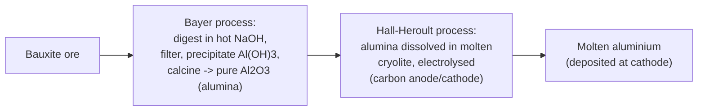
**Bayer process** extracts pure alumina (Al₂O₃) from bauxite (digestion in caustic
soda, clarification, precipitation, calcination). **Hall-Héroult process** then
electrolyses alumina dissolved in molten cryolite (~950 °C) between carbon
electrodes, depositing molten aluminium at the cathode while the carbon anode is
consumed (forming CO₂).

### Part B

#### Q5(a) [2017] Mild steel and high-speed steel

Mild steel: see [2024 Q4(a)](#q4a-2024-mild-steel).

**High-speed steel (HSS):** highly alloyed tool steel (W/Mo, Cr, V, sometimes Co)
that retains hardness at high temperature ("red hardness"), used for cutting tools
operating at high cutting speeds where heat build-up would soften ordinary tool
steel.

#### Q5(b) [2017] Types of cast iron

| Type | Graphite form | Characteristics |
|---|---|---|
| Grey CI | Flakes | Good machinability, damping, weak in tension, brittle |
| White CI | None (carbide/cementite) | Very hard, brittle, wear-resistant, unmachinable as-cast |
| Malleable CI | Rosettes (from annealed white CI) | Ductile, machinable — see [2024 Q1(a)](#q1a-2024-cast-iron-nodular--malleable-cast-iron) |
| Nodular/ductile CI | Spheroids | Good ductility & strength — see [2024 Q1(a)](#q1a-2024-cast-iron-nodular--malleable-cast-iron) |
| Chilled CI | Localised white iron surface, grey core | Hard wear-resistant surface + tough core |

#### Q5(c) [2017] Phase diagram: definition and importance

**Phase diagram** — a graphical map of the equilibrium phases present in a
material system as a function of composition and temperature (at constant
pressure).

**Importance/objectives:** predicts phases present and their compositions at any
temperature, guides selection of heat-treatment temperatures, explains
microstructure development on cooling, predicts solidification behaviour (coring,
segregation), and underlies alloy design.

#### Q6(a) [2017] Properties of polymers and copolymers

**Polymers:** low density, generally good chemical resistance, electrical
insulators, low strength/stiffness compared with metals, wide range of ductility
(brittle to highly elastic), easily processed/moulded, generally low
temperature-resistance compared with metals/ceramics.

**Copolymers:** polymers made from **two or more different monomers**; properties
can be tailored between those of the homopolymers, and arrangement can be random,
alternating, block, or graft — giving further property control (e.g. ABS =
acrylonitrile-butadiene-styrene).

#### Q6(b) [2017] Glass structure; specific-volume vs temperature diagram

Structure: see [2024 Q7(a)](#q7a-2024-glass-transition-temperature-composition-and-structure-of-glass).

*Fig. 2017-6b — a crystalline solid shows a sharp volume drop at $T_m$; a glass
(non-crystalline) shows only a change in slope at $T_g$, with no discontinuity,
because it does not crystallise on cooling.*

#### Q6(c) [2017] Advantages and disadvantages of composite fabrication processes

**Advantages:** near-net-shape parts (less machining waste), ability to tailor
fibre orientation for load paths, good surface finish achievable, can integrate
multiple parts into one (part consolidation).

**Disadvantages:** high tooling/equipment cost, labour-intensive for some processes
(hand lay-up), difficulty in recycling/repair, quality highly sensitive to process
control (voids, resin-rich areas), generally slower cycle times than metal forming.

#### Q7(a) [2017] Glass transition temperature (explain with diagram)

Same as [2024 Q7(a)](#q7a-2024-glass-transition-temperature-composition-and-structure-of-glass)
and [Fig. 2017-6b](#q6b-2017-glass-structure-specific-volume-vs-temperature-diagram).

#### Q7(b) [2017] Brass vs bronze

| Aspect | Brass | Bronze |
|---|---|---|
| Composition | Cu + Zn | Cu + Sn (tin), sometimes Al/Si/Be "bronzes" |
| Colour | Yellowish | Reddish-brown |
| Properties | Good ductility, machinability, corrosion resistance | Higher strength, better wear & corrosion (esp. seawater) resistance |
| Uses | Fittings, cartridge cases, musical instruments | Bearings, marine hardware, bells, statues |

#### Q7(c) [2017] Effect of alloying elements: Ni, Cr, Si, Ti

Same as [2024 Q4(c)](#q4c-2024-effects-of-alloying-elements).

#### Q8(a) [2017] Iron phase equilibrium diagram

Same as [2023 Q3(b)](#q3b-2023-fe-fe3c-equilibrium-diagram).

#### Q8(b) [2017] Factors affecting the structure of cast iron

Cooling rate (fast → white iron, slow → grey iron), silicon content (graphitiser),
sulphur content (carbide stabiliser, opposed by Mn), section thickness (thin
sections cool fast → more carbide), inoculation practice, and — for ductile iron —
Mg/Ce treatment (see [2024 Q1(a)](#q1a-2024-cast-iron-nodular--malleable-cast-iron)).

#### Q8(c) [2017] Applications of nickel and magnesium

**Nickel:** stainless & heat-resisting steel alloying element, nickel-based
superalloys (turbine blades), electroplating, batteries (NiMH, NiCd), coinage.

**Magnesium:** lightest structural metal — aerospace & automotive components
(weight saving), die-cast housings (laptops, phones), sacrificial anodes for
cathodic protection, flares/pyrotechnics (rapid oxidation).

---

## 2016 Examination

### Part A

#### Q1(a) [2016] Resilience and endurance limit

Resilience: see [2024 Q2(a)](#q2a-2024-define-ductility-fatigue-and-resilience).
Endurance limit: see [2022 Q4(a)](#q4a-2022-fatigue-creep-endurance-strength-bending-stress).

#### Q1(b) [2016] Stress-strain diagram for ductile material

Same as [2022 Q1(a)](#q1a-2022-stress-strain-curve-of-mild-steel).

#### Q1(c) [2016] Hollow steel tube — numerical

Identical problem and answer to [2017 Q3(c)](#q3c-2017-hollow-steel-tube-numerical):
$D_o\approx119.4$ mm.

#### Q2(a) [2016] Hooke's law

**Hooke's law:** within the elastic (proportional) limit, stress is directly
proportional to strain: $\sigma=E\varepsilon$, where $E$ is the modulus of
elasticity (Young's modulus) — a measure of material stiffness.

#### Q2(b) [2016] Classification of cast iron by carbon position

Same as [2017 Q5(b)](#q5b-2017-types-of-cast-iron) — classified by how carbon is
present: combined (as Fe₃C, cementite → white iron) vs. free (as graphite → grey,
nodular, malleable iron).

#### Q2(c) [2016] Stainless steel vs high-speed steel

| Aspect | Stainless steel | High-speed steel |
|---|---|---|
| Main alloying | ~12–20 % Cr (+Ni) | W/Mo, Cr, V (+Co) |
| Purpose | Corrosion resistance | Retain hardness at high cutting temperature |
| Typical use | Cutlery, chemical plant, architecture | Cutting tools, drills, lathe bits |

#### Q2(d) [2016] Characteristics and applications of aluminium

**Characteristics:** low density (~2.7 g/cm³), good corrosion resistance (self-
passivating oxide film), high electrical/thermal conductivity, good ductility &
formability, non-magnetic, strength improved substantially by alloying/heat
treatment (e.g. 2xxx, 6xxx, 7xxx series).

**Applications:** aircraft structures, automotive body panels, packaging (foil,
cans), electrical conductors/busbars, window frames, heat exchangers. Manufacture
route: see [2017 Q4(c)](#q4c-2017-manufacture-of-aluminium-from-bauxite).

#### Q3(a) [2016] Outstanding properties of tool steels

High hardness and wear resistance (usually after heat treatment), good toughness to
resist chipping, ability to hold a sharp cutting edge, dimensional stability during
hardening, and (for hot-work/high-speed grades) resistance to softening at elevated
temperature.

#### Q3(b) [2016] Wrought iron: characteristics and uses

Same as [2020 Q4(b)](#q4b-2020-wrought-iron-characteristics-and-uses).

#### Q3(c) [2016] Galvanic corrosion

**Galvanic corrosion** — accelerated corrosion of a more "active" (anodic) metal
when it is in electrical contact with a more "noble" (cathodic) metal, in the
presence of an electrolyte, forming a galvanic cell.

*Fig. 2016-3c*

**Prevention:** avoid direct contact of dissimilar metals (use insulating gaskets/
washers), apply protective coatings, use similar metals in the galvanic series where
possible, apply cathodic protection (sacrificial anodes), increase area ratio of
anode to cathode favourably, keep the joint dry/sealed from electrolyte.

### Part B

#### Q4(a) [2016] Heat treatment process

Same as [2024 Q5(a)](#q5a-2024-heat-treatment-definition-and-purposes).

#### Q4(b) [2016] Brinell hardness test

Same as [2024 Q4(b)](#q4b-2024-brinell-hardness-test-procedure).

#### Q4(c) [2016] Plastic — industrial uses

Definition: see [2023 Q6(c)](#q6c-2023-plastic-and-four-thermoplastic-compounds).
**Industrial uses:** packaging & containers, pipes & fittings, electrical
insulation, automotive interior/exterior trim, consumer appliances housings,
medical devices, adhesives & coatings.

#### Q5(a) [2016] Properties of a good lubricant

Same as [2024 Q6(c)](#q6c-2024-functions-and-properties-of-lubricants).

#### Q5(b) [2016] Thermoplastic vs thermosetting resins

Same as [2021 Q6(c)](#q6c-2021-thermoplastic-vs-thermosetting-polymer).

#### Q5(c) [2016] Extruding moulding process

Same as [2020 Q6(c)](#q6c-2020-extrusion-molding).

#### Q6(a) [2016] Elastomer

**Elastomer** — a polymer (natural or synthetic rubber) that can undergo very large,
**reversible** elastic deformation (hundreds of percent strain) due to lightly
cross-linked, coiled molecular chains that straighten under load and recoil on
release; examples: natural rubber, neoprene, silicone rubber.

#### Q6(b) [2016] Manufacture of natural rubber

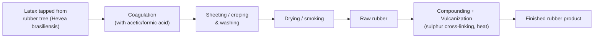
Latex is tapped, coagulated, sheeted/washed, dried (often smoke-dried), then the raw
rubber is compounded with additives and **vulcanised** (cross-linked with sulphur
under heat and pressure) to obtain useful elastic, durable rubber products.

#### Q6(c) [2016] Galvanizing vs vulcanizing

| Aspect | Galvanizing | Vulcanizing |
|---|---|---|
| Applies to | Steel/iron | Rubber |
| Process | Coating with zinc (hot-dip or electro-) | Cross-linking rubber with sulphur under heat |
| Purpose | Corrosion protection | Improve strength, elasticity, durability of rubber |
| Mechanism | Sacrificial metallic coating | Chemical cross-linking of polymer chains |

---

## 2015 Examination

### Part A

#### Q1(a) [2015] Toughness, creep, fatigue and fracture

Creep, fatigue: [2024 Q2(a)/(c)](#q2a-2024-define-ductility-fatigue-and-resilience).
**Toughness** — ability of a material to absorb energy and deform plastically before
fracturing (area under the stress-strain curve); combines strength and ductility.
**Fracture:** see [2023 Q4(a)](#q4a-2023-fracture-ductile-vs-brittle).

#### Q1(b) [2015] Seven crystal systems

| System | Axial lengths | Axial angles |
|---|---|---|
| Cubic | $a=b=c$ | $\alpha=\beta=\gamma=90°$ |
| Tetragonal | $a=b\ne c$ | $\alpha=\beta=\gamma=90°$ |
| Orthorhombic | $a\ne b\ne c$ | $\alpha=\beta=\gamma=90°$ |
| Rhombohedral (trigonal) | $a=b=c$ | $\alpha=\beta=\gamma\ne90°$ |
| Hexagonal | $a=b\ne c$ | $\alpha=\beta=90°,\ \gamma=120°$ |
| Monoclinic | $a\ne b\ne c$ | $\alpha=\gamma=90°\ne\beta$ |
| Triclinic | $a\ne b\ne c$ | $\alpha\ne\beta\ne\gamma\ne90°$ |

#### Q1(c) [2015] Elongation — numerical

**Given:** $L=1$ m, cross-section $20\times20$ mm, $P=40$ kN, $E=200$ GPa.

$A=20\times20=400\ \text{mm}^2=4\times10^{-4}\ \text{m}^2$

$\sigma=P/A=\dfrac{40\times10^3}{4\times10^{-4}}=1.0\times10^8\ \text{Pa}=100\ \text{MPa}$

$\delta=\dfrac{PL}{AE}=\dfrac{40\times10^3\times1}{4\times10^{-4}\times200\times10^9}=\dfrac{40000}{8\times10^{7}}=5\times10^{-4}\ \text{m}$

**Answer:** $\sigma=100$ MPa, elongation $\delta=0.5$ mm.

#### Q2(a) [2015] Ferrous, non-ferrous and pure metals

- **Ferrous metal** — an alloy in which **iron** is the main constituent, e.g. steel,
  cast iron, wrought iron.
- **Non-ferrous metal** — a metal/alloy **without iron** as the main constituent,
  e.g. aluminium, copper, brass, bronze, titanium.
- **Pure metal** — a metal consisting of essentially one element with only trace
  impurities, e.g. pure copper (electrical wire), pure aluminium (foil).

#### Q2(b) [2015] Classification of cast iron

Same as [2017 Q5(b)](#q5b-2017-types-of-cast-iron).

#### Q2(c) [2015] Advantages of nickel as an alloying element

Increases toughness and impact strength (especially at low temperature), increases
hardenability, improves corrosion resistance, stabilises austenite (key in austenitic
stainless steels), improves strength without much loss of ductility — see also
[2024 Q4(c)](#q4c-2024-effects-of-alloying-elements).

#### Q3(a) [2015] Corrosion vs erosion

| Aspect | Corrosion | Erosion |
|---|---|---|
| Nature | Chemical/electrochemical attack | Mechanical wearing away (by fluid flow, particles, cavitation) |
| Driven by | Reaction with environment (moisture, O₂) | Physical/mechanical action |
| Often combined as | "Erosion-corrosion" where flow removes protective films, accelerating chemical attack | |

**Causes of corrosion & control methods:** see
[2024 Q3(c)](#q3c-2024-classification-of-corrosion-and-prevention).

#### Q3(b) [2015] Metallic structure and atomic arrangement

Same theme as [2022 Q2(a)](#q2a-2022-crystal-structure-and-crystal-defects) — most
metals crystallise as BCC, FCC or HCP; see
[Fig. unit cells](../../assets/materials-science/unit-cells-sc-bcc-fcc.svg) for BCC and
FCC atom arrangements.

#### Q3(c) [2015] Galvanizing vs vulcanizing

Same as [2016 Q6(c)](#q6c-2016-galvanizing-vs-vulcanizing).

### Part B

#### Q4(a) [2015] High-speed steel: properties and uses

Same as [2017 Q5(a)](#q5a-2017-mild-steel-and-high-speed-steel) (HSS portion).

#### Q4(b) [2015] Types of annealing

Same as [2020 Q5(b)](#q5b-2020-types-of-annealing).

#### Q4(c) [2015] Stainless steel: composition and application

**Composition (typical austenitic 18-8):** ~18 % Cr, ~8 % Ni, ≤0.08 % C, balance Fe
(see also [2022 Q5(c)](#q5c-2022-chromium-nickel-steel-and-manganese-steel)).
**Applications:** kitchen equipment & cutlery, chemical & food-processing plant,
surgical instruments & implants, architectural cladding, marine fittings.

#### Q5(a) [2015] Hardness measuring methods; Brinell test

Methods: see [Quick Reference](#quick-reference) table (Brinell, Rockwell, Vickers).
Brinell procedure: [2024 Q4(b)](#q4b-2024-brinell-hardness-test-procedure).

#### Q5(b) [2015] Ferrous/non-ferrous metals; types of cast iron by carbon %

Ferrous/non-ferrous: see [Q2(a) above](#q2a-2015-ferrous-non-ferrous-and-pure-metals).
Cast-iron types: [2017 Q5(b)](#q5b-2017-types-of-cast-iron); by approximate carbon %:
white CI ~2.5–3.5 %C (combined), grey CI ~2.5–4 %C (mostly free/graphitic), nodular
CI ~3–4 %C, malleable CI ~2–2.9 %C.

#### Q5(c) [2015] Crystal structure and crystal defect

Same as [2022 Q2(a)](#q2a-2022-crystal-structure-and-crystal-defects).

#### Q6(a) [2015] Industrial uses of a good lubricant

Same functions/properties as [2024 Q6(c)](#q6c-2024-functions-and-properties-of-lubricants);
industrially used in engine oils, gear oils, hydraulic fluids, bearing greases,
cutting fluids (machining), and metal-forming lubricants.

#### Q6(b) [2015] Injection moulding process

Same as [2021 Q8(a)](#q8a-2021-polymer-and-injection-molding).

#### Q6(c) [2015] Rubber: definition, properties, uses

**Rubber** — a natural or synthetic elastomeric polymer capable of large, reversible
elastic deformation after vulcanization (cross-linking).
**Properties:** high elasticity/resilience, good abrasion & tear resistance (varies
by type), low thermal/electrical conductivity, can be compounded for oil/heat/
chemical resistance.
**Uses:** vehicle tyres, seals & gaskets, hoses & belts, vibration mounts, footwear,
electrical insulation. Manufacture: see
[2016 Q6(b)](#q6b-2016-manufacture-of-natural-rubber).

---

## Notes on the Question Paper

Obvious typos in the original paper were interpreted as follows (silently, in the
answers above):

| As printed | Interpreted as |
|---|---|
| "thermostats are stronger than thermo plastics" (2023 Q6a, 2018 Q6a) | "thermosets" |
| "Frenkel and Schstky defects" (2024 Q6b) | "Schottky" |
| "causes of carrion" (2015 Q3a) | "corrosion" |
| "sinking of the Royal Titanic ship" (2021 Q3b) | "RMS Titanic" |
| "stress is limited to 120 MN·m²" (2017 Q3c) | "MN/m²" |
| "face-entered cubic structure" (2017 Q3b) | "face-centred cubic" |
| "specifie volume vs temperature" (2017 Q6b) | "specific volume" |
| "Esplain with diagram" (2017 Q7a) | "Explain" |
| "State Hook's law" (2016 Q2a) | "Hooke's law" |
| "bending strees" (2022 Q4a) | "bending stress" |

## Self-Check Summary

- **Questions answered vs total:** every sub-part of every question in every year
  (2015–2024), Part A and Part B, is answered above — **all sub-questions accounted
  for**, with repeats explicitly cross-linked per the
  [Repeated Questions Index](#repeated-questions-index) rather than re-derived.
- **Numericals:** all seven numerical problems were recomputed independently and
  match the verification values: 2024 Q1c (≈550 kN), 2024 Q8c (22.3 MPa /
  0.178 mm), 2023 Q1c / 2018 Q1c (7.18 g/cm³), 2020 Q1d (8.89 g/cm³), 2017 Q3c /
  2016 Q1c (119.4 mm), 2015 Q1c (100 MPa / 0.5 mm).
- **Figures:** every referenced `../../assets/materials-science/...svg` file was
  generated and is included in the delivered zip; every process/classification
  visual not built as an SVG is given as a Mermaid block inline.
- **Mermaid & LaTeX:** all Mermaid blocks use quoted node labels and only
  `flowchart` syntax (GitHub-supported); all math uses `$...$` / `$$...$$`.
- **Cross-references:** repeated-question links were checked against the heading
  anchors actually used in each section.
- **Data consistency:** Fe–Fe₃C values, APF values/derivations, and mechanical
  property ranges are used consistently throughout, matching the fixed reference
  data in the Quick Reference section.

## Assets

| File | Shows | Generated / Sourced |
|---|---|---|
| `stress-strain-mild-steel.svg` | Stress-strain curve of mild steel, labelled points | Generated (matplotlib) |
| `force-extension-ductile-brittle.svg` | Force-extension curves, ductile vs brittle | Generated (matplotlib) |
| `sn-curve-ferrous-nonferrous.svg` | S-N fatigue curves, ferrous vs non-ferrous | Generated (matplotlib) |
| `creep-curve.svg` | Typical creep curve, 3 stages | Generated (matplotlib) |
| `dbtt-curve.svg` | Ductile-brittle transition (Charpy) curve | Generated (matplotlib) |
| `unit-cells-sc-bcc-fcc.svg` | SC, BCC, FCC unit cells with atom positions | Generated (matplotlib) |
| `miller-111-plane.svg` | (111) plane in a cubic unit cell | Generated (matplotlib) |
| `specific-volume-temperature-glass.svg` | Specific volume vs T: crystalline vs glassy, $T_g$/$T_m$ | Generated (matplotlib) |
| `frenkel-schottky-defects.svg` | Schottky (vacancy pair) & Frenkel (interstitial) defects | Generated (matplotlib) |
| `fe-fe3c-diagram.svg` | Fe–Fe₃C equilibrium diagram, all reactions labelled | Generated (matplotlib, schematic) |
| `quenching-cooling-curve.svg` | 3-stage quenching cooling curve | Generated (matplotlib) |
| `heat-treatment-cycles.svg` | Annealing/normalizing/hardening T-t cycles | Generated (matplotlib) |
| `brinell-rockwell-test.svg` | Brinell & Rockwell indentation test set-ups | Generated (matplotlib) |
| `blast-furnace.svg` | Blast-furnace reaction zones | Generated (matplotlib) |
| `galvanic-cell.svg` | Galvanic corrosion cell (Zn anode / Cu cathode) | Generated (matplotlib) |

**Items marked "(verify)":** none — all numerical values and constants used are
either taken directly from the question papers or are the standard textbook
constants stated in the Quick Reference section (atomic weights, $N_A$, Fe–Fe₃C
transformation temperatures/compositions). *Typical mechanical-property ranges*
(mild steel, high-carbon steel, etc.) are explicitly flagged as "typical" in the
text since exact values vary by grade/standard.
