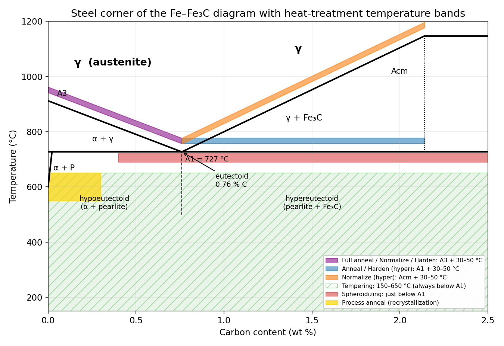
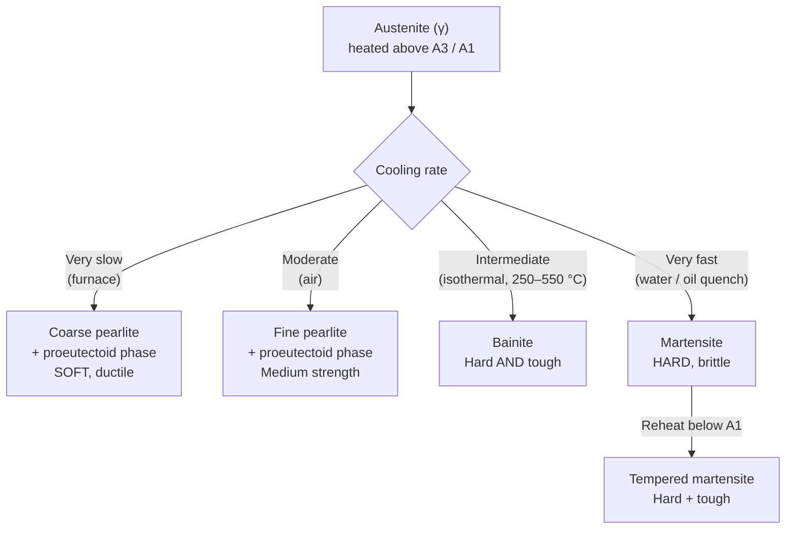
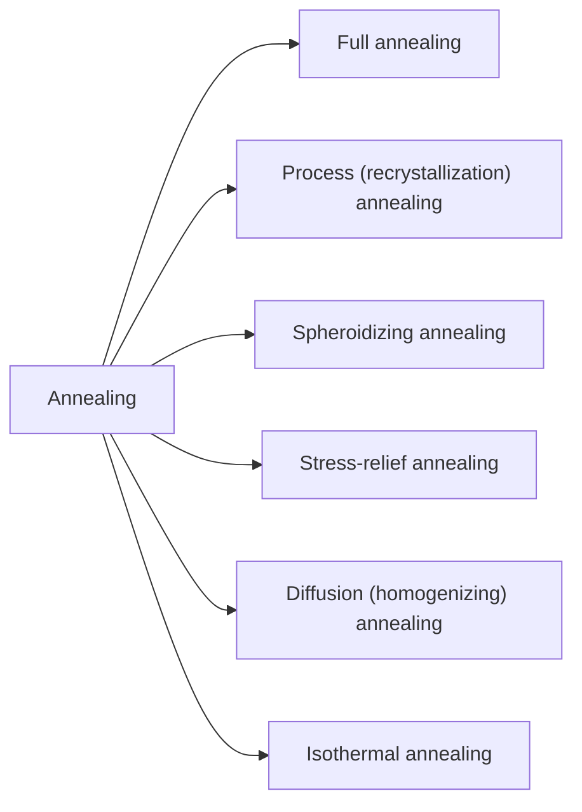
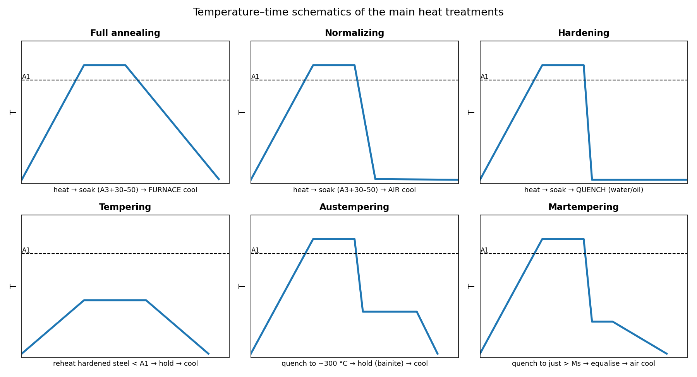
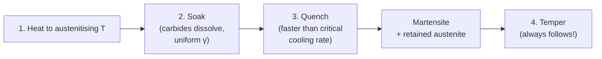
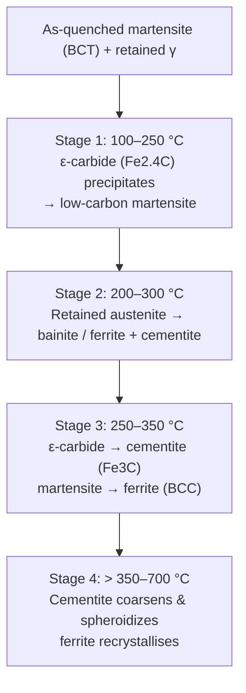
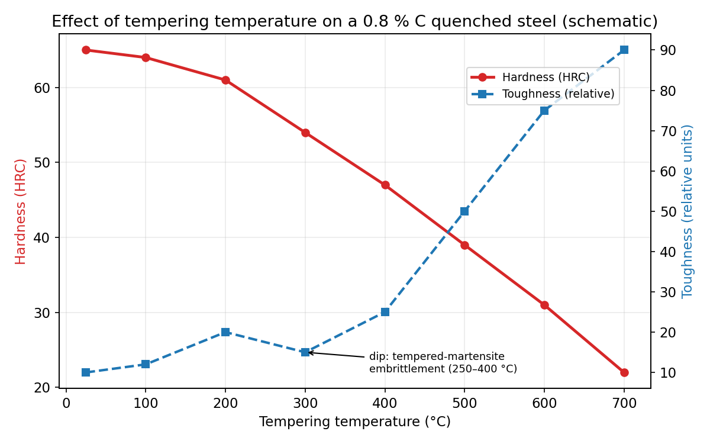
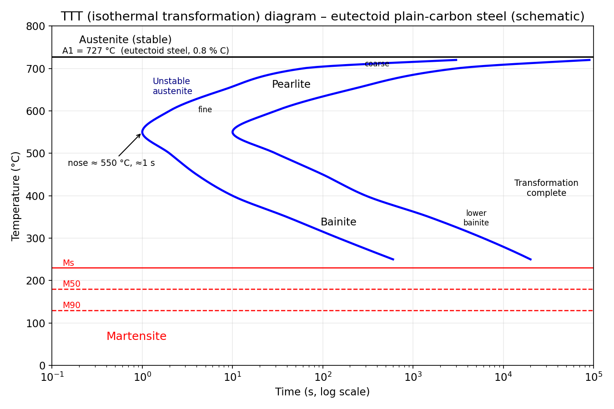
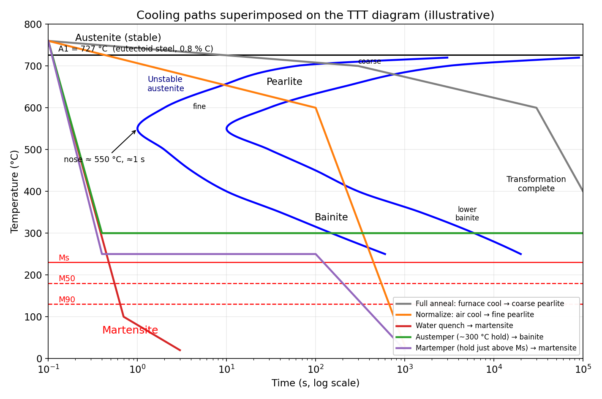

# 🔥 Heat Treatment of Steels — Exam Preparation Guide

> **Scope:** Annealing · Normalizing · Hardening · Tempering · TTT diagram
> **Goal:** Be able to (1) define each process, (2) give temperatures, cooling rates and resulting microstructures, (3) draw the diagrams, and (4) compare processes — the four things examiners ask for most.

## 📑 Contents

1. [Foundation: the Fe–Fe₃C diagram and critical temperatures](#1-foundation-the-fefe₃c-diagram-and-critical-temperatures)
2. [Annealing](#2-annealing)
3. [Normalizing](#3-normalizing)
4. [Hardening](#4-hardening-quench-hardening)
5. [Tempering](#5-tempering)
6. [TTT diagram](#6-ttt-time-temperature-transformation-diagram)
7. [Master comparison and exam quick-fire](#7-master-comparison-table)
8. [Practice problems](#8-practice-problems-with-collapsible-solutions)
9. [Last-minute revision sheet](#9-last-minute-revision-sheet)

---

## 1. Foundation: the Fe–Fe₃C diagram and critical temperatures

Every heat treatment of plain-carbon steel is defined relative to three **critical lines**:

| Symbol | Meaning | Value |
|---|---|---|
| **A₁** | Eutectoid line: austenite ⇌ ferrite + cementite | **727 °C** (constant) |
| **A₃** | Upper limit of ferrite; ferrite → austenite completes (hypoeutectoid steels) | 912 °C at 0 % C → 727 °C at 0.76 % C |
| **A꜀ₘ** | Upper limit of cementite; cementite dissolves completely (hypereutectoid steels) | 727 °C at 0.76 % C → 1147 °C at 2.14 % C |

Key composition points: **0.022 %** max C in ferrite · **0.76 %** eutectoid · **2.14 %** max C in austenite · **6.67 %** cementite (Fe₃C).

*Figure 1 — Where each treatment "lives" on the diagram. Memorise the coloured bands; they answer "what is the heating temperature for ...?" questions.*

**Handy relation for A₃ (hypoeutectoid steels)** — the A₃ line is straight, so:

$$
A_3 \approx 912 - 243.4\,\times\,(\%C)\ \ [^\circ\text{C}]
$$

### What happens when austenite is cooled? (the big picture)

**Rule of thumb:** *the faster the cooling, the finer the structure and the harder the steel.*

### Microstructure cheat-sheet

| Microstructure | Nature | Approx. hardness | Formed by |
|---|---|---|---|
| Coarse pearlite | Thick α/Fe₃C lamellae | ~ 15–20 HRC (≈ 200 HV) | Slow cooling (annealing) |
| Fine pearlite | Thin lamellae | ~ 30–40 HRC | Air cooling / just above the TTT nose |
| Upper bainite | Feathery; carbides between ferrite laths | ~ 40–45 HRC | Isothermal ≈ 350–550 °C |
| Lower bainite | Needle-like; carbides *inside* ferrite plates | ~ 50–58 HRC | Isothermal ≈ 250–350 °C |
| Martensite | Supersaturated BCT solid solution, diffusionless | ~ 55–67 HRC | Quenching below Mₛ |
| Tempered martensite | Ferrite + fine carbides | 60 → 25 HRC (depends on temper T) | Tempering |
| Spheroidite | Round Fe₃C particles in ferrite | Softest, best machinability | Spheroidizing anneal |

---

## 2. Annealing

### Definition
Heating steel to a suitable temperature, **soaking** it, and **cooling very slowly (usually in the furnace)** to obtain a soft, stress-free, equilibrium-like structure.

### Objectives
- Soften the steel and improve **ductility** and **machinability**
- **Relieve internal stresses** (from casting, welding, forging, cold work)
- **Refine grain size** and homogenise composition
- Prepare the steel for subsequent hardening

### Types of annealing

| Type | Temperature | Cooling | Result / purpose | Applied to |
|---|---|---|---|---|
| **Full annealing** | **Hypo:** A₃ + 30–50 °C (fully austenitic) **Hyper:** A₁ + 30–50 °C (*not* above A꜀ₘ) | **Furnace cool** (≈ 10–30 °C/h) | Coarse pearlite (+ ferrite or Fe₃C); soft, ductile, refined grains | Castings, forgings, medium-C steels |
| **Process annealing** (sub-critical) | **550–650 °C** (below A₁) | Air or furnace | Recrystallization of cold-worked ferrite; restores ductility; **no phase change** | Cold-drawn/rolled low-C steel sheet, wire |
| **Spheroidizing** | ≈ **650–700 °C** (just below A₁) for many hours, *or* cycling ± 30 °C around A₁ | Slow | Lamellar Fe₃C → **spheroids** in ferrite; best machinability & cold-formability | High-carbon / tool steels (> 0.6 % C) |
| **Stress-relief** | 500–650 °C | Slow | Removes residual stress; **no microstructural change** | Welded/machined parts |
| **Diffusion (homogenizing)** | 1000–1200 °C, long soak | Slow | Removes chemical segregation (coring) | Ingots, alloy-steel castings |
| **Isothermal annealing** | A₃ + 30–50 °C → rapid cool to ≈ 600–680 °C → hold until transformation is complete → air cool | — | Same as full anneal but **faster** and more uniform | Alloy steels (uses the TTT diagram!) |

### Why must hypereutectoid steel *not* be heated above A꜀ₘ for annealing?
Cooling slowly from above A꜀ₘ lets cementite precipitate as a **continuous brittle network on grain boundaries**. Heating only to A₁ + 30–50 °C keeps the cementite as discrete particles.

### Full-anneal recipe (soak time)
Rule of thumb: **≈ 1 hour per 25 mm of section thickness** after the part reaches temperature.

*Figure 2 — Thermal cycles. Compare the cooling slopes: anneal (flattest) < normalize < quench (steepest).*

---

## 3. Normalizing

### Definition
Heating **above the upper critical temperature**, soaking, then **cooling in still air**.

### Temperature
| Steel | Normalizing temperature |
|---|---|
| Hypoeutectoid | **A₃ + 30–50 °C** |
| Hypereutectoid | **A꜀ₘ + 30–50 °C** (fully austenitic; dissolves the cementite network) |

### Purpose
- **Refine grain size** (finer than annealed)
- Break up cast/forged/rolled **segregation and banding**
- Dissolve the **cementite network** in hypereutectoid steels
- Produce **uniform, predictable properties**; often the final treatment for structural steels
- Improve machinability of low-carbon steels (annealed low-C steel is *too soft and gummy*)

### Result
**Fine pearlite** (+ a small amount of proeutectoid ferrite/cementite) → **higher strength and hardness than annealing**, with good toughness.

### Normalizing vs full annealing ⭐ (very common 5-mark question)

| Feature | Full annealing | Normalizing |
|---|---|---|
| Cooling medium | **Furnace** | **Still air** |
| Cooling rate | Very slow | Faster (~ 10–100 °C/min-scale) |
| Microstructure | **Coarse** pearlite | **Fine** pearlite |
| Hardness / strength | Lower | **Higher** |
| Ductility | Higher | Slightly lower |
| Grain size | Larger | **Smaller** |
| Hypereutectoid heating | A₁ + 30–50 °C | **A꜀ₘ + 30–50 °C** |
| Cost & time | Costly, slow (furnace tied up) | Cheaper, faster |
| Typical aim | Maximum softness / machinability | Uniform, refined, stronger structure |

### Section-size effect
Thin sections cool faster in air → harder; thick sections cool slower → softer core. This **mass effect** makes normalized properties depend on thickness.

---

## 4. Hardening (Quench hardening)

### Definition
Heating steel to the **austenitising temperature**, soaking, and **quenching fast enough to avoid pearlite/bainite** so austenite transforms to **martensite**.

### Process steps

### Hardening temperatures

| Steel | Austenitising temperature | Why |
|---|---|---|
| Hypoeutectoid (< 0.76 % C) | **A₃ + 30–50 °C** | All ferrite must become austenite; leftover soft ferrite would give *soft spots* |
| Hypereutectoid (> 0.76 % C) | **A₁ + 30–50 °C** (**not** above A꜀ₘ) | Undissolved Fe₃C particles are hard → improve wear resistance; avoids coarse grains, excessive retained austenite and quench cracks |

### Martensite: the essentials
- **Diffusionless, shear (displacive)** transformation — no change in composition; extremely fast (≈ speed of sound in steel)
- Carbon is trapped in octahedral sites → **body-centred tetragonal (BCT)** lattice, c/a rises with %C
- Very hard because of lattice **distortion**, high dislocation density, fine plates and carbon solid-solution strengthening
- Forms **over a temperature range** Mₛ → M_f — not at a single temperature; depends only on temperature, *not* time (athermal)
- **Volume expansion** (~ 4 %) → residual stress, distortion, **quench cracks**
- Lath martensite (< 0.6 % C) vs plate martensite (> 1 % C); plate type is more brittle and shows microcracks

**Approximate Mₛ (Andrews, wt %, °C):**

$$
M_s = 539 - 423\,C - 30.4\,Mn - 17.7\,Ni - 12.1\,Cr - 7.5\,Mo
$$

Higher carbon → lower Mₛ → for > ≈ 0.6 % C, M_f falls below room temperature → **retained austenite** remains (soft, unstable; fix with sub-zero treatment or tempering).

### Maximum hardness depends on carbon

| % C | ≈ Max hardness as fully-martensitic (HRC) |
|---|---|
| 0.2 | ~ 44 |
| 0.4 | ~ 57 |
| 0.6 | ~ 64 |
| 0.8+ | ~ 65–67 (flattens; retained austenite grows) |

> 💡 Carbon controls **how hard** the martensite can get; alloying elements control **how deep** it hardens (hardenability).

### Quenching media (fastest → slowest, in general)

| Medium | Severity | Notes |
|---|---|---|
| **Brine** (5–10 % NaCl) | Highest | Breaks the vapour blanket; higher cracking risk |
| **Water** | Very high | For plain-carbon steels; distortion/cracks in complex shapes |
| **Caustic soda solution** | Very high | Very severe |
| **Oil** | Moderate | Alloy steels; lower cracking risk |
| **Polymer solutions** | Adjustable | Between water and oil |
| **Molten salt** | Mild, controllable | Used for austempering/martempering |
| **Air** | Lowest | Only for high-hardenability (air-hardening) steels |

**Three stages of quenching:** (1) **vapour blanket** — slow; (2) **nucleate boiling** — fastest; (3) **convection/conduction** — slow. Cracking risk is greatest around Mₛ, so cooling should be *slow through the martensite range*.

### Hardness vs hardenability ⭐

| Term | Meaning |
|---|---|
| **Hardness** | Resistance to indentation; max hardness ∝ carbon in martensite |
| **Hardenability** | *Ability to form martensite to depth*; measured by **Jominy end-quench test** |
| **Critical cooling rate** | Slowest cooling rate that gives 100 % martensite (just misses the TTT nose) |
| **Alloying effect** | Mn, Cr, Mo, Ni, B (except Co) shift the TTT curves right → lower critical rate → deeper hardening |

### Hardening defects and remedies

| Defect | Cause | Remedy |
|---|---|---|
| Quench cracks | Thermal + transformation stresses, sharp corners | Milder quench, uniform sections, fillets, immediate tempering |
| Distortion / warping | Non-uniform cooling | Fixtures, press quench, martempering |
| Soft spots | Vapour pockets, scale, undissolved ferrite | Agitation, clean surface, correct temperature |
| Decarburization | Carbon loss in oxidizing atmosphere | Protective/controlled atmosphere, salt bath |
| Retained austenite | Low Mₛ/M_f in high-C or alloy steel | Sub-zero treatment (−80 °C), tempering |
| Grain growth | Overheating | Do not exceed A₃/A₁ + 50 °C |

---

## 5. Tempering

### Definition
**Reheating hardened (martensitic) steel to a temperature below A₁**, holding, and cooling — to **trade some hardness for toughness** and relieve quench stresses.

> As-quenched martensite is hard but too brittle and stressed for use. **Hardening is never left without tempering.**

### Stages of tempering

*Alloy steels (Cr, Mo, V, W) show **secondary hardening** at ≈ 500–600 °C: fine alloy carbides precipitate and hardness rises again.*

*Figure 3 — As tempering temperature rises, hardness falls steadily and toughness rises — except for the embrittlement dip.*

### Tempering ranges and applications

| Temp. range | Structure | Hardness (HRC) | Properties | Typical use |
|---|---|---|---|---|
| **150–250 °C** | Tempered martensite (fine ε-carbide) | 58–65 | Very hard, wear resistant; stress relief | Cutting tools, files, gauges, bearings |
| **250–350 °C** | Tempered martensite | 50–55 | Hard with some toughness | Punches, chisels, springs (low end) |
| **350–500 °C** | Troostite (fine ferrite + cementite) | 40–50 | High strength + **high elastic limit** | **Springs**, hammers, shear blades |
| **500–650 °C** | Sorbite (coarser cementite) | 25–35 | Best **toughness**, moderate strength | Shafts, axles, gears, bolts (**"quench & temper" / "hardening & tempering"**) |
| **650–700 °C** | Spheroidised carbides | < 22 | Soft, tough | Machinability improvement |

*(Older textbooks name these structures **troostite** and **sorbite**; modern names are "tempered martensite" for both.)*

### Tempering embrittlement ⭐ (frequent short-note topic)

| Type | Range | Cause | Reversible? | Avoid by |
|---|---|---|---|---|
| **Tempered-martensite embrittlement (TME / "500 °F embrittlement")** | 250–400 °C | Cementite films on lath boundaries; segregated P; decomposition of retained γ | **No** (irreversible) | Don't temper in this range; use Si-alloyed steels |
| **Temper embrittlement (reversible)** | 375–575 °C, or slow cooling through it | Segregation of P, Sb, Sn, As to prior-austenite grain boundaries (+ Mn, Cr, Ni make it worse) | **Yes** — reheat >600 °C and quench | Cool rapidly from temper temperature; add ~0.5 % Mo; use low-impurity steel |

### Tempering parameter (Hollomon–Jaffe)
Time and temperature are interchangeable — the same hardness is reached by a *lower T / longer t* or a *higher T / shorter t*:

$$
P = T\,(C + \log_{10} t)\qquad\text{with } T \text{ in K},\ t \text{ in hours},\ C \approx 20
$$

Two treatments with the same **P** give the same hardness.

### Related processes
- **Austempering** → bainite instead of martensite (no separate temper needed)
- **Martempering (marquenching)** → martensite with much lower distortion, then temper
- **Sub-zero (cryogenic) treatment** → converts retained austenite before tempering
- **Ausforming** → deform metastable austenite before quenching (ultra-high strength)

---

## 6. TTT (Time–Temperature–Transformation) diagram

### What it is
A plot of **temperature (y)** versus **log time (x)** showing **how long austenite takes to transform** when held **isothermally** at a constant temperature below A₁. Also called the **isothermal transformation (IT) diagram**, **C-curve** or **S-curve**.

### How it is made
1. Many small samples are austenitised together.
2. Each is rapidly moved to a salt bath held at a chosen temperature *T₁, T₂, T₃ ...*
3. Samples are removed after different times and quenched in water.
4. Microscopy/dilatometry/hardness show how much has transformed (start ≈ 1 %, finish ≈ 99 %).
5. Start and finish points from all temperatures are joined to give the two curves.

### The diagram (eutectoid steel, 0.8 % C)

*Figure 4 — Redraw this in the exam: A₁ line, two C-curves (start and finish), the nose, bainite region, Mₛ/M₅₀/M₉₀ lines.*

### Reading the diagram

| Region / feature | Meaning |
|---|---|
| Above A₁ (727 °C) | Austenite is stable; no transformation |
| Left of the "start" curve | **Unstable (supercooled) austenite** — no transformation yet |
| Between start and finish curves | Austenite is **partly** transformed |
| Right of the "finish" curve | **100 % transformed** |
| **Nose (≈ 550 °C, ≈ 1 s)** | Shortest incubation time; austenite is **least stable**; determines the critical cooling rate |
| **727 → ≈ 550 °C** | **Pearlite.** Higher T (near 700 °C) → *coarse* pearlite (low nucleation, fast diffusion, thick lamellae); lower T (≈ 600 °C) → *fine* pearlite (higher hardness) |
| **≈ 550 → ≈ 250 °C** | **Bainite.** Upper bainite (≈ 350–550 °C), lower bainite (≈ 250–350 °C); diffusion-limited, carbon partitions |
| **Mₛ ≈ 230 °C** (for 0.8 % C) | Martensite starts (horizontal line) — **independent of time** |
| **M₅₀, M₉₀** | 50 % / 90 % martensite formed |
| **M_f** | Martensite finishes (may be below 0 °C in high-C steels) |

**Why C-shaped?** Two competing factors:
- **Driving force** (undercooling below A₁) *increases* as T falls → nucleation faster.
- **Atomic diffusion** *decreases* as T falls → growth slower.
The product of the two is fastest at the intermediate temperature — the **nose**.

### Cooling paths on the TTT diagram

*Figure 5 — Illustrative cooling paths. Strictly, a TTT diagram applies only to isothermal holds; continuous-cooling paths are shown to explain the concept (real continuous cooling uses a **CCT** diagram).*

| Path | Microstructure | Related treatment |
|---|---|---|
| Very slow (furnace) | Coarse pearlite | **Full annealing** |
| Moderate (air) | Fine pearlite | **Normalizing** |
| Rapid, misses the nose, reaches Mₛ | **Martensite** | **Hardening** |
| Quench to ≈ 300 °C, hold until finished | **Lower bainite** | **Austempering** |
| Quench to just above Mₛ, hold, then air cool | Martensite (low distortion) | **Martempering** |
| Quench to ≈ 650 °C, hold until complete | Pearlite | **Isothermal annealing** |

### Critical cooling rate
The **slowest cooling rate** that just avoids the nose and gives **fully martensitic** structure. Approximate straight-line estimate:

$$
\text{CCR} \approx \frac{T_{\text{austenitise}} - T_{\text{nose}}}{t_{\text{nose}}}
$$

Example: from 760 °C to 550 °C in ≈ 1 s → CCR ≈ 210 °C/s (in practice, ~ 140 °C/s for eutectoid steel from published diagrams).

### Factors that shift the TTT curves

| Factor | Curve shift | Consequence |
|---|---|---|
| Alloying elements (Mn, Ni, Cr, Mo, Si, W, V) — **except Co** | **Right** (and often reshape into separate pearlite and bainite noses) | Lower critical rate → **higher hardenability** |
| Increasing carbon (up to eutectoid) | Right | Easier hardening |
| Coarser austenite grain size | Right | Higher hardenability, but poorer toughness |
| Homogeneous austenite (undissolved carbides absent) | Right | — |
| Co | **Left** | Reduces hardenability |
| Hypo-/hypereutectoid composition | An **extra start curve** appears for proeutectoid ferrite / cementite | Extra "nose" on the left of the pearlite curve |

### TTT vs CCT

| | **TTT (IT)** | **CCT** |
|---|---|---|
| Cooling | Isothermal (constant temperature) | Continuous cooling |
| Curves position | Reference | Shifted **down and to the right** of TTT |
| Bainite in plain-C steel | Present | **Absent** (in eutectoid plain-C steels) |
| Practical use | Austempering, martempering, isothermal annealing | Real quenching, normalizing, welding HAZ |

### Exam-favourite TTT questions
1. Draw the TTT diagram for eutectoid steel and label all regions.
2. What is the critical cooling rate and how do alloying elements influence it?
3. Explain the formation of pearlite, bainite and martensite from the TTT diagram.
4. How does the TTT diagram help you design **austempering** and **martempering**?
5. Why is the TTT curve "C-shaped"?
6. Difference between TTT and CCT diagrams.

---

## 7. Master comparison table

| | **Annealing** (full) | **Normalizing** | **Hardening** | **Tempering** |
|---|---|---|---|---|
| **Aim** | Soften, relieve stress, refine | Refine grain, uniform structure | Maximum hardness/strength | Restore toughness, relieve stress |
| **Heat to** | Hypo: A₃+30–50 °C Hyper: A₁+30–50 °C | Hypo: A₃+30–50 °C Hyper: A꜀ₘ+30–50 °C | Hypo: A₃+30–50 °C Hyper: A₁+30–50 °C | **150–650 °C (< A₁)** |
| **Cooling** | Furnace | Still air | Water / oil / brine | Air / any (avoid slow cooling at 375–575 °C) |
| **Structure** | Coarse pearlite (+ ferrite/Fe₃C) | Fine pearlite | Martensite (+ retained γ) | Tempered martensite |
| **Hardness** | Lowest | Medium | Highest | Reduced from quenched value |
| **Ductility/toughness** | Highest ductility | Good | Very poor | Improved |
| **Internal stress** | Removed | Low | **Highest** | Reduced |
| **Enters austenite region?** | Yes | Yes | Yes | **No** |
| **TTT link** | Slow cooling path far right of nose | Path through pearlite region | Path left of nose → Mₛ | Uses martensite product |

### Fast recall table — "What is the temperature for ...?"

| Process | Temperature rule |
|---|---|
| Full anneal | A₃ + (30–50) °C (hypo) · A₁ + (30–50) °C (hyper) |
| Process anneal | 550–650 °C |
| Spheroidize | ≈ 650–700 °C (just under A₁) |
| Normalize | A₃ + (30–50) °C (hypo) · A꜀ₘ + (30–50) °C (hyper) |
| Harden | A₃ + (30–50) °C (hypo) · A₁ + (30–50) °C (hyper) |
| Temper | 150–650 °C (always < 727 °C) |

### Mnemonics 🧠
- **"Anneal = Almost forever in the furnace"** — furnace cooling. **"Normal = Naturally cooled in air."**
- **"Hyper-hardening stays half-way"**: hypereutectoid is heated only just above **A₁** (not A꜀ₘ) for annealing/hardening; only **normalizing** goes above A꜀ₘ.
- **Cooling speed ladder:** Furnace < Air < Oil < Water < Brine → Coarse P < Fine P < Bainite/Martensite.
- **Order of a "hardening job":** *Heat → Soak → Quench → Temper.* Never skip the last step.

---

## 8. Practice problems (with collapsible solutions)

### Problem 1 — Heating temperature
Find the full-annealing temperature for a 0.45 % C steel.

<b>Show solution</b>

$A_3 = 912 - 243.4(0.45) \approx 912 - 109.5 = 802.5\ ^\circ\text{C}$

Full annealing: $A_3 + (30\text{–}50) \approx$ **835–850 °C**, soak, then **furnace cool** → coarse pearlite + ferrite.

### Problem 2 — Phase fractions (lever rule)
A 0.4 % C steel is slowly cooled to just below 727 °C. Find the fractions of proeutectoid ferrite and pearlite.

<b>Show solution</b>

Proeutectoid ferrite (0.022 % C) and eutectoid composition (0.76 % C):

$$
W_{\alpha'} = \frac{0.76 - 0.40}{0.76 - 0.022} = \frac{0.36}{0.738} \approx 0.488 \;(48.8\%)
$$

$$
W_{\text{pearlite}} = 1 - 0.488 \approx 0.512 \;(51.2\%)
$$

### Problem 3 — Martensite start temperature
Estimate Mₛ for a steel with 0.6 % C and 0.8 % Mn (other alloying elements negligible). Will it retain austenite at room temperature?

<b>Show solution</b>

$M_s = 539 - 423(0.6) - 30.4(0.8) = 539 - 253.8 - 24.3 \approx 261\ ^\circ\text{C}$

M_f is typically ≈ 100–215 °C below Mₛ (≈ 50 → 160 °C here), so it is above/near room temperature — only a small amount of retained austenite is expected. As C and alloy content rise, Mₛ falls and retained austenite increases.

### Problem 4 — Tempering equivalence
A steel is tempered at 400 °C for 1 hour. How long at 500 °C gives the same hardness? (Use $C = 20$.)

<b>Show solution</b>

$P = 673\,(20 + \log 1) = 13\,460$

At 500 °C (773 K): $773\,(20 + \log t) = 13\,460 \Rightarrow 20 + \log t = 17.41 \Rightarrow \log t = -2.59$

$t \approx 2.6\times 10^{-3}\ \text{h} \approx$ **9 seconds**.

Shows how sensitive tempering is to temperature.

### Problem 5 — Concept questions

<b>a) Why is a hypereutectoid steel hardened from just above A₁ rather than above A꜀ₘ?</b>

Above A꜀ₘ all cementite dissolves, austenite grains coarsen, a large amount of high-carbon austenite is retained after quenching (soft), and the risk of quench cracking rises. Staying at A₁ + 30–50 °C keeps undissolved hard Fe₃C particles (wear resistance), a finer grain size, and less retained austenite.

<b>b) Which cooling path on the TTT diagram gives the toughest hard steel with the least distortion and no separate tempering?</b>

**Austempering**: quench to ≈ 250–350 °C (above Mₛ), hold until the austenite → lower bainite, then cool in air. Bainite gives good hardness with excellent toughness; no martensitic transformation stresses occur.

<b>c) Why does adding chromium or molybdenum make a steel easier to harden?</b>

These elements delay the diffusional decomposition of austenite — they shift the TTT "nose" to longer times. This lowers the critical cooling rate, so slower quenchants (oil, even air) can still yield martensite, and martensite forms to a greater depth (higher **hardenability**).

<b>d) A quenched steel cracked while waiting a day before tempering. Explain.</b>

As-quenched martensite carries very high residual stresses and is brittle; hydrogen and continued stress from retained-austenite transformation can cause **delayed (season) cracking**. Steel should be **tempered immediately** after quenching (while still warm, ≈ 50–70 °C).

---

## 9. Last-minute revision sheet

- ✅ **A₁ = 727 °C, eutectoid = 0.76 % C, A₃ (912 → 727 °C), A꜀ₘ (727 → 1147 °C).**
- ✅ **Annealing** → furnace cool → **coarse pearlite**, softest. **Normalizing** → air cool → **fine pearlite**, stronger. **Hardening** → quench → **martensite**. **Tempering** → reheat **below A₁** → tempered martensite.
- ✅ Hyper-eutectoid: heat to **A₁ + 30–50 °C** for anneal/harden, but **A꜀ₘ + 30–50 °C** to normalize.
- ✅ Martensite: **diffusionless, BCT, athermal**, ~4 % volume increase; Mₛ falls with carbon and alloying.
- ✅ Tempering: 150–250 °C tools · 350–500 °C springs · 500–650 °C toughness; avoid **250–400 °C (TME)** and **375–575 °C (reversible temper embrittlement)**.
- ✅ **TTT:** isothermal; C-shaped; nose ≈ 550 °C, ≈ 1 s; pearlite above nose (coarse → fine as T falls); bainite below the nose to Mₛ; martensite below Mₛ (horizontal, time-independent).
- ✅ Alloying (except Co) shifts the curves **right** → ↑ hardenability. **CCT is shifted down-right of TTT.**
- ✅ **Austempering** → bainite; **Martempering** → martensite with less distortion; **Isothermal annealing** → pearlite in less time.

---

## 🗂 Asset files used by this guide

Place these in `assets/` (the guide expects them at `../../assets/` relative to this file):

| File | Used in |
|---|---|
| `fe-fe3c-treatment-bands.png` | §1 |
| `heat-treatment-cycles.png` | §2 |
| `tempering-hardness-toughness.png` | §5 |
| `ttt-diagram-eutectoid.png` | §6 |
| `ttt-cooling-paths.png` | §6 |

> ⚠️ Figures are **schematic** for revision. Numbers (hardness, times, temperatures) are typical textbook values; use your course text's values when they differ.
