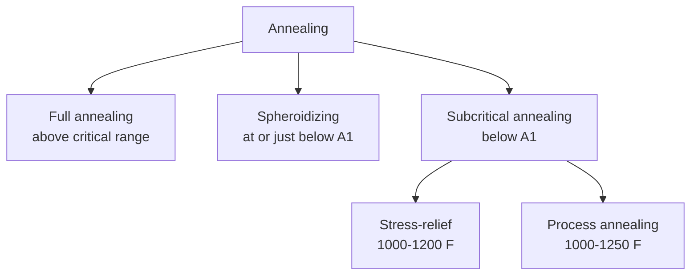
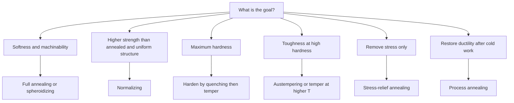

# IPE 101 — Heat Treatment of Steel: Comprehensive Exam Guide

> **Source:** Lecture slides by Dr. Md. Arifuzzaman (Dept. of Mechanical Engineering, KUET), 4 decks merged into one guide.
> **Covers:** Objectives → Annealing family → Normalizing → Hardening → Tempering → TTT diagrams → Austempering.
> **Figures:** cropped from the slides, stored in `../../assets/`.

---

## Table of Contents

1. [Scope: what was merged, added and dropped](#0-scope-what-was-merged-added-and-dropped)
2. [One-page quick revision sheet](#1-one-page-quick-revision-sheet)
3. [Fundamentals of heat treatment](#2-fundamentals-of-heat-treatment)
4. [Annealing family](#3-annealing-family)
5. [Normalizing](#4-normalizing)
6. [Hardening and martensite](#5-hardening-and-martensite)
7. [Tempering](#6-tempering)
8. [TTT (isothermal transformation) diagrams](#7-ttt-isothermal-transformation-diagrams)
9. [Cooling curves superimposed on a TTT diagram](#8-cooling-curves-superimposed-on-a-ttt-diagram)
10. [Austempering](#9-austempering)
11. [Master comparison tables](#10-master-comparison-tables)
12. [Exam question bank](#11-exam-question-bank)
13. [Numerical problems with full working](#12-numerical-problems-with-full-working)
14. [MCQs, True/False, Fill-in-the-blanks](#13-mcqs-truefalse-fill-in-the-blanks)
15. [Slide errors and common exam mistakes](#14-slide-errors-and-common-exam-mistakes)
16. [Mnemonics and reference tables](#15-mnemonics-and-reference-tables)

---

## 0. Scope: what was merged, added and dropped

| Action | Detail |
|---|---|
| **Merged** | Deck 2 repeats the *Hardening* and *Tempering* slides of Deck 1 and adds a *Tempering Summary* diagram, a bainite micrograph, and the `a = b < c` note. Both are combined into §5–§6. |
| **Merged** | Deck 3 (TTT part 1) and Deck 4 (TTT part 2 + Austempering) overlap on the 1080-steel TTT diagram; merged into §7–§9. |
| **Dropped** | Title slides, "Next class" slides, logos, repeated headers/footers, and duplicate slides. |
| **Added** (marked *[added]*) | Notation for critical temperatures (A₁, A₃, A_cm; c/r/e), °F→°C conversions, why the TTT curve is C-shaped, tetragonality formula, tempered-martensite embrittlement, temper-embrittlement remedy, hardening temperatures for hypereutectoid steel, martempering vs austempering, a short case-hardening preview, and the exam question bank. |
| **Corrected** | Typos and errors in the slides are listed in [§14](#14-slide-errors-and-common-exam-mistakes). |

> **Units:** the slides use °F throughout. Every key temperature is also given in °C:
> `°C = (°F − 32) × 5/9`.

---

## 1. One-page quick revision sheet

### 1.1 What each treatment does

| Treatment | Heat to | Cool | Product | Purpose |
|---|---|---|---|---|
| **Full annealing** | Above A₃ (hypo) / above A₁ (hyper) | *Very slowly* (furnace) | Coarse pearlite (+ ferrite or cementite) ≈ R/c 15 | Soften, refine grain, relieve stress, ↑ machinability |
| **Spheroidizing** | Just below or around A₁ (≈ 1200–1300 °F) | Very slow, or long hold | Spheroidite (globular cementite in ferrite) ≈ R/c 5–10 | Max softness, ductility, machinability (high-C steels) |
| **Stress-relief annealing** | Below A₁ (1000–1200 °F) | Slow | No phase change | Remove residual stress (machining, cold work) |
| **Process annealing** | Below A₁ (1000–1250 °F) | Slow | Recrystallized ferrite | Soften cold-worked sheet/wire for more working |
| **Normalizing** | ≈ 100 °F above upper critical | Still air | Fine pearlite | Harder/stronger than annealed; refine and homogenize |
| **Hardening** | Above critical range (austenitize) | Faster than critical cooling rate | Martensite ≈ R/c 64 (0.8 %C) | Maximum hardness |
| **Tempering** | Below A₁ (100–1333 °F) | Any (avoid temper-brittle range slowly) | Tempered martensite | Recover toughness/ductility, relieve stress |
| **Austempering** | Austenitize, quench into salt bath 400–800 °F, hold | Air | 100 % bainite | High toughness at high hardness, no separate temper |

### 1.2 Numbers worth memorizing

| Item | Value |
|---|---|
| Eutectoid carbon | 0.8 %C (hypo < 0.8 < hyper) |
| Lower critical A₁ (slide) | 1333 °F (≈ 723 °C) |
| Martensite (1080 steel) hardness | R/c 64 |
| Critical cooling rate for 1080 (summary slide) | > 250 °F/s |
| Nose of 1080 TTT curve | ≈ 1000 °F, ≈ 1 s |
| Ms for 1080 (slide TTT) | ≈ 400 °F (M₅₀ ≈ 330 °F, M₉₀ ≈ 230 °F, read from graph) |
| Tempering range in practice | 400–800 °F |
| Temper below … for hardness/wear | 400 °F |
| Temper above … for toughness | 800 °F |
| Residual stress mostly gone at | 400 °F; almost gone at 900 °F |
| Temper brittleness range (slide) | 1000–1250 °F, slow cooling |
| Austempering bath | 400–800 °F; section < 0.5 in |
| TTT experiment (slide) | Austenitize 1425 °F; salt bath 1300 °F |

---

## 2. Fundamentals of heat treatment

### 2.1 Definition

**Heat treatment** is a combination of heating and cooling operations, timed and applied to a metal or alloy in the **solid state** in a way that will produce desired properties.

### 2.2 Objectives *(6 points from the slides, a common 5–6 mark question)*

1. Relieve stresses set up by hot or cold working, to improve machining.
2. Improve mechanical properties: tensile strength, hardness, ductility, shock resistance.
3. Modify the structure to improve electrical and magnetic properties.
4. Increase quality of the metal: better resistance to heat, corrosion and wear.
5. Change grain size.
6. Stabilize the structure at elevated temperature.

### 2.3 Key principles

- **All basic heat treatments of steel involve the transformation or decomposition of austenite.**
- The **nature and appearance of the transformation products** determine the physical and mechanical properties of the steel.
- **Step 1 is always to heat into or above the critical range to form austenite.**
- The **rate of heating is not significant**, *but* highly stressed material should be heated slowly to avoid distortion.
- The Fe–Fe₃C equilibrium diagram is only reliable for **very slow cooling** (annealing). For faster cooling (normalizing, quenching) use the TTT/CCT diagram instead.

### 2.4 Critical-temperature notation *[added]*

The slides use A₁, A₃, A_cm, Ac₁, Ac₃, Ae₁ without defining them.

| Symbol | Meaning |
|---|---|
| **A₁** | Lower critical temperature: austenite ⇌ ferrite + cementite (eutectoid line) |
| **A₃** | Upper critical temperature for **hypoeutectoid** steel (ferrite → austenite complete) |
| **A_cm** | Upper critical temperature for **hypereutectoid** steel (cementite dissolved) |
| Subscript **c** (Ac₁) | Measured on **c**hauffage (heating); slightly above equilibrium |
| Subscript **r** (Ar₁) | Measured on **r**efroidissement (cooling); slightly below equilibrium |
| Subscript **e** (Ae₁) | **E**quilibrium value |

### 2.5 Temperature ranges for annealing, normalizing and hardening

*Fig. 1 — Temperature (°F) vs % carbon. The lower band is the **full annealing and hardening range**; the upper band is the **normalizing range** (≈ 100 °F higher).*

How to read it:

| Steel | Full annealing / hardening | Normalizing |
|---|---|---|
| **Hypoeutectoid** (< 0.8 %C) | Just above the **A₃** line | ≈ 100 °F above **A₃** |
| **Hypereutectoid** (> 0.8 %C) | Just above the **A₁** line (band goes flat) | Above **A_cm** |

> **Exam tip:** In the figure the band follows A₃ downward to 0.8 %C, then turns **horizontal above A₁** for hypereutectoid steels. This is the reason hypereutectoid steels are *not* heated above A_cm for annealing or hardening.

### 2.6 Proeutectoid constituents vs carbon content

*Fig. 2 — Below 0.8 %C the microstructure is **proeutectoid ferrite + pearlite**. Above 0.8 %C it is **proeutectoid cementite + pearlite**. At 0.8 %C it is 100 % pearlite.*

**Lever-rule shortcuts** (equilibrium, slow cooling only) *[added]*:

$$\%\ \text{pearlite (hypo)} = \frac{C_0 - 0.02}{0.80 - 0.02} \times 100 \qquad \%\ \text{proeutectoid cementite (hyper)} = \frac{C_0 - 0.80}{6.67 - 0.80} \times 100$$

---

## 3. Annealing family

### 3.1 Full annealing

**Definition:** heat the steel to the proper temperature (into austenite range) and **cool slowly** (in the furnace).

**Purposes (slides list both versions):**

- Soften the steel
- Relieve residual stress
- Refine the grain
- Improve electrical and magnetic properties
- Improve machinability
- Remove the effects of gas trapped in the metal during casting *(slide wording: "improve gas trapped")*

Because cooling is very slow, the structure follows the **iron–iron carbide (Fe–Fe₃C) equilibrium diagram** closely.

*Fig. 3 — Full annealing of a **coarse-grained 0.2 %C** hypoeutectoid steel.*

**Step-by-step reading of Fig. 3 (very common descriptive question):**

| Stage | Temperature | Structure |
|---|---|---|
| (a) Start | Room temperature | Coarse ferrite + coarse pearlite |
| (b) Reaching A₁ | 1333 °F | Pearlite transforms to **fine austenite grains**; ferrite remains |
| (c) Above A₃ | > A₃ (upper critical) | 100 % **fine-grained austenite** |
| (d) Slow cool to room temp. | Room temperature | **Fine ferrite + pearlite** (refined grains) |

**Why the grain is refined** *[added]*: two phase changes occur (α → γ on heating, γ → α + Fe₃C on cooling). Each nucleates many new small grains, so a coarse cast/forged structure becomes fine.

- Product: **coarse pearlite** ≈ R/c 15 (slowest-cooling path on the tempering-summary chart).
- Used mainly for **low- and medium-carbon (hypoeutectoid)** steels.

### 3.2 Spheroidizing (Spherodizing)

**Definition:** a process producing a **spheroidal/globular form of carbide in a ferrite matrix** to improve machinability.

**Three methods (slide list):**

1. **Prolonged holding** at a temperature *just below* the lower critical line.
2. **Cycling** (heating and cooling alternately) between temperatures *just above and just below* the lower critical line.
3. Heat *above* the lower critical line, then **cool very slowly in the furnace**, or hold just below the lower critical line.

**Mechanism and key facts:**

- Prolonged time at elevated temperature **completely breaks up the pearlitic structure and the cementite network**.
- Cementite becomes **spheres**, "the geometric shape in greatest equilibrium with its surroundings" (i.e. minimum surface area / interfacial energy for its volume).
- The cementite particles and the whole structure are called **spheroidite**.
- Desirable when **minimum hardness, maximum ductility and maximum machinability** are needed.
- **Low-carbon steels are seldom spheroidized** because they become **gummy** (too soft, tear instead of cut).
- **Over-holding** at the spheroidizing temperature makes cementite particles **elongated**, which *reduces* machinability.
- Typical conditions (tempering-summary chart): cooling at **30–50 °F/h** or holding at **1200–1300 °F**; hardness **R/c 5–10**.
- Usually applied to **high-carbon steels** (see slide summary).

> *Fig. 4 is intentionally not a spheroidite photo.* The spheroidite micrograph in the slides is the same picture used for the 1200–1333 °F tempering structure. Refer to Fig. 12 (§6) for the tempering-summary chart that lists spheroidized cementite. *(Image above shows the martensite needle structure for later comparison.)*

### 3.3 Stress-relief annealing (subcritical annealing)

- Carried out **below the lower critical temperature** (**1000–1200 °F**, ≈ 540–650 °C).
- Also called **subcritical annealing**.
- Useful in **removing residual stresses due to heavy machining or other cold-working processes**.
- No austenite forms → no grain refinement, little change in strength or hardness. *[added]*

### 3.4 Process annealing

- Used in the **sheet and wire industries**.
- Usually heating to **below the lower critical line** (**1000–1250 °F**, ≈ 540–675 °C).
- Applied **after cold working**; **softens the steel by recrystallization**, so it can be worked further.
- **Very similar to stress-relief annealing.**

### 3.5 Which annealing for which steel? (slide summary)

| Type | Typical steel | Result |
|---|---|---|
| Full annealing | Low/medium-carbon | Soft and ductile |
| Spheroidizing | High-carbon | Easier to machine |
| Process annealing | Low-carbon | Ductility restored after cold work |

### 3.6 Stress-relief vs process annealing *[added: likely "differentiate" question]*

| Point | Stress-relief annealing | Process annealing |
|---|---|---|
| Temperature | 1000–1200 °F | 1000–1250 °F |
| Main effect | Removes residual stress (recovery) | Recrystallization → softening |
| Applied after | Heavy machining, cold work (also welding) | Cold working (rolling, drawing) |
| Grain structure | Essentially unchanged | New strain-free grains |
| Main industries | General fabrication | Sheet and wire |
| Ductility restored | Slightly | Substantially |

---

## 4. Normalizing

### 4.1 Definition and procedure

Normalizing: heat to **≈ 100 °F above the upper critical temperature line** (A₃ for hypo, A_cm for hyper), then **cool in still air to room temperature**.

### 4.2 Purposes

- Produce a steel that is **harder and stronger than full-annealed steel**.
- Improve machinability.
- **Modify and refine cast dendritic structures.**
- **Refine the grain and homogenize the microstructure**, improving the response to a later hardening operation.
- Remove the cementite network in hypereutectoid steels. It reduces strength in annealed hypereutectoid steels; normalized steels show a strength increase.

### 4.3 Why is normalized steel harder? (a high-probability question)

1. Air cooling is **faster** than furnace cooling.
2. Less time for diffusion → **finer pearlite** with **closely spaced cementite plates**.
3. **Ferrite is very soft; cementite is very hard.** Many thin cementite plates block dislocation motion more effectively → higher hardness/strength.

*Fig. 5 — Annealed = **coarse lamellar pearlite** (wide ferrite/cementite spacing). Normalized = **medium (fine) lamellar pearlite** (closely spaced).*

**Example from the slides:** if annealed hardness is **R/c 10**, the normalized hardness is about **R/c 20**.

### 4.4 The 0.5 %C example — why the Fe–Fe₃C diagram fails

*Fig. 6 — 0.5 %C steel, air-cooled. White = ferrite network on prior-austenite grain boundaries; dark = fine pearlite.*

| Condition | Ferrite | Pearlite |
|---|---|---|
| **Annealed** (equilibrium, lever rule) | **38 %** | **62 %** |
| **Normalized** (air cooled) | only ≈ **10 %** | ≈ **90 %** (fine) |

- Faster cooling allows less time for proeutectoid ferrite to form, so more austenite transforms to pearlite. The Fe–Fe₃C diagram therefore **cannot be used to predict the proportion of ferrite and pearlite (or cementite and pearlite)** in normalized steel.

### 4.5 Grain refinement by normalizing

*Fig. 7 — (a) Coarse structure as cooled from a high forging temperature. (b) Refined structure of the same steel after normalizing.*

### 4.6 Annealing vs normalizing

| Aspect | Full annealing | Normalizing |
|---|---|---|
| Heating (hypo) | A₃ + 50 °F (approx.) | A₃ + ≈ 100 °F |
| Heating (hyper) | Above A₁ | Above A_cm |
| Cooling medium | Furnace (very slow) | Still air (moderate) |
| Structure | Coarse pearlite (+ ferrite) | Fine pearlite (+ less ferrite) |
| Hardness / strength | Lower | **Higher** (e.g. R/c 10 vs 20) |
| Ductility | Higher | Lower |
| Cost / time | Longer, costlier | Shorter, cheaper |
| Equilibrium diagram valid? | Yes (close) | **No** |
| Grain refinement | Good | Good; more uniform |
| Main aim | Softness, machinability, stress relief | Strength, uniformity, prepare for hardening |

---

## 5. Hardening and martensite

### 5.1 Why martensite forms (mechanism)

1. **Slow cooling:** carbon atoms can **diffuse out** of the austenite (FCC).
2. Iron atoms then rearrange slowly into **BCC** ferrite. The γ → α transformation is **time dependent**.
3. **Faster cooling** restricts carbon diffusion out of austenite.
4. Iron atoms still move a little, but the structure **cannot become BCC** with the carbon trapped.
5. The resultant structure is called **martensite**.

### 5.2 Structure of martensite

- A **supersaturated solid solution of carbon trapped in a body-centred tetragonal (BCT)** lattice.
- Two unit-cell dimensions are equal, the third is slightly larger due to trapped carbon: **a = b < c** (Deck 2).
- Tetragonality: c/a ≈ **1.04** as-quenched (slide graph). *[added]* Empirically `c/a ≈ 1 + 0.045 × (wt % C)`; e.g. 0.8 %C gives ≈ 1.036.
- The **highly distorted lattice** is the **prime reason for the high hardness**.
- The expansion during formation produces **high localized stress** → plastic deformation of the matrix.
- Micrograph appearance after drastic cooling: **needle-like (acicular)**.

*Fig. 8 — Martensite: fine needle/plate structure.*

### 5.3 Characteristics of martensite formation *(listed answer, 5 marks)*

1. **Diffusionless** transformation; **no change in chemical composition**.
2. Proceeds **only during cooling** and **stops if cooling is interrupted** — an **athermal** transformation (depends on temperature reached, not time).
3. Martensite is **not a condition of real equilibrium**, although it may persist indefinitely.
4. Its most significant property is the **potential for very great hardness**.
5. **Hardness increases with carbon content.**
6. Also seen in **Fe–Ni, Cu–Zn, Cu–Al** alloys (not just steel).

### 5.4 Hardening: aim and control

- **Basic purpose:** produce a **fully martensitic structure**.
- **Critical cooling rate (CCR):** the cooling rate at which the formation of soft products (pearlite, bainite) is just avoided.
- CCR depends on **chemical composition** and **austenitic grain size**.
- **Austenitic grain size** is very important because it indicates **how fast a steel must be cooled** to form only martensite. *(Coarse austenite grains → higher hardenability → lower CCR.)*
- Hardening is **always followed by tempering** (as martensite is brittle and highly stressed).

*[added]* **Hardening temperature:** hypoeutectoid steels are austenitized just above A₃; **hypereutectoid steels just above A₁** (band in Fig. 1). This keeps some hard cementite, avoids coarse austenite, and reduces retained austenite and cracking risk.

### 5.5 Austenite → martensite conversion is not complete at once

*Fig. 9 — Percent martensite vs temperature of quenching bath. Micrographs show more needles as the temperature falls.*

Read from the graph (approximate):

| Label | Meaning | Approx. temperature |
|---|---|---|
| **Ms** | Martensite start (~0 %) | ≈ 410 °F |
| **M₅₀** | 50 % martensite | ≈ 310 °F |
| **M₉₀** | 90 % martensite | ≈ 245 °F |
| **Mf** | Martensite finish (~100 %) | below ≈ 200 °F |

*[added]* If a quench stops between Ms and Mf, the remaining austenite is **retained austenite**. Higher carbon lowers Ms (compare Ms ≈ 400 °F for 0.8 %C in Fig. 15 with Ms ≈ 600 °F for 0.5 %C in Fig. 16).

---

## 6. Tempering

### 6.1 Why and what

- **Martensitic steel is too brittle for most applications**, and its formation **leaves high residual stresses**.
- Hence **hardening is always followed by tempering**.
- **Tempering:** heating hardened steel to a temperature **below the lower critical temperature**.
- **Purpose:** relieve residual stresses and improve **ductility and toughness**.
- Ductility is gained **at the sacrifice of hardness and strength**.
- **Hardness decreases and toughness increases as tempering temperature increases.**

### 6.2 Hardness and toughness vs tempering temperature

*Fig. 10 — Izod impact (ft·lb) and Rockwell C hardness vs tempering temperature (°F).*

What to say in the exam:

- **Hardness** falls steadily: ≈ R/c 60 at low temperatures to ≈ R/c 25 near 1300 °F.
- **Toughness** rises slowly to a small peak at ≈ 350 °F, then **dips (≈ 500–700 °F)**, and then **rises rapidly** above ≈ 800 °F to ≈ 85 ft·lb near 1200 °F.
- The curves cross near **900 °F** (≈ 480 °C).
- *[added]* The mid-range dip is **tempered-martensite (or "350 °C / 500 °F") embrittlement**. It is the reason to avoid tempering in ≈ 500–700 °F when toughness matters.

### 6.3 Rules of thumb (slides)

| If the principal property wanted is … | Temper … |
|---|---|
| **Hardness / wear resistance** | **Below 400 °F** |
| **Toughness** | **Above 800 °F** |
| Normal tempering range | **400–800 °F** |

- **Residual stresses:** mostly relieved by **400 °F**; almost gone by **900 °F**.

### 6.4 Temper brittleness

- A phenomenon where steel **loses notched-bar toughness** when **tempered at 1000–1250 °F (≈ 540–675 °C) followed by slow cooling**.
- **Toughness is retained if the part is quenched in water** from the tempering temperature.
- *[added]* Cause: segregation of impurities (P, Sb, Sn, As) to prior-austenite grain boundaries during slow cooling through this range. Alloying with Mo reduces the problem.

### 6.5 The four stages of tempering

| Stage | Temp. (°F) | Temp. (≈ °C) | Structure formed | Properties |
|---|---|---|---|---|
| **1** | **100–400** | 38–204 | **Black martensite** (etches dark). As-quenched BCT martensite begins to **lose tetragonality**; **HCP transition (epsilon) carbide** + **low-carbon martensite** form | Slight ↑ hardness (carbide precipitation); **high strength, high hardness, low ductility, low toughness**; residual stress relieved |
| **2** | **450–750** | 232–399 | **ε-carbide → orthorhombic cementite**; low-C martensite → **BCC ferrite**; **retained austenite → lower bainite**. Carbides too small for optical microscope; etches to a black mass formerly called **troostite** | Tensile strength ≈ **200,000 psi**; ductility slightly ↑; **toughness still low**; hardness **R/c 40–60** |
| **3** | **750–1200** | 399–649 | **Cementite particles grow**; more ferrite matrix visible; **sorbite**; carbides **resolvable at 500×** | TS **125,000–200,000 psi**; elongation **10–20 % in 2 in.**; **R/c 20–40**; **rapid rise in toughness** |
| **4** | **1200–1333** | 649–723 | **Large globular cementite** in ferrite; **similar to spheroidized** structure | **Very soft and tough**; R/c ≈ 5–10 |

*Fig. 11 — c/a ratio falls from ≈ 1.04 to ≈ 1.00 by about 400 °F: martensite loses its tetragonality (stage 1).*

### 6.6 Tempering summary chart (very useful for revision)

*Fig. 12 — From austenite: the cooling rate decides the product; tempered martensite is then classified by tempering temperature.*

Decoded:

| Cooling from austenite | Product | Hardness |
|---|---|---|
| ≈ 0–1 °F/s | Coarse pearlite | R/c 15 |
| ≈ 20 °F/s | Medium pearlite | R/c 30 |
| ≈ 60 °F/s | Fine pearlite | R/c 40 |
| Rapid quench + hold 900–400 °F | Bainite | R/c 40–60 |
| > 250 °F/s | Martensite | R/c 64 |
| 30–50 °F/h or hold 1200–1300 °F | Spheroidized cementite | R/c 5–10 |

| Martensite tempered at … | Product | Hardness |
|---|---|---|
| Up to 400 °F | Black martensite (ε-carbide + low-C martensite) | R/c 60–64 |
| 400–750 °F | Troostite (unresolved carbides in ferrite; retained austenite → lower bainite) | R/c 40–60 |
| 750–1200 °F | Sorbite (small round resolvable cementite in ferrite) | R/c 20–40 |
| 1200–1300 °F | Spheroidized cementite | R/c 5–10 |

### 6.7 Effect of time on tempering

*Fig. 13 — Rockwell C hardness vs tempering time (log scale) at 400, 600, 800 and 1000 °F.*

Observations:

- Starting hardness (martensite) ≈ **R/c 67** in this graph.
- Hardness drops **fastest in the first seconds to minutes**, then declines **linearly with log(time)**.
- **Higher temperature → lower hardness and faster softening.** After 25 h: ≈ 58 (400 °F), ≈ 53 (600 °F), ≈ 43 (800 °F), ≈ 33 (1000 °F).
- **Temperature is the dominant variable; time is secondary.** A long time at a low temperature cannot substitute for a higher temperature.

### 6.8 Tempering micrographs *(identification questions)*

| Tempering temp. | Magnification | Appearance |
|---|---|---|
| 450–750 °F | 500× | Untempered (light, needle) and tempered (dark) martensite regions |
| 450–750 °F | 9000× | Very fine carbide network (troostite / bainite-like) |
| 750–1200 °F | 500× | Grey-white matrix with resolved dark carbide dots (sorbite) |
| 750–1200 °F | 9000× | Rounded cementite particles in ferrite |
| 1200–1333 °F | – | Large globular cementite (like spheroidite) |

---

## 7. TTT (isothermal transformation) diagrams

Also called **isothermal transformation (IT) diagrams**, **C-curves** or **S-curves**.

### 7.1 Why is a TTT diagram needed?

- The Fe–Fe₃C equilibrium diagram is of **little value when steel is cooled under non-equilibrium conditions**.
- **Time and temperature of austenite transformation strongly influence the products and properties.**
- Studying austenite transformation at **constant subcritical temperature** is very important.
- Below A₁ austenite is **unstable**, so we must know:
  1. how long it takes to **start** transforming,
  2. how long to **complete** transforming,
  3. the **nature of the transformation products**.

### 7.2 How a TTT diagram is derived (6 steps: a favourite long question)

| Step | Action |
|---|---|
| **1** | Prepare a **large number of small-cross-section samples** (so they heat/cool almost instantly and uniformly). |
| **2** | Place samples at the proper **austenitizing temperature (1425 °F)** long enough to become **completely austenite**. |
| **3** | Move a sample to a **molten salt bath held at a constant subcritical temperature (1300 °F)**. |
| **4** | After **varying time intervals**, **quench each sample in cold water or iced brine**. |
| **5** | Check each sample for **hardness** and study it **microscopically**. |
| **6** | **Repeat at different subcritical temperatures.** |

*Fig. 14 — Six samples held 30 s, 6 h, 18 h, 21 h, 23 h and 66 h in the 1300 °F bath, then water quenched.*

**Logic of the quench (the key idea):** *anything still austenite at the moment of quenching turns into martensite; anything already transformed to pearlite stays pearlite.*

| Sample | Hold time at 1300 °F | Structure at hold end | After quench |
|---|---|---|---|
| 1 | 30 s | 100 % A | 100 % M |
| 2 | 6 h | 95 % A + 5 % P | 95 % M + 5 % P |
| 3 | 18 h | 75 % A + 25 % P | 75 % M + 25 % P |
| 4 | 21 h | 50 % A + 50 % P | 50 % M + 50 % P |
| 5 | 23 h | 25 % A + 75 % P | 25 % M + 75 % P |
| 6 | 66 h | 100 % P | 100 % P |

> The slide prints sample 3 as "75M + 5P": this is a typo; it should be 75M + 25P.

**From the samples to one curve:** plotting percent pearlite against log(time) gives an **S-shaped (sigmoidal)** curve.

*Fig. 15 — Percent pearlite vs time (log scale) at 1300 °F. Numbers 2–6 match the samples above: slow start, rapid middle, slow finish.*

Three points are picked from each such curve: **beginning** (≈ 0–1 %), **50 %**, and **ending** (≈ 99–100 %). Doing this at many temperatures and joining the same-type points gives the **beginning, 50 % and ending curves** of the TTT diagram.

*Fig. 16 — At 700 °F the isothermal curve (top) gives three times (beginning, 50 %, ending). These are projected down as three points on the TTT diagram. Approx. 20 s, 80 s and 200 s for this steel.*

### 7.3 TTT diagram for 1080 eutectoid steel (0.8 %C): full reading guide

*Fig. 17 — TTT diagram of AISI 1080 (eutectoid) steel.*

| Region / feature | Meaning |
|---|---|
| Above **Ae₁** (≈ 1333 °F) | **Stable austenite** |
| Left of the **Beginning** curve | **Unstable (undercooled) austenite**; incubation period |
| Between Beginning and Ending curves | Austenite + ferrite + cementite (A + F + C): transformation in progress |
| Right of the **Ending** curve | Transformation complete |
| **Nose** | ≈ **1000 °F, ≈ 1 s**: shortest incubation time; the least stable austenite |
| Just below Ae₁ to the nose | **Pearlite**: coarse (R/c 15) → medium (R/c 30) → fine (R/c 40) as temperature falls |
| Below the nose to ≈ 400 °F | **Bainite**: **upper/feathery** (≈ R/c 40) → **lower/acicular** (≈ R/c 60) |
| Horizontal line at **Ms** (≈ 400 °F) | **Martensite starts**; M₅₀ ≈ 330 °F, M₉₀ ≈ 230 °F |
| Below Ms | **Martensite, R/c 64** |

**Why C-shaped?** *[added]* Two opposing factors:

1. As temperature drops below A₁, the **driving force (undercooling) increases**, favouring nucleation → faster transformation.
2. As temperature drops, **diffusion of carbon slows** → slower growth.

The compromise is fastest at the **nose**. Above it, undercooling is small; below it, diffusion is sluggish.

**Structure vs isothermal temperature (1080 steel, 1500×):**

*Fig. 18 — The lower the isothermal temperature, the finer the pearlite (and the harder it is).*

| Isothermal temp. | Pearlite | Hardness trend |
|---|---|---|
| 1300 °F | Coarse, widely spaced lamellae | Softest (≈ R/c 15) |
| 1225 °F | Medium | ↑ |
| 1150 °F | Fine | ↑ |
| 1075 °F | Very fine (near nose) | ≈ R/c 40 |

**Bainite morphologies:**

*Fig. 19 — **Feathery (upper) bainite**: resembles pearlite in a martensite matrix; a right-hand picture shows bainite transformed at 850 °F (15000×).*

*Fig. 20 — **Acicular (lower) bainite**: needle-like, resembles martensite; right-hand picture shows bainite transformed at 500 °F (15000×).*

| Feature | Upper (feathery) bainite | Lower (acicular) bainite |
|---|---|---|
| Formation temperature | Higher (≈ 550–900 °F, near the nose side) *[added range]* | Lower (just above Ms) |
| Appearance | Feathery, resembles pearlite | Needle/plate, resembles martensite |
| Hardness | ≈ R/c 40 | ≈ R/c 60 |
| Toughness | Lower | **Higher** |

### 7.4 TTT diagram for 0.5 %C steel

*Fig. 21 — TTT diagram for a 0.5 %C steel, with both °C/°F axes and a hardness scale (right).*

Differences from 1080 (be ready to point them out):

- Extra **proeutectoid ferrite field (A + F)** above the pearlite nose, bounded above by **Ae₃** (≈ 1400 °F) and **Ae₁** (≈ 1330 °F).
- Field labels: **A**, **A + F**, **A + F + C**, **F + C**.
- **Ms is higher** (≈ 600 °F) than for 1080 (≈ 400 °F): less carbon → higher Ms.
- Hardness scale (18 → 62 R/c) shows hardness rising as transformation temperature falls.

### 7.5 Limitations of TTT diagrams *[added]*

- Valid only for **isothermal** transformation; real quenching is continuous cooling. **CCT diagrams** apply there (their curves are shifted to longer times and lower temperatures).
- Each composition and austenite grain size has its own diagram.
- Alloying elements (except Co) shift the nose to the right → easier hardening.

---

## 8. Cooling curves superimposed on a TTT diagram

*Fig. 22 — Eight typical cooling paths and their products.*

| Curve | Name | Path relative to the C-curve | Product |
|---|---|---|---|
| **1** | Very slow cooling / **full annealing** | Crosses near A₁ (top) | **Coarse pearlite** (R/c 15) |
| **2** | **Isothermal annealing** | Cool rapidly to just below A₁, **hold until transformation is complete**, then cool | Uniform pearlite *[added: shorter cycle than furnace cooling; uniform structure]* |
| **3** | **Normalizing** (air cooling) | Crosses beginning/ending curves at moderate temperature | **Medium/fine pearlite** (R/c ≈ 30–40) |
| **4** | **Oil quench** | Transformation region x₄–x₄' higher up, completes before Ms | Fine pearlite / upper bainite (≈ R/c 40) |
| **5** | **Intermediate cooling** | Starts near the nose (x₅) but leaves before the ending curve (x₅'); remaining austenite transforms at Ms | **Pearlite + martensite** (mixed) |
| **6** | **Hardening / rapid cooling** | Misses the nose completely; passes Ms → Mf | **100 % martensite** (R/c 64) |
| **7** | **Critical cooling rate (CCR)** | Line tangent to the nose | The **slowest** cooling that gives full martensite |
| **8** | **Austempering** (isothermal hold in bainite zone) | Quench to ≈ 500 °F, hold | **100 % (lower) bainite** |

*Fig. 23 — Intermediate cooling (curve 5): dark pearlite nodules at prior-austenite grain boundaries in a martensite matrix.*

> **Exam tip:** For any cooling path, ask two questions: (1) does it *cross* the beginning curve? (2) does it *cross* the ending curve? If it never crosses the beginning curve before Ms → martensite. If it crosses the beginning but not the ending → mixed structure, and the leftover austenite becomes martensite.

---

## 9. Austempering

### 9.1 Definition and procedure

**Austempering** obtains a structure that is **100 % bainite**.

1. Heat to the proper **austenitizing** temperature.
2. **Cool rapidly** in a **salt bath held in the bainite range (400–800 °F)**.
3. **Leave the part in the bath until the transformation is complete.**
4. The steel is **forced to go directly from austenite to bainite**.

### 9.2 Key features

- A **complete heat treatment with no reheating for tempering.**
- The **only limitation is the mass (section thickness)**: parts **less than 0.5 inch thick** are mostly suitable, since the centre must cool fast enough to miss the pearlite nose.
- *[added]* Less distortion and quench-cracking risk, because the part never passes through the Ms–Mf martensite range while at a steep temperature gradient.

*Fig. 24 — (a) Austempering: centre and surface cooling curves reach the bath temperature, hold, and transform to **bainite**. (b) Quench and temper: cooling curves cross Ms–Mf → martensite, then reheat to the desired hardness → **tempered martensite**.*

### 9.3 Effect on mechanical properties

*Fig. 25 — Property comparison at equal hardness.*

| Property | Quench and temper | Austempering |
|---|---|---|
| Rockwell C hardness | 49.8 | 50.0 |
| Ultimate tensile strength | 259,000 psi | 259,000 psi |
| Elongation (2 in.) | 3.75 % | **5.0 %** |
| Reduction in area | 26.1 % | **46.4 %** |
| Impact (unnotched round), ft·lb | 14.0 | **36.6** |
| Free-bend test | Ruptured at 45° | **> 150° without rupture** |

Second comparison (R/c 50, other bars): reduction of area **0.7 % (Q&T) vs 34.5 % (austempered)**; impact **2.9 vs 35.3 ft·lb**; the austempered bar bends without breaking.

**Conclusion:** at the *same hardness and strength*, austempered steel has much **higher ductility and toughness**.

### 9.4 Austempering vs conventional quench-and-temper

| Aspect | Quench and temper | Austempering |
|---|---|---|
| Quench medium | Oil / water / brine | Salt bath at 400–800 °F |
| Structure formed | Martensite → tempered martensite | **Bainite** |
| Steps | Harden + separate tempering | **Single step** |
| Ductility/toughness at same hardness | Lower | **Higher** |
| Distortion/cracking | Higher | Lower |
| Section limit | Larger sections possible | **< 0.5 in.** |

### 9.5 Related processes *[added — brief]*

| Process | Idea |
|---|---|
| **Martempering (marquenching)** | Quench into a bath **just above Ms**, hold to equalize temperature, then air cool through Ms to form martensite; temper afterwards. Reduces distortion but still needs tempering. |
| **Case hardening** *(next lecture, not in these slides)* | Hard surface (case) with tough core: e.g. carburizing, nitriding, cyaniding/carbonitriding; also flame/induction surface hardening. |

---

## 10. Master comparison tables

### 10.1 Microconstituents (eutectoid steel)

| Constituent | How formed | Structure | Hardness |
|---|---|---|---|
| Coarse pearlite | Very slow cooling / isothermal near A₁ | Wide α/Fe₃C lamellae | R/c 15 |
| Medium pearlite | Moderate cooling | Medium lamellae | R/c 30 |
| Fine pearlite | Faster cooling / isothermal near nose | Close lamellae | R/c 40 |
| Upper bainite | Isothermal below nose | Feathery ferrite + carbide | ≈ R/c 40 |
| Lower bainite | Isothermal just above Ms | Acicular plates + carbide | ≈ R/c 60 |
| Martensite | Rapid quench (> CCR) | BCT supersaturated, needles | R/c 64 |
| Tempered martensite | Martensite reheated | Ferrite + carbides | R/c 5–64 |
| Spheroidite | Long subcritical hold | Spheres of Fe₃C in ferrite | R/c 5–10 |

### 10.2 Tempered products

| Name | Old name | °F | Carbides | Hardness R/c |
|---|---|---|---|---|
| Black martensite | – | 100–400 | ε-carbide (HCP) in low-C martensite | 60–64 |
| Troostite | Tempered troostite | 450–750 | Cementite, unresolved | 40–60 |
| Sorbite | Sorbate (slide) | 750–1200 | Resolvable cementite | 20–40 |
| Spheroidized cementite | – | 1200–1333 | Large globular | 5–10 |

### 10.3 Choosing a treatment

---

## 11. Exam question bank

### 11.1 Short questions (2 marks each)

**Q1. Define heat treatment.**
A combination of heating and cooling operations, timed and applied to a metal or alloy in the solid state to produce desired properties.

**Q2. What is the first step of any steel heat treatment?**
Heating to or above the critical range to form austenite.

**Q3. Why should highly stressed parts be heated slowly?**
To avoid distortion. Otherwise, the heating rate is not significant.

**Q4. Define full annealing.**
Heating to the proper temperature (into the austenite range) followed by very slow (furnace) cooling to get a soft, fine-grained pearlitic structure.

**Q5. What is spheroidite? Where is spheroidizing used?**
A structure of spherical cementite particles in a ferrite matrix. Used for high-carbon steels to obtain minimum hardness and maximum machinability and ductility.

**Q6. Why are low-carbon steels seldom spheroidized?**
They become gummy (too soft and sticky, poor chip formation).

**Q7. What happens if steel is kept too long at the spheroidizing temperature?**
Cementite particles become elongated and machinability falls.

**Q8. What is subcritical annealing?** Another name for stress-relief annealing, carried out below the lower critical temperature (1000–1200 °F).

**Q9. Why is process annealing used?** To soften cold-worked sheet and wire by recrystallization so that further working is possible.

**Q10. What is normalizing?** Heating ≈ 100 °F above the upper critical line and cooling in still air.

**Q11. Which is harder: annealed or normalized steel? Why?** Normalized, because faster cooling gives finer pearlite with closely spaced cementite plates.

**Q12. Why can the Fe–Fe₃C diagram not predict phase proportions in normalized steel?** The diagram assumes equilibrium (very slow cooling); air cooling is non-equilibrium.

**Q13. What is martensite?** A supersaturated solid solution of carbon in BCT iron formed by diffusionless transformation on rapid cooling.

**Q14. Why is martensite so hard?** Because of the highly distorted BCT lattice caused by trapped carbon atoms.

**Q15. Define critical cooling rate.** The cooling rate at which formation of soft products (pearlite, bainite) is just avoided and only martensite forms.

**Q16. What determines the critical cooling rate?** Chemical composition and austenitic grain size.

**Q17. What does "athermal" mean for martensite formation?** It proceeds only while cooling and stops if cooling is interrupted.

**Q18. Why is tempering necessary after hardening?** Martensite is brittle and has high residual stresses; tempering relieves the stresses and improves ductility and toughness.

**Q19. Name the temperature to temper for (a) hardness, (b) toughness.** (a) below 400 °F; (b) above 800 °F.

**Q20. Define temper brittleness.** Loss of notched-bar toughness when steel is tempered at 1000–1250 °F and slowly cooled; avoided by water quenching from the tempering temperature.

**Q21. What is troostite? sorbite?** Troostite: dark-etching mixture of ferrite and unresolvable fine carbide (450–750 °F tempering). Sorbite: ferrite with fine but resolvable cementite (750–1200 °F).

**Q22. What is a TTT diagram?** A plot of temperature against log time showing the start and end of isothermal austenite transformation and the products formed.

**Q23. What is the "nose" of the TTT curve?** The point of minimum incubation time (≈ 1000 °F, ≈ 1 s for 1080 steel) — least stable austenite.

**Q24. What are Ms, M₅₀, M₉₀ and Mf?** The temperatures at which martensite formation starts and at which 50 %, 90 % and ≈ 100 % of austenite has transformed.

**Q25. What is austempering?** Quenching austenitized steel into a salt bath in the bainite range (400–800 °F) and holding until fully transformed to bainite.

**Q26. Give one limitation of austempering.** Part thickness (mass): only sections < 0.5 in. are mostly suitable.

**Q27. What are the two types of bainite?** Upper (feathery) and lower (acicular).

### 11.2 Differentiate between (3–5 marks each)

1. Full annealing vs normalizing → §4.6.
2. Stress-relief annealing vs process annealing → §3.6.
3. Pearlite vs bainite vs martensite → §10.1.
4. Upper vs lower bainite → §7.3.
5. Austempering vs quench-and-temper → §9.4.
6. Hardening vs tempering:

| | Hardening | Tempering |
|---|---|---|
| Temperature | Above critical range | Below A₁ |
| Cooling | Rapid (≥ CCR) | Any (slow through 1000–1250 °F is risky) |
| Structure | Martensite | Tempered martensite (ferrite + carbide) |
| Hardness | Max | Reduced |
| Toughness | Very low | Increased |
| Residual stress | Very high | Relieved |

7. Isothermal (TTT) vs equilibrium (Fe–Fe₃C) diagram: TTT includes time, applies to non-equilibrium isothermal holds and shows products such as bainite and martensite; Fe–Fe₃C is equilibrium only, has no time axis and no bainite/martensite.
8. Diffusional (pearlite/bainite) vs diffusionless (martensite) transformations: time dependent vs athermal; composition changes vs same composition; soft vs hard.

### 11.3 Descriptive questions (model outlines; 8–10 marks)

**D1. Describe the objectives and general principles of heat treatment of steel.**
Give the definition (§2.1), the 6 objectives (§2.2), and the principles: austenite formation first, decomposition of austenite decides properties, heating rate not significant, slow heating for stressed parts (§2.3).

**D2. Describe full annealing of a 0.2 %C steel with a sketch.**
Draw the Fe–Fe₃C corner with the 0.2 % vertical line; mark stages (a)–(d) (Fig. 3, table in §3.1); explain grain refinement, purpose, and product (fine ferrite + coarse pearlite, soft).

**D3. Explain the different types of annealing.**
Full, spheroidizing (3 methods), stress-relief (1000–1200 °F), process (1000–1250 °F). Use the comparison in §3.5–3.6.

**D4. Explain normalizing. How is it different from annealing?**
Procedure, purposes, why harder (fine pearlite), the 0.5 %C 62/38 vs ≈ 10 % ferrite example, and the comparison table (§4).

**D5. Explain the formation and characteristics of martensite. Why is hardening followed by tempering?**
§5.1–5.3 and §6.1.

**D6. Describe the changes on tempering of hardened steel from 100 °F to 1333 °F.**
Use the four-stage table (§6.5), the Fig. 10 trends, temperature guidelines (§6.3), and temper brittleness (§6.4).

**D7. Explain how a TTT diagram is constructed. Draw the TTT diagram of eutectoid steel and label it.**
6 steps (§7.2) + salt-bath table; draw C-curve with Ae₁, nose (~1000 °F), beginning/ending curves, bainite zone, Ms/M₅₀/M₉₀ lines, and labelled hardness (R/c 15, 30, 40, 60, 64).

**D8. Using a TTT diagram, explain the microstructures produced by different cooling rates (annealing, normalizing, oil quench, hardening, austempering).**
Use Fig. 22 and the table in §8.

**D9. What is austempering? Give the process, advantages, limitations and compare properties with quenched-and-tempered steel.**
§9.1–9.4 with the Fig. 25 numbers.

**D10. Discuss the effect of time and temperature on tempering.**
§6.2 and §6.7.

### 11.4 Diagram-drawing checklist

| Diagram | Key labels |
|---|---|
| Fe–Fe₃C with annealing/normalizing bands | A₁, A₃, A_cm, 0.8 %C, full-anneal band, normalizing band |
| 0.2 %C annealing path | (a) F + P, (b) A + F, (c) A, (d) fine F + P |
| Lamellar pearlite (annealed vs normalized) | Ferrite, cementite; coarse vs medium spacing |
| Hardness & toughness vs tempering temperature | Hardness ↓, toughness ↑; dip at 500–700 °F |
| c/a vs tempering temperature | 1.04 → 1.00 by 400 °F |
| Six-sample salt-bath experiment | 30 s … 66 h; 100 A → 100 M … 100 P |
| TTT of 1080 steel | Ae₁, nose, curves, Ms, M₅₀, M₉₀, R/c values |
| Cooling curves 1–8 | Annealing, isothermal anneal, normalizing, oil quench, intermediate, hardening, CCR, austempering |
| Austempering vs Q&T | Centre and surface cooling curves, Ms, Mf, bainite vs tempered martensite |

---

## 12. Numerical problems with full working

### N1. Convert the stress-relief range 1000–1200 °F to °C.

$$°C = (°F - 32)\times\frac{5}{9}$$
- 1000 °F → (968) × 5/9 = **537.8 °C**
- 1200 °F → (1168) × 5/9 = **648.9 °C**
**Answer:** ≈ 538–649 °C.

### N2. A 0.5 %C steel is annealed. Find the proportions of pearlite and proeutectoid ferrite.

Use the lever rule with ferrite ≈ 0.02 %C and pearlite 0.80 %C:
- % pearlite = (0.50 − 0.02)/(0.80 − 0.02) = 0.48/0.78 = **61.5 % ≈ 62 %**
- % ferrite = 100 − 61.5 = **38.5 % ≈ 38 %**
(The slide quotes 62 % and 38 %.)

### N3. The same 0.5 %C steel is normalized and shows only ≈ 10 % ferrite. Explain the difference.

Air cooling is a non-equilibrium condition: proeutectoid ferrite has less time to form, so ≈ 90 % of the structure becomes (fine) pearlite instead of 62 %. The lever-rule fractions do **not** apply.

### N4. Find the constituents in an annealed 0.3 %C steel and a 1.2 %C steel.

**0.3 %C (hypo):**
- Pearlite = (0.30 − 0.02)/0.78 = **35.9 %**
- Ferrite = **64.1 %**

**1.2 %C (hyper):**
- Proeutectoid cementite = (1.20 − 0.80)/(6.67 − 0.80) = 0.40/5.87 = **6.8 %**
- Pearlite = **93.2 %**

### N5. Steel 1080 must transform fully to martensite; the critical cooling rate is ≈ 250 °F/s. What is the maximum time to cool from 1425 °F to 400 °F?

- Temperature drop = 1425 − 400 = 1025 °F.
- Time = 1025/250 ≈ **4.1 s** (to be safe, less than ≈ 4 s; real cooling curves are non-linear, so this is only an estimate).

### N6. From the tempering graph (Fig. 10), what tempering temperature gives roughly equal hardness and toughness values?

The curves cross at ≈ **900 °F** (≈ 482 °C), where both are ≈ 40–45 (R/c and ft·lb). Tempering above this improves toughness at a large hardness cost; below it favours hardness.

### N7. A 1080 steel part is quenched into a 330 °F bath and held. What fraction is martensite?

330 °F ≈ M₅₀ (from the TTT diagram), so ≈ **50 % martensite**; the rest is retained austenite unless it is cooled further (martensite forms only on further cooling).

### N8. Austempering: can a 0.75 in. thick plain-carbon steel bar be austempered?

The limit for austempering is thickness < 0.5 in. So the bar is **not suitable** because its centre would not cool fast enough to bypass the pearlite nose.

### N9. Hardness change on normalizing.

Annealed R/c 10 → normalized R/c 20: an increase of 10 R/c points (**100 %** relative increase) due to the finer pearlite.

---

## 13. MCQs, True/False, Fill-in-the-blanks

### 13.1 MCQs

1. The first step in almost all heat treatments of steel is forming
   a) martensite b) austenite c) ferrite d) cementite
2. Full annealing involves cooling
   a) in still air b) in oil c) in the furnace d) in water
3. Spheroidite consists of
   a) needle martensite b) lamellar pearlite c) globular cementite in ferrite d) feathery bainite
4. Low-carbon steels are seldom spheroidized because they become
   a) brittle b) gummy c) hard d) magnetic
5. Stress-relief annealing is done
   a) above A₃ b) above A_cm c) below A₁ d) at the eutectic
6. Normalizing is cooling in
   a) furnace b) still air c) oil d) brine
7. Compared with full annealing, normalizing gives
   a) softer steel b) harder and stronger steel c) coarser pearlite d) larger grains
8. Martensite has a
   a) FCC structure b) BCC structure c) BCT structure d) HCP structure
9. The martensite transformation is
   a) diffusional b) diffusionless c) time dependent only d) isothermal
10. Hardness of martensite increases with
    a) grain size b) carbon content c) tempering time d) ferrite content
11. Steel that needs high toughness should be tempered
    a) below 400 °F b) at room temperature c) above 800 °F d) not at all
12. The structure formed by tempering at 450–750 °F is
    a) sorbite b) troostite c) spheroidite d) ledeburite
13. Temper brittleness occurs on slow cooling after tempering at
    a) 100–300 °F b) 400–600 °F c) 1000–1250 °F d) 1400–1600 °F
14. The nose of the 1080 TTT diagram is at about
    a) 1300 °F b) 1000 °F c) 600 °F d) 400 °F
15. Bainite is formed
    a) above the nose in the pearlite region b) below the nose and above Ms c) below Mf d) at A₃
16. Austempering produces
    a) 100 % martensite b) 100 % bainite c) 100 % pearlite d) spheroidite
17. Austempering is mostly suitable for sections thinner than
    a) 0.5 in. b) 2 in. c) 5 in. d) any thickness
18. In the TTT salt-bath test, the samples are finally
    a) air cooled b) furnace cooled c) quenched in cold water/iced brine d) tempered

### 13.2 True / False

1. The rate of heating is very important in every heat treatment. **F** (not significant, except for highly stressed parts).
2. Martensite forms only while cooling. **T**
3. Normalized steel has coarser pearlite than annealed steel. **F**
4. In tempering, ductility is gained at the sacrifice of hardness. **T**
5. Toughness is retained if the part is water quenched after tempering in the temper-brittleness range. **T**
6. The Fe–Fe₃C diagram can predict the pearlite/ferrite ratio in normalized steel. **F**
7. Process annealing is used in the sheet and wire industries. **T**
8. Lower bainite resembles martensite in appearance. **T**
9. Austempered steel needs a separate tempering step. **F**
10. Pearlite formed isothermally at lower temperature is finer. **T**

### 13.3 Fill in the blanks

1. Martensite is a supersaturated solid solution of carbon in a body-centred ______ structure. *(tetragonal)*
2. The cooling rate that just avoids soft products is the ______. *(critical cooling rate)*
3. Hardening is always followed by ______. *(tempering)*
4. Spheroidizing gives cementite in the form of ______. *(spheres/globules)*
5. Stress-relief annealing is also called ______ annealing. *(subcritical)*
6. In a TTT diagram, the shortest incubation time is at the ______. *(nose)*
7. Ferrite is very ______ and cementite is very ______. *(soft, hard)*
8. Sorbite forms on tempering at ______ °F. *(750–1200)*

### 13.4 Answer key (MCQs)

| Q | 1 | 2 | 3 | 4 | 5 | 6 | 7 | 8 | 9 | 10 | 11 | 12 | 13 | 14 | 15 | 16 | 17 | 18 |
|---|---|---|---|---|---|---|---|---|---|---|---|---|---|---|---|---|---|---|
| **A** | b | c | c | b | c | b | b | c | b | b | c | b | c | b | b | b | a | c |

---

## 14. Slide errors and common exam mistakes

### 14.1 Typos / imprecise statements in the slides

| Where | Slide says | Better version |
|---|---|---|
| Spelling | "Spherodizing", "speroidal", "spherodite" | **Spheroidizing, spheroidal, spheroidite** |
| Tempering 750–1200 °F | "sorbate" | **Sorbite** |
| Salt-bath figure | "75A + 25P → 75M + 5P" | **75M + 25P** |
| Full annealing purpose | "To improve gas trapped in metal during casting" | To reduce/relieve the effects of gas trapped (and to homogenize the cast structure) |
| Tempering range | "400 to 800 °F" but the four stages run 100–1333 °F | 400–800 °F is the *practical* range; 100–1333 °F is the full sub-A₁ range |
| A₁ value | 1333 °F (≈ 723 °C) | Handbook A₁ ≈ 1341 °F (727 °C); use the slide value in exams |
| "Normalising" / "Normalizing" | Both spellings appear | Use **normalizing** consistently |

### 14.2 Common exam mistakes

- Saying "normalizing = furnace cooling". It is **air cooling**.
- Heating hypereutectoid steels above A_cm for **annealing/hardening**. They are heated **just above A₁**. (Normalizing is above A_cm.)
- Confusing **bainite** (isothermal, below the nose) with **tempered martensite**.
- Saying martensite forms "with time at constant temperature". It forms **on cooling** (athermal).
- Writing that increased tempering temperature *increases* hardness. It **decreases hardness and increases toughness** (apart from the embrittlement dips).
- Forgetting units: always give both °F and °C.

---

## 15. Mnemonics and reference tables

### 15.1 Mnemonics

- **Hardness ladder (eutectoid, slow → fast cooling):** *Coarse 15 – Medium 30 – Fine 40 – Bainite 40-60 – Martensite 64.*
- **Tempering products (temp ↑):** **B**lack martensite → **T**roostite → **S**orbite → **S**pheroidite = "**B**ig **T**ough **S**tudent **S**leeps."
- **TTT reading:** *Left of "begin" = unstable austenite; between = transforming; right of "end" = done.*
- **Normalizing vs annealing:** *Air = **A**ir = fine; furnace = **F**ull = coarse.*

### 15.2 °F → °C table of key temperatures

| °F | °C | Where used |
|---|---|---|
| 100 | 38 | Start of stage-1 tempering |
| 400 | 204 | Lower limit for toughness-oriented tempering / lower end of bainite range / Ms of 1080 |
| 450 | 232 | Start of stage-2 tempering |
| 750 | 399 | Start of stage-3 tempering |
| 800 | 427 | Upper end of bainite bath / toughness tempering |
| 900 | 482 | Residual stress almost gone; hardness ≈ toughness |
| 1000 | 538 | TTT nose; stress-relief lower limit |
| 1200 | 649 | Stress relief upper limit; stage-4 start |
| 1250 | 677 | Process annealing upper limit; temper brittleness upper limit |
| 1300 | 704 | TTT experiment bath; spheroidizing |
| 1333 | 723 | A₁ (slide) |
| 1425 | 774 | Austenitizing temp. in TTT experiment |
| 1666 | 908 | Fe–Fe₃C diagram: pure-iron A₃ (γ start) |

### 15.3 Units used in the slides

| Quantity | Unit | Conversion |
|---|---|---|
| Temperature | °F | °C = (°F − 32) × 5/9 |
| Tensile strength | psi | 1 psi = 6.895 kPa; 200,000 psi ≈ 1379 MPa; 125,000 psi ≈ 862 MPa |
| Impact energy | ft·lb | 1 ft·lb = 1.356 J |
| Hardness | Rockwell C (R/c) | – |
| Thickness | inch | 0.5 in. = 12.7 mm |

---

*End of guide.*
