# Heat Treatment of Steel — Exam-Oriented Study Guide

> **Scope:** Built only from the lecture topic list and the lecture-specific values supplied for this guide (the original PDFs were not available). All numerical values are the lecture values; where a statement is a general explanation added to make a mechanism understandable, it is marked *(explanatory)*. Diagrams marked **Schematic** are conceptual, not the lecture's numerical diagrams.

---

## Table of Contents

1. [Heat Treatment of Steel — Basics](#1-heat-treatment-of-steel--basics)
2. [Full Annealing](#2-full-annealing)
3. [Spheroidizing](#3-spheroidizing)
4. [Stress-Relief Annealing](#4-stress-relief-annealing)
5. [Process Annealing](#5-process-annealing)
6. [Annealing Processes — Master Comparison](#6-annealing-processes--master-comparison)
7. [Normalizing](#7-normalizing)
8. [Hardening](#8-hardening)
9. [Martensite](#9-martensite)
10. [Tempering](#10-tempering)
11. [Tempering Temperature Ranges](#11-tempering-temperature-ranges)
12. [Temper Brittleness](#12-temper-brittleness)
13. [TTT / Isothermal Transformation Diagram](#13-ttt--isothermal-transformation-diagram)
14. [Experimental Construction of a TTT Diagram](#14-experimental-construction-of-a-ttt-diagram)
15. [TTT Diagrams in the Lectures](#15-ttt-diagrams-in-the-lectures)
16. [Pearlite Formed by Isothermal Transformation](#16-pearlite-formed-by-isothermal-transformation)
17. [Bainite](#17-bainite)
18. [Cooling Curves and the TTT Diagram](#18-cooling-curves-and-the-ttt-diagram)
19. [Austempering](#19-austempering)
20. [Integrated Conceptual Understanding](#20-integrated-conceptual-understanding)
21. [Common Confusions — Side-by-Side](#21-common-confusions--side-by-side)
22. [Exam Question Preparation](#22-exam-question-preparation)
23. [Rapid Revision Section](#23-rapid-revision-section)
24. [Figure Index](#24-figure-index)

---

# 1. Heat Treatment of Steel — Basics

### Definition
**Heat treatment** is a combination of controlled heating and cooling operations applied to a metal in the **solid state** to obtain desired **structure and properties**.

### Why solid state?
The metal is never melted. Only heating and cooling are used to change the *internal structure* (phases, grain size, carbide shape and distribution) while the shape of the part is retained.

### General concept
1. Heat the steel **into or above the critical range** so that it forms **austenite** (FCC γ-iron with dissolved carbon).
2. Cool at a **controlled rate**.
3. The austenite **transforms/decomposes** into a product (pearlite, bainite, martensite …).
4. The **transformation product** determines the final physical and mechanical properties.

**Role of austenite:** it is the starting structure for the basic steel heat treatments (annealing, normalizing, hardening). What forms *from* austenite is decided by the cooling.

**Slower heating for highly stressed material:** highly stressed (e.g. heavily cold-worked or unevenly stressed) material is heated **more slowly** so that different sections heat uniformly and **distortion** is avoided.

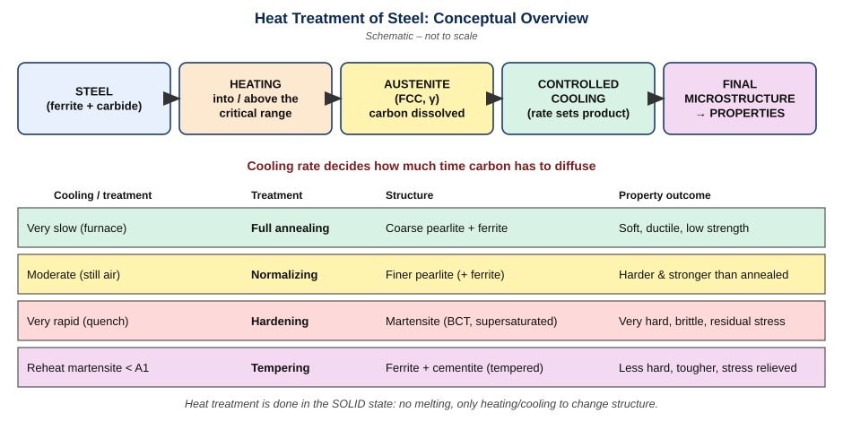

```text
STEEL --> HEATING --> AUSTENITE --> CONTROLLED COOLING --> MICROSTRUCTURE --> PROPERTIES
          (into/above   (FCC γ)      (rate decides)         (pearlite,          (hardness,
           critical                                          bainite,            strength,
           range)                                            martensite)         ductility …)
```

### Objectives of heat treatment

| # | Objective | Comment |
|---|-----------|---------|
| 1 | Relieve stresses from hot/cold working | prevents distortion/cracking |
| 2 | Improve machinability | softer or more favourable structure |
| 3 | Improve tensile strength | e.g. normalizing, hardening |
| 4 | Improve hardness | hardening (martensite) |
| 5 | Improve ductility | annealing, tempering |
| 6 | Improve shock (impact) resistance | tempering for toughness |
| 7 | Modify electrical properties | (lecture list) |
| 8 | Modify magnetic properties | (lecture list) |
| 9 | Improve resistance to heat, corrosion, wear | (lecture list) |
| 10 | Modify grain size | refinement |
| 11 | Stabilize structure at elevated temperature | dimensional/structural stability |

### How cooling rate changes the structure

| Cooling | Carbon diffusion time | Typical result |
|---------|----------------------|----------------|
| Very slow (furnace) | maximum | coarse ferrite + pearlite (annealed) |
| Moderate (still air) | less | finer pearlite (normalized) |
| Very rapid (quench) | practically none | martensite (hardened) |

**Exam points**
- Heat treatment = heating + cooling in the *solid state*.
- Austenite is the parent phase; the cooling rate decides the product.
- Heat slowly if the part is highly stressed (avoid distortion).

---

# 2. Full Annealing

**Definition.** Full annealing is heating steel to the proper temperature (to form austenite), holding where appropriate, and **cooling very slowly** (normally in the furnace) so that the structure approaches **equilibrium** as given by the **iron–iron carbide diagram**.

**Purpose:** soften the steel, relieve residual stresses, refine grains, improve machinability, and improve electrical and magnetic properties. The lecture also lists improvement of the effects of **trapped gases in cast metal** among the benefits.

### Procedure
1. Heat to the proper temperature (austenite forms).
2. Hold (where appropriate) for uniform temperature and transformation to austenite.
3. Cool **very slowly** (furnace cooling) so diffusion can proceed almost to equilibrium.

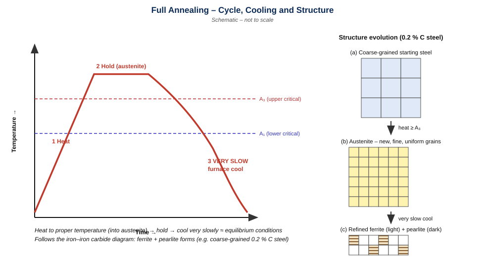

```text
Temperature
  ^        ______ hold (austenite)
  |       /      \
A3|------/--------\---------------
  |     /          \ 
A1|----/------------\--------------- 
  |   /  heat         \___ very slow furnace cool
  +-------------------------------------> Time
```

### Mechanism
- On heating, old grains transform to **new, fine, uniform austenite grains** (grain refinement).
- Very slow cooling gives carbon time to diffuse → **ferrite + pearlite** form close to the equilibrium diagram.
- Slow cooling means **low residual stress** and a soft structure.

**Lecture example — coarse-grained 0.2 % C steel:** after full annealing it becomes a refined structure of **ferrite and pearlite** formed during slow cooling.

| Property | Effect |
|----------|--------|
| Hardness / strength | lowest (soft) |
| Ductility | high |
| Machinability | improved |
| Residual stress | relieved |
| Grain size | refined |

**Common use:** low- and medium-carbon steels → soft and ductile.

**Exam points**
- Very slow cooling ≈ equilibrium ⇒ can be read from the Fe–Fe₃C diagram.
- Products: ferrite + pearlite (coarse pearlite).
- Purpose list: softening, stress relief, grain refinement, machinability, electrical/magnetic properties.

---

# 3. Spheroidizing

**Definition.** Spheroidizing is a heat treatment that produces **spheroidal (globular) cementite in a ferrite matrix**, called **spheroidite**. Main purpose: **improve machinability** (especially high-carbon steels).

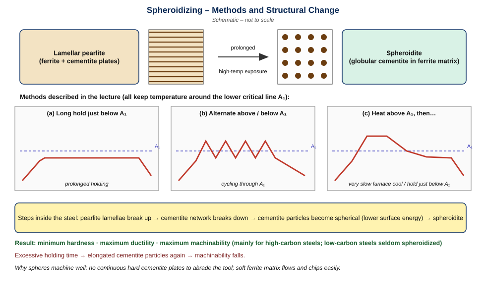

### The three lecture methods

| Method | Description |
|--------|-------------|
| **a** | **Prolonged holding just below** the lower critical temperature (A₁) |
| **b** | **Alternate heating and cooling** just **above and below** the lower critical line |
| **c** | **Heat above the lower critical line**, then **very slow furnace cooling** or **hold just below** the lower critical temperature |

### Mechanism (step by step)
1. Pearlitic lamellae **break down**.
2. Any **cementite network** breaks down.
3. Cementite **transforms into spherical particles** *(explanatory: spheres have the lowest surface area/energy for a given volume)*.
4. Result: spheroidite — round carbides in soft ferrite.

### Structure vs properties

| Feature | Pearlite (lamellar) | Spheroidite |
|---------|--------------------|-------------|
| Cementite shape | continuous plates | discrete spheres |
| Hardness | higher | **minimum** |
| Ductility | lower | **maximum** |
| Machinability | moderate | **maximum** |

**Why favourable for machining:** soft ferrite matrix surrounds isolated hard spheres, so the tool does not cut through continuous hard cementite plates *(explanatory)*.

**Why low-carbon steels are seldom spheroidized:** they already are soft and machinable and contain little cementite; the treatment gives little benefit.

**Effect of excessive holding time:** particles can become **elongated**, and **machinability decreases**.

**Exam points**
- Three methods: hold below A₁; oscillate about A₁; heat above A₁ then very slow cool / hold below A₁.
- Product: spheroidite; result: minimum hardness, maximum ductility, maximum machinability.
- Used for high-carbon steels.

---

# 4. Stress-Relief Annealing

**Definition.** A **subcritical** annealing treatment done **below the lower critical temperature**, at about **1000–1200 °F**, to **remove residual stresses**.

**Sources of residual stress:** heavy machining, cold working.

**Key facts**
- No austenite forms (temperature stays below A₁), so the structure is essentially unchanged; stresses are relaxed.
- **Difference from full annealing:** full annealing austenitizes and cools very slowly (softens + refines grains); stress relief only relaxes stress below A₁.

| Feature | Stress-relief annealing | Full annealing |
|---------|------------------------|----------------|
| Temperature | 1000–1200 °F, below A₁ | into austenite range |
| Aim | remove residual stress | soften, refine grain, ↑machinability |
| Structure change | little | new grains, ferrite + pearlite |

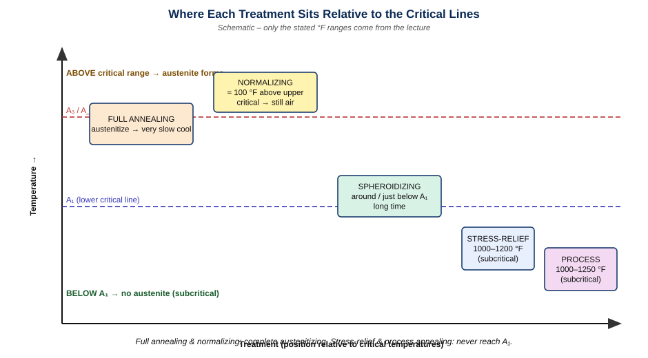

---

# 5. Process Annealing

**Definition.** A **subcritical** treatment, used mainly in the **sheet and wire industries**, applied **after cold working** at about **1000–1250 °F** (below the lower critical line) to **soften by recrystallization** and **restore ductility** so further working is possible.

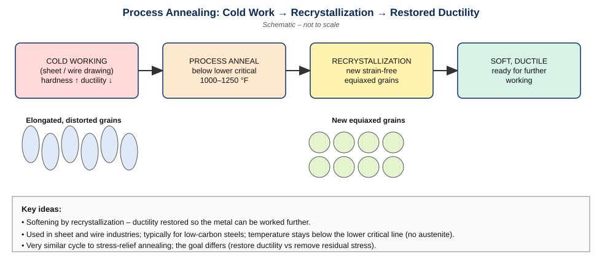

```text
COLD WORK --> PROCESS ANNEAL --> RECRYSTALLIZATION --> DUCTILITY RESTORED
(hard, brittle)  (1000–1250 °F,    (new strain-free      (ready for more
                 below A1)          grains)               working)
```

| Feature | Stress-relief annealing | Process annealing |
|---------|------------------------|-------------------|
| Temperature (lecture) | 1000–1200 °F | 1000–1250 °F |
| Both below A₁? | yes | yes |
| Main goal | remove **residual stress** (machining, cold work) | **soften by recrystallization**, restore **ductility** after cold work |
| Typical use | machined/cold-worked parts | sheet and wire being further worked; low-carbon steels |

**Exam points:** similar cycle to stress relief, different purpose; recrystallization is the softening mechanism.

---

# 6. Annealing Processes — Master Comparison

| Feature | Full annealing | Spheroidizing | Stress-relief annealing | Process annealing |
|---------|---------------|---------------|------------------------|-------------------|
| **Main purpose** | soft, ductile, refined structure | best machinability | remove residual stress | restore ductility after cold work |
| **Treatment condition** | austenitize (into/above critical range) | around / just below A₁ (three methods) | 1000–1200 °F (below A₁) | 1000–1250 °F (below A₁) |
| **Cooling** | very slow (furnace) | very slow furnace / long hold below A₁ | not critical *(explanatory)* | not critical *(explanatory)* |
| **Structural change** | ferrite + pearlite, refined grains | lamellar → globular cementite | almost none | recrystallized grains |
| **Main property change** | softer, more ductile | minimum hardness, maximum ductility & machinability | lower residual stress | ductility restored, softer |
| **Typical steel/use** | low/medium-carbon steels | **high-carbon** steels | machined or cold-worked parts | **low-carbon** steel sheet/wire |
| **Limitation** | long, slow, expensive | long holding; excess time → elongated carbides | does not refine grains | needs prior cold work |

> **Lecture classification to memorize:** Full annealing → low/medium-carbon steels (soft, ductile). Spheroidizing → high-carbon steels (easier machining). Process annealing → low-carbon steels (restores ductility after cold work).

---

# 7. Normalizing

**Definition.** Normalizing is heating steel about **100 °F above the upper critical temperature line** and **cooling in still air to room temperature**.

**Purpose / effects:** refine cast dendritic structure and grain size, homogenize the microstructure, improve machinability, and improve response to later hardening. Gives a **harder and stronger** steel than full annealing.

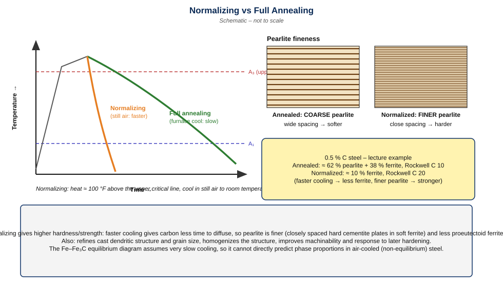

### Why normalized steel is harder and stronger
1. Air cooling is **faster** than furnace cooling.
2. Less time for carbon diffusion → **finer pearlite** (closely spaced plates).
3. **Ferrite is very soft; cementite is very hard**; closely spaced cementite plates increase hardness and strength.

### Why the Fe–Fe₃C diagram cannot predict the result
The equilibrium diagram applies to **very slow cooling**. Air cooling is **non-equilibrium**, so proportions of ferrite/pearlite (or cementite/pearlite) differ from equilibrium values.

### Lecture example — 0.5 % C steel

| Condition | Structure | Hardness |
|-----------|-----------|----------|
| Annealed | ≈ **62 % pearlite + 38 % ferrite** | **Rockwell C 10** |
| Normalized | ≈ **10 % ferrite** (rest fine pearlite) | **Rockwell C 20** |

*Note on "cementite network" (lecture reference):* in higher-carbon steels, slow cooling can leave a continuous cementite network at grain boundaries; the faster air cooling of normalizing reduces this and gives a more uniform structure *(explanatory reading of the lecture)*.

| Feature | Full annealing | Normalizing |
|---------|---------------|-------------|
| Cooling | very slow (furnace) | still air |
| Pearlite | coarse | finer |
| Hardness/strength | lower | higher |
| Structure | near equilibrium | non-equilibrium |
| Cost/time | longer | shorter |

**Exam points:** ≈100 °F above upper critical line; still air; finer pearlite; Rockwell C10 → C20 in the example.

---

# 8. Hardening

**Definition.** Hardening is heat treatment that produces a **fully martensitic structure** by austenitizing and cooling fast enough.

### Mechanism
- **Slow cooling** → carbon **diffuses** out of austenite → ferrite + cementite (pearlite).
- **Rapid cooling** → carbon diffusion is **suppressed** → austenite transforms **by shear** to **martensite**.

**Critical cooling rate** = minimum cooling rate needed to obtain a fully martensitic structure (avoid diffusional products). It depends on:
1. **Chemical composition**
2. **Austenitic grain size** (grain size affects how easily transformation begins/spreads).

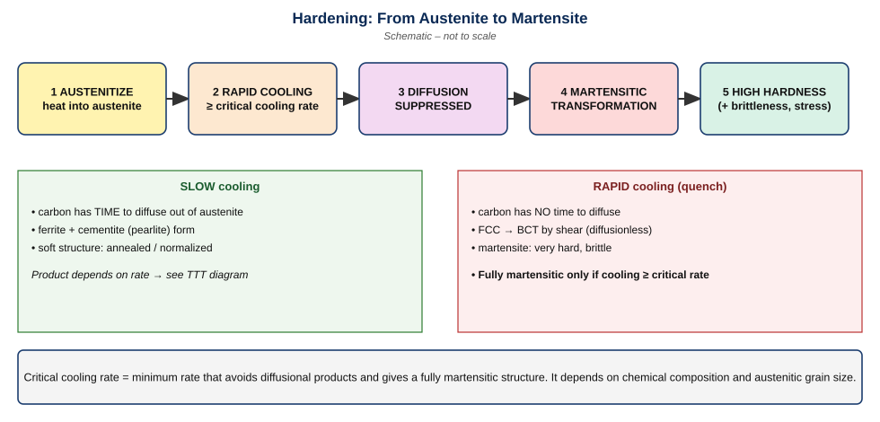

```text
Austenitize --> Rapid cooling --> Suppressed diffusion --> Martensitic transformation --> High hardness
```

**Exam points:** hardening = austenitize + quench ≥ critical cooling rate ⇒ martensite; martensite is hard but brittle ⇒ tempering follows.

---

# 9. Martensite

**Definition.** Martensite is a **supersaturated solid solution of carbon in iron** with a **body-centered tetragonal (BCT)** structure formed by rapid cooling of austenite.

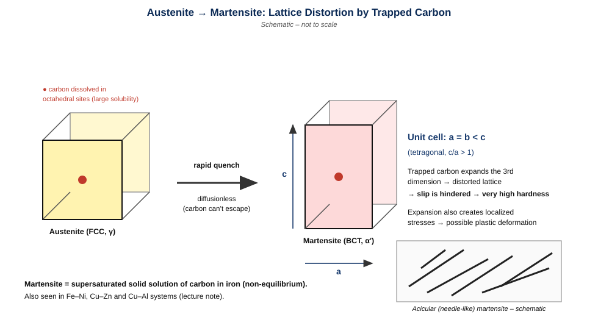

### Structure
- Unit cell: **a = b < c** (tetragonal).
- **Trapped carbon** expands the third dimension (c) → **distorted lattice**.
- Lattice distortion blocks dislocation motion ⇒ **very high hardness**.
- Martensitic expansion produces **localized stresses**, which may cause **plastic deformation**.
- Appearance: **needle-like (acicular)** after drastic cooling.

### Characteristics of the martensitic transformation

| Characteristic | Meaning |
|----------------|---------|
| Diffusionless | atoms move by shear, not long-range diffusion |
| No composition change | martensite has the same carbon content as parent austenite |
| Occurs during cooling | progress depends on temperature |
| Transformation stops if cooling stops | **athermal** |
| Not an equilibrium structure | not on the Fe–Fe₃C diagram |
| Can persist indefinitely | at room temperature |
| Very high hardness potential | rises with **carbon content** |

Martensitic transformations also occur in **Fe–Ni, Cu–Zn and Cu–Al** (lecture note).

**Exam points:** BCT, a = b < c, carbon-trapped, diffusionless, athermal, acicular, hardness ↑ with C.

---

# 10. Tempering

**Why temper?** As-quenched martensite is **brittle** and contains **residual stresses** from hardening.

**Definition.** Tempering is **heating hardened (martensitic) steel below the lower critical temperature** to relieve residual stresses and improve **ductility and toughness**, at some cost in hardness and strength.

```text
Tempering temperature ↑
   → Hardness ↓
   → Toughness ↑
   → Residual stress ↓
```

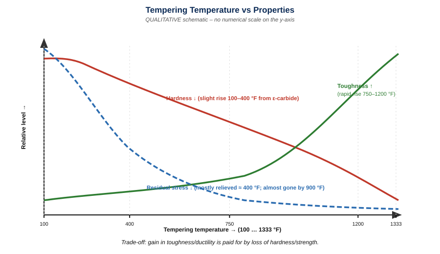

**Trade-off:** toughness/ductility gained ⇔ hardness/strength lost.

---

# 11. Tempering Temperature Ranges

**General range:** **400–800 °F**.
- For **hardness/wear resistance** → temper **below 400 °F**.
- For **toughness** → temper **above 800 °F**.
- Residual stresses are relieved **mostly around 400 °F**; by **900 °F** they are **almost gone**.

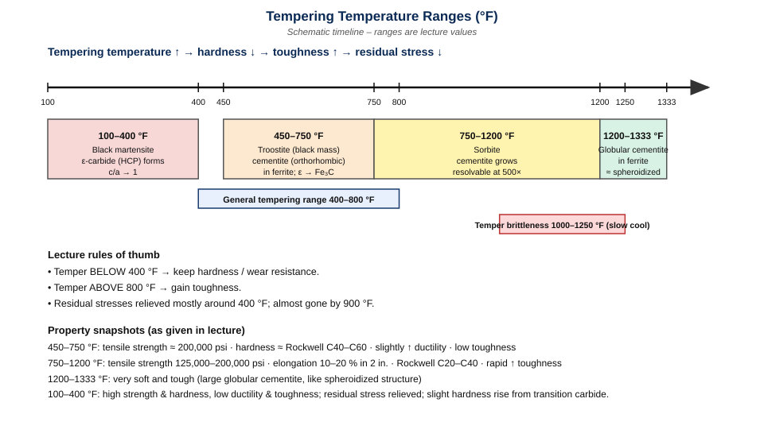

### A. 100–400 °F — black martensite
- Quenched martensite begins to **lose its tetragonal character**; **c/a ratio decreases toward 1**.
- **Epsilon (ε) carbide** (HCP) forms; **low-carbon martensite** forms.
- Transition-carbide precipitation may give a **slight hardness increase**.
- **High strength, high hardness, low ductility, low toughness**; residual stresses relieved.

### B. 450–750 °F — troostite (black mass)
- ε-carbide → **orthorhombic cementite**.
- Low-carbon martensite → **BCC ferrite**.
- **Retained austenite → lower bainite** (as stated in the lecture).
- Carbides too small to resolve optically → **etches as a black mass** (historic name **troostite**).
- **Tensile strength ≈ 200,000 psi**, slightly increased ductility, low toughness (as stated), **Rockwell ≈ C40–C60** depending on temperature.
- Lecture includes a **bainite-related microstructural illustration** for this range.

### C. 750–1200 °F — sorbite
- Cementite particles **continue to grow**; more ferrite visible.
- Carbides **resolvable at 500×**.
- **Tensile strength 125,000–200,000 psi; elongation 10–20 % in 2 in.; Rockwell C20–C40.**
- Major feature: **rapid increase in toughness**.

### D. 1200–1333 °F
- **Large globular cementite** in ferrite; **very soft and tough**; similar to a **spheroidized** structure.

### Summary table

| Range (°F) | Structure | Carbide | Properties (lecture) |
|-----------|-----------|---------|---------------------|
| 100–400 | Black martensite (low-C martensite; c/a → 1) | ε-carbide, HCP | high strength & hardness; low ductility & toughness; stresses relieved |
| 450–750 | Troostite; ferrite + fine cementite; lower bainite from retained austenite | orthorhombic cementite, unresolved | UTS ≈ 200,000 psi; ≈ RC 40–60; slightly ↑ ductility; low toughness |
| 750–1200 | Sorbite; ferrite matrix more visible | cementite growing, resolved at 500× | UTS 125,000–200,000 psi; elongation 10–20 % (2 in.); RC 20–40; toughness ↑ rapidly |
| 1200–1333 | Ferrite + large globular cementite | spheroidal | very soft, very tough |

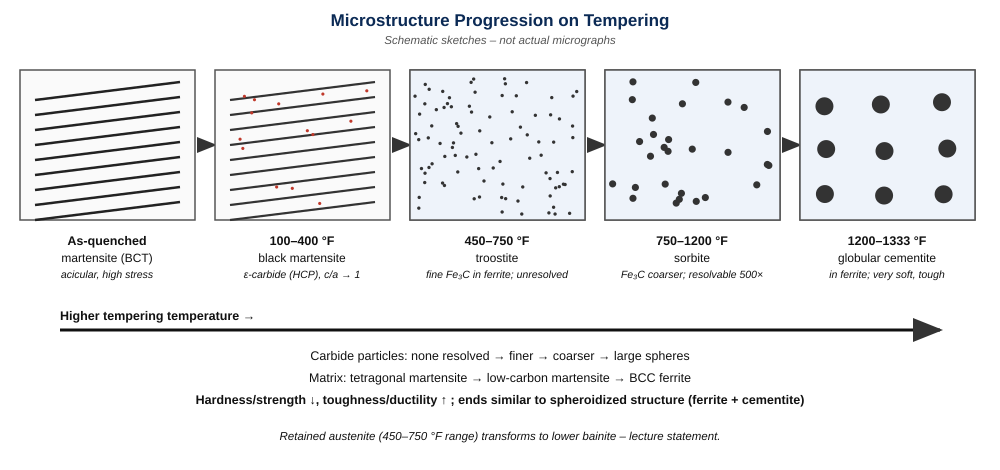

```text
As-quenched martensite -> black martensite (+ε carbide) -> troostite -> sorbite -> ferrite + globular cementite
   (BCT, hard, brittle)                                                         (soft, tough)
```

---

# 12. Temper Brittleness

**Definition.** Temper brittleness (embrittlement) is a **loss of notched-bar toughness** in steel tempered in the range **1000–1250 °F** and then **cooled slowly** through/after that range.

**Lecture statement:** if the part is **quenched in water** after tempering, **toughness is retained**.

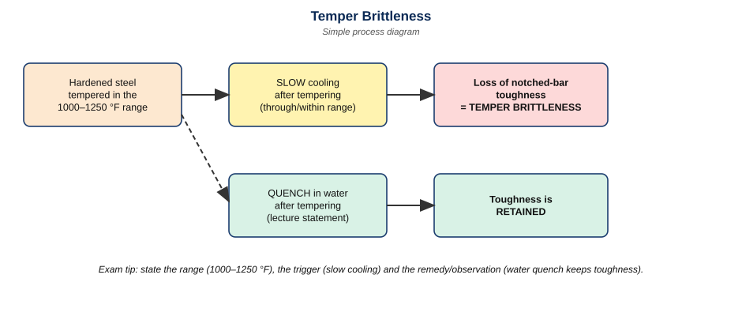

**Exam points:** range 1000–1250 °F; caused by slow cooling; measured by notched-bar (impact) tests; water quench retains toughness.

---

# 13. TTT / Isothermal Transformation Diagram

**TTT = Time–Temperature–Transformation.** An **isothermal transformation diagram** shows **how long austenite takes to start and finish transforming** when held at a **constant subcritical temperature**, and **what it turns into**.

### Why needed
- The Fe–Fe₃C diagram is an **equilibrium** diagram (very slow cooling); it says nothing about **time**.
- Real cooling is **non-equilibrium**; the product depends on **time and temperature**.
- Hence we study transformation at **constant subcritical temperatures**, noting **start time, completion time and product**.

### Reading the axes and curves
| Element | Meaning |
|--------|---------|
| Vertical axis | temperature |
| Horizontal axis | **logarithmic** time |
| **Start curve** | transformation begins (left of it: austenite) |
| **End curve** | transformation complete |
| Between curves | austenite + product(s) |
| Regions | austenite, **pearlite**, **bainite**, **martensite** |
| **Ms** | martensite start temperature |
| **M50** | 50 % martensite |
| **M90** | 90 % martensite |
| Critical cooling path | path just missing the "nose" ⇒ fully martensitic |

*No numerical coordinates are given here because none were supplied.*

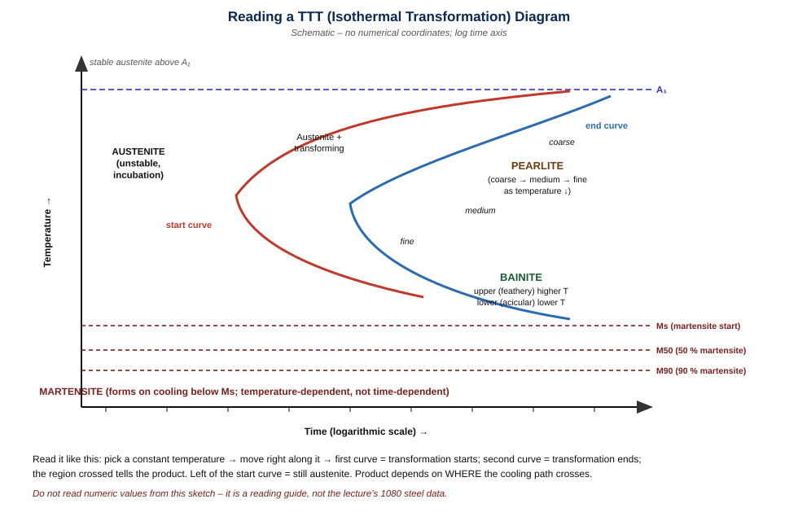

**Key point:** martensite formation depends on **temperature** (athermal), so Ms/M50/M90 appear as **horizontal lines**.

---

# 14. Experimental Construction of a TTT Diagram

1. **Prepare** a large number of **small-cross-section samples** (so they reach bath temperature quickly).
2. **Austenitize** long enough for complete austenite formation (lecture example ≈ **1425 °F**).
3. **Transfer** to a **molten salt bath** at a constant **subcritical** temperature (example ≈ **1300 °F**).
4. **Remove** separate samples after **different holding times** and **quench** in **cold water or iced brine**.
5. **Measure hardness** and **examine microstructure**.
6. **Repeat** at different subcritical temperatures.

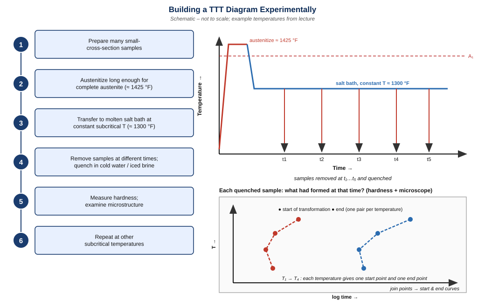

**How points become curves:** for each temperature, the earliest sample showing transformation gives a **start point**, and the first fully transformed sample gives an **end point**. Joining start points of all temperatures ⇒ **start curve**; end points ⇒ **end curve**. Quench-produced martensite in each sample shows how much austenite was still untransformed.

---

# 15. TTT Diagrams in the Lectures

The lectures include: a **700 °F isothermal transformation** condition, the **1080 eutectoid steel** diagram, a **0.5 % C steel** diagram, and the **austenite-to-martensite transformation**.

### 1080 eutectoid steel — labelled regions
- **Austenite** (left of start curve)
- **Coarse pearlite** (highest transformation temperatures)
- **Medium pearlite**
- **Fine pearlite** (near the nose)
- **Upper / feathery bainite**
- **Lower / acicular bainite**
- **Martensite** (below **Ms**, with **M50** and **M90** lines)
- **Beginning** and **ending** transformation curves

### Other lecture items (qualitative)
- **700 °F isothermal condition:** transformation is held at 700 °F, which lies within the bainite temperature range quoted in the lecture (400–800 °F) *(explanatory)*.
- **0.5 % C steel:** hypoeutectoid; an additional region of proeutectoid **ferrite** precedes pearlite *(explanatory)*.
- **Austenite → martensite:** below Ms, transformation proceeds on cooling, not with time.

Use the reading guide in Section 13 as the visual key.

---

# 16. Pearlite Formed by Isothermal Transformation

Lecture micrographs of **1080 eutectoid steel** at ≈ **1500×**, transformed at **1300, 1225, 1150 and 1075 °F**.

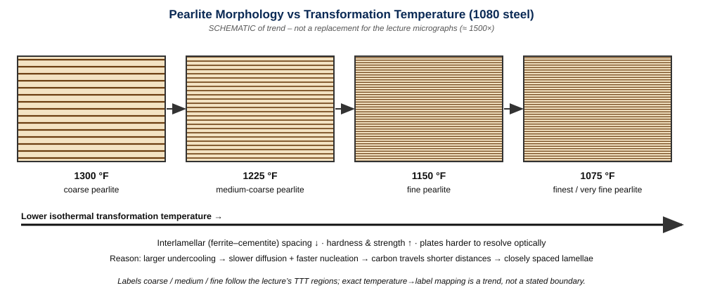

| Isothermal temp. | Trend in pearlite |
|------------------|-------------------|
| 1300 °F | **coarsest** (widest spacing) |
| 1225 °F | medium/coarse |
| 1150 °F | fine |
| 1075 °F | **finest** |

| Type | Spacing | Hardness | Forms at |
|------|---------|----------|----------|
| Coarse pearlite | widest | lowest | highest temperature |
| Medium pearlite | intermediate | intermediate | intermediate |
| Fine pearlite | closest | highest of the pearlites | lowest pearlite temperature |

**Reason** *(explanatory)*: lower temperature ⇒ higher driving force but slower diffusion ⇒ carbon moves shorter distances ⇒ thinner, closer plates.

---

# 17. Bainite

Bainite is a transformation product on the TTT diagram **below the pearlite region, above Ms**.

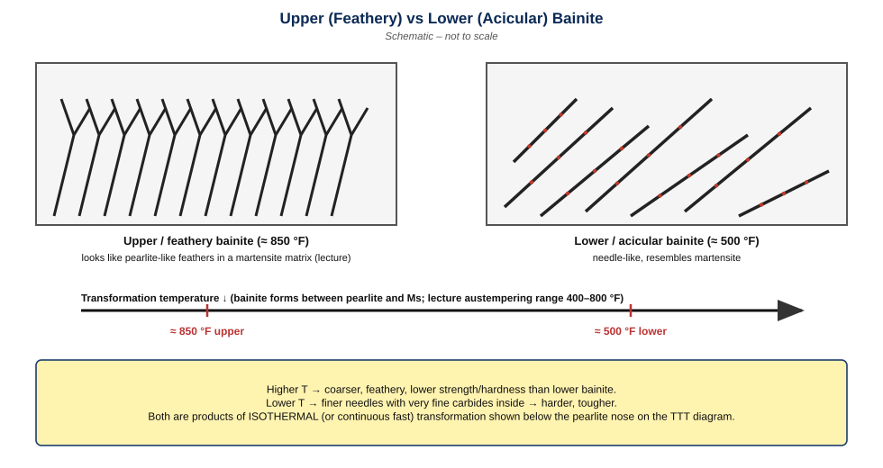

| Feature | Upper (feathery) bainite | Lower (acicular) bainite |
|---------|-------------------------|--------------------------|
| Lecture example | ≈ **850 °F** | ≈ **500 °F** |
| Lecture description | resembles **pearlite in a martensite matrix** | resembles **martensite** (needle-like) |
| Temperature | higher | lower |
| Scale *(explanatory)* | coarser | finer |
| Hardness/strength *(explanatory)* | lower | higher |

---

# 18. Cooling Curves and the TTT Diagram

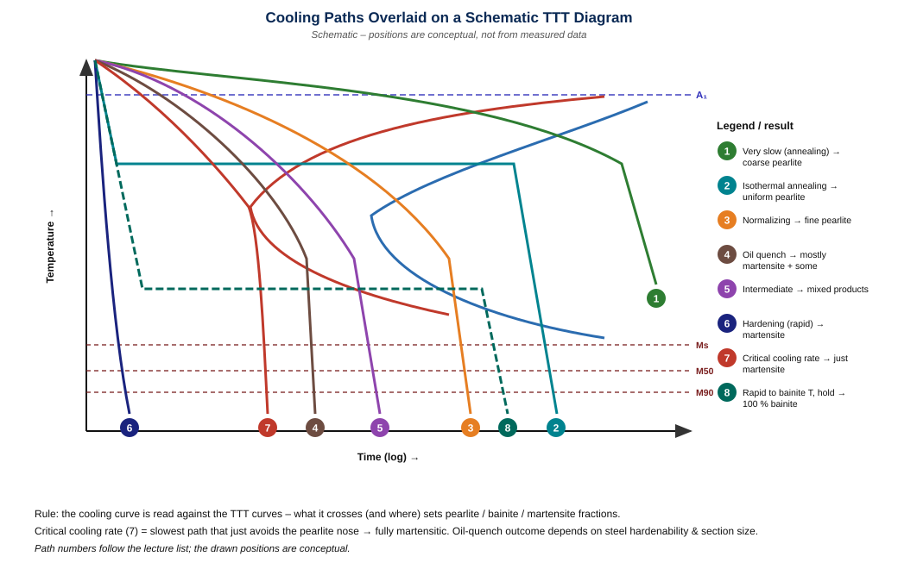

| # | Cooling path | What it crosses | Final structure |
|---|--------------|-----------------|-----------------|
| 1 | Very slow cooling / **annealing** | passes through upper pearlite region | coarse pearlite (+ ferrite) |
| 2 | **Isothermal annealing** | quench to high subcritical T, hold to end curve | pearlite (uniform) |
| 3 | **Normalizing** | cooler crossing, faster than annealing | fine pearlite |
| 4 | **Oil quench** | faster than air; near nose | mostly martensite; may include some fine pearlite/bainite — depends on steel & section |
| 5 | **Intermediate cooling** | crosses start curve, not fully finishing | **mixed products** (pearlite/bainite + martensite) |
| 6 | **Hardening / rapid cooling** | misses the nose | martensite |
| 7 | **Critical cooling rate** | just touches the nose | fully martensitic (minimum rate) |
| 8 | **100 % bainite** | rapid cool to bainite range, hold until complete | bainite |

**Principle:** the cooling curve is drawn on the TTT plot; **what it crosses decides the product**. Mixed structures arise when the path crosses a start curve but not the end curve before reaching Ms.

---

# 19. Austempering

**Definition.** Austempering is a heat treatment in which austenitized steel is **rapidly transferred to a salt bath held in the bainite range (lecture: 400–800 °F)** and **held until transformation is complete**, giving **100 % bainite**.

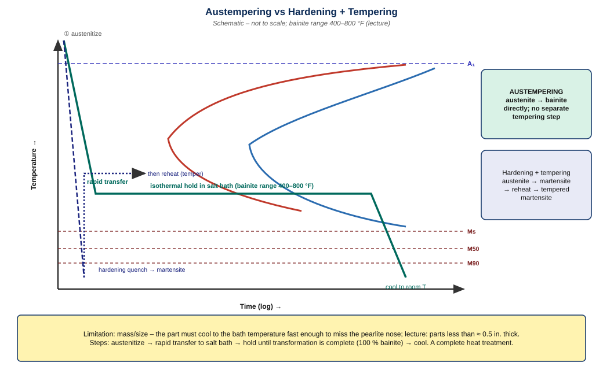

### Steps
1. Austenitize.
2. Rapidly transfer to salt bath in the bainite range (400–800 °F).
3. Hold until austenite → bainite is complete.
4. Cool to room temperature.

**Key facts:** direct austenite → bainite; **no separate reheating (tempering)** as stated in the lecture; a **complete heat treatment**; **limitation: size/mass** — lecture: mostly suitable for parts **less than ≈ 0.5 in. thick**.

| Feature | Austempering | Hardening + tempering |
|---------|--------------|-----------------------|
| Product | 100 % bainite | tempered martensite |
| Steps | 1 (isothermal hold) | 2 (quench, then reheat) |
| Tempering needed | no (as stated) | yes |
| Size limit | thin parts (< ≈ 0.5 in.) | larger sections possible *(explanatory)* |

---

# 20. Integrated Conceptual Understanding

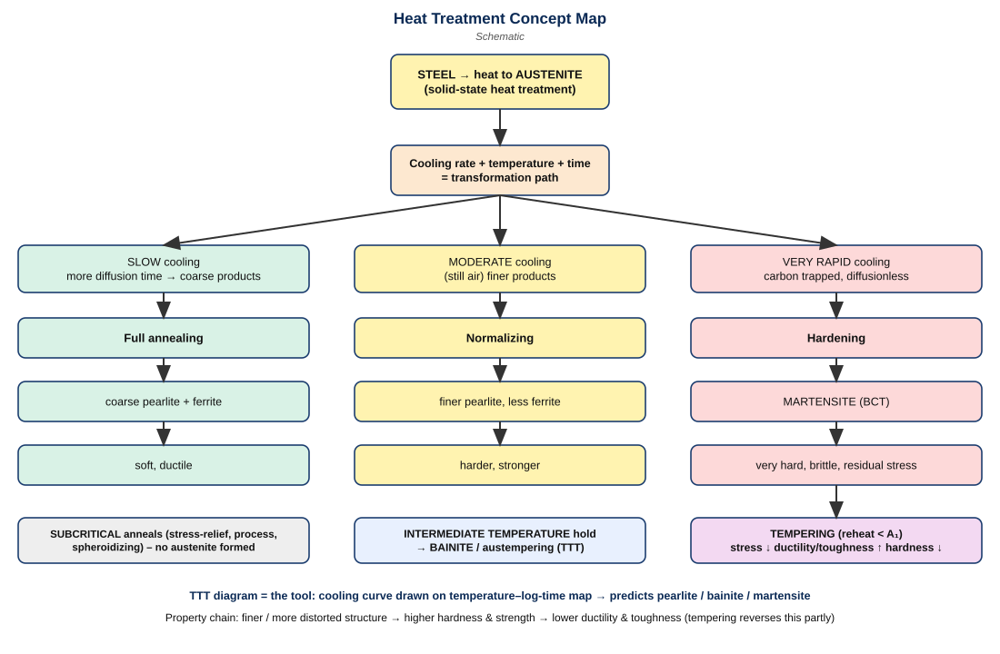

```text
Slow cooling      -> more diffusion time    -> coarser products -> ANNEALED
Moderate cooling  -> finer products         ------------------> NORMALIZED
Very rapid cooling-> carbon trapped         -> MARTENSITE -> very high hardness + residual stress
Martensite -> TEMPERING -> residual stress ↓ -> ductility/toughness ↑ -> hardness/strength ↓
Cooling rate + temperature + time -> transformation path -> microstructure -> properties
```

---

# 21. Common Confusions — Side-by-Side

| Pair | Difference |
|------|-----------|
| **Full annealing vs normalizing** | furnace cool vs still-air cool; coarse vs finer pearlite; softer vs harder/stronger |
| **Stress-relief vs process annealing** | both subcritical; 1000–1200 °F remove residual stress vs 1000–1250 °F recrystallize & restore ductility after cold work |
| **Hardening vs tempering** | hardening = austenitize + rapid cool ⇒ martensite (hard, brittle); tempering = reheat below A₁ ⇒ tougher, less hard |
| **Pearlite vs bainite** | diffusional lamellar ferrite+cementite at higher T; bainite forms at lower T (upper ≈ 850 °F, lower ≈ 500 °F) |
| **Upper vs lower bainite** | feathery (pearlite-like in martensite matrix) vs acicular (martensite-like) |
| **TTT vs equilibrium diagram** | TTT includes **time** and non-equilibrium; Fe–Fe₃C is equilibrium only |
| **Annealed vs normalized vs hardened** | coarse pearlite (soft) / finer pearlite (harder) / martensite (hardest, brittle) |

---

# 22. Exam Question Preparation

## A. Very short questions

1. **Define heat treatment.** Controlled heating and cooling of metal in the solid state to obtain desired structure and properties.
2. **What is austenite?** FCC γ-iron with dissolved carbon; the parent phase for basic heat treatments.
3. **What is critical cooling rate?** Minimum cooling rate that gives a fully martensitic structure.
4. **Stress-relief annealing range?** 1000–1200 °F (below A₁).
5. **Process annealing range?** 1000–1250 °F (below A₁).
6. **Normalizing temperature?** ≈ 100 °F above the upper critical line; still-air cool.
7. **Martensite unit cell?** BCT with a = b < c.
8. **What is spheroidite?** Globular cementite in ferrite.
9. **What does TTT stand for?** Time–Temperature–Transformation.
10. **Temper brittleness range?** 1000–1250 °F followed by slow cooling.

## B. Short-answer questions (3–5 marks)

**Q1. Why is normalized steel harder than annealed steel?**
Air cooling is faster than furnace cooling, giving less diffusion time and **finer pearlite** with closely spaced hard cementite plates in soft ferrite; less proeutectoid ferrite forms. Example (0.5 % C): annealed ≈ RC 10 with ≈ 62 % pearlite; normalized ≈ RC 20 with ≈ 10 % ferrite.

**Q2. Why is martensite very hard?**
Rapid cooling traps carbon in BCT iron (supersaturated), expanding c so a = b < c. The distorted lattice resists slip; localized stresses add to hardening.

**Q3. State three characteristics of the martensitic transformation.**
Diffusionless (no composition change); athermal (stops if cooling stops); non-equilibrium and persists indefinitely.

**Q4. Why are low-carbon steels seldom spheroidized?**
They contain little cementite and are already soft/machinable, so the benefit is small; spheroidizing is mainly applied to high-carbon steels.

**Q5. Difference between stress-relief and process annealing.**
Both subcritical. Stress relief (1000–1200 °F) removes residual stress from machining/cold work; process annealing (1000–1250 °F) recrystallizes cold-worked metal to restore ductility for further working.

**Q6. What is austempering and its limitation?**
Austenitize → salt bath in bainite range (400–800 °F) → hold → 100 % bainite, no separate tempering. Limited to thin parts (< ≈ 0.5 in.).

## C. Descriptive questions (8–10 marks)

**Q1. Describe tempering and the changes in structure and properties from 100 to 1333 °F.**
*Model answer:* Tempering is reheating hardened steel below A₁ to relieve residual stress and improve ductility and toughness, at the cost of hardness. **100–400 °F:** black martensite; ε-carbide (HCP); c/a → 1; hard, high strength, low toughness; stresses relieved. **450–750 °F:** ε → orthorhombic cementite; low-C martensite → BCC ferrite; retained austenite → lower bainite; unresolvable carbides (troostite); UTS ≈ 200,000 psi; RC ≈ 40–60. **750–1200 °F:** cementite grows (sorbite), resolved at 500×; UTS 125,000–200,000 psi; elongation 10–20 %; RC 20–40; toughness rises rapidly. **1200–1333 °F:** large globular cementite in ferrite, very soft and tough (spheroidized-like). General range 400–800 °F; <400 °F for hardness/wear, >800 °F for toughness; stresses mostly gone by 900 °F. Beware temper brittleness at 1000–1250 °F on slow cooling.

**Q2. Explain how a TTT diagram is constructed and read.**
*Model answer:* Small samples are austenitized (≈ 1425 °F), moved to a salt bath at a constant subcritical temperature (≈ 1300 °F), removed after different times, quenched in cold water/iced brine, and examined for hardness and microstructure; this is repeated at other temperatures. Start/end points for each temperature are joined to give start and end curves on a temperature vs log-time plot. Left of start curve: austenite; between: transforming; right of end curve: pearlite (coarse → medium → fine with falling T) and bainite (upper/feathery, lower/acicular). Below Ms (with M50, M90 lines) martensite forms on cooling. A cooling path drawn on the diagram predicts the structure.

**Q3. Compare full annealing, normalizing and hardening.**
*Model answer:* All austenitize; they differ in cooling. Full annealing: very slow furnace cooling ⇒ coarse pearlite + ferrite; soft, ductile. Normalizing: ≈ 100 °F above upper critical, still air ⇒ finer pearlite; harder and stronger; refined and homogenized. Hardening: rapid quench above critical cooling rate ⇒ martensite; very hard, brittle, residual stress ⇒ needs tempering.

**Q4. Discuss spheroidizing.**
*Model answer:* Produces spheroidite for maximum machinability. Methods: hold below A₁; alternate about A₁; heat above A₁ then very slow cool or hold just below. Pearlite lamellae and cementite network break down into spheres. Minimum hardness, maximum ductility and machinability. Used for high-carbon steel; excess time elongates particles and reduces machinability.

## D. Compare-and-contrast questions

**Q1. Upper vs lower bainite.** See Section 17 table: ≈ 850 °F feathery (pearlite-like in martensite matrix) vs ≈ 500 °F acicular (martensite-like); lower is finer and harder *(explanatory)*.

**Q2. TTT vs Fe–Fe₃C diagram.** TTT: time–temperature, isothermal, non-equilibrium, includes bainite/martensite. Fe–Fe₃C: equilibrium, slow cooling only, no time axis, no martensite.

**Q3. Austempering vs hardening + tempering.** Austempering: isothermal → 100 % bainite, no separate tempering, thin parts. Hardening + tempering: quench → martensite, then reheat → tempered martensite, larger sections possible.

**Q4. Full annealing vs spheroidizing.** Full annealing: austenitize + slow cool → ferrite + pearlite, low/medium-C. Spheroidizing: around A₁ → spheroidite, high-C, best machinability.

## E. Diagram-based questions

**D1. Sketch a full-annealing cycle.** Heat to austenite region → hold → very slow furnace cool; label A₁, A₃ (see Section 2 figure).
**D2. Sketch annealing vs normalizing cooling curves.** Same heating; annealing curve shallow (furnace), normalizing steeper (still air); label pearlite spacing coarse vs fine (Section 7 figure).
**D3. Draw martensite unit cell.** BCT cell with a = b < c, carbon in interstitial site (Section 9 figure).
**D4. Draw a schematic TTT diagram and mark regions.** Axes T vs log t; A₁ line; start and end curves; pearlite (coarse/medium/fine), bainite (upper/lower), Ms/M50/M90 lines (Section 13 figure).
**D5. Draw cooling paths for annealing, normalizing, hardening and critical cooling rate.** Overlay on TTT (Section 18 figure).
**D6. Sketch tempering-property trends.** Hardness ↓, toughness ↑, residual stress ↓ with temperature (Section 10 figure).

---

# 23. Rapid Revision Section

### Definitions (one-liners)
| Term | Definition |
|------|-----------|
| Heat treatment | solid-state heating/cooling to change structure & properties |
| Full annealing | austenitize + very slow cool ⇒ soft, refined ferrite + pearlite |
| Spheroidizing | globular cementite in ferrite for machinability |
| Stress-relief anneal | subcritical, 1000–1200 °F, remove residual stress |
| Process anneal | subcritical, 1000–1250 °F, recrystallize after cold work |
| Normalizing | ≈100 °F above upper critical, still-air cool |
| Hardening | austenitize + rapid cool ⇒ martensite |
| Martensite | supersaturated C in BCT iron, diffusionless, athermal |
| Tempering | reheat hardened steel below A₁ ⇒ tougher, stress relief |
| Austempering | isothermal hold in bainite range ⇒ 100 % bainite |
| TTT | Time–Temperature–Transformation isothermal diagram |

### Key temperatures / values
| Item | Value |
|------|-------|
| Stress relief | 1000–1200 °F |
| Process anneal | 1000–1250 °F |
| Normalizing | ≈ 100 °F above upper critical |
| General tempering | 400–800 °F |
| Temper brittleness | 1000–1250 °F, slow cool |
| TTT austenitize / bath | ≈ 1425 °F / ≈ 1300 °F |
| Upper / lower bainite | ≈ 850 °F / ≈ 500 °F |
| Austempering | 400–800 °F; < ≈ 0.5 in. |
| 0.5 % C annealed / normalized | ≈62 % P + 38 % F, RC10 / ≈10 % F, RC20 |
| Temper 450–750 °F | ≈ 200,000 psi; RC ≈ 40–60 |
| Temper 750–1200 °F | 125,000–200,000 psi; 10–20 % in 2 in.; RC 20–40 |

### Treatment → cooling → structure → property
| Treatment | Cooling | Structure | Property |
|-----------|---------|-----------|----------|
| Full anneal | furnace, very slow | ferrite + coarse pearlite | soft, ductile |
| Spheroidize | slow / hold near A₁ | spheroidite | min hardness, best machinability |
| Stress relief | subcritical | unchanged | stress ↓ |
| Process anneal | subcritical | recrystallized | ductility restored |
| Normalize | still air | finer pearlite | harder/stronger than annealed |
| Harden | rapid quench | martensite | very hard, brittle |
| Temper | reheat < A₁ | tempered martensite → ferrite + cementite | tougher, less hard |
| Austemper | salt bath 400–800 °F | 100 % bainite | tough, no separate temper |

### TTT terminology cheat sheet
| Term | Meaning |
|------|---------|
| Start / end curve | beginning / completion of transformation |
| Nose | region of shortest transformation time *(explanatory)* |
| Ms, M50, M90 | martensite start, 50 %, 90 % |
| Isothermal | constant temperature |
| Critical cooling rate | path just missing the nose |
| Subcritical | below A₁ |

### Bainite / pearlite / martensite comparison
| Feature | Pearlite | Bainite | Martensite |
|---------|----------|---------|-----------|
| Formation | diffusional, high T | intermediate T | diffusionless, below Ms |
| Structure | ferrite + cementite lamellae (coarse → fine) | upper feathery / lower acicular | BCT, needles |
| Hardness | lowest of the three | intermediate | highest |

### Last-minute memorization
1. Austenite first, cooling decides product.
2. Slow ⇒ coarse; faster ⇒ fine; very fast ⇒ martensite.
3. Ferrite soft, cementite hard, closer plates ⇒ harder.
4. Martensite: BCT, a = b < c, diffusionless, athermal, acicular.
5. Tempering: T ↑ ⇒ hardness ↓, toughness ↑, stress ↓.
6. Temper brittleness 1000–1250 °F with slow cool; water quench retains toughness.
7. TTT six steps: samples → austenitize (1425 °F) → salt bath (1300 °F) → remove & quench → measure → repeat.
8. Austempering: 100 % bainite, no tempering, < ≈ 0.5 in. parts.

---

# 24. Figure Index

| Figure | File |
|--------|------|
| Heat treatment overview | `../../assets/heat-treatment-overview.svg` |
| Full annealing cycle | `../../assets/full-annealing-cycle.svg` |
| Spheroidizing | `../../assets/spheroidizing-process-flow.svg` |
| Annealing temperature map | `../../assets/annealing-temperature-map.svg` |
| Process annealing flow | `../../assets/process-annealing-flow.svg` |
| Normalizing vs annealing | `../../assets/normalizing-vs-annealing.svg` |
| Hardening flow | `../../assets/hardening-flow.svg` |
| Martensite structure | `../../assets/martensite-crystal-structure.svg` |
| Tempering trend | `../../assets/tempering-property-trend.svg` |
| Tempering ranges | `../../assets/tempering-temperature-ranges.svg` |
| Tempered microstructure progression | `../../assets/tempered-microstructure-progression.svg` |
| Temper brittleness | `../../assets/temper-brittleness-cause.svg` |
| TTT derivation | `../../assets/ttt-experimental-derivation.svg` |
| TTT reading guide | `../../assets/ttt-diagram-reading-guide.svg` |
| Pearlite morphology | `../../assets/pearlite-morphology-schematic.svg` |
| Bainite comparison | `../../assets/bainite-upper-vs-lower.svg` |
| Cooling paths on TTT | `../../assets/cooling-paths-on-ttt.svg` |
| Austempering | `../../assets/austempering-cooling-path.svg` |
| Concept map | `../../assets/heat-treatment-concept-map.svg` |
