# Heat Treatment of Steel: Consolidated Lecture Notes

> **Source.** Four lecture decks by Dr. Md. Arifuzzaman, Department of Mechanical Engineering, KUET, Khulna. They overlap heavily; duplicated slides are merged here and every unique statement is kept.
>
> | Code | File | Slides | Content |
> |---|---|---:|---|
> | **D1** | `ipe-101-heat-treatment-1.pdf` | 42 | Objectives, annealing family, normalizing, hardening, tempering |
> | **D2** | `ipe-101-heat-treatment-2.pdf` | 20 | Hardening, tempering (repeat with additions), tempering summary, effect of time |
> | **D3** | `ipe-101-heat-treatment-3.pdf` | 9 | TTT diagram: purpose, derivation, 700 °F, 1080 steel, 0.5 % C steel, martensite fraction |
> | **D4** | `ipe-101-heat-treatment-4.pdf` | 12 | 1080 TTT, pearlite and bainite micrographs, cooling paths, austempering |
>
> **Citations** look like `D1-s8` = deck 1, slide 8 (slides counted in file order).
>
> **Conventions used in these notes**
>
> - Numbers, temperatures (°F, as in the source) and terms are the lecturer's. Nothing is replaced with outside data.
> - **≈** marks a value *read by eye from a source graph*. Use these for trends, not for exact figures.
> - **⚠ Source note** flags an ambiguity, inconsistency or typo that is preserved rather than corrected (all collected in [section 21.4](#214-source-issue-log)).
> - Diagrams in `../../assets/` are **original schematics** unless a caption says otherwise; they are labelled "schematic / not to scale".
> - Case hardening is only announced as "next class" (D1-s42, D2-s20, D4-s12). It is **not covered** in these decks.

---

## Table of Contents

1. [Definition of heat treatment](#1-definition-of-heat-treatment)
2. [Objectives](#2-objectives)
3. [General sequence and austenite](#3-general-sequence-and-austenite)
4. [Full annealing](#4-full-annealing)
5. [Spheroidizing](#5-spheroidizing)
6. [Stress-relief annealing](#6-stress-relief-annealing)
7. [Process annealing](#7-process-annealing)
8. [Annealing comparison](#8-annealing-comparison)
9. [Normalizing](#9-normalizing)
10. [Hardening and martensite](#10-hardening-and-martensite)
11. [Tempering](#11-tempering)
12. [Tempering temperature ranges and properties](#12-tempering-temperature-ranges-and-properties)
13. [TTT / isothermal transformation diagrams](#13-ttt--isothermal-transformation-diagrams)
14. [Pearlite transformation](#14-pearlite-transformation)
15. [Bainite transformation](#15-bainite-transformation)
16. [Cooling curves and TTT paths](#16-cooling-curves-and-ttt-paths)
17. [Critical cooling rate](#17-critical-cooling-rate)
18. [Austempering](#18-austempering)
19. [Consolidated comparison tables](#19-consolidated-comparison-tables)
20. [Exam-focused quick revision](#20-exam-focused-quick-revision)
21. [Source and page traceability](#21-source-and-page-traceability)

---

## 1. Definition of Heat Treatment

**Heat treatment** is *a combination of heating and cooling operations, timed and applied to a metal or alloy in the solid state in a way that will produce desired properties* (D1-s3).

Key statements from the lecture:

- All basic heat treatments of steel involve the **transformation or decomposition of austenite**.
- The **nature and appearance of the transformation products** determine the physical and mechanical properties of a given steel.


*Figure 1.1: Conceptual flow (schematic). Compiled from D1-s3 and the process descriptions below.*

---

## 2. Objectives

From D1-s2, heat treatment is done:

- to **relieve stresses** set up after hot or cold working, to improve machining;
- to **improve mechanical properties**: tensile strength, hardness, ductility, shock resistance;
- to **modify structure** to improve electrical and magnetic properties;
- to **increase quality of the metal**: better resistance to heat, corrosion and wear;
- to **change grain size**;
- to **stabilize the structure at elevated temperature**.

---

## 3. General Sequence and Austenite

| Point | Lecture statement (D1-s3) |
|---|---|
| First step | Heat to some temperature **in or above the critical range** to form **austenite** |
| Rate of heating | "Not significant" |
| Caution | **Highly stressed materials should be heated slowly to avoid distortion** |
| What follows | Cooling path decides the transformation product (annealed, normalized, martensitic ...) |

### 3.1 Critical lines and treatment ranges (D1-s4)

The chart plots **temperature (°F, about 1200 to 1700)** against **percent carbon (0 to 1.40)** and shows the critical lines **Ac1, Ac3, Acm** and **Ac3,1**, plus two shaded bands:

- **Full annealing and hardening range**: a band just above the upper critical line up to the eutectoid composition (0.80 % C), running almost flat just above the lower critical line for higher carbon.
- **Normalizing range**: a band **above** the annealing/hardening band, following the upper critical line and then Acm.

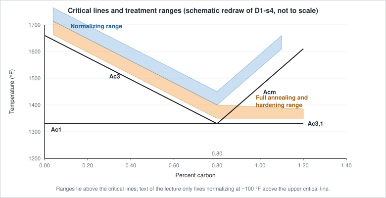

*Figure 3.1: Schematic redraw of D1-s4 (band positions ≈, not to scale).*

> ⚠ **Source note.** Notation differs between slides: `Ac1/Ac3/Acm/Ac3,1` (D1-s4), `A1/A3/Acm/A3,1` (D1-s8) and `Ae1/Ae3` (TTT slides). They refer to the same lines; each is kept as printed. `Ac3,1` labels the horizontal lower-critical line on the high-carbon side and is not defined in the text.

---

## 4. Full Annealing

| Item | Notes |
|---|---|
| **Definition** | Heating the steel to the proper temperature and then **cooling slowly** (D1-s7) |
| **Purpose** | Soften steel; relieve residual stress; refine the grain; "improve gas trapped in metal during casting" (D1-s6); improve electrical and magnetic properties; improve machinability (D1-s7) |
| **Procedure** | Heat into the austenite region (full annealing and hardening band, Fig. 3.1), then cool very slowly |
| **Temperature / cooling** | Temperature given only as "proper temperature" and the D1-s4 band; cooling "very slow", so the structure follows the **iron-iron carbide equilibrium diagram** closely |
| **Resulting structure** | Ferrite + pearlite (hypoeutectoid steels); grain refined |
| **Property changes** | Soft, ductile (compare D1-s18 classification in section 8), improved machinability |
| **Applies to** | Low/medium-carbon steels per the classification slide (D1-s18) |
| **Cautions** | None stated |

### 4.1 Worked example in the lecture: coarse-grained 0.2 % C steel (D1-s8)

The slide follows the 0.2 % C line on the iron-carbide diagram (A1 = 1333 °F; A3 line starts at 1666 °F at 0 % C):

1. **(a)** Start: coarse ferrite + pearlite at room temperature.
2. **(b)** Heated above **A1**: austenite forms (in the pearlite regions), ferrite still present.
3. **(c)** Heated above **A3**: all austenite, **fine grains**.
4. **(d)** Cooled slowly to room temperature: **fine ferrite + pearlite**. This is the grain refinement.

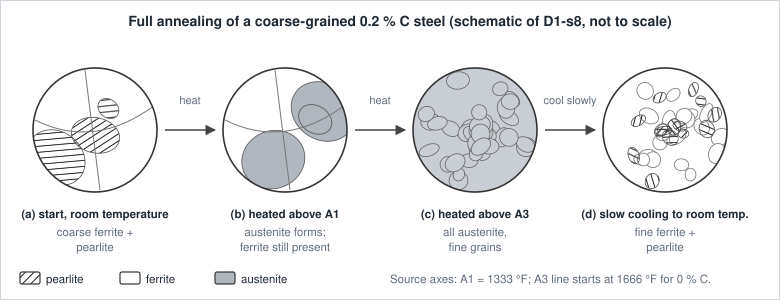

*Figure 4.1: Schematic of the four stages (not to scale).*

### 4.2 Constituents vs carbon (D1-s9)

The slide plots **percent of constituent** against **percent carbon** for slowly cooled steels:

- **Hypoeutectoid steels (below 0.8 % C):** proeutectoid **ferrite** falls linearly from 100 % at 0 % C to 0 at 0.8 % C, while **pearlite** rises to 100 % at 0.8 % C.
- **Hypereutectoid steels (above 0.8 % C):** **proeutectoid cementite** appears and the pearlite share falls slowly.

---

## 5. Spheroidizing

(The slides spell it "Spherodizing"; "spherodite" and "speroidal" also appear. The standard spelling is used here.)

| Item | Notes |
|---|---|
| **Definition** | Produces a **spheroidal or globular form of carbide in a ferrite matrix** to improve machinability (D1-s11) |
| **Purpose** | Minimum hardness, maximum ductility and maximum machinability (D1-s13) |
| **Procedure (three methods, D1-s12)** | 1) **Prolonged holding** just below the lower critical line. 2) **Alternately heating and cooling** between temperatures just above and just below the lower critical line. 3) Heating **above** the lower critical line, then either cooling **very slowly in the furnace** or holding just below the lower critical line |
| **Mechanism (D1-s13)** | Long time at elevated temperature **breaks up pearlite and the cementite network**; cementite becomes **spheres**, "the geometric shape in greatest equilibrium with its surroundings" |
| **Resulting structure** | Cementite particles and the whole structure are called **spheroidite** (spherodite) |
| **Cautions (D1-s13)** | **Low-carbon steel is seldom spheroidized because it becomes gummy.** Holding **too long** makes cementite particles **elongated** and **reduces machinability** |
| **Best suited to** | High-carbon steels (classification slide D1-s18) |

The micrograph on D1-s11 appears to be the same image used for tempering at 1200-1333 °F (D1-s40), consistent with the lecture's remark that such tempering gives a spheroidized-like structure.

---

## 6. Stress-Relief Annealing

| Item | Notes (D1-s15) |
|---|---|
| **Definition** | Process carried out **below the lower critical temperature line**; also called **subcritical annealing** |
| **Temperature** | **1000 to 1200 °F** |
| **Purpose** | Removes **residual stresses** from heavy machining or other cold-working processes |
| **Structure / properties** | No phase change stated (the process stays below the lower critical line) |
| **Cautions** | None stated |

---

## 7. Process Annealing

| Item | Notes (D1-s17) |
|---|---|
| **Definition** | Anneal applied **after cold working** that softens the steel by **recrystallization**, for further working |
| **Used in** | **Sheet and wire industries** |
| **Temperature** | Below the lower critical line, **1000 to 1250 °F** |
| **Relation** | "Very similar to stress-relief annealing" |
| **Best suited to** | Low-carbon steels: restores ductility after cold work (D1-s18) |
| **Cautions** | None stated |

---

## 8. Annealing Comparison

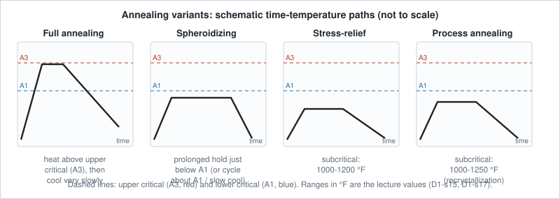

*Figure 8.1: Schematic paths for the four annealing types (not to scale).*

| Process | Where it sits vs critical lines | Temperature stated | Main aim | Typical steel (D1-s18) |
|---|---|---|---|---|
| **Full annealing** | Above the upper critical line, slow cool | "Proper temperature" | Soft, refined, machinable | Low/medium carbon |
| **Spheroidizing** | Just below / around the lower critical line, long time | Not given in °F | Globular carbide, easiest machining | High carbon |
| **Stress-relief annealing** | Below lower critical | **1000-1200 °F** | Remove residual stress | n/a |
| **Process annealing** | Below lower critical | **1000-1250 °F** | Recrystallize / soften after cold work | Low carbon |

> ⚠ **Source note.** D1-s18 (Full annealing / Spheroidizing / Process annealing one-liners) has no lecturer header or footer, so it looks like an added summary slide. Its statements are consistent with the surrounding slides and are used here as the source's classification.

---

## 9. Normalizing

| Item | Notes |
|---|---|
| **Definition** | Heating approximately **100 °F above the upper critical temperature line**, followed by **cooling in still air** to room temperature (D1-s20) |
| **Purpose** | Produce a steel **harder and stronger than full annealing**; improve machinability; **modify and refine cast dendritic structures**; refine the grain; **homogenize** the microstructure to improve response to a later hardening operation (D1-s20) |
| **Cooling** | Still air: faster than furnace cooling in annealing |
| **Resulting structure** | **Finer pearlite** (medium lamellar) than the coarse lamellar pearlite of annealed steel (D1-s22) |
| **Caution / limitation** | The **iron-iron carbide diagram cannot be used to predict** the proportions of ferrite and pearlite, or cementite and pearlite, because cooling is faster than equilibrium (D1-s20) |


*Figure 9.1: Cooling comparison and lamellar spacing (schematic, not to scale; based on D1-s22).*

### 9.1 Numbers from the lecture

| Item | Value (source) | Slide |
|---|---|---|
| Annealed structure of the sample steel | **62 % pearlite, 38 % ferrite** | D1-s21 |
| Same steel after air cooling | only about **10 % ferrite** | D1-s21 |
| Micrograph label | **0.5 C** | D1-s21 |
| Hardness example | annealed **Rockwell C 10** vs normalized **Rockwell C 20** | D1-s22 |

### 9.2 Why normalized steel is harder (D1-s21, D1-s22)

1. Faster cooling gives **fine pearlite**.
2. **Ferrite is very soft** and **cementite is very hard**.
3. In normalized steel the **cementite plates are very close together**, giving increased hardness.
4. The lecture says "it is the cementite network that reduces the strength of annealed hypereutectoid steels", and that **normalized steels show an increase in strength**.

> ⚠ **Source note.** The "hypereutectoid" remark sits on a slide whose micrograph is a **0.5 % C** (hypoeutectoid) steel. Both are kept as printed.

D1-s23 (Fig. 5.4) shows the **same steel (a) as cooled from a high forging temperature** (coarse) and **(b) after normalising** (refined structure).

---

## 10. Hardening and Martensite

### 10.1 How martensite forms (D1-s25, D2-s2)

| Cooling | What happens |
|---|---|
| **Slow** | Carbon atoms **diffuse out of austenite**; iron atoms move slowly to form the **bcc** structure. The **gamma to alpha** transformation is **time-dependent** |
| **Faster** | The increased cooling rate **restricts carbon diffusion** out of austenite |
| **Rapid** | Some iron movement occurs, but the structure **cannot become bcc with trapped carbon**. The resulting structure is **martensite** |

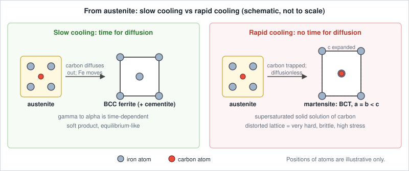

*Figure 10.1: Schematic only; atom positions are illustrative.*

### 10.2 Structure of martensite (D1-s26, D2-s3)

- A **supersaturated solid solution of carbon trapped in a body-centered tetragonal (bct) structure**.
- Two unit-cell dimensions are equal, the third is slightly expanded by trapped carbon: **a = b < c** (the inequality is written explicitly in D2-s3).
- This **highly distorted lattice** is "the prime reason" for the high hardness.
- The expansion during formation produces **high localized stress**, causing **plastic deformation of the matrix**.
- After drastic cooling martensite appears **needle-like** in the microstructure (micrograph D1-s27, D2-s4).

### 10.3 Characteristics of martensite formation (D1-s28, D2-s5)

| Characteristic | Statement |
|---|---|
| Mechanism | **Diffusionless**; **no change in chemical composition** |
| Kinetics | Proceeds **only during cooling** and stops if cooling is interrupted: an **athermal transformation** |
| Stability | **Not a condition of real equilibrium**, although it may persist indefinitely |
| Property | Potential of **very great hardness** |
| Carbon effect | Martensite hardness **increases with carbon content** |
| Other alloys | Martensitic transformation is also seen in **iron-nickel, copper-zinc, copper-aluminum** |

### 10.4 Purpose of hardening and critical cooling rate (D1-s29, D2-s6)

- The basic purpose of hardening is to produce a **fully martensitic structure**.
- The cooling rate at which soft-product formation is avoided is the **critical cooling rate** (see [section 17](#17-critical-cooling-rate)).
- It depends on **chemical composition** and **austenitic grain size**, and austenitic grain size indicates **how fast the steel must be cooled to form only martensite**.

**Cautions.** Martensitic steel is too brittle for most applications and the formation of martensite leaves high residual stresses (D1-s31), which is why hardening is followed by tempering ([section 11](#11-tempering)).

---

## 11. Tempering

| Item | Notes |
|---|---|
| **Definition** | Heating the (hardened) steel to a temperature **below the lower critical temperature** (D1-s31) |
| **Why needed** | Martensitic steel is **too brittle for most applications**; martensite formation leaves **high residual stresses**. Therefore **hardening is always followed by tempering** (D2-s8 highlights this line in red) |
| **Purpose** | Relieve residual stresses; improve **ductility and toughness** |
| **Trade-off** | The gain in ductility is usually at the **sacrifice of hardness or strength** |
| **Trend** | **Hardness decreases and toughness increases as tempering temperature increases** |

### 11.1 The hardness-toughness graph (D1-s32, D2-s9)

Axes: tempering temperature (0-1400 °F) against a shared 0-100 scale labelled "Izod impact, ft-lb" and "Rockwell C hardness".

- **Hardness** starts at about Rc 60, stays high at low temperature, then falls to about Rc 25 near 1300 °F (≈).
- **Toughness** starts near 5 ft-lb, shows a small early hump, a shallow dip in the mid-range, then rises steeply to about 85 ft-lb by about 1200 °F (≈).
- The two curves cross near 900 °F (≈).

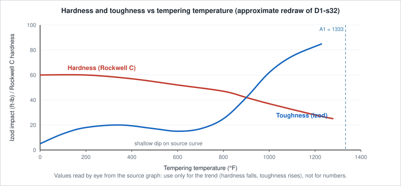

*Figure 11.1: Trend redraw with values read by eye (≈).*

> ⚠ **Source note.** The text says toughness *increases* with tempering temperature, but the plotted curve is not strictly rising: it has a small hump and a dip at low-to-mid temperatures before the steep rise. The text statement is the lecture's summary; the dip is only visible in the graph.

### 11.2 Guidance on where to temper (D1-s33, D2-s10)

| Statement | Value |
|---|---|
| Tempering range | **400 to 800 °F** |
| Main property wanted is **hardness or wear resistance** | temper **below 400 °F** |
| Main property wanted is **toughness** | temper **above 800 °F** |
| Residual stresses | relieved **mostly** by **400 °F**; **almost gone by 900 °F** |

### 11.3 Temper brittleness

**Temper brittleness** is a phenomenon in which steel **loses notched-bar toughness** when tempered at **1000-1250 °F followed by slow cooling**. **Toughness is retained if the part is quenched in water** (D1-s33; highlighted in red in D2-s10).

---

## 12. Tempering Temperature Ranges and Properties

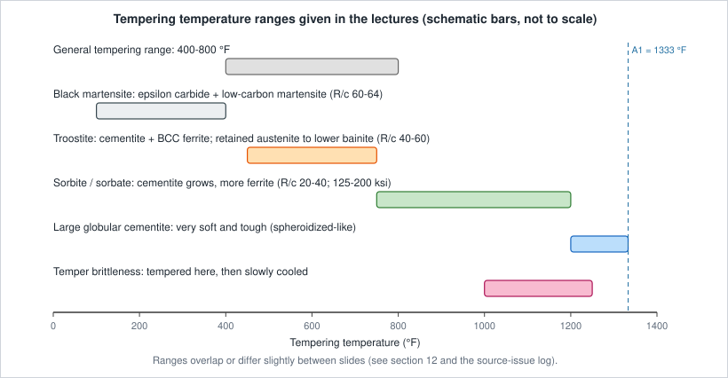

*Figure 12.1: Range bars as stated in D1/D2 (schematic; not to scale).*

### 12.1 Stage-by-stage description

#### 100-400 °F (D1-s34/35, D2-s11/12)

- Structure etches dark: **black martensite**.
- Quenched martensite **begins to lose its tetragonal structure**.
- **Hexagonal close-packed transition carbide (epsilon carbide)** and **low-carbon martensite** form.
- c/a ratio plot: **starts near 1.04 at the lowest temperature** and **falls to about 1.00 by ≈400 °F** (D1-s34).
- Precipitation of transition carbide may cause a **slight increase in hardness**.
- Result: **high strength, high hardness, low ductility, low toughness**; **residual stresses are relieved**.

#### 450-750 °F (D1-s36/37, D2-s13/14)

- Epsilon carbide changes to **orthorhombic cementite**; low-carbon martensite becomes **bcc ferrite**.
- **Retained austenite** transforms to **lower bainite**.
- Carbides are **too small to be resolved** by the optical microscope; the structure etches rapidly to a black mass formerly called **troostite**.
- **Tensile strength about 200,000 psi**; ductility has increased slightly; **toughness is low**.
- **Hardness falls to between Rockwell C 40 and C 60**, depending on tempering temperature.
- Micrographs: 500x (untempered vs tempered martensite labelled) and 9000x. D2-s13 adds a **bainite** micrograph (5 µm scale bar).

#### 750-1200 °F (D1-s38/39, D2-s15/16)

- **Cementite particles keep growing**; **more ferrite matrix** is visible.
- Structure called **sorbate** in the text (sorbite on D2-s18); carbide is **resolvable at 500x**.
- **Tensile strength 125,000-200,000 psi**, **elongation 10-20 % in 2 in.**
- **Hardness Rockwell C 20-40.**
- Most significant change: **rapid increase in toughness**.

#### 1200-1333 °F (D1-s40, D2-s17)

- **Large, globular cementite particles.**
- Structure is **very soft and tough**, similar to a **spheroidized cementite** structure.

### 12.2 Tempering summary (D2-s18)

The summary slide links cooling from austenite to the structures and their hardness (R/c = Rockwell C):

| Structure | How obtained (slide) | Hardness |
|---|---|---|
| Coarse pearlite | cooling rate about **0-1 °F/s** | R/c 15 |
| Medium pearlite | cooling rate about **20 °F/s** | R/c 30 |
| Fine pearlite | cooling rate about **60 °F/s** | R/c 40 |
| Bainite | rapid quench, then **hold 900-400 °F** | R/c 40-60 |
| Martensite | cooling rate **greater than 250 °F/s** | R/c 64 |
| Spheroidized cementite (large, rounded particles) | cooling rate **30-50 °F/h**, or hold **1200-1300 °F** | R/c 5-10 |
| Tempered martensite: **black martensite** (epsilon carbide + low-carbon martensite) | up to **400 °F** | R/c 60-64 |
| Tempered martensite: **troostite** (particles too small to resolve; matrix ferrite; retained austenite to lower bainite) | **400-750 °F** | R/c 40-60 |
| Tempered martensite: **sorbite** (small round resolved cementite, ferrite matrix) | **750-1200 °F** | R/c 20-40 |
| Tempered martensite: spheroidized cementite | **1200-1300 °F** | R/c 5-10 |

### 12.3 Effect of time on tempering (D1-s41, D2-s19)

The graph plots **Rockwell C hardness (25 to 70)** against **time at temperature on a logarithmic scale** (10 seconds, 1 minute, 10 minutes, 1/2 h, 1 h, 2 h, 5 h, 25 h) for **400, 600, 800 and 1000 °F**.

- All four curves start from the same high hardness (≈ Rc 66-67).
- Each falls with time, roughly linearly on the log-time axis after a short initial dashed portion.
- **Higher tempering temperature means lower hardness at any given time.**
- At 25 h the hardness is ≈ Rc 58 (400 °F), ≈ 53 (600 °F), ≈ 43 (800 °F) and ≈ 33 (1000 °F).
- D2-s19 adds a **red horizontal line at Rc 60**; the slide gives no explanation for it.

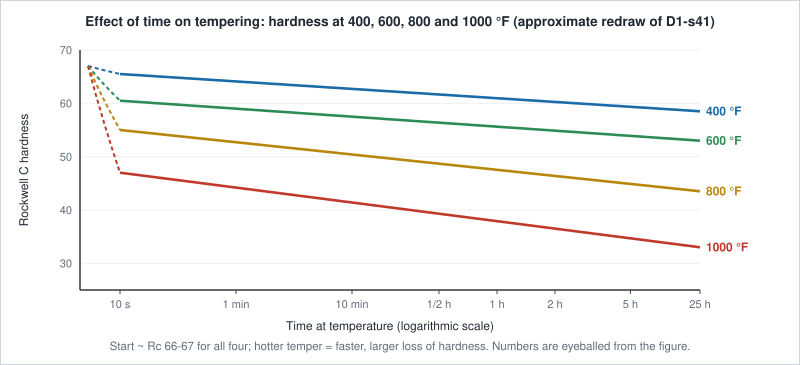

*Figure 12.2: Approximate redraw (values ≈).*

> ⚠ **Source note.** The general range "400-800 °F" (D1-s33) coexists with four stage ranges (100-400, 450-750, 750-1200, 1200-1333 °F). Troostite is given as 450-750 °F (D1-s36) and 400-750 °F (D2-s18). Tempering is defined as "below the lower critical temperature", and 1333 °F is the A1 value used in D1-s8. All are kept as printed.

---

## 13. TTT / Isothermal Transformation Diagrams

### 13.1 Why TTT diagrams are needed (D3-s2)

- The **iron-iron carbide equilibrium diagram is of little value** when steel is cooled under **non-equilibrium** conditions.
- **Time and temperature** of austenite transformation strongly influence the products and properties.
- Studying austenite transformation at a **constant subcritical temperature** is very important.
- Austenite is **unstable below the lower critical temperature**, so we need to know:
  1. **how long it takes to start** transforming,
  2. **how long to transform completely**,
  3. **what the transformation products are**.

### 13.2 Derivation (D3-s3, D3-s4, D3-s5)

"The best way to understand the isothermal transformation diagram is to study its derivation."

| Step | Action |
|---:|---|
| 1 | Prepare a large number of samples of **small cross-section** |
| 2 | Place samples at the proper **austenitizing temperature (1425 °F)** long enough to become completely austenite |
| 3 | Place in a **molten salt bath held at a constant subcritical temperature (1300 °F)** |
| 4 | After **varying time intervals**, **quench each sample in cold water or iced brine** |
| 5 | Check each sample for **hardness** and study it **microscopically** |
| 6 | **Repeat at different subcritical temperatures** |

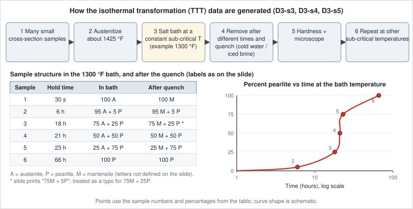

*Figure 13.1: Steps and the sample table from D3-s4, with the pearlite-vs-time curve from D3-s5.*

D3-s4 lists six samples held in the 1300 °F bath and their structures after the quench:

| Sample | Hold | In bath | After quench |
|---:|---|---|---|
| 1 | 30 s | 100 A | 100 M |
| 2 | 6 h | 95 A + 5 P | 95 M + 5 P |
| 3 | 18 h | 75 A + 25 P | 75 M + 25 P |
| 4 | 21 h | 50 A + 50 P | 50 M + 50 P |
| 5 | 23 h | 25 A + 75 P | 25 M + 75 P |
| 6 | 66 h | 100 P | 100 P |

The untransformed austenite becomes martensite on the quench, so the quenched structure records how much pearlite had formed. D3-s5 plots **percent pearlite against time (hours, log scale)** as an S-shaped curve with micrographs of samples 2 to 6.

> ⚠ **Source note.** The slide prints "75M + 5P" for sample 3; "75M + 25P" is used (matching "75A + 25P"). The letters A, P, M are not defined on the slide; they are read as austenite, pearlite, martensite.

### 13.3 Reading one isothermal curve: 700 °F (D3-s6)

The top panel plots **transformation product (%)** (left) and **austenite (%)** (right) against time for a hold at **700 °F**. It marks **Beginning**, **50 %** and **Ending**. Dashed vertical lines carry these three times down to the TTT plot (temperature 400-1200+ °F against time 1 to 10^4 s, log scale), which gives one point on each of the **beginning**, **50 %** and **ending** curves. Repeating this at many temperatures produces the full diagram. (At 700 °F the three times fall roughly at tens of seconds, about a hundred seconds and a couple of hundred seconds; ≈.)

### 13.4 TTT diagram of 1080 eutectoid steel (D3-s7, D4-s2)

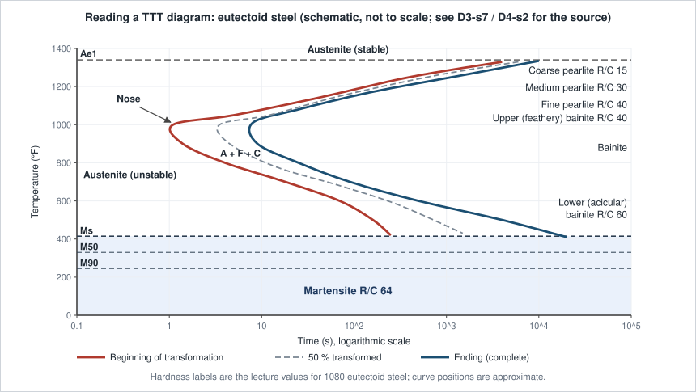

*Figure 13.2: Reading guide (schematic). Positions are approximate; hardness labels are from the source.*

**How to read it**

1. **Axes:** time in seconds on a **log scale** (about 0.5 s to 10^4 s) and temperature in °F.
2. **Ae1** (top dashed line): above it, **austenite is stable**.
3. **Beginning** (left curve) and **Ending** (right curve): between the lower critical line and the Ms line, austenite is **unstable** to the left of Beginning. Between the two curves it is transforming (labelled **A + F + C**); to the right of Ending the transformation is complete. The dashed **50 %** curve sits between them.
4. The "C" shape's leftmost point is the **nose** (about 1000 °F, about 1 s in the source). Below the nose the curves bend right again.
5. **Products and hardness on the source diagram:**

| Region | Hardness on the slide |
|---|---|
| **Coarse pearlite** | R/C 15 |
| **Medium pearlite** | R/C 30 |
| **Fine pearlite** | R/C 40 |
| **Upper or feathery bainite** | R/C 40 |
| **Bainite** (region label) | n/a |
| **Lower or acicular bainite** | R/C 60 |
| **Martensite** | R/C 64 |

6. **Martensite lines:** horizontal lines **Ms** (start; near 400 °F on the scale, ≈), **M50** and **M90** (50 % and 90 % martensite) lie below the bottom of the curves. Martensite forms on cooling below Ms regardless of time (athermal).

### 13.5 TTT diagram of 0.5 % carbon steel (D3-s8)

The source figure labelled "1-T diagram" (isothermal transformation) has:

- dual **°C and °F** temperature axes and a right-hand **Rockwell hardness** scale (about 18 to 62);
- **time axis 0.5 s to 10^6 s**, with markers at **1 min, 1 hour, 1 day, 1 week**;
- upper critical **Ae3** and lower critical **Ae1**; regions **A, A + F, F + C, A + F + C** (austenite, ferrite, cementite); **Ms, M50, M90**;
- asterisks marking **estimated temperature** (for the martensite lines).

Compared with the eutectoid steel, an extra **A + F** region appears between Ae3 and Ae1 because a hypoeutectoid steel forms proeutectoid ferrite first.

### 13.6 Austenite to martensite (D3-s9)

The chart plots **temperature of the quenching bath (°F, about 150 to 450)** against **percent martensite observed (0 to 100)**:

- The curve starts at **Ms** (≈ 410 °F) with almost no martensite; micrographs show a few needles.
- **M50** (≈ 305 °F) and **M90** (≈ 245 °F) are marked; near ≈ 200 °F the structure is essentially all martensite.
- **Lower quench temperature means more martensite**, in line with martensite forming only while cooling.

---

## 14. Pearlite Transformation

| Topic | Source information |
|---|---|
| TTT labels (D3-s7, D4-s2) | **Coarse pearlite R/C 15**, **medium pearlite R/C 30**, **fine pearlite R/C 40** |
| Cooling-rate view (D2-s18) | Coarse: ≈ 0-1 °F/s; medium: ≈ 20 °F/s; fine: ≈ 60 °F/s |
| Micrographs (D4-s3) | **1080 eutectoid steel, 1500x**, isothermally transformed at **1300, 1225, 1150 and 1075 °F** (panels a to d) |
| Trend seen in the micrographs | At 1300 °F the lamellae are clearly resolved; at lower temperatures they become finer and harder to resolve (visual reading; the slide gives no text) |
| Pearlite vs time (D3-s5) | S-shaped growth of percent pearlite with time at the bath temperature; reaches 100 % only after many hours at 1300 °F (see Table in 13.2) |
| Annealed vs normalized pearlite (D1-s22) | **Coarse lamellar** (annealed) vs **medium lamellar** (normalized) |

Pearlite is formed by the transformation of austenite into alternate plates of **ferrite (soft)** and **cementite (hard)**; finer plates mean higher hardness (D1-s22).

> ⚠ **Source note.** The slides titled "Pearlite formed by isothermal transformation" in D4 (s3 to s5) also show **bainite** micrographs. The title is kept as printed.

---

## 15. Bainite Transformation

| Topic | Source information |
|---|---|
| TTT labels | **Upper or feathery bainite R/C 40**; **lower or acicular bainite R/C 60**; region simply labelled **Bainite** |
| Upper / feathery bainite (D4-s4) | **Resembles pearlite in a martensite matrix**; micrograph of bainite **transformed at 850 °F, 15000x** |
| Lower / acicular bainite (D4-s5) | **Resembles martensite**; micrograph of bainite at **500 °F, 15000x** |
| From cooling (D2-s18) | **Rapid quench, then hold 900-400 °F** gives bainite **R/c 40-60** |
| In tempering (D1-s36, D2-s13) | **Retained austenite** transforms to **lower bainite** at 450-750 °F |
| Full-bainite treatment | **Austempering** ([section 18](#18-austempering)); also cooling path 8 ([section 16](#16-cooling-curves-and-ttt-paths)) |

> ⚠ **Source note.** Austempering gives the bainite range as **400-800 °F** (D4-s9), while the summary slide gives **900-400 °F** (D2-s18). Both are kept. The 850 °F and 500 °F micrographs are captioned by temperature only; whether 850 °F is "upper" is inferred from its position on the TTT diagram.

---

## 16. Cooling Curves and TTT Paths

D4-s6 draws eight cooling paths over the 1080-steel TTT diagram; **the position of a path relative to the curves decides the product**.

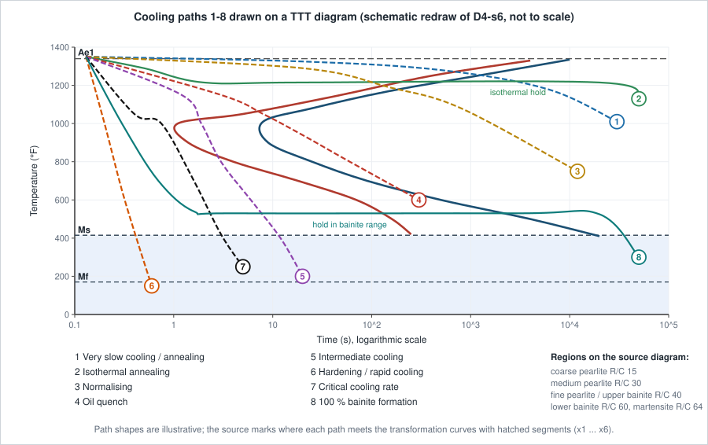

*Figure 16.1: Schematic redraw of D4-s6 (path shapes illustrative).*

| Path | Name on slide | What the figure shows (reading of D4-s6) |
|---:|---|---|
| 1 | **Very slow cooling / annealing** | Very shallow path; crosses the transformation at high temperature → **coarse pearlite** region |
| 2 | **Iso-thermal annealing** | Quick drop to a temperature just under the lower critical line, **hold** until transformation completes, then cool |
| 3 | **Normalising** | Faster than annealing; crosses in the **medium pearlite** region |
| 4 | **Oil quench** | Faster still; crosses in the **fine pearlite / upper bainite** region |
| 5 | **Intermediate cooling** | Clips the **nose** (a little fine pearlite), then continues to Ms, so austenite left over turns to **martensite**: a mixed structure |
| 6 | **Hardening / rapid cooling** | Steep; **misses the nose**; passes Ms and Mf → **martensite** |
| 7 | **Critical cooling rate** | The path just **touching the nose**: slowest cooling that still gives all martensite |
| 8 | **100 % bainite formation** | Quench to a temperature between the nose and Ms and **hold** there until bainite forms completely (the **austempering** route) |

The hatched segments marked x1, x1′ ... x5″, x6 on the source show where each path meets the transformation curves (reading: x is the crossing of Beginning, x′ of Ending; the slide does not label them).

**Intermediate cooling microstructure (D4-s7):** the micrograph shows dark, rounded and network features in a light matrix, i.e. a **mixed structure**, as expected for path 5. The slide gives only the title, "Microstructure of an intermediate cooling rate".

---

## 17. Critical Cooling Rate

| Item | Statement |
|---|---|
| **Definition** | "The cooling rate at which **soft product formation is avoided**" (D1-s29, D2-s6) |
| **On a TTT diagram** | Path **7 (CCR)** in D4-s6: the cooling curve that just avoids the nose |
| **Depends on** | **Chemical composition** and **austenitic grain size** |
| **Why grain size matters** | It "indicates how fast a steel must be cooled to form only martensite" |
| **Numeric hint in the deck** | Martensite is listed for cooling rates **greater than 250 °F/s** (D2-s18 summary) |
| **Goal** | A **fully martensitic** structure (purpose of hardening) |

---

## 18. Austempering

| Item | Notes (D4-s9 to D4-s11) |
|---|---|
| **Definition** | Treatment done to obtain a structure that is **100 % bainite** |
| **Procedure** | 1) Heat to the proper **austenitizing temperature**. 2) **Cool rapidly in a salt bath held in the bainite range (400-800 °F)**. 3) **Leave the part in the bath until transformation is complete.** |
| **Transformation** | Steel is "forced to go directly from **austenite to bainite**" |
| **Advantage** | A **complete heat treatment with no reheating for tempering** |
| **Limitation** | The **mass of the part** being treated; **less than 0.5 inch thick** is mostly suitable |
| **Resulting structure** | Bainite (cooling path 8, [section 16](#16-cooling-curves-and-ttt-paths)) |

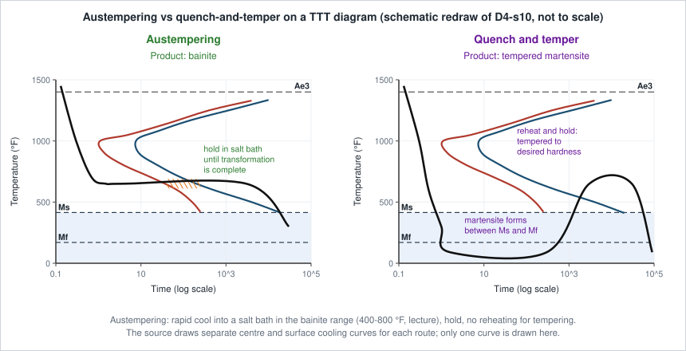

*Figure 18.1: Left: austempering (hold in the bainite range, product bainite). Right: conventional quench and temper (martensite formed between Ms and Mf, then reheated; product tempered martensite). Schematic only; the source shows centre and surface cooling curves for each.*

### 18.1 Effect on mechanical properties (D4-s11)

**Table on the slide (quench-and-temper vs austempering):**

| Property measured | Quench and temper | Austempering |
|---|---:|---:|
| Rockwell C hardness | 49.8 | 50.0 |
| Ultimate tensile strength, psi | 259,000 | 259,000 |
| Elongation, % in 2 in. | 3.75 | 5.0 |
| Reduction in area, % | 26.1 | 46.4 |
| Impact, ft-lb (unnotched round specimen) | 14.0 | 36.6 |
| Free-bend test | Ruptured at 45° | Greater than 150° without rupture |

**Bar comparison on the same slide (hardness Rockwell C 50):**

| Property | Austempered | Quenched and tempered |
|---|---:|---:|
| Reduction of area in tension | 34.5 % | 0.7 % |
| Impact | 35.3 ft-lb | 2.9 ft-lb |
| Slow bend | bends (does not break) | breaks |

**Take-away:** at the **same hardness and tensile strength**, austempered steel shows much greater **ductility, reduction in area and impact toughness**.

> ⚠ **Source note.** The two data sets on D4-s11 give different values for reduction of area (26.1/46.4 vs 0.7/34.5) and impact (14.0/36.6 vs 2.9/35.3). The slide does not say if they are different steels or specimens, so both are reported as printed.

---

## 19. Consolidated Comparison Tables

### 19.1 Heat-treatment processes

| Process | Heating | Cooling / holding | Resulting condition | Main purpose |
|---|---|---|---|---|
| **Full annealing** | Proper temperature (into austenite) | Very slow | Fine ferrite + pearlite, soft | Soften, refine grain, relieve stress, machinability |
| **Spheroidizing** | Just below / around lower critical (three methods) | Prolonged hold, or very slow furnace cool | Globular cementite in ferrite (spheroidite) | Min. hardness, max. ductility and machinability |
| **Stress-relief annealing** | 1000-1200 °F (below lower critical) | Not specified | Stress removed | Residual stress from machining / cold work |
| **Process annealing** | 1000-1250 °F (below lower critical) | Not specified | Recrystallized, softer | Restore workability after cold work |
| **Normalizing** | ≈ 100 °F above upper critical | Still air | Fine (medium lamellar) pearlite | Harder/stronger than annealed; refine and homogenize |
| **Hardening** | Austenitize | At or faster than critical cooling rate | Martensite | Maximum hardness |
| **Tempering** | Below lower critical (100-1333 °F stages) | Reheat and cool | Tempered martensite stages | Relieve stress, gain toughness |
| **Austempering** | Austenitize | Salt bath 400-800 °F, hold to completion | 100 % bainite | Toughness without a separate temper |

### 19.2 Structures and hardness quoted in the decks

| Structure | Hardness (Rockwell C) | Source |
|---|---|---|
| Annealed (example) | 10 | D1-s22 |
| Normalized (example) | 20 | D1-s22 |
| Spheroidized cementite | 5-10 | D2-s18 |
| Coarse pearlite | 15 | D2-s18, D3-s7 |
| Medium pearlite | 30 | D2-s18, D3-s7 |
| Fine pearlite | 40 | D2-s18, D3-s7 |
| Upper (feathery) bainite | 40 | D3-s7 |
| Bainite (general) | 40-60 | D2-s18 |
| Lower (acicular) bainite | 60 | D3-s7 |
| Martensite | 64 | D2-s18, D3-s7 |
| Tempered: black martensite | 60-64 | D2-s18 |
| Tempered: troostite | 40-60 | D1-s36, D2-s18 |
| Tempered: sorbite | 20-40 | D1-s38, D2-s18 |

### 19.3 Temperatures stated in the decks (°F)

| Topic | Value |
|---|---|
| Normalizing | ≈ 100 above upper critical line |
| Stress-relief annealing | 1000-1200 |
| Process annealing | 1000-1250 |
| General tempering range | 400-800 |
| Temper for hardness/wear | below 400 |
| Temper for toughness | above 800 |
| Residual stress relieved | mostly by 400, almost gone by 900 |
| Temper brittleness | 1000-1250 with slow cooling |
| Tempering stages | 100-400; 450-750; 750-1200; 1200-1333 |
| Lower critical (D1-s8) | 1333 |
| TTT derivation: austenitize / bath | 1425 / 1300 |
| Pearlite micrographs | 1300, 1225, 1150, 1075 |
| Bainite micrographs | 850, 500 |
| Bainite range (austempering) | 400-800 |

---

## 20. Exam-Focused Quick Revision

### 20.1 One-line definitions

| Term | Definition |
|---|---|
| Heat treatment | Timed heating and cooling of a solid metal/alloy to get desired properties |
| Full annealing | Heat to proper temperature, cool slowly; soft, refined grain |
| Spheroidizing | Produces globular carbide in ferrite for best machinability |
| Stress-relief (subcritical) annealing | 1000-1200 °F, below lower critical; removes residual stress |
| Process annealing | 1000-1250 °F after cold work; softens by recrystallization |
| Normalizing | ≈ 100 °F above upper critical, cool in still air; harder/stronger than annealed |
| Martensite | Supersaturated solid solution of carbon in bct iron (a = b < c) |
| Critical cooling rate | Rate at which soft products are avoided (fully martensitic) |
| Tempering | Heating hardened steel below lower critical to gain ductility and toughness |
| Temper brittleness | Loss of notched-bar toughness on tempering at 1000-1250 °F and slow cooling |
| TTT diagram | Isothermal transformation diagram: start/finish of austenite decomposition vs time and temperature |
| Austempering | Quench into bainite range (400-800 °F) and hold: 100 % bainite |

### 20.2 High-yield relationships

```text
Slower cooling  -> more time for carbon diffusion -> coarser, softer products
Faster cooling  -> less diffusion                 -> finer, harder products
Very fast       -> carbon trapped                 -> martensite (hard, brittle, stressed)

Tempering temperature UP  -> hardness DOWN, toughness UP, residual stress DOWN
Tempering time UP (fixed T) -> hardness DOWN (log-time graph)

Annealed: coarse lamellar pearlite (Rc 10 example)
Normalized: medium lamellar pearlite (Rc 20 example)
```

### 20.3 Likely short questions

<details>
<summary><b>Q1. Why is hardening always followed by tempering?</b></summary>

Martensite is too brittle for most uses and its formation leaves high residual stresses. Tempering (below the lower critical temperature) relieves the stress and improves ductility and toughness, at the cost of some hardness and strength (D1-s31).
</details>

<details>
<summary><b>Q2. Why is normalized steel harder than annealed steel?</b></summary>

Air cooling is faster than furnace cooling, so the pearlite is finer. Ferrite is very soft and cementite very hard; the closely spaced cementite plates of normalized steel increase hardness (D1-s22). Lecture example: Rc 10 annealed vs Rc 20 normalized.
</details>

<details>
<summary><b>Q3. Explain how a TTT diagram is obtained.</b></summary>

Small samples are austenitized (1425 °F), moved to a salt bath at a constant subcritical temperature (1300 °F) and taken out after different times and quenched in cold water or iced brine. Hardness and microstructure show how much has transformed. The procedure is repeated at other subcritical temperatures, and the start, 50 % and end points are joined into the diagram (D3-s3 to D3-s6).
</details>

<details>
<summary><b>Q4. What does the critical cooling rate depend on?</b></summary>

On chemical composition and austenitic grain size. It is the cooling rate that just avoids soft product formation and gives a fully martensitic structure (D1-s29).
</details>

<details>
<summary><b>Q5. State the structures formed by tempering in the four temperature ranges.</b></summary>

100-400 °F: black martensite (epsilon carbide + low-carbon martensite). 450-750 °F: troostite (cementite + bcc ferrite; retained austenite to lower bainite), Rc 40-60. 750-1200 °F: sorbite/sorbate, Rc 20-40, rapid toughness gain. 1200-1333 °F: large globular cementite, very soft and tough (D1-s34 to D1-s40).
</details>

<details>
<summary><b>Q6. Compare austempering with quench and temper.</b></summary>

Austempering holds the part in a salt bath in the bainite range until it is 100 % bainite and needs no reheating. On D4-s11, at the same hardness (about Rc 50) and tensile strength (259,000 psi), it gives higher elongation (5.0 vs 3.75 %), reduction in area (46.4 vs 26.1 %), impact (36.6 vs 14.0 ft-lb) and a free-bend over 150° without rupture (vs 45°). Limitation: part thickness, mostly under 0.5 in.
</details>

<details>
<summary><b>Q7. Why are low-carbon steels seldom spheroidized?</b></summary>

They become gummy (D1-s13). Holding too long also elongates the cementite particles and reduces machinability.
</details>

---

## 21. Source and Page Traceability

### 21.1 Deck-to-section map

| Source | Slides | Content | Section |
|---|---|---|---|
| **D1** | 1-4 | Title, objectives, basics, critical-range chart | 1-3 |
| | 5-9 | Full annealing (purpose, process, 0.2 % C example, constituents) | 4 |
| | 10-13 | Spheroidizing | 5 |
| | 14-15 | Stress-relief annealing | 6 |
| | 16-18 | Process annealing, classification slide | 7, 8 |
| | 19-23 | Normalizing | 9 |
| | 24-29 | Hardening and martensite | 10, 17 |
| | 30-41 | Tempering, ranges, effect of time | 11, 12 |
| | 42 | Next class (austempering, case hardening) | n/a |
| **D2** | 1-6 | Hardening (repeat; adds a = b < c) | 10, 17 |
| | 7-17 | Tempering (repeat; adds bainite micrograph, red emphasis) | 11, 12 |
| | 18 | Tempering summary | 12.2 |
| | 19 | Effect of time (adds red line at Rc 60) | 12.3 |
| | 20 | Next class | n/a |
| **D3** | 1-2 | TTT title, need | 13.1 |
| | 3-5 | Derivation | 13.2 |
| | 6 | 700 °F curve | 13.3 |
| | 7 | 1080 eutectoid TTT | 13.4, 14, 15 |
| | 8 | 0.5 % C TTT | 13.5 |
| | 9 | Austenite to martensite | 13.6 |
| **D4** | 1-2 | TTT title, 1080 TTT (repeat of D3-s7) | 13.4 |
| | 3 | Pearlite micrographs | 14 |
| | 4-5 | Bainite micrographs | 15 |
| | 6-7 | Cooling curves and intermediate microstructure | 16 |
| | 8-11 | Austempering | 18 |
| | 12 | Next class (case hardening) | n/a |

### 21.2 Source figures and where they are treated

| Figure | Slide | Treatment in these notes |
|---|---|---|
| Critical-lines chart with bands | D1-s4 | Fig. 3.1 (schematic) |
| Annealing of 0.2 % C steel | D1-s8 | Fig. 4.1 (schematic) |
| Constituents vs carbon | D1-s9 | Described in 4.2 |
| Spheroidite, martensite, tempering and bainite micrographs | D1-s11, s27, s37, s39, s40; D2-s4, s13, s14, s16, s17 | Described only |
| Normalizing micrographs and lamellar drawing | D1-s21 to s23 | Fig. 9.1 (schematic) and 9.1 |
| Hardness/toughness vs temperature | D1-s32, D2-s9 | Fig. 11.1 (approximate redraw) |
| c/a ratio plot | D1-s34, D2-s11 | Described in 12.1 |
| Tempering summary | D2-s18 | Table 12.2 |
| Effect of time | D1-s41, D2-s19 | Fig. 12.2 (approximate redraw) |
| TTT derivation figures | D3-s4, s5 | Fig. 13.1 and table |
| TTT diagrams | D3-s6 to s8, D4-s2 | Fig. 13.2 (schematic) and text |
| Martensite fraction chart | D3-s9 | Described in 13.6 |
| Pearlite and bainite micrographs | D4-s3 to s5 | Sections 14, 15 |
| Cooling paths | D4-s6 | Fig. 16.1 (schematic) |
| Austempering vs tempering | D4-s10 | Fig. 18.1 (schematic) |
| Mechanical property table and bars | D4-s11 | Section 18.1 (reproduced as tables) |

### 21.3 Original diagrams (all in `../../assets/`)

`heat-treatment-overview.svg`, `critical-range-bands.svg`, `annealing-0p2c-stages.svg`, `annealing-methods.svg`, `normalizing-vs-annealing.svg`, `martensite.svg`, `tempering-trend.svg`, `tempering-ranges.svg`, `tempering-time.svg`, `ttt-derivation.svg`, `ttt-schematic.svg`, `cooling-paths.svg`, `austempering.svg`

### 21.4 Source issue log

Preserved as printed; none has been silently "corrected".

| # | Where | Issue |
|---:|---|---|
| 1 | D1-s10 to s13 | "Spherodizing", "speroidal", "spherodite" spellings |
| 2 | D1-s4, s8; D3-s7; D3-s8 | Critical-line notation varies (Ac / A / Ae; Ac3,1 undefined) |
| 3 | D1-s18 | Summary slide without lecturer header/footer |
| 4 | D1-s21 | "Annealed hypereutectoid steels" on a 0.5 % C sample slide |
| 5 | D1-s32 vs text | Graph shows a toughness hump and dip; text says toughness increases with temperature |
| 6 | D1-s33 vs stage slides | General range 400-800 °F vs four stage ranges (100-1333 °F) |
| 7 | D1-s36 vs D2-s18 | Troostite 450-750 °F vs 400-750 °F |
| 8 | D1-s38/D2-s15 vs D2-s18 | "Sorbate" vs "sorbite" |
| 9 | D1-s36 vs D2-s13 | "C40 to C60" vs "C40 and C60" (same meaning) |
| 10 | D3-s4 | "75M + 5P" (treated as 75M + 25P); A/P/M not defined |
| 11 | D4-s3 to s5 | Bainite micrographs under the title "Pearlite formed by isothermal transformation" |
| 12 | D4-s9 vs D2-s18 | Bainite range 400-800 °F vs 900-400 °F |
| 13 | D4-s11 | Two mechanical-property data sets with different values, steel not stated |
| 14 | D1-s41, D2-s19 | Effect-of-time slide has no text; D2 adds an unexplained red line at Rc 60 |
| 15 | D1-s42, D2-s20, D4-s12 | Case hardening announced but not covered |

### 21.5 Quality-control checklist

- [x] All four PDFs covered (section 21.1).
- [x] Duplicated topics (hardening, tempering, 1080 TTT, effect of time) merged; unique additions kept (a = b < c, bainite micrograph, tempering summary, Rc 60 line).
- [x] Numbers and units re-checked against the slides; graph readings marked ≈.
- [x] Every image path starts with `../../assets/`; no absolute paths or URLs for local assets.
- [x] Diagrams labelled schematic / approximate where not numerical reproductions.
- [x] External metallurgy facts not introduced as source claims.

---

*Primary source: lecture slides by Dr. Md. Arifuzzaman, Department of Mechanical Engineering, KUET, Khulna.*
