# IPE 101 — Heat Treatment of Steel: Exam Revision Guide

> **Source:** four lecture decks *ipe-101-heat-treatment-1 to 4* (Dr. Md. Arifuzzaman, ME Dept., KUET), cross-checked against published references (see [§15 Verification log](#15-verification-log-and-sources)).
> **Scope:** heat treatment of steel — annealing family, normalising, hardening (martensite), tempering, TTT diagrams, cooling curves, austempering.
> **How to read:** examiners mark the **diagrams, formulas and worked examples** first. Every section therefore opens with the figure to draw, then the numbers, then the short theory.

**Units used in the lecture are °F.** SI equivalents are given throughout: $^\circ\text{C}=(^\circ\text{F}-32)\times\tfrac59$.

| °F | 100 | 400 | 450 | 750 | 800 | 1000 | 1200 | 1250 | 1300 | 1333 | 1425 |
|---|---|---|---|---|---|---|---|---|---|---|---|
| **°C** | 38 | 204 | 232 | 399 | 427 | 538 | 649 | 677 | 704 | **723** | 774 |

---

## Contents

1. [Big picture](#1-big-picture)
2. [Fundamentals and critical temperatures](#2-fundamentals-and-critical-temperatures)
3. [Annealing family](#3-annealing-family)
4. [Normalising](#4-normalising)
5. [Hardening and martensite](#5-hardening-and-martensite)
6. [Tempering](#6-tempering)
7. [TTT (isothermal transformation) diagram](#7-ttt-isothermal-transformation-diagram)
8. [Cooling curves on the TTT diagram](#8-cooling-curves-on-the-ttt-diagram)
9. [Austempering](#9-austempering)
10. [Microstructure gallery](#10-microstructure-gallery)
11. [Formula sheet](#11-formula-sheet)
12. [Worked numerical examples](#12-worked-numerical-examples)
13. [Exam question bank](#13-exam-question-bank)
14. [Common traps](#14-common-traps)
15. [Verification log and sources](#15-verification-log-and-sources)
16. [Original lecture figures](#16-original-lecture-figures)
17. [One-page cheat sheet](#17-one-page-cheat-sheet)

---

## 1. Big picture

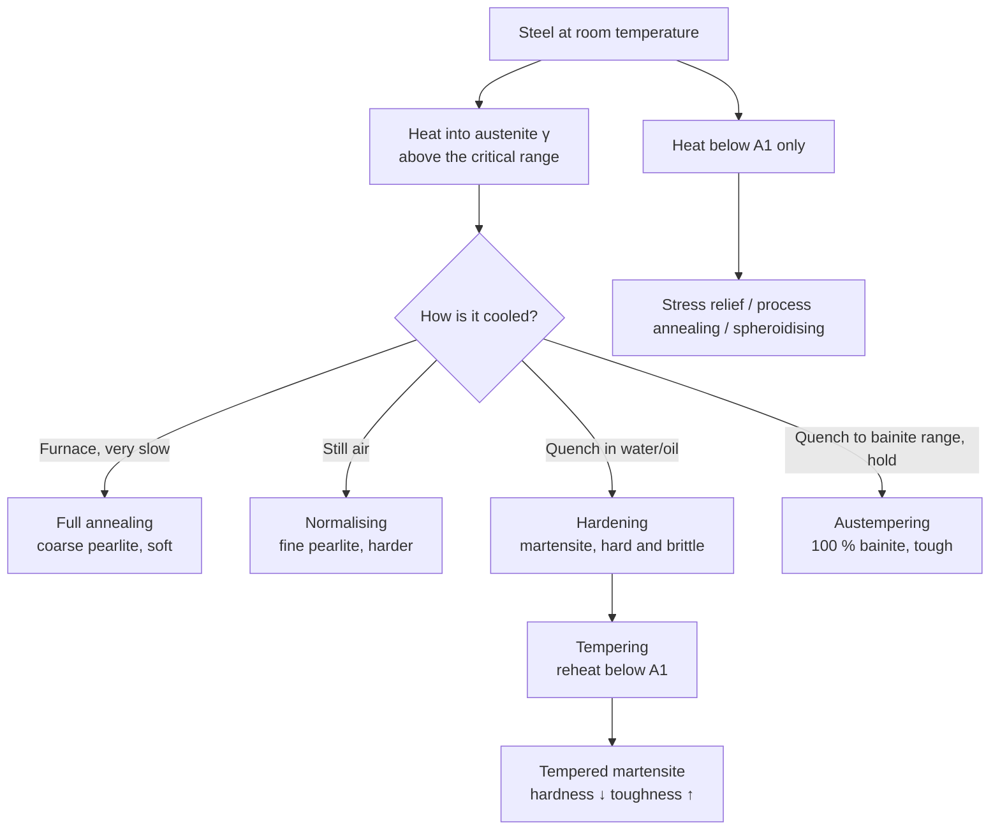
```mermaid
flowchart TD
    A[Steel at room temperature] --> B[Heat into austenite γ<br/>above the critical range]
    B --> C{How is it cooled?}
    C -->|Furnace, very slow| D[Full annealing<br/>coarse pearlite, soft]
    C -->|Still air| E[Normalising<br/>fine pearlite, harder]
    C -->|Quench in water/oil| F[Hardening<br/>martensite, hard and brittle]
    C -->|Quench to bainite range, hold| G[Austempering<br/>100 % bainite, tough]
    F --> H[Tempering<br/>reheat below A1]
    H --> I[Tempered martensite<br/>hardness ↓ toughness ↑]
    A --> J[Heat below A1 only]
    J --> K[Stress relief / process annealing / spheroidising]
```

**Objectives of heat treatment (lecture):**
relieve stresses after hot/cold working • improve strength, hardness, ductility, shock resistance • modify structure for electrical/magnetic properties • improve heat, corrosion and wear resistance • change grain size • stabilise structure at elevated temperature.

**Definition:** a combination of heating and cooling operations, timed and applied to a metal or alloy **in the solid state**, to produce desired properties.

**Key idea:** all basic heat treatments of steel involve the **transformation or decomposition of austenite**. The products (pearlite, bainite, martensite) decide the properties.

---

## 2. Fundamentals and critical temperatures

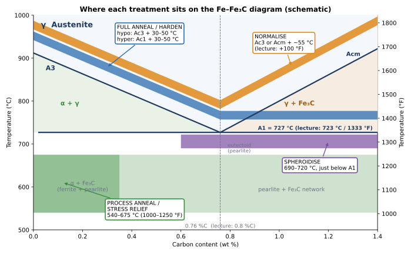

**Figure 1.** Where each treatment sits on the Fe–Fe₃C diagram (schematic, redrawn from the lecture). Draw this in any "compare the heat treatments" question.

| Symbol | Meaning | Value (plain-carbon) |
|---|---|---|
| $A_1$ (lower critical) | eutectoid line; austenite starts to form on heating | 723 °C / 1333 °F (textbooks quote 727 °C) |
| $A_3$ (upper critical) | ferrite → austenite complete (hypoeutectoid) | 912 °C at 0 %C falling to 723 °C at 0.8 %C |
| $A_{cm}$ | cementite dissolved (hypereutectoid) | 723 °C at 0.8 %C rising to about 1147 °C at 2.1 %C |
| Eutectoid composition | 100 % pearlite | ≈ 0.8 %C (lecture); 0.76–0.77 %C in precise data |

**Austenitising rules (lecture):**
- First step of any hardening-type treatment: heat **in or above the critical range** to form austenite.
- **Rate of heating is not significant**, but highly stressed parts should be heated slowly to avoid distortion.
- Austenite is only stable above $A_1$; below it, austenite is *unstable* and its transformation depends on **time and temperature**.

---

## 3. Annealing family

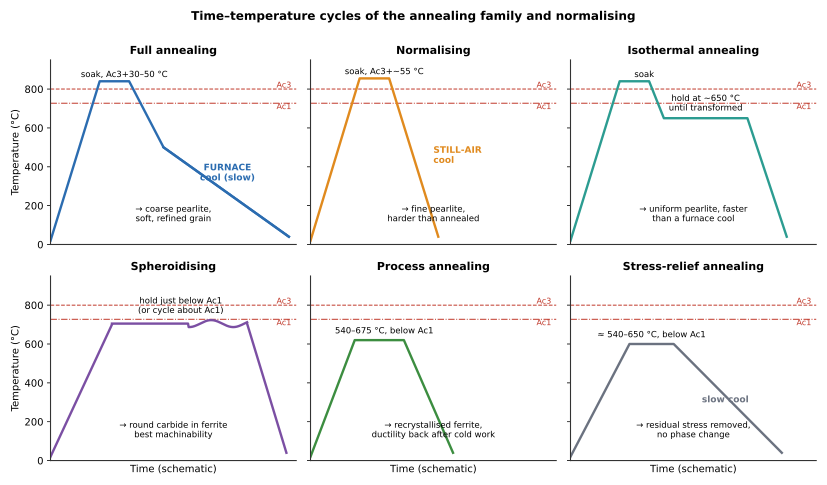

**Figure 2.** Draw the cycle shape (heat, soak, cooling style) for each process. The slope of the cooling line is the whole difference between annealing and normalising.

### 3.1 Full annealing
- Heat to the proper temperature (hypoeutectoid: about $A_3$ + 30–50 °C), soak, then **cool very slowly (furnace)**.
- Because cooling is slow, the structure follows the **equilibrium Fe–Fe₃C diagram**.
- **Purpose:** soften steel, relieve residual stress, refine grain, improve machinability, improve electrical/magnetic properties, remove gas trapped during casting.
- **Result:** coarse lamellar pearlite (+ proeutectoid ferrite in hypoeutectoid steel).
- Used for **low/medium-carbon steels** → soft and ductile.

### 3.2 Spheroidising
- Produces **globular (spheroidal) carbide in a ferrite matrix** → best machinability.
- Three lecture methods:
  1. prolonged holding **just below $A_1$** (about 690–720 °C);
  2. **alternate heating and cooling** just above and below $A_1$;
  3. heat above $A_1$, then cool **very slowly** in the furnace *or* hold just below $A_1$.
- Long time breaks up pearlite and the cementite network; cementite becomes **spheres** (the shape in greatest equilibrium with its surroundings) = **spheroidite**.
- Desirable when **minimum hardness, maximum ductility and maximum machinability** are needed.
- Used for **high-carbon steels**. Low-carbon steel is seldom spheroidised because it becomes **gummy**.
- Held too long → cementite particles elongate and machinability falls.

### 3.3 Stress-relief annealing (sub-critical annealing)
- Below $A_1$, **1000–1200 °F (540–650 °C)**; no phase change.
- Removes residual stress from heavy machining or cold work.

### 3.4 Process annealing
- Below $A_1$, **1000–1250 °F (540–675 °C)**; used in **sheet and wire industries**.
- Applied **after cold working**: softens by **recrystallisation** so the metal can be worked further. Very similar to stress relief.
- Used for **low-carbon steels** → restores ductility after cold work.

### 3.5 Summary table

| Process | Temperature | Cooling | Main aim | Steel |
|---|---|---|---|---|
| Full annealing | $A_3$ + 30–50 °C (above critical) | furnace, very slow | softness, grain refinement | low/medium C |
| Spheroidising | just below or around $A_1$ | very slow / hold | globular carbide, machinability | high C |
| Stress-relief | 540–650 °C (below $A_1$) | slow | remove residual stress | any |
| Process annealing | 540–675 °C (below $A_1$) | air/slow | recrystallise after cold work | low C |
| Normalising | $A_3$ or $A_{cm}$ + about 55 °C | still air | fine grain, higher strength | any |

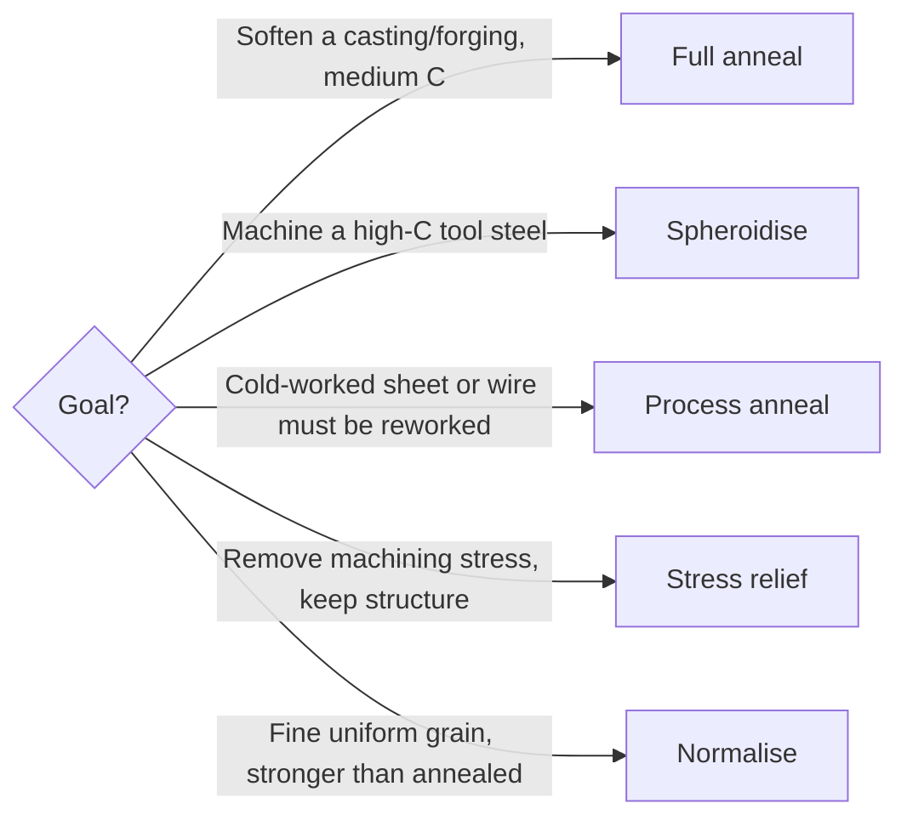
```mermaid
flowchart LR
    Q{Goal?} -->|Soften a casting/forging, medium C| FA[Full anneal]
    Q -->|Machine a high-C tool steel| SP[Spheroidise]
    Q -->|Cold-worked sheet or wire must be reworked| PA[Process anneal]
    Q -->|Remove machining stress, keep structure| SR[Stress relief]
    Q -->|Fine uniform grain, stronger than annealed| NO[Normalise]
```

---

## 4. Normalising

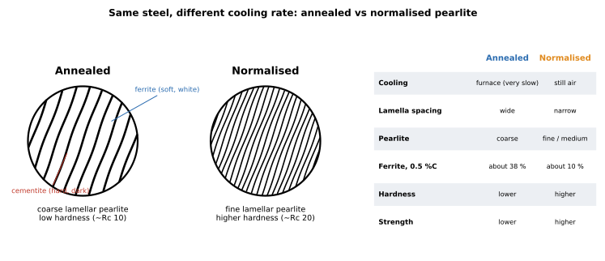

**Figure 3.** Same steel, different cooling rate. **Sketch the two circles** (coarse vs fine lamellae) in every normalising answer.

**Process:** heat about **100 °F (≈ 55 °C) above the upper critical line** ($A_3$ for hypoeutectoid, $A_{cm}$ for hypereutectoid), then **cool in still air**.

**Purpose:**
- harder and stronger steel than full annealing;
- improve machinability; refine grain; homogenise structure;
- refine cast dendritic structure;
- improve response to a later hardening treatment.

**Why it is harder:** faster cooling gives **fine pearlite** — cementite plates lie closer together, so they resist dislocation motion more. Lecture example: annealed hardness **Rockwell C 10** → normalised **C 20**.

**Warning (lecture):** the Fe–Fe₃C diagram **cannot predict** the ferrite/pearlite proportions after normalising, because air cooling is not equilibrium cooling.

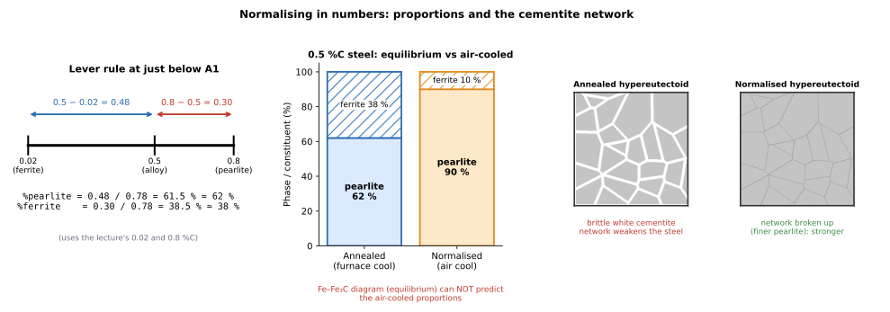

**Figure 4.** Left: lever rule at just below $A_1$. Middle: 0.5 %C steel, equilibrium (62 % pearlite / 38 % ferrite) vs air-cooled (≈ 10 % ferrite). Right: in hypereutectoid steel, annealing leaves a **brittle cementite network** on grain boundaries; normalising breaks it up and the strength rises.

**Worked example (lecture data, 0.5 %C):**

$$\%\text{pearlite}=\frac{0.5-0.02}{0.8-0.02}=61.5\%\approx62\%,\qquad \%\text{ferrite}=\frac{0.8-0.5}{0.8-0.02}=38.5\%\approx38\%$$

After air cooling the same steel shows only **≈ 10 % ferrite** → proof that equilibrium proportions do not hold.

| | Annealed | Normalised |
|---|---|---|
| Cooling | furnace | still air |
| Pearlite | coarse | fine |
| Ferrite in 0.5 %C | ≈ 38 % | ≈ 10 % |
| Hardness (lecture example) | Rc 10 | Rc 20 |
| Strength | lower | higher |
| Network in hypereutectoid | thick cementite network | broken up |

---

## 5. Hardening and martensite

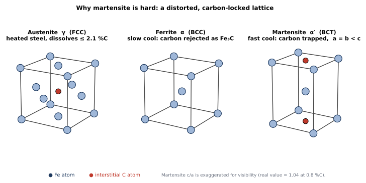

**Figure 5.** Why martensite is hard. Slow cooling: carbon diffuses out of austenite (FCC) and iron forms BCC ferrite. Fast cooling: carbon is **trapped**, the cell cannot become cubic and is stretched along one axis: **body-centred tetragonal (BCT), $a=b<c$**.

### 5.1 Mechanism (lecture)
1. Slow cooling → carbon diffuses out of austenite; iron atoms rearrange to bcc. The γ → α change is **time-dependent**.
2. Fast cooling → carbon cannot escape; iron moves a little but **cannot become bcc with carbon trapped**.
3. Result: **martensite**, a **supersaturated solid solution of carbon in a BCT lattice**.
4. The highly distorted lattice is the **prime reason for high hardness**. The expansion also produces high local stress and plastic deformation of the matrix.
5. Under the microscope: **needle-like** structure.

### 5.2 Characteristics of martensite formation
- **Diffusionless** — no change in chemical composition.
- **Athermal** — proceeds only while temperature falls; **stops if cooling is interrupted**.
- Not a true equilibrium phase, but can persist indefinitely.
- Very great hardness potential; **hardness rises with carbon content**.
- Also seen in Fe–Ni, Cu–Zn, Cu–Al.

### 5.3 Purpose of hardening and critical cooling rate
- Purpose: produce a **fully martensitic** structure.
- **Critical cooling rate (CCR):** the slowest cooling rate that avoids formation of soft products (pearlite/bainite). It is set by **chemical composition and austenite grain size**. Austenite grain size shows how fast the steel must be cooled to get only martensite.
- For the eutectoid steel in the lecture summary figure, cooling faster than about **250 °F/s** gives martensite (Rc 64).

### 5.4 Numbers to know

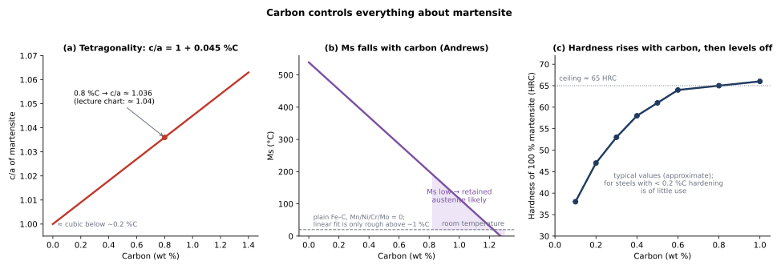

**Figure 6.** (a) tetragonality vs carbon; (b) Ms vs carbon (Andrews); (c) maximum hardness vs carbon. Panels (a) and (b) are drawn from the published equations; (c) is a *schematic* of the well-known trend (ceiling ≈ 65 HRC) — see [§15](#15-verification-log-and-sources).

$$\frac{c}{a}=1+0.045\,(\%\mathrm{C})\qquad\text{(about 1.036 at 0.8 %C; lecture chart shows ≈ 1.04)}$$

$$M_s\,(^\circ\mathrm{C})=539-423\,\mathrm{C}-30.4\,\mathrm{Mn}-17.7\,\mathrm{Ni}-12.1\,\mathrm{Cr}-7.5\,\mathrm{Mo}\qquad(\text{wt \%, Andrews})$$

$$f_M=1-\exp\!\big[-\alpha\,(M_s-T)\big],\quad \alpha\approx0.011\ {}^\circ\mathrm{C}^{-1}\qquad(\text{Koistinen–Marburger})$$

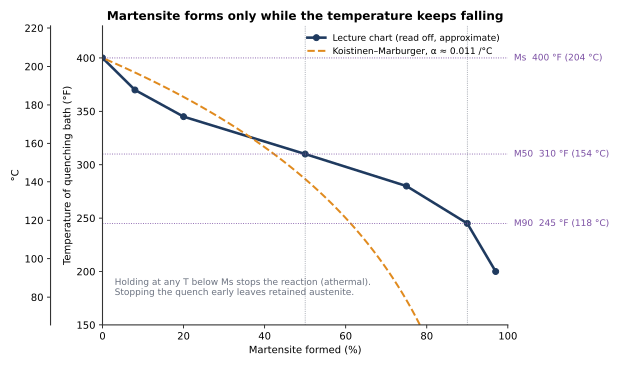

**Figure 7.** Martensite forms **only while temperature keeps falling**. Lecture chart (read off): Ms ≈ 400 °F, M50 ≈ 310 °F, M90 ≈ 245 °F. Stopping a quench early leaves **retained austenite**.

**Hardening vs carbon:** low-carbon steels (< 0.2 %C) gain little from hardening; medium/high-carbon steels reach Rc 55–65. Martensite is lath type at low carbon and plate type at high carbon (mixture between about 0.6 and 1.0 %C).

---

## 6. Tempering

**Why temper:** as-quenched martensite is **too brittle** and carries **high residual stress**. Hardening is therefore **always followed by tempering** — heating below $A_1$ to relieve stress and improve ductility and toughness, **at the cost of some hardness and strength**. Hardness falls and toughness rises as tempering temperature rises.

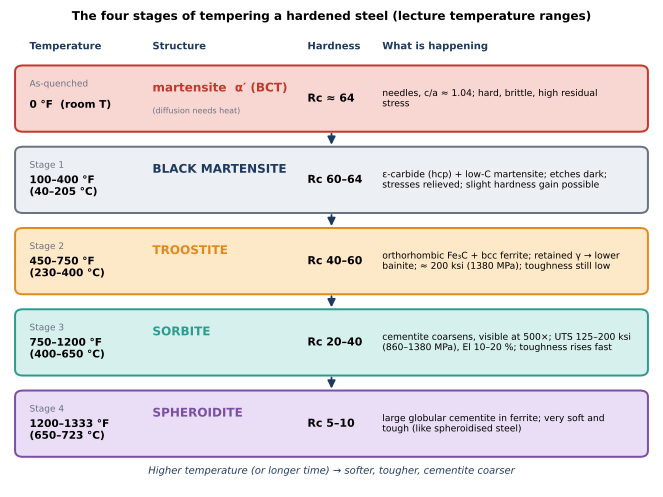

**Figure 8.** The four tempering stages with lecture temperature ranges. Learn this table; it is the most reproducible tempering question.

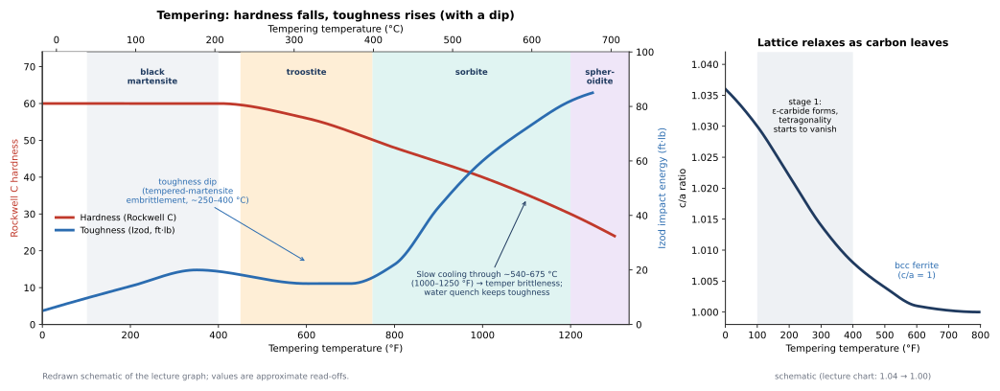

**Figure 9.** Left: hardness falls smoothly, toughness rises but shows a **dip** in the intermediate range. Right: as carbon leaves the lattice the **c/a ratio falls from ≈ 1.04 to 1.00** (schematic of the lecture chart).

### 6.1 Stage-by-stage (lecture)

| Stage | Temp. | Structure | Properties |
|---|---|---|---|
| 1 | **100–400 °F** (40–205 °C) | **Black martensite**: loses tetragonality; **ε-carbide (hcp)** + low-carbon martensite; etches dark | high strength/hardness (Rc 60–64), low ductility and toughness; residual stress relieved; slight hardness increase possible |
| 2 | **450–750 °F** (230–400 °C) | ε-carbide → **orthorhombic cementite**; martensite → **bcc ferrite**; retained austenite → **lower bainite**; carbides too small for optical microscope; **troostite** | UTS ≈ **200 000 psi** (≈ 1380 MPa); Rc 40–60; ductility slightly up, toughness still low |
| 3 | **750–1200 °F** (400–650 °C) | cementite grows, more ferrite; carbide resolvable at 500× → **sorbite** | UTS **125 000–200 000 psi**; elongation **10–20 % in 2 in**; Rc 20–40; **rapid toughness increase** |
| 4 | **1200–1333 °F** (650–723 °C) | large **globular cementite** — like spheroidite | very soft and tough (Rc 5–10) |

### 6.2 Choosing the tempering temperature
- Want **hardness / wear resistance** → temper **below 400 °F**.
- Want **toughness** → temper **above 800 °F**.
- Residual stress is relieved mostly by **400 °F**; almost gone by **900 °F**.
- Most softening happens in the **first minutes**; going from 1 h to 5 h changes hardness little.

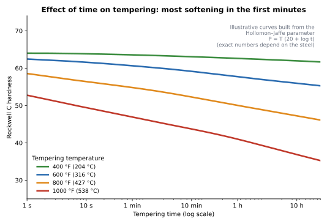

**Figure 10.** Effect of time at four tempering temperatures. The curves are **illustrative**, generated from the Hollomon–Jaffe parameter: temperature and time trade off through

$$P=T\,(C+\log_{10}t),\qquad T\text{ in K},\ t\text{ in hours},\ C\approx20$$

### 6.3 Embrittlement (know both types)

| | Tempered-martensite embrittlement (TME; also called 350 °C or "blue" brittleness) | Temper embrittlement (TE, reversible) |
|---|---|---|
| Range | ≈ 250–400 °C (480–750 °F) | ≈ 375–575 °C (705–1070 °F) |
| Cause | interlath cementite from retained-austenite decomposition; P segregation | P, Sb, Sn, As segregate to prior-austenite grain boundaries during **slow cooling** through the range |
| Reversible? | **No** | **Yes** — reheat above ≈ 575–600 °C, cool fast |
| Cure | avoid tempering in this range | cool fast through the range; low-impurity steel; add Mo |

**Lecture link:** *"Temper brittleness: steel loses notched-bar toughness when tempered at 1000–1250 °F followed by slow cooling; toughness is retained if quenched in water."* That is the **reversible temper embrittlement**. The dip in the lecture's toughness curve at intermediate temperatures is **TME**.

---

## 7. TTT (isothermal transformation) diagram

**Why needed:** the Fe–Fe₃C diagram is of little value for **non-equilibrium** cooling. We must know, at a constant sub-critical temperature, **how long transformation takes to start, how long to finish, and what forms**.

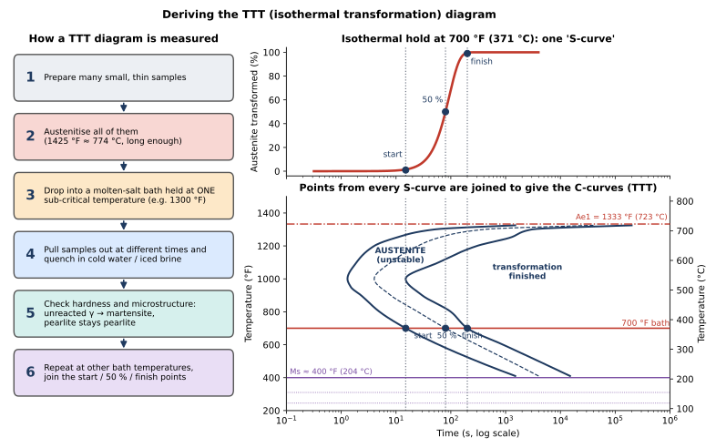

**Figure 11.** Derivation. Left: the six lecture steps. Top right: one temperature gives an **S-curve** (start / 50 % / finish). Bottom right: joining the points from every temperature gives the **C-curves**.

**Six derivation steps (lecture):**
1. Prepare many small, thin samples.
2. Austenitise (**1425 °F**, long enough for full austenite).
3. Put them in a **molten-salt bath at one sub-critical temperature** (e.g. **1300 °F**).
4. After different times, quench each in **cold water / iced brine**.
5. Check **hardness** and examine the **microstructure**.
6. **Repeat at other temperatures.**

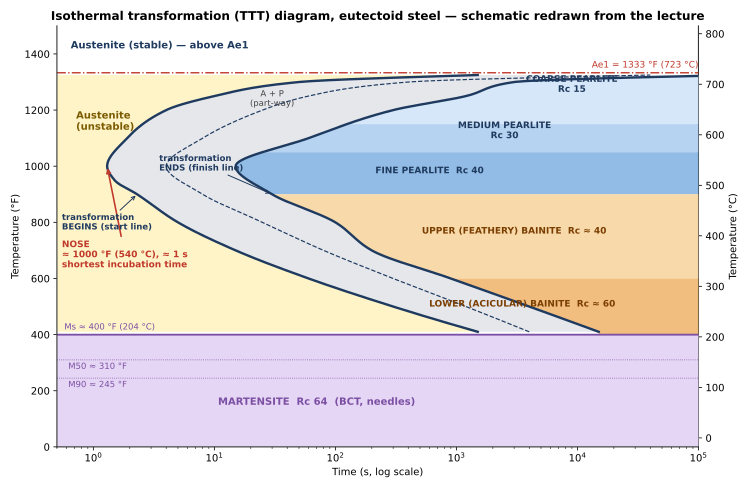

**Figure 12.** TTT diagram for eutectoid (1080-type) steel — **the most important diagram in the course**. Redrawn schematically; landmark values are the lecture's.

### 7.1 Reading the diagram

| Region | Product | Hardness (lecture) |
|---|---|---|
| Just below $A_1$ (~1300 °F), long times | **Coarse pearlite** | Rc 15 |
| ~1150–1200 °F | **Medium pearlite** | Rc 30 |
| Near the **nose** (~1000 °F, ~1 s) | **Fine pearlite** | Rc 40 |
| Below the nose to ~550 °F | **Upper (feathery) bainite** — e.g. 850 °F | Rc ≈ 40 |
| ~500 °F down to Ms | **Lower (acicular) bainite** — looks like martensite | Rc ≈ 60 |
| Below **Ms (≈ 400 °F)** | **Martensite** | Rc 64 |

- Left of the start line: **unstable austenite**. Between start and finish: austenite + product. Right of the finish line: transformation complete.
- **Nose** = shortest incubation time. Above it, transformation is slow because of little undercooling (low driving force); below it, because diffusion is slow. A steel must be cooled **fast enough to miss the nose**.
- **Ms, M50, M90** are horizontal lines: the temperatures at which 0, 50 and 90 % of the austenite have turned to martensite. Martensite does **not** depend on time, only on temperature.
- **Lower transformation temperature → finer structure → harder product.** Pearlite spacing shrinks from coarse to fine as you approach the nose.

### 7.2 Effect of carbon and alloying

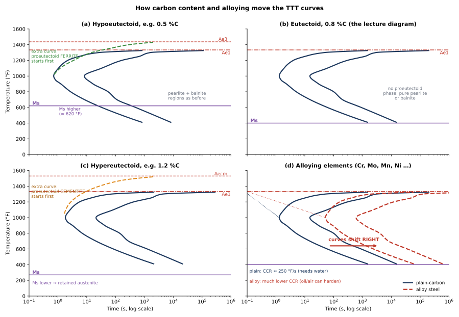

**Figure 13.** (a) hypoeutectoid: an **extra proeutectoid-ferrite curve**, higher Ms. (b) eutectoid: single nose. (c) hypereutectoid: extra **proeutectoid-cementite** curve, lower Ms. (d) **Alloying elements shift curves to the right**, lowering the critical cooling rate, so oil or air quenching can harden the steel. The lecture also shows a TTT diagram for a **0.5 %C steel** (ferrite curve present).

### 7.3 Pearlite and bainite morphologies (lecture micrographs)
- Isothermal pearlite (1080 steel, 1500×) at **1075, 1150, 1225, 1300 °F** — lamellae get coarser as temperature rises.
- **Feathery (upper) bainite** at **850 °F** (15 000×): resembles pearlite in a martensite matrix.
- **Acicular (lower) bainite** at **500 °F** (15 000×): resembles martensite.

---

## 8. Cooling curves on the TTT diagram

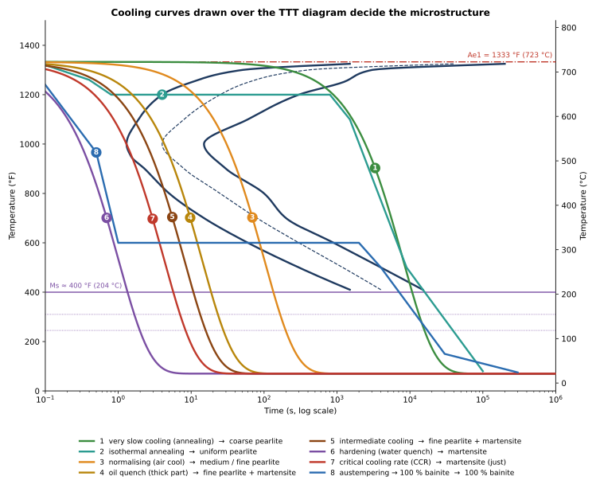

**Figure 14.** The eight cooling paths of the lecture over the TTT diagram. **Rule:** a curve that stays to the **left of the nose** all the way to Ms gives martensite; one that crosses the curves gives pearlite/bainite depending on where.

| # | Path | Cooling | Structure |
|---|---|---|---|
| 1 | Very slow cooling / **annealing** | furnace | coarse pearlite (Rc ≈ 15), about 0–1 °F/s |
| 2 | **Isothermal annealing** | quick to a hold below $A_1$, then hold | uniform pearlite, faster than furnace cooling |
| 3 | **Normalising** | air | medium/fine pearlite |
| 4 | **Oil quench** | moderate | fine pearlite + some martensite (thick sections) |
| 5 | **Intermediate cooling** | faster | fine pearlite + martensite (mixed structure) |
| 6 | **Hardening / rapid cooling** | water | martensite |
| 7 | **Critical cooling rate** | tangent to the nose | just-100 % martensite |
| 8 | **100 % bainite** | quench into bainite range and hold | bainite (austempering) |

**Cooling-rate guide from the lecture summary figure:** ≈ 0–1 °F/s → coarse pearlite (Rc 15); ≈ 20 °F/s → medium pearlite (Rc 30); ≈ 60 °F/s → fine pearlite (Rc 40); **> 250 °F/s → martensite** (Rc 64). Hold at 900–400 °F → bainite (Rc 40–60). 30–50 °F/h or hold at 1200–1300 °F → spheroidite (Rc 5–10).

**Thick-part reminder:** the surface cools faster than the centre, so a thick part can be martensitic at the surface and pearlitic at the core. The lecture's "intermediate cooling" microstructure shows this mixed structure.

---

## 9. Austempering

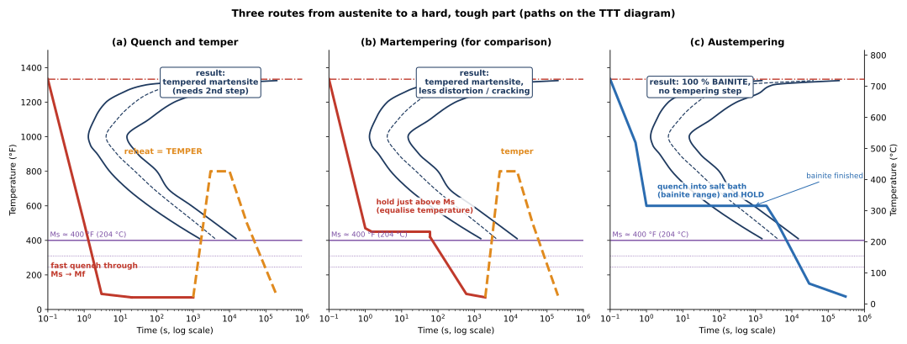

**Figure 15.** (a) quench and temper — two steps. (b) martempering — shown **for comparison only** (not in the lecture). (c) **austempering** — one step, isothermal.

**Process (lecture):**
1. Heat to proper austenitising temperature.
2. **Cool rapidly in a salt bath held in the bainite range (400–800 °F ≈ 205–425 °C)**, missing the nose.
3. **Hold** until transformation is **complete** (100 % bainite).
4. Steel goes **directly from austenite to bainite**; **no reheating/tempering** needed.

**Limitation:** part **mass/thickness** — the whole section must cool past the nose in time. Lecture: **less than 0.5 in (≈ 13 mm)** thick is mostly suitable.

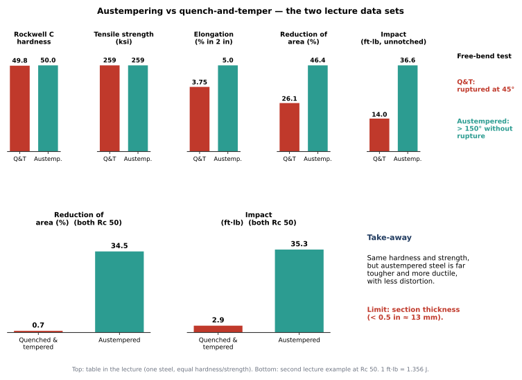

**Figure 16.** Lecture data. At the same hardness (Rc ≈ 50) and the same strength, **austempering is much tougher and more ductile**.

| Property | Quench & temper | Austempering | Ratio |
|---|---|---|---|
| Rockwell C hardness | 49.8 | 50.0 | ≈ 1 |
| Ultimate tensile strength | 259 000 psi (≈ 1786 MPa) | 259 000 psi | 1 |
| Elongation, % in 2 in | 3.75 | 5.0 | 1.3× |
| Reduction in area, % | 26.1 | 46.4 | 1.8× |
| Impact, ft·lb (unnotched) | 14.0 (≈ 19 J) | 36.6 (≈ 50 J) | 2.6× |
| Free-bend test | ruptured at 45° | > 150° **without rupture** | — |

Second lecture example (both Rc 50): reduction of area **0.7 % vs 34.5 %**; impact **2.9 vs 35.3 ft·lb**.

**Advantages:** higher ductility and notch toughness at the same hardness; **less distortion and cracking** (no martensite shock, no tempering); often cheaper because tempering is skipped. **Disadvantage:** section-size limit; long holding times.

---

## 10. Microstructure gallery

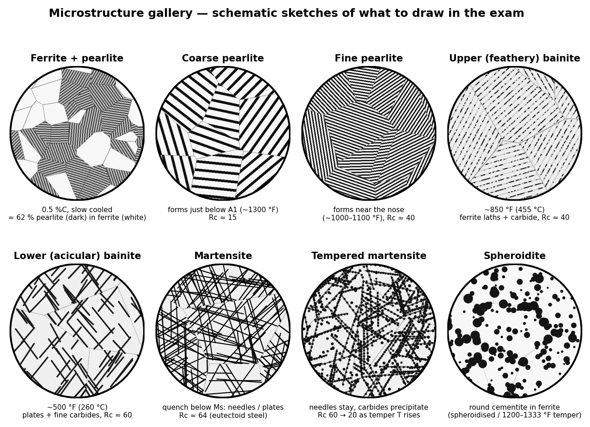

**Figure 17.** Schematic sketches (not real micrographs). In an exam, draw a **circle** and the characteristic texture:

| Structure | Draw | Hardness |
|---|---|---|
| Ferrite + pearlite | white patches + striped grains | Rc 10–20 |
| Coarse pearlite | wide parallel bands | Rc 15 |
| Fine pearlite | closely spaced bands | Rc 40 |
| Upper bainite | feather-like laths, carbide between | Rc ≈ 40 |
| Lower bainite | fine plates at an angle | Rc ≈ 60 |
| Martensite | needles/plates crossing at angles | Rc 64 |
| Tempered martensite | needles with dots (carbides) | Rc 60 → 20 |
| Spheroidite | round dots in white ferrite | Rc 5–10 |

---

## 11. Formula sheet

| Quantity | Formula | Notes |
|---|---|---|
| Temperature conversion | $^\circ\mathrm C=(^\circ\mathrm F-32)\cdot\frac59$ | 1333 °F = 723 °C |
| Lever rule (hypoeutectoid, just below $A_1$) | $\%\text{pearlite}=\dfrac{C_0-0.02}{0.8-0.02}$, $\ \%\text{ferrite}=\dfrac{0.8-C_0}{0.8-0.02}$ | lecture values 0.02 and 0.8 |
| Lever rule (hypereutectoid) | $\%\text{pearlite}=\dfrac{6.67-C_0}{6.67-0.8}$ | 6.67 %C = Fe₃C |
| Martensite tetragonality | $c/a=1+0.045\,(\%\mathrm C)$ | BCT, $a=b<c$ |
| Martensite start | $M_s=539-423C-30.4Mn-17.7Ni-12.1Cr-7.5Mo$ (°C) | wt %, Andrews |
| Martensite fraction | $f_M=1-e^{-\alpha(M_s-T)}$, $\alpha\approx0.011$ | Koistinen–Marburger |
| Tempering parameter | $P=T(C+\log_{10}t)$ | $T$ in K, $t$ in h, $C\approx20$ |
| Equal tempering | $T_1(C+\log t_1)=T_2(C+\log t_2)$ | trade time for temperature |
| Average cooling rate | $\dot T=\dfrac{\Delta T}{\Delta t}$ | compare with CCR |
| Stress | $\sigma=F/A_0$; 1 psi = 6.895 kPa | 200 000 psi ≈ 1379 MPa |
| Energy | 1 ft·lb = 1.356 J | |

---

## 12. Worked numerical examples

**Example 1 — phase fractions after annealing (0.5 %C).**
Using the lecture's end-points 0.02 and 0.8 %C: pearlite = (0.5 − 0.02)/(0.8 − 0.02) = **61.5 %**, ferrite = **38.5 %**. With more precise end-points 0.022 and 0.76: pearlite = (0.5 − 0.022)/(0.76 − 0.022) = 64.8 %, ferrite = 35.2 %. *Use the lecture values unless told otherwise.*

**Example 2 — martensite start of a eutectoid plain-carbon steel (0.77 %C).**
$M_s=539-423(0.77)=539-325.7=213\,^\circ\mathrm{C}\ (\approx416\,^\circ\mathrm F)$.
The lecture chart shows ≈ 400 °F (204 °C); both agree within the scatter of real steels.

**Example 3 — Ms of an alloy steel (0.40 C, 0.80 Mn, 1.0 Cr).**
$M_s=539-423(0.40)-30.4(0.80)-12.1(1.0)=539-169.2-24.3-12.1=333\,^\circ\mathrm C$.

**Example 4 — how much austenite is retained after a quench to 20 °C?** (eutectoid steel, $M_s=213$ °C)
$f_M=1-\exp[-0.011(213-20)]=1-e^{-2.12}=1-0.12=0.88$ → **≈ 88 % martensite, ≈ 12 % retained austenite.** Quenching to sub-zero temperatures would transform more.

**Example 5 — average cooling rate needed to miss the nose.**
Austenite at 1333 °F must reach the nose (≈ 1000 °F) in about 1 s: rate ≈ (1333 − 1000)/1 ≈ **330 °F/s** (≈ 185 °C/s). The lecture summary quotes "**> 250 °F/s**" for the critical rate; the two agree in order of magnitude.

**Example 6 — equivalent tempering (Hollomon–Jaffe, $C=20$).**
A part is tempered **1 h at 500 °C**. What time at **550 °C** gives the same hardness?
$P=773\,(20+\log 1)=15\,463$. At 823 K: $20+\log t=15\,463/823=18.79$ → $\log t=-1.21$ → $t=0.061\ \mathrm h\approx\mathbf{3.7\ min}$.
*(Shows why higher temperature softens much faster than time alone.)*

**Example 7 — unit conversion.** UTS of a tempered troostite structure ≈ 200 000 psi × 6.895 kPa/psi ≈ **1379 MPa**; sorbite 125 000–200 000 psi ≈ **862–1379 MPa**.

**Example 8 — austempering benefit.**
Impact ratio = 36.6/14.0 = **2.6×**; reduction-in-area ratio = 46.4/26.1 = **1.8×**; at equal hardness and equal UTS. In the second example impact rises 35.3/2.9 ≈ **12×**.

**Example 9 — reading the TTT diagram (eutectoid steel).**

| Thermal path | Product |
|---|---|
| Austenitise, furnace cool | coarse pearlite, Rc ≈ 15 |
| Quench to ≈ 1300 °F, hold until finished | coarse pearlite |
| Quench to ≈ 1000 °F (nose), hold | fine pearlite, Rc ≈ 40 |
| Quench to ≈ 850 °F, hold | upper (feathery) bainite, Rc ≈ 40 |
| Quench to ≈ 500 °F, hold | lower (acicular) bainite, Rc ≈ 60 |
| Water quench to room temperature | martensite, Rc 64 (with a little retained austenite) |
| Quench to ≈ 310 °F and hold | ≈ 50 % martensite (M50); rest stays as unstable austenite |
| Quench to 1000 °F, hold 0.5 s, then water quench | still martensite (no time to start pearlite) |

---

## 13. Exam question bank

*Answers are in collapsed blocks. Cover them and try first; the bold words in each answer are the mark-earners.*

**Q1. List the objectives of heat treatment of steel.**

Answer

Relieve stresses after hot/cold work; improve tensile strength, hardness, ductility and shock resistance; modify structure for electrical/magnetic properties; improve resistance to heat, corrosion and wear; change grain size; stabilise structure at elevated temperature. **Draw Fig. 1** if the question asks for temperatures.

**Q2. Compare full annealing, normalising and hardening with temperature ranges and structures.**

Answer

Draw Fig. 2 (three cycles). Full anneal: $A_3$ + 30–50 °C, **furnace cool**, coarse pearlite, softest. Normalise: $A_3$ (or $A_{cm}$) + ~55 °C, **air cool**, fine pearlite, harder (Rc 10 → 20 in the lecture example). Harden: austenitise, **quench** faster than critical rate, **martensite** (Rc up to 64), then temper.

**Q3. What is spheroidising? Why is it not used for low-carbon steel?**

Answer

Heat treatment giving **globular cementite in ferrite** to maximise machinability and ductility and minimise hardness. Three methods (hold just below $A_1$; cycle about $A_1$; heat above $A_1$ then very slow cool). Low-carbon steel becomes **gummy**; too long a hold elongates the carbides.

**Q4. Distinguish process annealing from stress-relief annealing.**

Answer

Both are **sub-critical** (below $A_1$, ≈ 1000–1250 °F). Process annealing follows **cold working** and softens by **recrystallisation** for further working (sheet, wire). Stress relief removes **residual stress** (e.g. heavy machining) without recrystallising.

**Q5. Explain why normalised steel is harder than annealed steel. Why can the Fe–Fe₃C diagram not be used?**

Answer

Air cooling gives **fine pearlite** (closer cementite plates) → higher hardness and strength. Sketch Fig. 3. The Fe–Fe₃C diagram assumes **equilibrium**, which needs very slow cooling; air cooling leaves ≈ 10 % ferrite instead of 38 % in 0.5 %C steel (Fig. 4).

**Q6. What is martensite? State its characteristics and explain its high hardness.**

Answer

**Supersaturated solid solution of carbon in BCT iron** (Fig. 5). **Diffusionless, athermal**, no composition change, non-equilibrium, needle-like; hardness rises with carbon. Hardness comes from the **highly distorted lattice** and high internal stress (c/a ≈ 1 + 0.045 %C).

**Q7. Define critical cooling rate and state what decides it.**

Answer

The **minimum cooling rate that avoids soft products** (pearlite/bainite) and gives fully martensitic structure. Depends on **chemical composition and austenite grain size**. On the TTT diagram it is the cooling curve **tangent to the nose** (Fig. 14, curve 7). Alloying shifts the curves right and lowers it (Fig. 13d).

**Q8. Why is tempering needed? Describe the four tempering stages.**

Answer

Martensite is **brittle with high residual stress**. Reproduce **Fig. 8** (four rows with temperature, structure, hardness). Add the rule: below 400 °F for hardness/wear, above 800 °F for toughness.

**Q9. Explain temper brittleness and how to avoid it.**

Answer

Loss of notched-bar toughness when tempered at **1000–1250 °F and slow cooled**; toughness is retained by **water quenching** after tempering. Cause: impurity (P, Sb, Sn, As) segregation to grain boundaries. **Reversible** by heating above ≈ 575–600 °C and cooling fast; Mo additions help. Separate from the irreversible **tempered-martensite embrittlement** at ≈ 250–400 °C.

**Q10. Describe how a TTT diagram is constructed.**

Answer

Draw **Fig. 11** and give the **six steps**: many thin samples → austenitise (1425 °F) → salt bath at one sub-critical T (e.g. 1300 °F) → quench after different times → hardness + microscope → repeat at other temperatures. Join start/50 %/finish points to get the C-curves.

**Q11. Sketch the TTT diagram of a eutectoid steel and label all regions.**

Answer

Reproduce **Fig. 12** with: $A_1$ (1333 °F), nose (~1000 °F, ~1 s), coarse/medium/fine pearlite (Rc 15/30/40), upper bainite (≈ Rc 40), lower bainite (≈ Rc 60), Ms/M50/M90, martensite (Rc 64), unstable austenite to the left of the start curve.

**Q12. Superimpose cooling curves for annealing, normalising and hardening on a TTT diagram and give the structures.**

Answer

Use **Fig. 14**: curve 1 (annealing) → coarse pearlite, 3 (normalising) → fine pearlite, 6 (water quench) → martensite, 7 = critical rate (tangent to the nose), 5 = intermediate cooling → pearlite + martensite.

**Q13. What is austempering? State its advantages and its limitation.**

Answer

Austenitise → quench into salt bath **within the bainite range (400–800 °F)** → **hold** until fully bainitic. **No tempering needed**; **higher ductility and toughness at the same hardness**, less distortion/cracking. Limitation: **part thickness** (< 0.5 in). Quote the table: impact 36.6 vs 14.0 ft·lb, reduction of area 46.4 vs 26.1 %, free bend > 150° vs rupture at 45° (Fig. 16).

**Q14. Compare bainite and martensite, and upper and lower bainite.**

Answer

Bainite forms **isothermally** by partly diffusive transformation between the pearlite range and Ms; martensite is **diffusionless** below Ms. Upper (feathery) bainite forms at higher T (e.g. 850 °F), resembles pearlite, Rc ≈ 40; lower (acicular) bainite forms at lower T (e.g. 500 °F), resembles martensite, Rc ≈ 60, tougher at a given hardness.

**Q15. Numerical: a 0.5 %C steel is slow cooled. Find the phase percentages and the hardness change on normalising.**

Answer

Use Example 1: pearlite 62 %, ferrite 38 %. After air cooling ferrite ≈ 10 %, pearlite finer; hardness up (lecture example Rc 10 → Rc 20).

---

## 14. Common traps

- **Annealing vs normalising:** the *only* difference in the cycle is the cooling — furnace vs air. Do not swap the results (annealed = softer).
- **$A_3$ vs $A_1$:** full annealing/normalising/hardening of hypoeutectoid steel start above $A_3$; spheroidising, process annealing and stress relief stay **below $A_1$**.
- **Hardening is not finished until tempering** — hardened parts are never used as-quenched.
- **Martensite is athermal:** holding at a temperature below Ms does not create more martensite. Cooling further does.
- **Faster cooling ≠ always martensite:** it must exceed the **critical** rate, which depends on composition and grain size.
- **Tempering lowers hardness but raises toughness**; the one exception is the small toughness dip (TME) around 250–400 °C, and the slight hardness rise in stage 1.
- **Bainite ≠ tempered martensite,** although both contain ferrite and carbides.
- **Low-carbon steel cannot be usefully hardened** (little martensite hardness); also seldom spheroidised.
- **Lecture temperatures are in °F** — convert if the question is in °C.
- **TTT diagrams apply only to isothermal holds.** Continuous cooling curves drawn on a TTT diagram (Fig. 14) are a teaching approximation; true continuous cooling uses a CCT diagram (curves shift down and right).

---

## 15. Verification log and sources

Everything below was checked against the lecture and against outside sources. Where they differ, the difference is stated so you can decide what to write.

### 15.1 Checked and consistent

| Claim | Lecture | External check |
|---|---|---|
| Normalising = heat above $A_3$/$A_{cm}$, still-air cool, finer pearlite and higher strength than annealing | ✔ (+100 °F) | ✔ (30–50 °C above $A_3$ in most handbooks; hypereutectoid above $A_{cm}$) |
| Full annealing above $A_3$, furnace cool | ✔ | ✔ ($A_3$ + 30–50 °C) |
| Spheroidising just below $A_1$ (or cycled about $A_1$) | ✔ | ✔ (≈ 690–720 °C; used for high-C / tool steels) |
| Process annealing 550–650 °C below $A_1$ (lecture 540–675 °C) | ✔ | ✔ |
| Martensite is BCT with $c/a$ rising with carbon: $c/a=1+0.045\,\%C$ | ✔ (chart ≈ 1.04) | ✔ (several XRD studies; some report a value nearer 1 below ≈ 0.2–0.6 %C) |
| Andrews $M_s$ equation | (not in lecture) | ✔ (widely used; same coefficients in several sources) |
| Hollomon–Jaffe $P=T(C+\log t)$, $C\approx20$, $t$ in hours | (not in lecture) | ✔ |
| Austempering in the bainite range with no tempering; section limit ≈ 13 mm | ✔ (0.5 in) | ✔ |
| Toughness advantage of austempering | ✔ (table) | ✔ |
| Reversible temper embrittlement 375–575 °C from P/Sb/Sn/As segregation; TME 250–400 °C irreversible | ✔ (1000–1250 °F) | ✔ |
| TTT for eutectoid steel: pearlite nose ≈ 540–550 °C, bainite below, Ms ≈ 220–240 °C | ✔ (nose ≈ 1000 °F, Ms 400 °F) | ✔ |

### 15.2 Differences you should know about

| Item | Lecture | Literature | What to write |
|---|---|---|---|
| Eutectoid temperature | 1333 °F = 723 °C | 727 °C | 723–727 °C; use **723 °C** for the lecture diagram |
| Ms of eutectoid steel | 400 °F ≈ 204 °C | ≈ 213–240 °C (Andrews gives 213 °C) | quote 400 °F for the lecture TTT figure, mention that real values scatter |
| Eutectoid carbon | 0.8 %C | 0.76–0.77 %C | 0.8 %C in numerical work unless asked otherwise |
| Reversible temper-embrittlement range | 1000–1250 °F (540–675 °C) | 375–575 °C | quote the lecture range, note it is the same phenomenon |
| Tempering stage 1 upper limit | 400 °F (205 °C) in slides; summary figure labels black martensite "up to 400 °F" and troostite 400–750 °F | textbooks: first stage ≈ 100–250 °C | keep the lecture ranges; small overlaps between stages are normal |
| Normalising temperature | $A_3$ + 100 °F (≈ 55 °C) | $A_3$ + 30–50 °C (some go 40–55) | both acceptable; state the source |
| Austempering temperature | 400–800 °F (205–425 °C) | 260–400 °C | inside the same range |

### 15.3 Figures: what is exact and what is schematic

| Figure | Basis |
|---|---|
| 1, 2 | Temperatures from lecture and handbooks; shapes schematic |
| 3, 4 | Numbers from lecture (62/38 %, ≈ 10 % ferrite, Rc 10/20); drawings schematic |
| 5 | Lattice sketches; c/a exaggerated |
| 6 | (a) and (b) plotted from the published equations; **(c) is a schematic of the accepted trend** (ceiling ≈ 65 HRC) — do not quote its intermediate values as data |
| 7 | Points read off the lecture chart (approximate); Koistinen–Marburger curve with the commonly used α ≈ 0.011 °C⁻¹ (constant not re-checked in this session) |
| 8, 9 | Hardness/toughness curves redrawn from the lecture graph; **approximate read-offs** |
| 10 | **Illustrative** — the Hollomon–Jaffe parameter is real, but the hardness-vs-$P$ mapping is a made-up smooth curve to show the trend |
| 11–16 | TTT shape and landmarks (Ae1 1333 °F, nose ≈ 1000 °F at ≈ 1 s, Ms 400 °F, M50 ≈ 310 °F, M90 ≈ 245 °F, hardness labels) taken from the lecture; intermediate points **schematic**. Table data in Fig. 16 are the lecture's |
| 17 | Hand-generated sketches, not micrographs |

### 15.4 Sources

Lecture: *ipe-101-heat-treatment-1…4*, Dr. Md. Arifuzzaman, KUET (whose figures are scans of textbook pages, headed "Introduction to Physical Metallurgy").

External references consulted:
- Martensite tetragonality: <https://www.sciencedirect.com/science/article/abs/pii/S0921509317307128> · <https://www.sciencedirect.com/science/article/abs/pii/S0167577X18308383> · <https://www.sciencedirect.com/topics/engineering/martensite-formation>
- Ms equations: <https://www.jstage.jst.go.jp/article/isijinternational/57/12/57_ISIJINT-2017-212/_pdf> · <https://www.sciencedirect.com/topics/engineering/martensite-start-temperature>
- Annealing / normalising / spheroidising practice: <https://www.sciencedirect.com/topics/engineering/full-annealing> · <https://metallurgyzone.com/annealing-steel-types-guide/> · <https://www.sakysteel.com/news/heat-treatment-of-steels>
- Austempering: <https://gearsolutions.com/departments/hot-seat/understanding-the-different-types-of-heat-treating/> · <https://gearsolutions.com/departments/hot-seat/back-to-basics-austempering-and-its-advantages/> · <https://en.wikipedia.org/wiki/Austempering>
- Embrittlement: <https://thermalprocessing.com/tempered-martensite-embrittlement/> · <https://thermalprocessing.com/temper-embrittlement-in-steels/>
- TTT diagram: <https://www.phase-trans.msm.cam.ac.uk/2012/Manna/Part2.pdf> · <https://learnmech.com/what-is-ttt-diagram-isotherma/> · <https://www.sciencedirect.com/topics/engineering/eutectoid-steel>
- Tempering parameter: <https://en.wikipedia.org/wiki/Hollomon%E2%80%93Jaffe_parameter> · <https://www.researchgate.net/publication/240749243_A_historical_overview_of_steel_tempering_parameters>
- Martensite hardness ceiling (Burns–Moore–Archer): thyssenkrupp carbon-steel product information sheet, <https://www.thyssenkrupp-steel.com/media/content_1/publikationen/produktinformationen/c_stahl/thyssenkrupp_c-staehle_product_information_steel_en.pdf>

*Martempering appears in Fig. 15 and the trap list only as a comparison; it is not in the four lecture decks. The lecture ends with "Next class: Case hardening", which is not covered here.*

---

## 16. Original lecture figures

Clean figures lifted from the decks, useful for checking against your own notes.

**Annealing / normalising**

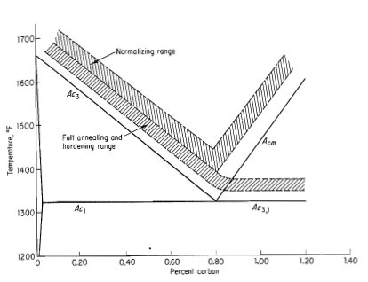
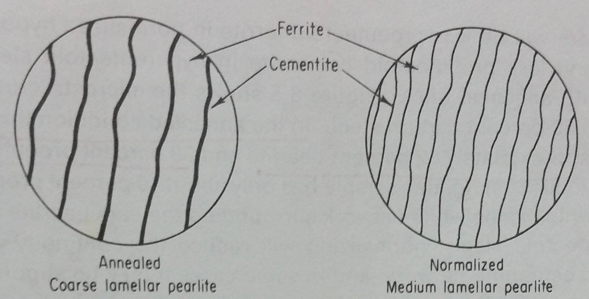

**Martensite and tempering**

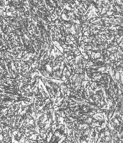
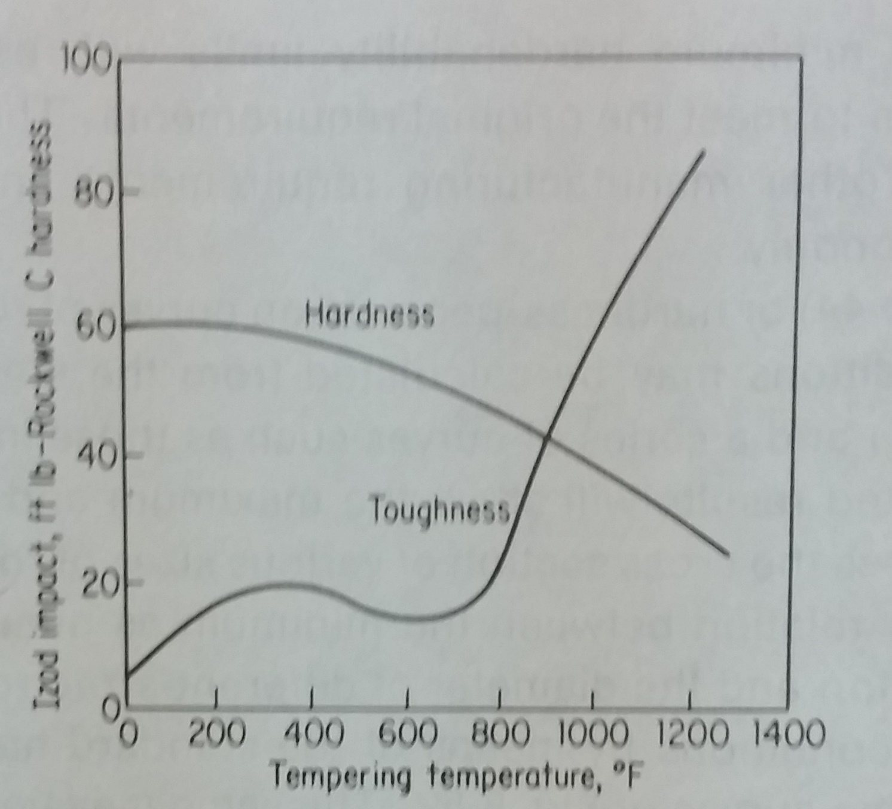
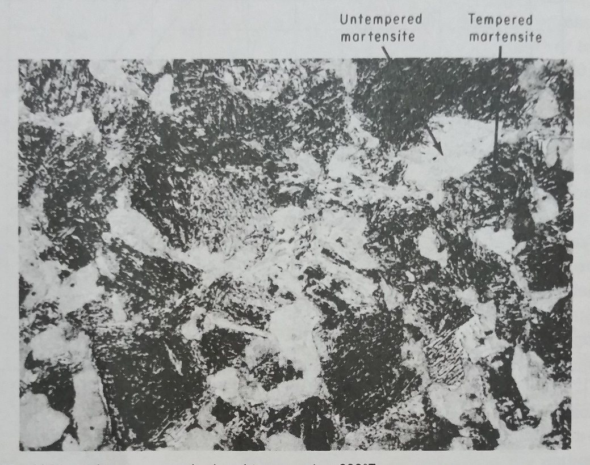
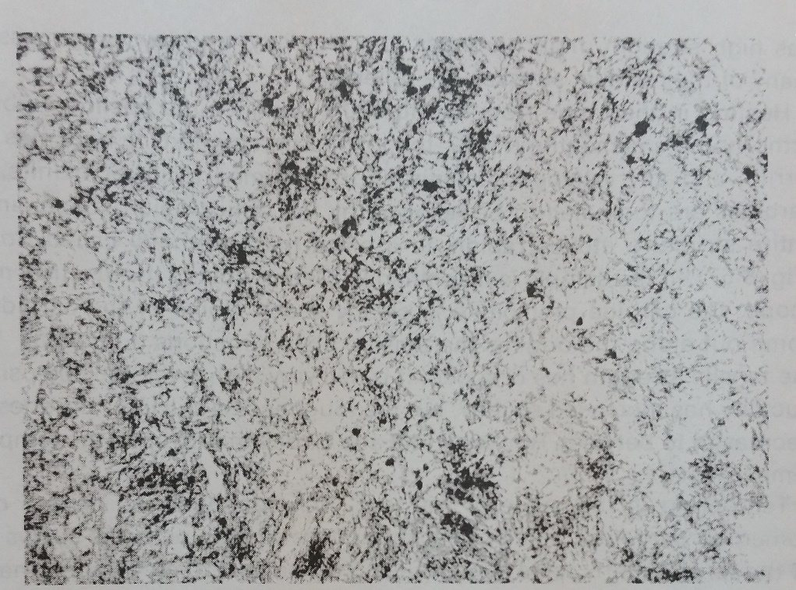
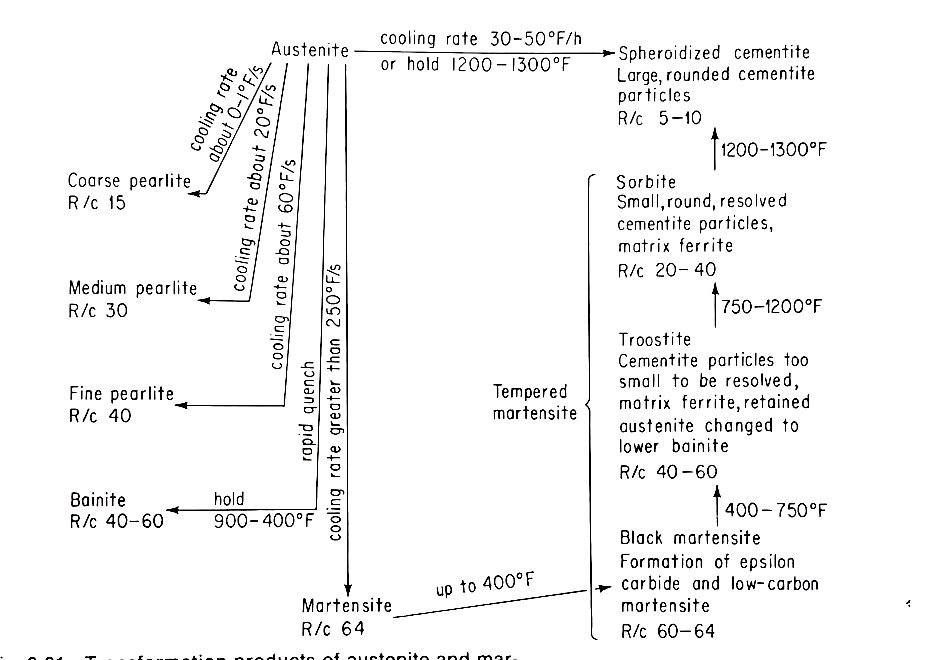

**TTT and cooling**

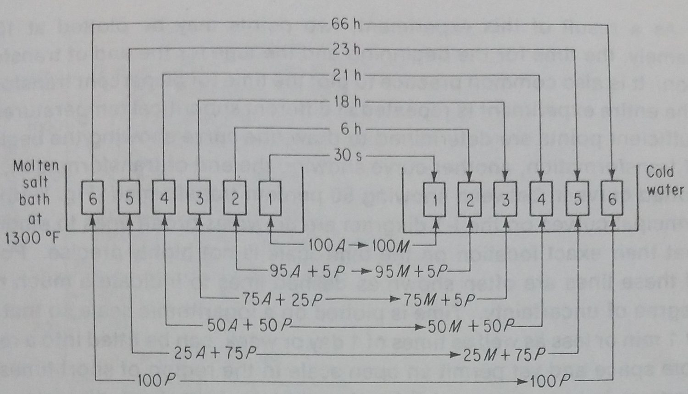
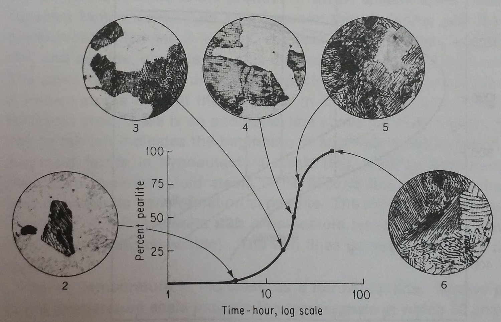
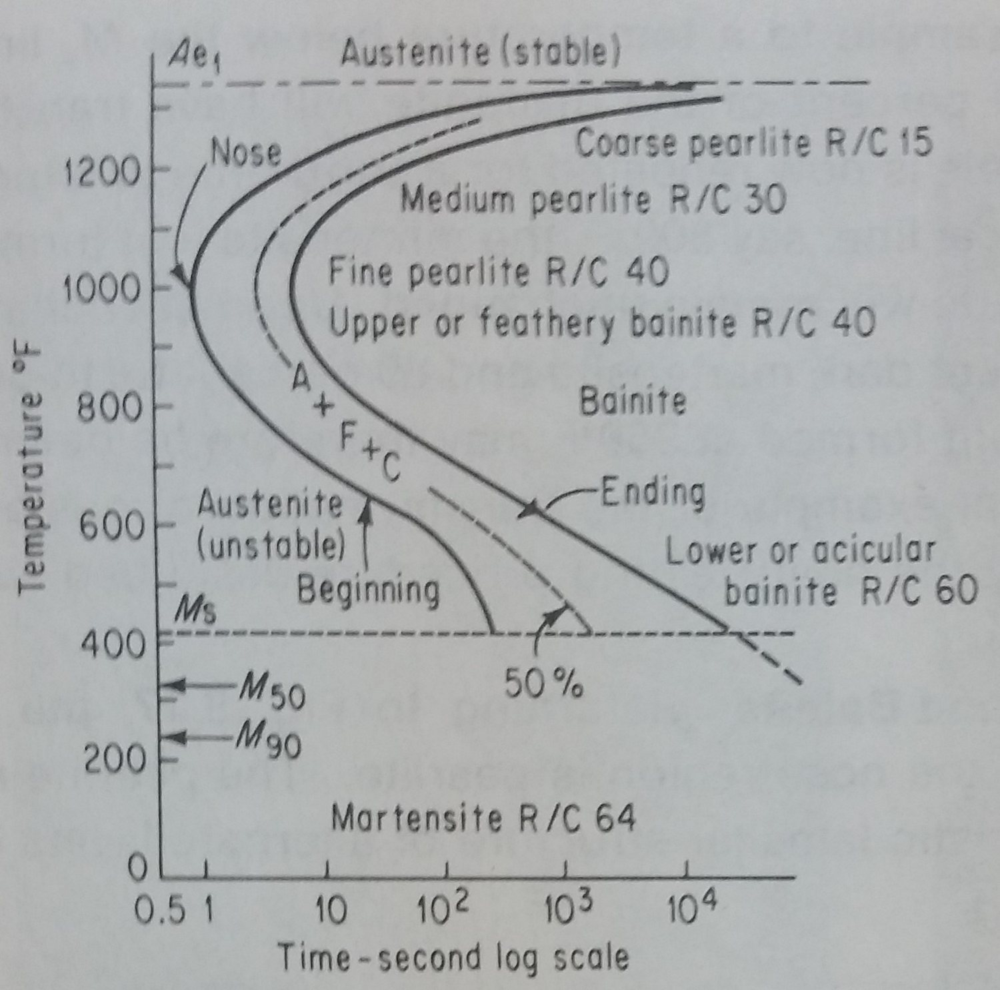
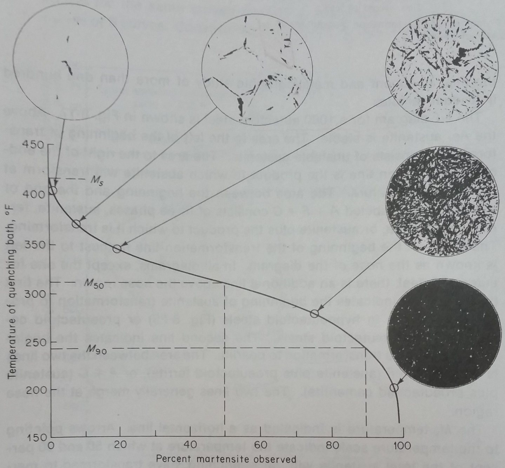
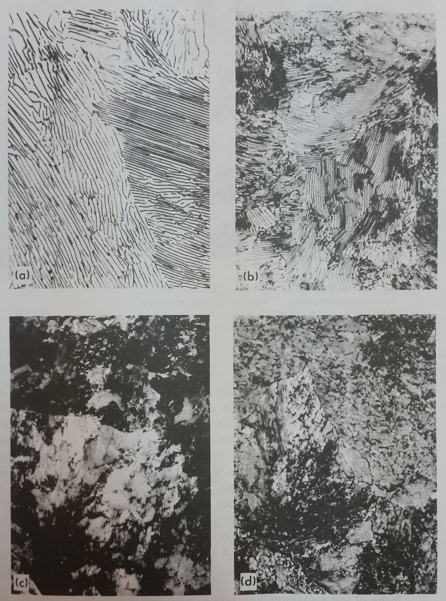
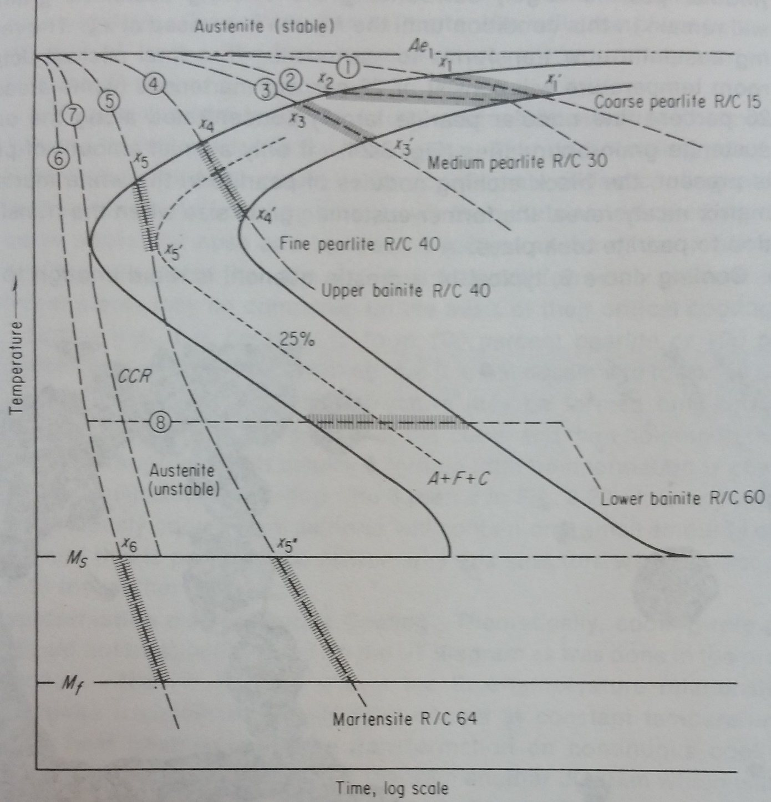

**Austempering**

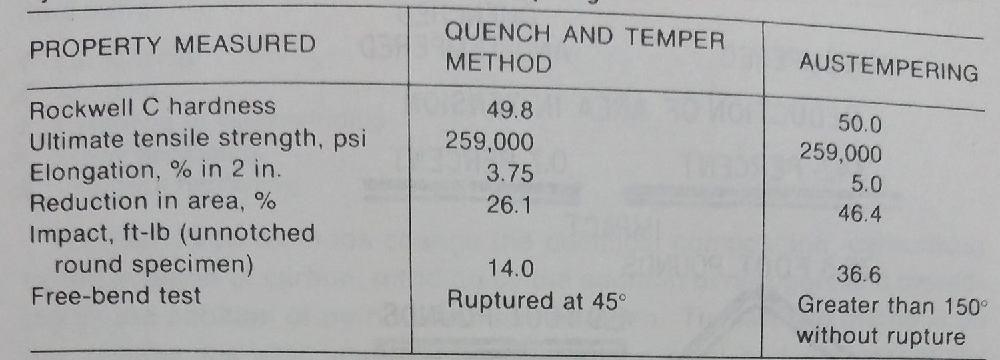
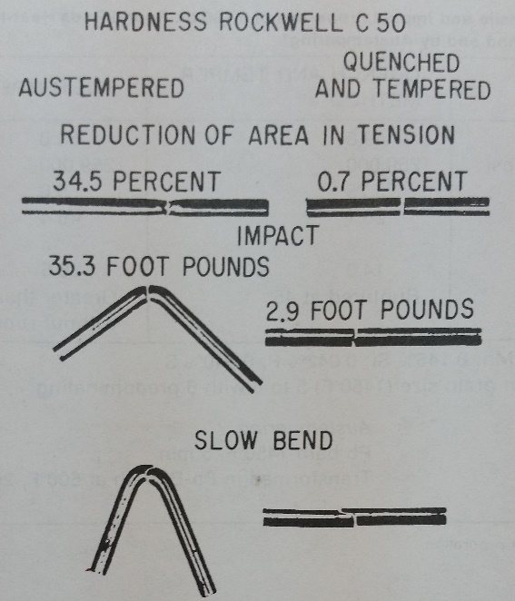

---

## 17. One-page cheat sheet

**Temperatures (eutectoid steel):** $A_1$ = 1333 °F (723 °C) • nose ≈ 1000 °F (540 °C), ≈ 1 s • Ms ≈ 400 °F (204 °C) • critical cooling rate > 250 °F/s.

**Hardness ladder (Rc):** spheroidite 5–10 → coarse pearlite 15 → medium pearlite 30 → fine pearlite 40 → upper bainite ≈ 40 → lower bainite ≈ 60 → martensite 64.

**Tempering ladder:** 100–400 °F black martensite (Rc 60–64) → 450–750 °F troostite (Rc 40–60) → 750–1200 °F sorbite (Rc 20–40) → 1200–1333 °F spheroidite (Rc 5–10).

**Process in one line each**

| Process | Heat to | Cool | Get |
|---|---|---|---|
| Full anneal | > $A_3$ | furnace | soft, coarse pearlite |
| Spheroidise | ≈ $A_1$ | very slow / hold | round carbide, machinable |
| Stress relief / process anneal | 540–675 °C, < $A_1$ | slow | relaxed / recrystallised |
| Normalise | > $A_3$ or $A_{cm}$ | air | fine pearlite, stronger |
| Harden | > $A_3$ (hypo) | fast (> CCR) | martensite |
| Temper | < $A_1$ | any (water avoids TE) | softer, tougher |
| Austemper | > $A_3$ → bainite bath | hold, then air | 100 % bainite, tough |

**Draw-list for the exam:** Fig. 1 (Fe–Fe₃C bands) • Fig. 2 (cycles) • Fig. 3 (coarse vs fine pearlite) • Fig. 5 (BCT cell) • Fig. 8 (tempering stages) • Fig. 9 (hardness/toughness vs T) • Fig. 11 (TTT derivation) • **Fig. 12 (TTT diagram)** • Fig. 14 (cooling curves) • Fig. 15c (austempering path).
