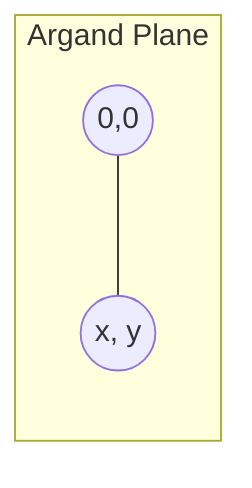

# 1. Overview

This topic introduces the complex number system as an extension of the real numbers, formed by adjoining i = √(−1). It has no prerequisite within this unit and underlies every later topic — the rectangular/polar form, modulus, and all of complex calculus are built directly on this algebra.

---

# 2. Definitions & Key Terms

1. **Complex Number** — A number of the form z = x + iy, where x, y ∈ ℝ and i² = −1.
   > Plain-English: a pair of real numbers (x, y) combined with a special symbol i that squares to −1.

2. **Real Part** — Re(z) = x.
   > Plain-English: the "ordinary number" component of z.

3. **Imaginary Part** — Im(z) = y (a real number, despite the name).
   > Plain-English: the coefficient multiplying i.

4. **Complex Conjugate** — z̄ = x − iy.
   > Plain-English: flip the sign of the imaginary part.

5. **Purely Imaginary Number** — z with Re(z) = 0.
   > Plain-English: a number like 3i, with no real component.

---

# 3. Core Content

### A. Definition

ℂ = {x + iy : x, y ∈ ℝ}, with i² = −1. Two complex numbers are equal iff both their real and imaginary parts match:

```
x₁ + iy₁ = x₂ + iy₂  ⟺  x₁ = x₂ and y₁ = y₂
```

### B. Formula (Field Operations)

```
Addition:        (x₁+iy₁) + (x₂+iy₂) = (x₁+x₂) + i(y₁+y₂)
Subtraction:      (x₁+iy₁) − (x₂+iy₂) = (x₁−x₂) + i(y₁−y₂)
Multiplication:   (x₁+iy₁)(x₂+iy₂) = (x₁x₂ − y₁y₂) + i(x₁y₂ + x₂y₁)
Division:         (x₁+iy₁)/(x₂+iy₂) = (x₁+iy₁)(x₂−iy₂) / (x₂²+y₂²),  (x₂,y₂) ≠ (0,0)
Conjugate:        z̄ = x − iy,   z·z̄ = x² + y²
```

### C. Derivation — Why Division Works

To divide by z₂ = x₂ + iy₂, multiply numerator and denominator by z̄₂ = x₂ − iy₂ so the denominator becomes real:

```
z₁/z₂ = z₁z̄₂ / (z₂z̄₂) = z₁z̄₂ / (x₂² + y₂²)
```

since z₂z̄₂ = (x₂+iy₂)(x₂−iy₂) = x₂² + y₂² (a real, nonnegative number). This is a direct algebraic identity — no case analysis needed.

### D. Geometric Interpretation

Each z = x + iy corresponds to a unique point (x, y) in the plane (the **Argand plane** / complex plane): the horizontal axis is the real axis, the vertical axis is the imaginary axis. Addition of complex numbers corresponds to vector addition of the points; conjugation corresponds to reflection across the real axis.

### E. Conditions

* ℂ forms a field: closed under +, −, ×, ÷ (except division by 0).
* ℂ is **not** an ordered field — there is no meaningful "z₁ < z₂" for general complex z₁, z₂ (only real numbers can be ordered, so comparisons only make sense between real quantities like |z₁| and |z₂|).

### F. Example

For z₁ = 2 + 3i, z₂ = 1 − i:
z₁ + z₂ = 3 + 2i, z₁z₂ = (2)(1) − (3)(−1) + i[(2)(−1) + (1)(3)] = 5 + i.

---

# 4. Worked Examples

### Example 1 — 🟢 Foundational

**Problem:** Compute (3 + 2i) + (1 − 5i) and (3 + 2i)(1 − 5i).

**Solution**

Step 1: Add real and imaginary parts separately: (3+1) + i(2−5) = 4 − 3i.

Step 2: Multiply using distribution and i² = −1: (3)(1) + (3)(−5i) + (2i)(1) + (2i)(−5i) = 3 − 15i + 2i − 10i² = 3 − 13i + 10 = 13 − 13i.

**Answer:** Sum = 4 − 3i, Product = 13 − 13i.

### Example 2 — 🟡 Intermediate

**Problem:** Simplify (4 + i)/(2 − 3i).

**Solution**

Step 1: Multiply top and bottom by the conjugate of the denominator, 2 + 3i.

Step 2: Numerator: (4+i)(2+3i) = 8 + 12i + 2i + 3i² = 8 + 14i − 3 = 5 + 14i.

Step 3: Denominator: (2−3i)(2+3i) = 4 + 9 = 13.

**Answer:** (5 + 14i)/13 = 5/13 + (14/13)i.

### Example 3 — 🔴 Exam-Level

**Problem:** If z = x + iy satisfies z·z̄ = 25 and z + z̄ = 8, find z.

**Solution**

Step 1: z·z̄ = x² + y² = 25.

Step 2: z + z̄ = 2x = 8, so x = 4.

Step 3: Substitute: 16 + y² = 25 ⟹ y² = 9 ⟹ y = ±3.

**Answer:** z = 4 + 3i or z = 4 − 3i.

---

# 5. Applications

* Electrical engineering: impedance Z = R + iX combines resistance and reactance into a single complex quantity.
* Signal processing: complex numbers encode amplitude and phase of a sinusoid in one compact object.

---

# 6. Diagram / Visual



Plot z = x + iy as the point (x, y): x along the real axis, y along the imaginary axis, with the segment from the origin representing z as a vector.

---

# 7. Common Mistakes

- ❌ **Mistake:** Treating i² as +1.
  ✅ **Correct:** i² = −1 by definition; always reduce powers of i using this.

- ❌ **Mistake:** Comparing two complex numbers with `<` or `>`.
  ✅ **Correct:** Inequalities are only meaningful for real quantities such as |z₁| vs |z₂|.

- ❌ **Mistake:** Dividing by a complex number without rationalizing (multiplying by the conjugate).
  ✅ **Correct:** Always multiply numerator and denominator by the conjugate of the denominator first.

---

# 8. Practice Problems

**P1 (Conceptual):** Explain why ℂ cannot be given a total order compatible with its field operations.

<details><summary>Solution</summary>
If such an order existed, either i > 0 or i < 0. Squaring either case would force i² > 0 (since squares of nonzero ordered-field elements are positive), but i² = −1 < 0, a contradiction. Hence no such order exists.
</details>

**P2 (Computational):** Compute z̄ and |z|² for z = −5 + 12i.

<details><summary>Solution</summary>
z̄ = −5 − 12i. |z|² = z·z̄ = 25 + 144 = 169.
</details>

**P3 (Computational):** Simplify (1 + i)⁴.

<details><summary>Solution</summary>
(1+i)² = 1 + 2i + i² = 2i. So (1+i)⁴ = (2i)² = 4i² = −4.
</details>

**P4 (Exam-style):** Find all real x, y such that (x + iy)² = 3 + 4i.

<details><summary>Solution</summary>
Expand: x² − y² + 2xyi = 3 + 4i. So x² − y² = 3 and 2xy = 4 ⟹ xy = 2. From xy = 2, y = 2/x. Substitute: x² − 4/x² = 3 ⟹ x⁴ − 3x² − 4 = 0 ⟹ (x²−4)(x²+1) = 0 ⟹ x² = 4 ⟹ x = ±2. Then y = 2/x gives (x,y) = (2,1) or (−2,−1).
</details>

**P5 (Exam-style):** Show that for any complex z, w: (z + w)‾ = z̄ + w̄.

<details><summary>Solution</summary>
Let z = a+ib, w = c+id. z+w = (a+c)+i(b+d), so (z+w)‾ = (a+c) − i(b+d) = (a−ib)+(c−id) = z̄ + w̄.
</details>

---

# 9. Summary

| Concept | Essential Result | Condition |
|---|---|---|
| Complex number | z = x + iy | x, y ∈ ℝ, i² = −1 |
| Conjugate | z̄ = x − iy | always defined |
| z·z̄ | x² + y² | real, ≥ 0 |
| Division | z₁z̄₂ / (x₂²+y₂²) | z₂ ≠ 0 |

This algebraic system is the foundation for the rectangular and polar representations developed next.

---

# 10. References

1. James Ward Brown & Ruel V. Churchill — Complex Variables and Applications
2. Schaum's Outline of Complex Variables
3. John B. Conway — Functions of One Complex Variable
4. Wolfram MathWorld — Complex Number
