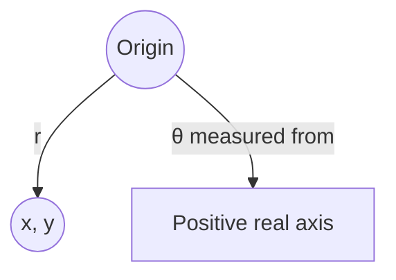

# 1. Overview

This topic converts a complex number between its rectangular form z = x + iy and its polar form z = r(cos θ + i sin θ). It builds directly on the [complex number system](01_complex_number_system.md) and is the essential setup for [modulus and argument](03_modulus_and_argument.md), [De Moivre's theorem](05_de_moivres_theorem.md), and [Euler's formula](06_eulers_formula.md).

---

# 2. Definitions & Key Terms

1. **Rectangular Form** — z = x + iy, specified by Cartesian coordinates (x, y).
   > Plain-English: the "plus-i-times" way of writing a complex number.

2. **Polar Form** — z = r(cos θ + i sin θ), specified by a distance r from the origin and an angle θ.
   > Plain-English: describing the same point using distance-and-direction instead of x-and-y.

---

# 3. Core Content

### A. Definition / Theorem

Every nonzero z = x + iy can be written as z = r(cos θ + i sin θ), where r = |z| and θ = arg z is any angle whose terminal side passes through (x, y).

### B. Formula

```
x = r cos θ,     y = r sin θ
r = √(x² + y²)
tan θ = y/x   (quadrant of (x,y) fixes the correct θ)
```

### C. Derivation

Plot (x, y) in the plane. By right-triangle trigonometry on the triangle formed by the origin, (x,0), and (x,y): the hypotenuse has length r = √(x²+y²), and the angle θ it makes with the positive real axis satisfies cos θ = x/r, sin θ = y/r. Multiplying through by r gives x = r cos θ, y = r sin θ, which substituted into z = x + iy gives z = r(cos θ + i sin θ). This is a direct trigonometric identity, not a proof by contradiction.

### D. Geometric Interpretation

r is the distance of the point from the origin; θ is the angle measured counterclockwise from the positive real axis. Polar form makes multiplication and rotation transparent (see [De Moivre's theorem](05_de_moivres_theorem.md)), while rectangular form makes addition transparent.

### E. Conditions

* z = 0 has no defined θ (r = 0 makes the angle undefined); handle z = 0 as a special case.
* θ is only unique up to adding multiples of 2π — see [modulus and argument](03_modulus_and_argument.md) for the multivalued convention and [principal argument](04_principal_argument.md) for the standard single-valued choice.

### F. Example

z = 1 + i has r = √2, θ = π/4, so z = √2(cos π/4 + i sin π/4).

---

# 4. Worked Examples

### Example 1 — 🟢 Foundational

**Problem:** Convert z = −1 + i√3 to polar form.

**Solution**

Step 1: r = √((−1)² + (√3)²) = √(1+3) = 2.

Step 2: tan θ = √3/(−1); since x<0, y>0, the point is in the second quadrant, so θ = π − π/3 = 2π/3.

**Answer:** z = 2(cos 2π/3 + i sin 2π/3).

### Example 2 — 🟡 Intermediate

**Problem:** Convert z = 4(cos 210° + i sin 210°) to rectangular form.

**Solution**

Step 1: cos 210° = −√3/2, sin 210° = −1/2.

Step 2: x = 4(−√3/2) = −2√3, y = 4(−1/2) = −2.

**Answer:** z = −2√3 − 2i.

### Example 3 — 🔴 Exam-Level

**Problem:** Express z = (1 − i)/(1 + i) in polar form and simplify.

**Solution**

Step 1: Rationalize: (1−i)/(1+i) = (1−i)²/[(1+i)(1−i)] = (1 − 2i + i²)/2 = (−2i)/2 = −i.

Step 2: −i has r = 1, and lies on the negative imaginary axis, so θ = −π/2 (or 3π/2).

**Answer:** z = cos(−π/2) + i sin(−π/2) = −i.

---

# 5. Applications

* Rotations and phasors in AC circuit analysis are naturally expressed in polar form.
* Polar form simplifies multiplication/division of complex quantities in signal processing (magnitudes multiply, angles add).

---

# 6. Diagram / Visual



Picture the right triangle with legs x, y and hypotenuse r, with θ the angle between the hypotenuse and the positive real axis.

---

# 7. Common Mistakes

- ❌ **Mistake:** Computing θ = arctan(y/x) blindly without checking the quadrant.
  ✅ **Correct:** arctan only returns values in (−π/2, π/2); adjust by ±π based on the actual signs of x and y.

- ❌ **Mistake:** Forgetting r must be nonnegative.
  ✅ **Correct:** r = |z| ≥ 0 always; a "negative radius" is instead represented by adding π to θ.

- ❌ **Mistake:** Leaving z = 0 with an assigned angle.
  ✅ **Correct:** θ is undefined for z = 0; treat separately.

---

# 8. Practice Problems

**P1 (Conceptual):** Why is θ not unique for a given z ≠ 0?

<details><summary>Solution</summary>
Because cos and sin are periodic with period 2π, θ and θ+2nπ (n ∈ ℤ) describe the same point on the plane, hence the same z.
</details>

**P2 (Computational):** Convert z = −3 to polar form.

<details><summary>Solution</summary>
r = 3, and the point (−3, 0) lies on the negative real axis, so θ = π. z = 3(cos π + i sin π).
</details>

**P3 (Computational):** Convert z = 5(cos 90° + i sin 90°) to rectangular form.

<details><summary>Solution</summary>
x = 5(0) = 0, y = 5(1) = 5, so z = 5i.
</details>

**P4 (Exam-style):** If z = r(cos θ + i sin θ), express z̄ in polar form.

<details><summary>Solution</summary>
z̄ = x − iy = r cos θ − i r sin θ = r(cos(−θ) + i sin(−θ)), i.e. same modulus, angle negated.
</details>

**P5 (Exam-style):** Convert z = 2 − 2i to polar form and hence find z⁵ using the polar representation informally (verify magnitude only).

<details><summary>Solution</summary>
r = √(4+4) = 2√2, θ = −π/4 (fourth quadrant). |z⁵| = r⁵ = (2√2)⁵ = 32·4√2 = 128√2. (Full angle computation uses De Moivre's theorem, covered next.)
</details>

---

# 9. Summary

| Concept | Essential Result | Condition |
|---|---|---|
| Polar form | z = r(cos θ + i sin θ) | r = |z| ≥ 0 |
| Conversion | x = r cos θ, y = r sin θ | — |
| r formula | r = √(x²+y²) | — |
| θ formula | tan θ = y/x | adjusted by quadrant |

The polar form developed here feeds directly into modulus/argument notation and later into De Moivre's theorem and Euler's formula.

---

# 10. References

1. James Ward Brown & Ruel V. Churchill — Complex Variables and Applications
2. Schaum's Outline of Complex Variables
3. E. T. Copson — An Introduction to the Theory of Functions of a Complex Variable
4. Wolfram MathWorld — Polar Form
