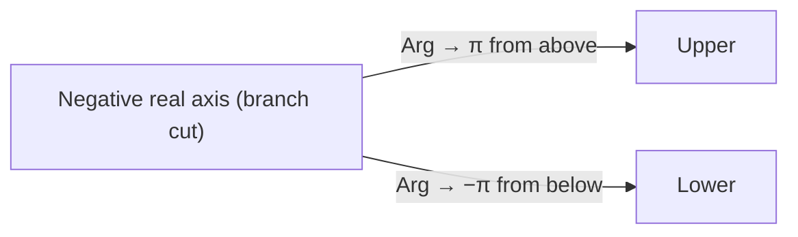

# 1. Overview

The principal argument Arg z fixes a single, unique angle out of the infinite set arg z, by restricting to one standard interval. It depends on [modulus and argument](03_modulus_and_argument.md) and provides the single-valued angle needed later for well-defined logarithms in [elementary functions](07_elementary_functions_of_complex_variables.md) and for consistent contour/branch conventions.

---

# 2. Definitions & Key Terms

1. **Principal Argument (Arg z)** — the unique value of arg z lying in (−π, π].
   > Plain-English: "the" angle, chosen once and for all from the infinitely many options.

> ⚠️ **Convention:** The principal argument is taken in (−π, π] throughout this repo. Some texts use [0, 2π) instead — always state which convention is in force.

---

# 3. Core Content

### A. Definition / Theorem

For z ≠ 0, Arg z is the unique θ ∈ (−π, π] with x = |z| cos θ, y = |z| sin θ. Then:

```
arg z = Arg z + 2nπ,   n ∈ ℤ
```

### B. Formula

```
       arctan(y/x)              if x > 0
Arg z = arctan(y/x) + π         if x < 0, y ≥ 0
       arctan(y/x) − π         if x < 0, y < 0
       π/2                      if x = 0, y > 0
       −π/2                     if x = 0, y < 0
       undefined                if x = 0, y = 0
```

### C. Derivation

This is a case-by-case restriction of the general arctan relation, forced by picking exactly one representative from each equivalence class {θ + 2nπ}. Each branch is chosen so the result always lands in (−π, π]; no computation beyond quadrant identification is needed once |z| ≠ 0.

### D. Geometric Interpretation

Arg z is the signed angle swept counterclockwise (positive) or clockwise (negative, if measured the short way through the lower half-plane) from the positive real axis to the ray through z, always reported within a half-open interval of length 2π.

### E. Conditions

* Arg z is discontinuous across the negative real axis: points just above have Arg z near π, points just below have Arg z near −π, even though they are geometrically close. This discontinuity matters for branch cuts of log z and zᵃ.
* Arg z is undefined at z = 0.

### F. Example

For z = −1 − i: x<0, y<0, so Arg z = arctan(1) − π = π/4 − π = −3π/4.

---

# 4. Worked Examples

### Example 1 — 🟢 Foundational

**Problem:** Find Arg z for z = 3i.

**Solution**

Step 1: x = 0, y = 3 > 0.

**Answer:** Arg z = π/2.

### Example 2 — 🟡 Intermediate

**Problem:** Find Arg z for z = −5.

**Solution**

Step 1: x = −5 < 0, y = 0 ≥ 0, so use the x<0, y≥0 branch: arctan(0/−5) + π = 0 + π.

**Answer:** Arg z = π.

### Example 3 — 🔴 Exam-Level

**Problem:** Two points z₁ = −1 + 0.01i and z₂ = −1 − 0.01i are geometrically close. Compute Arg z₁ and Arg z₂ and comment.

**Solution**

Step 1: For z₁: x<0, y≥0, Arg z₁ = arctan(0.01/−1) + π ≈ (−0.01) + π ≈ π − 0.01, very close to π.

Step 2: For z₂: x<0, y<0, Arg z₂ = arctan(−0.01/−1) − π = arctan(0.01) − π ≈ 0.01 − π, very close to −π.

**Answer:** Arg z₁ ≈ π − 0.01, Arg z₂ ≈ −π + 0.01: nearly opposite values despite z₁, z₂ being almost the same point — this is the branch discontinuity across the negative real axis referenced above.

---

# 5. Applications

* Defines the principal branch of log z (Log z = ln|z| + i Arg z), needed wherever a single-valued logarithm or fractional power is required, e.g. in evaluating contour integrals with branch cuts.
* Standardizes phase-angle output in engineering software and calculators.

---

# 6. Diagram / Visual



Picture the plane with a cut along the negative real axis; Arg z jumps by 2π as z crosses that cut, while remaining continuous everywhere else.

---

# 7. Common Mistakes

- ❌ **Mistake:** Confusing `arg z` with `Arg z`.
  ✅ **Correct:** `arg z` is multivalued (a whole set); `Arg z` denotes the single principal value.

- ❌ **Mistake:** Applying the x>0 arctan formula directly when x<0.
  ✅ **Correct:** Use the correct branch of the piecewise formula based on the sign of x and y.

- ❌ **Mistake:** Assuming Arg is continuous everywhere.
  ✅ **Correct:** Arg has a jump discontinuity across the negative real axis by convention here.

---

# 8. Practice Problems

**P1 (Conceptual):** Why must exactly one interval of length 2π be chosen for Arg z to be well-defined?

<details><summary>Solution</summary>
Because arg z is a coset {θ+2nπ}; picking a half-open interval of length exactly 2π selects exactly one representative from every such coset, with no gaps or double-counting.
</details>

**P2 (Computational):** Find Arg z for z = 2 + 2i.

<details><summary>Solution</summary>
x>0, arctan(2/2) = π/4. Arg z = π/4.
</details>

**P3 (Computational):** Find Arg z for z = −4i.

<details><summary>Solution</summary>
x=0, y<0, so Arg z = −π/2.
</details>

**P4 (Exam-style):** Determine whether Arg(z₁z₂) = Arg z₁ + Arg z₂ always holds. Give a counterexample if not.

<details><summary>Solution</summary>
Not always. Take z₁ = z₂ = −1 + i (Arg = 3π/4). Arg z₁ + Arg z₂ = 3π/2, outside (−π, π]. But z₁z₂ = (−1+i)² = 1 − 2i + i² = −2i, and Arg(−2i) = −π/2 ≠ 3π/2 (mod 2π adjustment needed: 3π/2 − 2π = −π/2, which does match after reduction, illustrating that equality holds only mod 2π, not as raw real numbers).
</details>

**P5 (Exam-style):** Find all z with |z| = 2 and Arg z = 2π/3, in rectangular form.

<details><summary>Solution</summary>
x = 2cos(2π/3) = 2(−1/2) = −1, y = 2sin(2π/3) = 2(√3/2) = √3. z = −1 + i√3.
</details>

---

# 9. Summary

| Concept | Essential Result | Condition |
|---|---|---|
| Principal argument | Arg z ∈ (−π, π] | z ≠ 0 |
| Relation to arg z | arg z = Arg z + 2nπ | n ∈ ℤ |
| Discontinuity | jump of 2π across negative real axis | branch-cut convention |

With a single-valued angle now fixed, the next topic uses polar form to prove De Moivre's theorem for powers and roots.

---

# 10. References

1. James Ward Brown & Ruel V. Churchill — Complex Variables and Applications
2. Schaum's Outline of Complex Variables
3. John B. Conway — Functions of One Complex Variable
4. NIST Digital Library of Mathematical Functions — Complex argument
