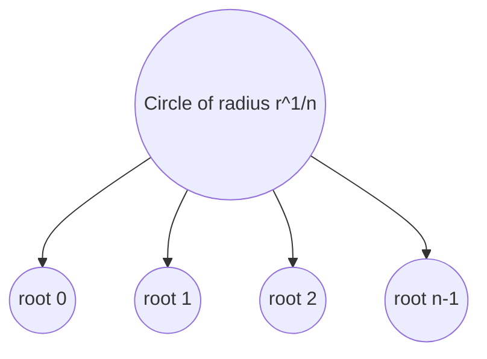

# 1. Overview

De Moivre's theorem gives a closed formula for powers (and, extended, roots) of a complex number in polar form. It builds directly on [rectangular and polar form](02_rectangular_and_polar_form.md) and is the main tool used to derive [Euler's formula](06_eulers_formula.md).

---

# 2. Definitions & Key Terms

1. **De Moivre's Theorem** — for integer n, [cos θ + i sin θ]ⁿ = cos nθ + i sin nθ.
   > Plain-English: raising a unit-modulus complex number to the nth power just multiplies its angle by n.

2. **nth Root of a Complex Number** — any w with wⁿ = z.
   > Plain-English: a number that, raised to the nth power, gives back z; there are exactly n such w for z ≠ 0.

---

# 3. Core Content

### A. Definition / Theorem

For any positive integer n and real θ:

```
(cos θ + i sin θ)ⁿ = cos nθ + i sin nθ
```

The identity also holds for negative integers n by taking reciprocals, and for n = 0 trivially (both sides equal 1).

### B. Formula

```
zⁿ = rⁿ(cos nθ + i sin nθ),           for z = r(cos θ + i sin θ)

nth roots:
zₖ = r^(1/n)[cos((θ+2kπ)/n) + i sin((θ+2kπ)/n)],   k = 0, 1, …, n−1
```

### C. Derivation / Proof

**Proof by induction (direct construction) for positive integer n:**

Base case n = 1: (cos θ + i sin θ)¹ = cos θ + i sin θ. True.

Inductive step: assume (cos θ + i sin θ)ᵏ = cos kθ + i sin kθ. Then

```
(cos θ + i sin θ)ᵏ⁺¹ = (cos kθ + i sin kθ)(cos θ + i sin θ)
```

Expand using the product formula and the angle-addition identities cos(A+B) = cosA cosB − sinA sinB, sin(A+B) = sinA cosB + cosA sinB:

```
= (cos kθ cos θ − sin kθ sin θ) + i(sin kθ cos θ + cos kθ sin θ)
= cos(kθ+θ) + i sin(kθ+θ) = cos((k+1)θ) + i sin((k+1)θ)
```

This closes the induction, so the identity holds for all positive integers n.

For negative integers n = −m (m>0): (cosθ+isinθ)⁻ᵐ = 1/(cosθ+isinθ)ᵐ = 1/(cos mθ + i sin mθ) = cos(−mθ) + i sin(−mθ), using that 1/(cosφ+isinφ) = cos(−φ)+isin(−φ) since (cosφ+isinφ)(cos(−φ)+isin(−φ)) = cos0+isin0 = 1.

**nth roots (application):** if wⁿ = z with z = r(cosθ+isinθ), write w = ρ(cosφ+isinφ). Then wⁿ = ρⁿ(cos nφ + i sin nφ) = r(cosθ+isinθ) forces ρⁿ = r (so ρ = r^(1/n), the unique positive real root) and nφ = θ + 2kπ for some integer k, i.e. φ = (θ+2kπ)/n. Distinct k = 0,…,n−1 give n distinct angles within a 2π range, hence exactly n distinct roots.

### D. Geometric Interpretation

Raising z to the nth power scales the modulus to rⁿ and rotates the angle to nθ. The n roots of z are equally spaced points on a circle of radius r^(1/n), spaced 2π/n apart — vertices of a regular n-gon.

### E. Conditions

* The theorem as stated requires n to be an integer (positive, negative, or zero); non-integer or complex exponents require the more general definition zᵃ = e^(a Log z), which introduces branch issues.
* Roots must use r^(1/n) as the unique **positive real** nth root of r = |z| ≥ 0.

### F. Example

(cos 30° + i sin 30°)⁶ = cos 180° + i sin 180° = −1.

---

# 4. Worked Examples

### Example 1 — 🟢 Foundational

**Problem:** Compute (1 + i)⁸ using De Moivre's theorem.

**Solution**

Step 1: Polar form: r = √2, θ = π/4, so 1+i = √2(cos π/4 + i sin π/4).

Step 2: (1+i)⁸ = (√2)⁸ (cos(8·π/4) + i sin(8·π/4)) = 16(cos 2π + i sin 2π) = 16(1+0).

**Answer:** (1+i)⁸ = 16.

### Example 2 — 🟡 Intermediate

**Problem:** Find all cube roots of z = 8 (i.e. solve w³ = 8).

**Solution**

Step 1: z = 8 = 8(cos 0 + i sin 0), so r=8, θ=0.

Step 2: r^(1/3) = 2. wₖ = 2(cos(2kπ/3) + i sin(2kπ/3)), k = 0,1,2.

Step 3: k=0: 2(cos0+isin0)=2. k=1: 2(cos120°+isin120°) = 2(−1/2+i√3/2) = −1+i√3. k=2: 2(cos240°+isin240°) = 2(−1/2−i√3/2) = −1−i√3.

**Answer:** w = 2, −1+i√3, −1−i√3.

### Example 3 — 🔴 Exam-Level

**Problem:** Find all fourth roots of z = −16 and plot their geometric arrangement.

**Solution**

Step 1: z = −16 = 16(cos π + i sin π), r=16, θ=π.

Step 2: r^(1/4) = 2. wₖ = 2(cos((π+2kπ)/4) + i sin((π+2kπ)/4)), k=0,1,2,3.

Step 3: k=0: angle π/4 → 2(√2/2+i√2/2)=√2+i√2. k=1: angle 3π/4 → −√2+i√2. k=2: angle 5π/4 → −√2−i√2. k=3: angle 7π/4 → √2−i√2.

**Answer:** The four roots √2±i√2, −√2±i√2 are the vertices of a square inscribed in the circle of radius 2, spaced 90° apart.

---

# 5. Applications

* Solving polynomial equations zⁿ = c that arise in AC circuit resonance and vibration analysis.
* Deriving multiple-angle trigonometric identities (expand (cosθ+isinθ)ⁿ and equate real/imaginary parts).

---

# 6. Diagram / Visual



The n roots of z sit as equally spaced points (2π/n apart) around a circle of radius r^(1/n) — a regular n-gon.

---

# 7. Common Mistakes

- ❌ **Mistake:** Forgetting to add 2kπ before dividing by n when computing roots, so only one root is found.
  ✅ **Correct:** Use θ+2kπ over k = 0,…,n−1 to generate all n distinct roots.

- ❌ **Mistake:** Applying De Moivre's theorem directly to non-integer exponents without invoking Log z.
  ✅ **Correct:** The stated theorem is for integer n only; fractional/complex powers need the branch-dependent definition zᵃ = e^(a Log z).

- ❌ **Mistake:** Using a negative value for r^(1/n).
  ✅ **Correct:** r^(1/n) is always the unique nonnegative real nth root of the nonnegative real number r.

---

# 8. Practice Problems

**P1 (Conceptual):** Explain geometrically why the n distinct nth roots of z are evenly spaced.

<details><summary>Solution</summary>
Consecutive roots correspond to k and k+1, whose angles differ by exactly 2π/n (from the (θ+2kπ)/n formula), and all share the same modulus r^(1/n) — hence evenly spaced points on a common circle.
</details>

**P2 (Computational):** Compute (cos 15° + i sin 15°)¹².

<details><summary>Solution</summary>
= cos(180°) + i sin(180°) = −1.
</details>

**P3 (Computational):** Find the square roots of z = i.

<details><summary>Solution</summary>
i = cos(π/2)+isin(π/2), r=1. wₖ = cos((π/2+2kπ)/2)+isin(...), k=0,1. k=0: cos(π/4)+isin(π/4) = √2/2+i√2/2. k=1: cos(5π/4)+isin(5π/4) = −√2/2−i√2/2.
</details>

**P4 (Exam-style):** Use De Moivre's theorem with n=3 to derive a formula for cos 3θ in terms of cos θ.

<details><summary>Solution</summary>
(cosθ+isinθ)³ = cos3θ+isin3θ. Expand LHS: cos³θ + 3icos²θsinθ − 3cosθsin²θ − isin³θ. Real part: cos³θ − 3cosθsin²θ = cos³θ − 3cosθ(1−cos²θ) = 4cos³θ − 3cosθ. Equate to Re(RHS)=cos3θ: cos3θ = 4cos³θ − 3cosθ.
</details>

**P5 (Exam-style):** Solve z⁶ = −1 and list all roots in polar form.

<details><summary>Solution</summary>
−1 = cosπ+isinπ. zₖ = cos((π+2kπ)/6)+isin((π+2kπ)/6), k=0,…,5, giving angles π/6, π/2, 5π/6, 7π/6, 3π/2, 11π/6, each with r=1.
</details>

---

# 9. Summary

| Concept | Essential Result | Condition |
|---|---|---|
| De Moivre (powers) | (cosθ+isinθ)ⁿ = cos nθ + i sin nθ | n ∈ ℤ |
| nth roots | zₖ = r^(1/n)[cos((θ+2kπ)/n)+isin((θ+2kπ)/n)] | k = 0,…,n−1 |
| Root geometry | vertices of a regular n-gon, radius r^(1/n) | z ≠ 0 |

De Moivre's theorem, applied to the special case r=1 with θ infinitesimal, motivates Euler's formula, developed next.

---

# 10. References

1. James Ward Brown & Ruel V. Churchill — Complex Variables and Applications
2. Schaum's Outline of Complex Variables
3. John B. Conway — Functions of One Complex Variable
4. Wolfram MathWorld — De Moivre's Theorem
