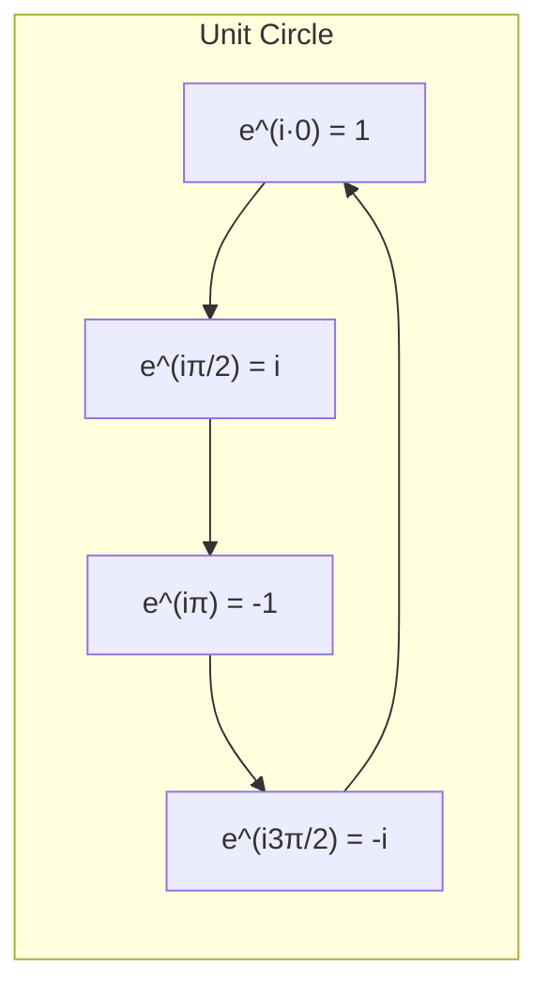

# 1. Overview

Euler's formula e^(iθ) = cos θ + i sin θ links the exponential function to trigonometry and gives the compact exponential form z = re^(iθ) of a complex number. It follows from the polar/De Moivre framework in [De Moivre's theorem](05_de_moivres_theorem.md) and is essential input for [elementary functions of a complex variable](07_elementary_functions_of_complex_variables.md).

---

# 2. Definitions & Key Terms

1. **Euler's Formula** — e^(iθ) = cos θ + i sin θ, for real θ.
   > Plain-English: a formula that turns rotation by angle θ into a complex exponential.

2. **Exponential (Euler) Form** — z = re^(iθ), equivalent to the polar form z = r(cosθ+isinθ).
   > Plain-English: writing the polar form using exponential notation instead of cos/sin.

---

# 3. Core Content

### A. Definition / Theorem

For real θ: e^(iθ) = cos θ + i sin θ. Consequently, every nonzero z can be written as z = re^(iθ), with r = |z|, θ = arg z.

### B. Formula

```
e^(iθ) = cos θ + i sin θ
z = re^(iθ)                      (Euler / exponential form)
e^(iπ) + 1 = 0                   (Euler's identity, special case θ=π)
```

### C. Derivation

**Via Maclaurin series (formal justification):** the complex exponential is defined by the same power series as the real exponential, e^w = Σₙ wⁿ/n!, which converges for all complex w. Substitute w = iθ:

```
e^(iθ) = Σₙ (iθ)ⁿ/n! = 1 + iθ + (iθ)²/2! + (iθ)³/3! + (iθ)⁴/4! + …
```

Using i² = −1, i³ = −i, i⁴ = 1 (cyclic with period 4), separate real and imaginary terms:

```
Real terms:      1 − θ²/2! + θ⁴/4! − …  =  cos θ
Imaginary terms: θ − θ³/3! + θ⁵/5! − …  =  sin θ  (coefficient of i)
```

These are exactly the Maclaurin series for cos θ and sin θ, giving e^(iθ) = cos θ + i sin θ.

### D. Geometric Interpretation

e^(iθ) traces the unit circle in the complex plane as θ varies: multiplying any z by e^(iθ) rotates z counterclockwise by angle θ without changing |z|. This matches the De Moivre picture: (e^(iθ))ⁿ = e^(inθ), i.e. repeated rotation.

### E. Conditions

* θ must be real for e^(iθ) to have modulus exactly 1; for complex θ, e^(iθ) is defined but no longer has unit modulus in general.
* The formula z = re^(iθ) inherits the same 2π-periodicity in θ as the polar form; a fixed principal range (e.g. (−π,π]) is needed for a single-valued exponential form, exactly as with Arg z.

### F. Example

e^(iπ/2) = cos(π/2) + i sin(π/2) = i.

---

# 4. Worked Examples

### Example 1 — 🟢 Foundational

**Problem:** Evaluate e^(iπ).

**Solution**

Step 1: cos π = −1, sin π = 0.

**Answer:** e^(iπ) = −1 (giving Euler's identity e^(iπ)+1=0).

### Example 2 — 🟡 Intermediate

**Problem:** Write z = 1 − i√3 in exponential form.

**Solution**

Step 1: r = √(1+3) = 2. Fourth quadrant, tan θ = −√3, reference angle π/3, so θ = −π/3.

**Answer:** z = 2e^(−iπ/3).

### Example 3 — 🔴 Exam-Level

**Problem:** Use Euler's formula to derive cos θ and sin θ in terms of e^(iθ) and e^(−iθ).

**Solution**

Step 1: e^(iθ) = cosθ + isinθ and e^(−iθ) = cos(−θ)+isin(−θ) = cosθ − isinθ (using cos even, sin odd).

Step 2: Add: e^(iθ)+e^(−iθ) = 2cosθ ⟹ cosθ = (e^(iθ)+e^(−iθ))/2.

Step 3: Subtract: e^(iθ)−e^(−iθ) = 2isinθ ⟹ sinθ = (e^(iθ)−e^(−iθ))/(2i).

**Answer:** cos θ = (e^(iθ)+e^(−iθ))/2, sin θ = (e^(iθ)−e^(−iθ))/(2i) — these define the [elementary trigonometric functions of a complex variable](07_elementary_functions_of_complex_variables.md).

---

# 5. Applications

* Phasor representation in AC circuit analysis: Ve^(iωt) compactly encodes a sinusoidal signal's amplitude and phase.
* Fourier analysis represents periodic signals as sums of e^(inθ) terms.
* Euler's identity e^(iπ)+1=0 links five fundamental constants (0, 1, e, i, π).

---

# 6. Diagram / Visual



As θ increases from 0, e^(iθ) traces the unit circle counterclockwise, passing through 1, i, −1, −i at quarter turns.

---

# 7. Common Mistakes

- ❌ **Mistake:** Treating e^(iθ) as having a variable modulus.
  ✅ **Correct:** |e^(iθ)| = √(cos²θ+sin²θ) = 1 always, for real θ.

- ❌ **Mistake:** Forgetting the 2π periodicity when writing z = re^(iθ), leading to an ambiguous "the" exponential form.
  ✅ **Correct:** State whether θ is the general argument or restricted to the principal range, exactly as with Arg z.

- ❌ **Mistake:** Assuming Euler's formula only holds for special angles like π/2, π.
  ✅ **Correct:** It holds for every real θ, derived from the universally convergent exponential series.

---

# 8. Practice Problems

**P1 (Conceptual):** Explain why |e^(iθ)| = 1 for every real θ.

<details><summary>Solution</summary>
|e^(iθ)| = |cosθ+isinθ| = √(cos²θ+sin²θ) = √1 = 1, by the Pythagorean identity, for any real θ.
</details>

**P2 (Computational):** Evaluate e^(i·3π/2).

<details><summary>Solution</summary>
cos(3π/2)=0, sin(3π/2)=−1, so e^(i3π/2) = −i.
</details>

**P3 (Computational):** Write z = −5 in exponential form.

<details><summary>Solution</summary>
r=5, θ=π (negative real axis). z = 5e^(iπ).
</details>

**P4 (Exam-style):** Show that e^(iθ₁)e^(iθ₂) = e^(i(θ₁+θ₂)), confirming multiplication corresponds to angle addition.

<details><summary>Solution</summary>
e^(iθ₁)e^(iθ₂) = (cosθ₁+isinθ₁)(cosθ₂+isinθ₂) = (cosθ₁cosθ₂−sinθ₁sinθ₂) + i(sinθ₁cosθ₂+cosθ₁sinθ₂) = cos(θ₁+θ₂)+isin(θ₁+θ₂) = e^(i(θ₁+θ₂)), using the standard angle-addition identities.
</details>

**P5 (Exam-style):** Using z = re^(iθ), express z̄ and 1/z (z≠0) in exponential form.

<details><summary>Solution</summary>
z̄ = re^(−iθ) (conjugation negates the angle, keeps modulus). 1/z = (1/r)e^(−iθ), since z·(1/r)e^(−iθ) = r·(1/r)e^(iθ−iθ) = e^0 = 1.
</details>

---

# 9. Summary

| Concept | Essential Result | Condition |
|---|---|---|
| Euler's formula | e^(iθ) = cosθ + isinθ | θ real |
| Exponential form | z = re^(iθ) | r=|z|, θ=arg z |
| Euler's identity | e^(iπ)+1 = 0 | — |
| Unit modulus | |e^(iθ)| = 1 | θ real |

Euler's formula is the bridge to defining the elementary complex functions (exponential, logarithmic, trigonometric, hyperbolic) covered next.

---

# 10. References

1. James Ward Brown & Ruel V. Churchill — Complex Variables and Applications
2. Schaum's Outline of Complex Variables
3. John B. Conway — Functions of One Complex Variable
4. Wolfram MathWorld — Euler Formula
