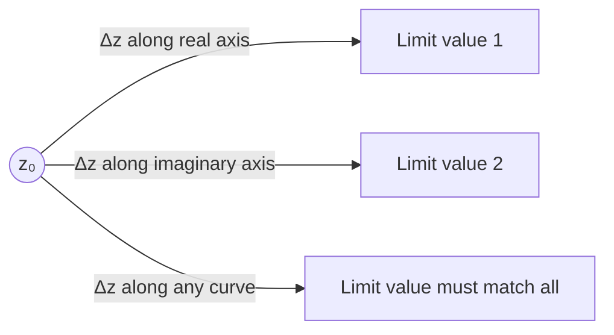

# 1. Overview

Complex differentiation defines f′(z) via a limit, exactly as in real calculus, but the limit must now hold as Δz approaches 0 from **every** direction in the plane. It uses the [elementary functions](07_elementary_functions_of_complex_variables.md) as example functions to differentiate, and its path-independence requirement is what eventually forces the [Cauchy-Riemann equations](12_cauchy_riemann_equations.md).

---

# 2. Definitions & Key Terms

1. **Complex Derivative** — f′(z) = lim(Δz→0) [f(z+Δz) − f(z)] / Δz, if the limit exists.
   > Plain-English: the same difference-quotient idea as in real calculus, but Δz is now a complex number that can approach 0 from any direction.

2. **Differentiable at a Point** — f′(z₀) exists as defined above.
   > Plain-English: the limit exists and gives the same value regardless of the direction of approach.

---

# 3. Core Content

### A. Definition / Theorem

```
f′(z) = lim(Δz→0) [f(z+Δz) − f(z)] / Δz
```

f is differentiable at z if this limit exists and is the same complex number no matter how Δz → 0.

### B. Formula

The definition itself is the formula; specific derivative rules are covered in the [derivatives](09_derivatives.md) topic.

### C. Derivation — Why Path-Independence Matters

In real calculus, x can only approach x₀ from the left or right — two directions, and both must agree. In the complex plane, Δz = Δx + iΔy can approach 0 along any path: along the real axis (Δy=0), along the imaginary axis (Δx=0), along any line, or along a curve. For f′(z) to exist, the limiting value of [f(z+Δz)−f(z)]/Δz must be identical along **all** of these paths. This is a strictly stronger requirement than real differentiability, and it is precisely this requirement that, when written out in u and v, produces the Cauchy-Riemann equations (topic 12).

### D. Geometric Interpretation

Because the limit must agree along every direction of approach, complex differentiability forces the map z ↦ f(z) to behave locally like multiplication by the complex number f′(z₀) — a combined rotation and scaling — near z₀, with no local "shearing" distortion. This is much more rigid than mere real differentiability of the two-variable functions u(x,y), v(x,y).

### E. Conditions

* Continuity is necessary but not sufficient: f must be continuous at z₀ for f′(z₀) to exist, but many continuous functions (e.g. f(z)=z̄) fail to be complex-differentiable anywhere.
* The limit must be path-independent — this is the crucial extra condition beyond the real-variable case.

### F. Example

Show f(z) = z̄ is **not** differentiable anywhere: approaching along the real axis (Δz=Δx real) gives limit 1, but along the imaginary axis (Δz=iΔy) gives limit −1; since these disagree, f′(z) does not exist for any z. (Full working in Example 3 below.)

---

# 4. Worked Examples

### Example 1 — 🟢 Foundational

**Problem:** Use the definition to find f′(z) for f(z) = z².

**Solution**

Step 1: f(z+Δz) − f(z) = (z+Δz)² − z² = 2zΔz + (Δz)².

Step 2: Divide by Δz: 2z + Δz.

Step 3: Let Δz → 0: the limit is 2z regardless of the path, since the expression 2z+Δz depends continuously on Δz alone.

**Answer:** f′(z) = 2z.

### Example 2 — 🟡 Intermediate

**Problem:** Show f(z) = z² is differentiable using two different paths of approach (Δz real, then Δz purely imaginary) and confirm they agree.

**Solution**

Step 1: Path 1 (Δz = Δx, real): [f(z+Δx)−f(z)]/Δx = 2z + Δx → 2z as Δx→0.

Step 2: Path 2 (Δz = iΔy, imaginary): [f(z+iΔy)−f(z)]/(iΔy) = 2z + iΔy → 2z as Δy→0.

**Answer:** Both paths give 2z — consistent with f′(z)=2z, so no contradiction arises (as expected, since z² is differentiable everywhere).

### Example 3 — 🔴 Exam-Level

**Problem:** Prove f(z) = z̄ (complex conjugate) is not differentiable at any point.

**Solution**

Step 1: f(z+Δz) − f(z) = (z+Δz)‾ − z̄ = z̄ + Δz̄ − z̄ = Δz̄.

Step 2: The difference quotient is Δz̄/Δz. Write Δz = Δx+iΔy, so Δz̄ = Δx−iΔy.

Step 3: Along the real axis (Δy=0): Δz̄/Δz = Δx/Δx = 1. Along the imaginary axis (Δx=0): Δz̄/Δz = (−iΔy)/(iΔy) = −1.

**Answer:** The limit along the real axis (1) differs from the limit along the imaginary axis (−1), so the overall limit does not exist — f(z)=z̄ is not differentiable at any point of ℂ.

---

# 5. Applications

* Establishes the rigor needed before defining analytic functions, which underlie essentially all further complex-analysis results (Cauchy-Riemann, contour integration, residues).
* The failure of z̄ to be differentiable illustrates why complex analysis is a genuinely different (and more restrictive) theory than two-variable real calculus.

---

# 6. Diagram / Visual



Picture Δz shrinking to 0 from every possible direction around z₀ simultaneously — all resulting difference-quotient limits must coincide for f′(z₀) to exist.

---

# 7. Common Mistakes

- ❌ **Mistake:** Concluding f is differentiable after checking only one path of approach (e.g. only Δz real).
  ✅ **Correct:** Every direction of approach must give the same limit; checking one path only shows the limit along that path, not overall differentiability.

- ❌ **Mistake:** Assuming continuity implies complex differentiability.
  ✅ **Correct:** Continuity is necessary but far from sufficient — z̄ is continuous everywhere yet differentiable nowhere.

- ❌ **Mistake:** Treating the complex derivative definition as identical in strength to the real one.
  ✅ **Correct:** The complex definition is strictly stronger because Δz ranges over a whole plane of directions, not just two.

---

# 8. Practice Problems

**P1 (Conceptual):** Why is complex differentiability a stronger condition than real differentiability of two independent real-valued functions u(x,y), v(x,y)?

<details><summary>Solution</summary>
Because the complex limit must be direction-independent over the full plane of approach directions, not just independent left/right (1-D) approach as in single real-variable calculus, nor merely partial-derivative existence as in 2-D real calculus (which does not require the specific rotation-scaling structure complex differentiability demands).
</details>

**P2 (Computational):** Use the definition to find f′(z) for f(z) = 3z + 1.

<details><summary>Solution</summary>
[f(z+Δz)−f(z)]/Δz = [3(z+Δz)+1−3z−1]/Δz = 3Δz/Δz = 3. Limit is 3 for every path, so f′(z)=3.
</details>

**P3 (Computational):** Show f(z) = Re(z) is not differentiable anywhere using two paths.

<details><summary>Solution</summary>
f(z+Δz)−f(z) = Δx (only real part changes). Quotient: Δx/(Δx+iΔy). Real-axis path (Δy=0): quotient=1. Imaginary-axis path (Δx=0): quotient=0/(iΔy)=0. Limits disagree (1 vs 0), so not differentiable anywhere.
</details>

**P4 (Exam-style):** If f is differentiable at z₀, must f be continuous at z₀? Justify.

<details><summary>Solution</summary>
Yes. f(z)−f(z₀) = [f(z)−f(z₀)]/(z−z₀) · (z−z₀). As z→z₀, the first factor → f′(z₀) (a finite limit) and the second factor → 0, so the product → 0, giving f(z)→f(z₀), i.e. continuity.
</details>

**P5 (Exam-style):** Determine whether f(z) = |z|² is differentiable anywhere, and where.

<details><summary>Solution</summary>
f(z)=|z|²=z z̄. [f(z+Δz)−f(z)]/Δz = [(z+Δz)(z̄+Δz̄) − zz̄]/Δz = [zΔz̄+z̄Δz+ΔzΔz̄]/Δz = z(Δz̄/Δz) + z̄ + Δz̄. As Δz→0, Δz̄→0, but Δz̄/Δz has no limit (as shown in Example 3) unless its coefficient z is 0. So the overall limit exists only at z=0, where it equals 0. f is differentiable only at z=0 (nowhere else), with f′(0)=0.
</details>

---

# 9. Summary

| Concept | Essential Result | Condition |
|---|---|---|
| Complex derivative | f′(z) = lim(Δz→0)[f(z+Δz)−f(z)]/Δz | limit must be path-independent |
| Necessary condition | differentiability ⟹ continuity | always |
| Counterexample | f(z)=z̄ is nowhere differentiable | despite being continuous everywhere |

Having defined the derivative rigorously, the next topic covers the algebraic rules (sum, product, quotient, chain) that make differentiation of complicated expressions tractable.

---

# 10. References

1. James Ward Brown & Ruel V. Churchill — Complex Variables and Applications
2. Schaum's Outline of Complex Variables
3. John B. Conway — Functions of One Complex Variable
4. E. T. Copson — An Introduction to the Theory of Functions of a Complex Variable
