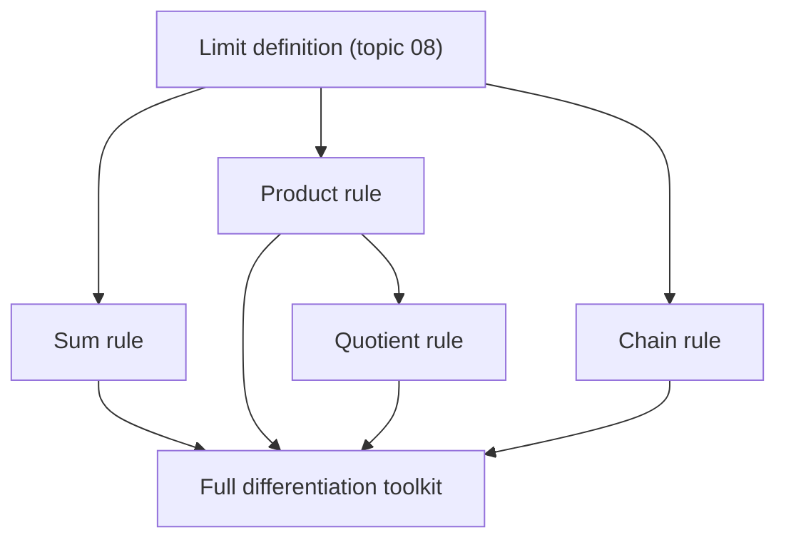

# 1. Overview

This topic collects the standard algebraic differentiation rules (sum, product, quotient, chain) for complex functions and the derivatives of the elementary functions. It follows directly from the limit definition in [differentiation](08_differentiation.md) and supplies the working toolkit used when testing [analyticity](10_analytic_function.md).

---

# 2. Definitions & Key Terms

1. **Differentiation Rules** — algebraic shortcuts (sum, product, quotient, chain rule) that compute f′(z) without returning to the limit definition each time.
   > Plain-English: the same rules from real calculus, proved to still work for complex functions.

---

# 3. Core Content

### A. Definition / Theorem

If f and g are differentiable at z, then so are f±g, fg, f/g (g(z)≠0), and f∘g (where composable), with derivatives given by the formulas below.

### B. Formula

```
(f ± g)′ = f′ ± g′
(fg)′ = f′g + fg′
(f/g)′ = (f′g − fg′)/g²,   g ≠ 0
(f∘g)′(z) = f′(g(z))·g′(z)        (chain rule)

d/dz [zⁿ] = nzⁿ⁻¹           (n integer)
d/dz [e^z] = e^z
d/dz [sin z] = cos z
d/dz [cos z] = −sin z
d/dz [log z] = 1/z            (any branch, z away from the branch cut)
```

### C. Derivation / Proof

**Sum rule (direct from the limit definition):**

```
lim(Δz→0) [(f+g)(z+Δz) − (f+g)(z)] / Δz
= lim(Δz→0) {[f(z+Δz)−f(z)]/Δz + [g(z+Δz)−g(z)]/Δz}
= f′(z) + g′(z)
```

(using that the limit of a sum is the sum of the limits, since both individual limits exist by hypothesis).

**Product rule (direct, add-and-subtract trick):**

```
(fg)(z+Δz) − (fg)(z) = f(z+Δz)g(z+Δz) − f(z)g(z)
= f(z+Δz)g(z+Δz) − f(z+Δz)g(z) + f(z+Δz)g(z) − f(z)g(z)
= f(z+Δz)[g(z+Δz)−g(z)] + g(z)[f(z+Δz)−f(z)]
```

Divide by Δz and let Δz→0: f(z+Δz)→f(z) (continuity, since f is differentiable), [g(z+Δz)−g(z)]/Δz→g′(z), and [f(z+Δz)−f(z)]/Δz→f′(z), giving (fg)′ = fg′ + gf′.

**d/dz[zⁿ] for positive integer n:** by repeated application of the product rule (or direct binomial expansion of (z+Δz)ⁿ−zⁿ, keeping only the first-order term in Δz), the result nzⁿ⁻¹ follows exactly as in the real case, since the algebra is identical over ℂ.

### D. Geometric Interpretation

These rules let derivatives of complicated expressions be computed algebraically, without repeating the direction-independence check from topic 08 each time — because each rule is proved once, directly from the (already path-independent) limit definition.

### E. Conditions

* The quotient rule requires g(z) ≠ 0 at the point in question.
* log z's derivative 1/z holds on any branch, but the point must avoid the corresponding branch cut, where the branch itself is discontinuous.

### F. Example

d/dz[z³ + e^z] = 3z² + e^z, by the sum rule.

---

# 4. Worked Examples

### Example 1 — 🟢 Foundational

**Problem:** Differentiate f(z) = 3z⁴ − 2z + 5.

**Solution**

Step 1: Apply the power rule term by term: d/dz[3z⁴]=12z³, d/dz[−2z]=−2, d/dz[5]=0.

**Answer:** f′(z) = 12z³ − 2.

### Example 2 — 🟡 Intermediate

**Problem:** Differentiate f(z) = z²e^z using the product rule.

**Solution**

Step 1: Let u=z², v=e^z; u′=2z, v′=e^z.

Step 2: (uv)′ = u′v + uv′ = 2z·e^z + z²·e^z.

**Answer:** f′(z) = e^z(2z + z²) = z(z+2)e^z.

### Example 3 — 🔴 Exam-Level

**Problem:** Differentiate f(z) = sin(z²+1)/z (z≠0) using the quotient and chain rules.

**Solution**

Step 1: Let N = sin(z²+1), D = z. By the chain rule, N′ = cos(z²+1)·2z.

Step 2: Quotient rule: f′ = (N′D − ND′)/D² = [2z cos(z²+1)·z − sin(z²+1)·1]/z².

**Answer:** f′(z) = [2z² cos(z²+1) − sin(z²+1)] / z².

---

# 5. Applications

* Fast symbolic computation of derivatives is needed throughout the rest of the unit — testing analyticity, verifying the Cauchy-Riemann equations, and computing residues all rely on these rules.
* Control theory and circuit analysis use derivatives of complex transfer functions built from these elementary pieces.

---

# 6. Diagram / Visual



Each algebraic rule is proved once from the direction-independent limit, then reused freely without re-checking path-independence.

---

# 7. Common Mistakes

- ❌ **Mistake:** Applying the real-variable rules without confirming both f and g are complex-differentiable at the point.
  ✅ **Correct:** These rules assume f′(z), g′(z) already exist; verify differentiability first (or that they're standard elementary functions known to be differentiable).

- ❌ **Mistake:** Forgetting the branch restriction when differentiating log z or zᵃ.
  ✅ **Correct:** d/dz[log z] = 1/z holds only away from the branch cut of the chosen branch.

- ❌ **Mistake:** Misapplying the quotient rule sign (writing f′g+fg′ over g² instead of f′g−fg′).
  ✅ **Correct:** (f/g)′ = (f′g − fg′)/g², matching the real-variable formula exactly.

---

# 8. Practice Problems

**P1 (Conceptual):** Why can the chain rule be proved directly from the limit definition even though Δz must approach 0 from every direction?

<details><summary>Solution</summary>
Because g is differentiable (hence continuous) at z, as Δz→0 the corresponding change Δw=g(z+Δz)−g(z) also →0 from whichever directions arise, and the outer limit for f′(g(z)) holds along all of those directions by hypothesis; composing the two direction-independent limits preserves direction-independence overall.
</details>

**P2 (Computational):** Differentiate f(z) = (2z+1)⁵.

<details><summary>Solution</summary>
Chain rule: f′(z) = 5(2z+1)⁴·2 = 10(2z+1)⁴.
</details>

**P3 (Computational):** Differentiate f(z) = e^(3z)cos z.

<details><summary>Solution</summary>
Product rule: f′ = 3e^(3z)cosz + e^(3z)(−sinz) = e^(3z)(3cosz − sinz).
</details>

**P4 (Exam-style):** Differentiate f(z) = log(z²+1) (principal branch, away from the cut).

<details><summary>Solution</summary>
Chain rule with d/dz[log w]=1/w: f′(z) = 1/(z²+1) · 2z = 2z/(z²+1).
</details>

**P5 (Exam-style):** Find all z where f(z) = z³ − 3z has f′(z) = 0.

<details><summary>Solution</summary>
f′(z) = 3z² − 3 = 0 ⟹ z² = 1 ⟹ z = ±1.
</details>

---

# 9. Summary

| Concept | Essential Result | Condition |
|---|---|---|
| Sum rule | (f±g)′ = f′±g′ | f, g differentiable |
| Product rule | (fg)′ = f′g+fg′ | f, g differentiable |
| Quotient rule | (f/g)′ = (f′g−fg′)/g² | g(z)≠0 |
| Chain rule | (f∘g)′ = f′(g(z))g′(z) | composable, differentiable |

With a working differentiation toolkit in place, the next topic defines analyticity — differentiability not just at a point but throughout a neighborhood.

---

# 10. References

1. James Ward Brown & Ruel V. Churchill — Complex Variables and Applications
2. Schaum's Outline of Complex Variables
3. John B. Conway — Functions of One Complex Variable
4. E. T. Copson — An Introduction to the Theory of Functions of a Complex Variable
