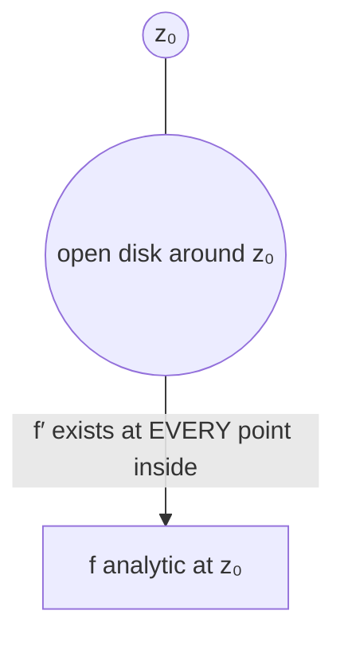

# 1. Overview

Analyticity strengthens pointwise differentiability (from [differentiation](08_differentiation.md) and [derivatives](09_derivatives.md)) into differentiability throughout an open neighborhood. It is the central property of complex analysis and is tested in practice using the [necessary and sufficient conditions for analyticity](11_necessary_and_sufficient_conditions_for_analyticity.md) covered next.

---

# 2. Definitions & Key Terms

1. **Differentiable at a Point** — f′(z₀) exists (as in topic 08).
   > Plain-English: the derivative exists at exactly that one point.

2. **Analytic at a Point z₀** — f is differentiable at every point in some open neighborhood of z₀ (not just at z₀ itself).
   > Plain-English: differentiable not just at the point, but "all around" it too.

3. **Analytic in a Region** — f is analytic at every point of an open region.
   > Plain-English: the whole domain, not just one point, has this stronger differentiability property.

4. **Entire Function** — f is analytic at every point of ℂ.
   > Plain-English: differentiable everywhere in the whole complex plane, with no exceptions.

---

# 3. Core Content

### A. Definition / Theorem

f is analytic at z₀ if there exists ε > 0 such that f′(z) exists for every z with |z − z₀| < ε. f is analytic on an open region D if it is analytic at every point of D. f is entire if it is analytic on all of ℂ.

### B. Formula

There is no single formula; analyticity is a structural (neighborhood) property, tested via the [Cauchy-Riemann equations](12_cauchy_riemann_equations.md) together with continuity of the partial derivatives (see next topic).

### C. Derivation — Why "At a Point" Isn't Enough

Recall from topic 08 that f(z) = |z|² is differentiable **only** at z = 0 (nowhere else). At z₀ = 0, every neighborhood of 0 contains points where f is not differentiable, so f fails to be analytic at 0 — despite being differentiable there. This shows analyticity is strictly stronger than pointwise differentiability: it demands an entire neighborhood, not an isolated point.

### D. Geometric Interpretation

An analytic function behaves locally like multiplication by a nonzero complex number (a conformal rotation-scaling) at every point of a whole neighborhood, giving it strong local regularity (in fact, analytic functions turn out to be infinitely differentiable and locally representable by a convergent power series — a fact proved later using [Cauchy's integral formula](18_cauchys_integral_formula.md)).

### E. Conditions

* Analyticity at a single isolated point is impossible to have "usefully" — the definition inherently requires a full neighborhood.
* A function can be differentiable at isolated points without being analytic anywhere (f(z)=|z|² is the standard counterexample: differentiable only at z=0, hence analytic nowhere).
* Polynomials are entire. Rational functions P(z)/Q(z) are analytic everywhere except at the (isolated) zeros of Q.

### F. Example

f(z) = z² is entire (differentiable everywhere, hence analytic everywhere), while f(z) = |z|² is differentiable only at 0 and therefore analytic nowhere.

---

# 4. Worked Examples

### Example 1 — 🟢 Foundational

**Problem:** Explain why every polynomial p(z) = a_n zⁿ + … + a₁z + a₀ is entire.

**Solution**

Step 1: By the derivative rules (topic 09), each term a_k z^k is differentiable everywhere, with derivative k·a_k z^(k−1).

Step 2: A finite sum of everywhere-differentiable functions is everywhere-differentiable (sum rule).

**Answer:** p(z) is differentiable at every z ∈ ℂ, and since ℂ itself is open, p is analytic at every point, i.e. entire.

### Example 2 — 🟡 Intermediate

**Problem:** Where is f(z) = 1/(z−2i) analytic?

**Solution**

Step 1: f is a quotient of the entire function 1 and the entire function (z−2i); by the quotient rule it is differentiable wherever the denominator is nonzero.

Step 2: z−2i = 0 only at z=2i.

**Answer:** f is analytic on ℂ ∖ {2i} — differentiable in a full neighborhood of every point except the single excluded point z=2i.

### Example 3 — 🔴 Exam-Level

**Problem:** Show f(z)=|z|² is not analytic anywhere, even though it is differentiable at z=0 (build on the topic-08 result).

**Solution**

Step 1: From topic 08, f′(z) exists only at z=0, and f′(0)=0; f is not differentiable at any z≠0.

Step 2: Analyticity at z₀ requires differentiability throughout an open disk around z₀, not merely at z₀.

Step 3: Take z₀=0. Any disk |z|<ε around 0 contains points z≠0, where f is not differentiable — so the "differentiable throughout a neighborhood" requirement fails, even at z₀=0 itself.

**Answer:** f(z)=|z|² is analytic nowhere, despite being differentiable at the single point z=0 — the standard example distinguishing pointwise differentiability from analyticity.

---

# 5. Applications

* Only analytic functions support the powerful machinery developed later in this unit: Cauchy-Goursat, Cauchy's integral formula, Taylor/Laurent expansions, and the residue theorem.
* Analytic functions model 2-D potential flow (fluid dynamics) and electrostatic potential fields, where the real/imaginary parts correspond to physically meaningful harmonic quantities (topic 13).

---

# 6. Diagram / Visual

Analyticity at z₀ requires f′ to exist not just at z₀, but at every point of some (however small) open disk centered at z₀.

---

# 7. Common Mistakes

- ❌ **Mistake:** Concluding f is analytic at z₀ simply because f′(z₀) exists.
  ✅ **Correct:** Analyticity requires f′ to exist throughout a whole neighborhood of z₀, not just at that one point.

- ❌ **Mistake:** Saying a function is "analytic at a single isolated point with no neighborhood support."
  ✅ **Correct:** Analyticity is inherently a neighborhood (open-set) concept; it cannot be checked using a single point alone.

- ❌ **Mistake:** Assuming all rational functions are entire.
  ✅ **Correct:** Rational functions fail to be analytic at the zeros of their denominator; they are entire only if the denominator is a nonzero constant.

---

# 8. Practice Problems

**P1 (Conceptual):** Give an example (other than |z|²) of a function differentiable at exactly one point.

Solution

f(z) = z z̄² (or similarly constructed products mixing z and z̄) typically reduces, by the same style of computation as |z|², to differentiability at isolated points only — the general principle is that any function genuinely involving z̄ nontrivially tends to fail the direction-independence test except possibly at isolated points.

**P2 (Computational):** State the region of analyticity for f(z) = z/(z²+1).

Solution

Denominator zero at z²=−1, i.e. z=±i. f is analytic on ℂ∖{i, −i}.

**P3 (Computational):** Is f(z) = e^z entire? Justify briefly.

Solution

Yes — e^z is differentiable everywhere in ℂ (derivative e^z itself, from topic 09), so it is analytic at every point, hence entire.

**P4 (Exam-style):** If f and g are both entire, show f+g and fg are entire.

Solution

By the sum and product rules (topic 09), (f+g)′ and (fg)′ exist wherever f′, g′ exist — which is everywhere, since f, g are entire. So f+g and fg are differentiable at every z∈ℂ, hence entire.

**P5 (Exam-style):** Explain why f(z) = 1/z is analytic on ℂ∖{0} but not entire.

Solution

1/z is differentiable at every z≠0 (quotient rule, entire numerator/denominator, denominator nonzero there), so f is analytic throughout the open set ℂ∖{0}. It is not entire because it is not even defined (let alone differentiable) at z=0, so "differentiable at every point of ℂ" fails.

---

# 9. Summary

| Concept | Essential Result | Condition |
|---|---|---|
| Differentiable at a point | f′(z₀) exists | pointwise |
| Analytic at a point | f′ exists throughout a neighborhood of z₀ | stronger than pointwise |
| Entire | analytic on all of ℂ | e.g. polynomials, e^z, sinz, cosz |
| Key counterexample | |z|² differentiable only at 0, analytic nowhere | — |

Analyticity is checked in practice using a concrete pair of equations — introduced next as the necessary and sufficient conditions for analyticity.

---

# 10. References

1. James Ward Brown & Ruel V. Churchill — Complex Variables and Applications
2. Schaum's Outline of Complex Variables
3. John B. Conway — Functions of One Complex Variable
4. E. T. Copson — An Introduction to the Theory of Functions of a Complex Variable
