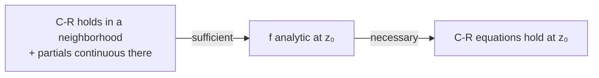

# 1. Overview

This topic states precisely what "necessary" and "sufficient" mean for testing analyticity, before the specific equations (Cauchy-Riemann) are derived in the next topic. It builds on [analytic function](10_analytic_function.md) and sets up exactly how [Cauchy-Riemann equations](12_cauchy_riemann_equations.md) will be used and misused.

---

# 2. Definitions & Key Terms

1. **Necessary Condition** — a condition that MUST hold if f is analytic (but satisfying it alone does not guarantee analyticity).
   > Plain-English: "analytic ⟹ this holds" — a consequence, not a guarantee.

2. **Sufficient Condition** — a condition that, if it holds, GUARANTEES f is analytic.
   > Plain-English: "this holds ⟹ analytic" — a guarantee, going the other direction.

---

# 3. Core Content

### A. Definition / Theorem

Write f(z) = u(x,y) + iv(x,y).

**Necessary condition:** if f is analytic at z₀, then the Cauchy-Riemann equations uₓ = v_y, u_y = −vₓ must hold at z₀ (proved in topic 12).

**Sufficient condition:** if u, v have continuous first partial derivatives in a neighborhood of z₀ AND the Cauchy-Riemann equations hold throughout that neighborhood, then f is analytic at z₀.

### B. Formula

```
Necessary (analytic ⟹):       uₓ = v_y,  u_y = −vₓ   at the point
Sufficient (⟹ analytic):      uₓ, u_y, vₓ, v_y continuous in a neighborhood
                                AND uₓ = v_y, u_y = −vₓ throughout it
```

### C. Derivation — Why Both Directions Are Needed

The necessary direction alone only tells us a candidate function *could* be analytic — it does not rule out pathological functions that satisfy the equations at isolated points without any real differentiability nearby. The sufficient direction requires the stronger hypothesis of *continuous* partials (not just their existence) throughout a neighborhood; continuity is what allows the multivariable "linear approximation" argument (used in deriving analyticity from the Cauchy-Riemann equations, topic 12) to actually work. Without continuity of the partials, satisfying the equations pointwise is not enough — a classical exercise-level counterexample exists where the Cauchy-Riemann equations hold at a single point yet the function fails to be differentiable there, precisely because the partials are discontinuous at that point.

### D. Geometric Interpretation

The necessary condition rules out functions that grossly disagree with the "rotate-and-scale" local structure required for analyticity; the sufficient condition is the constructive test that engineers/mathematicians actually use to *confirm* analyticity, once the extra regularity (continuity of partials) is verified.

### E. Conditions

* Do NOT claim the Cauchy-Riemann equations alone (without checking continuity of the partial derivatives) prove analyticity — this is a common but incorrect shortcut.
* The necessary condition is used to quickly rule functions OUT (if C-R fails, f is definitely not analytic there); the sufficient condition is used to confirm functions ARE analytic.

### F. Example

If uₓ ≠ v_y somewhere, f cannot be analytic there (necessary direction used as a quick disqualifying test).

---

# 4. Worked Examples

### Example 1 — 🟢 Foundational

**Problem:** For f(z) = x² − y² + i(2xy), verify the Cauchy-Riemann equations hold everywhere (necessary condition check).

**Solution**

Step 1: u = x²−y², v = 2xy. uₓ = 2x, u_y = −2y, vₓ = 2y, v_y = 2x.

Step 2: Check uₓ = v_y: 2x = 2x ✓. Check u_y = −vₓ: −2y = −2y ✓.

**Answer:** The Cauchy-Riemann equations hold at every (x,y), consistent with (necessary for) f being analytic everywhere — matching f(z)=z², which is entire.

### Example 2 — 🟡 Intermediate

**Problem:** For f(z) = x² + iy² (note: NOT z²), check whether the necessary condition rules out analyticity.

**Solution**

Step 1: u = x², v = y². uₓ = 2x, u_y = 0, vₓ = 0, v_y = 2y.

Step 2: Check uₓ = v_y: 2x = 2y, which only holds when x=y — not for all (x,y).

**Answer:** The Cauchy-Riemann equations fail except on the line x=y, so f is not analytic anywhere (analyticity requires the equations to hold throughout a whole neighborhood, and the single line x=y contains no open disk).

### Example 3 — 🔴 Exam-Level

**Problem:** Explain, using this topic's framework, why "Cauchy-Riemann holds at z₀" is not by itself enough to conclude f is analytic at z₀ — referencing what extra hypothesis is required.

**Solution**

Step 1: The necessary direction only says analytic ⟹ C-R holds; it says nothing about the converse.

Step 2: The sufficient direction requires C-R to hold throughout an open neighborhood of z₀ (not just at z₀), AND requires the four partials uₓ, u_y, vₓ, v_y to be continuous throughout that neighborhood.

Step 3: A function could satisfy C-R at an isolated point purely by algebraic coincidence, without u and v having continuous, well-behaved partials nearby — in that case the sufficient theorem's hypotheses fail, and no conclusion about analyticity can be drawn from C-R at that single point alone.

**Answer:** Checking C-R at one point only invokes the necessary direction (informative for ruling functions OUT); confirming analyticity requires the full sufficient hypothesis: continuous partials plus C-R holding throughout an open neighborhood, not just at the point itself.

---

# 5. Applications

* This necessary/sufficient distinction is the standard template mathematicians use throughout analysis (e.g. testing convergence, continuity); recognizing it prevents a very common exam error.
* Engineers verifying a potential function is physically realizable as the real (or imaginary) part of an analytic function rely on the sufficient direction, not just the necessary one.

---

# 6. Diagram / Visual



The necessary arrow only goes one way (analytic ⟹ C-R); the sufficient arrow requires the stronger neighborhood + continuity hypothesis to conclude analyticity.

---

# 7. Common Mistakes

- ❌ **Mistake:** Checking the Cauchy-Riemann equations at only one point and concluding the function is analytic everywhere.
  ✅ **Correct:** Analyticity requires the equations (plus continuous partials) to hold throughout an open neighborhood, not merely at one point.

- ❌ **Mistake:** Treating "C-R holds" and "f is analytic" as logically equivalent statements.
  ✅ **Correct:** C-R holding is necessary but only sufficient when combined with continuity of the four partial derivatives in a neighborhood.

- ❌ **Mistake:** Using the necessary direction to try to prove analyticity (rather than to rule it out).
  ✅ **Correct:** Use the necessary direction only to disqualify candidates (if C-R fails, f is not analytic); use the sufficient direction, with its extra hypotheses, to confirm analyticity.

---

# 8. Practice Problems

**P1 (Conceptual):** In your own words, state the difference between a necessary and a sufficient condition, using an everyday (non-mathematical) example.

<details><summary>Solution</summary>
"Being a mammal" is necessary for "being a dog" (every dog is a mammal, but not every mammal is a dog). "Being a dog" is sufficient for "being a mammal" (if it's a dog, it's definitely a mammal) but not necessary (something can be a mammal without being a dog). The same asymmetry applies to analyticity and the Cauchy-Riemann equations.
</details>

**P2 (Computational):** For f(z) = e^x cos y + i e^x sin y, check the necessary condition (Cauchy-Riemann) at a general point.

<details><summary>Solution</summary>
u=e^x cosy, v=e^x siny. uₓ=e^xcosy, u_y=−e^xsiny, vₓ=e^xsiny, v_y=e^xcosy. uₓ=v_y ✓ (both e^xcosy); u_y=−vₓ ✓ (both −e^xsiny). Holds everywhere — consistent with f(z)=e^z being entire.
</details>

**P3 (Computational):** For f(z) = xy + i(x+y), check whether C-R holds anywhere.

<details><summary>Solution</summary>
u=xy, v=x+y. uₓ=y, u_y=x, vₓ=1, v_y=1. uₓ=v_y ⟹ y=1. u_y=−vₓ ⟹ x=−1. Both hold simultaneously only at the single point (−1,1) — not on any open neighborhood, so f is analytic nowhere.
</details>

**P4 (Exam-style):** Suppose u, v have continuous partials everywhere and satisfy C-R everywhere. What can you conclude about f = u+iv, and why is this stronger than the previous problem's finding?

<details><summary>Solution</summary>
By the sufficient condition, f is analytic at every point (indeed entire), since C-R holds throughout the whole plane (an open neighborhood of every point) and the partials are continuous. This is stronger than problem P3, where C-R held only at one isolated point — insufficient for analyticity anywhere.
</details>

**P5 (Exam-style):** True or False, with justification: "If the four partial derivatives uₓ, u_y, vₓ, v_y exist at z₀ but are not continuous there, and C-R holds at z₀, then f is guaranteed analytic at z₀."

<details><summary>Solution</summary>
False. The sufficient theorem explicitly requires continuity of the partials in a neighborhood of z₀; without that continuity, satisfying C-R at z₀ alone does not guarantee f′(z₀) exists, let alone that f is analytic at z₀.
</details>

---

# 9. Summary

| Concept | Essential Result | Condition |
|---|---|---|
| Necessary | analytic ⟹ C-R holds at the point | always, if analytic |
| Sufficient | C-R holds in a neighborhood + continuous partials ⟹ analytic | extra continuity hypothesis required |
| Common error | C-R at one point alone does NOT prove analyticity | must hold throughout a neighborhood |

With this necessary/sufficient distinction established, the next topic derives the Cauchy-Riemann equations themselves and states the full continuity hypothesis precisely.

---

# 10. References

1. James Ward Brown & Ruel V. Churchill — Complex Variables and Applications
2. Schaum's Outline of Complex Variables
3. John B. Conway — Functions of One Complex Variable
4. E. T. Copson — An Introduction to the Theory of Functions of a Complex Variable
