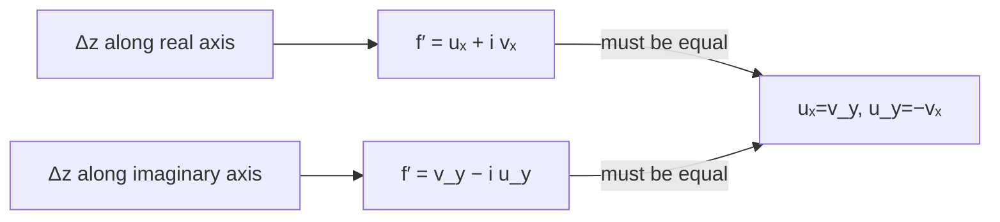

# 1. Overview

The Cauchy-Riemann equations are the concrete pair of partial-differential conditions from the [necessary and sufficient conditions](11_necessary_and_sufficient_conditions_for_analyticity.md) framework. They are the standard operational test for analyticity and are essential before defining [harmonic functions](13_harmonic_function.md).

---

# 2. Definitions & Key Terms

1. **Cauchy-Riemann Equations** — the pair uₓ = v_y and u_y = −vₓ, for f = u+iv.
   > Plain-English: two partial-derivative relations that u and v must satisfy for f to have a chance of being analytic.

---

# 3. Core Content

### A. Definition / Theorem

For f(z) = u(x,y) + iv(x,y), if f is differentiable at z₀ = x₀+iy₀, then:

```
┌─────────────────────┐
│ uₓ = v_y,  u_y = −vₓ │
└─────────────────────┘
```

evaluated at (x₀,y₀).

### B. Formula

```
uₓ = v_y
u_y = −vₓ
```

### C. Derivation / Proof (direct — from the two axis approach paths)

Assume f′(z₀) exists. Since the defining limit must agree along every path, compute it along two specific paths:

**Path 1 — Δz real (Δz = Δx):**

```
f′(z₀) = lim(Δx→0) [f(z₀+Δx) − f(z₀)]/Δx
       = lim(Δx→0) {[u(x₀+Δx,y₀)−u(x₀,y₀)] + i[v(x₀+Δx,y₀)−v(x₀,y₀)]} / Δx
       = uₓ(x₀,y₀) + i vₓ(x₀,y₀)
```

**Path 2 — Δz purely imaginary (Δz = iΔy):**

```
f′(z₀) = lim(Δy→0) [f(z₀+iΔy) − f(z₀)]/(iΔy)
       = lim(Δy→0) {[u(x₀,y₀+Δy)−u(x₀,y₀)] + i[v(x₀,y₀+Δy)−v(x₀,y₀)]} / (iΔy)
       = (1/i)[u_y(x₀,y₀) + i v_y(x₀,y₀)]
       = v_y(x₀,y₀) − i u_y(x₀,y₀)         (using 1/i = −i)
```

Since f′(z₀) must be the **same** complex number from both paths, equate real and imaginary parts:

```
Real:      uₓ = v_y
Imaginary: vₓ = −u_y   (i.e. u_y = −vₓ)
```

This is a direct proof (not by contradiction), relying only on the assumed existence of the limit along two specific, legitimately-allowed paths.

### D. Geometric Interpretation

These equations encode that, locally, f acts as a rotation-and-scaling: the gradient vectors of u and v are perpendicular and equal in magnitude (∇u ⊥ ∇v, |∇u| = |∇v|), which is exactly the rigid conformal structure noted in [analytic function](10_analytic_function.md#d-geometric-interpretation).

### E. Conditions

* Continuity of the four partials uₓ, u_y, vₓ, v_y in a neighborhood is the extra hypothesis needed for the *sufficient* direction (topic 11) — the derivation above only proves the *necessary* direction from a bare assumption of differentiability.
* Applies at each point individually; for analyticity throughout a region, C-R must hold at every point of that region.

---

# 4. Worked Examples

### Example 1 — 🟢 Foundational

**Problem:** Test whether f(z) = x³−3xy² + i(3x²y−y³) satisfies the Cauchy-Riemann equations (this is f(z)=z³).

**Solution**

Step 1: u=x³−3xy², v=3x²y−y³.

Step 2: uₓ=3x²−3y², u_y=−6xy, vₓ=6xy, v_y=3x²−3y².

Step 3: uₓ=v_y: 3x²−3y² = 3x²−3y² ✓. u_y=−vₓ: −6xy = −6xy ✓.

**Answer:** The equations hold identically for all (x,y) — consistent with z³ being entire.

### Example 2 — 🟡 Intermediate

**Problem:** For f(z) = x² + y² + i(2xy) (note this is x²+y², not the entire-function pattern), test where the Cauchy-Riemann equations hold (one example where they fail generally, holding only on a restricted set).

**Solution**

Step 1: u=x²+y², v=2xy. uₓ=2x, u_y=2y, vₓ=2y, v_y=2x.

Step 2: uₓ=v_y: 2x=2x ✓ always. u_y=−vₓ: 2y = −2y ⟹ 4y=0 ⟹ y=0.

**Answer:** The second equation forces y=0 — C-R holds only along the real axis, not throughout any open neighborhood, so f is analytic nowhere despite satisfying one equation identically.

### Example 3 — 🔴 Exam-Level

**Problem:** For f(z) = e^(−y)(cos x + i sin x), verify C-R and, given the partials are continuous everywhere, conclude analyticity and find f′(z).

**Solution**

Step 1: u=e^(−y)cosx, v=e^(−y)sinx.

Step 2: uₓ=−e^(−y)sinx, u_y=−e^(−y)cosx, vₓ=e^(−y)cosx, v_y=−e^(−y)sinx.

Step 3: uₓ=v_y: −e^(−y)sinx = −e^(−y)sinx ✓. u_y=−vₓ: −e^(−y)cosx = −e^(−y)cosx ✓.

Step 4: Both hold everywhere and the four partials (built from e^(−y), sinx, cosx) are continuous everywhere, so by the sufficient condition (topic 11) f is entire. f′(z) = uₓ+ivₓ = −e^(−y)sinx + i e^(−y)cosx = i·e^(−y)(cosx+isinx) = i·f(z).

**Answer:** f is entire, with f′(z) = i·f(z) — matching f(z) = e^(iz) after noting e^(−y)(cosx+isinx) = e^(ix−y) = e^(i(x+iy)) = e^(iz).

---

# 5. Applications

* The standard, fastest test for whether a given u(x,y), v(x,y) pair can be assembled into an analytic function.
* Used to construct the harmonic conjugate (topic 14) and underlies potential-flow and electrostatics modeling (topic 13).

---

# 6. Diagram / Visual



Both axis-paths must give the same complex derivative — equating their real and imaginary parts produces exactly the Cauchy-Riemann equations.

---

# 7. Common Mistakes

- ❌ **Mistake:** Writing the second equation as u_y = vₓ (sign error).
  ✅ **Correct:** The correct relation is u_y = −vₓ (equivalently vₓ = −u_y) — the minus sign is essential and frequently dropped by mistake.

- ❌ **Mistake:** Checking the Cauchy-Riemann equations at only one point and concluding the function is analytic everywhere.
  ✅ **Correct:** As emphasized in topic 11, C-R must hold throughout a neighborhood, with continuous partials, to conclude analyticity.

- ❌ **Mistake:** Using f′(z) = uₓ − ivₓ or another mismatched sign/part combination.
  ✅ **Correct:** f′(z) = uₓ + ivₓ = v_y − iu_y (both expressions are equal, by C-R, and give the correct derivative).

---

# 8. Practice Problems

**P1 (Conceptual):** Explain in one or two sentences why equating the Path-1 and Path-2 expressions for f′(z₀) is valid only if f′(z₀) is assumed to exist in the first place.

<details><summary>Solution</summary>
The two path computations only both converge to the *same* value f′(z₀) if the overall limit exists (i.e. f is differentiable at z₀); if f′(z₀) did not exist, the two paths could give different (or no) limiting values, and equating them would be meaningless.
</details>

**P2 (Computational):** Test f(z)=cosx coshy − i sinx sinhy (this is f(z)=cos z) for C-R.

<details><summary>Solution</summary>
u=cosx coshy, v=−sinx sinhy. uₓ=−sinx coshy, u_y=cosx sinhy, vₓ=−cosx sinhy, v_y=−sinx coshy. uₓ=v_y: −sinx coshy = −sinx coshy ✓. u_y=−vₓ: cosx sinhy = cosx sinhy ✓. Holds everywhere.
</details>

**P3 (Computational):** For f(z)=2xy−i(x²−y²), test C-R.

<details><summary>Solution</summary>
u=2xy, v=−(x²−y²)=y²−x². uₓ=2y, u_y=2x, vₓ=−2x, v_y=2y. uₓ=v_y: 2y=2y ✓. u_y=−vₓ: 2x = 2x ✓ (since −vₓ=−(−2x)=2x). Holds everywhere — f is entire.
</details>

**P4 (Exam-style):** Given u(x,y)=x³−3xy², use C-R to find v(x,y) up to a constant, assuming f=u+iv is entire.

<details><summary>Solution</summary>
uₓ=3x²−3y². By C-R, v_y=uₓ=3x²−3y² ⟹ v=3x²y−y³+g(x). Then vₓ=6xy+g′(x). By C-R, u_y=−vₓ: −6xy = −(6xy+g′(x)) ⟹ g′(x)=0 ⟹ g(x)=C. So v=3x²y−y³+C, matching Example 1's f(z)=z³ (up to the additive constant).
</details>

**P5 (Exam-style):** Determine all points where f(z) = x²−y²+i(2xy)+z̄ fails to satisfy the Cauchy-Riemann equations, given z̄ contributes u₂=x, v₂=−y to the real/imaginary parts.

<details><summary>Solution</summary>
Total u = x²−y²+x, v = 2xy−y. uₓ=2x+1, u_y=−2y, vₓ=2y, v_y=2x−1. uₓ=v_y: 2x+1=2x−1 ⟹ 1=−1, never true. So C-R fails at every point — f is analytic nowhere (the added z̄ term, being nowhere differentiable per topic 08, spoils analyticity everywhere).
</details>

---

# 9. Summary

| Concept | Essential Result | Condition |
|---|---|---|
| Cauchy-Riemann | uₓ = v_y,  u_y = −vₓ | necessary for differentiability at the point |
| Derivative formula | f′(z) = uₓ + ivₓ = v_y − iu_y | when C-R holds and f′ exists |
| Full analyticity test | C-R throughout a neighborhood + continuous partials | sufficient (topic 11) |

Having established the Cauchy-Riemann relations, the next topic shows why u and v individually must satisfy Laplace's equation — the harmonic function property.

---

# 10. References

1. James Ward Brown & Ruel V. Churchill — Complex Variables and Applications
2. Schaum's Outline of Complex Variables
3. John B. Conway — Functions of One Complex Variable
4. E. T. Copson — An Introduction to the Theory of Functions of a Complex Variable
