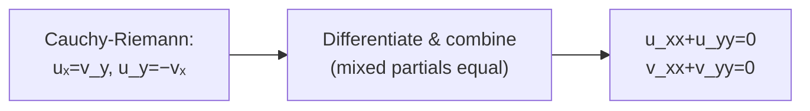

# 1. Overview

Harmonic functions satisfy Laplace's equation, and this topic shows that the real and imaginary parts of any analytic function are automatically harmonic. It follows directly from the [Cauchy-Riemann equations](12_cauchy_riemann_equations.md) and sets up the construction of a [harmonic conjugate](14_harmonic_conjugate.md) in the next topic.

---

# 2. Definitions & Key Terms

1. **Laplace's Equation** — φ_xx + φ_yy = 0.
   > Plain-English: the sum of the two unmixed second partial derivatives of φ vanishes.

2. **Harmonic Function** — a real-valued function φ(x,y) with continuous second partial derivatives satisfying Laplace's equation.
   > Plain-English: a "balanced" function with no net curvature in the combined x- and y-directions.

---

# 3. Core Content

### A. Definition / Theorem

**Theorem:** If f(z) = u(x,y) + iv(x,y) is analytic in a domain D, then u and v are each harmonic in D:

```
u_xx + u_yy = 0
v_xx + v_yy = 0
```

### B. Formula

```
u_xx + u_yy = 0     (u harmonic)
v_xx + v_yy = 0     (v harmonic)
```

### C. Derivation / Proof (direct, from Cauchy-Riemann)

Since f is analytic, the Cauchy-Riemann equations hold:

```
uₓ = v_y      ...(i)
u_y = −vₓ     ...(ii)
```

It is a standard fact (proved later via Cauchy's integral formula, topic 18) that an analytic function is infinitely differentiable, so u and v have continuous partial derivatives of every order — in particular, the mixed partials are equal (Clairaut/Schwarz): u_xy = u_yx, v_xy = v_yx.

Differentiate (i) with respect to x: uₓₓ = v_yx.

Differentiate (ii) with respect to y: u_yy = −vₓy.

Since v_yx = vₓy (mixed partials equal, by the continuity just noted), add the two results:

```
uₓₓ + u_yy = v_yx − vₓy = v_yx − v_yx = 0
```

So u_xx + u_yy = 0. The identical argument (differentiating (i) w.r.t. y and (ii) w.r.t. x, then subtracting) shows v_xx + v_yy = 0.

### D. Geometric Interpretation

Harmonic functions have no local maxima or minima in the interior of their domain (maximum principle) and describe steady-state physical quantities: temperature distribution, electrostatic potential, and velocity potential in irrotational, incompressible 2-D fluid flow.

### E. Conditions

* The theorem requires f to be analytic (not merely that u, v individually happen to satisfy Laplace's equation) — analyticity is what links u and v through Cauchy-Riemann, forcing both to be harmonic together.
* Continuity of second partials is implicitly guaranteed by analyticity (a deeper theorem, referenced above); this is not an extra hypothesis the student needs to separately verify once analyticity is established.

### F. Example

For f(z)=z²=x²−y²+i(2xy): u=x²−y², u_xx=2, u_yy=−2, sum=0 ✓.

---

# 4. Worked Examples

### Example 1 — 🟢 Foundational

**Problem:** Verify u(x,y) = x²−y² is harmonic.

**Solution**

Step 1: uₓ=2x, uₓₓ=2. u_y=−2y, u_yy=−2.

**Answer:** uₓₓ+u_yy = 2+(−2) = 0, so u is harmonic.

### Example 2 — 🟡 Intermediate

**Problem:** Verify v(x,y) = e^x sin y is harmonic (the imaginary part of f(z)=e^z).

**Solution**

Step 1: vₓ=e^x siny, vₓₓ=e^x siny. v_y=e^x cosy, v_yy=−e^x siny.

**Answer:** vₓₓ+v_yy = e^x siny − e^x siny = 0, so v is harmonic.

### Example 3 — 🔴 Exam-Level

**Problem:** Show that φ(x,y) = x³ − 3xy² is harmonic, but ψ(x,y) = x³ + 3xy² is NOT harmonic, and connect this to which one can be the real part of an analytic function.

**Solution**

Step 1: For φ: φₓ=3x²−3y², φₓₓ=6x. φ_y=−6xy, φ_yy=−6x. Sum: 6x−6x=0 ✓ harmonic.

Step 2: For ψ: ψₓ=3x²+3y², ψₓₓ=6x. ψ_y=6xy, ψ_yy=6x. Sum: 6x+6x=12x ≠ 0 (except at x=0) — not harmonic.

**Answer:** φ is harmonic (indeed it is Re(z³), matching the entire function z³ from topic 12's Example 1), so it CAN be the real part of an analytic function; ψ fails Laplace's equation, so by the theorem above it CANNOT be the real or imaginary part of any analytic function.

---

# 5. Applications

* Electrostatic potential in charge-free regions satisfies Laplace's equation — modeled directly by harmonic functions from analytic complex potentials.
* 2-D steady-state heat distribution and incompressible, irrotational fluid-flow velocity potentials are harmonic.

---

# 6. Diagram / Visual



Differentiating the two Cauchy-Riemann relations and combining them (using equality of mixed partials) directly yields Laplace's equation for both u and v.

---

# 7. Common Mistakes

- ❌ **Mistake:** Assuming any two-variable function satisfying Laplace's equation is automatically the real part of SOME analytic function without further construction.
  ✅ **Correct:** It is true (a converse result) that harmonic functions on suitable domains do have harmonic conjugates making them the real part of an analytic function — but the conjugate must actually be constructed (topic 14), it isn't automatic or unique without fixing a constant.

- ❌ **Mistake:** Forgetting that BOTH u and v must be harmonic — checking only one and assuming the other follows without justification.
  ✅ **Correct:** The theorem guarantees both simultaneously, but each should be verified independently when checking a specific f, as a computational check.

- ❌ **Mistake:** Using the wrong sign convention and writing u_xx − u_yy = 0.
  ✅ **Correct:** Laplace's equation is u_xx + u_yy = 0 — a sum, not a difference.

---

# 8. Practice Problems

**P1 (Conceptual):** Why does the proof of the harmonic-function theorem depend on the mixed partials being equal (u_xy = u_yx)?

<details><summary>Solution</summary>
The proof combines uₓₓ = v_yx (from differentiating one C-R equation) with u_yy = −vₓy (from differentiating the other); these can only be added to cancel the v-terms if v_yx and vₓy denote the same quantity, i.e. if the mixed partial derivatives of v are equal.
</details>

**P2 (Computational):** Verify u(x,y) = e^x cos y is harmonic.

<details><summary>Solution</summary>
uₓ=e^xcosy, uₓₓ=e^xcosy. u_y=−e^xsiny, u_yy=−e^xcosy. Sum: e^xcosy−e^xcosy=0. Harmonic.
</details>

**P3 (Computational):** Verify v(x,y) = 2xy is harmonic.

<details><summary>Solution</summary>
vₓ=2y, vₓₓ=0. v_y=2x, v_yy=0. Sum=0. Harmonic.
</details>

**P4 (Exam-style):** Show that if u is harmonic, then so is any constant multiple cu (c real constant), directly from Laplace's equation.

<details><summary>Solution</summary>
(cu)ₓₓ+(cu)_yy = c·uₓₓ + c·u_yy = c(uₓₓ+u_yy) = c·0 = 0, using linearity of differentiation.
</details>

**P5 (Exam-style):** Determine whether φ(x,y) = ln(x²+y²) is harmonic away from the origin, and relate this to the [complex logarithm](07_elementary_functions_of_complex_variables.md).

<details><summary>Solution</summary>
φ = ln(x²+y²) = 2ln|z| = 2 Re(Log z) for z≠0. φₓ = 2x/(x²+y²), φₓₓ = [2(x²+y²) − 2x(2x)]/(x²+y²)² = [2y²−2x²]/(x²+y²)². By symmetry, φ_yy = [2x²−2y²]/(x²+y²)². Sum = 0. So φ is harmonic on ℂ∖{0} — consistent with it being (twice) the real part of the analytic function Log z there.
</details>

---

# 9. Summary

| Concept | Essential Result | Condition |
|---|---|---|
| Laplace's equation | φ_xx+φ_yy=0 | φ harmonic |
| Main theorem | f analytic ⟹ u, v both harmonic | uses C-R + equal mixed partials |
| Counterexample-style check | not every 2-variable function is harmonic | verify uₓₓ+u_yy=0 directly |

Given a single harmonic function u, the next topic constructs its harmonic conjugate v, so that f = u+iv is analytic.

---

# 10. References

1. James Ward Brown & Ruel V. Churchill — Complex Variables and Applications
2. Schaum's Outline of Complex Variables
3. John B. Conway — Functions of One Complex Variable
4. E. T. Copson — An Introduction to the Theory of Functions of a Complex Variable
