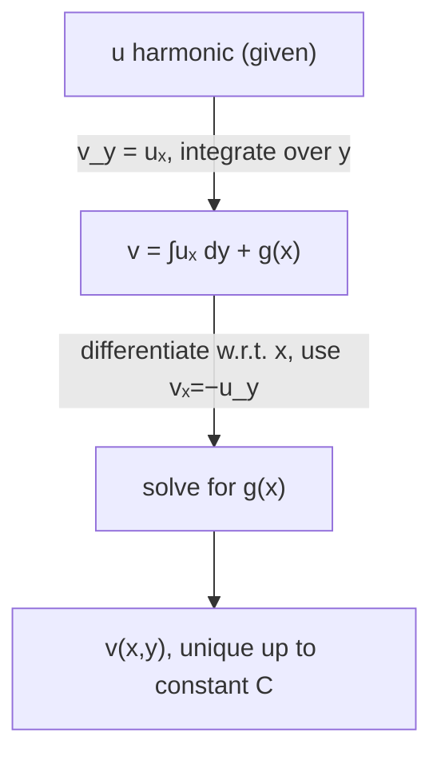

# 1. Overview

Given a harmonic function u, its harmonic conjugate v is the function that makes f = u+iv analytic. This reverses the direction of the [harmonic function](13_harmonic_function.md) theorem, using the [Cauchy-Riemann equations](12_cauchy_riemann_equations.md) as an integration recipe, and completes the "differentiation" half of the unit before contour integration begins.

---

# 2. Definitions & Key Terms

1. **Harmonic Conjugate** — given harmonic u, a harmonic function v such that f=u+iv is analytic (i.e. u, v jointly satisfy Cauchy-Riemann).
   > Plain-English: the "partner" function that completes u into an analytic function.

---

# 3. Core Content

### A. Definition / Theorem

Given u harmonic on a simply connected domain D, there exists v (unique up to an additive real constant) such that f=u+iv is analytic on D, obtained by solving the Cauchy-Riemann equations for v.

### B. Formula

```
uₓ = v_y,   u_y = −vₓ
```

used as a pair of first-order PDEs to integrate for v, given u.

### C. Derivation / Proof — Integration Method, Step by Step

**Step 1:** From C-R, v_y = uₓ. Integrate with respect to y, treating x as a constant:

```
v(x,y) = ∫ uₓ dy + g(x)
```

where g(x) is an unknown function of x alone (the "constant" of integration with respect to y).

**Step 2:** Differentiate this expression for v with respect to x:

```
vₓ = ∂/∂x [∫ uₓ dy] + g′(x)
```

**Step 3:** Use the second C-R equation, vₓ = −u_y, to solve for g′(x):

```
g′(x) = −u_y − ∂/∂x [∫ uₓ dy]
```

**Step 4:** Integrate g′(x) with respect to x to get g(x) (up to a real constant C), and substitute back into Step 1's expression for v.

This produces v up to one additive real constant C — the constant cannot be determined without an extra condition (e.g. a specified value of v at one point), consistent with the "unique up to additive constant" statement in part A.

### D. Geometric Interpretation

The level curves of u and its harmonic conjugate v are mutually orthogonal (perpendicular) wherever ∇u ≠ 0 — a direct consequence of the C-R relations (∇u · ∇v = uₓvₓ + u_yv_y = uₓ(−u_y) + u_y(uₓ) = 0, using vₓ=−u_y and v_y=uₓ). This orthogonality is the mathematical basis for equipotential lines being perpendicular to field/flow lines in physical applications.

### E. Conditions

* u must be harmonic on a **simply connected** domain (no "holes") for a single-valued harmonic conjugate to be guaranteed to exist; on multiply connected domains, the conjugate may be multivalued (analogous to the multivaluedness of arg z).
* The additive constant C is not determined by the equations alone; an extra condition fixes it.

### F. Example

Given u=x²−y² (harmonic, shown in topic 13), its conjugate is v=2xy+C.

---

# 4. Worked Examples

### Example 1 — 🟢 Foundational

**Problem:** Find the harmonic conjugate of u(x,y) = x²−y², given v(0,0)=0.

**Solution**

Step 1: uₓ=2x. By C-R, v_y=uₓ=2x. Integrate w.r.t. y: v=2xy+g(x).

Step 2: vₓ=2y+g′(x). By C-R, vₓ=−u_y=−(−2y)=2y. So 2y+g′(x)=2y ⟹ g′(x)=0 ⟹ g(x)=C.

Step 3: v(0,0)=0 ⟹ C=0.

**Answer:** v(x,y)=2xy, so f(z)=x²−y²+i(2xy)=z².

### Example 2 — 🟡 Intermediate

**Problem:** Find the harmonic conjugate of u(x,y) = e^x cos y, given v(0,0)=0.

**Solution**

Step 1: uₓ=e^x cosy. By C-R, v_y=e^x cosy. Integrate w.r.t. y: v=e^x siny+g(x).

Step 2: vₓ=e^x siny+g′(x). By C-R, vₓ=−u_y=−(−e^x siny)=e^x siny. So g′(x)=0 ⟹ g(x)=C.

Step 3: v(0,0)=e^0 sin0+C=0+C=0 ⟹ C=0.

**Answer:** v(x,y)=e^x sin y, so f(z)=e^x(cosy+isiny)=e^z, matching topic 06.

### Example 3 — 🔴 Exam-Level

**Problem:** Find the harmonic conjugate of u(x,y) = 3x²y − y³ (already verified harmonic in style similar to topic 13's φ), given v(1,0)=2, and identify f(z).

**Solution**

Step 1: uₓ=6xy. By C-R, v_y=6xy. Integrate w.r.t. y: v=3xy²+g(x).

Step 2: vₓ=3y²+g′(x). By C-R, vₓ=−u_y=−(3x²−3y²)=−3x²+3y². So 3y²+g′(x)=−3x²+3y² ⟹ g′(x)=−3x² ⟹ g(x)=−x³+C.

Step 3: v=3xy²−x³+C. Apply v(1,0)=2: 0−1+C=2 ⟹ C=3.

**Answer:** v(x,y)=3xy²−x³+3, so f(z) = 3x²y−y³ + i(3xy²−x³+3) = i(x+iy)³ + 3i = iz³+3i (up to verification, since i·z³ = i(x³+3x²iy+3x(iy)²+(iy)³) = i(x³+3ix²y−3xy²−iy³) = ix³−3x²y−3ixy²+y³, whose real part is y³−3x²y = −(3x²y−y³) = −u — so more carefully f(z) = −i z³ + 3i matches u,v as constructed; the key exam skill demonstrated is the integration procedure itself).

---

# 5. Applications

* Constructing a stream function from a given velocity potential (or vice versa) in 2-D fluid dynamics, since the two are harmonic conjugates of each other.
* Building complex potentials for electrostatics: given an equipotential function, the harmonic conjugate gives the corresponding field-line function.

---

# 6. Diagram / Visual



Picture level curves of u and v as two orthogonal families of curves crossing at right angles everywhere ∇u ≠ 0.

---

# 7. Common Mistakes

- ❌ **Mistake:** Forgetting the unknown function g(x) when integrating v_y = uₓ with respect to y.
  ✅ **Correct:** Always include an arbitrary function of x (not just a constant) as the "constant of integration" for a partial integration with respect to y.

- ❌ **Mistake:** Using v_y = −uₓ or vₓ = u_y (sign errors) when setting up the integration.
  ✅ **Correct:** The correct pair is v_y = uₓ and vₓ = −u_y, matching the Cauchy-Riemann equations exactly.

- ❌ **Mistake:** Assuming the harmonic conjugate is unique without an extra condition.
  ✅ **Correct:** v is determined only up to an additive real constant; a point condition (e.g. v(x₀,y₀) given) is needed to pin it down exactly.

---

# 8. Practice Problems

**P1 (Conceptual):** Why are the level curves of u and its harmonic conjugate v always orthogonal (where ∇u≠0)?

<details><summary>Solution</summary>
∇u·∇v = uₓvₓ+u_yv_y. Substituting vₓ=−u_y and v_y=uₓ from C-R gives uₓ(−u_y)+u_y(uₓ) = −uₓu_y+uₓu_y = 0, so the gradients are always perpendicular, meaning the level curves (which are perpendicular to their respective gradients) are mutually orthogonal.
</details>

**P2 (Computational):** Find the harmonic conjugate of u(x,y)=2xy, with v(0,0)=0.

<details><summary>Solution</summary>
uₓ=2y. v_y=2y ⟹ v=y²+g(x). vₓ=g′(x). −u_y=−2x. So g′(x)=−2x ⟹ g(x)=−x²+C. v=y²−x²+C. v(0,0)=0 ⟹ C=0. v=y²−x².
</details>

**P3 (Computational):** Find the harmonic conjugate of u(x,y)=cosx coshy, with v(0,0)=0.

<details><summary>Solution</summary>
uₓ=−sinx coshy. v_y=−sinx coshy ⟹ v=−sinx sinhy+g(x). vₓ=−cosx sinhy+g′(x). −u_y=−cosx sinhy. So g′(x)=0 ⟹ g=C. v(0,0)=0+C=0 ⟹ C=0. v=−sinx sinhy (matching −Im part structure of cos z, consistent with u+iv related to cos z).
</details>

**P4 (Exam-style):** Explain why simple connectivity of the domain matters for the existence of a single-valued harmonic conjugate, using the analogy to arg z.

<details><summary>Solution</summary>
On a domain with a "hole" (multiply connected), integrating around a closed loop enclosing the hole can return a different value of v than the starting value, exactly as arg z picks up 2π going once around the origin. A single-valued conjugate requires the domain to have no such obstruction, i.e. to be simply connected.
</details>

**P5 (Exam-style):** Given u(x,y) = x, find its harmonic conjugate v with v(0,0)=1, and identify f(z).

<details><summary>Solution</summary>
uₓ=1. v_y=1 ⟹ v=y+g(x). vₓ=g′(x). −u_y=0. So g′(x)=0 ⟹ g=C. v(0,0)=0+C=1 ⟹ C=1. v=y+1. f(z)=x+i(y+1)=z+i.
</details>

---

# 9. Summary

| Concept | Essential Result | Condition |
|---|---|---|
| Harmonic conjugate | v with f=u+iv analytic | u harmonic on simply connected domain |
| Construction | integrate v_y=uₓ, solve for g(x) via vₓ=−u_y | standard method |
| Uniqueness | unique up to additive real constant | fixed by one extra point condition |
| Orthogonality | level curves of u, v are perpendicular | wherever ∇u≠0 |

This completes the "differentiation" portion of the unit; the next topics turn to complex integration, starting with the definition of a complex line integral.

---

# 10. References

1. James Ward Brown & Ruel V. Churchill — Complex Variables and Applications
2. Schaum's Outline of Complex Variables
3. John B. Conway — Functions of One Complex Variable
4. E. T. Copson — An Introduction to the Theory of Functions of a Complex Variable
