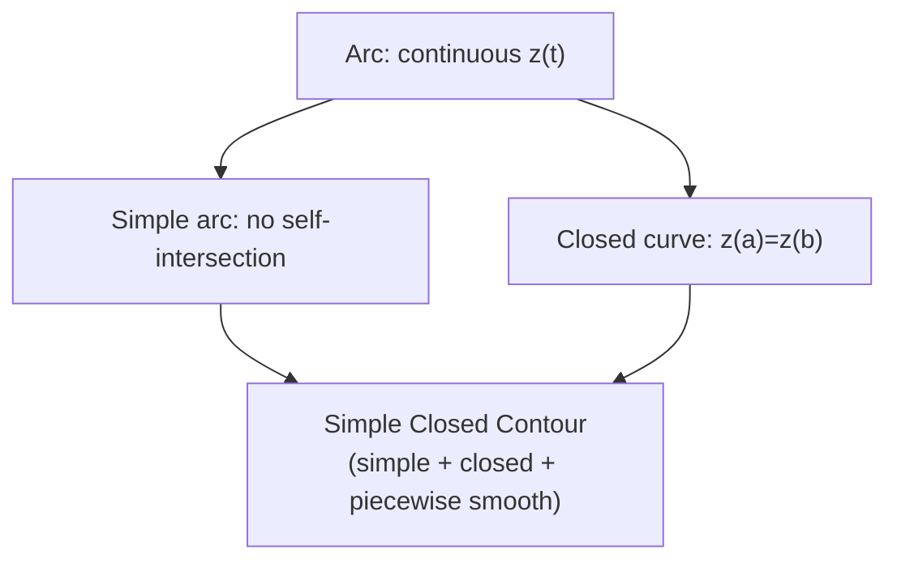

# 1. Overview

This topic classifies the types of curves used in complex integration — contours — building the vocabulary needed to correctly state the [Cauchy-Goursat theorem](17_cauchy_goursat_theorem.md) and the [residue theorem](21_cauchys_residue_theorem.md). It builds directly on the parameterized curves of [complex line integration](15_complex_line_integration.md).

---

# 2. Definitions & Key Terms

1. **Arc / Curve** — a continuous function z(t)=x(t)+iy(t), a≤t≤b.
   > Plain-English: a path traced out in the plane as t varies.

2. **Simple Arc** — an arc with no self-intersections, i.e. z(t₁)≠z(t₂) for t₁≠t₂ (except possibly endpoints).
   > Plain-English: a path that never crosses itself.

3. **Closed Curve** — z(a) = z(b).
   > Plain-English: a path that starts and ends at the same point.

4. **Simple Closed Contour** — a closed curve that is simple except for the coinciding endpoints (z(a)=z(b) but no other self-intersections), and is piecewise smooth.
   > Plain-English: a loop that doesn't cross itself anywhere, like a circle or a non-self-intersecting polygon.

5. **Piecewise Smooth Contour** — a curve built from finitely many smooth arcs joined end to end, each with a continuous nonzero derivative on its piece.
   > Plain-English: a path allowed to have a few sharp corners, but is smooth in between them.

6. **Positively Oriented Contour** — a simple closed contour traversed so the enclosed region stays on the left (i.e. counterclockwise, by the standard convention).
   > Plain-English: going around the loop the "standard" counterclockwise way.

---

# 3. Core Content

### A. Definition / Theorem

The classification hierarchy: arc ⊃ simple arc ⊃ closed curve ⊃ simple closed contour, with piecewise smoothness as an independent requirement layered on top for a curve to be a "contour" suitable for integration.

### B. Formula

There is no computational formula in this topic; it is definitional/classificatory. The key operational fact used later is:

```
∮_C f(z) dz  (the circle symbol ∮ denotes integration over a closed contour, by convention positively oriented unless stated otherwise)
```

### C. Derivation / Classification Reasoning

Rather than a proof, this topic requires correctly classifying a given curve:

1. Check if z(t) is continuous — if not, it isn't even an arc.
2. Check if z(a)=z(b) — determines open arc vs. closed curve.
3. Check for self-intersections at interior parameter values — determines simple vs. non-simple.
4. Check if z′(t) exists, is continuous, and nonzero except at finitely many "corner" parameter values — determines (piecewise) smooth vs. not.
5. If closed + simple + piecewise smooth, it qualifies as a simple closed contour, suitable for the Cauchy-Goursat and residue theorems.

### D. Geometric Interpretation

A simple closed contour divides the plane into exactly two regions: a bounded "interior" and an unbounded "exterior" (the Jordan curve theorem, taken as geometrically evident in this course rather than proved rigorously). Positive orientation keeps the bounded interior on the left as the contour is traced.

### E. Conditions

* Self-intersecting curves (figure-eights) are NOT simple closed contours and require special handling (often splitting into separate simple loops) before applying the standard theorems.
* Corners are allowed (piecewise smoothness), but z′(t) must fail to exist at only finitely many points.
* Orientation must always be specified or assumed by convention (counterclockwise = positive) — reversing it negates any subsequent contour integral (from topic 15).

### F. Example

The unit circle |z|=1, traversed counterclockwise via z(t)=e^(it), 0≤t≤2π, is a positively oriented simple closed (smooth) contour.

---

# 4. Worked Examples

### Example 1 — 🟢 Foundational

**Problem:** Classify the curve z(t) = t + it², −1≤t≤1 (an arc of a parabola).

**Solution**

Step 1: z(−1)=−1+i, z(1)=1+i — different, so not closed.

Step 2: z′(t)=1+2it, never zero, continuous — smooth.

Step 3: No self-intersections (x(t)=t is strictly increasing, so distinct t give distinct points).

**Answer:** A simple, smooth (open) arc.

### Example 2 — 🟡 Intermediate

**Problem:** Classify the boundary of the square with vertices 0, 1, 1+i, i, traversed in that order and back to 0.

**Solution**

Step 1: The path returns to its starting point (0), so it is closed.

Step 2: It has no self-intersections (each side is traversed once, no crossing).

Step 3: It has four corners where the derivative direction jumps discontinuously (but exists and is nonzero on each of the four smooth line segments in between).

**Answer:** A simple closed piecewise-smooth contour (positively oriented, since it goes counterclockwise 0→1→1+i→i→0).

### Example 3 — 🔴 Exam-Level

**Problem:** Determine whether the curve z(t) = cos(2t) + i sin(t), 0≤t≤2π (a figure-eight-like Lissajous curve) is a simple closed contour, and explain the implication for direct application of the Cauchy-Goursat / residue theorems.

**Solution**

Step 1: z(0) = cos0+isin0 = 1, z(2π) = cos4π+isin2π = 1. So the curve is closed.

Step 2: Check for self-intersection: at t=π/2, z=cosπ+isin(π/2) = −1+i. At t=3π/2, z=cos3π+isin(3π/2)=−1−i. But checking t and 2π−t for a general point often reveals a repeated point at some interior parameter (a hallmark of Lissajous-type curves with a 2:1 frequency ratio, which typically self-intersect at points where cos(2t₁)=cos(2t₂) and sin(t₁)=sin(t₂) for t₁≠t₂, e.g. t₁=π/6 and comparing against other roots shows the curve crosses itself, consistent with the general figure-eight shape such 2:1 Lissajous curves are known to trace).

**Answer:** Because the curve self-intersects, it is NOT a simple closed contour, so the Cauchy-Goursat theorem and residue theorem (which require a simple closed contour) cannot be applied directly to it as a single loop — it would need to be decomposed into simple closed sub-loops first, each treated separately.

---

# 5. Applications

* Correctly identifying whether a given boundary is a valid simple closed contour is a prerequisite check before applying any of the powerful integral theorems in the remainder of the unit.
* Contour choice (circles, rectangles, semicircles) is central to evaluating real improper integrals via residues (topic 22).

---

# 6. Diagram / Visual



Picture nested categories: every simple closed contour is both simple and closed, with the added requirement of piecewise smoothness.

---

# 7. Common Mistakes

- ❌ **Mistake:** Assuming any closed curve is automatically a "simple closed contour" suitable for Cauchy-Goursat / residue theorems.
  ✅ **Correct:** Self-intersecting closed curves (like figure-eights) must be excluded or decomposed first.

- ❌ **Mistake:** Ignoring orientation when stating a contour integral result.
  ✅ **Correct:** Always specify (or assume by stated convention) that the contour is positively (counterclockwise) oriented, since this sign convention is baked into the residue theorem and Cauchy's integral formula.

- ❌ **Mistake:** Treating a piecewise-smooth contour as if it must be smooth everywhere, with no corners allowed.
  ✅ **Correct:** Finitely many corners are permitted, as long as the curve is smooth on each piece between them.

---

# 8. Practice Problems

**P1 (Conceptual):** Why does the Jordan curve theorem (a simple closed curve divides the plane into an interior and exterior) matter for stating theorems like Cauchy-Goursat?

<details><summary>Solution</summary>
Those theorems refer explicitly to "the region enclosed by C" and require that region to be a well-defined, single bounded set — which is exactly what the Jordan curve theorem guarantees for a simple closed curve; without simplicity, "the interior" could be ambiguous or consist of multiple disconnected pieces.
</details>

**P2 (Computational):** Is the curve z(t) = 2e^(it), 0≤t≤4π, a simple closed contour?

<details><summary>Solution</summary>
No — although z(0)=z(4π)=2 (closed), the curve traces the same circle TWICE (once for 0≤t≤2π, again for 2π≤t≤4π), so it is not simple (every point is visited at least twice, e.g. z(0)=z(2π)=2).
</details>

**P3 (Computational):** Classify the boundary of an annulus (region between two concentric circles) as a single contour or multiple contours.

<details><summary>Solution</summary>
The boundary consists of TWO separate simple closed contours (the outer circle and the inner circle), typically oriented oppositely (outer counterclockwise, inner clockwise) so that, together, the enclosed annular region stays on the left of the combined boundary.
</details>

**P4 (Exam-style):** Explain, using the smoothness definition, why the boundary of a triangle qualifies as a "piecewise smooth" simple closed contour despite having corners.

<details><summary>Solution</summary>
Each of the three sides is a smooth line segment with a well-defined, continuous, nonzero derivative on its own interval; the derivative simply fails to exist AT the three corner points (finitely many), which is exactly what "piecewise smooth" allows.
</details>

**P5 (Exam-style):** Given a simple closed contour C traversed positively, state (without proof) which side of C the bounded interior lies on as you walk along it, and why this convention matters for later theorems.

<details><summary>Solution</summary>
The bounded interior lies on the LEFT as you traverse C positively (counterclockwise). This convention matters because the residue theorem and Cauchy's integral formula are stated assuming positive orientation; reversing orientation would flip the sign of ∮_C f(z)dz, and hence the sign of the theorem's right-hand side.
</details>

---

# 9. Summary

| Concept | Essential Result | Condition |
|---|---|---|
| Simple arc | no self-intersection | continuous z(t) |
| Closed curve | z(a)=z(b) | — |
| Simple closed contour | simple + closed + piecewise smooth | required for Cauchy-Goursat, residue theorem |
| Positive orientation | interior stays on the left | counterclockwise, by convention |

With contours precisely classified, the next topic states the Cauchy-Goursat theorem: when a contour integral of an analytic function must vanish.

---

# 10. References

1. James Ward Brown & Ruel V. Churchill — Complex Variables and Applications
2. Schaum's Outline of Complex Variables
3. John B. Conway — Functions of One Complex Variable
4. E. T. Copson — An Introduction to the Theory of Functions of a Complex Variable
