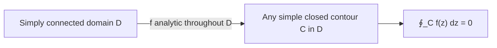

# 1. Overview

The Cauchy-Goursat theorem states that the contour integral of a function analytic throughout a simply connected region vanishes on any simple closed contour inside it. It combines [contours](16_contours.md) with [analytic function](10_analytic_function.md) and is the single most important stepping stone to [Cauchy's integral formula](18_cauchys_integral_formula.md).

---

# 2. Definitions & Key Terms

1. **Simply Connected Domain** — an open domain with no "holes" (every simple closed curve inside it can be continuously shrunk to a point without leaving the domain).
   > Plain-English: a region with no gaps, like a disk, as opposed to an annulus (which has a hole).

---

# 3. Core Content

### A. Definition / Theorem

**Cauchy-Goursat Theorem.** If f is analytic throughout a simply connected domain D, then for every simple closed contour C lying in D:

```
∮_C f(z) dz = 0
```

### B. Formula

```
∮_C f(z) dz = 0        (f analytic on and inside simple closed contour C, D simply connected)
```

### C. Derivation — Sketch via Green's Theorem (assuming continuous f′, the classical Cauchy version; Goursat later removed this extra assumption)

Write f = u+iv, and split the contour integral using the topic-15 formula:

```
∮_C f(z) dz = ∮_C (u dx − v dy) + i ∮_C (v dx + u dy)
```

Apply Green's theorem to each real line integral over the region R enclosed by C (valid since u, v have continuous partials, by assumption in this classical version):

```
∮_C (u dx − v dy) = ∬_R (−vₓ − u_y) dA
∮_C (v dx + u dy) = ∬_R (uₓ − v_y) dA
```

Because f is analytic, the Cauchy-Riemann equations hold throughout R: uₓ=v_y and u_y=−vₓ. Substitute:

```
−vₓ − u_y = −vₓ − (−vₓ) = 0
uₓ − v_y = uₓ − uₓ = 0
```

Both double integrals vanish identically, so ∮_C f(z) dz = 0 + i·0 = 0. (Goursat's refinement proves the same conclusion without assuming f′ is continuous, using a direct triangle-subdivision argument instead of Green's theorem — stated here as the stronger, standard form of the theorem, without full proof.)

### D. Geometric Interpretation

Because ∮_C f(z) dz = 0 for every simple closed contour in D, the integral of f between two points is path-independent within D (any two paths with the same endpoints form a closed loop when traversed there-and-back, forcing their integrals to agree) — this generalizes the real Fundamental Theorem of Calculus to complex analytic functions.

### E. Conditions

* f must be analytic on a **simply connected** domain containing both C and its interior; if D has a hole and f is not analytic there, the theorem does not apply directly (this motivates the later deformation-of-contour technique used with singularities, topic 19 onward).
* C must be a simple closed contour (per topic 16's classification).

### F. Example

∮_C z² dz = 0 for any simple closed contour C, since z² is entire.

---

# 4. Worked Examples

### Example 1 — 🟢 Foundational

**Problem:** Evaluate ∮_C e^z dz where C is the unit circle |z|=1.

**Solution**

Step 1: e^z is entire (analytic everywhere).

Step 2: By Cauchy-Goursat, since e^z is analytic on and inside C (any simply connected domain containing the closed disk works, e.g. all of ℂ), the integral vanishes.

**Answer:** ∮_C e^z dz = 0.

### Example 2 — 🟡 Intermediate

**Problem:** Explain why ∮_C dz/z ≠ 0 for C the unit circle (computed as 2πi in topic 15), even though this appears to contradict Cauchy-Goursat.

**Solution**

Step 1: f(z)=1/z is analytic everywhere EXCEPT at z=0.

Step 2: The point z=0 lies inside C (the unit circle), so f is not analytic throughout any simply connected domain containing both C and its interior — the hypothesis of Cauchy-Goursat fails.

**Answer:** No contradiction: Cauchy-Goursat simply does not apply here, because 1/z fails to be analytic at the interior point z=0 — this is exactly the situation the residue theorem (topic 21) is built to handle.

### Example 3 — 🔴 Exam-Level

**Problem:** Use Cauchy-Goursat to show that ∫_C₁ f(z) dz = ∫_C₂ f(z) dz for any two paths C₁, C₂ from a to b lying in a simply connected domain D where f is analytic.

**Solution**

Step 1: Form the closed contour C = C₁ followed by −C₂ (C₂ reversed), going from a to b along C₁, then back from b to a along the reverse of C₂.

Step 2: C is a closed contour lying in D, and f is analytic throughout D, so by Cauchy-Goursat, ∮_C f(z) dz = 0.

Step 3: ∮_C f(z) dz = ∫_C₁ f(z) dz + ∫_{−C₂} f(z) dz = ∫_C₁ f(z) dz − ∫_C₂ f(z) dz (using the orientation-reversal property from topic 15).

**Answer:** Setting this equal to 0 gives ∫_C₁ f(z) dz = ∫_C₂ f(z) dz — path-independence for analytic functions on simply connected domains, directly implied by Cauchy-Goursat.

---

# 5. Applications

* Justifies deforming a contour into a more convenient shape (e.g. a circle) when evaluating integrals, as long as no singularities are crossed — the core technique used in topics 18–22.
* Underlies the existence of antiderivatives for analytic functions on simply connected domains.

---

# 6. Diagram / Visual



Picture a simple closed loop entirely inside a "hole-free" region where f is analytic everywhere — the total signed integral around that loop is exactly zero.

---

# 7. Common Mistakes

- ❌ **Mistake:** Applying Cauchy-Goursat to a contour enclosing a point where f is not analytic.
  ✅ **Correct:** Verify f is analytic at every point on AND inside C before concluding the integral is zero; singularities inside C invalidate the direct application.

- ❌ **Mistake:** Forgetting the "simply connected" requirement and applying the theorem on a domain with a hole.
  ✅ **Correct:** If D is multiply connected (has holes) where f fails to be analytic, the theorem does not directly apply without further contour-deformation arguments.

- ❌ **Mistake:** Concluding f itself is zero because ∮_C f(z)dz = 0.
  ✅ **Correct:** The theorem is about the specific contour integral being zero, not about f being the zero function — many nonzero analytic functions satisfy ∮_C f dz = 0 for every valid C.

---

# 8. Practice Problems

**P1 (Conceptual):** Why does path-independence for analytic f (Example 3) generalize the Fundamental Theorem of Calculus?

<details><summary>Solution</summary>
In real calculus, ∫ₐᵇ f′(x)dx = f(b)−f(a) depends only on the endpoints; Cauchy-Goursat shows the analogous complex statement — the integral of an analytic function between two points is independent of the path chosen — recovering the same "depends only on endpoints" structure in the complex setting.
</details>

**P2 (Computational):** Evaluate ∮_C sin z dz where C is any simple closed contour.

<details><summary>Solution</summary>
sin z is entire, so by Cauchy-Goursat the integral is 0 for any simple closed contour.
</details>

**P3 (Computational):** Evaluate ∮_C z³ dz where C is the boundary of the square with vertices ±1±i.

<details><summary>Solution</summary>
z³ is entire (polynomial), so by Cauchy-Goursat, ∮_C z³ dz = 0.
</details>

**P4 (Exam-style):** Determine whether Cauchy-Goursat directly applies to ∮_C 1/(z−2) dz where C is the circle |z|=1, and justify.

<details><summary>Solution</summary>
1/(z−2) is analytic everywhere except z=2. Since |2|=2>1, z=2 lies OUTSIDE C, so f is analytic on and inside C (which excludes the singular point). Cauchy-Goursat applies directly, giving ∮_C 1/(z−2) dz = 0.
</details>

**P5 (Exam-style):** Two contours C₁ (unit circle) and C₂ (circle of radius 2, both centered at origin, counterclockwise) both enclose the singularity of f(z)=1/z at 0. Explain, using a "keyhole" contour argument built from Cauchy-Goursat, why ∮_{C₂} f dz = ∮_{C₁} f dz even though C₁≠C₂ (a preview of the deformation-of-contour idea used with residues).

<details><summary>Solution</summary>
Construct a contour that goes around C₂ counterclockwise, in along a connecting segment, around C₁ clockwise, and back out along the segment — this composite closed contour encloses an annular region where f=1/z IS analytic (it avoids the excluded point 0). By Cauchy-Goursat, the integral over this composite contour is 0. The two straight connecting segments are traversed in opposite directions and cancel, leaving ∮_{C₂}f dz − ∮_{C₁}f dz = 0 (accounting for the clockwise traversal of C₁ contributing a minus sign), i.e. ∮_{C₂}f dz = ∮_{C₁}f dz.
</details>

---

# 9. Summary

| Concept | Essential Result | Condition |
|---|---|---|
| Cauchy-Goursat | ∮_C f(z)dz = 0 | f analytic on simply connected D ⊇ C and its interior |
| Path-independence | ∫_C₁f = ∫_C₂f for same endpoints | f analytic on simply connected domain containing both paths |
| Contour deformation | integral unchanged when contour is deformed across a region of analyticity | no singularities crossed |

Cauchy-Goursat is the launchpad for Cauchy's integral formula, which expresses f(a) itself as a contour integral — covered next.

---

# 10. References

1. James Ward Brown & Ruel V. Churchill — Complex Variables and Applications
2. Schaum's Outline of Complex Variables
3. John B. Conway — Functions of One Complex Variable
4. E. T. Copson — An Introduction to the Theory of Functions of a Complex Variable
