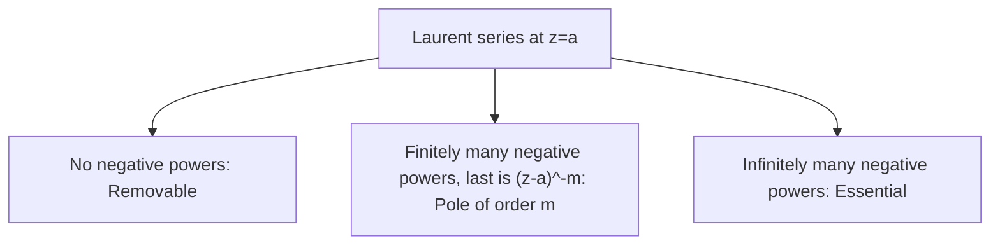

# 1. Overview

This topic classifies the isolated points where a function fails to be analytic, using the Laurent series expansion around such a point. It builds on [Cauchy's integral formula](18_cauchys_integral_formula.md) (whose denominator structure hints at these classifications) and is the essential prerequisite for defining the [residue](20_residue.md) in the next topic.

---

# 2. Definitions & Key Terms

1. **Isolated Singular Point** — z=a where f is not analytic, but f IS analytic at every other point in some punctured neighborhood 0<|z−a|<ε.
   > Plain-English: a single "bad" point, with f well-behaved immediately around it (except exactly there).

2. **Removable Singularity** — an isolated singularity where lim(z→a) f(z) exists (finitely); redefining f(a) to equal this limit makes f analytic at a.
   > Plain-English: a "fake" singularity that disappears once you fill in the right value.

3. **Pole of Order m** — an isolated singularity where the Laurent series has finitely many negative-power terms, with the lowest being (z−a)⁻ᵐ (coefficient nonzero).
   > Plain-English: f blows up like 1/(z−a)ᵐ near a.

4. **Essential Singularity** — an isolated singularity where the Laurent series has infinitely many negative-power terms.
   > Plain-English: f behaves wildly near a, with no finite-order blow-up pattern.

---

# 3. Core Content

### A. Definition / Theorem

**Laurent's theorem** (stated without full proof): if f is analytic in the punctured disk 0<|z−a|<R, then f has a unique expansion

```
f(z) = Σ(n=−∞ to ∞) cₙ(z−a)ⁿ = Σ(n=0 to ∞) cₙ(z−a)ⁿ + Σ(n=1 to ∞) c₋ₙ(z−a)⁻ⁿ
```

The classification of the singularity at a depends entirely on the negative-power ("principal") part Σc₋ₙ(z−a)⁻ⁿ:

* All c₋ₙ = 0 ⟹ removable singularity.
* Finitely many nonzero c₋ₙ, with c₋ₘ ≠ 0 the last nonzero one ⟹ pole of order m.
* Infinitely many nonzero c₋ₙ ⟹ essential singularity.

### B. Formula

```
f(z) = Σₙ cₙ(z−a)ⁿ,   n from −∞ to ∞     (Laurent series)

Pole of order m:  f(z) = c₋ₘ/(z−a)ᵐ + … + c₋₁/(z−a) + c₀ + c₁(z−a) + …,  c₋ₘ≠0
```

### C. Derivation / Classification Method

Given a candidate singularity at z=a, the practical method (without deriving the full Laurent series from scratch each time) is:

1. Try lim(z→a) f(z). If finite, it's removable.
2. If f(z) = g(z)/(z−a)ᵐ with g analytic at a and g(a)≠0, then f has a pole of order exactly m at a (this reads the order directly off the factored form, matching the Laurent-series definition since g(z) itself has a convergent Taylor series g(z)=g(a)+g′(a)(z−a)+… near a, so dividing by (z−a)ᵐ produces exactly m negative-power terms with leading coefficient c₋ₘ=g(a)≠0).
3. If neither of the above (limit doesn't exist finitely, and f can't be written in the form of step 2 for any finite m), and the singularity is isolated, it is essential — e.g. e^(1/z) at z=0, whose Laurent series Σ 1/(n!zⁿ) has infinitely many negative-power terms.

### D. Geometric Interpretation

Near a removable singularity, f behaves smoothly (the "gap" is cosmetic). Near a pole of order m, |f(z)| → ∞ as z→a, growing comparably to 1/|z−a|ᵐ. Near an essential singularity, f(z) takes values arbitrarily close to every complex number (except possibly one) in any punctured neighborhood of a, however small (the Casorati-Weierstrass phenomenon) — dramatically wilder behavior than a pole.

### E. Conditions

* The singularity must be **isolated** for this classification scheme to apply; non-isolated singular points (limit points of other singularities) require separate treatment, not covered by this classification.
* The order m of a pole is a well-defined nonnegative integer once identified via the g(z)/(z−a)ᵐ factored form (with g(a)≠0).

### F. Example

f(z)=sinz/z has a removable singularity at z=0 (limit is 1); f(z)=1/z³ has a pole of order 3 at z=0; f(z)=e^(1/z) has an essential singularity at z=0.

---

# 4. Worked Examples

### Example 1 — 🟢 Foundational

**Problem:** Classify the singularity of f(z) = (sin z)/z at z=0.

**Solution**

Step 1: Use the Taylor series sinz = z − z³/3! + z⁵/5! − …, so f(z) = 1 − z²/3! + z⁴/5! − … for z≠0.

Step 2: This series has no negative powers of z at all — it extends to a convergent power series (in fact equal to 1 at z=0).

**Answer:** Removable singularity; lim(z→0) f(z) = 1, and redefining f(0)=1 makes f entire.

### Example 2 — 🟡 Intermediate

**Problem:** Classify the singularity of f(z) = 1/[(z−2)³(z+1)] at z=2.

**Solution**

Step 1: Write f(z) = g(z)/(z−2)³ where g(z) = 1/(z+1), analytic at z=2 (since 2≠−1) and g(2)=1/3≠0.

**Answer:** Pole of order 3 at z=2 (and, separately, a simple pole — order 1 — at z=−1, by the same reasoning applied there).

### Example 3 — 🔴 Exam-Level

**Problem:** Classify the singularity of f(z) = e^(1/z) at z=0, using its Laurent series.

**Solution**

Step 1: Substitute w=1/z into the entire series e^w = Σ(n=0 to ∞) wⁿ/n!: e^(1/z) = Σ(n=0 to ∞) 1/(n! zⁿ) = 1 + 1/z + 1/(2!z²) + 1/(3!z³) + ….

Step 2: This has infinitely many nonzero negative-power terms (1/z, 1/z², 1/z³, … all appear with nonzero coefficients 1/n!).

**Answer:** Essential singularity at z=0 — it cannot be written as g(z)/zᵐ for any finite m with g analytic and g(0)≠0, since the negative-power terms never terminate.

---

# 5. Applications

* Classifying poles is the essential preliminary step before computing residues (topic 20) and applying the residue theorem (topic 21).
* Removable singularities are routinely "removed" (by redefining the function at that single point) in engineering transfer-function analysis to work with a well-behaved, analytic model.

---

# 6. Diagram / Visual



Picture the "principal part" (negative-power terms) of the Laurent series as the sole determinant of the singularity's type: none, finitely many, or infinitely many nonzero terms.

---

# 7. Common Mistakes

- ❌ **Mistake:** Assuming any point where a formula is undefined (like division by zero) is automatically a pole.
  ✅ **Correct:** Always check the limit / Laurent expansion first — the singularity might be removable (e.g. sinz/z at 0), not a pole.

- ❌ **Mistake:** Misreading the order of a pole directly from the exponent in an unfactored denominator without confirming the numerator is nonzero there.
  ✅ **Correct:** Write f(z)=g(z)/(z−a)ᵐ with g analytic AND g(a)≠0 before reading off the order m; if g(a)=0 too, the actual order is lower (some cancellation reduces it).

- ❌ **Mistake:** Treating essential singularities as "just very high order poles."
  ✅ **Correct:** Essential singularities are qualitatively different (infinitely many negative-power terms, wildly different local behavior per Casorati-Weierstrass) — not simply a pole of very large finite order.

---

# 8. Practice Problems

**P1 (Conceptual):** Why does g(a)≠0 matter when reading the pole order off f(z)=g(z)/(z−a)ᵐ?

<details><summary>Solution</summary>
If g(a)=0, then g itself contributes an extra factor of (z−a) (or more), effectively reducing the true order of the pole below m — the stated method for reading off the order explicitly requires g(a)≠0 to be valid.
</details>

**P2 (Computational):** Classify the singularity of f(z) = (z−1)/(z²−1) at z=1.

<details><summary>Solution</summary>
z²−1=(z−1)(z+1), so f(z) = (z−1)/[(z−1)(z+1)] = 1/(z+1) for z≠1. The limit as z→1 is 1/2, finite — removable singularity.
</details>

**P3 (Computational):** Classify the singularity of f(z) = cosz/z⁴ at z=0.

<details><summary>Solution</summary>
g(z)=cosz is analytic at 0 with g(0)=1≠0. f(z)=g(z)/z⁴, so this is a pole of order 4 at z=0.
</details>

**P4 (Exam-style):** Determine the order of the pole of f(z) = 1/(1−cosz) at z=0 (hint: use the Taylor series of cos z).

<details><summary>Solution</summary>
1−cosz = z²/2! − z⁴/4! + … = (z²/2)[1 − z²/12 + …], so 1−cosz = z²·h(z) where h(z)=1/2 − z²/24+… is analytic at 0 with h(0)=1/2≠0. Thus f(z) = 1/(z²h(z)) = [1/h(z)]/z², and 1/h(z) is analytic near 0 (since h(0)≠0) with value 2 at z=0 — a pole of order 2.
</details>

**P5 (Exam-style):** Classify the singularity of f(z) = sin(1/z) at z=0.

<details><summary>Solution</summary>
Substitute w=1/z into sinw = w − w³/3! + w⁵/5! − …: sin(1/z) = 1/z − 1/(3!z³) + 1/(5!z⁵) − …, an infinite series of negative powers of z — essential singularity at z=0.
</details>

---

# 9. Summary

| Concept | Essential Result | Condition |
|---|---|---|
| Removable singularity | lim(z→a)f(z) exists finitely | Laurent series has no negative powers |
| Pole of order m | f(z)=g(z)/(z−a)ᵐ, g analytic, g(a)≠0 | finitely many negative-power terms |
| Essential singularity | infinitely many negative-power Laurent terms | e.g. e^(1/z), sin(1/z) at 0 |

With singularities classified, the next topic defines the residue — the specific Laurent coefficient that captures a pole's contribution to a contour integral.

---

# 10. References

1. James Ward Brown & Ruel V. Churchill — Complex Variables and Applications
2. Schaum's Outline of Complex Variables
3. John B. Conway — Functions of One Complex Variable
4. E. T. Copson — An Introduction to the Theory of Functions of a Complex Variable
