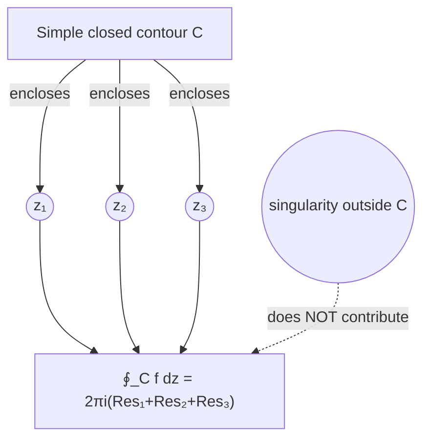

# 1. Overview

Cauchy's residue theorem generalizes the single-singularity relation from [residue](20_residue.md) to a simple closed contour enclosing several isolated singularities at once, summing their individual residues. It is the capstone integration theorem, combining [contours](16_contours.md), [Cauchy-Goursat](17_cauchy_goursat_theorem.md), and residues, and is the direct tool used in [applications to improper integrals](22_application_of_residue_theorem_to_improper_integrals.md).

---

# 2. Definitions & Key Terms

1. **Residue Theorem** — for f analytic on and inside a simple closed contour C except at finitely many isolated singularities z₁,…,z_k inside C, ∮_C f(z)dz = 2πi Σₖ Res(f, zₖ).
   > Plain-English: total circulation around the boundary equals 2πi times the sum of all the "leaks" (residues) at the singularities trapped inside.

---

# 3. Core Content

### A. Definition / Theorem

**Cauchy's Residue Theorem.** Let f be analytic on and inside a positively oriented simple closed contour C, except for finitely many isolated singularities z₁, …, z_n lying inside C. Then:

```
∮_C f(z) dz = 2πi Σⱼ₌₁ⁿ Res(f, zⱼ)
```

### B. Formula

```
∮_C f(z) dz = 2πi Σⱼ Res(f, zⱼ)      (sum over singularities zⱼ INSIDE C only)
```

### C. Derivation / Proof — via Multiple Small Circles

**Step 1 — Isolate each singularity with a small circle.** Around each zⱼ, draw a small positively oriented circle Cⱼ, radius small enough that the circles are disjoint and all lie inside C.

**Step 2 — Build a composite contour.** Form a new contour Γ = C (traversed positively) with each small circle Cⱼ traversed negatively, connected by thin "slits" from C to each Cⱼ. Because the slits are traversed once in each direction, their contributions cancel exactly.

**Step 3 — Apply Cauchy-Goursat to Γ.** The region enclosed by Γ excludes all the singularities (each is walled off by its own negatively oriented circle), so f is analytic throughout the region enclosed by Γ. By Cauchy-Goursat (topic 17):

```
∮_Γ f(z) dz = 0
```

**Step 4 — Expand Γ's integral.** ∮_Γ f dz = ∮_C f dz − Σⱼ ∮_{Cⱼ} f dz (the minus sign because each Cⱼ is traversed negatively within Γ; the slit contributions cancel and drop out). Setting this equal to 0:

```
∮_C f(z) dz = Σⱼ ∮_{Cⱼ} f(z) dz
```

**Step 5 — Apply the small-circle result from topic 20.** Each ∮_{Cⱼ} f(z)dz = 2πi·Res(f, zⱼ) (positively oriented small circle around an isolated singularity, from topic 20 part C). Substituting:

```
∮_C f(z) dz = Σⱼ 2πi·Res(f,zⱼ) = 2πi Σⱼ Res(f,zⱼ)
```

### D. Geometric Interpretation

The theorem shows that only the singularities strictly INSIDE C matter for the value of ∮_C f dz — the specific shape of C is otherwise irrelevant (a contour-deformation consequence of Cauchy-Goursat), and singularities OUTSIDE C contribute nothing at all.

### E. Conditions

* Only singularities strictly inside C are summed; singularities outside C, or exactly on C, are excluded (points on C typically make the integral itself undefined/improper and must be handled separately, e.g. via principal-value techniques).
* f must have only ISOLATED singularities inside C (no essential accumulation of singular points, no non-isolated singular sets) — finitely many singularities inside a bounded region is the standing assumption.

### F. Example

∮_C dz/z² where C is |z|=1 (z=0 a pole of order 2, residue 0 by direct computation): the integral is 2πi·0 = 0.

---

# 4. Worked Examples

### Example 1 — 🟢 Foundational

**Problem:** Evaluate ∮_C dz/(z²+1) where C is |z|=2 (counterclockwise).

**Solution**

Step 1: z²+1=(z−i)(z+i); both singularities z=i, z=−i are inside |z|=2.

Step 2: Res(f,i) = lim(z→i)(z−i)/[(z−i)(z+i)] = 1/(2i). Res(f,−i) = lim(z→−i)(z+i)/[(z−i)(z+i)] = 1/(−2i).

Step 3: Sum of residues: 1/(2i) − 1/(2i) = 0.

**Answer:** ∮_C dz/(z²+1) = 2πi·0 = 0.

### Example 2 — 🟡 Intermediate

**Problem:** Evaluate ∮_C [z/(z−1)(z−3)] dz where C is |z|=2 (only z=1 is inside; z=3 is outside since |3|=3>2).

**Solution**

Step 1: Only z=1 lies inside C.

Step 2: Res(f,1) = lim(z→1)(z−1)·z/[(z−1)(z−3)] = 1/(1−3) = −1/2.

**Answer:** ∮_C f(z) dz = 2πi·(−1/2) = −πi.

### Example 3 — 🔴 Exam-Level

**Problem:** Evaluate ∮_C e^z/[z(z−1)²] dz where C is |z|=3 (both z=0, simple pole, and z=1, pole of order 2, lie inside C).

**Solution**

Step 1: Res(f,0) = lim(z→0) z·e^z/[z(z−1)²] = lim(z→0) e^z/(z−1)² = e⁰/(−1)² = 1.

Step 2: For z=1 (order 2), write g(z)=e^z/z, so f(z)=g(z)/(z−1)². Res(f,1) = lim(z→1) g′(z). By the quotient rule, g′(z) = [e^z·z − e^z·1]/z² = e^z(z−1)/z².

Step 3: g′(1) = e¹(0)/1 = 0.

Step 4: Sum of residues: 1 + 0 = 1.

**Answer:** ∮_C f(z) dz = 2πi·1 = 2πi.

---

# 5. Applications

* The single most powerful tool for evaluating contour integrals with multiple singularities, replacing tedious direct parameterization.
* Directly enables the evaluation of real improper integrals (topic 22), the final application of the unit.

---

# 6. Diagram / Visual



Only the singularities strictly enclosed by C contribute to the total; anything outside C is irrelevant to this integral.

---

# 7. Common Mistakes

- ❌ **Mistake:** Including poles outside the contour in the residue sum.
  ✅ **Correct:** Only singularities enclosed by the contour contribute.

- ❌ **Mistake:** Forgetting the factor of 2πi in the final answer.
  ✅ **Correct:** The theorem states ∮_C f dz = 2πi Σ Res, not just Σ Res.

- ❌ **Mistake:** Applying the theorem when C is not positively oriented, without adjusting sign.
  ✅ **Correct:** For a negatively (clockwise) oriented contour, ∮_C f dz = −2πi Σ Res(f, zⱼ) — the standard formula assumes positive (counterclockwise) orientation.

---

# 8. Practice Problems

**P1 (Conceptual):** Explain, using the derivation in part C, why singularities strictly outside C contribute nothing to ∮_C f dz.

<details><summary>Solution</summary>
Points outside C never get "walled off" by a small circle in the construction, because the derivation only isolates singularities that lie inside C; a singularity outside C means f is already analytic throughout the region enclosed by C at that location, so it plays no role in the Cauchy-Goursat argument applied to Γ.
</details>

**P2 (Computational):** Evaluate ∮_C dz/[z(z−2)] where C is |z|=1 (only z=0 inside; z=2 outside).

<details><summary>Solution</summary>
Res(f,0) = lim(z→0)z·1/[z(z−2)] = 1/(0−2) = −1/2. ∮_C f dz = 2πi(−1/2) = −πi.
</details>

**P3 (Computational):** Evaluate ∮_C tan z dz where C is |z|=1 (tan z = sinz/cosz has a simple pole where cosz=0, none of which lie inside |z|=1 since the nearest is z=π/2≈1.57>1).

<details><summary>Solution</summary>
No singularities of tanz lie inside |z|=1 (tanz is analytic throughout the open disk), so by Cauchy-Goursat directly, ∮_C tanz dz = 0 (equivalently, the residue sum is empty, giving 2πi·0=0).
</details>

**P4 (Exam-style):** Evaluate ∮_C dz/(z²(z−1)) where C is |z|=2 (both z=0, pole of order 2, and z=1, simple pole, lie inside).

<details><summary>Solution</summary>
Res(f,1) = lim(z→1)(z−1)/[z²(z−1)] = 1/1² = 1. For z=0 (order 2), g(z)=1/(z−1), Res(f,0)=lim(z→0)g′(z). g′(z)=−1/(z−1)², g′(0)=−1/1=−1. Sum: 1+(−1)=0. ∮_C f dz = 2πi·0 = 0.
</details>

**P5 (Exam-style):** Evaluate ∮_C dz/sin z where C is |z|=4 (sinz has simple zeros at z=0, ±π, and |π|≈3.14<4, so z=0, π, −π all lie inside |z|=4; residue of 1/sinz at a simple zero z=nπ of sinz is 1/cos(nπ)=(−1)ⁿ² wait — use Res=1/f′(zero) formula).

<details><summary>Solution</summary>
For f(z)=1/sinz with a simple zero of sinz at z=nπ, Res(f,nπ) = 1/cos(nπ) = 1/(−1)ⁿ = (−1)ⁿ (since cos(nπ)=(−1)ⁿ). At z=0 (n=0): Res=1/cos0=1. At z=π (n=1): Res=1/cos π=1/(−1)=−1. At z=−π (n=−1): Res=1/cos(−π)=1/(−1)=−1. Sum: 1−1−1=−1. ∮_C f dz = 2πi(−1) = −2πi.
</details>

---

# 9. Summary

| Concept | Essential Result | Condition |
|---|---|---|
| Residue theorem | ∮_C f dz = 2πi Σⱼ Res(f,zⱼ) | f analytic on/inside C except finitely many isolated singularities inside C |
| Excluded contributions | singularities outside C contribute nothing | — |
| Orientation | positive (counterclockwise) C gives +2πiΣRes | reverse orientation flips the sign |

The residue theorem's final, and most celebrated, application is evaluating real improper integrals that are difficult or impossible by elementary real-variable methods — covered next.

---

# 10. References

1. James Ward Brown & Ruel V. Churchill — Complex Variables and Applications
2. Schaum's Outline of Complex Variables
3. John B. Conway — Functions of One Complex Variable
4. E. T. Copson — An Introduction to the Theory of Functions of a Complex Variable
