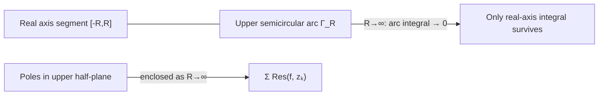

# 1. Overview

This capstone topic uses [Cauchy's residue theorem](21_cauchys_residue_theorem.md) to evaluate real improper integrals — especially ∫₋∞^∞ P(x)/Q(x) dx — that are difficult or impossible with elementary real calculus. It closes the unit by combining every prior tool: [contours](16_contours.md), [singularities/poles](19_singular_point_and_pole.md), and [residues](20_residue.md).

---

# 2. Definitions & Key Terms

1. **Semicircular Contour** — a contour consisting of a segment [−R,R] on the real axis together with the upper (or lower) semicircle of radius R, used to evaluate real integrals via residues.
   > Plain-English: a "D-shaped" closed loop used to trap the real-axis integral together with an easily-bounded arc.

---

# 3. Core Content

### A. Definition / Theorem

For a rational function f(z)=P(z)/Q(z) with deg Q ≥ deg P + 2 and no real poles, the real improper integral equals 2πi times the sum of residues in the upper half-plane:

```
∫₋∞^∞ P(x)/Q(x) dx = 2πi Σ [residues of P(z)/Q(z) in the upper half-plane]
```

### B. Formula

```
∫₋∞^∞ P(x)/Q(x) dx = 2πi Σ Res(f, zₖ)     (sum over poles zₖ with Im(zₖ)>0)
```

provided deg Q ≥ deg P + 2 (ensures the semicircular arc's contribution vanishes as R→∞).

### C. Derivation / Proof — the Standard 8-Step Procedure

**1. State the real integral:** I = ∫₋∞^∞ P(x)/Q(x) dx.

**2. Construct the complex function:** f(z) = P(z)/Q(z), the natural extension of the real integrand.

**3. Choose the contour:** C_R = [segment from −R to R] ∪ [upper semicircle Γ_R of radius R], for R large enough to enclose all poles of f in the upper half-plane, traversed counterclockwise.

**4. Identify poles:** find all zeros of Q(z), and select only those with Im(z) > 0 (inside C_R for large R).

**5. Calculate residues:** compute Res(f, zₖ) at each such pole, using the methods of topic 20.

**6. Apply the residue theorem:**

```
∮_{C_R} f(z) dz = ∫_{−R}^{R} f(x) dx + ∫_{Γ_R} f(z) dz = 2πi Σ Res(f, zₖ)
```

**7. Take the required limit:** as R→∞, show ∫_{Γ_R} f(z) dz → 0. This uses the ML-inequality: |∫_{Γ_R} f dz| ≤ (max|f| on Γ_R)·(length of Γ_R) = (max|f|)·πR. Since deg Q ≥ deg P + 2, |f(z)| = O(1/R²) on Γ_R (for |z|=R large), so the bound is O(1/R²)·πR = O(1/R) → 0.

**8. State the final real integral:** as R→∞, ∫_{−R}^R f(x)dx → ∫₋∞^∞ f(x)dx = I (by definition of the improper integral), and the arc vanishes, so:

```
I = 2πi Σ Res(f, zₖ)   (upper-half-plane poles only)
```

### D. Geometric Interpretation

The semicircular arc is chosen specifically because it grows to "swallow" every upper-half-plane pole as R→∞, while its own contribution shrinks to zero — a deliberate balance made possible by the degree condition on P and Q. Trigonometric-integral variants use Jordan's lemma (a refinement of the ML bound accounting for oscillatory e^(iaz) factors) instead of the plain ML bound, allowing weaker degree conditions when an oscillatory factor is present.

### E. Conditions

* Requires deg Q ≥ deg P + 2 for the plain ML-bound argument to force the arc integral to vanish (for integrands with an e^(iax) factor, a≠0, Jordan's lemma instead only requires deg Q ≥ deg P + 1).
* f must have no poles on the real axis itself (or a modified principal-value / indented-contour technique is needed, not covered by the basic procedure here).
* Only upper-half-plane poles are summed (the choice of upper semicircle is a convention; a lower semicircle, traversed clockwise, would instead need the lower-half-plane poles with an overall sign flip).

### F. Example

∫₋∞^∞ dx/(x²+1) = π (worked in full in Example 1 below).

---

# 4. Worked Examples

### Example 1 — 🟢 Foundational

**Problem:** Evaluate ∫₋∞^∞ dx/(x²+1) using contour integration.

**Solution**

Step 1: f(z)=1/(z²+1)=1/[(z−i)(z+i)]; deg Q=2, deg P=0, so deg Q ≥ deg P+2 ✓.

Step 2: Upper-half-plane pole: z=i (simple pole; z=−i is in the lower half-plane, excluded).

Step 3: Res(f,i) = lim(z→i)(z−i)·1/[(z−i)(z+i)] = 1/(2i).

Step 4: By the arc-vanishing argument, ∫₋∞^∞ f(x)dx = 2πi·Res(f,i) = 2πi·1/(2i) = π.

**Answer:** ∫₋∞^∞ dx/(x²+1) = π.

### Example 2 — 🟡 Intermediate

**Problem:** Evaluate ∫₋∞^∞ dx/(x²+4)² using contour integration.

**Solution**

Step 1: f(z)=1/(z²+4)²=1/[(z−2i)²(z+2i)²]; deg Q=4, deg P=0, condition satisfied.

Step 2: Upper-half-plane pole: z=2i, order 2 (z=−2i is in the lower half-plane).

Step 3: Write g(z)=1/(z+2i)², so f(z)=g(z)/(z−2i)². Res(f,2i) = lim(z→2i) g′(z). g′(z)=−2/(z+2i)³. At z=2i: (2i+2i)=4i, (4i)³=64i³=−64i. g′(2i)=−2/(−64i)=1/(32i)=−i/32.

Step 4: ∫₋∞^∞ f(x)dx = 2πi·(−i/32) = 2π/32 = π/16.

**Answer:** ∫₋∞^∞ dx/(x²+4)² = π/16.

### Example 3 — 🔴 Exam-Level

**Problem:** Evaluate ∫₋∞^∞ cos x /(x²+1) dx using contour integration with the complex exponential e^(iz) and Jordan's lemma.

**Solution**

Step 1: Consider f(z) = e^(iz)/(z²+1), whose real part on the real axis matches the real integrand cos x/(x²+1) (since e^(ix)=cosx+isinx and the odd sinx/(x²+1) part integrates to 0 over the symmetric interval by oddness).

Step 2: Upper-half-plane pole: z=i (simple). Note deg Q=2 ≥ deg P+1=1, satisfying the weaker Jordan's-lemma condition (needed because of the oscillatory e^(iz) factor).

Step 3: Res(f,i) = lim(z→i)(z−i)·e^(iz)/[(z−i)(z+i)] = e^(i·i)/(2i) = e^(−1)/(2i).

Step 4: By Jordan's lemma, the semicircular arc contribution vanishes as R→∞ (the e^(iz) factor decays exponentially for z in the upper half-plane, reinforcing the usual ML bound). So ∫₋∞^∞ e^(ix)/(x²+1) dx = 2πi·e⁻¹/(2i) = πe⁻¹ = π/e.

Step 5: Taking the real part (since the original real integral is the real part of this complex result, and the imaginary/sine part vanishes by symmetry): ∫₋∞^∞ cosx/(x²+1) dx = π/e.

**Answer:** ∫₋∞^∞ cosx/(x²+1) dx = π/e.

---

# 5. Applications

* Directly evaluates integrals central to Fourier transform theory, signal processing (frequency-response integrals), and probability (characteristic functions of certain distributions).
* Standard technique in physics for evaluating dispersion relations and Green's-function integrals.

---

# 6. Diagram / Visual



The closed semicircular contour traps every upper-half-plane pole as R grows, while the arc's own contribution is engineered (via the degree condition or Jordan's lemma) to vanish in the limit.

---

# 7. Common Mistakes

- ❌ **Mistake:** Including lower-half-plane poles in the residue sum when using the upper semicircle.
  ✅ **Correct:** Only sum residues at poles with Im(z) > 0 when C_R is the upper semicircular contour.

- ❌ **Mistake:** Applying the plain ML-bound (requiring deg Q ≥ deg P+2) to integrands with an oscillatory e^(iaz) factor without invoking Jordan's lemma.
  ✅ **Correct:** For integrands like e^(iax)/(polynomial), use Jordan's lemma, which permits the weaker deg Q ≥ deg P+1 condition, exploiting the exponential decay of e^(iaz) in the upper half-plane.

- ❌ **Mistake:** Forgetting to check for real-axis poles before applying the standard (unindented) semicircular-contour procedure.
  ✅ **Correct:** Real poles require a modified contour (small indentation) and principal-value interpretation, not covered by the basic procedure — always check Q(x)=0 has no real roots first.

---

# 8. Practice Problems

**P1 (Conceptual):** Why does the choice of the UPPER semicircle (rather than lower) determine which poles get summed?

<details><summary>Solution</summary>
The residue theorem only counts singularities strictly enclosed by the chosen contour; the upper semicircle, as R→∞, encloses exactly the poles with positive imaginary part, so only those contribute — poles with negative imaginary part remain outside this particular contour and are never enclosed.
</details>

**P2 (Computational):** Evaluate ∫₋∞^∞ dx/(x²+9).

<details><summary>Solution</summary>
Pole in upper half-plane: z=3i (simple). Res = lim(z→3i)(z−3i)/[(z−3i)(z+3i)] = 1/(6i). Integral = 2πi·1/(6i) = π/3.
</details>

**P3 (Computational):** Evaluate ∫₋∞^∞ x²/(x²+1)² dx (deg Q=4 ≥ deg P+2=4, boundary case, still valid since strict inequality isn't required, only ≥).

<details><summary>Solution</summary>
Upper-half pole z=i, order 2. g(z)=z²/(z+i)². Res=g′(i). g′(z)= [2z(z+i)²−z²·2(z+i)]/(z+i)⁴ = [2z(z+i)−2z²]/(z+i)³ = 2zi/(z+i)³ (after simplifying 2z(z+i)−2z²=2zi). At z=i: 2i·i=2i²=−2; (2i)³=−8i. g′(i)=−2/(−8i)=1/(4i)=−i/4. Integral=2πi(−i/4)=2π/4=π/2.
</details>

**P4 (Exam-style):** Explain why ∫₋∞^∞ dx/(x²+1)^(1/2) (i.e. deg Q effectively =1) cannot be evaluated using the standard procedure of this topic, and what condition fails.

<details><summary>Solution</summary>
This is not even a rational function (the square root introduces a branch point, not a pole), so the entire residue-based procedure (which classifies isolated poles) does not apply directly; moreover even a naive "degree" comparison would fail the deg Q ≥ deg P+2 requirement, and the integral in fact diverges (the integrand behaves like 1/|x| for large |x|, which is not absolutely integrable), so no finite value exists to compute in the first place.
</details>

**P5 (Exam-style):** Evaluate ∫₋∞^∞ sinx/(x²+1) dx using the symmetry argument referenced in Example 3.

<details><summary>Solution</summary>
sinx/(x²+1) is an ODD function of x (sin is odd, x²+1 is even, so the quotient is odd), and the integral is over the symmetric interval (−∞,∞), so the integral equals 0 by odd-function symmetry (no residue computation needed) — this matches the discarded imaginary part in Example 3's derivation.
</details>

---

# 9. Summary

| Concept | Essential Result | Condition |
|---|---|---|
| Standard formula | ∫₋∞^∞ P(x)/Q(x)dx = 2πi Σ Res (upper half-plane) | deg Q ≥ deg P+2, no real poles |
| Trigonometric variant | use e^(iaz), take Re or Im part at the end | Jordan's lemma, deg Q ≥ deg P+1 |
| Arc vanishing | ML-inequality (or Jordan's lemma) forces the semicircular arc's contribution to 0 | R→∞ |

This completes Unit 3 — Complex Variables. See the [unit README](README.md) for the full concept-flow diagram linking every topic covered.

---

# 10. References

1. James Ward Brown & Ruel V. Churchill — Complex Variables and Applications
2. Schaum's Outline of Complex Variables
3. John B. Conway — Functions of One Complex Variable
4. Wolfram MathWorld — Contour Integration
