# Complex Variables

```text
MATH-103
Credit: 3 | Hours/Week: 3 | Total Hours: 45
```

## 1. Unit Overview

Unit 3 of MATH-103 develops the algebra and calculus of functions of a complex variable, moving from the basic number system through to contour integration and the residue theorem, ending in an application to real improper integrals.

## 2. Topic Index

| # | File | Topic |
|---|------|-------|
| 01 | [01_complex_number_system.md](01_complex_number_system.md) | Complex Number System |
| 02 | [02_rectangular_and_polar_form.md](02_rectangular_and_polar_form.md) | Rectangular and Polar Form |
| 03 | [03_modulus_and_argument.md](03_modulus_and_argument.md) | Modulus and Argument |
| 04 | [04_principal_argument.md](04_principal_argument.md) | Principal Argument |
| 05 | [05_de_moivres_theorem.md](05_de_moivres_theorem.md) | De Moivre's Theorem |
| 06 | [06_eulers_formula.md](06_eulers_formula.md) | Euler's Formula |
| 07 | [07_elementary_functions_of_complex_variables.md](07_elementary_functions_of_complex_variables.md) | Elementary Functions of Complex Variables |
| 08 | [08_differentiation.md](08_differentiation.md) | Differentiation |
| 09 | [09_derivatives.md](09_derivatives.md) | Derivatives |
| 10 | [10_analytic_function.md](10_analytic_function.md) | Analytic Function |
| 11 | [11_necessary_and_sufficient_conditions_for_analyticity.md](11_necessary_and_sufficient_conditions_for_analyticity.md) | Necessary and Sufficient Condition for Analyticity |
| 12 | [12_cauchy_riemann_equations.md](12_cauchy_riemann_equations.md) | Cauchy-Riemann Equations |
| 13 | [13_harmonic_function.md](13_harmonic_function.md) | Harmonic Function |
| 14 | [14_harmonic_conjugate.md](14_harmonic_conjugate.md) | Harmonic Conjugate |
| 15 | [15_complex_line_integration.md](15_complex_line_integration.md) | Complex Line Integration |
| 16 | [16_contours.md](16_contours.md) | Contours |
| 17 | [17_cauchy_goursat_theorem.md](17_cauchy_goursat_theorem.md) | Cauchy-Goursat Theorem |
| 18 | [18_cauchys_integral_formula.md](18_cauchys_integral_formula.md) | Cauchy's Integral Formula |
| 19 | [19_singular_point_and_pole.md](19_singular_point_and_pole.md) | Singular Point and Pole |
| 20 | [20_residue.md](20_residue.md) | Residue |
| 21 | [21_cauchys_residue_theorem.md](21_cauchys_residue_theorem.md) | Cauchy's Residue Theorem |
| 22 | [22_application_of_residue_theorem_to_improper_integrals.md](22_application_of_residue_theorem_to_improper_integrals.md) | Application of Cauchy's Residue Theorem to Improper Integrals |

## 3. Concept Flow

```mermaid
graph LR
    A[Complex Number System]
    B[Rectangular & Polar Form]
    C[Modulus & Argument]
    C2[Principal Argument]
    D[De Moivre's Theorem]
    E[Euler's Formula]
    F[Elementary Functions]
    G[Differentiation]
    G2[Derivatives]
    H[Analytic Function]
    H2[Necessary & Sufficient Conditions]
    I[Cauchy-Riemann Equations]
    J[Harmonic Function]
    K[Harmonic Conjugate]
    L[Complex Line Integration]
    M[Contours]
    N[Cauchy-Goursat]
    O[Cauchy's Integral Formula]
    P[Singularities & Poles]
    Q[Residues]
    R[Residue Theorem]
    S[Improper Integrals]

    A --> B
    B --> C
    C --> C2
    B --> D
    D --> E
    E --> F
    F --> G
    G --> G2
    G2 --> H
    H --> H2
    H2 --> I
    I --> J
    J --> K
    H --> L
    L --> M
    M --> N
    N --> O
    O --> P
    P --> Q
    Q --> R
    R --> S
```



## 4. Formula Cheat Sheet

> ⚠️ **Notation convention:** This repo uses plain Unicode math (no LaTeX `$...$` delimiters) for correct GitHub rendering. Superscripts/subscripts use Unicode characters or a `^`/`_` shorthand consistently applied across the file — do not mix LaTeX and Unicode in the same document.

```
z = x + iy
z = r(cos θ + i sin θ) = re^(iθ)
r = |z| = √(x² + y²)
θ = arg z,   −π < Arg z ≤ π

zⁿ = rⁿ[cos(nθ) + i sin(nθ)]                 (De Moivre)
zₖ = r^(1/n)[cos((θ+2kπ)/n) + i sin((θ+2kπ)/n)],  k = 0,…,n−1   (nth roots)

e^(iθ) = cos θ + i sin θ                     (Euler)
e^z = e^x(cos y + i sin y)

f′(z) = lim(Δz→0) [f(z+Δz) − f(z)] / Δz

Cauchy-Riemann:  uₓ = v_y,   u_y = −vₓ
Laplace / harmonic:  u_xx + u_yy = 0

∫_C f(z) dz = ∫ₐᵇ f(z(t)) z′(t) dt

Cauchy-Goursat:  ∮_C f(z) dz = 0        (f analytic on and inside simple closed C)

Cauchy's integral formula:
  f(a) = (1 / 2πi) ∮_C f(z)/(z−a) dz
  f⁽ⁿ⁾(a) = (n! / 2πi) ∮_C f(z)/(z−a)ⁿ⁺¹ dz

Residue at a simple pole:  Res(f, a) = lim(z→a) (z−a) f(z)

Residue theorem:  ∮_C f(z) dz = 2πi Σₖ Res(f, zₖ)
```

## 5. How to Use This Unit

Work through the files in numeric order — each one names the previous concept it depends on and the next one it feeds into. Use `quick_rev/03_complex_variables.md` before an exam and `qna/03_complex_variables_qna.md` for rapid self-testing.
