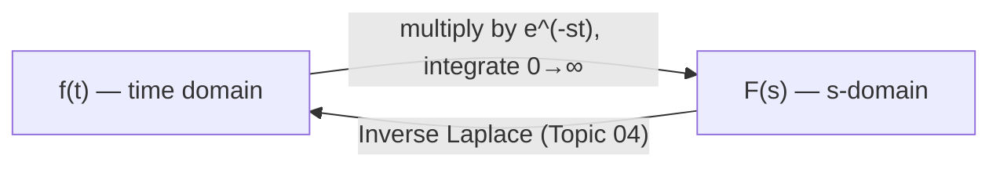

# 01. Definition of Laplace Transform

## Overview

Laplace transform converts a function of time $t$ into a function of a complex frequency variable $s$, turning differential equations into algebraic ones. This file is the entry point for the whole unit — it sets up the notation ($t$, $s$, $f(t)$, $F(s)$) and existence conditions that every later topic (transform tables, properties, inversion, ODE/PDE solving) depends on. It enables [→ Elementary Functions](02_laplace_transform_of_elementary_functions.md), where the definition is applied to build a transform table.

## Definitions & Key Terms

**1. Laplace Transform** — *For a function $f(t)$ defined for $t \geq 0$, the (one-sided) Laplace transform is*
$$\mathcal{L}\{f(t)\} = F(s) = \int_0^\infty e^{-st}f(t)\,dt$$
> Plain-English: multiply $f(t)$ by a decaying exponential $e^{-st}$ and add up (integrate) the result over all time — the answer is a new function $F(s)$.

**2. One-sided (unilateral) transform** — *the integral is taken from $0$ to $\infty$; behaviour of $f(t)$ for $t<0$ is ignored (assumed zero).*
> Plain-English: we only care about what happens from the "start" ($t=0$) onward — natural for initial-value problems.

**3. $t$ (time domain variable)** — *independent real variable, usually time, $t \geq 0$.*

**4. $s$ (transform / frequency variable)** — *complex variable, $s = \sigma + i\omega$; for this course, treat $s$ as a real parameter large enough for convergence.*

**5. $f(t)$** — *original function, "the object function."*

**6. $F(s)$** — *transformed function, "the image function"; notation $\mathcal{L}\{f(t)\} = F(s)$ is standard.*

**7. Piecewise continuity** — *$f(t)$ has at most finitely many jump discontinuities on every finite interval $[0,A]$, and is continuous elsewhere.*
> Plain-English: the graph can have a finite number of "steps" but no infinite spikes or infinitely many wiggles.

**8. Exponential order** — *$f(t)$ is of exponential order $\alpha$ if there exist constants $M>0$, $\alpha$, $T$ such that $|f(t)| \leq Me^{\alpha t}$ for all $t > T$.*
> Plain-English: $f(t)$ doesn't grow faster than some exponential — rules out things like $e^{t^2}$.

## Core Content

**Theorem (Existence of the Laplace Transform).** If $f(t)$ is piecewise continuous on $[0,\infty)$ and of exponential order $\alpha$, then $\mathcal{L}\{f(t)\}$ exists for all $s > \alpha$.

*Proof (Direct).* Split the integral:
$$\int_0^\infty e^{-st}f(t)\,dt = \int_0^T e^{-st}f(t)\,dt + \int_T^\infty e^{-st}f(t)\,dt$$
The first integral is finite since $f$ is piecewise continuous on a finite interval. For the second, using $|f(t)| \le Me^{\alpha t}$:
$$\left|\int_T^\infty e^{-st}f(t)\,dt\right| \le \int_T^\infty Me^{-(s-\alpha)t}\,dt = \frac{Me^{-(s-\alpha)T}}{s-\alpha}, \quad s > \alpha$$
which is finite. Hence $F(s)$ exists for $s > \alpha$. $\blacksquare$

> These conditions are **sufficient, not necessary** — some functions without exponential order still fail to have a transform, but every function you meet in this course (polynomials, exponentials, sines, cosines and their products) satisfies them comfortably.

**Linearity (first property, proved here since it follows directly from integral linearity):**
$$\mathcal{L}\{af(t) + bg(t)\} = a\,\mathcal{L}\{f(t)\} + b\,\mathcal{L}\{g(t)\} = aF(s) + bG(s)$$
*Proof.* Integration is linear:
$$\int_0^\infty e^{-st}[af(t)+bg(t)]\,dt = a\int_0^\infty e^{-st}f(t)\,dt + b\int_0^\infty e^{-st}g(t)\,dt = aF(s)+bG(s) \blacksquare$$

**Direct application — transform of a constant $f(t) = 1$:**
$$\mathcal{L}\{1\} = \int_0^\infty e^{-st}\,dt = \left[-\frac{e^{-st}}{s}\right]_0^\infty = 0 - \left(-\frac{1}{s}\right) = \frac{1}{s}, \quad s>0$$

**Direct application — transform of $f(t)=e^{at}$:**
$$\mathcal{L}\{e^{at}\} = \int_0^\infty e^{-st}e^{at}\,dt = \int_0^\infty e^{-(s-a)t}\,dt = \frac{1}{s-a}, \quad s>a$$

## Essential Formula

$$\boxed{\mathcal{L}\{f(t)\} = F(s) = \int_0^\infty e^{-st}f(t)\,dt}$$

## Worked Examples

### Example 1 — 🟢 Foundational
Find $\mathcal{L}\{t\}$ directly from the definition.

**Solution**
$$F(s) = \int_0^\infty e^{-st}t\,dt$$
Integrate by parts, $u=t,\ dv=e^{-st}dt \Rightarrow du=dt,\ v=-\dfrac{e^{-st}}{s}$:
$$F(s) = \left[-\frac{t\,e^{-st}}{s}\right]_0^\infty + \frac{1}{s}\int_0^\infty e^{-st}\,dt = 0 + \frac{1}{s}\cdot\frac{1}{s}$$
**Answer:** $\mathcal{L}\{t\} = \dfrac{1}{s^2},\ s>0$

### Example 2 — 🟡 Intermediate
Using linearity and known basic transforms, find $\mathcal{L}\{3 + 2e^{5t}\}$.

**Solution**
$$\mathcal{L}\{3+2e^{5t}\} = 3\mathcal{L}\{1\} + 2\mathcal{L}\{e^{5t}\} = 3\cdot\frac{1}{s} + 2\cdot\frac{1}{s-5}$$
Combine over a common denominator:
$$= \frac{3(s-5)+2s}{s(s-5)} = \frac{5s-15}{s(s-5)}$$
**Answer:** $F(s) = \dfrac{5s-15}{s(s-5)},\ s>5$

### Example 3 — 🔴 Advanced / Exam-level
Evaluate $\mathcal{L}\{f(t)\}$ from the definition for
$$f(t) = \begin{cases} 2, & 0 \le t < 3 \\ 0, & t \ge 3 \end{cases}$$

**Solution**
Since $f(t)=0$ for $t\ge 3$, the integral only runs to 3:
$$F(s) = \int_0^3 2e^{-st}\,dt = 2\left[-\frac{e^{-st}}{s}\right]_0^3 = 2\left(\frac{1-e^{-3s}}{s}\right)$$
**Answer:** $F(s) = \dfrac{2(1-e^{-3s})}{s},\ s>0$

## Applications

- **Circuit/system initial-value problems** — the definition is the foundation that lets engineers convert a switching/turn-on event at $t=0$ into an algebraic equation in $s$.
- **Building the transform table** — every entry in the Topic 02 table is derived by directly evaluating this integral once, so it never needs to be repeated by hand again.

## Diagram / Visual

*Figure 1: The Laplace transform maps a time-domain function to an s-domain function; Topic 04 shows the reverse map.*

## Common Mistakes

- ❌ **Mistake:** Forgetting the convergence condition (e.g. writing $\mathcal{L}\{e^{at}\}=\frac{1}{s-a}$ valid for all $s$).
  ✅ **Correct:** Always state the region $s > a$ (or the appropriate bound) — it matters for inverse transform and final/initial value theorems later.
- ❌ **Mistake:** Confusing $f(t)$ and $F(s)$ — writing $F(t)$ or $f(s)$.
  ✅ **Correct:** Lower-case = time domain, upper-case = $s$-domain; keep this notation strict throughout the unit.
- ❌ **Mistake:** Dropping the limits when integrating by parts (forgetting to evaluate at $t\to\infty$).
  ✅ **Correct:** Always check that the boundary term vanishes as $t\to\infty$ using $s>0$ — state it explicitly.
- ❌ **Mistake:** Applying the transform to functions with infinite discontinuities (e.g. $1/t$ near $t=0$) without checking existence.
  ✅ **Correct:** Verify piecewise continuity and exponential order before assuming the transform exists.

## Practice Problems

**Problem 1:** Find $\mathcal{L}\{5\}$ from the definition.

Solution

$F(s)=\int_0^\infty 5e^{-st}dt = 5\left[\dfrac{-e^{-st}}{s}\right]_0^\infty = \dfrac{5}{s}$

**Answer:** $F(s)=\dfrac{5}{s},\ s>0$

**Problem 2:** Find $\mathcal{L}\{e^{-3t}\}$ from the definition.

Solution

$F(s)=\int_0^\infty e^{-st}e^{-3t}dt=\int_0^\infty e^{-(s+3)t}dt=\dfrac{1}{s+3}$

**Answer:** $F(s)=\dfrac{1}{s+3},\ s>-3$

**Problem 3:** Find $\mathcal{L}\{4-3e^{2t}\}$ using linearity.

Solution

$=4\mathcal{L}\{1\}-3\mathcal{L}\{e^{2t}\}=\dfrac{4}{s}-\dfrac{3}{s-2}=\dfrac{4(s-2)-3s}{s(s-2)}=\dfrac{s-8}{s(s-2)}$

**Answer:** $F(s)=\dfrac{s-8}{s(s-2)},\ s>2$

**Problem 4:** Evaluate $\mathcal{L}\{t\}$ using tabular integration by parts (repeat Example 1's method independently) and verify against the table entry $1/s^2$.

Solution

$u=t,\ dv=e^{-st}dt,\ v=-e^{-st}/s,\ du=dt$

$\int_0^\infty te^{-st}dt = \left[-\dfrac{te^{-st}}{s}\right]_0^\infty+\dfrac1s\int_0^\infty e^{-st}dt = 0+\dfrac1{s^2}$

**Answer:** $1/s^2$ — matches the table.

**Problem 5:** From the definition, find $\mathcal{L}\{f(t)\}$ for
$$f(t)=\begin{cases}1,&0\le t<2\\3,&t\ge2\end{cases}$$

Solution

Split at $t=2$:

$F(s)=\displaystyle\int_0^2 1\cdot e^{-st}dt+\int_2^\infty 3e^{-st}dt$

$=\left[\dfrac{-e^{-st}}{s}\right]_0^2 + 3\left[\dfrac{-e^{-st}}{s}\right]_2^\infty=\dfrac{1-e^{-2s}}{s}+\dfrac{3e^{-2s}}{s}$

$=\dfrac{1+2e^{-2s}}{s}$

**Answer:** $F(s)=\dfrac{1+2e^{-2s}}{s},\ s>0$

**Problem 6:** State (without proof) whether $f(t)=e^{t^2}$ satisfies the exponential-order condition, and explain in one line why $\mathcal{L}\{e^{t^2}\}$ is not guaranteed to exist.

Solution

No — $e^{t^2}$ grows faster than any $Me^{\alpha t}$ as $t\to\infty$ (for any fixed $\alpha$, $e^{t^2}/e^{\alpha t}\to\infty$), so it is **not** of exponential order.

**Answer:** The existence theorem's sufficient condition fails, so convergence of $\int_0^\infty e^{-st}e^{t^2}dt$ is not guaranteed (and in fact the integral diverges for every $s$).

**Problem 7 (exam-style, method not given):** Evaluate $\mathcal{L}\{f(t)\}$ where $f(t) = t$ for $0\le t<1$ and $f(t)=1$ for $t\ge 1$.

Solution

Split at $t=1$:

$F(s)=\displaystyle\int_0^1 te^{-st}dt+\int_1^\infty 1\cdot e^{-st}dt$

First integral (by parts, as in Ex.1):

$\displaystyle\int_0^1 te^{-st}dt=\left[\dfrac{-te^{-st}}{s}\right]_0^1+\dfrac1s\int_0^1e^{-st}dt=\dfrac{-e^{-s}}{s}+\dfrac1s\left(\dfrac{1-e^{-s}}{s}\right)$

$=\dfrac{-e^{-s}}{s}+\dfrac{1-e^{-s}}{s^2}$

Second integral: $\displaystyle\int_1^\infty e^{-st}dt=\dfrac{e^{-s}}{s}$

Adding, the $\dfrac{-e^{-s}}{s}$ and $\dfrac{e^{-s}}{s}$ cancel:

$F(s)=\dfrac{1-e^{-s}}{s^2}$

**Answer:** $F(s)=\dfrac{1-e^{-s}}{s^2},\ s>0$

## Summary

| Concept | Result | Condition / Limit |
|---|---|---|
| Definition | $F(s)=\int_0^\infty e^{-st}f(t)\,dt$ | one-sided, $t\ge0$ |
| Existence | $F(s)$ exists | $f$ piecewise continuous + exponential order $\alpha$, valid for $s>\alpha$ |
| Linearity | $\mathcal{L}\{af+bg\}=aF+bG$ | always (given both transforms exist) |
| $\mathcal{L}\{1\}$ | $1/s$ | $s>0$ |
| $\mathcal{L}\{t\}$ | $1/s^2$ | $s>0$ |
| $\mathcal{L}\{e^{at}\}$ | $1/(s-a)$ | $s>a$ |

Next: [→ 02. Laplace Transform of Elementary Functions](02_laplace_transform_of_elementary_functions.md) builds the full transform table using this definition.

## References

1. **Erwin Kreyszig, Advanced Engineering Mathematics, 10th Ed.** — *Standard existence theorem statement and proof structure.*
2. **R. K. Jain & S. R. K. Iyengar, Advanced Engineering Mathematics** — *Undergraduate-level worked derivation of basic transforms from the definition.*
3. **MIT OpenCourseWare 18.03 (Differential Equations)** — *Lecture notes on Laplace transform definition and existence conditions.* https://ocw.mit.edu
4. **Wolfram MathWorld — "Laplace Transform"** — *Formula verification.* https://mathworld.wolfram.com/LaplaceTransform.html
