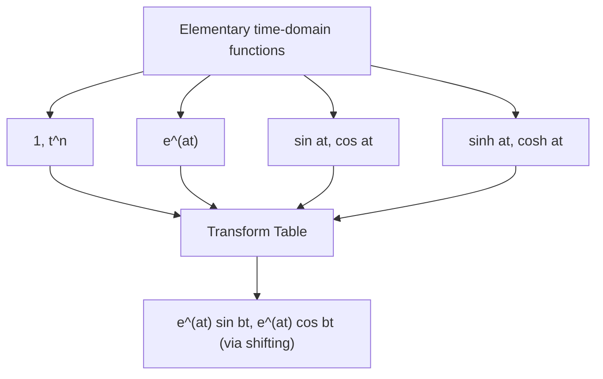

# 02. Laplace Transform of Elementary Functions

## Overview

Building on the definition in [→ 01. Definition](01_definition_of_laplace_transform.md), this file derives the standard transform table for powers, exponentials, and (hyperbolic/circular) sine and cosine — the building blocks every later topic (properties, inverse transform, ODE/PDE solving) is assembled from. Memorising this table is the single highest-value step for the exam.

## Definitions & Key Terms

**1. Gamma function** — *$\Gamma(n+1) = n!$ for non-negative integers $n$; used to transform $t^n$.*

Plain-English: a generalisation of factorial, needed for the $t^n$ formula.

**2. $\sinh at, \cosh at$** — hyperbolic sine/cosine:

$$
\sinh at = \frac{e^{at}-e^{-at}}{2}, \qquad \cosh at = \frac{e^{at}+e^{-at}}{2}
$$

## Core Content — The Transform Table

Theorem statements with derivations (Direct method: evaluate the defining integral).

### (a) $\mathcal{L}\{t^n\} = \dfrac{n!}{s^{n+1}}$, $n=0,1,2,\dots$

*Proof.* By definition,

$$
F(s) = \int_0^\infty t^n e^{-st}\,dt
$$

Substitute $u = st \Rightarrow t = u/s,\ dt = du/s$:

$$
F(s) = \int_0^\infty \left(\frac{u}{s}\right)^n e^{-u}\,\frac{du}{s} = \frac{1}{s^{n+1}}\int_0^\infty u^n e^{-u}\,du = \frac{n!}{s^{n+1}}
$$

using the Gamma-function identity $\int_0^\infty u^n e^{-u}\,du = \Gamma(n+1) = n!$. $\blacksquare$

### (b) $\mathcal{L}\{e^{at}\} = \dfrac{1}{s-a}$ — derived in Topic 01.

### (c) $\mathcal{L}\{\sin at\} = \dfrac{a}{s^2+a^2}$

**(d) $\mathcal{L}\{\cos at\} = \dfrac{s}{s^2+a^2}$**

*Proof.* Similarly, $\cos at=\dfrac{e^{iat}+e^{-iat}}2$:
$$\mathcal{L}\{\cos at\}=\frac12\left[\frac1{s-ia}+\frac1{s+ia}\right]=\frac12\cdot\frac{2s}{s^2+a^2}=\frac{s}{s^2+a^2}$$

**(e) $\mathcal{L}\{\sinh at\} = \dfrac{a}{s^2-a^2}$, $\mathcal{L}\{\cosh at\} = \dfrac{s}{s^2-a^2}$**

*Proof.* Using linearity with $e^{at},e^{-at}$: $\mathcal{L}\{\sinh at\}=\frac12\left[\frac1{s-a}-\frac1{s+a}\right]=\frac12\cdot\frac{2a}{s^2-a^2}=\frac{a}{s^2-a^2}$, and similarly for $\cosh at$.

**(f) $\mathcal{L}\{e^{at}\sin bt\} = \dfrac{b}{(s-a)^2+b^2}$, $\mathcal{L}\{e^{at}\cos bt\} = \dfrac{s-a}{(s-a)^2+b^2}$**

These follow immediately once the **first shifting theorem** ($\mathcal{L}\{e^{at}f(t)\}=F(s-a)$, proved fully in Topic 03) is applied to (c) and (d) — replace $s\to s-a$ in the sine/cosine formulas. They are included here because they belong in the table used constantly from Topic 04 onward.

### Compact Transform Table

| $f(t)$ | $F(s)=\mathcal{L}\{f(t)\}$ | Valid for |
|---|---|---|
| $1$ | $\dfrac1s$ | $s>0$ |
| $t^n\ (n=1,2,\dots)$ | $\dfrac{n!}{s^{n+1}}$ | $s>0$ |
| $e^{at}$ | $\dfrac1{s-a}$ | $s>a$ |
| $\sin at$ | $\dfrac{a}{s^2+a^2}$ | $s>0$ |
| $\cos at$ | $\dfrac{s}{s^2+a^2}$ | $s>0$ |
| $\sinh at$ | $\dfrac{a}{s^2-a^2}$ | $s>|a|$ |
| $\cosh at$ | $\dfrac{s}{s^2-a^2}$ | $s>|a|$ |
| $e^{at}\sin bt$ | $\dfrac{b}{(s-a)^2+b^2}$ | $s>a$ |
| $e^{at}\cos bt$ | $\dfrac{s-a}{(s-a)^2+b^2}$ | $s>a$ |
| $t^ne^{at}$ | $\dfrac{n!}{(s-a)^{n+1}}$ | $s>a$ |

## Worked Examples

### Example 1 — 🟢 Foundational
Find $\mathcal{L}\{t^4\}$.

**Solution**
Direct table lookup with $n=4$: $\mathcal{L}\{t^n\}=n!/s^{n+1}$
$$\mathcal{L}\{t^4\}=\frac{4!}{s^5}=\frac{24}{s^5}$$
**Answer:** $F(s)=\dfrac{24}{s^5}$

### Example 2 — 🟡 Intermediate
Find $\mathcal{L}\{5\sin 3t - 4\cos 3t\}$.

**Solution**
Apply linearity, then table entries with $a=3$:
$$\mathcal{L}\{5\sin3t\}=5\cdot\frac{3}{s^2+9}=\frac{15}{s^2+9},\qquad \mathcal{L}\{4\cos3t\}=4\cdot\frac{s}{s^2+9}=\frac{4s}{s^2+9}$$
$$F(s)=\frac{15}{s^2+9}-\frac{4s}{s^2+9}=\frac{15-4s}{s^2+9}$$
**Answer:** $F(s)=\dfrac{15-4s}{s^2+9}$

### Example 3 — 🔴 Advanced / Exam-level
Find $\mathcal{L}\{t^2 - 3e^{2t}\cos 4t + 2\sinh 5t\}$.

**Solution**
Term by term, using linearity:
- $\mathcal{L}\{t^2\}=\dfrac{2!}{s^3}=\dfrac{2}{s^3}$
- $\mathcal{L}\{e^{2t}\cos4t\}=\dfrac{s-2}{(s-2)^2+16}$, so $3\mathcal{L}\{e^{2t}\cos4t\}=\dfrac{3(s-2)}{(s-2)^2+16}$
- $\mathcal{L}\{\sinh5t\}=\dfrac{5}{s^2-25}$, so $2\mathcal{L}\{\sinh5t\}=\dfrac{10}{s^2-25}$

$$F(s)=\frac{2}{s^3}-\frac{3(s-2)}{(s-2)^2+16}+\frac{10}{s^2-25}$$
**Answer:** $F(s)=\dfrac{2}{s^3}-\dfrac{3(s-2)}{(s-2)^2+16}+\dfrac{10}{s^2-25}$

## Applications

- **Signal representation** — any input signal built from steps, ramps, exponentials, and sinusoids (common test/control signals) is transformed term-by-term using this table, avoiding repeated integration.
- **Table-driven ODE solving** — Topics 06–07 depend entirely on recognising these forms on both the forward and inverse side.

## Diagram / Visual

*Figure 1: How the elementary building blocks combine (directly or via shifting) into the full transform table.*

## Common Mistakes

- ❌ **Mistake:** Using $\mathcal{L}\{t^n\}=\dfrac{n!}{s^n}$ (wrong power of $s$).
  ✅ **Correct:** It is $s^{n+1}$ — check $n=0$ reduces correctly to $1/s$.
- ❌ **Mistake:** Mixing up $\sin/\cos$ ($s^2+a^2$) with $\sinh/\cosh$ ($s^2-a^2$) denominators.
  ✅ **Correct:** Circular functions give $+a^2$; hyperbolic give $-a^2$ — remember hyperbolic comes from real exponentials $e^{\pm at}$.
- ❌ **Mistake:** Forgetting the $(s-a)$ shift when transforming $e^{at}\sin bt$ or $e^{at}\cos bt$ (using plain $s^2+b^2$ denominator).
  ✅ **Correct:** Every $s$ in the un-shifted formula becomes $(s-a)$.
- ❌ **Mistake:** Applying the $t^n$ formula to non-integer or negative powers without further theory.
  ✅ **Correct:** The simple $n!/s^{n+1}$ form is for non-negative integers $n$ only; non-integer powers need the Gamma function directly (out of scope here).

## Practice Problems

**Problem 1:** Find $\mathcal{L}\{t^3\}$.

Solution

$\mathcal{L}\{t^3\}=\dfrac{3!}{s^4}=\dfrac{6}{s^4}$

**Answer:** $6/s^4$

**Problem 2:** Find $\mathcal{L}\{\cos 7t\}$.

Solution

$\mathcal{L}\{\cos7t\}=\dfrac{s}{s^2+49}$

**Answer:** $s/(s^2+49)$

**Problem 3:** Find $\mathcal{L}\{\sinh 2t\}$.

Solution

$\mathcal{L}\{\sinh2t\}=\dfrac{2}{s^2-4}$

**Answer:** $2/(s^2-4)$

**Problem 4:** Find $\mathcal{L}\{e^{-2t}\}$.

Solution

$\mathcal{L}\{e^{-2t}\}=\dfrac{1}{s+2}$

**Answer:** $1/(s+2)$

**Problem 5:** Find $\mathcal{L}\{4t^2 - 3t + 7\}$.

Solution

$=4\cdot\dfrac{2!}{s^3}-3\cdot\dfrac1{s^2}+7\cdot\dfrac1s=\dfrac{8}{s^3}-\dfrac{3}{s^2}+\dfrac7s$

**Answer:** $\dfrac{8}{s^3}-\dfrac3{s^2}+\dfrac7s$

**Problem 6:** Find $\mathcal{L}\{3\sin2t+5\cos2t\}$.

Solution

$=3\cdot\dfrac{2}{s^2+4}+5\cdot\dfrac{s}{s^2+4}=\dfrac{6+5s}{s^2+4}$

**Answer:** $\dfrac{5s+6}{s^2+4}$

**Problem 7:** Find $\mathcal{L}\{e^{3t}\sin2t\}$.

Solution

Table with $a=3,b=2$: $\dfrac{2}{(s-3)^2+4}$

**Answer:** $\dfrac{2}{(s-3)^2+4}$

**Problem 8:** Find $\mathcal{L}\{e^{-t}\cos4t\}$.

Solution

$a=-1,b=4$: $\dfrac{s-(-1)}{(s+1)^2+16}=\dfrac{s+1}{(s+1)^2+16}$

**Answer:** $\dfrac{s+1}{(s+1)^2+16}$

**Problem 9:** Find $\mathcal{L}\{t^2e^{3t}\}$.

Solution

Table: $\dfrac{n!}{(s-a)^{n+1}}$ with $n=2,a=3$: $\dfrac{2}{(s-3)^3}$

**Answer:** $\dfrac{2}{(s-3)^3}$

**Problem 10:** Find $\mathcal{L}\{\cosh3t - \sinh3t\}$ and simplify using $\cosh x-\sinh x=e^{-x}$.

Solution

Direct: $\dfrac{s}{s^2-9}-\dfrac3{s^2-9}=\dfrac{s-3}{s^2-9}=\dfrac{s-3}{(s-3)(s+3)}=\dfrac1{s+3}$

Cross-check: $\cosh3t-\sinh3t=e^{-3t}\Rightarrow \mathcal{L}\{e^{-3t}\}=\dfrac1{s+3}$ ✓ matches.

**Answer:** $\dfrac{1}{s+3}$

**Problem 11 (exam-style):** Find $\mathcal{L}\{2t^3 - 3\sin4t + e^{-2t}\cos t\}$.

Solution

$\mathcal{L}\{2t^3\}=2\cdot\dfrac{3!}{s^4}=\dfrac{12}{s^4}$

$\mathcal{L}\{3\sin4t\}=3\cdot\dfrac4{s^2+16}=\dfrac{12}{s^2+16}$

$\mathcal{L}\{e^{-2t}\cos t\}=\dfrac{s+2}{(s+2)^2+1}$

$$F(s)=\frac{12}{s^4}-\frac{12}{s^2+16}+\frac{s+2}{(s+2)^2+1}$$

**Answer:** as above.

**Problem 12 (exam-style, mixed):** Find $\mathcal{L}\{(t+1)^2\}$ by expanding first.

Solution

Expand: $(t+1)^2=t^2+2t+1$

$$\mathcal{L}\{t^2+2t+1\}=\frac{2}{s^3}+2\cdot\frac1{s^2}+\frac1s=\frac{2}{s^3}+\frac2{s^2}+\frac1s$$

**Answer:** $\dfrac2{s^3}+\dfrac2{s^2}+\dfrac1s$

## Summary

| Concept | Result | Condition / Limit |
|---|---|---|
| $\mathcal{L}\{t^n\}$ | $n!/s^{n+1}$ | $n$ = non-negative integer |
| $\mathcal{L}\{e^{at}\}$ | $1/(s-a)$ | $s>a$ |
| $\mathcal{L}\{\sin at\},\mathcal{L}\{\cos at\}$ | $a/(s^2{+}a^2),\ s/(s^2{+}a^2)$ | $s>0$ |
| $\mathcal{L}\{\sinh at\},\mathcal{L}\{\cosh at\}$ | $a/(s^2{-}a^2),\ s/(s^2{-}a^2)$ | $s>|a|$ |
| $\mathcal{L}\{e^{at}\sin bt\},\mathcal{L}\{e^{at}\cos bt\}$ | shift $s\to s-a$ in sin/cos formulas | $s>a$ |

Next: [→ 03. Properties and Applications](03_properties_and_applications.md) extends this table with operational rules (shifting, differentiation, integration) that handle far more functions without new integration.

## References

1. **Erwin Kreyszig, Advanced Engineering Mathematics, 10th Ed.** — *Full transform table with derivations.*
2. **R. K. Jain & S. R. K. Iyengar, Advanced Engineering Mathematics** — *Table format matching typical university exam style.*
3. **James Stewart, Calculus (Early Transcendentals)** — *Background on hyperbolic function identities used in derivations.*
4. **Wolfram MathWorld — "Laplace Transform"** — *Cross-verification of table entries.* https://mathworld.wolfram.com/LaplaceTransform.html
