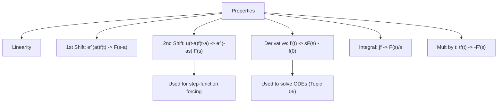

# 03. Properties of Laplace Transform and Applications

## Overview

The [→ elementary transform table](02_laplace_transform_of_elementary_functions.md) only covers simple functions. These operational **properties** let you transform shifted, multiplied, differentiated, or integrated versions of those functions *without* re-doing the defining integral. They are the direct machinery behind [→ Inverse Laplace Transform](04_inverse_laplace_transform.md) and [→ ODE solving](06_solution_of_ordinary_differential_equations.md) — the derivative property in particular is *the* reason Laplace transforms solve differential equations.

## Definitions & Key Terms

**1. Unit step function $u(t-a)$** — *$u(t-a)=0$ for $t<a$, $u(t-a)=1$ for $t\ge a$.*
> Plain-English: an on/off switch that turns on at $t=a$.

**2. Shifting theorems** — *rules describing how multiplying by $e^{at}$ (in $t$-domain) or delaying by $a$ (in $t$-domain) affects $F(s)$.*

## Core Content

### 1. Linearity
$$\mathcal{L}\{af(t)+bg(t)\}=aF(s)+bG(s)$$
(Proved in Topic 01 — restated here as the base property everything else builds on.)

### 2. First Shifting Theorem (Shifting in $s$)
$$\boxed{\mathcal{L}\{e^{at}f(t)\} = F(s-a)}$$

*Proof (Direct).*
$$\mathcal{L}\{e^{at}f(t)\}=\int_0^\infty e^{-st}e^{at}f(t)\,dt=\int_0^\infty e^{-(s-a)t}f(t)\,dt = F(s-a) \blacksquare$$

### 3. Second Shifting Theorem (Shifting in $t$)
$$\boxed{\mathcal{L}\{u(t-a)f(t-a)\} = e^{-as}F(s)}$$

*Proof.* $\mathcal{L}\{u(t-a)f(t-a)\}=\int_0^\infty e^{-st}u(t-a)f(t-a)\,dt=\int_a^\infty e^{-st}f(t-a)\,dt$ (since $u=0$ before $a$). Substitute $\tau=t-a$:
$$=\int_0^\infty e^{-s(\tau+a)}f(\tau)\,d\tau = e^{-as}\int_0^\infty e^{-s\tau}f(\tau)\,d\tau = e^{-as}F(s) \blacksquare$$

> ⚠️ **Practical form:** if given $g(t)u(t-a)$ where $g(t)$ is *not already* written as $f(t-a)$, first rewrite $g(t)=f(t-a)$ by substituting $t=(t-a)+a$ everywhere in $g$, then apply the theorem.

### 4. Differentiation in $t$
$$\mathcal{L}\{f'(t)\} = sF(s) - f(0)$$
$$\mathcal{L}\{f''(t)\} = s^2F(s) - sf(0) - f'(0)$$

*Proof (Induction base case, by parts).* $\int_0^\infty e^{-st}f'(t)dt$, let $u=e^{-st},\,dv=f'(t)dt\Rightarrow du=-se^{-st}dt,\,v=f(t)$:
$$=\left[e^{-st}f(t)\right]_0^\infty + s\int_0^\infty e^{-st}f(t)dt = (0-f(0)) + sF(s) = sF(s)-f(0)$$
(boundary term at $\infty$ vanishes for $f$ of exponential order, $s$ large enough). Applying this twice to $f''$ gives the second-derivative formula. $\blacksquare$ This is **the** property that converts an ODE into an algebraic equation.

### 5. Integration in $t$
$$\mathcal{L}\left\{\int_0^t f(u)\,du\right\} = \frac{F(s)}{s}$$

*Proof sketch.* Let $g(t)=\int_0^t f(u)du$, so $g'(t)=f(t)$, $g(0)=0$. By the derivative property, $\mathcal{L}\{g'(t)\}=sG(s)-g(0)=sG(s)=F(s)\Rightarrow G(s)=F(s)/s$. $\blacksquare$

### 6. Multiplication by $t$
$$\mathcal{L}\{tf(t)\} = -F'(s)$$

*Proof sketch.* Differentiate $F(s)=\int_0^\infty e^{-st}f(t)dt$ with respect to $s$ under the integral sign: $F'(s)=\int_0^\infty(-t)e^{-st}f(t)dt=-\mathcal{L}\{tf(t)\}$, so $\mathcal{L}\{tf(t)\}=-F'(s)$. $\blacksquare$

### 7. Initial Value Theorem
$$f(0^+) = \lim_{s\to\infty} sF(s)$$

### 8. Final Value Theorem
$$\lim_{t\to\infty} f(t) = \lim_{s\to0} sF(s)$$
> ⚠️ **Condition:** valid only if $f(t)$ has a genuine limit as $t\to\infty$ (all poles of $sF(s)$ must lie in the left half-plane; it fails for undamped oscillations like $\sin t$, where the "limit" does not exist).

## Worked Examples

### Example 1 — 🟢 Foundational
Find $\mathcal{L}\{e^{2t}t^3\}$ using the first shifting theorem.

**Solution**
$\mathcal{L}\{t^3\}=\dfrac{3!}{s^4}=\dfrac6{s^4}=F(s)$. Shift $s\to s-2$:
$$\mathcal{L}\{e^{2t}t^3\}=F(s-2)=\frac{6}{(s-2)^4}$$
**Answer:** $\dfrac{6}{(s-2)^4}$

### Example 2 — 🟡 Intermediate
Find $\mathcal{L}\{t\sin at\}$ using the multiplication-by-$t$ property.

**Solution**
$F(s)=\mathcal{L}\{\sin at\}=\dfrac{a}{s^2+a^2}$. Then $\mathcal{L}\{t\sin at\}=-F'(s)$:
$$F'(s)=a\cdot\frac{d}{ds}\left(\frac{1}{s^2+a^2}\right)=a\cdot\frac{-2s}{(s^2+a^2)^2}=\frac{-2as}{(s^2+a^2)^2}$$
$$\mathcal{L}\{t\sin at\}=-F'(s)=\frac{2as}{(s^2+a^2)^2}$$
**Answer:** $\dfrac{2as}{(s^2+a^2)^2}$

### Example 3 — 🔴 Advanced / Exam-level
Using the derivative property, find $\mathcal{L}\{y''\}$ in terms of $Y(s)$ given $y(0)=2,\ y'(0)=-1$, and hence write $\mathcal{L}\{y''+3y'+2y\}$ if $y(t)$ satisfies these initial conditions (leave $Y(s)$ symbolic).

**Solution**
$$\mathcal{L}\{y'\}=sY(s)-y(0)=sY(s)-2$$
$$\mathcal{L}\{y''\}=s^2Y(s)-sy(0)-y'(0)=s^2Y(s)-2s-(-1)=s^2Y(s)-2s+1$$
Now combine with linearity:
$$\mathcal{L}\{y''+3y'+2y\}=[s^2Y(s)-2s+1]+3[sY(s)-2]+2Y(s)$$
$$=(s^2+3s+2)Y(s)-2s+1-6=(s^2+3s+2)Y(s)-2s-5$$
**Answer:** $(s^2+3s+2)Y(s)-2s-5$ — this is exactly the algebraic form used in Topic 06.

## Applications

- **Circuits with switches** — the second shifting theorem models a voltage/current source that switches on at $t=a$, giving the characteristic $e^{-as}$ factor seen in step-response problems.
- **Converting ODEs to algebra** — the derivative property is applied in every problem in [→ Topic 06](06_solution_of_ordinary_differential_equations.md); without it Laplace methods would not solve differential equations at all.

## Diagram / Visual

*Figure 1: Map of the seven core properties and their main downstream use.*

## Common Mistakes

- ❌ **Mistake:** In the first shifting theorem, shifting the wrong direction (writing $F(s+a)$ instead of $F(s-a)$ for $e^{at}f(t)$).
  ✅ **Correct:** Multiplying by $e^{+at}$ shifts $s \to s-a$ (subtract $a$); memorise via $\mathcal{L}\{e^{at}\}=1/(s-a)$.
- ❌ **Mistake:** Forgetting the $e^{-as}$ factor when applying the second shifting theorem, or using it when the function isn't actually delayed.
  ✅ **Correct:** The $e^{-as}$ only appears when $u(t-a)$ multiplies a *shifted* function $f(t-a)$ — rewrite the given function in that exact form first.
- ❌ **Mistake:** Dropping initial-condition terms in the derivative property, e.g. writing $\mathcal{L}\{f'(t)\}=sF(s)$.
  ✅ **Correct:** Always subtract $f(0)$ (and for $f''$, also $sf(0)+f'(0)$) — this is what encodes initial conditions into the algebra.
- ❌ **Mistake:** Applying the final value theorem to functions like $\sin t$ or unstable growing responses.
  ✅ **Correct:** Check first that $f(t)$ actually has a finite limit as $t\to\infty$ (equivalently, poles of $sF(s)$ in the left half plane) before using FVT.
- ❌ **Mistake:** Sign error in $\mathcal{L}\{tf(t)\}=-F'(s)$ (forgetting the minus sign).
  ✅ **Correct:** Differentiating $e^{-st}$ w.r.t. $s$ brings down $-t$, so the minus sign is required.

## Practice Problems

**Problem 1:** Find $\mathcal{L}\{e^{-3t}\cos2t\}$ using the first shifting theorem.

Solution

$\mathcal{L}\{\cos2t\}=\dfrac{s}{s^2+4}$. Shift $s\to s+3$: $\dfrac{s+3}{(s+3)^2+4}$

**Answer:** $\dfrac{s+3}{(s+3)^2+4}$

**Problem 2:** Find $\mathcal{L}\{e^{4t}t^2\}$.

Solution

$\mathcal{L}\{t^2\}=2/s^3$. Shift $s\to s-4$: $2/(s-4)^3$

**Answer:** $2/(s-4)^3$

**Problem 3:** Find $\mathcal{L}\{u(t-2)\}$ (special case, $f=1$).

Solution

$f(t)=1\Rightarrow F(s)=1/s$. Second shift with $a=2$: $e^{-2s}\cdot\dfrac1s$

**Answer:** $\dfrac{e^{-2s}}{s}$

**Problem 4:** Find $\mathcal{L}\{u(t-1)(t-1)^2\}$.

Solution

Already in form $f(t-1)$ with $f(t)=t^2,\ F(s)=2/s^3$. Second shift, $a=1$: $e^{-s}\cdot\dfrac2{s^3}$

**Answer:** $\dfrac{2e^{-s}}{s^3}$

**Problem 5:** Find $\mathcal{L}\{u(t-3)t\}$ (function NOT already shifted — rewrite first).

Solution

Write $t=(t-3)+3$, so $u(t-3)\cdot t = u(t-3)[(t-3)+3]$. Let $f(t)=t+3$; then $f(t-3)=(t-3)+3=t$. ✓ matches.

$F(s)=\mathcal{L}\{t+3\}=\dfrac1{s^2}+\dfrac3s$. Apply second shift, $a=3$:

$$e^{-3s}\left(\frac1{s^2}+\frac3s\right)$$

**Answer:** $e^{-3s}\left(\dfrac1{s^2}+\dfrac3s\right)$

**Problem 6:** Find $\mathcal{L}\{f'(t)\}$ given $f(0)=5$, $F(s)=\dfrac{3}{s^2+4}$.

Solution

$\mathcal{L}\{f'\}=sF(s)-f(0)=\dfrac{3s}{s^2+4}-5$

**Answer:** $\dfrac{3s}{s^2+4}-5$

**Problem 7:** Find $\mathcal{L}\{\int_0^t e^{2u}du\}$ using the integration property.

Solution

$f(t)=e^{2t}\Rightarrow F(s)=\dfrac1{s-2}$. Integration property: $\dfrac{F(s)}s=\dfrac1{s(s-2)}$

**Answer:** $\dfrac1{s(s-2)}$

**Problem 8:** Find $\mathcal{L}\{t\cos at\}$ using multiplication by $t$.

Solution

$F(s)=\dfrac{s}{s^2+a^2}$. $F'(s)=\dfrac{(s^2+a^2)-s(2s)}{(s^2+a^2)^2}=\dfrac{a^2-s^2}{(s^2+a^2)^2}$

$\mathcal{L}\{t\cos at\}=-F'(s)=\dfrac{s^2-a^2}{(s^2+a^2)^2}$

**Answer:** $\dfrac{s^2-a^2}{(s^2+a^2)^2}$

**Problem 9:** Verify the initial value theorem for $f(t)=\cos at$, where $F(s)=s/(s^2+a^2)$.

Solution

$\lim_{s\to\infty}sF(s)=\lim_{s\to\infty}\dfrac{s^2}{s^2+a^2}=1$. Direct: $f(0^+)=\cos0=1$ ✓ matches.

**Answer:** Both give $1$; theorem verified.

**Problem 10:** Verify the final value theorem for $f(t)=1-e^{-2t}$ (which $\to1$ as $t\to\infty$), given $F(s)=\dfrac1s-\dfrac1{s+2}=\dfrac2{s(s+2)}$.

Solution

$\lim_{s\to0}sF(s)=\lim_{s\to0}\dfrac{2s}{s(s+2)}=\lim_{s\to0}\dfrac2{s+2}=1$

Direct limit: $\lim_{t\to\infty}(1-e^{-2t})=1$ ✓ matches. (Poles of $sF(s)$ all in left half-plane, so FVT is valid here.)

**Answer:** Both equal $1$.

**Problem 11 (exam-style, identify the property yourself):** Find $\mathcal{L}\{t^2e^{-t}\sin2t\}$ — decide which combination of properties applies.

Solution

Two properties needed: first shift then multiplication by $t$ twice (or vice versa). Start from $\mathcal{L}\{\sin2t\}=\dfrac2{s^2+4}$.

First shift ($e^{-t}$, $s\to s+1$): $G(s)=\dfrac2{(s+1)^2+4}$

Now apply mult-by-$t$ twice: $\mathcal{L}\{t^2 g(t)\}=G''(s)$ (since two derivatives, sign flips twice back to $+$).

$G(s)=2\left[(s+1)^2+4\right]^{-1}$. $G'(s)=-2\cdot2(s+1)\left[(s+1)^2+4\right]^{-2}=\dfrac{-4(s+1)}{[(s+1)^2+4]^2}$

$G''(s)=-4\cdot\dfrac{[(s+1)^2+4]^2 - (s+1)\cdot2[(s+1)^2+4]\cdot2(s+1)}{[(s+1)^2+4]^4}$

$=-4\cdot\dfrac{[(s+1)^2+4]-4(s+1)^2}{[(s+1)^2+4]^3}=\dfrac{-4[4-3(s+1)^2]}{[(s+1)^2+4]^3}=\dfrac{12(s+1)^2-16}{[(s+1)^2+4]^3}$

**Answer:** $\mathcal{L}\{t^2e^{-t}\sin2t\}=\dfrac{12(s+1)^2-16}{[(s+1)^2+4]^3}$

**Problem 12 (exam-style, mixed method choice):** A function satisfies $g(t)=u(t-2)e^{-(t-2)}$. Find $\mathcal{L}\{g(t)\}$, then use the initial value theorem style limit check that $s F(s)\to0$ as $s\to\infty$ is consistent with $g(0^+)=0$.

Solution

Already shifted form, $f(t)=e^{-t}\Rightarrow F(s)=\dfrac1{s+1}$. Second shift, $a=2$: $G(s)=e^{-2s}\cdot\dfrac1{s+1}$

Check: $sG(s)=\dfrac{se^{-2s}}{s+1}\to0$ as $s\to\infty$ (since $e^{-2s}\to0$ dominates) — consistent with $g(t)=0$ for $t<2$, i.e. $g(0^+)=0$.

**Answer:** $G(s)=\dfrac{e^{-2s}}{s+1}$

## Summary

| Concept | Result | Condition / Limit |
|---|---|---|
| Linearity | $aF(s)+bG(s)$ | always |
| 1st Shift | $\mathcal{L}\{e^{at}f\}=F(s-a)$ | — |
| 2nd Shift | $\mathcal{L}\{u(t-a)f(t-a)\}=e^{-as}F(s)$ | function must be in shifted form |
| Derivative | $\mathcal{L}\{f'\}=sF(s)-f(0)$ | encodes initial conditions |
| Integral | $\mathcal{L}\{\int_0^t f\}=F(s)/s$ | — |
| Mult. by $t$ | $\mathcal{L}\{tf\}=-F'(s)$ | — |
| Initial Value | $f(0^+)=\lim_{s\to\infty}sF(s)$ | — |
| Final Value | $\lim_{t\to\infty}f(t)=\lim_{s\to0}sF(s)$ | limit must genuinely exist |

Next: [→ 04. Inverse Laplace Transform](04_inverse_laplace_transform.md) uses these same properties in reverse to recover $f(t)$ from $F(s)$.

## References

1. **Erwin Kreyszig, Advanced Engineering Mathematics, 10th Ed.** — *Standard proofs of shifting and derivative theorems.*
2. **R. K. Jain & S. R. K. Iyengar, Advanced Engineering Mathematics** — *Worked exam-style problems on properties.*
3. **L. Debnath & D. Bhatta, Integral Transforms and Their Applications** — *Rigorous treatment of initial/final value theorems and their validity conditions.*
4. **Wolfram MathWorld — "Laplace Transform"** — *Verification of derivative and shifting formulas.* https://mathworld.wolfram.com/LaplaceTransform.html
