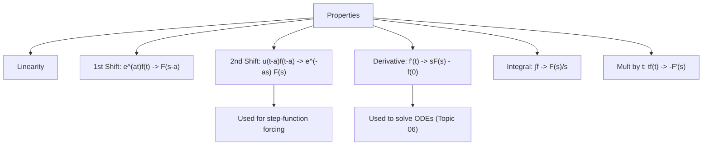

# 03. Properties of Laplace Transform and Applications

## Overview

The [→ elementary transform table](02_laplace_transform_of_elementary_functions.md) only covers simple functions. These operational **properties** let you transform shifted, multiplied, differentiated, or integrated versions of those functions *without* re-doing the defining integral. They are the direct machinery behind [→ Inverse Laplace Transform](04_inverse_laplace_transform.md) and [→ ODE solving](06_solution_of_ordinary_differential_equations.md) — the derivative property in particular is *the* reason Laplace transforms solve differential equations.

## Definitions & Key Terms

**1. Unit step function u(t−a)** — *u(t−a) = 0 for t < a, u(t−a) = 1 for t ≥ a.*
> Plain-English: an on/off switch that turns on at t = a.

**2. Shifting theorems** — *rules describing how multiplying by e^(at) (in t-domain) or delaying by a (in t-domain) affects F(s).*

## Core Content

### 1. Linearity

**ℒ{af(t) + bg(t)} = aF(s) + bG(s)**

(Proved in Topic 01 — restated here as the base property everything else builds on.)

### 2. First Shifting Theorem (Shifting in s)

**ℒ{e^(at) f(t)} = F(s − a)**

*Proof (Direct).*

ℒ{e^(at) f(t)} = ∫₀^∞ e^(−st) e^(at) f(t) dt = ∫₀^∞ e^(−(s−a)t) f(t) dt = F(s − a) ∎

### 3. Second Shifting Theorem (Shifting in t)

**ℒ{u(t−a) f(t−a)} = e^(−as) F(s)**

*Proof.* ℒ{u(t−a) f(t−a)} = ∫₀^∞ e^(−st) u(t−a) f(t−a) dt = ∫ₐ^∞ e^(−st) f(t−a) dt (since u = 0 before a). Substitute τ = t − a:

= ∫₀^∞ e^(−s(τ+a)) f(τ) dτ = e^(−as) ∫₀^∞ e^(−sτ) f(τ) dτ = e^(−as) F(s) ∎

> ⚠️ **Practical form:** if given g(t)u(t−a) where g(t) is *not already* written as f(t−a), first rewrite g(t) = f(t−a) by substituting t = (t−a) + a everywhere in g, then apply the theorem.

### 4. Differentiation in t

**ℒ{f′(t)} = sF(s) − f(0)**
**ℒ{f″(t)} = s²F(s) − sf(0) − f′(0)**

*Proof (Induction base case, by parts).* ∫₀^∞ e^(−st) f′(t) dt, let u = e^(−st), dv = f′(t) dt ⇒ du = −s e^(−st) dt, v = f(t):

= [e^(−st) f(t)]₀^∞ + s ∫₀^∞ e^(−st) f(t) dt = (0 − f(0)) + sF(s) = sF(s) − f(0)

(boundary term at ∞ vanishes for f of exponential order, s large enough). Applying this twice to f″ gives the second-derivative formula. ∎ This is **the** property that converts an ODE into an algebraic equation.

### 5. Integration in t

**ℒ{∫₀^t f(u) du} = F(s) / s**

*Proof sketch.* Let g(t) = ∫₀^t f(u) du, so g′(t) = f(t), g(0) = 0. By the derivative property, ℒ{g′(t)} = sG(s) − g(0) = sG(s) = F(s) ⇒ G(s) = F(s)/s. ∎

### 6. Multiplication by t

**ℒ{t f(t)} = −F′(s)**

*Proof sketch.* Differentiate F(s) = ∫₀^∞ e^(−st) f(t) dt with respect to s under the integral sign: F′(s) = ∫₀^∞ (−t) e^(−st) f(t) dt = −ℒ{t f(t)}, so ℒ{t f(t)} = −F′(s). ∎

### 7. Initial Value Theorem

**f(0⁺) = lim(s→∞) sF(s)**

### 8. Final Value Theorem

**lim(t→∞) f(t) = lim(s→0) sF(s)**

> ⚠️ **Condition:** valid only if f(t) has a genuine limit as t → ∞ (all poles of sF(s) must lie in the left half-plane; it fails for undamped oscillations like sin t, where the "limit" does not exist).

## Worked Examples

### Example 1 — 🟢 Foundational
Find ℒ{e^(2t) t³} using the first shifting theorem.

**Solution**

ℒ{t³} = 3!/s⁴ = 6/s⁴ = F(s). Shift s → s − 2:

ℒ{e^(2t) t³} = F(s−2) = 6/(s−2)⁴

**Answer:** 6/(s−2)⁴

### Example 2 — 🟡 Intermediate
Find ℒ{t sin at} using the multiplication-by-t property.

**Solution**

F(s) = ℒ{sin at} = a/(s²+a²). Then ℒ{t sin at} = −F′(s):

F′(s) = a · d/ds[1/(s²+a²)] = a · (−2s)/(s²+a²)² = −2as/(s²+a²)²

ℒ{t sin at} = −F′(s) = 2as/(s²+a²)²

**Answer:** 2as/(s²+a²)²

### Example 3 — 🔴 Advanced / Exam-level
Using the derivative property, find ℒ{y″} in terms of Y(s) given y(0) = 2, y′(0) = −1, and hence write ℒ{y″ + 3y′ + 2y} if y(t) satisfies these initial conditions (leave Y(s) symbolic).

**Solution**

ℒ{y′} = sY(s) − y(0) = sY(s) − 2

ℒ{y″} = s²Y(s) − sy(0) − y′(0) = s²Y(s) − 2s − (−1) = s²Y(s) − 2s + 1

Now combine with linearity:

ℒ{y″ + 3y′ + 2y} = [s²Y(s) − 2s + 1] + 3[sY(s) − 2] + 2Y(s)

= (s² + 3s + 2)Y(s) − 2s + 1 − 6 = (s² + 3s + 2)Y(s) − 2s − 5

**Answer:** (s² + 3s + 2)Y(s) − 2s − 5 — this is exactly the algebraic form used in Topic 06.

## Applications

- **Circuits with switches** — the second shifting theorem models a voltage/current source that switches on at t = a, giving the characteristic e^(−as) factor seen in step-response problems.
- **Converting ODEs to algebra** — the derivative property is applied in every problem in [→ Topic 06](06_solution_of_ordinary_differential_equations.md); without it Laplace methods would not solve differential equations at all.

## Diagram / Visual

*Figure 1: Map of the seven core properties and their main downstream use.*

## Common Mistakes

- ❌ **Mistake:** In the first shifting theorem, shifting the wrong direction (writing F(s+a) instead of F(s−a) for e^(at) f(t)).
  ✅ **Correct:** Multiplying by e^(+at) shifts s → s−a (subtract a); memorise via ℒ{e^(at)} = 1/(s−a).
- ❌ **Mistake:** Forgetting the e^(−as) factor when applying the second shifting theorem, or using it when the function isn't actually delayed.
  ✅ **Correct:** The e^(−as) only appears when u(t−a) multiplies a *shifted* function f(t−a) — rewrite the given function in that exact form first.
- ❌ **Mistake:** Dropping initial-condition terms in the derivative property, e.g. writing ℒ{f′(t)} = sF(s).
  ✅ **Correct:** Always subtract f(0) (and for f″, also sf(0) + f′(0)) — this is what encodes initial conditions into the algebra.
- ❌ **Mistake:** Applying the final value theorem to functions like sin t or unstable growing responses.
  ✅ **Correct:** Check first that f(t) actually has a finite limit as t → ∞ (equivalently, poles of sF(s) in the left half plane) before using FVT.
- ❌ **Mistake:** Sign error in ℒ{t f(t)} = −F′(s) (forgetting the minus sign).
  ✅ **Correct:** Differentiating e^(−st) with respect to s brings down −t, so the minus sign is required.

## Practice Problems

**Problem 1:** Find ℒ{e^(−3t) cos 2t} using the first shifting theorem.

Solution

ℒ{cos 2t} = s/(s²+4). Shift s → s+3: (s+3)/[(s+3)²+4]

**Answer:** (s+3)/[(s+3)²+4]

**Problem 2:** Find ℒ{e^(4t) t²}.

Solution

ℒ{t²} = 2/s³. Shift s → s−4: 2/(s−4)³

**Answer:** 2/(s−4)³

**Problem 3:** Find ℒ{u(t−2)} (special case, f = 1).

Solution

f(t) = 1 ⇒ F(s) = 1/s. Second shift with a = 2: e^(−2s) · 1/s

**Answer:** e^(−2s)/s

**Problem 4:** Find ℒ{u(t−1)(t−1)²}.

Solution

Already in form f(t−1) with f(t) = t², F(s) = 2/s³. Second shift, a = 1: e^(−s) · 2/s³

**Answer:** 2e^(−s)/s³

**Problem 5:** Find ℒ{u(t−3) t} (function NOT already shifted — rewrite first).

Solution

Write t = (t−3) + 3, so u(t−3)·t = u(t−3)[(t−3)+3]. Let f(t) = t + 3; then f(t−3) = (t−3)+3 = t. ✓ matches.

F(s) = ℒ{t+3} = 1/s² + 3/s. Apply second shift, a = 3:

e^(−3s) (1/s² + 3/s)

**Answer:** e^(−3s) (1/s² + 3/s)

**Problem 6:** Find ℒ{f′(t)} given f(0) = 5, F(s) = 3/(s²+4).

Solution

ℒ{f′} = sF(s) − f(0) = 3s/(s²+4) − 5

**Answer:** 3s/(s²+4) − 5

**Problem 7:** Find ℒ{∫₀^t e^(2u) du} using the integration property.

Solution

f(t) = e^(2t) ⇒ F(s) = 1/(s−2). Integration property: F(s)/s = 1/[s(s−2)]

**Answer:** 1/[s(s−2)]

**Problem 8:** Find ℒ{t cos at} using multiplication by t.

Solution

F(s) = s/(s²+a²). F′(s) = [(s²+a²) − s(2s)]/(s²+a²)² = (a²−s²)/(s²+a²)²

ℒ{t cos at} = −F′(s) = (s²−a²)/(s²+a²)²

**Answer:** (s²−a²)/(s²+a²)²

**Problem 9:** Verify the initial value theorem for f(t) = cos at, where F(s) = s/(s²+a²).

Solution

lim(s→∞) sF(s) = lim(s→∞) s²/(s²+a²) = 1. Direct: f(0⁺) = cos 0 = 1 ✓ matches.

**Answer:** Both give 1; theorem verified.

**Problem 10:** Verify the final value theorem for f(t) = 1 − e^(−2t) (which → 1 as t → ∞), given F(s) = 1/s − 1/(s+2) = 2/[s(s+2)].

Solution

lim(s→0) sF(s) = lim(s→0) 2s/[s(s+2)] = lim(s→0) 2/(s+2) = 1

Direct limit: lim(t→∞) (1 − e^(−2t)) = 1 ✓ matches. (Poles of sF(s) all in left half-plane, so FVT is valid here.)

**Answer:** Both equal 1.

**Problem 11 (exam-style, identify the property yourself):** Find ℒ{t² e^(−t) sin 2t} — decide which combination of properties applies.

Solution

Two properties needed: first shift then multiplication by t twice (or vice versa). Start from ℒ{sin 2t} = 2/(s²+4).

First shift (e^(−t), s → s+1): G(s) = 2/[(s+1)²+4]

Now apply mult-by-t twice: ℒ{t² g(t)} = G″(s) (since two derivatives, sign flips twice back to +).

G(s) = 2[(s+1)²+4]⁻¹. G′(s) = −2·2(s+1)[(s+1)²+4]⁻² = −4(s+1)/[(s+1)²+4]²

G″(s) = −4 · {[(s+1)²+4]² − (s+1)·2[(s+1)²+4]·2(s+1)} / [(s+1)²+4]⁴

= −4 · {[(s+1)²+4] − 4(s+1)²} / [(s+1)²+4]³ = −4[4 − 3(s+1)²] / [(s+1)²+4]³ = [12(s+1)² − 16] / [(s+1)²+4]³

**Answer:** ℒ{t² e^(−t) sin 2t} = [12(s+1)² − 16] / [(s+1)²+4]³

**Problem 12 (exam-style, mixed method choice):** A function satisfies g(t) = u(t−2) e^(−(t−2)). Find ℒ{g(t)}, then use the initial value theorem style limit check that sF(s) → 0 as s → ∞ is consistent with g(0⁺) = 0.

Solution

Already shifted form, f(t) = e^(−t) ⇒ F(s) = 1/(s+1). Second shift, a = 2: G(s) = e^(−2s) · 1/(s+1)

Check: sG(s) = s e^(−2s)/(s+1) → 0 as s → ∞ (since e^(−2s) → 0 dominates) — consistent with g(t) = 0 for t < 2, i.e. g(0⁺) = 0.

**Answer:** G(s) = e^(−2s)/(s+1)

## Summary

| Concept | Result | Condition / Limit |
|---|---|---|
| Linearity | aF(s) + bG(s) | always |
| 1st Shift | ℒ{e^(at) f} = F(s−a) | — |
| 2nd Shift | ℒ{u(t−a) f(t−a)} = e^(−as) F(s) | function must be in shifted form |
| Derivative | ℒ{f′} = sF(s) − f(0) | encodes initial conditions |
| Integral | ℒ{∫₀^t f} = F(s)/s | — |
| Mult. by t | ℒ{tf} = −F′(s) | — |
| Initial Value | f(0⁺) = lim(s→∞) sF(s) | — |
| Final Value | lim(t→∞) f(t) = lim(s→0) sF(s) | limit must genuinely exist |

Next: [→ 04. Inverse Laplace Transform](04_inverse_laplace_transform.md) uses these same properties in reverse to recover f(t) from F(s).

## References

1. **Erwin Kreyszig, Advanced Engineering Mathematics, 10th Ed.** — *Standard proofs of shifting and derivative theorems.*
2. **R. K. Jain & S. R. K. Iyengar, Advanced Engineering Mathematics** — *Worked exam-style problems on properties.*
3. **L. Debnath & D. Bhatta, Integral Transforms and Their Applications** — *Rigorous treatment of initial/final value theorems and their validity conditions.*
4. **Wolfram MathWorld — "Laplace Transform"** — *Verification of derivative and shifting formulas.* https://mathworld.wolfram.com/LaplaceTransform.html
