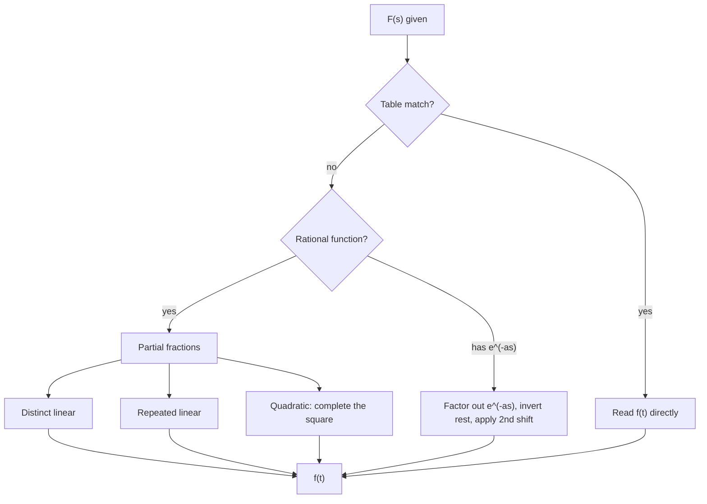

# 04. Inverse Laplace Transform

## Overview

Given $F(s)$, the inverse Laplace transform recovers $f(t)$ — the operation runs the map from [→ 01. Definition](01_definition_of_laplace_transform.md) backward. This is the single most practice-heavy skill in the unit because [→ ODE](06_solution_of_ordinary_differential_equations.md) and [→ PDE](07_solution_of_partial_differential_equations.md) solving always end with "now take the inverse transform." Almost every technique here is partial-fraction decomposition combined with the [→ table](02_laplace_transform_of_elementary_functions.md) and [→ shifting theorems](03_properties_and_applications.md).

## Definitions & Key Terms

**1. Inverse Laplace Transform** — *$\mathcal{L}^{-1}\{F(s)\}=f(t)$ such that $\mathcal{L}\{f(t)\}=F(s)$.*
> Plain-English: "undo" the transform — look up (or algebraically reduce to) a table entry.

**2. Linearity of $\mathcal{L}^{-1}$** — *$\mathcal{L}^{-1}\{aF(s)+bG(s)\}=af(t)+bg(t)$ (inherited directly from linearity of $\mathcal{L}$).*

**3. Partial fractions** — *rewriting a rational function $P(s)/Q(s)$ as a sum of simpler fractions, each matching a table entry.*

## Core Content

### Method 1 — Direct table use
If $F(s)$ already matches (or can be trivially rescaled to) a table entry, read $f(t)$ off directly.

### Method 2 — Partial fractions: distinct linear factors
$$\frac{P(s)}{(s-a)(s-b)} = \frac{A}{s-a}+\frac{B}{s-b}$$
Then $\mathcal{L}^{-1}\left\{\dfrac{A}{s-a}\right\}=Ae^{at}$.

### Method 3 — Repeated linear factors
$$\frac{P(s)}{(s-a)^n} = \frac{A_1}{s-a}+\frac{A_2}{(s-a)^2}+\cdots+\frac{A_n}{(s-a)^n}$$
Use $\mathcal{L}^{-1}\left\{\dfrac{1}{(s-a)^k}\right\}=\dfrac{t^{k-1}}{(k-1)!}e^{at}$ (from the $t^ne^{at}$ table entry).

### Method 4 — Irreducible quadratic factors / completing the square
For $\dfrac{P(s)}{s^2+bs+c}$ with $b^2-4c<0$, complete the square: $s^2+bs+c=(s+\frac b2)^2+\left(c-\frac{b^2}4\right)$, then match to $\dfrac{s-a}{(s-a)^2+\omega^2}$ or $\dfrac{\omega}{(s-a)^2+\omega^2}$ (the shifted sine/cosine forms from Topic 02/03).

### Method 5 — First and second shifting theorems in reverse
- If $F(s)=G(s-a)$: $\mathcal{L}^{-1}\{F(s)\}=e^{at}g(t)$.
- If $F(s)=e^{-as}G(s)$: $\mathcal{L}^{-1}\{F(s)\}=u(t-a)g(t-a)$.

**General procedure:**
1. Check if $F(s)$ is already a table entry.
2. If rational and proper, do partial fractions (choose method 2/3/4 based on the factor type).
3. If $F(s)$ contains $e^{-as}$, factor it out, invert the rest, then apply the second shifting theorem last.
4. Recombine using linearity.

## Worked Examples

### Example 1 — 🟢 Foundational
Find $\mathcal{L}^{-1}\left\{\dfrac{3}{s^2+9}\right\}$.

**Solution**
Match to $\mathcal{L}\{\sin at\}=\dfrac{a}{s^2+a^2}$ with $a=3$ — already exact.
**Answer:** $f(t)=\sin3t$

### Example 2 — 🟡 Intermediate
Find $\mathcal{L}^{-1}\left\{\dfrac{5s+3}{(s-1)(s+2)}\right\}$ (distinct linear factors).

**Solution**
$$\frac{5s+3}{(s-1)(s+2)} = \frac{A}{s-1}+\frac{B}{s+2}$$
$$5s+3 = A(s+2)+B(s-1)$$
At $s=1$: $8=3A\Rightarrow A=\dfrac83$. At $s=-2$: $-7=-3B\Rightarrow B=\dfrac73$.
$$F(s)=\frac{8/3}{s-1}+\frac{7/3}{s+2}$$
**Answer:** $f(t)=\dfrac83e^{t}+\dfrac73e^{-2t}$

### Example 3 — 🔴 Advanced / Exam-level
Find $\mathcal{L}^{-1}\left\{\dfrac{e^{-3s}(2s+1)}{s^2+2s+5}\right\}$ (quadratic factor + second shifting, exam-level).

**Solution**
First invert $G(s)=\dfrac{2s+1}{s^2+2s+5}$, ignoring $e^{-3s}$ for now. Complete the square: $s^2+2s+5=(s+1)^2+4$.
Write numerator in terms of $(s+1)$: $2s+1 = 2(s+1)-1$.
$$G(s)=\frac{2(s+1)-1}{(s+1)^2+4}=2\cdot\frac{s+1}{(s+1)^2+4}-\frac12\cdot\frac{2}{(s+1)^2+4}$$
Match to $e^{at}\cos bt \leftrightarrow \dfrac{s-a}{(s-a)^2+b^2}$ and $e^{at}\sin bt\leftrightarrow\dfrac{b}{(s-a)^2+b^2}$ with $a=-1,b=2$:
$$g(t) = 2e^{-t}\cos2t - \tfrac12 e^{-t}\sin2t$$
Now apply the second shifting theorem for the $e^{-3s}$ factor ($a=3$):
$$f(t) = u(t-3)\,g(t-3) = u(t-3)\left[2e^{-(t-3)}\cos2(t-3) - \tfrac12 e^{-(t-3)}\sin2(t-3)\right]$$
**Answer:** $f(t)=u(t-3)\left[2e^{-(t-3)}\cos2(t-3)-\dfrac12e^{-(t-3)}\sin2(t-3)\right]$

## Applications

- **ODE solutions** — every ODE solved via Laplace (Topic 06) ends with an inverse transform to return to $y(t)$.
- **Circuit step responses** — inverse transforms with $e^{-as}$ factors directly give the time-domain response of a system to a delayed switch/pulse input.

## Diagram / Visual

*Figure 1: Decision workflow for choosing an inverse Laplace transform method.*

## Common Mistakes

- ❌ **Mistake:** Forgetting to complete the square before matching a quadratic denominator to the sin/cos shifted forms.
  ✅ **Correct:** Always rewrite $s^2+bs+c$ as $(s+b/2)^2 + (\text{positive constant})$ first.
- ❌ **Mistake:** Splitting the numerator incorrectly when completing the square (e.g. forgetting to rewrite the numerator in terms of $(s-a)$).
  ✅ **Correct:** Write numerator as $A(s-a) + B$ explicitly, matching cosine and sine parts separately.
- ❌ **Mistake:** Applying the second shifting theorem before inverting the rest of $F(s)$, or forgetting to replace $t\to (t-a)$ everywhere in $g(t)$.
  ✅ **Correct:** Always invert $G(s)$ first to get $g(t)$, THEN substitute $t\to t-a$ and multiply by $u(t-a)$.
- ❌ **Mistake:** Partial-fraction sign errors when solving for constants (especially with repeated roots).
  ✅ **Correct:** Double-check by substituting convenient values of $s$ (the roots) and, for repeated factors, compare coefficients of the highest power of $s$ as a sanity check.
- ❌ **Mistake:** Using $\mathcal{L}^{-1}\{1/(s-a)^k\}$ without the $1/(k-1)!$ factor.
  ✅ **Correct:** $\mathcal{L}^{-1}\{1/(s-a)^k\} = \dfrac{t^{k-1}}{(k-1)!}e^{at}$ — the factorial in the denominator is essential.

## Practice Problems

**Problem 1:** Find $\mathcal{L}^{-1}\left\{\dfrac{4}{s^3}\right\}$.

Solution

Match $n!/s^{n+1}$ with $n=2$: $t^2/2$. So $4\cdot t^2/2=2t^2$

**Answer:** $2t^2$

**Problem 2:** Find $\mathcal{L}^{-1}\left\{\dfrac{s}{s^2+16}\right\}$.

Solution

Direct match to $\cos at$, $a=4$

**Answer:** $\cos4t$

**Problem 3:** Find $\mathcal{L}^{-1}\left\{\dfrac{2}{s-5}\right\}$.

Solution

$2e^{5t}$

**Answer:** $2e^{5t}$

**Problem 4:** Find $\mathcal{L}^{-1}\left\{\dfrac{1}{(s+2)(s+3)}\right\}$ (distinct linear factors).

Solution

$\dfrac1{(s+2)(s+3)}=\dfrac{A}{s+2}+\dfrac B{s+3}$. $1=A(s+3)+B(s+2)$. $s=-2: A=1$. $s=-3: B=-1$.

$f(t)=e^{-2t}-e^{-3t}$

**Answer:** $e^{-2t}-e^{-3t}$

**Problem 5:** Find $\mathcal{L}^{-1}\left\{\dfrac{3s+2}{s(s-1)}\right\}$.

Solution

$\dfrac{3s+2}{s(s-1)}=\dfrac As+\dfrac B{s-1}$. $3s+2=A(s-1)+Bs$. $s=0: 2=-A\Rightarrow A=-2$. $s=1: 5=B$.

$F(s)=\dfrac{-2}{s}+\dfrac5{s-1}$

**Answer:** $f(t)=-2+5e^{t}$

**Problem 6:** Find $\mathcal{L}^{-1}\left\{\dfrac{1}{(s-2)^2}\right\}$ (repeated linear factor).

Solution

Match $t^{k-1}e^{at}/(k-1)!$, $k=2,a=2$: $t\cdot e^{2t}/1!=te^{2t}$

**Answer:** $te^{2t}$

**Problem 7:** Find $\mathcal{L}^{-1}\left\{\dfrac{3}{(s+1)^3}\right\}$.

Solution

$k=3,a=-1$: $\dfrac{t^2}{2!}e^{-t}=\dfrac{t^2}{2}e^{-t}$. Times 3: $\dfrac{3t^2}{2}e^{-t}$

**Answer:** $\dfrac32t^2e^{-t}$

**Problem 8:** Find $\mathcal{L}^{-1}\left\{\dfrac{s+1}{(s-3)^2}\right\}$ (repeated factor, split numerator).

Solution

Write $s+1=(s-3)+4$: $\dfrac{(s-3)+4}{(s-3)^2}=\dfrac1{s-3}+\dfrac4{(s-3)^2}$

$f(t)=e^{3t}+4te^{3t}$

**Answer:** $(1+4t)e^{3t}$

**Problem 9:** Find $\mathcal{L}^{-1}\left\{\dfrac{1}{s^2+2s+5}\right\}$ (complete the square).

Solution

$s^2+2s+5=(s+1)^2+4$. Match $b/((s-a)^2+b^2)$ with $a=-1,b=2$, need numerator $2$:

$F(s)=\dfrac12\cdot\dfrac2{(s+1)^2+4}$

**Answer:** $f(t)=\dfrac12e^{-t}\sin2t$

**Problem 10:** Find $\mathcal{L}^{-1}\left\{\dfrac{s+3}{s^2+4s+13}\right\}$ (completing the square, mixed sin+cos).

Solution

$s^2+4s+13=(s+2)^2+9$. Numerator: $s+3=(s+2)+1$.

$$F(s)=\frac{(s+2)+1}{(s+2)^2+9}=\frac{s+2}{(s+2)^2+9}+\frac13\cdot\frac{3}{(s+2)^2+9}$$

**Answer:** $f(t)=e^{-2t}\cos3t+\dfrac13e^{-2t}\sin3t$

**Problem 11:** Find $\mathcal{L}^{-1}\left\{\dfrac{e^{-2s}}{s-4}\right\}$ (2nd shifting).

Solution

$G(s)=\dfrac1{s-4}\Rightarrow g(t)=e^{4t}$. Apply 2nd shift, $a=2$: $f(t)=u(t-2)e^{4(t-2)}$

**Answer:** $u(t-2)e^{4(t-2)}$

**Problem 12:** Find $\mathcal{L}^{-1}\left\{\dfrac{e^{-\pi s/2}\cdot 3}{s^2+9}\right\}$.

Solution

$G(s)=\dfrac3{s^2+9}\Rightarrow g(t)=\sin3t$. Shift $a=\pi/2$: $f(t)=u(t-\pi/2)\sin\!\big(3(t-\pi/2)\big)$

**Answer:** $u(t-\tfrac\pi2)\sin\!\big(3(t-\tfrac\pi2)\big)$

**Problem 13 (exam-style, choose the method):** Find $\mathcal{L}^{-1}\left\{\dfrac{2s^2+5s+7}{(s-1)(s^2+4)}\right\}$ (mixed linear + irreducible quadratic).

Solution

$$\frac{2s^2+5s+7}{(s-1)(s^2+4)}=\frac{A}{s-1}+\frac{Bs+C}{s^2+4}$$

$2s^2+5s+7 = A(s^2+4)+(Bs+C)(s-1)$

$s=1$: $2+5+7=14=5A\Rightarrow A=\dfrac{14}5$

Expand and compare coefficients of $s^2$: $2=A+B\Rightarrow B=2-\dfrac{14}5=-\dfrac45$

Constant term: $7=4A-C\Rightarrow C=4A-7=\dfrac{56}5-7=\dfrac{21}5$

$$F(s)=\frac{14/5}{s-1}+\frac{-\tfrac45 s+\tfrac{21}5}{s^2+4}=\frac{14/5}{s-1}-\frac45\cdot\frac{s}{s^2+4}+\frac{21}{10}\cdot\frac2{s^2+4}$$

**Answer:** $f(t)=\dfrac{14}5e^{t}-\dfrac45\cos2t+\dfrac{21}{10}\sin2t$

**Problem 14 (exam-style):** Find $\mathcal{L}^{-1}\left\{\dfrac{s^2}{(s^2+1)^2}\right\}$ (needs recognising a derivative-type table result, treat as advanced practice).

Solution

Use the known pair $\mathcal{L}\{t\sin t\}=\dfrac{2s}{(s^2+1)^2}$ and $\mathcal{L}\{\sin t - t\cos t\}=\dfrac2{(s^2+1)^2}$ (standard derived results — can be built from mult.-by-$t$ on $\cos t$).

Write $\dfrac{s^2}{(s^2+1)^2}=\dfrac{(s^2+1)-1}{(s^2+1)^2}=\dfrac1{s^2+1}-\dfrac1{(s^2+1)^2}$

$\mathcal{L}^{-1}\left\{\dfrac1{s^2+1}\right\}=\sin t$. For $\dfrac1{(s^2+1)^2}$, use $\dfrac12(\sin t - t\cos t)$ (standard table result).

**Answer:** $f(t)=\sin t - \dfrac12(\sin t - t\cos t)=\dfrac12\sin t+\dfrac12t\cos t$

**Problem 15 (exam-style, fully mixed):** Find $\mathcal{L}^{-1}\left\{\dfrac{s+1}{s^2(s+2)}\right\}$.

Solution

Repeated factor at $s=0$ (order 2) plus a simple factor. $\dfrac{s+1}{s^2(s+2)}=\dfrac As+\dfrac B{s^2}+\dfrac C{s+2}$

$s+1=As(s+2)+B(s+2)+Cs^2$

$s=0: 1=2B\Rightarrow B=\dfrac12$

$s=-2: -1=4C\Rightarrow C=-\dfrac14$

Compare $s^2$ coefficients: $0=A+C\Rightarrow A=\dfrac14$

$$F(s)=\frac{1/4}{s}+\frac{1/2}{s^2}-\frac{1/4}{s+2}$$

**Answer:** $f(t)=\dfrac14+\dfrac12t-\dfrac14e^{-2t}$

## Summary

| Concept | Result | Condition / Limit |
|---|---|---|
| Distinct linear factors | $\sum \dfrac{A_i}{s-a_i}\to \sum A_ie^{a_it}$ | denominator fully factors, real distinct roots |
| Repeated linear factor | $\dfrac1{(s-a)^k}\to\dfrac{t^{k-1}}{(k-1)!}e^{at}$ | order $k$ root |
| Irreducible quadratic | complete the square, match shifted sin/cos | complex conjugate roots |
| 2nd shift (reverse) | $e^{-as}G(s)\to u(t-a)g(t-a)$ | invert $G(s)$ first |

Next: [→ 05. Convolution Theorem](05_convolution_theorem.md) gives an alternative inversion route for products of two transforms that don't decompose nicely by partial fractions.

## References

1. **Erwin Kreyszig, Advanced Engineering Mathematics, 10th Ed.** — *Standard partial-fraction inversion techniques.*
2. **R. K. Jain & S. R. K. Iyengar, Advanced Engineering Mathematics** — *Exam-style mixed inversion problems.*
3. **James Stewart, Calculus** — *Partial fraction decomposition technique reference (algebraic method).*
4. **Wolfram MathWorld — "Inverse Laplace Transform"** — *Formula verification.* https://mathworld.wolfram.com/InverseLaplaceTransform.html
