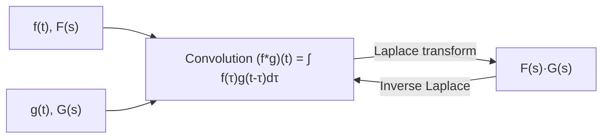

# 05. Convolution Theorem

## Overview

[→ Partial fractions](04_inverse_laplace_transform.md) can invert most rational $F(s)$, but when $F(s)=F_1(s)F_2(s)$ is a product of two transforms whose inverse you already know individually (especially with repeated or awkward denominators), convolution gives a direct route to $f(t)$ without decomposing fractions. It is also used in [→ ODE solving](06_solution_of_ordinary_differential_equations.md) when the forcing function $f(t)$ has no clean Laplace transform of its own but the system's impulse response does.

## Definitions & Key Terms

**1. Convolution** — *for functions $f,g$ defined on $[0,\infty)$,*
$$(f*g)(t) = \int_0^t f(\tau)\,g(t-\tau)\,d\tau$$
> Plain-English: "smear" one function across the other, sliding one along the time axis and integrating the overlap — an operation that behaves like multiplication in the $s$-domain.

**2. Commutativity of convolution** — *$f*g = g*f$ (can be shown by substitution $u=t-\tau$).*

## Core Content

**Theorem (Convolution Theorem).**
$$\boxed{\mathcal{L}\{f*g\} = F(s)G(s)}\qquad\text{equivalently}\qquad\boxed{\mathcal{L}^{-1}\{F(s)G(s)\} = (f*g)(t)}$$

*Proof (sketch, appropriate for this course).* Start from the definition:
$$\mathcal{L}\{(f*g)(t)\} = \int_0^\infty e^{-st}\left(\int_0^t f(\tau)g(t-\tau)\,d\tau\right)dt$$
This is a double integral over the region $0\le\tau\le t<\infty$. Swap the order of integration (valid under the same exponential-order conditions as Topic 01) so $\tau$ ranges over $[0,\infty)$ and, for fixed $\tau$, $t$ ranges over $[\tau,\infty)$:
$$= \int_0^\infty f(\tau)\left(\int_\tau^\infty e^{-st}g(t-\tau)\,dt\right)d\tau$$
Substitute $u=t-\tau$ in the inner integral ($t=u+\tau,\,dt=du$):
$$\int_0^\infty e^{-s(u+\tau)}g(u)\,du = e^{-s\tau}\int_0^\infty e^{-su}g(u)\,du = e^{-s\tau}G(s)$$
So the whole expression becomes:
$$\int_0^\infty f(\tau)e^{-s\tau}G(s)\,d\tau = G(s)\int_0^\infty f(\tau)e^{-s\tau}\,d\tau = G(s)F(s) \blacksquare$$

**Practical procedure for using convolution to invert $F(s)G(s)$:**
1. Identify the two factors $F(s)$ and $G(s)$ whose inverses $f(t),\,g(t)$ you already know.
2. Set up $\displaystyle (f*g)(t)=\int_0^t f(\tau)g(t-\tau)\,d\tau$.
3. Substitute and evaluate the integral in $\tau$ (treating $t$ as a constant during integration).
4. The result is $\mathcal{L}^{-1}\{F(s)G(s)\}$ — no partial fractions needed.

> Convolution is especially efficient when denominators are **repeated** (e.g. $\dfrac1{(s^2+a^2)^2}$) or when one factor doesn't correspond to a simple table entry on its own.

## Worked Examples

### Example 1 — 🟢 Foundational
Verify the convolution theorem for $f(t)=1,\ g(t)=t$ by computing both sides.

**Solution**
Direct convolution: $(f*g)(t)=\displaystyle\int_0^t 1\cdot(t-\tau)\,d\tau = \left[t\tau-\frac{\tau^2}2\right]_0^t = t^2-\frac{t^2}2=\frac{t^2}2$

Transform side: $F(s)=\dfrac1s,\ G(s)=\dfrac1{s^2}\Rightarrow F(s)G(s)=\dfrac1{s^3}$, and $\mathcal{L}^{-1}\{1/s^3\}=\dfrac{t^2}{2!}=\dfrac{t^2}2$ ✓ matches.
**Answer:** $(f*g)(t)=\dfrac{t^2}2$, confirming the theorem.

### Example 2 — 🟡 Intermediate
Find $\mathcal{L}^{-1}\left\{\dfrac{1}{s(s-2)}\right\}$ using convolution.

**Solution**
Let $F(s)=\dfrac1s\Rightarrow f(t)=1$, $G(s)=\dfrac1{s-2}\Rightarrow g(t)=e^{2t}$.
$$(f*g)(t)=\int_0^t 1\cdot e^{2(t-\tau)}\,d\tau = e^{2t}\int_0^t e^{-2\tau}\,d\tau = e^{2t}\left[\frac{-e^{-2\tau}}2\right]_0^t=e^{2t}\cdot\frac{1-e^{-2t}}2$$
$$=\frac{e^{2t}-1}2$$
**Answer:** $f(t)=\dfrac{e^{2t}-1}2$

### Example 3 — 🔴 Advanced / Exam-level
Find $\mathcal{L}^{-1}\left\{\dfrac{1}{(s^2+a^2)^2}\right\}$ using convolution (repeated quadratic factor — convolution is clearly the easiest method here).

**Solution**
Write $F(s)G(s)=\dfrac1{s^2+a^2}\cdot\dfrac1{s^2+a^2}$ with $f(t)=g(t)=\dfrac1a\sin at$ (since $\mathcal{L}\{\sin at\}=a/(s^2+a^2)$, so $\mathcal{L}^{-1}\{1/(s^2+a^2)\}=\frac1a\sin at$).
$$(f*g)(t)=\frac1{a^2}\int_0^t \sin a\tau\,\sin a(t-\tau)\,d\tau$$
Use the product-to-sum identity $\sin A\sin B=\tfrac12[\cos(A-B)-\cos(A+B)]$ with $A=a\tau,\ B=a(t-\tau)$, so $A-B=a(2\tau-t)$, $A+B=at$:
$$=\frac1{2a^2}\int_0^t\left[\cos\big(a(2\tau-t)\big)-\cos at\right]d\tau$$
The second term integrates trivially: $-\cos at\cdot t$. For the first, integrate directly (antiderivative in $\tau$ is $\frac1{2a}\sin(a(2\tau-t))$):
$$\int_0^t \cos(a(2\tau-t))\,d\tau = \left[\frac{\sin(a(2\tau-t))}{2a}\right]_0^t = \frac{\sin(at)-\sin(-at)}{2a}=\frac{2\sin at}{2a}=\frac{\sin at}{a}$$
So:
$$(f*g)(t)=\frac1{2a^2}\left(\frac{\sin at}{a}-t\cos at\right) = \frac{\sin at - at\cos at}{2a^3}$$
**Answer:** $\mathcal{L}^{-1}\left\{\dfrac1{(s^2+a^2)^2}\right\}=\dfrac{\sin at - at\cos at}{2a^3}$

## Applications

- **System response to arbitrary input** — in control/circuit theory, the output of a linear system equals the convolution of the input with the system's impulse response; the Laplace form $Y(s)=F(s)G(s)$ is why transfer functions multiply.
- **Repeated-pole inversion** — as in Example 3, convolution avoids messy partial fractions for terms like $1/(s^2+a^2)^2$ that arise in resonance/ODE problems.

## Diagram / Visual

*Figure 1: Convolution in the time domain corresponds exactly to multiplication in the s-domain.*

## Common Mistakes

- ❌ **Mistake:** Writing $(f*g)(t)=\int_0^t f(\tau)g(\tau)\,d\tau$ (forgetting the time-reversal in the second factor).
  ✅ **Correct:** The second factor must be $g(t-\tau)$, not $g(\tau)$ — this is what makes convolution differ from a plain product integral.
- ❌ **Mistake:** Treating $t$ as a variable of integration instead of a constant while integrating over $\tau$.
  ✅ **Correct:** During the $\tau$-integration, $t$ is fixed; it only reappears after evaluating the definite integral.
- ❌ **Mistake:** Believing $f*g$ pointwise equals $fg$ (confusing convolution with ordinary multiplication).
  ✅ **Correct:** Convolution is the integral operation above; only the *transforms* multiply, not the original functions.
- ❌ **Mistake:** Forgetting the $1/a$ or similar constants inside $f(t),g(t)$ before substituting into the convolution integral.
  ✅ **Correct:** Always write down the exact inverse transforms of each factor first, including all coefficients, before setting up $\int_0^t f(\tau)g(t-\tau)d\tau$.

## Practice Problems

**Problem 1:** Verify $\mathcal{L}\{f*g\}=F(s)G(s)$ for $f(t)=t,\ g(t)=t$.

Solution

$(f*g)(t)=\int_0^t \tau(t-\tau)d\tau = \left[\dfrac{t\tau^2}2-\dfrac{\tau^3}3\right]_0^t=\dfrac{t^3}2-\dfrac{t^3}3=\dfrac{t^3}6$

Transform side: $F(s)G(s)=\dfrac1{s^2}\cdot\dfrac1{s^2}=\dfrac1{s^4}$, $\mathcal{L}^{-1}\{1/s^4\}=t^3/3!=t^3/6$ ✓

**Answer:** $t^3/6$, verified.

**Problem 2:** Find $\mathcal{L}^{-1}\left\{\dfrac1{s^2(s-1)}\right\}$ using convolution.

Solution

$f(t)=t\ (F=1/s^2)$, $g(t)=e^t\ (G=1/(s-1))$

$(f*g)(t)=\int_0^t \tau e^{t-\tau}d\tau = e^t\int_0^t \tau e^{-\tau}d\tau$

By parts: $\int\tau e^{-\tau}d\tau=-\tau e^{-\tau}-e^{-\tau}$, evaluated $0$ to $t$: $[-te^{-t}-e^{-t}]-[0-1]=1-te^{-t}-e^{-t}$

$(f*g)(t)=e^t(1-te^{-t}-e^{-t})=e^t - t - 1$

**Answer:** $e^t-t-1$

**Problem 3:** Find $\mathcal{L}^{-1}\left\{\dfrac1{(s-1)(s-2)}\right\}$ using convolution (cross-check against partial fractions).

Solution

$f(t)=e^t,\ g(t)=e^{2t}$

$(f*g)(t)=\int_0^t e^\tau e^{2(t-\tau)}d\tau=e^{2t}\int_0^t e^{-\tau}d\tau=e^{2t}(1-e^{-t})=e^{2t}-e^t$

Cross-check via partial fractions: $\dfrac1{(s-1)(s-2)}=\dfrac{-1}{s-1}+\dfrac1{s-2}\to -e^t+e^{2t}$ ✓ matches.

**Answer:** $e^{2t}-e^t$

**Problem 4:** Find $\mathcal{L}^{-1}\left\{\dfrac1{s(s^2+1)}\right\}$ using convolution.

Solution

$f(t)=1,\ g(t)=\sin t$

$(f*g)(t)=\int_0^t \sin\tau\,d\tau=[-\cos\tau]_0^t=1-\cos t$

**Answer:** $1-\cos t$

**Problem 5:** Find $\mathcal{L}^{-1}\left\{\dfrac1{s^2(s^2+4)}\right\}$ using convolution.

Solution

$f(t)=t\ (1/s^2)$, $g(t)=\dfrac12\sin2t\ (2/(s^2+4))$, so $G(s)=1/(s^2+4)$ means $g(t)=\frac12\sin2t$.

$(f*g)(t)=\int_0^t \tau\cdot\frac12\sin2(t-\tau)\,d\tau$

Let $I=\int_0^t \tau\sin2(t-\tau)d\tau$. By parts with $u=\tau,\ dv=\sin2(t-\tau)d\tau\Rightarrow v=\frac12\cos2(t-\tau)$:

$I=\left[\frac{\tau}2\cos2(t-\tau)\right]_0^t - \int_0^t \frac12\cos2(t-\tau)d\tau$

$=\frac t2\cos0 - 0 - \frac12\left[-\frac12\sin2(t-\tau)\right]_0^t = \frac t2 - \frac12\left(0+\frac12\sin2t\right)=\frac t2-\frac{\sin2t}4$

So $(f*g)(t)=\frac12 I = \frac t4-\frac{\sin2t}8$

**Answer:** $\dfrac t4-\dfrac{\sin2t}8$

**Problem 6:** Find $\mathcal{L}^{-1}\left\{\dfrac{1}{(s+1)^2}\right\}$ two ways: table entry vs. convolution ($f=g=e^{-t}$). Show they agree.

Solution

Table: $\dfrac1{(s+1)^2}\to te^{-t}$ directly.

Convolution: $f(t)=g(t)=e^{-t}$

$(f*g)(t)=\int_0^t e^{-\tau}e^{-(t-\tau)}d\tau=e^{-t}\int_0^t d\tau=te^{-t}$ ✓ matches.

**Answer:** $te^{-t}$, both methods agree.

**Problem 7 (exam-style — convolution is clearly easiest):** Find $\mathcal{L}^{-1}\left\{\dfrac{s}{(s^2+1)^2}\right\}$.

Solution

Write $\dfrac{s}{(s^2+1)^2}=\dfrac{s}{s^2+1}\cdot\dfrac1{s^2+1}$, so $f(t)=\cos t,\ g(t)=\sin t$.

$(f*g)(t)=\int_0^t \cos\tau\sin(t-\tau)d\tau$

Use $\cos A\sin B=\tfrac12[\sin(A+B)-\sin(A-B)]$ with $A=\tau, B=t-\tau$: $\sin(A+B)=\sin t$ (constant in $\tau$), $\sin(A-B)=\sin(2\tau-t)$

$=\frac12\int_0^t[\sin t - \sin(2\tau - t)]\,d\tau = \frac12\left[\tau\sin t + \frac{\cos(2\tau-t)}2\right]_0^t$

$=\frac12\left[\left(t\sin t+\frac{\cos t}2\right)-\left(0+\frac{\cos(-t)}2\right)\right]=\frac12\left[t\sin t+\frac{\cos t}2-\frac{\cos t}2\right]=\frac{t\sin t}2$

**Answer:** $\dfrac{t\sin t}2$

**Problem 8 (exam-style, mixed):** Use convolution to solve for $y(t)$ if $Y(s)=\dfrac1{s(s+3)}$, then verify against partial fractions.

Solution

$f(t)=1,\ g(t)=e^{-3t}$

$(f*g)(t)=\int_0^t e^{-3(t-\tau)}d\tau=e^{-3t}\int_0^t e^{3\tau}d\tau=e^{-3t}\cdot\frac{e^{3t}-1}3=\frac{1-e^{-3t}}3$

Partial fractions check: $\dfrac1{s(s+3)}=\dfrac{1/3}s-\dfrac{1/3}{s+3}\to \dfrac13-\dfrac13e^{-3t}=\dfrac{1-e^{-3t}}3$ ✓ matches.

**Answer:** $y(t)=\dfrac{1-e^{-3t}}3$

## Summary

| Concept | Result | Condition / Limit |
|---|---|---|
| Convolution definition | $(f*g)(t)=\int_0^t f(\tau)g(t-\tau)d\tau$ | $f,g$ defined on $[0,\infty)$ |
| Convolution theorem | $\mathcal{L}\{f*g\}=F(s)G(s)$ | equivalently for $\mathcal{L}^{-1}$ |
| Commutativity | $f*g=g*f$ | always |
| Best use case | repeated/awkward denominators where partial fractions are messy | — |

Next: [→ 06. Solution of Ordinary Differential Equations](06_solution_of_ordinary_differential_equations.md) applies everything so far (transforms, properties, inversion, convolution) to actually solve ODEs.

## References

1. **Erwin Kreyszig, Advanced Engineering Mathematics, 10th Ed.** — *Standard convolution theorem proof and applications.*
2. **R. K. Jain & S. R. K. Iyengar, Advanced Engineering Mathematics** — *Worked convolution problems at university exam level.*
3. **L. Debnath & D. Bhatta, Integral Transforms and Their Applications** — *Rigorous convolution theorem derivation.*
4. **MIT OpenCourseWare 18.03 (Differential Equations)** — *Convolution and system-response interpretation.* https://ocw.mit.edu
