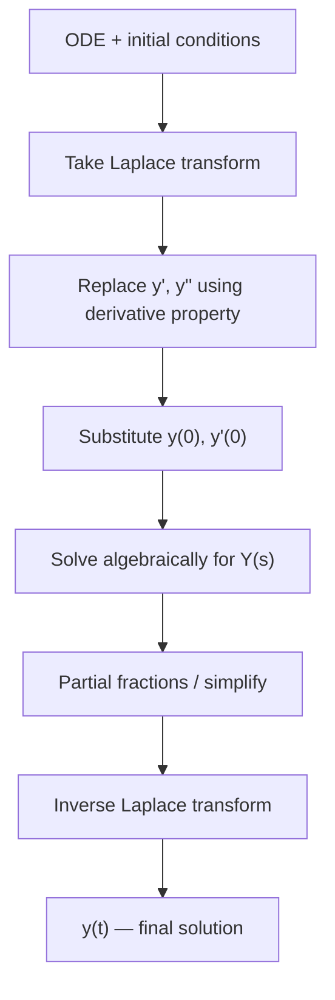

# 06. Solution of Ordinary Differential Equations Using Laplace Transform

## Overview

This is where the whole unit converges: the [→ derivative property](03_properties_and_applications.md#4-differentiation-in-t) turns an ODE with initial conditions into an algebraic equation in $s$, which is solved for $Y(s)$ and then inverted using [→ partial fractions](04_inverse_laplace_transform.md) or [→ convolution](05_convolution_theorem.md). This method is often faster than classical methods (undetermined coefficients, variation of parameters) specifically *because* it builds initial conditions in from the start. It leads directly into [→ PDE solving](07_solution_of_partial_differential_equations.md), which uses the same core idea along a different variable.

## Definitions & Key Terms

**1. Initial value problem (IVP)** — *an ODE together with initial conditions $y(0), y'(0), \dots$ specified at $t=0$.*

**2. Transfer/algebraic equation in $Y(s)$** — *the equation obtained after replacing every derivative term using the derivative property; solving it algebraically for $Y(s)$ is the core step.*

## Core Content — The Standard Workflow

1. Take the Laplace transform of both sides of the ODE.
2. Transform each derivative term using $\mathcal{L}\{y'\}=sY(s)-y(0)$, $\mathcal{L}\{y''\}=s^2Y(s)-sy(0)-y'(0)$, etc.
3. Substitute the given initial conditions immediately.
4. Solve the resulting equation algebraically for $Y(s)$.
5. Simplify $Y(s)$ (combine fractions, factor the denominator).
6. Decompose using partial fractions (or recognise a convolution product).
7. Take the inverse Laplace transform term by term.
8. State the final solution $y(t)$.

### First-order ODEs: $y' + ay = f(t)$

Transform: $sY(s)-y(0) + aY(s) = F(s) \Rightarrow (s+a)Y(s) = F(s)+y(0) \Rightarrow Y(s)=\dfrac{F(s)+y(0)}{s+a}$.

### Second-order ODEs: $y'' + by' + cy = f(t)$

Transform: $\left[s^2Y(s)-sy(0)-y'(0)\right] + b\left[sY(s)-y(0)\right] + cY(s) = F(s)$

$$\Rightarrow (s^2+bs+c)\,Y(s) = F(s) + (s+b)y(0) + y'(0)$$

$$Y(s) = \frac{F(s) + (s+b)y(0) + y'(0)}{s^2+bs+c}$$

The quadratic $s^2+bs+c$ is the **characteristic polynomial** — its roots (real distinct, repeated, or complex) determine whether the homogeneous part of $y(t)$ is a sum of exponentials, a repeated-root form $te^{rt}$, or a damped sinusoid $e^{\sigma t}(\cos\omega t,\sin\omega t)$ (same classification as classical ODE methods, arrived at automatically via partial fractions).

### Higher-order ODEs

The pattern extends directly: each derivative $y^{(n)}$ transforms to $s^nY(s) - s^{n-1}y(0) - s^{n-2}y'(0) - \cdots - y^{(n-1)}(0)$. The workflow (steps 1–8) is unchanged; only the algebra for $Y(s)$ gets longer.

## Worked Examples

### Example 1 — 🟢 Foundational
Solve $y' + 3y = 0,\quad y(0)=2$.

**Solution**
Transform: $sY(s)-2+3Y(s)=0 \Rightarrow (s+3)Y(s)=2 \Rightarrow Y(s)=\dfrac2{s+3}$

Inverse: $y(t)=2e^{-3t}$
**Answer:** $y(t)=2e^{-3t}$

### Example 2 — 🟡 Intermediate
Solve $y'' + 4y = 0,\quad y(0)=0,\ y'(0)=2$ (complex roots case).

**Solution**
Transform: $s^2Y(s)-s(0)-2 + 4Y(s)=0 \Rightarrow (s^2+4)Y(s)=2 \Rightarrow Y(s)=\dfrac2{s^2+4}$

Match to $\mathcal{L}\{\sin at\}=a/(s^2+a^2)$ with $a=2$: already exact form.
**Answer:** $y(t)=\sin2t$

### Example 3 — 🔴 Advanced / Exam-level
Solve $y'' - 3y' + 2y = e^{3t},\quad y(0)=1,\ y'(0)=0$ (exponential forcing + partial fractions).

**Solution**
Transform: $\left[s^2Y-s(1)-0\right]-3\left[sY-1\right]+2Y=\dfrac1{s-3}$
$$(s^2-3s+2)Y(s) - s + 3 = \frac1{s-3}$$
$$(s^2-3s+2)Y(s) = \frac1{s-3}+s-3 = \frac{1+(s-3)^2}{s-3}$$
Factor $s^2-3s+2=(s-1)(s-2)$:
$$Y(s) = \frac{1+(s-3)^2}{(s-3)(s-1)(s-2)}$$
Expand numerator: $1+(s-3)^2 = 1+s^2-6s+9 = s^2-6s+10$. Partial fractions:
$$\frac{s^2-6s+10}{(s-3)(s-1)(s-2)} = \frac A{s-3}+\frac B{s-1}+\frac C{s-2}$$
$s^2-6s+10=A(s-1)(s-2)+B(s-3)(s-2)+C(s-3)(s-1)$

$s=3: 9-18+10=1=A(2)(1)=2A\Rightarrow A=\tfrac12$

$s=1: 1-6+10=5=B(-2)(-1)=2B\Rightarrow B=\tfrac52$

$s=2: 4-12+10=2=C(-1)(1)=-C\Rightarrow C=-2$

$$Y(s)=\frac{1/2}{s-3}+\frac{5/2}{s-1}-\frac{2}{s-2}$$
**Answer:** $y(t)=\dfrac12e^{3t}+\dfrac52e^{t}-2e^{2t}$

## Applications

- **Spring-mass-damper systems** — $my''+cy'+ky=f(t)$ with given initial displacement/velocity is solved exactly by this workflow; the characteristic polynomial's roots give under-/over-/critically-damped behaviour.
- **RLC circuits** — $L\,i''+R\,i'+\dfrac{i}{C}=v'(t)$ IVPs are solved identically, with $F(s)$ built from the source voltage.

## Diagram / Visual

*Figure 1: The eight-step Laplace-transform ODE-solving workflow.*

## Common Mistakes

- ❌ **Mistake:** Forgetting to substitute initial conditions immediately, carrying $y(0)$ symbolically through the algebra and making sign errors later.
  ✅ **Correct:** Plug in numeric initial conditions as soon as the derivative property is applied.
- ❌ **Mistake:** Sign errors when moving terms in $(s^2+bs+c)Y(s) = \cdots$ — especially forgetting the $+(s+b)y(0)+y'(0)$ terms entirely.
  ✅ **Correct:** Write out the full transformed equation term-by-term before rearranging; double-check by re-deriving the general second-order formula.
- ❌ **Mistake:** Incorrect partial-fraction setup when the denominator has a repeated root shared with the forcing function's pole (e.g. resonance case, forcing frequency equals natural frequency).
  ✅ **Correct:** Check if a factor is repeated across numerator and denominator; if so, expect a $t\sin at$ / $t\cos at$-type term (resonance) in the answer — don't force a simple sinusoid.
- ❌ **Mistake:** Forgetting the $u(t-a)$ factor and $e^{-as}$ shift when the forcing function is a step or delayed pulse.
  ✅ **Correct:** Apply the second shifting theorem correctly to $F(s)$ before solving for $Y(s)$, and re-apply it on the way back when inverting.
- ❌ **Mistake:** Stopping at $Y(s)$ and forgetting to invert back to $y(t)$ (very common under exam time pressure).
  ✅ **Correct:** Always finish with an explicit $y(t)=\dots$ statement — a $Y(s)$ answer is incomplete.

## Practice Problems

### Group 1 — Basic first-order

**Problem 1:** Solve $y'+2y=0,\ y(0)=5$.

Solution

$(s+2)Y=5\Rightarrow Y=\dfrac5{s+2}$

**Answer:** $y(t)=5e^{-2t}$

**Problem 2:** Solve $y'-y=0,\ y(0)=-3$.

Solution

$(s-1)Y=-3\Rightarrow Y=\dfrac{-3}{s-1}$

**Answer:** $y(t)=-3e^{t}$

### Group 2 — Intermediate first-order

**Problem 3:** Solve $y'+4y=8,\ y(0)=0$ (constant forcing).

Solution

$sY+4Y=\dfrac8s\Rightarrow (s+4)Y=\dfrac8s\Rightarrow Y=\dfrac{8}{s(s+4)}$

Partial fractions: $\dfrac8{s(s+4)}=\dfrac{2}{s}-\dfrac2{s+4}$

**Answer:** $y(t)=2-2e^{-4t}$

**Problem 4:** Solve $y'-2y=e^{3t},\ y(0)=1$ (exponential forcing).

Solution

$sY-1-2Y=\dfrac1{s-3}\Rightarrow (s-2)Y=1+\dfrac1{s-3}=\dfrac{s-2}{s-3}$

$Y=\dfrac1{s-3}$

**Answer:** $y(t)=e^{3t}$

**Problem 5:** Solve $y'+y=\sin t,\ y(0)=0$ (trig forcing).

Solution

$(s+1)Y=\dfrac1{s^2+1}\Rightarrow Y=\dfrac1{(s+1)(s^2+1)}$

Partial fractions: $\dfrac1{(s+1)(s^2+1)}=\dfrac A{s+1}+\dfrac{Bs+C}{s^2+1}$

$1=A(s^2+1)+(Bs+C)(s+1)$. $s=-1: 1=2A\Rightarrow A=\tfrac12$. Compare $s^2$: $0=A+B\Rightarrow B=-\tfrac12$. Constant: $1=A+C\Rightarrow C=\tfrac12$

$Y=\dfrac{1/2}{s+1}+\dfrac{-\tfrac12 s+\tfrac12}{s^2+1}$

**Answer:** $y(t)=\dfrac12e^{-t}-\dfrac12\cos t+\dfrac12\sin t$

### Group 3 — Basic second-order

**Problem 6:** Solve $y''-y=0,\ y(0)=1,\ y'(0)=0$ (real distinct roots).

Solution

$(s^2-1)Y-s=0\Rightarrow Y=\dfrac{s}{s^2-1}$, matches $\cosh t$ table entry directly.

**Answer:** $y(t)=\cosh t$

**Problem 7:** Solve $y''+9y=0,\ y(0)=2,\ y'(0)=0$.

Solution

$(s^2+9)Y-2s=0\Rightarrow Y=\dfrac{2s}{s^2+9}$, matches $2\cos3t$.

**Answer:** $y(t)=2\cos3t$

**Problem 8:** Solve $y''-4y'+4y=0,\ y(0)=1,\ y'(0)=1$ (repeated roots).

Solution

$(s^2-4s+4)Y - s - 1 + 4 = 0$ i.e. $[s^2Y-s-1]-4[sY-1]+4Y=0 \Rightarrow (s^2-4s+4)Y = s+1-4=s-3$

$(s-2)^2 Y = s-3$. Write numerator in terms of $(s-2)$: $s-3=(s-2)-1$

$Y=\dfrac{(s-2)-1}{(s-2)^2}=\dfrac1{s-2}-\dfrac1{(s-2)^2}$

**Answer:** $y(t)=e^{2t}-te^{2t}=(1-t)e^{2t}$

### Group 4 — Intermediate second-order

**Problem 9:** Solve $y''+2y'+5y=0,\ y(0)=1,\ y'(0)=-1$ (complex roots).

Solution

$[s^2Y-s+1]+2[sY-1]+5Y=0\Rightarrow (s^2+2s+5)Y = s-1+2=s+1$

$(s+1)^2+4$ in denominator. Numerator already $s+1$: $Y=\dfrac{s+1}{(s+1)^2+4}$ — matches $e^{-t}\cos2t$ directly.

**Answer:** $y(t)=e^{-t}\cos2t$

**Problem 10:** Solve $y''+y=\cos t,\ y(0)=0,\ y'(0)=0$ (resonance case — forcing matches natural frequency).

Solution

$(s^2+1)Y=\dfrac{s}{s^2+1}\Rightarrow Y=\dfrac{s}{(s^2+1)^2}$

Use standard result (derivable via mult.-by-$t$ on $\sin t$): $\mathcal{L}^{-1}\left\{\dfrac{s}{(s^2+1)^2}\right\}=\dfrac t2\sin t$

**Answer:** $y(t)=\dfrac t2\sin t$ (amplitude grows with $t$ — classic resonance).

**Problem 11:** Solve $y''-3y'+2y=4t,\ y(0)=0,\ y'(0)=0$ (polynomial forcing).

Solution

$(s^2-3s+2)Y=\dfrac4{s^2}\Rightarrow Y=\dfrac4{s^2(s-1)(s-2)}$

Partial fractions: $\dfrac4{s^2(s-1)(s-2)}=\dfrac As+\dfrac B{s^2}+\dfrac C{s-1}+\dfrac D{s-2}$

$4=As(s-1)(s-2)+B(s-1)(s-2)+Cs^2(s-2)+Ds^2(s-1)$

$s=0: 4=B(-1)(-2)=2B\Rightarrow B=2$

$s=1: 4=C(1)(-1)=-C\Rightarrow C=-4$

$s=2: 4=D(4)(1)=4D\Rightarrow D=1$

Compare $s^3$ coefficients (all terms expanded): $0=A+C+D\Rightarrow A=-C-D=4-1=3$

$$Y=\frac3s+\frac2{s^2}-\frac4{s-1}+\frac1{s-2}$$

**Answer:** $y(t)=3+2t-4e^{t}+e^{2t}$

**Problem 12:** Solve $y''+4y'+4y=e^{-2t},\ y(0)=0,\ y'(0)=0$ (resonance with repeated root).

Solution

$(s^2+4s+4)Y=\dfrac1{s+2}\Rightarrow (s+2)^2Y=\dfrac1{s+2}\Rightarrow Y=\dfrac1{(s+2)^3}$

Match $t^{k-1}e^{at}/(k-1)!$, $k=3,a=-2$: $\dfrac{t^2}{2}e^{-2t}$

**Answer:** $y(t)=\dfrac{t^2}2e^{-2t}$

### Group 5 — Exam-level mixed

**Problem 13 (exam-style, decide method yourself):** Solve $y''+y'-2y=e^t,\ y(0)=1,\ y'(0)=0$.

Solution

$[s^2Y-s]+[sY-1]-2Y=\dfrac1{s-1}\Rightarrow (s^2+s-2)Y = s+1+\dfrac1{s-1}=\dfrac{(s+1)(s-1)+1}{s-1}=\dfrac{s^2}{s-1}$

Factor $s^2+s-2=(s+2)(s-1)$:

$$Y=\frac{s^2}{(s-1)^2(s+2)}$$

Partial fractions: $\dfrac{s^2}{(s-1)^2(s+2)}=\dfrac A{s-1}+\dfrac B{(s-1)^2}+\dfrac C{s+2}$

$s^2=A(s-1)(s+2)+B(s+2)+C(s-1)^2$

$s=1: 1=3B\Rightarrow B=\tfrac13$

$s=-2: 4=9C\Rightarrow C=\tfrac49$

Compare $s^2$: $1=A+C\Rightarrow A=1-\tfrac49=\tfrac59$

$$Y=\frac{5/9}{s-1}+\frac{1/3}{(s-1)^2}+\frac{4/9}{s+2}$$

**Answer:** $y(t)=\dfrac59e^{t}+\dfrac13te^{t}+\dfrac49e^{-2t}$

**Problem 14 (exam-style):** Solve $y''-2y'+y=t e^{t},\ y(0)=0,\ y'(0)=0$ (repeated root matches forcing — resonance).

Solution

$\mathcal{L}\{te^t\}=\dfrac1{(s-1)^2}$. $(s^2-2s+1)Y=\dfrac1{(s-1)^2}\Rightarrow (s-1)^2Y=\dfrac1{(s-1)^2}\Rightarrow Y=\dfrac1{(s-1)^4}$

Match $t^{k-1}e^{at}/(k-1)!$, $k=4,a=1$: $\dfrac{t^3}{3!}e^t=\dfrac{t^3}6e^t$

**Answer:** $y(t)=\dfrac{t^3}6e^t$

**Problem 15 (exam-style, mixed forcing):** Solve $y''+y=t,\ y(0)=1,\ y'(0)=-1$.

Solution

$[s^2Y-s+1]+Y=\dfrac1{s^2}\Rightarrow (s^2+1)Y=s-1+\dfrac1{s^2}=\dfrac{s^3-s^2+1}{s^2}$

$$Y=\frac{s^3-s^2+1}{s^2(s^2+1)}$$

Partial fractions: $\dfrac{s^3-s^2+1}{s^2(s^2+1)}=\dfrac As+\dfrac B{s^2}+\dfrac{Cs+D}{s^2+1}$

$s^3-s^2+1=As(s^2+1)+B(s^2+1)+(Cs+D)s^2$

$s=0: 1=B$

Compare $s^3$: $1=A+C$. Compare $s^2$: $-1=B+D\Rightarrow D=-1-1=-2$. Compare $s^1$: $0=A\Rightarrow A=0\Rightarrow C=1$

$$Y=\frac1{s^2}+\frac{s-2}{s^2+1}=\frac1{s^2}+\frac s{s^2+1}-\frac{2}{s^2+1}$$

**Answer:** $y(t)=t+\cos t-2\sin t$

### Group 6 — Unit-step / discontinuous forcing

**Problem 16:** Solve $y'+y=u(t-2),\ y(0)=0$.

Solution

$\mathcal{L}\{u(t-2)\}=\dfrac{e^{-2s}}s$. $(s+1)Y=\dfrac{e^{-2s}}s\Rightarrow Y=\dfrac{e^{-2s}}{s(s+1)}$

Invert $\dfrac1{s(s+1)}=\dfrac1s-\dfrac1{s+1}\to 1-e^{-t}$. Apply 2nd shift, $a=2$:

**Answer:** $y(t)=u(t-2)\left[1-e^{-(t-2)}\right]$

**Problem 17:** Solve $y''+4y=u(t-\pi),\ y(0)=0,\ y'(0)=0$.

Solution

$\mathcal{L}\{u(t-\pi)\}=\dfrac{e^{-\pi s}}s$. $(s^2+4)Y=\dfrac{e^{-\pi s}}s\Rightarrow Y=\dfrac{e^{-\pi s}}{s(s^2+4)}$

Invert $\dfrac1{s(s^2+4)}$: partial fractions $=\dfrac{1/4}s-\dfrac{s/4}{s^2+4}\to \dfrac14-\dfrac14\cos2t$. Apply 2nd shift, $a=\pi$:

**Answer:** $y(t)=u(t-\pi)\left[\dfrac14-\dfrac14\cos2(t-\pi)\right]$

### Group 7 — Higher-order (representative)

**Problem 18:** Solve $y'''-y'=0,\ y(0)=0,\ y'(0)=1,\ y''(0)=0$ (third order, representative method only).

Solution

$\mathcal{L}\{y'''\}=s^3Y-s^2y(0)-sy'(0)-y''(0)=s^3Y-s$

$s^3Y-s-(sY-0)=0\Rightarrow (s^3-s)Y=s\Rightarrow Y=\dfrac{s}{s(s^2-1)}=\dfrac1{s^2-1}$

**Answer:** $y(t)=\sinh t$

**Problem 19 (exam-style):** Solve $y''+2y'+2y=0,\ y(0)=0,\ y'(0)=1$ (complex roots, damped oscillation).

Solution

$[s^2Y-1]+2sY+2Y=0\Rightarrow (s^2+2s+2)Y=1$

$(s+1)^2+1$ in denominator: $Y=\dfrac1{(s+1)^2+1}$ — matches $e^{-t}\sin t$ directly.

**Answer:** $y(t)=e^{-t}\sin t$

**Problem 20 (exam-style, fully mixed, no scaffold):** Solve $y''+3y'+2y=e^{-t},\ y(0)=1,\ y'(0)=2$.

Solution

$[s^2Y-s-2]+3[sY-1]+2Y=\dfrac1{s+1}$

$(s^2+3s+2)Y = s+2+3+\dfrac1{s+1}=s+5+\dfrac1{s+1}=\dfrac{(s+5)(s+1)+1}{s+1}=\dfrac{s^2+6s+6}{s+1}$

Factor $s^2+3s+2=(s+1)(s+2)$:

$$Y=\frac{s^2+6s+6}{(s+1)^2(s+2)}$$

Partial fractions: $\dfrac{s^2+6s+6}{(s+1)^2(s+2)}=\dfrac A{s+1}+\dfrac B{(s+1)^2}+\dfrac C{s+2}$

$s^2+6s+6=A(s+1)(s+2)+B(s+2)+C(s+1)^2$

$s=-1: 1-6+6=1=B(1)\Rightarrow B=1$

$s=-2: 4-12+6=-2=C(1)\Rightarrow C=-2$

Compare $s^2$: $1=A+C\Rightarrow A=1+2=3$

$$Y=\frac3{s+1}+\frac1{(s+1)^2}-\frac2{s+2}$$

**Answer:** $y(t)=3e^{-t}+te^{-t}-2e^{-2t}$

## Summary

| Concept | Result | Condition / Limit |
|---|---|---|
| Workflow | transform → substitute I.C. → solve for $Y(s)$ → partial fractions → invert | any linear ODE with constant coefficients |
| First-order | $Y(s)=\dfrac{F(s)+y(0)}{s+a}$ | for $y'+ay=f(t)$ |
| Second-order | $Y(s)=\dfrac{F(s)+(s+b)y(0)+y'(0)}{s^2+bs+c}$ | for $y''+by'+cy=f(t)$ |
| Resonance signature | forcing pole = characteristic root $\Rightarrow$ answer contains $t\sin$, $t\cos$, or $t^ke^{rt}$ terms | repeated pole in $Y(s)$ |

Next: [→ 07. Solution of Partial Differential Equations](07_solution_of_partial_differential_equations.md) extends this same transform-solve-invert idea to PDEs by transforming with respect to one variable while holding the other fixed.

## References

1. **Erwin Kreyszig, Advanced Engineering Mathematics, 10th Ed.** — *Standard ODE-solving workflow and worked examples.*
2. **R. K. Jain & S. R. K. Iyengar, Advanced Engineering Mathematics** — *Extensive exam-style ODE problem sets solved by Laplace transform.*
3. **William E. Boyce & Richard C. DiPrima, Elementary Differential Equations** — *Cross-reference for classical vs. Laplace solution comparison.*
4. **MIT OpenCourseWare 18.03 (Differential Equations)** — *Lecture notes on Laplace-transform ODE solving, including resonance case.* https://ocw.mit.edu
