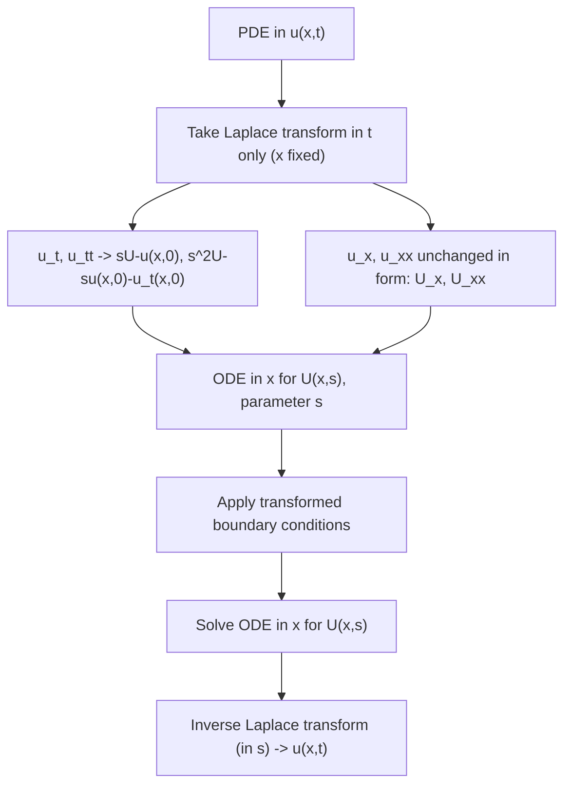

# 07. Solution of Partial Differential Equations Using Laplace Transform

## Overview

[→ ODE solving](06_solution_of_ordinary_differential_equations.md) transformed the time variable to remove all time-derivatives, turning the problem into algebra. For PDEs in two variables ($x$ and $t$), the same idea applies: transform with respect to $t$ only, leaving $x$ untouched, so the PDE collapses into an **ordinary** differential equation in $x$ (with $s$ as a parameter). This file is the final and most syllabus-scoped topic — only the standard heat and wave equation setups are covered, at the level needed for exam-style problems.

## Definitions & Key Terms

**1. $u(x,t)$** — *the unknown function of two variables (e.g. temperature or displacement), depending on position $x$ and time $t$.*

**2. $U(x,s)$** — *the Laplace transform of $u(x,t)$ with respect to $t$ only:* $U(x,s)=\mathcal{L}_t\{u(x,t)\} = \int_0^\infty e^{-st}u(x,t)\,dt$, *with $x$ held fixed as a parameter.*

**3. Boundary conditions** — *conditions on $u$ at fixed values of $x$ (e.g. $u(0,t), u(L,t)$), valid for all $t$; these remain functions of $t$ (or $s$ after transforming) since $x$ is fixed but $t$ varies.*

**4. Initial conditions** — *conditions on $u$ at $t=0$ (e.g. $u(x,0)$), valid for all $x$; these appear as ordinary functions of $x$ that get substituted into the transformed equation, exactly like $y(0)$ did for ODEs.*

## Core Content

### Why Laplace transform helps with PDEs
A PDE in $u(x,t)$ has derivatives in *two* variables. Transforming only in $t$ removes all $t$-derivatives (using the same derivative property as Topic 03/06) while leaving $x$-derivatives (like $u_{xx}$) untouched, because $\dfrac{\partial}{\partial x}$ and the $t$-integral commute:
$$\mathcal{L}_t\{u_x\} = \frac{\partial}{\partial x}\mathcal{L}_t\{u\} = U_x(x,s), \qquad \mathcal{L}_t\{u_{xx}\}=U_{xx}(x,s)$$
For the $t$-derivatives, apply the ODE derivative property (with $x$ as a fixed parameter):
$$\mathcal{L}_t\{u_t\} = sU(x,s) - u(x,0), \qquad \mathcal{L}_t\{u_{tt}\} = s^2U(x,s) - su(x,0) - u_t(x,0)$$

**Which variable is transformed:** always $t$ (the variable with the initial condition), never $x$ (the variable with boundary conditions) — this is the standard convention and matches the syllabus scope.

**General procedure:**
1. Take $\mathcal{L}_t$ of both sides of the PDE.
2. Replace $t$-derivatives using the rules above; substitute the initial condition(s) $u(x,0)$ (and $u_t(x,0)$ if second order in $t$).
3. The result is an ODE in $x$ (with $s$ as a parameter) for $U(x,s)$.
4. Transform the boundary conditions the same way (they become conditions on $U(x,s)$).
5. Solve the ODE in $x$ for $U(x,s)$, using the transformed boundary conditions.
6. Take the inverse Laplace transform (with respect to $s$, back to $t$) to get $u(x,t)$.

### Heat equation
$$u_t = c^2 u_{xx}$$
Transforming in $t$: $sU(x,s) - u(x,0) = c^2 U_{xx}(x,s)$, i.e.
$$c^2 U_{xx}(x,s) - sU(x,s) = -u(x,0)$$
a **linear second-order ODE in $x$** for $U(x,s)$, with $s$ appearing as a parameter.

### Wave equation
$$u_{tt} = c^2 u_{xx}$$
Transforming in $t$ (needs both $u(x,0)$ and $u_t(x,0)$):
$$s^2U(x,s) - su(x,0) - u_t(x,0) = c^2U_{xx}(x,s)$$
$$c^2U_{xx}(x,s) - s^2U(x,s) = -su(x,0)-u_t(x,0)$$
again a second-order linear ODE in $x$.

## Worked Examples

### Example 1 — 🟢 Foundational
Transform the heat equation $u_t = u_{xx}$ (take $c=1$) with initial condition $u(x,0)=0$, into an ODE in $x$.

**Solution**
$\mathcal{L}_t\{u_t\}=sU(x,s)-u(x,0)=sU(x,s)-0=sU(x,s)$

$\mathcal{L}_t\{u_{xx}\}=U_{xx}(x,s)$

$$sU(x,s) = U_{xx}(x,s) \quad\Longrightarrow\quad U_{xx}(x,s)-sU(x,s)=0$$
**Answer:** $U_{xx} - sU = 0$, a linear 2nd-order ODE in $x$ with parameter $s$.

### Example 2 — 🟡 Intermediate
Solve the ODE in $x$ from Example 1, $U_{xx}-sU=0$, given the boundary conditions $U(0,s)=\dfrac{1}{s}$ and $U(x,s)\to 0$ as $x\to\infty$ (bounded solution).

**Solution**
Characteristic equation (in $x$, treating $s$ as constant): $m^2 - s = 0 \Rightarrow m=\pm\sqrt s$.
General solution: $U(x,s) = Ae^{-\sqrt s\,x} + Be^{\sqrt s\,x}$

Boundedness as $x\to\infty$ forces $B=0$. Apply $U(0,s)=\dfrac1s$: $A=\dfrac1s$.
**Answer:** $U(x,s) = \dfrac1s e^{-\sqrt s\,x}$ (this is the transform-domain solution; inverting it needs Bromwich-type methods beyond this course's scope, so exam problems typically stop at this stage or use simpler boundary data — see Example 3).

### Example 3 — 🔴 Advanced / Exam-level
Solve the wave equation $u_{tt}=c^2u_{xx}$ with $u(x,0)=0,\ u_t(x,0)=0$, and boundary condition $u(0,t)=f(t)$, $u(x,t)\to0$ as $x\to\infty$, expressing $u(x,t)$ using the second shifting theorem (standard "signal propagating down a semi-infinite line" problem).

**Solution**
Transform in $t$: $s^2U - s\cdot0-0 = c^2U_{xx}\Rightarrow U_{xx}-\dfrac{s^2}{c^2}U=0$

Characteristic roots: $m=\pm s/c$. General solution: $U(x,s)=Ae^{-sx/c}+Be^{sx/c}$

Boundedness as $x\to\infty$ (for $s>0$) forces $B=0$: $U(x,s)=Ae^{-sx/c}$

Boundary condition $u(0,t)=f(t)\Rightarrow U(0,s)=F(s)$, so $A=F(s)$:
$$U(x,s) = F(s)\,e^{-sx/c}$$
This is exactly the second shifting theorem form $e^{-as}F(s)$ with $a=x/c$. Inverting:
$$u(x,t) = u\!\left(t-\frac xc\right)\cdot f\!\left(t-\frac xc\right)\bigg|_{\text{step form}} = u_{\text{step}}\!\left(t-\frac xc\right) f\!\left(t-\frac xc\right)$$
More precisely, using the step-function notation from Topic 03:
$$u(x,t) = f\!\left(t-\frac xc\right)\cdot U\!\left(t-\frac xc\right)$$
where the capital $U(\cdot)$ here denotes the unit step (distinguish carefully from $U(x,s)$ used above).
**Answer:** $u(x,t) = f\!\left(t-\dfrac xc\right)$ for $t>x/c$, and $0$ otherwise — a signal launched at $x=0$ arrives at position $x$ delayed by $x/c$, undistorted (classic wave-propagation result).

## Applications

- **Heat conduction in a semi-infinite rod** — modelling temperature diffusion from a boundary condition (e.g. a heated end) as in Example 2.
- **Signal/wave propagation along a line** — Example 3's result is the mathematical basis for why a wave launched at one end of a string/cable arrives at a distant point delayed but otherwise unchanged (ideal, lossless case).

## Diagram / Visual

*Figure 1: Workflow for solving a PDE by Laplace transform in one variable.*

## Common Mistakes

- ❌ **Mistake:** Transforming with respect to $x$ instead of $t$ (or transforming both variables at once).
  ✅ **Correct:** Always transform the variable that carries the *initial* condition (usually $t$); leave the boundary-condition variable ($x$) untouched — it becomes the ODE's independent variable.
- ❌ **Mistake:** Forgetting that $\dfrac{\partial}{\partial x}$ passes straight through the $t$-transform unchanged (i.e. writing extra $s$-dependence into $U_x$ that isn't there).
  ✅ **Correct:** $\mathcal{L}_t\{u_x\}=U_x(x,s)$ exactly — no extra factor, since differentiation in $x$ and integration in $t$ are independent operations.
- ❌ **Mistake:** Dropping the boundedness condition (as $x\to\infty$) when solving the ODE in $x$, keeping both exponential terms.
  ✅ **Correct:** Physical solutions on a semi-infinite domain must stay bounded as $x\to\infty$; use this to eliminate the growing exponential term immediately.
- ❌ **Mistake:** Confusing the boundary condition's transform ($\mathcal{L}_t$ applied to a function of $t$ at fixed $x$) with an ordinary $x$-derivative.
  ✅ **Correct:** Boundary conditions like $u(0,t)=f(t)$ transform directly to $U(0,s)=F(s)$ — same $\mathcal{L}_t$ operation as everywhere else, just evaluated at the fixed boundary value of $x$.

## Practice Problems

**Problem 1:** Transform $u_t = 2u_{xx}$ with $u(x,0)=0$ into an ODE in $x$.

Solution

$sU(x,s) - 0 = 2U_{xx}\Rightarrow U_{xx}-\dfrac s2 U=0$

**Answer:** $U_{xx}-\dfrac s2U=0$

**Problem 2:** Transform $u_{tt}=9u_{xx}$ with $u(x,0)=0,\ u_t(x,0)=0$ into an ODE in $x$.

Solution

$s^2U-0-0=9U_{xx}\Rightarrow U_{xx}-\dfrac{s^2}9U=0$

**Answer:** $U_{xx}-\dfrac{s^2}9U=0$

**Problem 3:** Solve $U_{xx}-sU=0$ (heat equation transformed ODE, general solution) subject to $U$ bounded as $x\to\infty$ and $U(0,s)=\dfrac2s$.

Solution

General solution: $U=Ae^{-\sqrt sx}+Be^{\sqrt sx}$. Boundedness $\Rightarrow B=0$. $U(0,s)=A=\dfrac2s$

**Answer:** $U(x,s)=\dfrac2se^{-\sqrt sx}$

**Problem 4:** For the wave equation transformed ODE $U_{xx}-\dfrac{s^2}{c^2}U=0$, write down the general (unbounded-domain) solution form and state which term is discarded on a semi-infinite domain with boundedness as $x\to\infty$.

Solution

General solution: $U(x,s)=Ae^{-sx/c}+Be^{sx/c}$. Since $e^{sx/c}\to\infty$ as $x\to\infty$ (for $s>0$), boundedness discards the $B$ term.

**Answer:** $U(x,s)=Ae^{-sx/c}$, with $B=0$.

**Problem 5 (exam-style):** A semi-infinite rod satisfies $u_t=u_{xx}$, $u(x,0)=0$, $u(0,t)=1$ (boundary held at constant temperature 1), $u$ bounded as $x\to\infty$. Set up and solve for $U(x,s)$.

Solution

Transform: $sU=U_{xx}\Rightarrow U_{xx}-sU=0\Rightarrow U=Ae^{-\sqrt sx}+Be^{\sqrt sx}$

Boundedness: $B=0$. Boundary: $U(0,s)=\mathcal{L}\{1\}=\dfrac1s=A$

**Answer:** $U(x,s)=\dfrac1se^{-\sqrt sx}$ (the $s$-domain solution; this is the standard semi-infinite-rod constant-boundary problem, and its inversion — a complementary error function — is beyond MS 103's scope, so the transform-domain answer is the expected exam solution here).

**Problem 6 (exam-style, wave propagation):** Solve $u_{tt}=4u_{xx}$, $u(x,0)=0,\ u_t(x,0)=0$, $u(0,t)=\sin t$, $u$ bounded as $x\to\infty$, for $u(x,t)$.

Solution

Transform: $s^2U=4U_{xx}\Rightarrow U_{xx}-\dfrac{s^2}4U=0\Rightarrow U=Ae^{-sx/2}+Be^{sx/2}$

Boundedness: $B=0$. Boundary: $U(0,s)=\mathcal{L}\{\sin t\}=\dfrac1{s^2+1}=A$

$$U(x,s)=\frac1{s^2+1}e^{-sx/2}$$

This is $e^{-as}F(s)$ with $a=x/2$, $F(s)=1/(s^2+1)\to f(t)=\sin t$. Apply the 2nd shifting theorem:

**Answer:** $u(x,t)=u_{\text{step}}\!\left(t-\dfrac x2\right)\sin\!\left(t-\dfrac x2\right)$ — the boundary's sinusoidal disturbance arrives at position $x$ delayed by $x/2$ (wave speed $c=2$), i.e. $u(x,t)=\sin(t-x/2)$ for $t>x/2$ and $0$ otherwise.

## Summary

| Concept | Result | Condition / Limit |
|---|---|---|
| Transform choice | transform in $t$ (initial-condition variable), keep $x$ | standard convention |
| $\mathcal{L}_t\{u_t\}, \mathcal{L}_t\{u_{tt}\}$ | $sU-u(x,0)$, $s^2U-su(x,0)-u_t(x,0)$ | same as ODE derivative property |
| $\mathcal{L}_t\{u_x\}, \mathcal{L}_t\{u_{xx}\}$ | $U_x$, $U_{xx}$ (unchanged) | $x$- and $t$-operations commute |
| Heat equation → ODE | $U_{xx}-\dfrac sc^2 U = -\dfrac{u(x,0)}{c^2}$ | 2nd-order linear ODE in $x$ |
| Wave equation → ODE | $U_{xx}-\dfrac{s^2}{c^2}U = \dfrac{-su(x,0)-u_t(x,0)}{c^2}$ | 2nd-order linear ODE in $x$ |
| Boundedness condition | discards the exponentially growing solution branch | semi-infinite domain, $x\to\infty$ |

This is the final topic of the unit — for the complete picture, revisit [→ 01. Definition](01_definition_of_laplace_transform.md) through [→ 06. ODEs](06_solution_of_ordinary_differential_equations.md), or use [quick_rev/04_laplace_transform.md](../quick_rev/04_laplace_transform.md) for a one-page cram sheet of the whole unit.

## References

1. **Erwin Kreyszig, Advanced Engineering Mathematics, 10th Ed.** — *Standard treatment of Laplace transform methods for PDEs (heat/wave equations).*
2. **R. K. Jain & S. R. K. Iyengar, Advanced Engineering Mathematics** — *Undergraduate exam-style PDE problems solved via Laplace transform.*
3. **L. Debnath & D. Bhatta, Integral Transforms and Their Applications** — *Rigorous derivation of the transformed ODE for heat/wave equations.*
4. **MIT OpenCourseWare 18.03 (Differential Equations)** — *Boundary value problems and Laplace-transform methods for PDEs.* https://ocw.mit.edu
