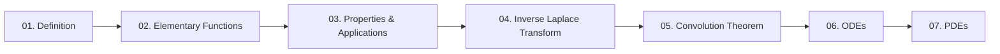

# Unit: Laplace Transform

**Course:** [MS-103 — Mathematics – II](../README.md) · Credit 3 · 3 hrs/week · 45 total hours
**Syllabus unit:** Definition of Laplace Transform, Laplace transform of elementary functions, Properties of Laplace transform and applications, Inverse Laplace Transform, Convolution theorem, Solution of Ordinary and Partial differential equations using Laplace Transform.

## Topic Index

| # | File | Topic |
|---|------|-------|
| 01 | [01_definition_of_laplace_transform.md](01_definition_of_laplace_transform.md) | Definition of Laplace Transform |
| 02 | [02_laplace_transform_of_elementary_functions.md](02_laplace_transform_of_elementary_functions.md) | Laplace Transform of Elementary Functions |
| 03 | [03_properties_and_applications.md](03_properties_and_applications.md) | Properties of Laplace Transform and Applications |
| 04 | [04_inverse_laplace_transform.md](04_inverse_laplace_transform.md) | Inverse Laplace Transform |
| 05 | [05_convolution_theorem.md](05_convolution_theorem.md) | Convolution Theorem |
| 06 | [06_solution_of_ordinary_differential_equations.md](06_solution_of_ordinary_differential_equations.md) | Solution of ODEs Using Laplace Transform |
| 07 | [07_solution_of_partial_differential_equations.md](07_solution_of_partial_differential_equations.md) | Solution of PDEs Using Laplace Transform |

## Prerequisite / Flow Diagram

## Formula Cheat-Sheet (one per topic)

| Topic | Key Formula |
|---|---|
| 01. Definition | $\mathcal{L}\{f(t)\} = F(s) = \displaystyle\int_0^\infty e^{-st}f(t)\,dt$ |
| 02. Elementary Functions | $\mathcal{L}\{t^n\} = \dfrac{n!}{s^{n+1}}$ |
| 03. Properties | $\mathcal{L}\{f'(t)\} = sF(s) - f(0)$ |
| 04. Inverse Laplace | $\mathcal{L}^{-1}\{F(s-a)\} = e^{at}f(t)$ |
| 05. Convolution | $\mathcal{L}\{f*g\} = F(s)G(s)$ |
| 06. ODEs | $Y(s) = \dfrac{F(s) + (s+b)y(0) + y'(0)}{s^2+bs+c}$ |
| 07. PDEs | $U_{xx}(x,s) - \dfrac{s}{c^2}U(x,s) = -\dfrac{u(x,0)}{c^2}$ (heat equation) |

## Notation Conventions

- Lower-case $f(t), y(t), u(x,t)$ = time domain; upper-case $F(s), Y(s), U(x,s)$ = $s$-domain (transformed).
- $\mathcal{L}\{\cdot\}$ = forward Laplace transform; $\mathcal{L}^{-1}\{\cdot\}$ = inverse Laplace transform; $\mathcal{L}_t\{\cdot\}$ (Topic 07 only) = transform with respect to $t$, holding $x$ fixed.
- $u(t-a)$ = unit step function (on at $t=a$); do not confuse with $u(x,t)$, the PDE solution in Topic 07 — context disambiguates.
- Inline math: `$...$`; display math: `$$...$$` on its own line.
- All initial/boundary conditions are stated at $t=0$ (or the given boundary in $x$) unless noted otherwise.
- Every symbol is defined at first use within each topic file.
