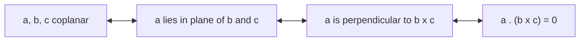

# Vector Calculus & Laplace Transform: Model Answers

Exam-style solutions to 28 questions. Math uses GitHub's LaTeX support (`` $`...`$ `` inline, ```` ```math ```` blocks for display) and diagrams use Mermaid or plain-text sketches, so everything renders directly on GitHub.

**Notation:** $`\mathbf{i},\mathbf{j},\mathbf{k}`$ are the unit vectors along $`x,y,z`$. $`\nabla = \mathbf{i}\,\partial_x + \mathbf{j}\,\partial_y + \mathbf{k}\,\partial_z`$. $`[\mathbf{a}\ \mathbf{b}\ \mathbf{c}] = \mathbf{a}\cdot(\mathbf{b}\times\mathbf{c})`$.

## Contents

| # | Topic | Answer |
|:-:|-------|--------|
| [1](#q1) | Conservative field, find $`a,b`$ | $`a=3,\ b=-8`$ (see note on a typo) |
| [2](#q2) | $`r^n\mathbf{r}`$ solenoidal | $`n=-3`$ |
| [3](#q3) | Coplanarity test | proof |
| [4](#q4) | Vector triple product | proof |
| [5](#q5) | Line integral, triangle | $`-\tfrac23`$ |
| [6](#q6) | Line integral, square | $`2`$ |
| [7](#q7) | Gauss theorem, unit cube | $`\tfrac72`$ |
| [8](#q8) | Angle between $`\mathbf{A},\mathbf{B}`$ | $`\cos^{-1}\tfrac{8}{21}\approx 67.6^\circ`$ |
| [9](#q9) | Conservative field proof | $`\nabla\times\mathbf{F}=\mathbf{0}`$ |
| [10](#q10) | Green's theorem | $`-\tfrac1{20}`$ |
| [11](#q11) | Curl of curl | proof |
| [12](#q12) | Sum of triple products $`=2\mathbf{a}`$ | proof |
| [13](#q13) | Equal diagonals $`\Rightarrow`$ perpendicular | proof |
| [14](#q14) | Parallelogram area | $`10\sqrt3`$ |
| [15](#q15) | Angle between $`\mathbf{a},\mathbf{b}`$ | $`\approx 67.1^\circ`$ |
| [16](#q16) | Law of sines | proof |
| [17](#q17) | Cross product of two cross products | proof |
| [18](#q18) | Divergence of curl | proof |
| [19](#q19) | Gauss theorem, parabolic region | $`16`$ |
| [20](#q20) | Lagrange-type identity | proof |
| [21](#q21) | Convolution theorem | proof |
| [22](#q22) | Laplace transform of a combination | see Q22 |
| [23](#q23) | First translation property | proof |
| [24](#q24) | Transform of third derivative | proof |
| [25](#q25) | Inverse Laplace, complete the square | $`e^{2t}(\cos3t+\frac43\sin3t)`$ |
| [26](#q26) | Inverse Laplace, partial fractions | $`\frac13e^{-t}(\sin t+\sin2t)`$ |
| [27](#q27) | Multiplication by $`t^n`$ | see Q27 |
| [28](#q28) | Boundary-value ODE | $`\frac45\cos3t+\frac45\sin3t+\frac15\cos2t`$ |

## Identities used repeatedly

```math
\mathbf{a}\times(\mathbf{b}\times\mathbf{c}) = \mathbf{b}(\mathbf{a}\cdot\mathbf{c}) - \mathbf{c}(\mathbf{a}\cdot\mathbf{b})
```

```math
\nabla\times\mathbf{F}=\begin{vmatrix}\mathbf{i}&\mathbf{j}&\mathbf{k}\\ \partial_x&\partial_y&\partial_z\\ P&Q&R\end{vmatrix}
```

A field $`\mathbf{F}`$ is conservative $`\iff\nabla\times\mathbf{F}=\mathbf{0}`$ (on a simply connected domain).

---

<a id="q1"></a>

## Q1. Conservative field: find a and b

**Given:**

```math
\mathbf{A}=(2xy+3yz)\,\mathbf{i}+(x^2+axz-4z^2)\,\mathbf{j}-(3xy+byz)\,\mathbf{k}
```

**Method.** $`\mathbf{A}`$ is conservative iff $`\nabla\times\mathbf{A}=\mathbf{0}`$.


**Check the problem as printed.** Here $`P=2xy+3yz`$, $`Q=x^2+axz-4z^2`$, $`R=-(3xy+byz)`$.

```math
(\nabla\times\mathbf{A})_j=\frac{\partial P}{\partial z}-\frac{\partial R}{\partial x}=3y-(-3y)=6y\neq0
```

The $`\mathbf{j}`$-component is $`6y`$ whatever $`a,b`$ are, and the $`\mathbf{i}`$ and $`\mathbf{k}`$ components demand $`a=-3`$ and $`a=3`$ respectively. So **as printed, no constants exist**. The standard version of this problem has $`+(3xy+byz)\,\mathbf{k}`$, so the working below uses that.

**Solution (with $`R=3xy+byz`$).**

```math
(\nabla\times\mathbf{A})_i=\frac{\partial R}{\partial y}-\frac{\partial Q}{\partial z}=(3x+bz)-(ax-8z)=(3-a)x+(b+8)z
```

```math
(\nabla\times\mathbf{A})_j=\frac{\partial P}{\partial z}-\frac{\partial R}{\partial x}=3y-3y=0
```

```math
(\nabla\times\mathbf{A})_k=\frac{\partial Q}{\partial x}-\frac{\partial P}{\partial y}=(2x+az)-(2x+3z)=(a-3)z
```

Setting each to zero for all $`x,y,z`$: $`3-a=0`$, $`b+8=0`$, $`a-3=0`$.

```math
\boxed{a=3,\qquad b=-8}
```

---

<a id="q2"></a>

## Q2. Solenoidal field r^n r

**Given:** $`\mathbf{r}=x\mathbf{i}+y\mathbf{j}+z\mathbf{k}`$, $`r=|\mathbf{r}|`$. **To find:** $`n`$ such that $`\nabla\cdot(r^n\mathbf{r})=0`$.

**Solution.** Since $`r^2=x^2+y^2+z^2`$, differentiating gives $`r\,\partial_x r = x`$, so $`\nabla r=\mathbf{r}/r`$ and

```math
\nabla(r^n)=n r^{n-1}\nabla r=n r^{n-2}\,\mathbf{r}
```

Using $`\nabla\cdot(\phi\mathbf{F})=\nabla\phi\cdot\mathbf{F}+\phi\,\nabla\cdot\mathbf{F}`$ with $`\nabla\cdot\mathbf{r}=3`$:

```math
\nabla\cdot(r^n\mathbf{r})=n r^{n-2}(\mathbf{r}\cdot\mathbf{r})+3r^n=n r^n+3r^n=(n+3)\,r^n
```

This vanishes for all $`r\neq0`$ iff $`n+3=0`$.

```math
\boxed{n=-3}
```

Hence $`r^{-3}\mathbf{r}`$ is solenoidal. $`\blacksquare`$

---

<a id="q3"></a>

## Q3. Coplanarity test

**To prove:** three vectors $`\mathbf{a},\mathbf{b},\mathbf{c}`$ are coplanar iff

```math
\mathbf{a}\cdot(\mathbf{b}\times\mathbf{c})=0
```

The quantity $`|\mathbf{a}\cdot(\mathbf{b}\times\mathbf{c})|`$ is the volume of the parallelepiped built on the three vectors: base area $`|\mathbf{b}\times\mathbf{c}|`$ times height (the component of $`\mathbf{a}`$ along the normal $`\mathbf{b}\times\mathbf{c}`$). Zero volume means the solid is flat.



**($`\Rightarrow`$)** Suppose $`\mathbf{a},\mathbf{b},\mathbf{c}`$ are coplanar. If $`\mathbf{b}\parallel\mathbf{c}`$ then $`\mathbf{b}\times\mathbf{c}=\mathbf{0}`$ and the product is $`0`$. Otherwise $`\mathbf{b}\times\mathbf{c}`$ is perpendicular to the plane of $`\mathbf{b},\mathbf{c}`$. The vector $`\mathbf{a}`$ lies in that plane, so $`\mathbf{a}\perp(\mathbf{b}\times\mathbf{c})`$ and $`\mathbf{a}\cdot(\mathbf{b}\times\mathbf{c})=0`$.

**($`\Leftarrow`$)** Suppose $`\mathbf{a}\cdot(\mathbf{b}\times\mathbf{c})=0`$. If $`\mathbf{b}\times\mathbf{c}=\mathbf{0}`$, then $`\mathbf{b}\parallel\mathbf{c}`$ and any three such vectors are coplanar. Otherwise $`\mathbf{a}\perp(\mathbf{b}\times\mathbf{c})`$, so $`\mathbf{a}`$ lies in the plane through the origin perpendicular to $`\mathbf{b}\times\mathbf{c}`$. That plane contains $`\mathbf{b}`$ and $`\mathbf{c}`$, so $`\mathbf{a},\mathbf{b},\mathbf{c}`$ are coplanar. $`\blacksquare`$

---

<a id="q4"></a>

## Q4. Vector triple product

**To prove:**

```math
(\mathbf{a}\times\mathbf{b})\times\mathbf{c}=(\mathbf{a}\cdot\mathbf{c})\,\mathbf{b}-(\mathbf{b}\cdot\mathbf{c})\,\mathbf{a}
```

**Proof.** Both sides are defined without reference to a coordinate system, so we may choose axes conveniently: take $`\mathbf{i}`$ along $`\mathbf{a}`$ and $`\mathbf{j}`$ in the plane of $`\mathbf{a},\mathbf{b}`$.

```math
\mathbf{a}=a_1\mathbf{i},\qquad \mathbf{b}=b_1\mathbf{i}+b_2\mathbf{j},\qquad \mathbf{c}=c_1\mathbf{i}+c_2\mathbf{j}+c_3\mathbf{k}
```

**LHS.** $`\mathbf{a}\times\mathbf{b}=a_1b_2\,\mathbf{k}`$, so

```math
(\mathbf{a}\times\mathbf{b})\times\mathbf{c}=a_1b_2\,\mathbf{k}\times(c_1\mathbf{i}+c_2\mathbf{j}+c_3\mathbf{k})=a_1b_2\,(c_1\mathbf{j}-c_2\mathbf{i})
```

**RHS.** $`\mathbf{a}\cdot\mathbf{c}=a_1c_1`$ and $`\mathbf{b}\cdot\mathbf{c}=b_1c_1+b_2c_2`$, so

```math
\begin{aligned}
(\mathbf{a}\cdot\mathbf{c})\mathbf{b}-(\mathbf{b}\cdot\mathbf{c})\mathbf{a}
&=a_1c_1(b_1\mathbf{i}+b_2\mathbf{j})-a_1(b_1c_1+b_2c_2)\mathbf{i}\\
&=a_1b_2c_1\,\mathbf{j}-a_1b_2c_2\,\mathbf{i}
\end{aligned}
```

LHS $`=`$ RHS. $`\blacksquare`$

---

<a id="q5"></a>

## Q5. Line integral around a triangle

**To evaluate:** $`\displaystyle\oint (y^2\,dx-x^2\,dy)`$ around the triangle $`A(1,0)\to B(0,1)\to C(-1,0)\to A`$.

```text
            y
            ^
          1 |     B
            |    / \
            |   /   \
      ------C----+----A------> x
           -1    0    1

      direction: A -> B -> C -> A (counter-clockwise)
```

**Segment AB:** $`y=1-x`$, $`dy=-dx`$, $`x:1\to0`$.

```math
\int_{AB}=\int_{1}^{0}\big[(1-x)^2+x^2\big]dx=-\int_0^1(1-2x+2x^2)\,dx=-\Big(1-1+\tfrac23\Big)=-\tfrac23
```

**Segment BC:** $`y=x+1`$, $`dy=dx`$, $`x:0\to-1`$.

```math
\int_{BC}=\int_0^{-1}\big[(x+1)^2-x^2\big]dx=\int_0^{-1}(2x+1)\,dx=\big[x^2+x\big]_0^{-1}=0
```

**Segment CA:** $`y=0`$, $`dy=0`$, so $`\int_{CA}=0`$.

```math
\boxed{\oint = -\tfrac23}
```

**Check by Green's theorem.** With $`P=y^2,\ Q=-x^2`$ the integrand is $`\partial_xQ-\partial_yP=-2x-2y`$. The $`x`$-term vanishes by symmetry. The region is $`0\le y\le1-|x|`$, so

```math
\iint(-2y)\,dA=-2\int_{-1}^{1}\frac{(1-|x|)^2}{2}\,dx=-2\cdot\frac13=-\frac23\ \checkmark
```

---

<a id="q6"></a>

## Q6. Line integral around a square

**To evaluate:** $`\displaystyle\oint (x\,dy-y\,dx)`$ around the square $`A(0,0)\to B(1,0)\to C(1,1)\to D(0,1)\to A`$.

```text
        y
        ^
      1 D +-------+ C
          |       |
          |       |
      0   A +-------+ B ------> x
          0       1
```

| Side | Description | Integrand $`x\,dy-y\,dx`$ | Value |
|:----:|-------------|---------------|:-----:|
| AB | $`y=0,\ dy=0`$ | $`0`$ | $`0`$ |
| BC | $`x=1,\ dx=0`$ | $`\int_0^1 dy`$ | $`1`$ |
| CD | $`y=1,\ dy=0`$ | $`-\int_{1}^{0}dx`$ | $`1`$ |
| DA | $`x=0,\ dx=0`$ | $`0`$ | $`0`$ |

```math
\boxed{\oint=2}
```

**Check.** $`\tfrac12\oint(x\,dy-y\,dx)`$ is the enclosed area, so the integral equals $`2\times\text{Area}=2\times1=2`$. $`\checkmark`$

---

<a id="q7"></a>

## Q7. Verify Gauss's divergence theorem on the unit cube

**Given:** $`\mathbf{F}=4xz\,\mathbf{i}+y^2\,\mathbf{j}+zy\,\mathbf{k}`$ over the cube $`0\le x,y,z\le1`$.

**Gauss's theorem:**

```math
\iiint_V\nabla\cdot\mathbf{F}\,dV=\iint_S\mathbf{F}\cdot\hat{\mathbf{n}}\,dS
```

**Volume integral.**

```math
\nabla\cdot\mathbf{F}=4z+2y+y=4z+3y
```

```math
\int_0^1\!\!\int_0^1\!\!\int_0^1(4z+3y)\,dx\,dy\,dz=4\cdot\tfrac12+3\cdot\tfrac12=\tfrac72
```

**Surface integral** over the six faces:

| Face | $`\hat{\mathbf{n}}`$ | $`\mathbf{F}\cdot\hat{\mathbf{n}}`$ | Integral over the face |
|:----:|:----:|:-----------:|------------|
| $`x=1`$ | $`\mathbf{i}`$ | $`4z`$ | $`\int_0^1\!\int_0^1 4z\,dy\,dz=2`$ |
| $`x=0`$ | $`-\mathbf{i}`$ | $`-4xz=0`$ | $`0`$ |
| $`y=1`$ | $`\mathbf{j}`$ | $`y^2=1`$ | $`1`$ |
| $`y=0`$ | $`-\mathbf{j}`$ | $`-y^2=0`$ | $`0`$ |
| $`z=1`$ | $`\mathbf{k}`$ | $`zy=y`$ | $`\int_0^1\!\int_0^1 y\,dx\,dy=\tfrac12`$ |
| $`z=0`$ | $`-\mathbf{k}`$ | $`-zy=0`$ | $`0`$ |

```math
\text{Surface integral}=2+1+\tfrac12=\tfrac72
```

Both sides equal $`\tfrac72`$, so Gauss's theorem is verified. $`\blacksquare`$

---

<a id="q8"></a>

## Q8. Angle between two vectors

**Given:** $`\mathbf{A}=2\mathbf{i}-3\mathbf{j}+6\mathbf{k}`$, $`\mathbf{B}=\mathbf{i}+2\mathbf{j}+2\mathbf{k}`$.

```math
\mathbf{A}\cdot\mathbf{B}=2-6+12=8,\qquad |\mathbf{A}|=\sqrt{4+9+36}=7,\qquad |\mathbf{B}|=\sqrt{1+4+4}=3
```

```math
\cos\theta=\frac{\mathbf{A}\cdot\mathbf{B}}{|\mathbf{A}||\mathbf{B}|}=\frac{8}{21}
```

```math
\boxed{\theta=\cos^{-1}\tfrac{8}{21}\approx67.6^\circ}
```

---

<a id="q9"></a>

## Q9. Prove the field is conservative

**Given:**

```math
\mathbf{F}=(2xz^3+6y)\,\mathbf{i}+(6x-2yz)\,\mathbf{j}+(3x^2z^2-y^2)\,\mathbf{k}
```

Let $`P=2xz^3+6y`$, $`Q=6x-2yz`$, $`R=3x^2z^2-y^2`$.

```math
(\nabla\times\mathbf{F})_i=\partial_yR-\partial_zQ=-2y-(-2y)=0
```

```math
(\nabla\times\mathbf{F})_j=\partial_zP-\partial_xR=6xz^2-6xz^2=0
```

```math
(\nabla\times\mathbf{F})_k=\partial_xQ-\partial_yP=6-6=0
```

So $`\nabla\times\mathbf{F}=\mathbf{0}`$ and $`\mathbf{F}`$ is conservative. $`\blacksquare`$

**Scalar potential (for completeness).** $`\phi=x^2z^3+6xy-y^2z`$. Then $`\phi_x=2xz^3+6y`$, $`\phi_y=6x-2yz`$, $`\phi_z=3x^2z^2-y^2`$, so $`\nabla\phi=\mathbf{F}`$. $`\checkmark`$

---

<a id="q10"></a>

## Q10. Verify Green's theorem

**Given:** $`\displaystyle\oint_C (xy+y^2)\,dx+x^2\,dy`$, where $`C`$ bounds the region between $`y=x`$ and $`y=x^2`$.

**Green's theorem** with $`P=xy+y^2`$, $`Q=x^2`$:

```math
\oint_C P\,dx+Q\,dy=\iint_R\left(\frac{\partial Q}{\partial x}-\frac{\partial P}{\partial y}\right)dA
```

The curves meet at $`O(0,0)`$ and $`(1,1)`$. On $`0<x<1`$ the line $`y=x`$ lies above the parabola $`y=x^2`$.

```text
        y
        ^
      1 |            * (1,1)
        |          /.
        |        / .        upper curve: y = x
        |      / .          lower curve: y = x^2
        |    / .
        |  /.               counter-clockwise:
      0 +*-------------> x    O -> (1,1) along y = x^2
        0             1       (1,1) -> O along y = x
```

**Line integral (counter-clockwise).**

*Along $`y=x^2`$, $`x:0\to1`$, $`dy=2x\,dx`$:*

```math
\int\left[(x^3+x^4)+x^2(2x)\right]dx=\int_0^1(3x^3+x^4)\,dx=\tfrac34+\tfrac15=\tfrac{19}{20}
```

*Along $`y=x`$, $`x:1\to0`$, $`dy=dx`$:*

```math
\int\left[(x^2+x^2)+x^2\right]dx=\int_1^0 3x^2\,dx=-1
```

```math
\oint=\tfrac{19}{20}-1=-\tfrac1{20}
```

**Double integral.** $`\partial_xQ-\partial_yP=2x-(x+2y)=x-2y`$.

```math
\int_0^1\!\!\int_{x^2}^{x}(x-2y)\,dy\,dx=\int_0^1\big[xy-y^2\big]_{x^2}^{x}dx=\int_0^1(-x^3+x^4)\,dx=-\tfrac14+\tfrac15=-\tfrac1{20}
```

Both sides equal $`-\tfrac1{20}`$, so Green's theorem is verified. $`\blacksquare`$

---

<a id="q11"></a>

## Q11. Curl of curl

**To prove:**

```math
\nabla\times(\nabla\times\mathbf{A})=\nabla(\nabla\cdot\mathbf{A})-\nabla^2\mathbf{A}
```

Let $`\mathbf{B}=\nabla\times\mathbf{A}`$, so $`B_x=\partial_yA_z-\partial_zA_y`$, $`B_y=\partial_zA_x-\partial_xA_z`$, $`B_z=\partial_xA_y-\partial_yA_x`$.

The $`x`$-component of $`\nabla\times\mathbf{B}`$ is

```math
\begin{aligned}
(\nabla\times\mathbf{B})_x&=\partial_yB_z-\partial_zB_y\\
&=\partial_y(\partial_xA_y-\partial_yA_x)-\partial_z(\partial_zA_x-\partial_xA_z)\\
&=\partial_x\partial_yA_y+\partial_x\partial_zA_z-\partial_y^2A_x-\partial_z^2A_x
\end{aligned}
```

Add and subtract $`\partial_x^2A_x`$:

```math
=\partial_x(\partial_xA_x+\partial_yA_y+\partial_zA_z)-(\partial_x^2+\partial_y^2+\partial_z^2)A_x=\big[\nabla(\nabla\cdot\mathbf{A})\big]_x-\nabla^2A_x
```

The $`y`$ and $`z`$ components follow identically by cyclic permutation of $`(x,y,z)`$. Hence

```math
\nabla\times(\nabla\times\mathbf{A})=\nabla(\nabla\cdot\mathbf{A})-\nabla^2\mathbf{A}\qquad\blacksquare
```

---

<a id="q12"></a>

## Q12. Sum of triple products

**To prove:**

```math
\mathbf{i}\times(\mathbf{a}\times\mathbf{i})+\mathbf{j}\times(\mathbf{a}\times\mathbf{j})+\mathbf{k}\times(\mathbf{a}\times\mathbf{k})=2\mathbf{a}
```

Use $`\mathbf{u}\times(\mathbf{v}\times\mathbf{w})=\mathbf{v}(\mathbf{u}\cdot\mathbf{w})-\mathbf{w}(\mathbf{u}\cdot\mathbf{v})`$ with $`\mathbf{a}=a_1\mathbf{i}+a_2\mathbf{j}+a_3\mathbf{k}`$:

```math
\mathbf{i}\times(\mathbf{a}\times\mathbf{i})=\mathbf{a}(\mathbf{i}\cdot\mathbf{i})-\mathbf{i}(\mathbf{i}\cdot\mathbf{a})=\mathbf{a}-a_1\mathbf{i}
```

Similarly $`\mathbf{j}\times(\mathbf{a}\times\mathbf{j})=\mathbf{a}-a_2\mathbf{j}`$ and $`\mathbf{k}\times(\mathbf{a}\times\mathbf{k})=\mathbf{a}-a_3\mathbf{k}`$. Adding:

```math
3\mathbf{a}-(a_1\mathbf{i}+a_2\mathbf{j}+a_3\mathbf{k})=3\mathbf{a}-\mathbf{a}=2\mathbf{a}\qquad\blacksquare
```

---

<a id="q13"></a>

## Q13. Equal diagonals imply perpendicular vectors

**To prove:** if $`|\mathbf{a}+\mathbf{b}|=|\mathbf{a}-\mathbf{b}|`$ then $`\mathbf{a}\perp\mathbf{b}`$.

Square both sides:

```math
|\mathbf{a}|^2+2\,\mathbf{a}\cdot\mathbf{b}+|\mathbf{b}|^2=|\mathbf{a}|^2-2\,\mathbf{a}\cdot\mathbf{b}+|\mathbf{b}|^2\ \Longrightarrow\ 4\,\mathbf{a}\cdot\mathbf{b}=0
```

So $`\mathbf{a}\cdot\mathbf{b}=0`$. For non-zero vectors this means $`\cos\theta=0`$, i.e. $`\mathbf{a}\perp\mathbf{b}`$. $`\blacksquare`$

**Geometric meaning.** $`\mathbf{a}+\mathbf{b}`$ and $`\mathbf{a}-\mathbf{b}`$ are the diagonals of the parallelogram on $`\mathbf{a},\mathbf{b}`$. A parallelogram with equal diagonals is a rectangle.

---

<a id="q14"></a>

## Q14. Area of a parallelogram

**Given:** sides $`\mathbf{A}=3\mathbf{i}+\mathbf{j}-2\mathbf{k}`$ and $`\mathbf{B}=\mathbf{i}-3\mathbf{j}+4\mathbf{k}`$.

```math
\mathbf{A}\times\mathbf{B}=\begin{vmatrix}\mathbf{i}&\mathbf{j}&\mathbf{k}\\3&1&-2\\1&-3&4\end{vmatrix}
=\mathbf{i}(4-6)-\mathbf{j}(12+2)+\mathbf{k}(-9-1)=-2\mathbf{i}-14\mathbf{j}-10\mathbf{k}
```

```math
\text{Area}=|\mathbf{A}\times\mathbf{B}|=\sqrt{4+196+100}=\sqrt{300}
```

```math
\boxed{\text{Area}=10\sqrt3\approx17.32\ \text{sq. units}}
```

---

<a id="q15"></a>

## Q15. Angle between two vectors

**Given:** $`\mathbf{a}=\mathbf{i}-7\mathbf{j}-\mathbf{k}`$, $`\mathbf{b}=4\mathbf{i}-4\mathbf{j}+7\mathbf{k}`$.

```math
\mathbf{a}\cdot\mathbf{b}=4+28-7=25,\qquad |\mathbf{a}|=\sqrt{1+49+1}=\sqrt{51},\qquad |\mathbf{b}|=\sqrt{16+16+49}=9
```

```math
\cos\theta=\frac{25}{9\sqrt{51}}\approx0.389
```

```math
\boxed{\theta\approx67.1^\circ}
```

---

<a id="q16"></a>

## Q16. Law of sines by vectors

**To prove:**

```math
\frac{\sin A}{a}=\frac{\sin B}{b}=\frac{\sin C}{c}
```

Let the sides of triangle $`ABC`$ be the vectors $`\mathbf{a}=\overrightarrow{BC}`$, $`\mathbf{b}=\overrightarrow{CA}`$, $`\mathbf{c}=\overrightarrow{AB}`$, with magnitudes $`a,b,c`$. Going round the triangle,

```math
\mathbf{a}+\mathbf{b}+\mathbf{c}=\mathbf{0}
```

```text
              A
             / \
        c   /   \   b          a = BC,  b = CA,  c = AB
           /     \
          B-------C
              a
```

Cross this relation with $`\mathbf{a}`$ and with $`\mathbf{b}`$:

```math
\mathbf{a}\times(\mathbf{a}+\mathbf{b}+\mathbf{c})=\mathbf{0}\ \Rightarrow\ \mathbf{a}\times\mathbf{b}=\mathbf{c}\times\mathbf{a}
```

```math
\mathbf{b}\times(\mathbf{a}+\mathbf{b}+\mathbf{c})=\mathbf{0}\ \Rightarrow\ \mathbf{a}\times\mathbf{b}=\mathbf{b}\times\mathbf{c}
```

Hence $`\mathbf{a}\times\mathbf{b}=\mathbf{b}\times\mathbf{c}=\mathbf{c}\times\mathbf{a}`$. Taking magnitudes: the angle between $`\mathbf{a}`$ and $`\mathbf{b}`$ (tail to tail) is $`\pi-C`$, between $`\mathbf{b}`$ and $`\mathbf{c}`$ is $`\pi-A`$, and between $`\mathbf{c}`$ and $`\mathbf{a}`$ is $`\pi-B`$. Since $`\sin(\pi-\theta)=\sin\theta`$:

```math
ab\sin C=bc\sin A=ca\sin B
```

Divide throughout by $`abc`$:

```math
\boxed{\frac{\sin A}{a}=\frac{\sin B}{b}=\frac{\sin C}{c}}\qquad\blacksquare
```

---

<a id="q17"></a>

## Q17. Cross product of two cross products

**To prove:**

```math
(\mathbf{a}\times\mathbf{b})\times(\mathbf{c}\times\mathbf{d})=[\mathbf{a}\ \mathbf{c}\ \mathbf{d}]\,\mathbf{b}-[\mathbf{b}\ \mathbf{c}\ \mathbf{d}]\,\mathbf{a}
```

Put $`\mathbf{u}=\mathbf{c}\times\mathbf{d}`$. By the identity of Q4, $`(\mathbf{a}\times\mathbf{b})\times\mathbf{u}=(\mathbf{a}\cdot\mathbf{u})\mathbf{b}-(\mathbf{b}\cdot\mathbf{u})\mathbf{a}`$. Now

```math
\mathbf{a}\cdot\mathbf{u}=\mathbf{a}\cdot(\mathbf{c}\times\mathbf{d})=[\mathbf{a}\ \mathbf{c}\ \mathbf{d}],\qquad \mathbf{b}\cdot\mathbf{u}=[\mathbf{b}\ \mathbf{c}\ \mathbf{d}]
```

Therefore

```math
(\mathbf{a}\times\mathbf{b})\times(\mathbf{c}\times\mathbf{d})=[\mathbf{a}\ \mathbf{c}\ \mathbf{d}]\,\mathbf{b}-[\mathbf{b}\ \mathbf{c}\ \mathbf{d}]\,\mathbf{a}\qquad\blacksquare
```

---

<a id="q18"></a>

## Q18. Divergence of a curl

**To prove:** $`\nabla\cdot(\nabla\times\mathbf{A})=0`$, assuming $`\mathbf{A}`$ has continuous second partial derivatives.

```math
\begin{aligned}
\nabla\cdot(\nabla\times\mathbf{A})&=\partial_x(\partial_yA_z-\partial_zA_y)+\partial_y(\partial_zA_x-\partial_xA_z)+\partial_z(\partial_xA_y-\partial_yA_x)\\
&=(\partial_x\partial_yA_z-\partial_y\partial_xA_z)+(\partial_y\partial_zA_x-\partial_z\partial_yA_x)+(\partial_z\partial_xA_y-\partial_x\partial_zA_y)
\end{aligned}
```

Each bracket vanishes because mixed partial derivatives are equal ($`\partial_x\partial_y=\partial_y\partial_x`$ for $`C^2`$ functions). Hence $`\nabla\cdot(\nabla\times\mathbf{A})=0`$. $`\blacksquare`$

---

<a id="q19"></a>

## Q19. Verify Gauss's theorem on a parabolic region

**Given:** $`\mathbf{F}=(z^2-x)\,\mathbf{i}-xy\,\mathbf{j}+3z\,\mathbf{k}`$ over the region $`0\le x\le3`$, $`-2\le y\le2`$, $`0\le z\le4-y^2`$.

```text
        z
        ^
      4 |        .-"""-.        cross-section (x fixed):
        |      .'       '.      roof  z = 4 - y^2 (parabolic cylinder)
        |     /           \     floor z = 0
      0 +----+-----+-------+---> y
           -2     0       2      the solid extends from x = 0 to x = 3
```

**Volume integral.**

```math
\nabla\cdot\mathbf{F}=-1-x+3=2-x
```

```math
\iiint(2-x)\,dV=\int_0^3(2-x)\,dx\int_{-2}^{2}(4-y^2)\,dy=\tfrac32\cdot\tfrac{32}{3}=16
```

**Surface integral.** The boundary has four pieces. The ends $`y=\pm2`$ have zero area because the roof meets the floor there.

| Surface | $`\hat{\mathbf{n}}`$ | Computation | Value |
|---------|:-----:|-------------|:-----:|
| $`S_1`$: $`x=0`$ | $`-\mathbf{i}`$ | $`-\iint z^2\,dz\,dy=-\tfrac13\int_{-2}^{2}(4-y^2)^3dy`$ | $`-\tfrac{4096}{105}`$ |
| $`S_2`$: $`x=3`$ | $`\mathbf{i}`$ | $`\iint(z^2-3)\,dz\,dy=\tfrac{4096}{105}-3\cdot\tfrac{32}{3}`$ | $`\tfrac{4096}{105}-32`$ |
| $`S_3`$: $`z=0`$ | $`-\mathbf{k}`$ | $`\mathbf{F}\cdot\hat{\mathbf{n}}=-3z=0`$ | $`0`$ |
| $`S_4`$: $`z=4-y^2`$ | $`\propto(0,2y,1)`$ | see below | $`48`$ |

For $`S_4`$, write the surface as $`\phi=z+y^2-4=0`$, so $`\nabla\phi=(0,2y,1)`$ points outward (upward). Then $`\mathbf{F}\cdot\hat{\mathbf{n}}\,dS=\mathbf{F}\cdot\nabla\phi\,dx\,dy`$ with $`z=4-y^2`$:

```math
\mathbf{F}\cdot\nabla\phi=-2xy^2+3z=-2xy^2+3(4-y^2)
```

```math
\int_{-2}^{2}\!\!\int_0^3\big[-2xy^2+12-3y^2\big]dx\,dy=\int_{-2}^{2}(36-18y^2)\,dy=48
```

```math
\text{Surface integral}=-\tfrac{4096}{105}+\Big(\tfrac{4096}{105}-32\Big)+0+48=16
```

Both sides equal $`16`$, so Gauss's theorem is verified. $`\blacksquare`$

---

<a id="q20"></a>

## Q20. Lagrange-type identity

**To prove:**

```math
(\mathbf{A}\times\mathbf{B})\cdot(\mathbf{C}\times\mathbf{D})=(\mathbf{A}\cdot\mathbf{C})(\mathbf{B}\cdot\mathbf{D})-(\mathbf{A}\cdot\mathbf{D})(\mathbf{B}\cdot\mathbf{C})
```

Let $`\mathbf{u}=\mathbf{A}\times\mathbf{B}`$. By the cyclic property of the scalar triple product, $`\mathbf{u}\cdot(\mathbf{C}\times\mathbf{D})=[\mathbf{u}\ \mathbf{C}\ \mathbf{D}]=\mathbf{C}\cdot(\mathbf{D}\times\mathbf{u})`$.

Now expand $`\mathbf{D}\times\mathbf{u}=\mathbf{D}\times(\mathbf{A}\times\mathbf{B})=\mathbf{A}(\mathbf{D}\cdot\mathbf{B})-\mathbf{B}(\mathbf{D}\cdot\mathbf{A})`$. Taking the dot product with $`\mathbf{C}`$:

```math
(\mathbf{A}\times\mathbf{B})\cdot(\mathbf{C}\times\mathbf{D})=(\mathbf{A}\cdot\mathbf{C})(\mathbf{B}\cdot\mathbf{D})-(\mathbf{A}\cdot\mathbf{D})(\mathbf{B}\cdot\mathbf{C})\qquad\blacksquare
```

---

<a id="q21"></a>

## Q21. Convolution theorem

**Statement.** Let $`F(s)=\mathcal{L}\{f(t)\}`$ and $`G(s)=\mathcal{L}\{g(t)\}`$. Then

```math
\mathcal{L}^{-1}\{F(s)G(s)\}=\int_0^t f(v)\,g(t-v)\,dv=(f*g)(t)
```

**Proof.** For $`s`$ large enough that both transforms converge absolutely,

```math
F(s)G(s)=\int_0^\infty e^{-su}f(u)\,du\int_0^\infty e^{-sw}g(w)\,dw=\int_0^\infty\!\!\int_0^\infty e^{-s(u+w)}f(u)\,g(w)\,dw\,du
```

In the inner integral hold $`u`$ fixed and substitute $`t=u+w`$, so $`w=t-u`$, $`dw=dt`$, and $`t`$ runs from $`u`$ to $`\infty`$:

```math
F(s)G(s)=\int_0^\infty f(u)\int_u^\infty e^{-st}\,g(t-u)\,dt\,du
```

The region of integration is $`0\le u\le t<\infty`$ in the $`(u,t)`$ plane:

```text
        t
        ^
        |       /
        |      /    region: 0 <= u <= t
        |     /
        |    /      original order: u from 0 to inf, t from u to inf
        |   /       swapped order:  t from 0 to inf, u from 0 to t
        |  /
        +----------------> u
```

By Fubini's theorem (justified by absolute convergence) we swap the order of integration:

```math
F(s)G(s)=\int_0^\infty e^{-st}\left[\int_0^t f(u)\,g(t-u)\,du\right]dt=\mathcal{L}\left\{\int_0^t f(u)\,g(t-u)\,du\right\}
```

Renaming the dummy variable $`u\to v`$ and taking the inverse transform:

```math
\boxed{\mathcal{L}^{-1}\{F(s)G(s)\}=\int_0^t f(v)\,g(t-v)\,dv}\qquad\blacksquare
```

**Quick example.** $`\mathcal{L}^{-1}\!\left\{\dfrac{1}{s^2(s+1)}\right\}`$ with $`f=t`$ (from $`1/s^2`$) and $`g=e^{-t}`$:

```math
\int_0^t v\,e^{-(t-v)}\,dv=e^{-t}\int_0^t v\,e^{v}\,dv=e^{-t}\big[(v-1)e^v\big]_0^t=t-1+e^{-t}
```

---

<a id="q22"></a>

## Q22. Laplace transform of a combination

**To find:**

```math
\mathcal L\{4e^{5t}+6t^3-3\cos4t+4\sin5t\}
```

By linearity:

```math
\begin{aligned}
&=4\mathcal L\{e^{5t}\}+6\mathcal L\{t^3\}-3\mathcal L\{\cos4t\}+4\mathcal L\{\sin5t\}\\
&=\frac{4}{s-5}+6\cdot\frac{3!}{s^4}-3\cdot\frac{s}{s^2+16}+4\cdot\frac{5}{s^2+25}
\end{aligned}
```

**Ans.**

```math
\boxed{\frac{4}{s-5}+\frac{36}{s^4}-\frac{3s}{s^2+16}+\frac{20}{s^2+25}}
```

---

<a id="q23"></a>

## Q23. First translation (shifting) property

**Statement.** If $`\mathcal L\{F(t)\}=f(s)`$, then

```math
\mathcal L\{e^{at}F(t)\}=f(s-a)
```

**Proof.** By definition,

```math
\mathcal L\{e^{at}F(t)\}=\int_0^\infty e^{-st}e^{at}F(t)\,dt=\int_0^\infty e^{-(s-a)t}F(t)\,dt=f(s-a)
```

since $`\int_0^\infty e^{-st}F(t)\,dt=f(s)`$ with $`s`$ replaced by $`s-a`$. $`\blacksquare`$

---

<a id="q24"></a>

## Q24. Laplace transform of the third derivative

**To show:**

```math
\mathcal L\{F'''(t)\}=s^3f(s)-s^2F(0)-sF'(0)-F''(0)
```

**Proof.** For a function $`G`$ with $`\mathcal L\{G\}=g(s)`$, integrate by parts:

```math
\mathcal L\{G'(t)\}=\int_0^\infty e^{-st}G'(t)\,dt=\Big[e^{-st}G(t)\Big]_0^\infty+s\int_0^\infty e^{-st}G(t)\,dt=s\,g(s)-G(0)\qquad(1)
```

Applying (1) with $`G=F''`$, then $`F'`$, then $`F`$:

```math
\begin{aligned}
\mathcal L\{F'''\}&=s\,\mathcal L\{F''\}-F''(0)\\
&=s\left[s\,\mathcal L\{F'\}-F'(0)\right]-F''(0)\\
&=s^2\left[s\,f(s)-F(0)\right]-sF'(0)-F''(0)\\
&=s^3f(s)-s^2F(0)-sF'(0)-F''(0)
\end{aligned}
```

$`\blacksquare`$

---

<a id="q25"></a>

## Q25. Inverse Laplace by completing the square

**To find:**

```math
\mathcal L^{-1}\left\{\frac{s+2}{s^2-4s+13}\right\}
```

Complete the square: $`s^2-4s+13=(s-2)^2+9`$.

```math
\frac{s+2}{(s-2)^2+3^2}=\frac{(s-2)+4}{(s-2)^2+3^2}=\frac{s-2}{(s-2)^2+3^2}+\frac43\cdot\frac{3}{(s-2)^2+3^2}
```

By the first shifting property ($`a=2`$):

```math
\mathcal L^{-1}\{\cdot\}=e^{2t}\left[\cos3t+\frac43\sin3t\right]
```

**Ans.**

```math
\boxed{e^{2t}\left(\cos3t+\frac43\sin3t\right)}
```

---

<a id="q26"></a>

## Q26. Inverse Laplace by partial fractions

**To find:**

```math
\mathcal L^{-1}\left\{\frac{s^2+2s+3}{(s^2+2s+2)(s^2+2s+5)}\right\}
```

Put $`u=s^2+2s`$:

```math
\frac{u+3}{(u+2)(u+5)}=\frac{A}{u+2}+\frac{B}{u+5}\quad\Rightarrow\quad u+3=A(u+5)+B(u+2)
```

Put $`u=-2`$: $`1=3A\Rightarrow A=\tfrac13`$. Put $`u=-5`$: $`-2=-3B\Rightarrow B=\tfrac23`$.

```math
\frac{s^2+2s+3}{(s^2+2s+2)(s^2+2s+5)}=\frac13\cdot\frac{1}{(s+1)^2+1^2}+\frac23\cdot\frac{1}{(s+1)^2+2^2}
```

By the first shifting property ($`a=-1`$):

```math
\mathcal L^{-1}\{\cdot\}=\frac13e^{-t}\sin t+\frac23\cdot\frac12e^{-t}\sin2t
```

**Ans.**

```math
\boxed{\frac13e^{-t}(\sin t+\sin2t)}
```

---

<a id="q27"></a>

## Q27. Multiplication by t^n

**To find:** $`\mathcal L\{t^2\cos at\}`$ and $`\mathcal L\{t^3e^t\}`$.

**(i)** Formula: $`\mathcal L\{t^nF(t)\}=(-1)^n\dfrac{d^n}{ds^n}f(s)`$. Here $`F=\cos at`$, $`f(s)=\dfrac{s}{s^2+a^2}`$, $`n=2`$.

```math
f'(s)=\frac{(s^2+a^2)-s(2s)}{(s^2+a^2)^2}=\frac{a^2-s^2}{(s^2+a^2)^2}
```

```math
\begin{aligned}
f''(s)&=\frac{-2s(s^2+a^2)^2-(a^2-s^2)\cdot2(s^2+a^2)\cdot2s}{(s^2+a^2)^4}\\
&=\frac{-2s(s^2+a^2)-4s(a^2-s^2)}{(s^2+a^2)^3}\\
&=\frac{2s^3-6a^2s}{(s^2+a^2)^3}
\end{aligned}
```

```math
\mathcal L\{t^2\cos at\}=(-1)^2f''(s)=\frac{2s(s^2-3a^2)}{(s^2+a^2)^3}
```

**(ii)** $`\mathcal L\{t^3\}=\dfrac{3!}{s^4}=\dfrac{6}{s^4}`$. By the first shifting property ($`a=1`$):

```math
\mathcal L\{t^3e^t\}=\frac{6}{(s-1)^4}
```

**Ans.**

```math
\boxed{\mathcal L\{t^2\cos at\}=\frac{2s(s^2-3a^2)}{(s^2+a^2)^3}},\qquad \boxed{\mathcal L\{t^3e^t\}=\frac{6}{(s-1)^4}}
```

---

<a id="q28"></a>

## Q28. Boundary-value ODE by Laplace transform

**To solve:** $`Y''+9Y=\cos2t`$, $`Y(0)=1`$, $`Y(\pi/2)=-1`$.

This is a boundary-value problem: $`Y'(0)`$ is not given. Let $`Y'(0)=A`$ (unknown constant) and $`\mathcal L\{Y\}=y(s)`$. Taking the Laplace transform:

```math
\left[s^2y-sY(0)-Y'(0)\right]+9y=\frac{s}{s^2+4}
```

```math
(s^2+9)\,y=s+A+\frac{s}{s^2+4}
```

```math
y=\frac{s+A}{s^2+9}+\frac{s}{(s^2+4)(s^2+9)}
```

Partial fractions:

```math
\frac{s}{(s^2+4)(s^2+9)}=\frac15\left[\frac{s}{s^2+4}-\frac{s}{s^2+9}\right]
```

```math
y=\frac{s}{s^2+9}+\frac A3\cdot\frac{3}{s^2+9}+\frac15\cdot\frac{s}{s^2+4}-\frac15\cdot\frac{s}{s^2+9}
```

Taking the inverse transform:

```math
Y(t)=\frac45\cos3t+\frac A3\sin3t+\frac15\cos2t
```

Using $`Y(\pi/2)=-1`$, with $`\cos\frac{3\pi}2=0`$, $`\sin\frac{3\pi}2=-1`$, $`\cos\pi=-1`$:

```math
-\frac A3-\frac15=-1\ \Rightarrow\ \frac A3=\frac45
```

**Ans.**

```math
\boxed{Y(t)=\frac45\cos3t+\frac45\sin3t+\frac15\cos2t}
```

**Check.** $`Y(0)=\tfrac45+\tfrac15=1`$ and $`Y(\pi/2)=0-\tfrac45-\tfrac15=-1`$. $`\checkmark`$

---

## Key formulas

| Formula | Statement |
|---------|-----------|
| BAC–CAB | $`\vec a\times(\vec b\times\vec c)=(\vec a\cdot\vec c)\vec b-(\vec a\cdot\vec b)\vec c`$ |
| Conservative | $`\nabla\times\vec A=\vec0`$ |
| Solenoidal | $`\nabla\cdot\vec A=0`$ |
| First shift | $`\mathcal L\{e^{at}F\}=f(s-a)`$ |
| Multiplication by $`t^n`$ | $`\mathcal L\{t^nF\}=(-1)^n f^{(n)}(s)`$ |
| Derivative | $`\mathcal L\{F'\}=sf-F(0)`$ |
